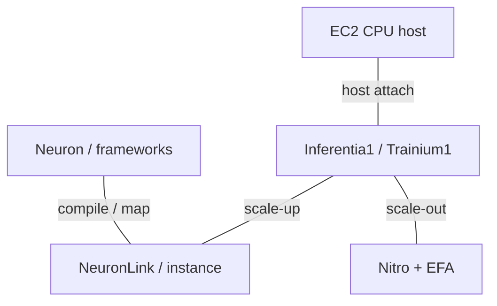
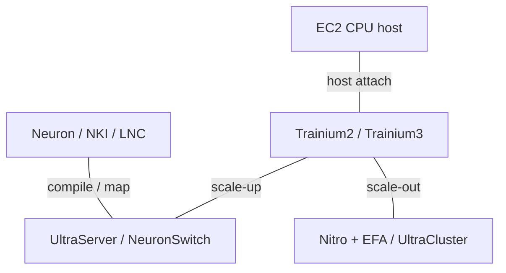

# AWS AI Infrastructure Architecture Evolution

2015-2026 | 2026-09-28

## 01 Scope and executive synthesis

Deep coverage: Graviton CPUs and Inferentia/Trainium accelerators. Full coverage: NeuronLink, UltraServer, Nitro, EFA and the Neuron software model. Period: 2015-28 September 2026; the CPU product sequence starts in 2018. FPGA instances and third-party GPUs are complementary context, not AWS-designed silicon. Reviewed milestones include re:Invent 2024/2025 materials, Graviton5 general availability in June 2026, and current Neuron architecture documentation.

AWS’s architectural strategy is to make specialization deployable through a stable cloud service boundary. Graviton supplies general compute; Trainium and Inferentia supply model compute; Nitro supplies isolation and infrastructure offload; EFA supplies distributed communication. The economic unit is an instance or a tightly connected system with a supported software stack. The principal engineering question is how much specialized silicon can be exposed without forcing customers to operate a bespoke machine.

## 02 Numerical and availability conventions

CPU counts are per package, not the largest multi-socket EC2 instance. A Graviton vCPU represents a physical core rather than an SMT thread. Accelerator figures are per physical device and dense; cFP8, FP8 and MXFP8 are not interchangeable formats. HBM GiB and GB are retained as published. NeuronLink totals whose direction is unspecified remain quoted totals rather than invented one-way bandwidth. Service GA, preview and future roadmap are separate statuses. n/d means not established; n/a means not applicable.

## 03 Graviton1 and Graviton2: establishing the platform

The first Graviton A1 instances established an Arm64 deployment path in 2018. Graviton2 made that path a broad server platform through 64 Neoverse N1 cores, private L2 caches and an eight-channel memory interface. The move was more than an ISA substitution: software builds, native libraries, runtime optimization and instance sizing had to become routine. A single-thread-per-core model also changes the meaning of a vCPU when comparing against an SMT-based x86 instance.

Architectural interpretation: the migration succeeds when an application’s dependency graph is portable and its working set fits the memory and cache envelope. The useful experiments are fleet-representative throughput and tail latency at a fixed service objective. Compiler-generated Arm code is necessary but insufficient: synchronization primitives, cryptography, compression and managed runtimes can determine whether silicon resources translate into service capacity.

## 04 Graviton3-5: vector growth and a new chiplet boundary

Graviton3 kept 64 cores while moving to Neoverse V1 and DDR5; Graviton3E is a related HPC-oriented variant rather than a separate ISA generation. Graviton4 increased the package to 96 Neoverse V2 cores and twelve DDR5 channels, with two-socket configurations exposed in selected large instances. Wider aggregate vector capability should not be confused with a fixed architectural SVE vector length: the V1 and V2 implementations organize their datapaths differently.

Graviton5 changes the partitioning: four chiplets each integrate 48 cores, memory controllers and PCIe controllers. The package has 192 cores and 192 MB L3, supports DDR5-8800 and PCIe 6, and uses Neoverse V3. The previous separate I/O and memory-controller dies disappear from this organization. The vendor quotes up to 420 GB/s between chiplets without fully specifying the directional basis; it is retained as a quoted link figure. NUMA and cache partitioning must be interpreted at the selected VM size, not inferred from the package total.

Architectural implication: placing memory controllers beside compute can reduce traffic that crosses a dedicated I/O boundary, but distributed controllers make locality and allocation policy more important. Doubling core count with twelve channels also means that per-core peak DRAM bandwidth need not rise with package bandwidth. Larger L3 can reduce traffic, but it cannot remove the streaming bandwidth limit. These two effects should be measured separately before attributing an application gain to core IPC.

### Graviton generations

| Generation / reference SKU | Codename | GA | Status | Core µarch | Cores / threads | Process per die | Dies / packaging | L2 per core | L3 / domain | Memory: channels; rate; GB/s | Sockets / links | PCIe / CXL | TDP | Vector / matrix ISA |
| --- | --- | --- | --- | --- | --- | --- | --- | --- | --- | --- | --- | --- | --- | --- |
| Graviton / A1 | n/d | 2018 | Historical shipping | Arm64 | 16 / 16 | n/d | n/d | n/d | n/d | DDR4; n/d | n/d | n/d | n/d | Arm64 |
| Graviton2 | n/d | 2020 | Shipping / available | Neoverse N1 | 64 / 64 | n/d | n/d | 1 MB | 32 MB | 8 × DDR4; rate n/d | 1 | n/d | n/d | 2 × 128-bit Neon |
| Graviton3 / 3E | n/d | 2022 / 2023 | Shipping / available | Neoverse V1 | 64 / 64 | n/d | 7 dies; split compute/memory/I/O | 1 MB | 32 MB | 8 × DDR5; rate n/d | 1 | n/d | n/d | 2 × 256-bit SVE; BF16 |
| Graviton4 | n/d | 2024 | Shipping / available | Neoverse V2 | 96 / 96 | n/d | Separate controller dies | 2 MB | 36 MB | 12 × DDR5-5600; 537.6 GB/s | 1-2; link n/d | n/d | n/d | 4 × 128-bit SVE; SVE2 |
| Graviton5 | n/d | 2026-06-10 | Shipping / available | Neoverse V3 | 192 / 192 | 3 nm | 4 × 48-core chiplets | 2 MB | 192 MB package; VM partitioned | 12 × DDR5-8800; 844.8 GB/s | NUMA 2/4 regions physical | PCIe 6; CXL n/d | n/d | 4 × 128-bit SVE; Armv9.2 |

## 05 Inferentia and Trainium1: the NeuronCore foundation

Inferentia1 combines four NeuronCore-v1 units with external DRAM. It targets inference and benefits from pipelining work through cores. Inferentia2 and Trainium1 use NeuronCore-v2, HBM, separate tensor/vector/scalar engines and programmable GPSIMD resources. This shared core lineage does not make the cloud products identical: Inf2 and Trn1 expose different chip counts, networking and intended workload envelopes. The move to HBM makes larger models practical while increasing the importance of explicit data movement.

Software-managed SBUF and accumulation storage are architectural resources, not transparent caches. A kernel must arrange tensors to fit the array’s contraction dimension and the scratchpad’s partitioning. DMA overlap is therefore part of the algorithm. This is a useful distinction from a superficial “GPU alternative” description: the compiler and kernel author carry substantial responsibility for locality, even when a framework hides that responsibility from the model author.

## 06 Trainium2, Trainium3 and the Trainium4 roadmap

Trainium2 expands to eight NeuronCore-v3 units, larger on-chip storage and a 96 GiB HBM system. Logical NeuronCore configuration can combine physical resources behind a larger logical core. Dedicated collective-control cores support communication alongside computation. Trn2 UltraServers extend the directly connected resource pool beyond one conventional server, so both the physical core count and the logical execution mode matter when interpreting utilization.

Trainium3 retains eight physical cores but changes the low-precision datapath. The NKI guide explains quad-packed microscaling inputs on a physical 128×128 array, presenting a larger logical contraction dimension. The overview gives 2,517 TFLOPS for MXFP8/MXFP4 and 671 TFLOPS for dense BF16. Thus the headline low-precision improvement is not a universal BF16 improvement. Trn3 UltraServers reach 144 chips and use NeuronSwitch-v1; their aggregate improvement also includes a larger chip count.

Trainium4 remains a roadmap item in the reviewed disclosure. AWS states intended NVLink Fusion support alongside Graviton and EFA in MGX-based infrastructure. This is a future integration direction, not a reason to relabel existing NeuronLink systems as NVLink systems. Qualification must ultimately cover memory semantics, collective software, fault handling and topology as well as physical link compatibility.

## 07 Accelerator comparison

### Inferentia and Trainium

| Product | Architecture | GA / milestone | Status | Process | Dies / packaging | Compute units | Dense BF16 | Dense FP8 | Dense FP6 / FP4 | FP64 vector / matrix | Memory: type; stacks; GB; TB/s | LLC / SRAM | Scale-up: links; GB/s per direction; domain | Host link | Power / cooling | Form factor |
| --- | --- | --- | --- | --- | --- | --- | --- | --- | --- | --- | --- | --- | --- | --- | --- | --- |
| Inferentia1 | NeuronCore-v1 | 2019 | Historical shipping | n/d | n/d | 4 | 64 TFLOPS | n/a | n/a | n/d | DRAM; 8 GiB; 50 GiB/s | n/d | NeuronLink; n/d | n/d | n/d | AWS platform |
| Trainium1 | NeuronCore-v2 | 2022 | Shipping / available | n/d | n/d | 2 | 190 TFLOPS | 190 cFP8 TFLOPS | n/a | n/d | HBM; 32 GiB; 820 GiB/s | 48 MiB SBUF | NeuronLink-v2; 16 chips | n/d | n/d | AWS platform |
| Inferentia2 | NeuronCore-v2 | 2023 | Shipping / available | n/d | n/d | 2 | 190 TFLOPS | 190 cFP8 TFLOPS | n/a | n/d | HBM; 32 GiB; 820 GiB/s | n/d | NeuronLink-v2; ≤12 chips/instance | n/d | n/d | AWS platform |
| Trainium2 | NeuronCore-v3 | 2024-12 | Shipping / available | n/d | n/d | 8 | 667 TFLOPS | 1,299 TFLOPS | n/a | n/d | HBM; 96 GiB; 2.9 TB/s | 224 MiB SBUF | 1.28 TB/s quoted; 64 chips | n/d | n/d | AWS platform |
| Trainium3 | NeuronCore-v4 | 2025-12 | Shipping / available | 3 nm | n/d | 8 | 671 TFLOPS | 2,517 MXFP8 TFLOPS | 2,517 MXFP4 TFLOPS | n/d | HBM3e; 144 GiB; 4.9 TB/s | 256 MiB SBUF | 2.56 TB/s quoted; 144 chips | n/d | n/d | AWS platform |
| Trainium4 | n/d | n/d | Roadmap | n/d | n/d | n/d | n/d | n/d | n/d | n/d | n/d | n/d | NVLink Fusion planned | n/d | n/d | AWS platform |

Source reconciliation: the current Trainium3 overview reports 4.9 TB/s HBM and 16 collective cores; the NKI guide gives 4.7 TB/s and 20 CC-Cores in its introductory list. The overview is used consistently for package comparison, while the guide supports datapath discussion. Likewise, Trainium1 is rounded to 190 TFLOPS in its own guide and 191 in a later comparison. These discrepancies are retained in the evidence record rather than silently combined.

## 08 Nitro and EFA: infrastructure versus AI traffic

Nitro separates much of the networking, storage and management work from customer CPU execution. Its security chip, cards and minimal hypervisor form a system, not a single AI NIC. Successive Nitro versions appear across EC2 CPU and accelerator families; their network limits depend on the instance. Nitro v6 is publicly associated with the 2025 generation of network-optimized instances. The 2026 Nitro Isolation Engine adds a formally verified isolation component, which is a specific security property rather than proof that every part of the system is formally verified.

EFA presents an application communication interface backed by AWS’s scalable reliable datagram transport. Multipath delivery and fast recovery address the variability of a shared datacenter network. The accelerator collective library, provider interface, EFA device and underlying fabric are separate layers. Their combined behavior determines job performance; a port line rate alone says little about small-message latency, tail behavior or communication-compute overlap. ENA front-end traffic and EFA collective traffic should also remain distinct in the system map.

### Offload and network families

| Product | GA / milestone | Status | Class | Ports × speed | SerDes | Host interface | Programmable engine | Embedded CPU | On-card memory | Transport / RDMA | Congestion control | Key offloads | Power |
| --- | --- | --- | --- | --- | --- | --- | --- | --- | --- | --- | --- | --- | --- |
| Nitro System | 2017 onward | Shipping / available | Infrastructure offload / isolation | Instance-dependent | n/d | PCIe; n/d | n/d | n/d | n/d | ENA / EBS | n/d | VPC, storage, management | n/d |
| EFA | 2019 onward | Shipping / available | AI / HPC network interface | Instance-dependent | n/d | n/d | n/d | n/d | n/d | SRD / libfabric | Multipath / recovery | OS-bypass communication | n/d |
| NeuronSwitch-v1 | 2025 | Shipping / available | Scale-up switch | n/d | n/d | n/a | n/d | n/d | n/d | NeuronLink | n/d | Device fabric | n/d |

## 09 Systems, software and bandwidth hierarchy

Neuron provides graph compilation, runtime, libraries and framework integration. NKI exposes the hardware memory hierarchy to specialist kernel authors; logical-core configuration changes how physical resources are presented. A production migration should track supported operators, compilation cost, numerical behavior, profiling and collective overlap together. AWS FPGA instances remain a programmable acceleration option, while GPUs remain part of the same cloud portfolio; neither is evidence that AWS designed the underlying third-party silicon.

### System progression

| Platform | Year / milestone | CPU / accelerator count | Scale-up domain | Scale-out per accelerator | Rack power | Cooling |
| --- | --- | --- | --- | --- | --- | --- |
| Trn1 | 2022 | 16 Trainium1 | 16 | Instance-dependent; n/d here | n/d | n/d |
| Trn2 UltraServer | 2024 | 64 Trainium2 | 64 | n/d | n/d | n/d |
| Trn3 UltraServer | 2025 | 144 Trainium3 | 144 | n/d | n/d | n/d |

### Interconnect lineage

| Interconnect | Year / generation | Lane rate | Lanes / link | GB/s per link per direction | Links / device | Topology | Domain limit | Coherence / semantics |
| --- | --- | --- | --- | --- | --- | --- | --- | --- |
| NeuronLink-v2 | 2022 | n/d | n/d | n/d | n/d | n/d | 16 | Device communication; not CPU coherence |
| NeuronLink-v3 | 2024 | n/d | n/d | n/d | n/d | n/d | 64 | Device communication; not CPU coherence |
| NeuronLink-v4 | 2025 | n/d | n/d | n/d | n/d | NeuronSwitch-v1 | 144 | Device communication; not CPU coherence |
| NVLink Fusion | n/d | n/d | n/d | n/d | n/d | Planned | n/d | Device communication; not CPU coherence |

### 2019-2022 integrated stack

Logical data and control paths. Graviton is not assumed to host every historical accelerator instance.

### 2024-2026 integrated stack

Logical data and control paths. Graviton is not assumed to host every historical accelerator instance.

## 10 Derived balance and engineering consequences

### Per-device derived ratios

| Device | Memory BW / BF16, B/FLOP | BW / low-precision, B/FLOP | Capacity / BF16, B·s/FLOP | Performance / W |
| --- | --- | --- | --- | --- |
| Trainium1 | 0.004634 | 0.004634 | 0.0001808 | n/d |
| Trainium2 | 0.004348 | 0.002232 | 0.0001545 | n/d |
| Trainium3 | 0.007303 | 0.001947 | 0.0002304 | n/d |

Derived CPU balance: Graviton4 provides 537.6/96 = 5.6 GB/s per core; Graviton5 provides 844.8/192 = 4.4 GB/s per core, a 21.4% reduction in this theoretical streaming metric. Package L3 per core rises from 0.375 MB to 1 MB, before VM partitioning. The architectural bet is that improved cores, more cache and locality compensate for less bandwidth per core on enough real workloads. A streaming workload and a large instruction-footprint service can therefore move in opposite directions.

For accelerators, Trainium3 improves memory bandwidth per BF16 FLOP substantially because BF16 compute remains nearly flat while memory bandwidth rises. Against its faster MX datapath, the bandwidth balance is tighter. This is why a procurement model should carry separate BF16 and microscaling rooflines, and why a token-throughput claim needs batch size and latency limits. System-level gains also depend on whether the model can exploit the enlarged scale-up domain without adding excessive communication or idle capacity.

## 11 Conference map, software timeline and naming

### Verified disclosure channels

| Venue | Year | Paper / talk / disclosure | Presenter / authors | Product | Evidence type | Source |
| --- | --- | --- | --- | --- | --- | --- |
| re:Invent | 2024 | CMP207 AWS accelerated computing | AWS | Trainium2 / Nitro / EFA | Architecture and systems | C01 |
| re:Invent | 2025 | Trainium3 and Trainium4 outlook | AWS | Trainium3 / 4 | GA / roadmap | E02 E04 |
| AWS Summit | 2022 | The journey of silicon innovation at AWS | AWS | Graviton / Nitro | Portfolio and systems | C02 |
| Amazon Science | 2026 | Graviton5 chiplet architecture | Ali Saidi | Graviton5 | Vendor technical disclosure; not conference paper | E01 |

The reviewed corpus supports stronger implementation coverage through AWS architecture guides than through a verified ISCA/MICRO/HPCA/ASPLOS or ISSCC product-paper sequence. No such sequence is invented. Hot Chips was searched, but no specific AWS generation talk is used as an implementation source in this edition. This is a disclosure-channel difference from Google, not evidence of less architectural sophistication. re:Invent materials establish deployment and system context; Neuron and Graviton guides supply the detailed programming-visible architecture.

### Hardware and software alignment

| Release | Date | Hardware | Feature |
| --- | --- | --- | --- |
| NeuronCore-v1 support | 2019 | Inferentia1 | Inference compilation / pipeline |
| NeuronCore-v2 support | 2022-2023 | Trainium1 / Inferentia2 | Dynamic shapes; GPSIMD operators |
| NKI / LNC | 2024-2026 | Trainium2 / 3 | Explicit kernels / logical cores |

### Product crosswalk

| Silicon | Service | Core / fabric |
| --- | --- | --- |
| Inferentia1 / 2 | Inf1 / Inf2 | NeuronCore-v1 / v2 |
| Trainium1 / 2 / 3 | Trn1 / Trn2 / Trn3 | NeuronCore-v2 / v3 / v4 |
| Graviton5 | M9g / related families | Neoverse V3; Nitro |

Open implementation fields include package power, precise per-die process and packaging information for several accelerator generations, and fully directional NeuronLink electrical specifications. The system tables keep rack power and per-accelerator EFA bandwidth n/d when the selected configuration is not fixed. The next decision-relevant evidence is a matched workload comparison with compilation and communication costs included, rather than an extrapolation from chip peak to fleet efficiency.

## Source map

01 Scope and executive synthesis — C01, E01, E02, E03, P01, P02, P03, P04, P07, P08

02 Numerical and availability conventions — P01, P02, P03, P04, P06

03 Graviton1 and Graviton2: establishing the platform — C01, P01

04 Graviton3-5: vector growth and a new chiplet boundary — E01, E03, E05, E06, E07, P01

05 Inferentia and Trainium1: the NeuronCore foundation — P02, P05, P06, P09

06 Trainium2, Trainium3 and the Trainium4 roadmap — C01, E02, P03, P04, P09

07 Accelerator comparison — E02, E04, E08, E09, P02, P03, P04, P05, P06, P09

08 Nitro and EFA: infrastructure versus AI traffic — E01, E02, P07, P08, P10, P11

09 Systems, software and bandwidth hierarchy — C01, E02, P02, P03, P04, P09

10 Derived balance and engineering consequences — E01, E02, E05, P01, P02, P03, P04, P09

11 Conference map, software timeline and naming — C01, C02, E01, E02, E03, E04, P01, P02, P03, P04, P05, P06, P08, P09

## References

### Product and technical documentation

[P01] AWS Graviton technical guide. [https://raw.githubusercontent.com/aws/aws-graviton-getting-started/main/README.md](https://raw.githubusercontent.com/aws/aws-graviton-getting-started/main/README.md). Primary source; accessed by 2026-09-28

[P02] Trainium architecture. [https://awsdocs-neuron.readthedocs-hosted.com/en/latest/about-neuron/arch/neuron-hardware/trainium.html](https://awsdocs-neuron.readthedocs-hosted.com/en/latest/about-neuron/arch/neuron-hardware/trainium.html). Primary source; accessed by 2026-09-28

[P03] Trainium2 architecture. [https://awsdocs-neuron.readthedocs-hosted.com/en/latest/about-neuron/arch/neuron-hardware/trainium2.html](https://awsdocs-neuron.readthedocs-hosted.com/en/latest/about-neuron/arch/neuron-hardware/trainium2.html). Primary source; accessed by 2026-09-28

[P04] Trainium3 architecture. [https://awsdocs-neuron.readthedocs-hosted.com/en/latest/about-neuron/arch/neuron-hardware/trainium3.html](https://awsdocs-neuron.readthedocs-hosted.com/en/latest/about-neuron/arch/neuron-hardware/trainium3.html). Primary source; accessed by 2026-09-28

[P05] Inferentia architecture. [https://awsdocs-neuron.readthedocs-hosted.com/en/latest/about-neuron/arch/neuron-hardware/inferentia.html](https://awsdocs-neuron.readthedocs-hosted.com/en/latest/about-neuron/arch/neuron-hardware/inferentia.html). Primary source; accessed by 2026-09-28

[P06] Inferentia2 architecture. [https://awsdocs-neuron.readthedocs-hosted.com/en/latest/about-neuron/arch/neuron-hardware/inferentia2.html](https://awsdocs-neuron.readthedocs-hosted.com/en/latest/about-neuron/arch/neuron-hardware/inferentia2.html). Primary source; accessed by 2026-09-28

[P07] Security design of the AWS Nitro System. [https://docs.aws.amazon.com/whitepapers/latest/security-design-of-aws-nitro-system/security-design-of-aws-nitro-system.html](https://docs.aws.amazon.com/whitepapers/latest/security-design-of-aws-nitro-system/security-design-of-aws-nitro-system.html). Indexed record or searchable official page; product details cross-checked with the associated technical document.

[P08] Elastic Fabric Adapter. [https://docs.aws.amazon.com/AWSEC2/latest/UserGuide/efa.html](https://docs.aws.amazon.com/AWSEC2/latest/UserGuide/efa.html). Indexed record or searchable official page; product details cross-checked with the associated technical document.

[P09] Trainium3 NKI architecture guide. [https://awsdocs-neuron.readthedocs-hosted.com/en/latest/nki/guides/architecture/trainium3_arch.html](https://awsdocs-neuron.readthedocs-hosted.com/en/latest/nki/guides/architecture/trainium3_arch.html). Primary source; accessed by 2026-09-28

[P10] EC2 Nitro versions. [https://docs.aws.amazon.com/ec2/latest/instancetypes/ec2-nitro-instances.html](https://docs.aws.amazon.com/ec2/latest/instancetypes/ec2-nitro-instances.html). Indexed record or searchable official page; product details cross-checked with the associated technical document.

[P11] SRD transport. [https://docs.aws.amazon.com/wellarchitected/2023-10-03/framework/perf_networking_choose_network_protocols_improve_performance.html](https://docs.aws.amazon.com/wellarchitected/2023-10-03/framework/perf_networking_choose_network_protocols_improve_performance.html). Indexed record or searchable official page; product details cross-checked with the associated technical document.

### Conference records and implementation disclosures

[C01] AWS accelerated computing, re:Invent 2024 CMP207. [https://d1.awsstatic.com/onedam/marketing-channels/website/aws/en_US/events/approved/reinvent-2025/reinvent/2024/slides/cmp/CMP207_AWS-accelerated-computing-enables-customer-success-with-generative-AI.pdf](https://d1.awsstatic.com/onedam/marketing-channels/website/aws/en_US/events/approved/reinvent-2025/reinvent/2024/slides/cmp/CMP207_AWS-accelerated-computing-enables-customer-success-with-generative-AI.pdf). Primary source; accessed by 2026-09-28

[C02] AWS Summit2022 silicon innovation. [https://d1.awsstatic.com/events/Summits/aws-summits/The_journey_of_silicon_innovation_at_AWS_CMP201.pdf](https://d1.awsstatic.com/events/Summits/aws-summits/The_journey_of_silicon_innovation_at_AWS_CMP201.pdf). Primary source; accessed by 2026-09-28

### Launches, ecosystem and deployment

[E01] Graviton5 chiplet architecture. [https://www.amazon.science/blog/graviton5s-improved-design-increases-speed-and-energy-efficiency-beyond-moores-law](https://www.amazon.science/blog/graviton5s-improved-design-increases-speed-and-energy-efficiency-beyond-moores-law). Primary source; accessed by 2026-09-28

[E02] Trainium3 UltraServers and Trainium4 outlook. [https://www.aboutamazon.com/news/aws/trainium-3-ultraserver-faster-ai-training-lower-cost](https://www.aboutamazon.com/news/aws/trainium-3-ultraserver-faster-ai-training-lower-cost). Primary source; accessed by 2026-09-28

[E03] Graviton5 M9g general availability. [https://aws.amazon.com/blogs/aws/now-available-amazon-ec2-m9g-and-m9gd-instances-powered-by-new-aws-graviton5-processors/](https://aws.amazon.com/blogs/aws/now-available-amazon-ec2-m9g-and-m9gd-instances-powered-by-new-aws-graviton5-processors/). Indexed record or searchable official page; product details cross-checked with the associated technical document.

[E04] Trainium3 general availability. [https://aws.amazon.com/about-aws/whats-new/2025/12/amazon-ec2-trn3-ultraservers/](https://aws.amazon.com/about-aws/whats-new/2025/12/amazon-ec2-trn3-ultraservers/). Indexed record or searchable official page; product details cross-checked with the associated technical document.

[E05] Graviton4 memory architecture. [https://aws.amazon.com/blogs/aws/join-the-preview-for-new-memory-optimized-aws-graviton4-powered-amazon-ec2-instances-r8g/](https://aws.amazon.com/blogs/aws/join-the-preview-for-new-memory-optimized-aws-graviton4-powered-amazon-ec2-instances-r8g/). Indexed record or searchable official page; product details cross-checked with the associated technical document.

[E06] Graviton3 C7g GA. [https://aws.amazon.com/blogs/aws/new-amazon-ec2-c7g-instances-powered-by-aws-graviton3-processors/](https://aws.amazon.com/blogs/aws/new-amazon-ec2-c7g-instances-powered-by-aws-graviton3-processors/). Indexed record or searchable official page; product details cross-checked with the associated technical document.

[E07] Graviton A1 launch. [https://aws.amazon.com/blogs/aws/new-ec2-instances-a1-powered-by-arm-based-aws-graviton-processors/](https://aws.amazon.com/blogs/aws/new-ec2-instances-a1-powered-by-arm-based-aws-graviton-processors/). Indexed record or searchable official page; product details cross-checked with the associated technical document.

[E08] Inferentia Inf1 launch. [https://aws.amazon.com/blogs/aws/amazon-ec2-inf1-instances-with-aws-inferentia-chips-for-high-performance-cost-effective-machine-learning-inference/](https://aws.amazon.com/blogs/aws/amazon-ec2-inf1-instances-with-aws-inferentia-chips-for-high-performance-cost-effective-machine-learning-inference/). Indexed record or searchable official page; product details cross-checked with the associated technical document.

[E09] Inf2 instances. [https://aws.amazon.com/ec2/instance-types/inf2/](https://aws.amazon.com/ec2/instance-types/inf2/). Indexed record or searchable official page; product details cross-checked with the associated technical document.
