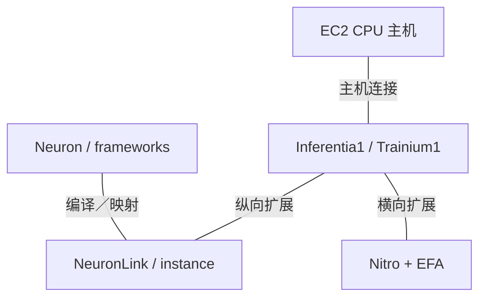
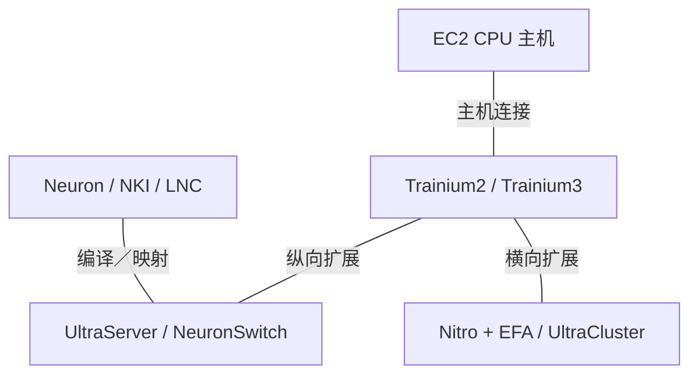

# AWS AI 基础设施架构演进

2015-2026 | 2026-09-28

## 01 范围与核心判断

深入覆盖 Graviton CPU 与 Inferentia／Trainium 加速器；完整覆盖 NeuronLink、UltraServer、Nitro、EFA 及 Neuron 软件模型。时间范围为 2015 年至 2026 年 9 月 28 日；CPU 产品序列始于 2018 年。FPGA 实例和第三方 GPU 作为配套背景，不归为 AWS 自研芯片。已审阅的里程碑包括 re:Invent 2024／2025 资料、2026 年 6 月 Graviton5 正式商用，以及当前 Neuron 架构文档。

AWS 的架构策略，是通过稳定的云服务边界交付专用化能力。Graviton 提供通用计算，Trainium 与 Inferentia 提供模型计算，Nitro 提供隔离及基础设施卸载，EFA 提供分布式通信。经济评价单位是配有受支持软件栈的实例或紧耦合系统。核心工程问题是：在不要求客户运维专用机器的前提下，能暴露多少专用芯片能力。

## 02 数值与可用性口径

CPU 数量以封装为单位，不以最大多插槽 EC2 实例为单位。Graviton vCPU 对应物理核心，而不是 SMT 线程。加速器规格按物理设备计，采用稠密值；cFP8、FP8 与 MXFP8 不是可随意互换的格式。HBM 的 GiB 与 GB 保留资料原始单位。对未明确方向的 NeuronLink 总带宽，仅记录原始总量，不推造单方向值。服务正式商用、预览和未来路线图分别记录。n/d 表示未确定，n/a 表示不适用。

## 03 Graviton1 与 Graviton2：建立平台

首代 Graviton A1 实例于 2018 年建立 Arm64 部署路径。Graviton2 通过 64 个 Neoverse N1 核心、私有 L2 和八通道内存接口，把这一路径扩展成通用服务器平台。变化不只是替换 ISA：软件构建、原生库、运行时优化和实例配置都必须成为常规流程。单线程核心模型也改变了 vCPU 的含义，不能直接与启用 SMT 的 x86 实例按 vCPU 数量比较。

架构解读：迁移能否成功，取决于应用依赖是否可移植，以及工作集是否适合其内存和缓存配置。有效实验应在固定服务目标下测量代表真实机群的吞吐及尾延迟。编译器能生成 Arm 代码是必要条件，但并不充分；同步原语、加密、压缩及托管运行时，可能决定芯片资源能否转化为服务容量。

## 04 Graviton3-5：向量能力与芯粒边界演进

Graviton3 保持 64 核，转向 Neoverse V1 和 DDR5；Graviton3E 是相关的 HPC 优化变体，不是独立 ISA 代际。Graviton4 增至每封装 96 个 Neoverse V2 核心和十二个 DDR5 通道，部分大型实例提供双插槽配置。更强的聚合向量能力不能等同于固定的 SVE 架构向量长度：V1 和 V2 的数据通路组织不同。

Graviton5 改变分区方式：四颗芯粒分别集成 48 核、内存控制器及 PCIe 控制器。封装共 192 核、192 MB L3，支持 DDR5-8800 和 PCIe 6，采用 Neoverse V3。此前独立的 I/O 与内存控制器裸片不再出现在这种组织中。厂商公布芯粒间最高 420 GB/s，但未完整说明方向口径，本报告保留为原始链路数值。NUMA 与缓存分区必须结合所选 VM 大小理解，不能仅从封装总量推断。

架构含义：把内存控制器放在计算旁边，可减少跨独立 I/O 边界的流量，但分布式控制器提高了局部性与分配策略的重要性。核心数翻倍而仍为十二通道，也意味着每核 DRAM 峰值带宽不一定随封装总带宽增长。更大 L3 可以减少流量，却不能消除流式访问的带宽上限。在把应用提升归因于核心 IPC 之前，应分别测量这两种效应。

### Graviton 代际

| 代际／参考 SKU | 代号 | 正式商用 | 状态 | 核心微架构 | 核心／线程 | 各裸片工艺 | 裸片／封装 | 每核 L2 | L3／共享域 | 内存：通道；速率；GB/s | 插槽／互联 | PCIe／CXL | TDP | 向量／矩阵 ISA |
| --- | --- | --- | --- | --- | --- | --- | --- | --- | --- | --- | --- | --- | --- | --- |
| Graviton / A1 | n/d | 2018 | 历史已商用 | Arm64 | 16 / 16 | n/d | n/d | n/d | n/d | DDR4; n/d | n/d | n/d | n/d | Arm64 |
| Graviton2 | n/d | 2020 | 已商用／可获取 | Neoverse N1 | 64 / 64 | n/d | n/d | 1 MB | 32 MB | 8 × DDR4; 速率 n/d | 1 | n/d | n/d | 2 × 128-bit Neon |
| Graviton3 / 3E | n/d | 2022 / 2023 | 已商用／可获取 | Neoverse V1 | 64 / 64 | n/d | 7 裸片；计算／内存／I/O 分离 | 1 MB | 32 MB | 8 × DDR5; 速率 n/d | 1 | n/d | n/d | 2 × 256-bit SVE; BF16 |
| Graviton4 | n/d | 2024 | 已商用／可获取 | Neoverse V2 | 96 / 96 | n/d | 独立控制器裸片 | 2 MB | 36 MB | 12 × DDR5-5600; 537.6 GB/s | 1-2；链路 n/d | n/d | n/d | 4 × 128-bit SVE; SVE2 |
| Graviton5 | n/d | 2026-06-10 | 已商用／可获取 | Neoverse V3 | 192 / 192 | 3 nm | 4 × 48 核芯粒 | 2 MB | 封装 192 MB；按 VM 分区 | 12 × DDR5-8800; 844.8 GB/s | 物理 NUMA 2／4 域 | PCIe 6; CXL n/d | n/d | 4 × 128-bit SVE; Armv9.2 |

## 05 Inferentia 与 Trainium1：NeuronCore 基础

Inferentia1 组合四个 NeuronCore-v1 与外部 DRAM，面向推理，可通过核心间流水处理获益。Inferentia2 和 Trainium1 采用 NeuronCore-v2、HBM、分离的张量／向量／标量引擎及可编程 GPSIMD 资源。共享核心谱系不意味着云产品相同：Inf2 和 Trn1 提供不同芯片数量、网络及目标负载配置。HBM 使更大模型成为可能，也提高了显式数据搬移的重要性。

软件管理的 SBUF 与累加存储是显式架构资源，不是透明缓存。内核必须按阵列归约维度和暂存区分区组织张量，因此 DMA 重叠本身就是算法的一部分。这比简单称为“GPU 替代品”更准确：即使框架向模型开发者隐藏这些责任，编译器及内核作者仍承担大量局部性管理工作。

## 06 Trainium2、Trainium3 与 Trainium4 路线图

Trainium2 扩展至八个 NeuronCore-v3、更大片上存储及 96 GiB HBM。Logical NeuronCore 配置可把多个物理资源组合为更大的逻辑核心。专用集合控制核心支持通信与计算并行。Trn2 UltraServer 把直接连接资源池扩展到传统单服务器之外，因此解释利用率时必须同时考虑物理核心数和逻辑执行模式。

Trainium3 保留八个物理核心，但改变低精度数据通路。NKI 指南说明，在物理 128×128 阵列上使用四元素打包的微缩放输入，向程序呈现更大的逻辑归约维度。概述给出 MXFP8／MXFP4 为 2,517 TFLOPS，稠密 BF16 为 671 TFLOPS。因此，低精度的显著提升不等于 BF16 普遍提升。Trn3 UltraServer 达到 144 芯片，使用 NeuronSwitch-v1；其系统聚合提升还包含芯片数增加的贡献。

在已审阅披露中，Trainium4 仍为路线图项目。AWS 表示计划支持 NVLink Fusion，并在基于 MGX 的基础设施中结合 Graviton 和 EFA。这是未来集成方向，不能据此把现有 NeuronLink 系统重新标为 NVLink 系统。最终验证不仅需要物理链路兼容，还应覆盖内存语义、集合软件、故障处理与拓扑。

## 07 加速器对照

### Inferentia 与 Trainium

| 产品 | 架构 | 商用／里程碑 | 状态 | 工艺 | 裸片／封装 | 计算单元 | 稠密 BF16 | 稠密 FP8 | 稠密 FP6／FP4 | FP64 向量／矩阵 | 内存：类型；堆栈；GB；TB/s | 末级缓存／SRAM | 纵向扩展：链路；单向 GB/s；域 | 主机连接 | 功耗／散热 | 形态 |
| --- | --- | --- | --- | --- | --- | --- | --- | --- | --- | --- | --- | --- | --- | --- | --- | --- |
| Inferentia1 | NeuronCore-v1 | 2019 | 历史已商用 | n/d | n/d | 4 | 64 TFLOPS | n/a | n/a | n/d | DRAM; 8 GiB; 50 GiB/s | n/d | NeuronLink; n/d | n/d | n/d | AWS 平台 |
| Trainium1 | NeuronCore-v2 | 2022 | 已商用／可获取 | n/d | n/d | 2 | 190 TFLOPS | 190 cFP8 TFLOPS | n/a | n/d | HBM; 32 GiB; 820 GiB/s | 48 MiB SBUF | NeuronLink-v2; 16 芯片 | n/d | n/d | AWS 平台 |
| Inferentia2 | NeuronCore-v2 | 2023 | 已商用／可获取 | n/d | n/d | 2 | 190 TFLOPS | 190 cFP8 TFLOPS | n/a | n/d | HBM; 32 GiB; 820 GiB/s | n/d | NeuronLink-v2; ≤12 芯片/instance | n/d | n/d | AWS 平台 |
| Trainium2 | NeuronCore-v3 | 2024-12 | 已商用／可获取 | n/d | n/d | 8 | 667 TFLOPS | 1,299 TFLOPS | n/a | n/d | HBM; 96 GiB; 2.9 TB/s | 224 MiB SBUF | 1.28 TB/s 原文标称; 64 芯片 | n/d | n/d | AWS 平台 |
| Trainium3 | NeuronCore-v4 | 2025-12 | 已商用／可获取 | 3 nm | n/d | 8 | 671 TFLOPS | 2,517 MXFP8 TFLOPS | 2,517 MXFP4 TFLOPS | n/d | HBM3e; 144 GiB; 4.9 TB/s | 256 MiB SBUF | 2.56 TB/s 原文标称; 144 芯片 | n/d | n/d | AWS 平台 |
| Trainium4 | n/d | n/d | 路线图 | n/d | n/d | n/d | n/d | n/d | n/d | n/d | n/d | n/d | NVLink Fusion 计划 | n/d | n/d | AWS 平台 |

资料对照：当前 Trainium3 概述给出 4.9 TB/s HBM 与 16 个集合核心，NKI 指南开头则给出 4.7 TB/s 与 20 个 CC-Core。封装比较统一采用概述，数据通路讨论采用指南。另外，Trainium1 自身指南使用 190 TFLOPS，后续对比表使用 191。这些差异保留在证据记录中，不进行无说明的混合。

## 08 Nitro 与 EFA：基础设施和 AI 流量

Nitro 把大量网络、存储和管理工作与客户 CPU 执行分离。其安全芯片、板卡和精简虚拟机监控器构成系统，而不是单一 AI 网卡。后续 Nitro 版本分布于不同 EC2 CPU 与加速器系列，网络上限取决于实例。Nitro v6 已用于公开的 2025 年网络优化实例。2026 年 Nitro Isolation Engine 增加经过形式化验证的隔离组件；这是一项具体安全属性，不意味着整个系统的所有部分均经过形式化验证。

EFA 提供应用通信接口，其底层采用 AWS 的可扩展可靠数据报传输。多路径传输及快速恢复应对共享数据中心网络的波动。加速器集合库、接口提供者、EFA 设备和底层网络属于不同层次，共同行为决定作业性能；单看端口速率，无法说明小消息延迟、尾部行为或通信计算重叠。系统图还应区分 ENA 前端流量与 EFA 集合通信流量。

### 卸载与网络家族

| 产品 | 商用／里程碑 | 状态 | 类别 | 端口×速率 | SerDes | 主机接口 | 可编程引擎 | 嵌入式 CPU | 板载内存 | 传输／RDMA | 拥塞控制 | 主要卸载 | 功耗 |
| --- | --- | --- | --- | --- | --- | --- | --- | --- | --- | --- | --- | --- | --- |
| Nitro System | 2017 起 | 已商用／可获取 | 基础设施卸载／隔离 | 依实例 | n/d | PCIe; n/d | n/d | n/d | n/d | ENA / EBS | n/d | VPC、存储、管理 | n/d |
| EFA | 2019 起 | 已商用／可获取 | AI／HPC 网络接口 | 依实例 | n/d | n/d | n/d | n/d | n/d | SRD / libfabric | 多路径／恢复 | 绕过操作系统通信 | n/d |
| NeuronSwitch-v1 | 2025 | 已商用／可获取 | 纵向扩展交换机 | n/d | n/d | n/a | n/d | n/d | n/d | NeuronLink | n/d | 设备网络 | n/d |

## 09 系统、软件与带宽层次

Neuron 提供图编译、运行时、库和框架集成。NKI 向专业内核作者暴露硬件存储层次，逻辑核心配置则改变物理资源的呈现方式。生产迁移应共同跟踪算子支持、编译成本、数值行为、性能分析及集合通信重叠。AWS FPGA 实例仍提供可编程加速选择，GPU 也继续存在于同一云产品组合中；这些并不意味着底层第三方芯片由 AWS 设计。

### 系统演进

| 平台 | 年份／里程碑 | CPU／加速器数量 | 纵向扩展域 | 每加速器横向带宽 | 机架功耗 | 散热 |
| --- | --- | --- | --- | --- | --- | --- |
| Trn1 | 2022 | 16 Trainium1 | 16 | 依实例；此处 n/d | n/d | n/d |
| Trn2 UltraServer | 2024 | 64 Trainium2 | 64 | n/d | n/d | n/d |
| Trn3 UltraServer | 2025 | 144 Trainium3 | 144 | n/d | n/d | n/d |

### 互联谱系

| 互联 | 年份／代际 | 通道速率 | 每链路通道 | 每链路单向 GB/s | 每设备链路 | 拓扑 | 域规模 | 一致性／语义 |
| --- | --- | --- | --- | --- | --- | --- | --- | --- |
| NeuronLink-v2 | 2022 | n/d | n/d | n/d | n/d | n/d | 16 | 设备通信；非 CPU 一致性 |
| NeuronLink-v3 | 2024 | n/d | n/d | n/d | n/d | n/d | 64 | 设备通信；非 CPU 一致性 |
| NeuronLink-v4 | 2025 | n/d | n/d | n/d | n/d | NeuronSwitch-v1 | 144 | 设备通信；非 CPU 一致性 |
| NVLink Fusion | n/d | n/d | n/d | n/d | n/d | 计划 | n/d | 设备通信；非 CPU 一致性 |

### 2019-2022 集成技术栈

逻辑数据与控制路径；不假定所有历史加速器实例均采用 Graviton 主机。

### 2024-2026 集成技术栈

逻辑数据与控制路径；不假定所有历史加速器实例均采用 Graviton 主机。

## 10 推导平衡与工程后果

### 每设备推导比值

| 设备 | 存储带宽／BF16，B/FLOP | 带宽／低精度，B/FLOP | 容量／BF16，B·s/FLOP | 性能／W |
| --- | --- | --- | --- | --- |
| Trainium1 | 0.004634 | 0.004634 | 0.0001808 | n/d |
| Trainium2 | 0.004348 | 0.002232 | 0.0001545 | n/d |
| Trainium3 | 0.007303 | 0.001947 | 0.0002304 | n/d |

CPU 平衡推导：Graviton4 为 537.6/96 = 5.6 GB/s 每核，Graviton5 为 844.8/192 = 4.4 GB/s 每核，该理论流式指标下降 21.4%。VM 分区前的封装 L3 每核则从 0.375 MB 增至 1 MB。其架构选择，是依靠更强核心、更多缓存及局部性，在足够多真实负载上补偿每核带宽减少。因此，流式负载与指令工作集较大的服务，可能出现不同的性能趋势。

对加速器而言，Trainium3 的 BF16 算力基本不变而内存带宽提高，因此每 BF16 FLOP 的存储带宽明显改善；相对更快的 MX 数据通路，带宽平衡则更紧。采购模型应分别保留 BF16 与微缩放精度的 Roofline，token 吞吐表述也必须附带批量及延迟限制。系统收益还取决于模型能否利用扩大的纵向域，而不引入过多通信或闲置容量。

## 11 会议映射、软件时间线与命名

### 已核实披露渠道

| 会议／活动 | 年份 | 论文／演讲／披露 | 报告人／作者 | 产品 | 证据类型 | 来源 |
| --- | --- | --- | --- | --- | --- | --- |
| re:Invent | 2024 | CMP207 AWS accelerated computing | AWS | Trainium2 / Nitro / EFA | 架构与系统 | C01 |
| re:Invent | 2025 | Trainium3 and Trainium4 outlook | AWS | Trainium3 / 4 | 正式商用／路线图 | E02 E04 |
| AWS Summit | 2022 | The journey of silicon innovation at AWS | AWS | Graviton / Nitro | 产品组合与系统 | C02 |
| Amazon Science | 2026 | Graviton5 chiplet architecture | Ali Saidi | Graviton5 | 厂商技术披露；非会议论文 | E01 |

已审阅资料主要通过 AWS 架构指南提供实现细节，而非已经核实的 ISCA／MICRO／HPCA／ASPLOS 或 ISSCC 产品论文序列。本报告不虚构此类序列。已检索 Hot Chips，但本版未把某个 AWS 代际演讲作为实现来源。这是与 Google 不同的披露渠道，并不意味着架构技术较弱。re:Invent 资料建立部署与系统背景，Neuron 和 Graviton 指南提供编程可见的详细架构。

### 硬件与软件对应

| 版本 | 日期 | 硬件 | 特性 |
| --- | --- | --- | --- |
| NeuronCore-v1 支持 | 2019 | Inferentia1 | 推理编译／流水 |
| NeuronCore-v2 支持 | 2022-2023 | Trainium1 / Inferentia2 | 动态形状；GPSIMD 算子 |
| NKI / LNC | 2024-2026 | Trainium2 / 3 | 显式内核／逻辑核心 |

### 产品命名对照

| 芯片 | 服务 | 核心／网络 |
| --- | --- | --- |
| Inferentia1 / 2 | Inf1 / Inf2 | NeuronCore-v1 / v2 |
| Trainium1 / 2 / 3 | Trn1 / Trn2 / Trn3 | NeuronCore-v2 / v3 / v4 |
| Graviton5 | M9g / related families | Neoverse V3; Nitro |

仍未确定的实现字段包括封装功耗、部分加速器代际的逐裸片工艺和封装信息，以及完整说明方向的 NeuronLink 电气规格。当未固定具体配置时，系统表对机架功耗及每加速器 EFA 带宽保留 n/d。下一步对决策最有价值的证据，是把编译和通信成本纳入的同负载比较，而不是从芯片峰值外推机群效率。

## 来源映射

01 范围与核心判断 — C01, E01, E02, E03, P01, P02, P03, P04, P07, P08

02 数值与可用性口径 — P01, P02, P03, P04, P06

03 Graviton1 与 Graviton2：建立平台 — C01, P01

04 Graviton3-5：向量能力与芯粒边界演进 — E01, E03, E05, E06, E07, P01

05 Inferentia 与 Trainium1：NeuronCore 基础 — P02, P05, P06, P09

06 Trainium2、Trainium3 与 Trainium4 路线图 — C01, E02, P03, P04, P09

07 加速器对照 — E02, E04, E08, E09, P02, P03, P04, P05, P06, P09

08 Nitro 与 EFA：基础设施和 AI 流量 — E01, E02, P07, P08, P10, P11

09 系统、软件与带宽层次 — C01, E02, P02, P03, P04, P09

10 推导平衡与工程后果 — E01, E02, E05, P01, P02, P03, P04, P09

11 会议映射、软件时间线与命名 — C01, C02, E01, E02, E03, E04, P01, P02, P03, P04, P05, P06, P08, P09

## 参考资料

### 产品与技术文档

[P01] AWS Graviton technical guide. [https://raw.githubusercontent.com/aws/aws-graviton-getting-started/main/README.md](https://raw.githubusercontent.com/aws/aws-graviton-getting-started/main/README.md). 一手资料；访问截止 2026-09-28

[P02] Trainium architecture. [https://awsdocs-neuron.readthedocs-hosted.com/en/latest/about-neuron/arch/neuron-hardware/trainium.html](https://awsdocs-neuron.readthedocs-hosted.com/en/latest/about-neuron/arch/neuron-hardware/trainium.html). 一手资料；访问截止 2026-09-28

[P03] Trainium2 architecture. [https://awsdocs-neuron.readthedocs-hosted.com/en/latest/about-neuron/arch/neuron-hardware/trainium2.html](https://awsdocs-neuron.readthedocs-hosted.com/en/latest/about-neuron/arch/neuron-hardware/trainium2.html). 一手资料；访问截止 2026-09-28

[P04] Trainium3 architecture. [https://awsdocs-neuron.readthedocs-hosted.com/en/latest/about-neuron/arch/neuron-hardware/trainium3.html](https://awsdocs-neuron.readthedocs-hosted.com/en/latest/about-neuron/arch/neuron-hardware/trainium3.html). 一手资料；访问截止 2026-09-28

[P05] Inferentia architecture. [https://awsdocs-neuron.readthedocs-hosted.com/en/latest/about-neuron/arch/neuron-hardware/inferentia.html](https://awsdocs-neuron.readthedocs-hosted.com/en/latest/about-neuron/arch/neuron-hardware/inferentia.html). 一手资料；访问截止 2026-09-28

[P06] Inferentia2 architecture. [https://awsdocs-neuron.readthedocs-hosted.com/en/latest/about-neuron/arch/neuron-hardware/inferentia2.html](https://awsdocs-neuron.readthedocs-hosted.com/en/latest/about-neuron/arch/neuron-hardware/inferentia2.html). 一手资料；访问截止 2026-09-28

[P07] Security design of the AWS Nitro System. [https://docs.aws.amazon.com/whitepapers/latest/security-design-of-aws-nitro-system/security-design-of-aws-nitro-system.html](https://docs.aws.amazon.com/whitepapers/latest/security-design-of-aws-nitro-system/security-design-of-aws-nitro-system.html). 索引或可检索官方页面；产品细节同时参照对应技术文档。

[P08] Elastic Fabric Adapter. [https://docs.aws.amazon.com/AWSEC2/latest/UserGuide/efa.html](https://docs.aws.amazon.com/AWSEC2/latest/UserGuide/efa.html). 索引或可检索官方页面；产品细节同时参照对应技术文档。

[P09] Trainium3 NKI architecture guide. [https://awsdocs-neuron.readthedocs-hosted.com/en/latest/nki/guides/architecture/trainium3_arch.html](https://awsdocs-neuron.readthedocs-hosted.com/en/latest/nki/guides/architecture/trainium3_arch.html). 一手资料；访问截止 2026-09-28

[P10] EC2 Nitro versions. [https://docs.aws.amazon.com/ec2/latest/instancetypes/ec2-nitro-instances.html](https://docs.aws.amazon.com/ec2/latest/instancetypes/ec2-nitro-instances.html). 索引或可检索官方页面；产品细节同时参照对应技术文档。

[P11] SRD transport. [https://docs.aws.amazon.com/wellarchitected/2023-10-03/framework/perf_networking_choose_network_protocols_improve_performance.html](https://docs.aws.amazon.com/wellarchitected/2023-10-03/framework/perf_networking_choose_network_protocols_improve_performance.html). 索引或可检索官方页面；产品细节同时参照对应技术文档。

### 会议记录与实现披露

[C01] AWS accelerated computing, re:Invent 2024 CMP207. [https://d1.awsstatic.com/onedam/marketing-channels/website/aws/en_US/events/approved/reinvent-2025/reinvent/2024/slides/cmp/CMP207_AWS-accelerated-computing-enables-customer-success-with-generative-AI.pdf](https://d1.awsstatic.com/onedam/marketing-channels/website/aws/en_US/events/approved/reinvent-2025/reinvent/2024/slides/cmp/CMP207_AWS-accelerated-computing-enables-customer-success-with-generative-AI.pdf). 一手资料；访问截止 2026-09-28

[C02] AWS Summit2022 silicon innovation. [https://d1.awsstatic.com/events/Summits/aws-summits/The_journey_of_silicon_innovation_at_AWS_CMP201.pdf](https://d1.awsstatic.com/events/Summits/aws-summits/The_journey_of_silicon_innovation_at_AWS_CMP201.pdf). 一手资料；访问截止 2026-09-28

### 发布、生态与部署

[E01] Graviton5 chiplet architecture. [https://www.amazon.science/blog/graviton5s-improved-design-increases-speed-and-energy-efficiency-beyond-moores-law](https://www.amazon.science/blog/graviton5s-improved-design-increases-speed-and-energy-efficiency-beyond-moores-law). 一手资料；访问截止 2026-09-28

[E02] Trainium3 UltraServers and Trainium4 outlook. [https://www.aboutamazon.com/news/aws/trainium-3-ultraserver-faster-ai-training-lower-cost](https://www.aboutamazon.com/news/aws/trainium-3-ultraserver-faster-ai-training-lower-cost). 一手资料；访问截止 2026-09-28

[E03] Graviton5 M9g general availability. [https://aws.amazon.com/blogs/aws/now-available-amazon-ec2-m9g-and-m9gd-instances-powered-by-new-aws-graviton5-processors/](https://aws.amazon.com/blogs/aws/now-available-amazon-ec2-m9g-and-m9gd-instances-powered-by-new-aws-graviton5-processors/). 索引或可检索官方页面；产品细节同时参照对应技术文档。

[E04] Trainium3 general availability. [https://aws.amazon.com/about-aws/whats-new/2025/12/amazon-ec2-trn3-ultraservers/](https://aws.amazon.com/about-aws/whats-new/2025/12/amazon-ec2-trn3-ultraservers/). 索引或可检索官方页面；产品细节同时参照对应技术文档。

[E05] Graviton4 memory architecture. [https://aws.amazon.com/blogs/aws/join-the-preview-for-new-memory-optimized-aws-graviton4-powered-amazon-ec2-instances-r8g/](https://aws.amazon.com/blogs/aws/join-the-preview-for-new-memory-optimized-aws-graviton4-powered-amazon-ec2-instances-r8g/). 索引或可检索官方页面；产品细节同时参照对应技术文档。

[E06] Graviton3 C7g GA. [https://aws.amazon.com/blogs/aws/new-amazon-ec2-c7g-instances-powered-by-aws-graviton3-processors/](https://aws.amazon.com/blogs/aws/new-amazon-ec2-c7g-instances-powered-by-aws-graviton3-processors/). 索引或可检索官方页面；产品细节同时参照对应技术文档。

[E07] Graviton A1 launch. [https://aws.amazon.com/blogs/aws/new-ec2-instances-a1-powered-by-arm-based-aws-graviton-processors/](https://aws.amazon.com/blogs/aws/new-ec2-instances-a1-powered-by-arm-based-aws-graviton-processors/). 索引或可检索官方页面；产品细节同时参照对应技术文档。

[E08] Inferentia Inf1 launch. [https://aws.amazon.com/blogs/aws/amazon-ec2-inf1-instances-with-aws-inferentia-chips-for-high-performance-cost-effective-machine-learning-inference/](https://aws.amazon.com/blogs/aws/amazon-ec2-inf1-instances-with-aws-inferentia-chips-for-high-performance-cost-effective-machine-learning-inference/). 索引或可检索官方页面；产品细节同时参照对应技术文档。

[E09] Inf2 instances. [https://aws.amazon.com/ec2/instance-types/inf2/](https://aws.amazon.com/ec2/instance-types/inf2/). 索引或可检索官方页面；产品细节同时参照对应技术文档。
