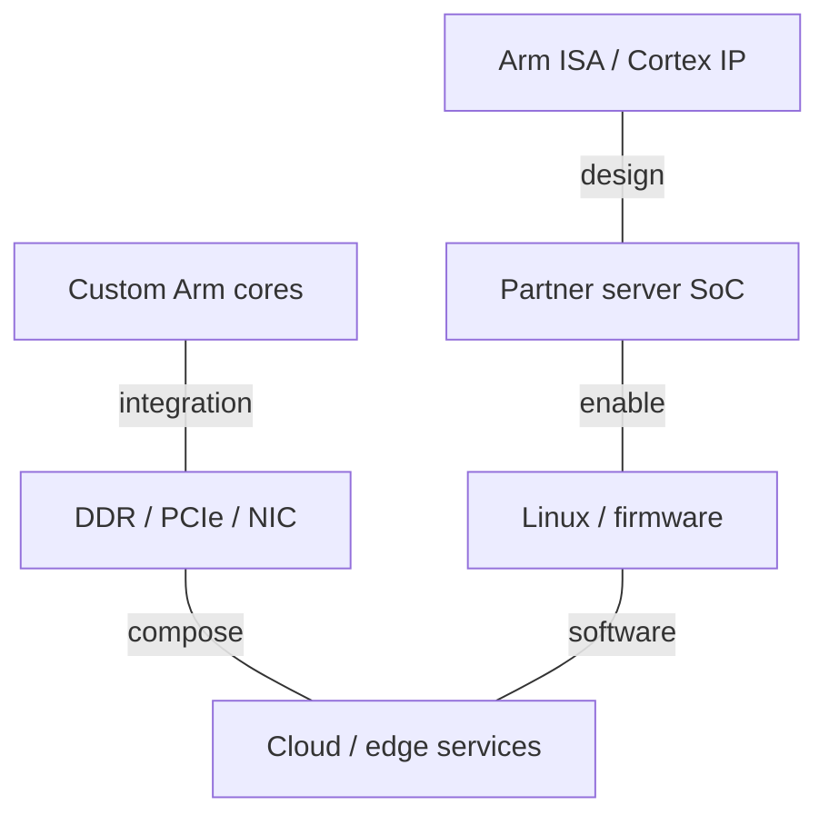
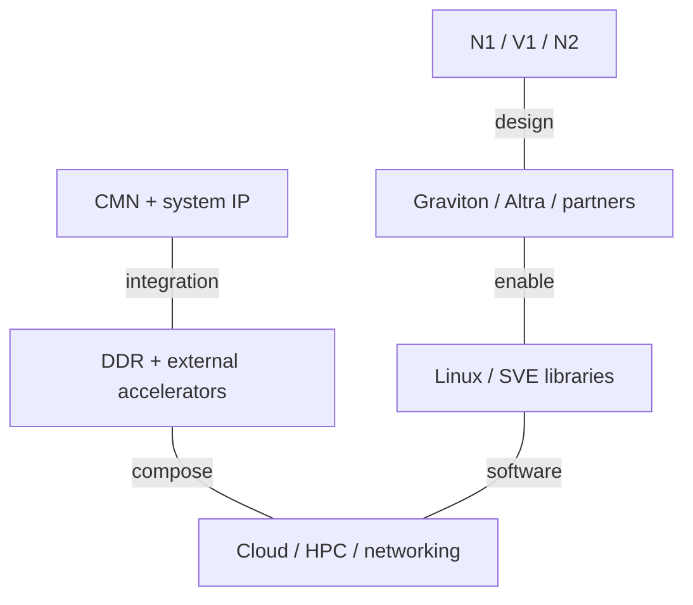
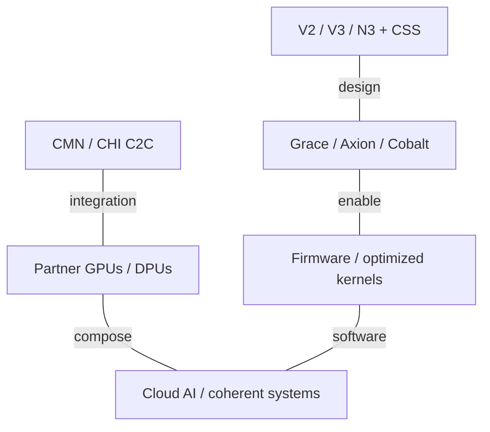
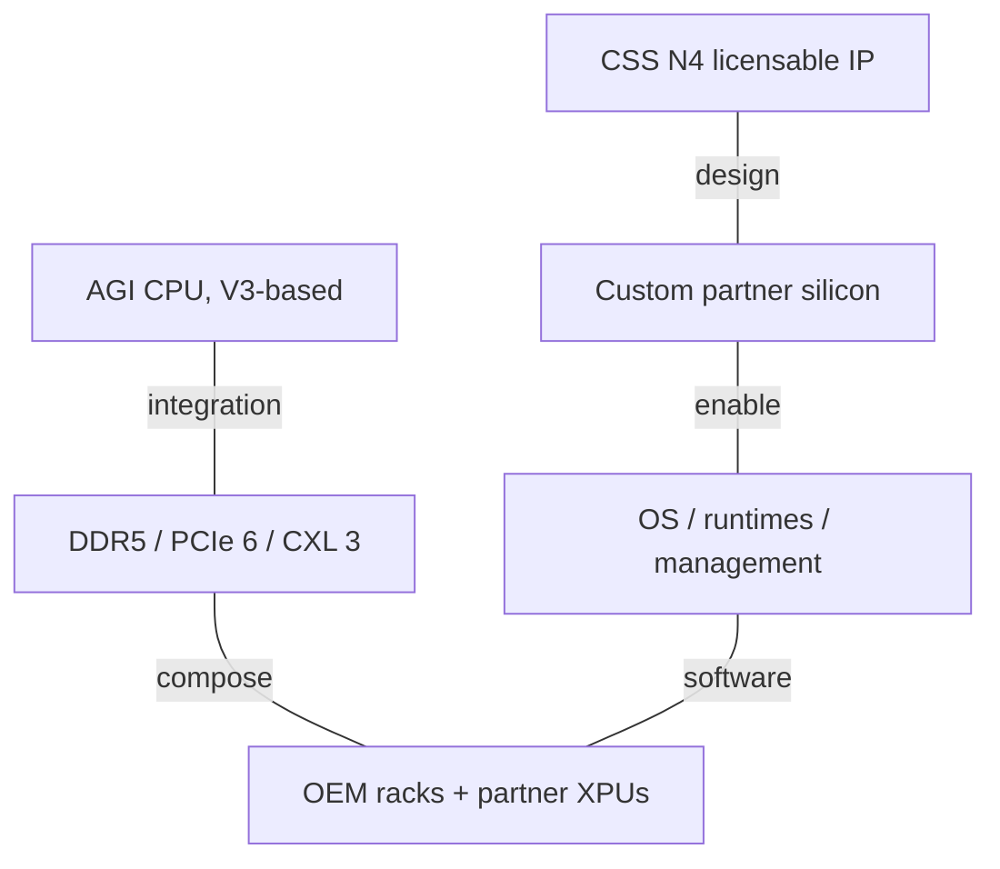

# Arm AI Infrastructure Architecture Evolution

2015-2026 | 2026-09-28

## 01 Scope and executive synthesis

Families and weights: deep on Neoverse, CSS and AGI CPU; full on mesh/system IP; proportional on licensee silicon, GPU/NPU IP and software.
Start: 2015, with Cortex-A server designs as the baseline.
Cutoff: 28 September 2026; includes Hot Chips 2026 and the September CSS N4 announcement.
Focus: core evolution, coherent memory systems, integration boundaries and the CPU role in AI infrastructure.
Exclusions: exhaustive licensee SKUs and mobile generations; no Arm-branded datacenter training GPU or merchant AI NIC is established in the reviewed portfolio.

Arm’s infrastructure evolution has three overlapping layers. Neoverse separates server-oriented core development from a mobile-led product story. Compute Subsystems move validation of the CPU, mesh, memory interfaces and platform software upstream into Arm. AGI CPU adds Arm-designed merchant silicon in 2026. The last transition changes the competitive boundary: Arm can now supply both the building blocks for a custom server and a finished CPU for organizations without a custom-silicon program.

The important progression is not simply more cores. N1 establishes a scalable cloud core; V1 adds substantial vector capacity; N2 emphasizes density and Armv9; V2 widens the scalar machine and improves memory access; V3 and CSS bring confidential computing and more complete integration. CSS N4 then expands configuration and I/O headroom. The realized outcome still depends on the licensee’s memory channels, cache, physical design and software. A Neoverse name is therefore insufficient to predict socket performance.

## 02 Units, ownership and availability

IP availability is not silicon general availability. A core does not have a universal foundry node, package power, socket count or DDR bandwidth. Those properties belong to an implementation. Tables retain the standard cross-vendor columns and use n/a for a field that does not apply, and n/d when reviewed sources do not disclose it. Cloud vCPU limits are not automatically physical core counts. Historical shipping does not imply current orderability.

Memory bandwidth is decimal payload GB/s: channels × transfers per second × eight bytes for a conventional 64-bit DDR channel. Per-core bandwidth is a derived equal-share ratio, not a reservation. Link figures are per direction unless explicitly labelled otherwise. ISA vector length, number of execution pipelines and aggregate bytes processed per cycle are different quantities. A two-pipeline 256-bit SVE core must not be compared with a four-pipeline 128-bit core by vector length alone. Confidential-computing capability likewise requires system and software enablement, not just an ISA label.

## 03 Neoverse and CSS generation atlas

### CPU IP comparison: implementation fields remain separate

| Generation / reference SKU | Codename | GA | Status | Core µarch | Cores / threads | Process per die | Dies / packaging | L2 per core | L3 / domain | Memory: channels; rate; GB/s | Sockets / links | PCIe / CXL | TDP | Vector / matrix ISA |
| --- | --- | --- | --- | --- | --- | --- | --- | --- | --- | --- | --- | --- | --- | --- |
| Neoverse N1 / Ares | Ares | 2019 IP disclosure | Licensable IP | N1 | Configurable; E1 SMT2; N4 threads n/d; others single-threaded | Licensee-defined; N4 targets 3 nm | IP, not a packaged SKU | 512 KB / 1 MB | System configuration | Implementation-defined | n/a | System integration | n/a | Armv8.2-A; NEON 128-bit |
| Neoverse E1 | n/d | 2019 IP disclosure | Licensable IP | E1 | Configurable; E1 SMT2; N4 threads n/d; others single-threaded | Licensee-defined; N4 targets 3 nm | IP, not a packaged SKU | n/d | System configuration | Implementation-defined | n/a | System integration | n/a | Armv8.2-A; NEON; SMT2 |
| Neoverse V1 / Zeus | Zeus | 2020-2021 IP disclosure | Licensable IP | V1 | Configurable; E1 SMT2; N4 threads n/d; others single-threaded | Licensee-defined; N4 targets 3 nm | IP, not a packaged SKU | 512 KB / 1 MB | System configuration | Implementation-defined | n/a | System integration | n/a | SVE: 2 x 256-bit; BF16; INT8 |
| Neoverse N2 / Perseus | Perseus | 2020-2021 IP disclosure | Licensable IP | N2 | Configurable; E1 SMT2; N4 threads n/d; others single-threaded | Licensee-defined; N4 targets 3 nm | IP, not a packaged SKU | 512 KB / 1 MB | System configuration | Implementation-defined | n/a | System integration | n/a | Armv9; SVE2 128-bit; BF16 |
| Neoverse V2 / Demeter | Demeter | 2022-2023 IP disclosure | Licensable IP | V2 | Configurable; E1 SMT2; N4 threads n/d; others single-threaded | Licensee-defined; N4 targets 3 nm | IP, not a packaged SKU | 1 / 2 MB | System configuration | Implementation-defined | n/a | System integration | n/a | Armv9; SVE2 128-bit; 4 vector pipes |
| Neoverse V3 | n/d | 2024 IP disclosure | Licensable IP | V3 | Configurable; E1 SMT2; N4 threads n/d; others single-threaded | Licensee-defined; N4 targets 3 nm | IP, not a packaged SKU | 2 / 3 MB | System configuration | Implementation-defined | n/a | System integration | n/a | Armv9.2-A; SVE2; CCA |
| Neoverse N3 | n/d | 2024 IP disclosure | Licensable IP | N3 | Configurable; E1 SMT2; N4 threads n/d; others single-threaded | Licensee-defined; N4 targets 3 nm | IP, not a packaged SKU | 128 KB - 2 MB | System configuration | Implementation-defined | n/a | System integration | n/a | Armv9.2-A; SVE2 |
| CSS N4 | n/d | 2026-09 IP disclosure | Licensable IP | N4 | Configurable; E1 SMT2; N4 threads n/d; others single-threaded | Licensee-defined; N4 targets 3 nm | IP, not a packaged SKU | up to 2 MB | System configuration | Implementation-defined | n/a | System integration | n/a | Armv9; details n/d |

### Subsystem integration envelope

| Subsystem | Disclosure | Core envelope | Memory / I/O | Integration meaning |
| --- | --- | --- | --- | --- |
| CSS N2 | 2023 | Up to 64 N2 | DDR5/LPDDR5; PCIe 5 / CXL | Prevalidated CPU and system design |
| CSS V3 | 2024 | Up to 64 V3 per subsystem | up to 12 memory channels; 64 PCIe 5/CXL lanes | Chiplet-ready; CCA support |
| CSS N3 | 2024 | Configurable N3 subsystem | CMN S3; CHI C2C | Cloud, networking, DPU and edge customization |
| CSS N4 | 2026-09 | Up to 128 N4 per die | DDR5 / LPDDR6; PCIe 7 / CXL 4.0 | 3 nm target; configurable compute foundation |

## 04 2015-2018: separating ISA, core and server

Before Neoverse, an Arm server could use licensed Cortex cores or a custom Arm-compatible microarchitecture. These are different business and engineering paths. Cortex-A57/A72-era designs provided a baseline, while Qualcomm Falkor, Cavium/Marvell ThunderX and Fujitsu’s later A64FX demonstrate that an Arm ISA license does not imply a Neoverse core. That distinction remains essential for AmpereOne and NVIDIA Vera as well: their presence in the Arm ecosystem cannot be used as evidence about the internals of an Arm-designed core.

A server platform requires much more than an instruction decoder. Coherent I/O, interrupt virtualization, page-table maintenance, RAS, firmware boot conventions and a stable operating-system environment all affect deployment cost. Neoverse’s 2018 branding and 2019 products made this infrastructure focus explicit. The lasting architectural advantage is the ability to assemble an application-specific balance of cores, caches, memory and accelerators, provided that integration and software costs remain manageable.

## 05 N1 and E1: cloud cores and throughput cores

N1 combines four-instruction decode with dispatch of up to eight internal micro-operations, a 128-entry commit queue, 64 KB instruction and data caches, and private L2. Its decoupled branch predictor runs ahead of instruction fetch; a 6K-entry main BTB helps large server code footprints. These widths describe different pipeline stages, not interchangeable measures of IPC. Direct attachment to CMN-600 lets designers grow the coherent system without imposing a fixed mobile cluster boundary. Server features include RAS, virtualization extensions and coherent instruction-cache behavior.

Hot Chips 2019 explains the architecture; ISSCC 2020 paper 8.3 supplies a concrete 3 GHz, 7 nm implementation anchor. The ISSCC summary emphasizes a short, operation-dependent pipeline and a low-latency memory hierarchy. Its PPA comparisons belong to that implementation and baseline, not every N1 licensee. E1 instead targets data-plane throughput with two hardware threads per core. It should not be treated as a low-clocked N1 or used to infer SMT in N-series and V-series products.

AWS Graviton2 and Ampere Altra turned N1 into commercial cloud and merchant-server products. Their usefulness comes from a complete platform and a large population of independent software threads, rather than from one universal Arm socket. Altra Max extends the density approach. Increasing cores while holding memory-channel count constant reduces the average external bandwidth budget per core; cache locality and workload consolidation determine whether that trade is productive.

## 06 V1 and N2: vector performance versus density

V1 creates a performance-oriented branch rather than replacing N1 in every role. Its two 256-bit SVE pipelines, BF16 support and INT8 matrix instructions increase CPU-side scientific and ML capability. Decoupled prediction, an instruction-side operation cache and a wider machine aim to keep the execution units busy. Vector-length-agnostic programming protects software from assuming one implementation width. AWS Graviton3 is the important cloud realization, but its chiplets and DDR5 channels are AWS design choices, not intrinsic V1 properties.

N2 takes Armv9 and 128-bit SVE2 into a more density-oriented core. The Hot Chips 2021 disclosure places the core together with CMN-700 and the wider system roadmap. The appropriate comparison with V1 is performance per area, per watt and per memory channel on the intended workload, not SVE width alone. Microsoft Cobalt 100 and networking implementations demonstrate how one core family can support different system balances. The CSS N2 offering in 2023 further reduces the amount of subsystem integration that a licensee must perform.

## 07 V2: width, memory concurrency and coherent hosts

V2’s Hot Chips 2023 disclosure is unusually useful for reconstructing the whole core. It shows six-instruction decode, eight-wide dispatch and retirement, a 320-plus out-of-order window, six ALUs, two branch pipelines, and two load/store pipes plus one additional load pipe. Four 128-bit vector datapaths replace the V1 organization. The optional 2 MB private L2 retains a quoted ten-cycle load-to-use latency. Prefetch changes include indirect and page-table-walk handling, with lower priority for speculative prefetch traffic than demand requests. The design broadens useful concurrency while controlling memory interference.

V2 appears in AWS Graviton4, Google Axion and NVIDIA Grace. These systems illustrate three different optimizations: general cloud throughput, a vertically integrated cloud platform, and a coherent accelerator host. Grace’s LPDDR5X and NVLink-C2C belong to NVIDIA’s CPU and superchip integration. They do not make NVLink an Arm interconnect. Conversely, a cloud processor’s DDR channels do not describe Grace. The common core provides software and implementation reuse; the system fabric and memory hierarchy determine the node-level behavior.

## 08 V3, N3 and CSS: moving the integration boundary

The 2024 generation makes a preintegrated subsystem a central product rather than a reference illustration. CSS V3 combines V3 cores, coherent fabric and platform IP, while CSS N3 serves a broader range of cloud, networking and edge configurations. V3 introduces Arm Confidential Computing Architecture support within the Neoverse family. CCA’s Realm isolation model is separate from Morello’s capability-based memory safety. Neither feature should be inferred merely because a chip implements some Armv9 instructions.

CSS trades some integration freedom for a verified baseline and a shorter path to silicon. The licensee still owns choices in packaging, memory population, clocks, firmware policy and commercial qualification. Microsoft Cobalt 200 uses CSS V3, yet its complete SoC has 132 active cores, 3 MB L2 per core and 192 MB system cache. Cobalt 200 entered customer preview in 2026. This is why a subsystem’s core ceiling must not be mistaken for a package ceiling. AWS Graviton5 provides another V3-based cloud generation, reaching 192 cores per chip and becoming available through M9g/M9gd in June 2026.

## 09 AGI CPU: Arm becomes a silicon supplier

Announced in March 2026, AGI CPU turns the Neoverse platform into an Arm-designed server product. By the May shareholder update, commercial systems were available to order from named OEMs. Hot Chips 2026 adds the architecture context; the current product brief supplies SKU-level boundaries. The 136-core SP113012 has 2 MB L2 per core and 128 MB shared system cache, twelve DDR5-8800 channels, 96 PCIe 6 lanes and CXL 3.0 Type 3 support. Its maximum clock is 3.5 GHz; the 3.7 GHz headline belongs to the 64-core variant. All three listed variants have a 300 W base TDP setting.

The design emphasizes feeding many independent CPU tasks and attaching external accelerators. A theoretical 844.8 GB/s channel sum yields 6.21 GB/s per core at 136 cores and 13.2 GB/s at 64 cores. Those derived ratios explain the memory-per-core variant without implying sustained application bandwidth. The CPU remains a host and an inference-capable general processor. It is not an HBM tensor accelerator, and the 300 W CPU rating cannot be multiplied into a complete rack power estimate without memory, storage, NICs, fans and power-conversion losses.

### Arm merchant CPU reference SKUs

| Generation / reference SKU | Codename | GA | Status | Core µarch | Cores / threads | Process per die | Dies / packaging | L2 per core | L3 / domain | Memory: channels; rate; GB/s | Sockets / links | PCIe / CXL | TDP | Vector / matrix ISA |
| --- | --- | --- | --- | --- | --- | --- | --- | --- | --- | --- | --- | --- | --- | --- |
| AGI CPU 136C | SP113012 | 2026 | Shipping / available | Neoverse V3 | 136 / 136 | 3 nm | Arm-designed server SoC | 2 MB | 128 MB SLC | DDR5; 12; 8800 MT/s; 844.8 GB/s | 2S; link rate n/d | 96 PCIe 6; CXL 3.0 Type 3 | 300 W | 2 x 128-bit SVE2; BF16; INT8 MMLA |
| AGI CPU 128C | SP113012S | 2026 | Shipping / available | Neoverse V3 | 128 / 128 | 3 nm | Arm-designed server SoC | 2 MB | 128 MB SLC | DDR5; 12; 8800 MT/s; 844.8 GB/s | 2S; link rate n/d | 96 PCIe 6; CXL 3.0 Type 3 | 300 W | 2 x 128-bit SVE2; BF16; INT8 MMLA |
| AGI CPU 64C | SP113012A | 2026 | Shipping / available | Neoverse V3 | 64 / 64 | 3 nm | Arm-designed server SoC | 2 MB | 128 MB SLC | DDR5; 12; 8800 MT/s; 844.8 GB/s | 2S; link rate n/d | 96 PCIe 6; CXL 3.0 Type 3 | 300 W | 2 x 128-bit SVE2; BF16; INT8 MMLA |

## 10 CSS N4 and the current roadmap

September 2026 CSS N4 is a new IP/subsystem generation, not the core inside the first AGI CPU. Arm lists up to 128 N4 cores per die, private L2 configurable to 2 MB, a 3 nm implementation target, DDR5 or LPDDR6, and PCIe 7/CXL 4.0 I/O. These are subsystem capabilities; a licensee need not instantiate every maximum together. The architectural direction is a wider deployment envelope, including CPU hosts and infrastructure processors whose memory and I/O requirements differ.

A public IP announcement does not establish final commercial silicon clocks, socket TDP, DDR qualification or deployment dates. The reviewed evidence does not provide a complete N4 core queue-and-port disclosure comparable with the V2 Hot Chips talk. The report therefore preserves the new generation and its verified interfaces without filling those fields from client-core analogies. Mobile CSS and automotive V3AE derivatives show reuse, but their safety, graphics and power domains remain distinct from the cloud subsystem.

## 11 CMN, CHI and the infrastructure offload boundary

CMN-600, CMN-700 and CMN S3 make coherence a configurable system resource. Request nodes inject CPU and I/O transactions; home nodes coordinate address ownership, directories and system cache; memory-facing nodes connect to controllers. CHI specifies transaction and coherence behavior, while the mesh implements routing and buffering. Consequently, a CHI data-channel width is not a SerDes lane rate and a mesh peak is not DRAM bandwidth. Chiplet crossings add a physical-link and latency problem beyond on-die coherence.

Arm cores inside DPUs and IPUs provide a programmable control or service processor. Packet pipelines, RDMA engines, crypto, local memory and ports are supplied by the chip designer. Arm’s participation in a DPU therefore does not make that device an Arm-branded NIC. CSS N3 and the Alphawave collaboration show how a compute chiplet can be combined with a networking or acceleration die. The useful unit of comparison is the whole device: host interface, offload engines, transport semantics and software isolation.

### Interconnect ownership and semantics

| Interconnect | Year / generation | Lane rate | Lanes / link | GB/s per link per direction | Links / device | Topology | Domain limit | Coherence / semantics |
| --- | --- | --- | --- | --- | --- | --- | --- | --- |
| CMN-600 / CHI | N1 | n/a | n/a | n/d | n/d | Coherent on-die mesh | Implementation-defined | Cache coherence; system cache |
| CMN-700 | N2 / V2 | n/a | n/a | n/d | n/d | Coherent mesh; multi-chip integration | n/d | CHI |
| CMN S3 / CHI C2C | V3 / N3 | n/d | n/d | n/d | n/d | Mesh and chiplet links | n/d | Coherent subsystem integration |
| AGI CPU PCIe 6 / CXL 3 | 2026 | 64 GT/s | up to x16 | ~128 raw x16 | 96 lanes total | Host I/O fabric | n/d | PCIe I/O; CXL Type 3 memory |

### Network product boundary

| Product | GA / milestone | Status | Class | Ports × speed | SerDes | Host interface | Programmable engine | Embedded CPU | On-card memory | Transport / RDMA | Congestion control | Key offloads | Power |
| --- | --- | --- | --- | --- | --- | --- | --- | --- | --- | --- | --- | --- | --- |
| No Arm-branded AI NIC established | n/a | n/a | IP supplier / CPU supplier | n/a | n/a | n/a | n/a | Neoverse licensed to device vendors | n/a | Licensee-specific | n/a | CPU control; packet engines separate | n/a |

## 12 GPU and NPU IP: complementary edge compute

Mali evolves through Midgard, Bifrost, Valhall and later graphics generations; Immortalis adds a premium graphics branch. These designs target integrated graphics and shared-memory SoCs. Their presence does not establish a merchant HBM GPU for distributed training. The 2026 Mali G2-Ultra NX adds dedicated neural acceleration within the mobile graphics platform, alongside the C2 CPU cluster and SME2. This is important convergence at the edge, while its bandwidth, power and software environment remain different from a datacenter accelerator card.

Ethos-N77/N78 address application-processor and edge inference integration; Ethos-U55/U65/U85 address constrained embedded systems. U65 extends the U55 approach into Cortex-A, Cortex-R and Neoverse systems. U85 expands to 128-2048 MAC units and supports transformer-oriented operators. At 1 GHz, 2048 MACs correspond to 4.096 TOPS when one multiply-add counts as two integer operations; this is a configuration calculation, not BF16 throughput. Compiler partitioning, SRAM tiling and unsupported-operator fallback determine practical model coverage.

### Complementary accelerator IP in the common schema

| Product | Architecture | GA / milestone | Status | Process | Dies / packaging | Compute units | Dense BF16 | Dense FP8 | Dense FP6 / FP4 | FP64 vector / matrix | Memory: type; stacks; GB; TB/s | LLC / SRAM | Scale-up: links; GB/s per direction; domain | Host link | Power / cooling | Form factor |
| --- | --- | --- | --- | --- | --- | --- | --- | --- | --- | --- | --- | --- | --- | --- | --- | --- |
| Ethos-N78 | Ethos-N | 2020 IP | Licensable IP | n/a | Integrated IP | configurable | n/d | n/d | n/d | n/a | HBM n/a; SoC memory | n/d | n/a | SoC interconnect | n/a | IP |
| Ethos-U85 | Ethos-U | 2024 IP | Licensable IP | n/a | Integrated IP | 128-2048 MACs | n/d | n/d | n/d | n/a | HBM n/a; system SRAM/DRAM | n/d | n/a | SoC interconnect | n/a | IP |
| Mali G2-Ultra NX | Mali | 2026 IP | Announced; GA n/d | n/a | Mobile GPU IP | n/d | n/d | n/d | n/d | n/d | HBM n/a; shared SoC memory | n/d | n/a | SoC interconnect | n/a | IP |

## 13 Software, security and research evidence

Arm’s software advantage comes from a common AArch64 ecosystem combined with implementation-specific optimization. GCC/LLVM targets, Linux scheduling and NUMA placement, optimized math kernels, Compute Library and profiling tools must match the actual core and memory system. SVE-length-agnostic code still needs sensible blocking and cache reuse. CSS reference software supplies firmware and platform models; it does not automatically qualify a production server. In AI hosting, orchestration latency, tokenizer performance and communication progress can matter even when all large matrix operations run elsewhere.

The academic record adds mechanisms and evaluation methods rather than a complete product roadmap. Arm-associated MISB at ISCA 2019 and temporal prefetching at MICRO 2019 study the storage and traffic cost of prediction metadata. Triangel at ISCA 2024 studies timeliness and accuracy; HPCA 2025 bandwidth-partitioning work evaluates resource interference; ASPLOS 2025 hierarchical prefetching addresses large instruction footprints. These help explain what designers are optimizing. They do not prove that a named production core implements the proposed mechanism. Morello is different: its documented N1-derived evaluation platform is an explicit research-to-hardware link, but remains a capability-security prototype rather than a standard Neoverse feature.

### Software milestones

| Release / component | Date | Hardware enabled | Key features |
| --- | --- | --- | --- |
| AArch64 Linux / GCC / LLVM | 2015-2026 | Cortex, Neoverse and custom cores | Portable binaries; core-specific scheduling and ISA dispatch |
| Arm Compute Library | ongoing | Arm CPU / Mali | Optimized AI operators; feature-dependent paths |
| Neoverse reference software | 2024 release | RD-V3 and related platforms | Firmware and fixed virtual platform integration |

## 14 Systems and quantitative balance

### Representative system boundaries

| Platform | Year / milestone | CPU / accelerator count | Scale-up domain | Scale-out per accelerator | Rack power | Cooling |
| --- | --- | --- | --- | --- | --- | --- |
| Licensee cloud server | 2019-2026 | Graviton / Axion / Cobalt | Provider-specific | n/d | n/d | n/d |
| AGI CPU 1OU dual-node reference | 2026 | 2 x AGI CPU | Two independent nodes | n/d | 36 kW example; 8160 cores | Air |
| AGI CPU 2U2P reference | 2026 | 2 x AGI CPU | 2-socket coherent server | n/d | n/d | Air |

### Derived bandwidth and cache ratios

| Configuration | DRAM peak GB/s | GB/s/core | SLC MB/core | Meaning |
| --- | --- | --- | --- | --- |
| AGI 136C | 844.8 | 6.21 | 0.94 | Equal-share ratio; not a reservation |
| AGI 128C | 844.8 | 6.60 | 1.00 | Same interface, fewer active cores |
| AGI 64C | 844.8 | 13.20 | 2.00 | Memory and cache capacity per core increase |
| Graviton4 96C | 537.6 | 5.60 | n/d | 12 x DDR5-5600; AWS implementation |

HBM bytes per dense BF16/FP8 FLOP and accelerator scale-up/HBM ratios are n/a for the Arm-branded CPU/IP portfolio. Assigning a partner GPU’s HBM to Arm would corrupt a cross-vendor comparison. Likewise, no universal tokens/W number follows from core count or an IP efficiency projection. An end-to-end measurement needs the actual model, precision, latency target, memory configuration and system power boundary.

## 15 Conference-to-product index

### Verified disclosure anchors

| Venue | Year | Paper / talk / disclosure | Presenter / authors | Product | Evidence type | Source |
| --- | --- | --- | --- | --- | --- | --- |
| Hot Chips | 2019 | Neoverse N1 Cloud-to-Edge Infrastructure SoCs | Arm | N1 | Architecture | P01 |
| ISSCC | 2020 | A 3GHz Arm Neoverse N1 CPU in 7nm FinFET for Infrastructure Applications | R. Christy et al. | N1 | Circuit / implementation | C01 |
| Hot Chips | 2021 | Arm Neoverse N2: 2nd generation infrastructure CPUs and system IPs | A. Pellegrini | N2 / CMN-700 | Architecture | C04 |
| Hot Chips | 2023 | Arm Neoverse V2 Platform | Magnus Bruce | V2 | Architecture | C02 |
| Hot Chips | 2023 | Neoverse Compute Subsystems launch | Arm | CSS N2 | Subsystem | E03 |
| Hot Chips | 2026 | Arm AGI CPU architecture disclosure | Arm | AGI CPU | Architecture / system | C03 |
| ISCA | 2019 / 2024 | MISB; Triangel | Arm / academic researchers | Related memory research | Related research | R06 R03 |
| MICRO | 2019 | Temporal Prefetching Without the Off-Chip Metadata | Wu et al. | Related memory research | Related research | R05 |
| HPCA | 2025 | Criticality-Aware Instruction-Centric Bandwidth Partitioning | Paper authors | Resource partitioning | Related research | R04 |
| ASPLOS | 2025 | Hierarchical Prefetching | Zhang et al. | Instruction supply | Related research | R07 |
| Microsoft Ignite / Build | 2025 / 2026 | Cobalt 200 disclosure and preview | Microsoft | CSS V3 implementation | Partner deployment | E07 E18 E20 |
| Google Cloud Next | 2024 | Google Axion introduction | Google | V2 implementation | Partner deployment | E17 |
| AWS re:Invent / EC2 launches | 2023-2026 | Graviton4 / Graviton5 | AWS | V2 / V3 implementations | Partner deployment | E16 E19 |
| Arm Everywhere | 2026 | AGI CPU and CSS N4 | Arm | Merchant CPU / IP | Product launch | E05 E06 |

DAC, MWC, Computex, OCP, GTC, SC/ISC, VLSI and ISSCC/JSSC are complementary channels: design methodology, telecom deployments, ecosystem launches, racks, coherent GPU hosts, HPC systems and implementation technology. They are included when a specific disclosure is tied to a covered generation. The index is a verified selection, not a claim that Arm presented every product at every venue. The N1 ISSCC entry uses the conference’s published technical summary; it does not imply access to the complete paper.

## 16 Codename and ownership crosswalk

### Names that must not be conflated

| Name | Meaning | Owner / boundary |
| --- | --- | --- |
| Ares / N1 | Core IP generation | Arm |
| Zeus / V1 | Vector-oriented core IP | Arm |
| Perseus / N2 | Density-oriented Armv9 core | Arm |
| Demeter / V2 | Core used by Grace, Axion and Graviton4 | Arm core; partner SoCs |
| CSS | Preintegrated compute subsystem | Not a complete merchant chip |
| AGI CPU | Arm-designed server silicon | V3-based; not CSS N4 |
| Falkor / Oryon / AmpereOne / Vera | Custom Arm-compatible cores or products | Licensee designs; not Neoverse aliases |

## 17 Integrated stack across four eras

These figures show ownership and composition, not an assertion of a common physical fabric across all licensees. Connections indicate integration relationships. Exact bandwidth remains implementation-specific.

### 2015-2018: ISA and partner integration

Conceptual ownership and integration map; partner GPU and network bandwidth is not attributed to Arm.

### 2019-2022: Neoverse platforms

Conceptual ownership and integration map; partner GPU and network bandwidth is not attributed to Arm.

### 2023-2025: CSS and heterogeneous hosts

Conceptual ownership and integration map; partner GPU and network bandwidth is not attributed to Arm.

### 2026: IP and merchant silicon coexist

Conceptual ownership and integration map; partner GPU and network bandwidth is not attributed to Arm.

### Bandwidth hierarchy by era

| Era | On-die / die-to-die | Memory | Host attach | Scale-up / scale-out |
| --- | --- | --- | --- | --- |
| 2015-2018 | Licensee fabric | Licensee DDR | PCIe; n/d | Licensee network; n/d |
| 2019-2022 | CMN-600/700; n/d | Partner-configured DDR; n/d | PCIe / CCIX; n/d | No universal Arm link |
| 2023-2025 | CMN / CHI C2C; n/d | Graviton4: 537.6 GB/s peak | Grace C2C is NVIDIA-owned | Partner-specific |
| 2026 | CMN; D2D n/d | AGI: 844.8 GB/s derived peak | PCIe 6 x16 ~128 GB/s raw | External XPU/NIC; n/d |

## 18 Engineering conclusions

Arm’s decade is best understood as the gradual productization of a configurable system. Core efficiency matters, but the larger gains come from pairing the right core with the right memory, coherence and deployment model. CSS reduces integration cost without removing implementation responsibility. Merchant AGI silicon widens access to the platform while introducing a second relationship with existing licensees. For AI infrastructure, the enduring CPU requirements are predictable service latency, memory capacity and bandwidth, accelerator I/O, isolation and mature software. Neither an Arm ISA label nor a maximum core count settles those questions.

## Source map

01 Scope and executive synthesis — C02, E01, E03, E04, E05, E06, E15, P01, P02, P06

02 Units, ownership and availability — C02, E08, P02, P04, P07, P08

03 Neoverse and CSS generation atlas — C02, E01, E02, E03, E04, E06, E09, P01, P02, P03, P04, P06, P08, P09, P10

04 2015-2018: separating ISA, core and server — C03, E01, E08, P01, P08

05 N1 and E1: cloud cores and throughput cores — C01, E01, E08, P01, P08

06 V1 and N2: vector performance versus density — C04, E02, E03, E08, P02, P03

07 V2: width, memory concurrency and coherent hosts — C02, E08, E16, E17, P15

08 V3, N3 and CSS: moving the integration boundary — E04, E07, E18, E19, E20, P04, P08, P09, R01

09 AGI CPU: Arm becomes a silicon supplier — C03, E05, E13, E14, E15, P07

10 CSS N4 and the current roadmap — E06, E10, P06, P10

11 CMN, CHI and the infrastructure offload boundary — C02, C04, E09, P01, P07, P08, P09, P14

12 GPU and NPU IP: complementary edge compute — E10, E11, E12, P11, P12

13 Software, security and research evidence — P08, P13, P14, R01, R02, R03, R04, R05, R06, R07

14 Systems and quantitative balance — E08, E13, E14, E16, E17, E18, E19, P07, P11

15 Conference-to-product index — C01, C02, C03, C04, E03, E05, E06, E07, E09, E13, E16, E17, E18, E19, E20, P01, P15, R03, R04, R05, R06, R07

16 Codename and ownership crosswalk — C02, C03, E01, E03, E06, E08, P01, P02, P07, P08

17 Integrated stack across four eras — C04, E03, E06, E08, E09, E16, P01, P07, P15

18 Engineering conclusions — E03, E06, P07, P13

## References

### Product and technical documentation

[P01] The Arm Neoverse N1 Platform: Building Blocks for the Next-Gen Cloud-to-Edge Infrastructure SoC. [https://www.arm.com/-/media/global/solutions/infrastructure/arm-neoverse-n1-platform.pdf](https://www.arm.com/-/media/global/solutions/infrastructure/arm-neoverse-n1-platform.pdf). Primary source; accessed by 2026-09-28

[P02] Neoverse V1 platform technical deep dive. [https://community.arm.com/developer/ip-products/processors/b/processors-ip-blog/posts/neoverse-v1-platform-a-new-performance-tier-for-arm](https://community.arm.com/developer/ip-products/processors/b/processors-ip-blog/posts/neoverse-v1-platform-a-new-performance-tier-for-arm). Primary source; accessed by 2026-09-28

[P03] Neoverse N2 product support. [https://support.arm.com/compute-ip/neoverse-n2](https://support.arm.com/compute-ip/neoverse-n2). Primary source; accessed by 2026-09-28

[P04] Neoverse V3 product. [https://www.arm.com/products/silicon-ip-cpu/neoverse/neoverse-v3](https://www.arm.com/products/silicon-ip-cpu/neoverse/neoverse-v3). Primary source; accessed by 2026-09-28

[P06] Neoverse CSS N4 product support. [https://support.arm.com/compute-subsystems/neoverse-css-n4](https://support.arm.com/compute-subsystems/neoverse-css-n4). Primary source; accessed by 2026-09-28

[P07] Arm AGI CPU product brief. [https://www.arm.com/static/az/pdf/product-brief/arm-agi-cpu-product-brief.pdf](https://www.arm.com/static/az/pdf/product-brief/arm-agi-cpu-product-brief.pdf). Primary source; accessed by 2026-09-28

[P08] Introduction to Neoverse Cores: Arm Education. [https://raw.githubusercontent.com/arm-education/Introduction-to-Cloud-Compute-on-Arm/main/Part%201%20-%20Introduction%20to%20Neoverse%20Cores.md](https://raw.githubusercontent.com/arm-education/Introduction-to-Cloud-Compute-on-Arm/main/Part%201%20-%20Introduction%20to%20Neoverse%20Cores.md). Primary source; accessed by 2026-09-28

[P09] Neoverse CSS V3 specifications. [https://www.arm.com/products/cloud-datacenter/neoverse-compute-subsystems/css-v3](https://www.arm.com/products/cloud-datacenter/neoverse-compute-subsystems/css-v3). Primary source; accessed by 2026-09-28

[P10] Neoverse CSS N4 specifications. [https://www.arm.com/products/cloud-datacenter/neoverse-compute-subsystems/css-n4](https://www.arm.com/products/cloud-datacenter/neoverse-compute-subsystems/css-n4). Primary source; accessed by 2026-09-28

[P11] Ethos-U85 technical overview. [https://documentation-service.arm.com/static/67b5b9e6fdbd9d54ee93e7d0](https://documentation-service.arm.com/static/67b5b9e6fdbd9d54ee93e7d0). Primary source; accessed by 2026-09-28

[P12] Ethos-U65 product. [https://www.arm.com/products/silicon-ip-cpu/ethos/ethos-u65](https://www.arm.com/products/silicon-ip-cpu/ethos/ethos-u65). Primary source; accessed by 2026-09-28

[P13] Arm Compute Library. [https://github.com/ARM-software/ComputeLibrary](https://github.com/ARM-software/ComputeLibrary). Primary source; accessed by 2026-09-28

[P14] Arm Neoverse Reference Design software. [https://neoverse-reference-design.docs.arm.com/en/rd-infra-2024.09.30/platforms/rdv3.html](https://neoverse-reference-design.docs.arm.com/en/rd-infra-2024.09.30/platforms/rdv3.html). Primary source; accessed by 2026-09-28

[P15] NVIDIA Grace CPU Superchip architecture whitepaper. [https://resources.nvidia.com/en-us-grace-cpu/nvidia-grace-cpu-superchip](https://resources.nvidia.com/en-us-grace-cpu/nvidia-grace-cpu-superchip). Primary source; accessed by 2026-09-28

### Conference records and implementation disclosures

[C01] ISSCC 2020 press kit, paper 8.3: A 3GHz Arm Neoverse N1 CPU in 7nm FinFET for Infrastructure Applications. [https://www.isscc.org/s/2020-Press-Kit.pdf](https://www.isscc.org/s/2020-Press-Kit.pdf). Official conference press kit; not the full paper.

[C02] Hot Chips 2023: Arm Neoverse V2 Platform. [https://hc2023.hotchips.org/assets/program/conference/day1/CPU1/HC2023.Arm.MagnusBruce.v04.FINAL.pdf](https://hc2023.hotchips.org/assets/program/conference/day1/CPU1/HC2023.Arm.MagnusBruce.v04.FINAL.pdf). Primary source; accessed by 2026-09-28

[C03] Hot Chips 2026: Arm CPU architecture recap. [https://newsroom.arm.com/blog/hot-chips-2026-arm-cpu-agentic-ai](https://newsroom.arm.com/blog/hot-chips-2026-arm-cpu-agentic-ai). Primary source; accessed by 2026-09-28

[C04] Hot Chips 2021 program: Neoverse N2 and Cloud AI 100. [https://hc33.hotchips.org/](https://hc33.hotchips.org/). Official indexed record or related announcement; full document download unavailable.

### Research papers and publication registries

[R01] Verified Security for the Morello Capability-enhanced Prototype Arm Architecture. [https://link.springer.com/chapter/10.1007/978-3-030-99336-8_7](https://link.springer.com/chapter/10.1007/978-3-030-99336-8_7). Primary source; accessed by 2026-09-28

[R02] Cambridge CHERI and Morello publications. [https://www.cl.cam.ac.uk/research/security/ctsrd/publications.html](https://www.cl.cam.ac.uk/research/security/ctsrd/publications.html). Primary source; accessed by 2026-09-28

[R03] A High-Performance, Accurate, Timely On-Chip Temporal Prefetcher, ISCA 2024. [https://dl.acm.org/doi/10.1109/ISCA59077.2024.00090](https://dl.acm.org/doi/10.1109/ISCA59077.2024.00090). Official indexed record or related announcement; full document download unavailable.

[R04] Criticality-Aware Instruction-Centric Bandwidth Partitioning for Data Center Servers, HPCA 2025. [https://zhou-diyu.github.io/files/pivot-hpca25.pdf](https://zhou-diyu.github.io/files/pivot-hpca25.pdf). Primary source; accessed by 2026-09-28

[R05] Temporal Prefetching Without the Off-Chip Metadata, MICRO 2019. [https://www.cs.utexas.edu/~lin/papers/micro19m.pdf](https://www.cs.utexas.edu/~lin/papers/micro19m.pdf). Primary source; accessed by 2026-09-28

[R06] Making Temporal Prefetchers Practical: The MISB Prefetcher, ISCA 2019. [https://developer.arm.com/community/arm-research/b/articles/posts/making-temporal-prefetchers-practical--the-misb-prefetcher](https://developer.arm.com/community/arm-research/b/articles/posts/making-temporal-prefetchers-practical--the-misb-prefetcher). Primary source; accessed by 2026-09-28

[R07] Hierarchical Prefetching, ASPLOS 2025. [https://www.research.ed.ac.uk/files/521674398/ZhangEtalASPLOS2025HierarchicalPrefetching.pdf](https://www.research.ed.ac.uk/files/521674398/ZhangEtalASPLOS2025HierarchicalPrefetching.pdf). Official indexed record or related announcement; full document download unavailable.

### Launches, ecosystem and deployment

[E01] Neoverse N1 and E1 launch, 2019. [https://newsroom.arm.com/news/our-next-step-in-preparing-the-cloud-for-1t-intelligent-devices](https://newsroom.arm.com/news/our-next-step-in-preparing-the-cloud-for-1t-intelligent-devices). Primary source; accessed by 2026-09-28

[E02] Neoverse V1 and N2 launch, 2020. [https://newsroom.arm.com/news/accelerating-the-next-generation-cloud-to-edge-infrastructure](https://newsroom.arm.com/news/accelerating-the-next-generation-cloud-to-edge-infrastructure). Primary source; accessed by 2026-09-28

[E03] Neoverse CSS introduction at Hot Chips 2023. [https://newsroom.arm.com/news/arm-neoverse-subsystems](https://newsroom.arm.com/news/arm-neoverse-subsystems). Primary source; accessed by 2026-09-28

[E04] Neoverse V3 and N3 launch, 2024. [https://newsroom.arm.com/news/enabling-ai-infrastructure-on-arm](https://newsroom.arm.com/news/enabling-ai-infrastructure-on-arm). Primary source; accessed by 2026-09-28

[E05] Introducing Arm AGI CPU, March 2026. [https://newsroom.arm.com/blog/introducing-arm-agi-cpu](https://newsroom.arm.com/blog/introducing-arm-agi-cpu). Primary source; accessed by 2026-09-28

[E06] AGI CPU and CSS N4 announcement, September 2026. [https://www.arm.com/zh-cn/company/news/2026/09/arm-agi-cpu-neoverse-css-n4-agentic-ai](https://www.arm.com/zh-cn/company/news/2026/09/arm-agi-cpu-neoverse-css-n4-agentic-ai). Primary source; accessed by 2026-09-28

[E07] Microsoft Azure Cobalt 200 uses Neoverse CSS V3. [https://newsroom.arm.com/blog/microsoft-azure-cobalt-200-arm-neoverse-css-v3](https://newsroom.arm.com/blog/microsoft-azure-cobalt-200-arm-neoverse-css-v3). Primary source; accessed by 2026-09-28

[E08] Neoverse deployment guide. [https://newsroom.arm.com/blog/what-is-arm-neoverse](https://newsroom.arm.com/blog/what-is-arm-neoverse). Primary source; accessed by 2026-09-28

[E09] Arm and Alphawave compute chiplets. [https://newsroom.arm.com/blog/arm-and-alphawave-semi-unite-on-6g-chiplets](https://newsroom.arm.com/blog/arm-and-alphawave-semi-unite-on-6g-chiplets). Primary source; accessed by 2026-09-28

[E10] CSS for Mobile 2 and Mali G2-Ultra NX, 2026. [https://newsroom.arm.com/news/arm-css-for-mobile-2-agentic-ai-mobile-graphics](https://newsroom.arm.com/news/arm-css-for-mobile-2-agentic-ai-mobile-graphics). Primary source; accessed by 2026-09-28

[E11] Ethos-U85 launch, 2024. [https://newsroom.arm.com/blog/ethos-u85](https://newsroom.arm.com/blog/ethos-u85). Primary source; accessed by 2026-09-28

[E12] Ethos-N78 and Mali-G78, 2020. [https://newsroom.arm.com/news/new-arm-ip-delivers-true-digital-immersion-for-the-5g-era](https://newsroom.arm.com/news/new-arm-ip-delivers-true-digital-immersion-for-the-5g-era). Primary source; accessed by 2026-09-28

[E13] Arm AGI CPU 1OU dual-node reference server. [https://developer.arm.com/community/arm-community-blogs/b/servers-and-cloud-computing-blog/posts/introducing-the-arm-agi-cpu-1ou-dual-node-reference-server](https://developer.arm.com/community/arm-community-blogs/b/servers-and-cloud-computing-blog/posts/introducing-the-arm-agi-cpu-1ou-dual-node-reference-server). Primary source; accessed by 2026-09-28

[E14] Supermicro Arm AGI CPU systems datasheet. [https://www.supermicro.com/datasheet/datasheet_Supermicro_Arm_AGI.pdf](https://www.supermicro.com/datasheet/datasheet_Supermicro_Arm_AGI.pdf). Primary source; accessed by 2026-09-28

[E15] Arm May 2026 shareholder update: AGI systems available to order. [https://investors.arm.com/static-files/adf3bac7-1e91-442e-92e0-5f2d8f1b6a14](https://investors.arm.com/static-files/adf3bac7-1e91-442e-92e0-5f2d8f1b6a14). Primary source; accessed by 2026-09-28

[E16] AWS Graviton4 memory and cores: DevitoPRO case study. [https://aws.amazon.com/blogs/hpc/performance-gains-with-aws-graviton4-a-devitopro-case-study/](https://aws.amazon.com/blogs/hpc/performance-gains-with-aws-graviton4-a-devitopro-case-study/). Primary source; accessed by 2026-09-28

[E17] Google Axion announcement, Cloud Next 2024. [https://cloud.google.com/blog/products/compute/introducing-googles-new-arm-based-cpu](https://cloud.google.com/blog/products/compute/introducing-googles-new-arm-based-cpu). Primary source; accessed by 2026-09-28

[E18] Microsoft Cobalt 200 architecture disclosure. [https://techcommunity.microsoft.com/blog/AzureInfrastructureBlog/announcing-cobalt-200-azure%E2%80%99s-next-cloud-native-cpu/4469807](https://techcommunity.microsoft.com/blog/AzureInfrastructureBlog/announcing-cobalt-200-azure%E2%80%99s-next-cloud-native-cpu/4469807). Primary source; accessed by 2026-09-28

[E19] AWS Graviton5 general availability, June 2026. [https://www.aboutamazon.com/news/aws/aws-graviton-5-cpu-amazon-ec2](https://www.aboutamazon.com/news/aws/aws-graviton-5-cpu-amazon-ec2). Primary source; accessed by 2026-09-28

[E20] Cobalt 200 early access preview, Build 2026. [https://azure.microsoft.com/en-us/blog/new-azure-cobalt-200-vms-deliver-50-performance-improvement-fully-optimized-for-modern-agentic-ai-workloads/](https://azure.microsoft.com/en-us/blog/new-azure-cobalt-200-vms-deliver-50-performance-improvement-fully-optimized-for-modern-agentic-ai-workloads/). Primary source; accessed by 2026-09-28
