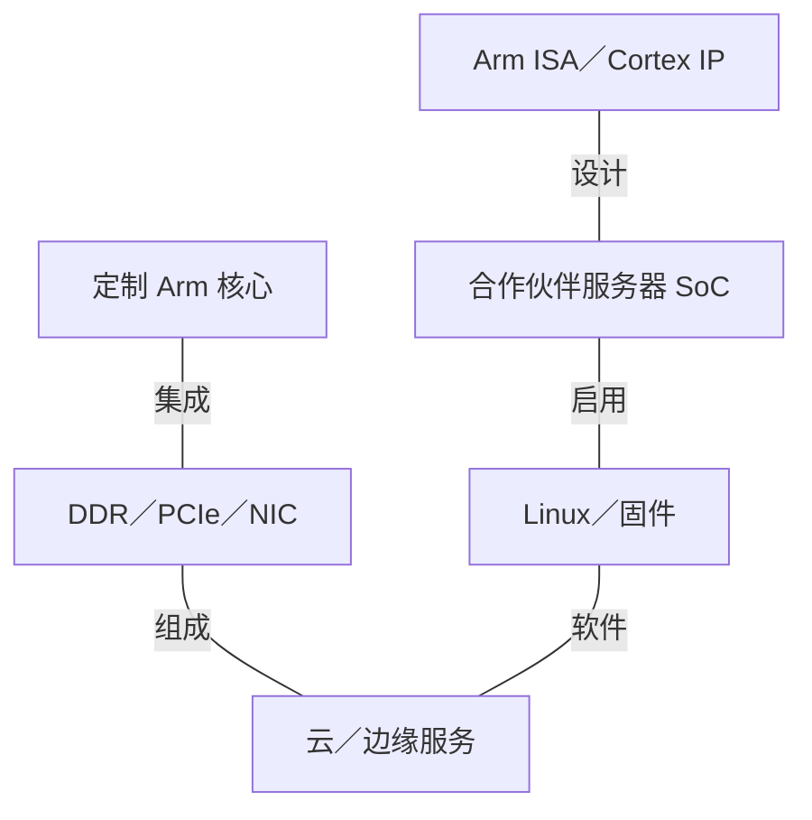
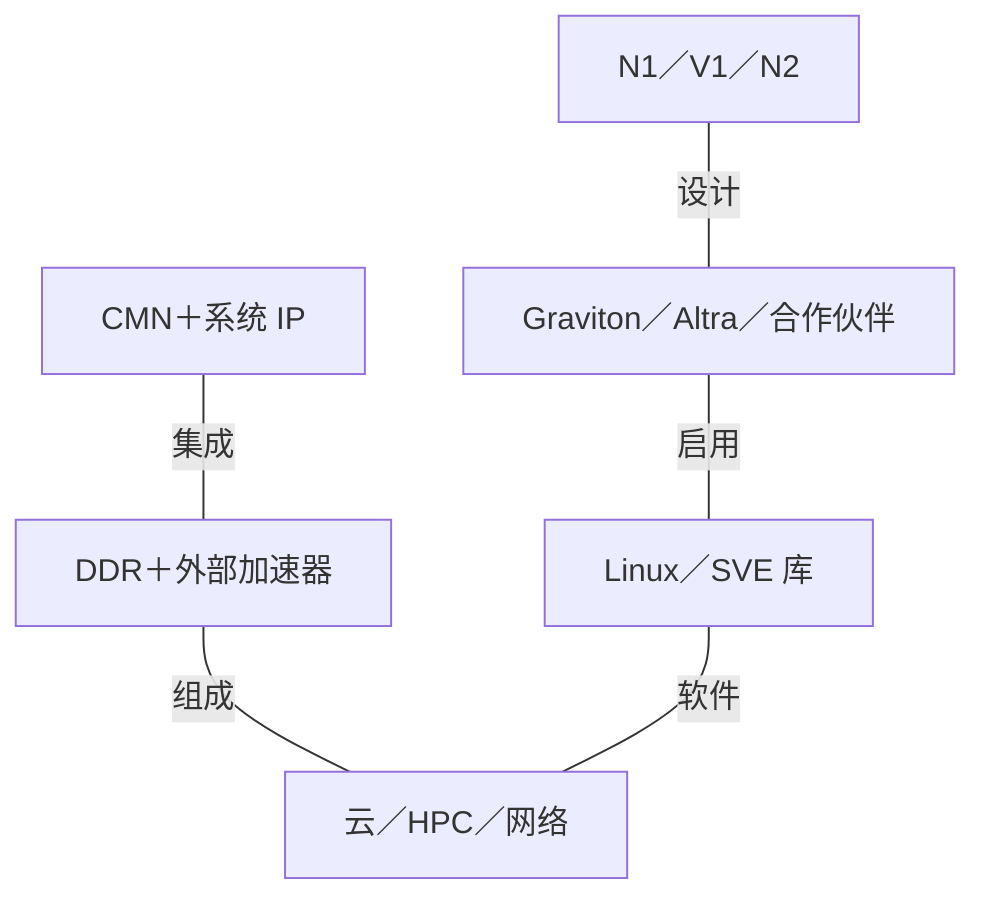
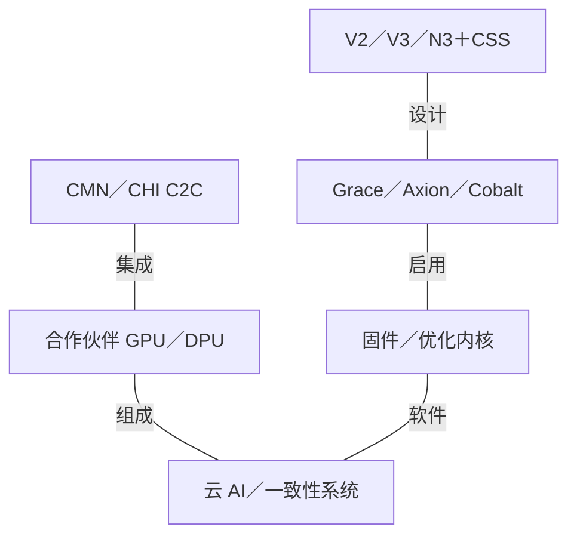
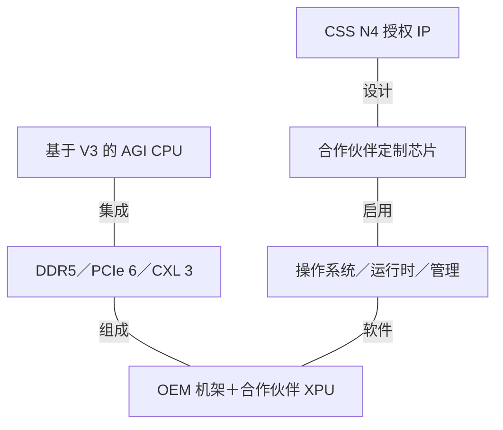

# Arm AI 基础设施架构演进

2015-2026 | 2026-09-28

## 01 研究范围与执行摘要

产品权重：深入研究 Neoverse、CSS 和 AGI CPU；完整覆盖网格与系统 IP；适度覆盖被授权方芯片、GPU／NPU IP 和软件。
起点：2015 年，以 Cortex-A 服务器设计为基线。
截止：2026 年 9 月 28 日，覆盖 Hot Chips 2026 和 9 月 CSS N4 发布。
重点：核心演进、一致性内存系统、集成边界，以及 CPU 在 AI 基础设施中的作用。
不含：所有被授权方 SKU 和移动产品代际的穷尽清单；已审阅产品版图未确立 Arm 品牌的数据中心训练 GPU 或商用 AI NIC。

Arm 的基础设施演进包含三个相互重叠的层次。Neoverse 将面向服务器的核心开发从以移动产品为中心的叙事中独立出来；计算子系统（Compute Subsystems，CSS）把 CPU、网格、内存接口和平台软件的验证工作上移到 Arm；2026 年 AGI CPU 又加入 Arm 自研商用芯片。最后这一步改变了竞争边界：Arm 既能为定制服务器提供构建模块，也能向没有自研芯片项目的机构提供完整 CPU。

关键进步并非简单增加核心。N1 建立可扩展的云核心；V1 显著提高向量能力；N2 强调密度和 Armv9；V2 扩宽标量执行并改善访存；V3 与 CSS 引入机密计算和更完整的集成；CSS N4 进一步扩展配置与 I/O 空间。但最终结果仍取决于被授权方选择的内存通道、缓存、物理设计和软件。因此，仅凭 Neoverse 名称无法预测插槽性能。

## 02 数值、设计归属与可用性

IP 可获取不等于芯片正式商用。核心 IP 没有统一的代工节点、封装功耗、插槽数或 DDR 带宽；这些属性属于具体实现。表格保留跨厂商统一字段，不适用记为 n/a，已审阅资料未披露记为 n/d。云实例的 vCPU 上限不能自动当作芯片物理核心数。历史已商用也不代表当前仍可订购。

内存带宽采用十进制有效载荷 GB/s：对常规 64 位 DDR 通道，通道数乘每秒传输次数，再乘八字节。每核带宽是均分推导值，不是预留保证。链路数值除非特别标注，否则按单方向计算。ISA 向量长度、执行流水线数量和每周期总处理字节数是不同指标；不能仅按向量长度比较双流水线 256 位 SVE 核心与四流水线 128 位核心。机密计算能力同样需要系统与软件启用，不能只看 ISA 名称。

## 03 Neoverse 与 CSS 代际总览

### CPU IP 对比：实现属性单独区分

| 代际／参考 SKU | 代号 | 正式商用 | 状态 | 核心微架构 | 核心／线程 | 各裸片工艺 | 裸片／封装 | 每核 L2 | L3／共享域 | 内存：通道；速率；GB/s | 插槽／互联 | PCIe／CXL | TDP | 向量／矩阵 ISA |
| --- | --- | --- | --- | --- | --- | --- | --- | --- | --- | --- | --- | --- | --- | --- |
| Neoverse N1 / Ares | Ares | 2019 IP 披露 | 可授权 IP | N1 | 可配置；E1 SMT2；N4 线程数 n/d；其余单线程 | 由被授权方决定；N4 面向 3 nm | IP，非封装 SKU | 512 KB / 1 MB | 依系统配置 | 依具体实现 | n/a | 依系统集成 | n/a | Armv8.2-A; NEON 128-bit |
| Neoverse E1 | n/d | 2019 IP 披露 | 可授权 IP | E1 | 可配置；E1 SMT2；N4 线程数 n/d；其余单线程 | 由被授权方决定；N4 面向 3 nm | IP，非封装 SKU | n/d | 依系统配置 | 依具体实现 | n/a | 依系统集成 | n/a | Armv8.2-A; NEON; SMT2 |
| Neoverse V1 / Zeus | Zeus | 2020-2021 IP 披露 | 可授权 IP | V1 | 可配置；E1 SMT2；N4 线程数 n/d；其余单线程 | 由被授权方决定；N4 面向 3 nm | IP，非封装 SKU | 512 KB / 1 MB | 依系统配置 | 依具体实现 | n/a | 依系统集成 | n/a | SVE: 2 x 256-bit; BF16; INT8 |
| Neoverse N2 / Perseus | Perseus | 2020-2021 IP 披露 | 可授权 IP | N2 | 可配置；E1 SMT2；N4 线程数 n/d；其余单线程 | 由被授权方决定；N4 面向 3 nm | IP，非封装 SKU | 512 KB / 1 MB | 依系统配置 | 依具体实现 | n/a | 依系统集成 | n/a | Armv9; SVE2 128-bit; BF16 |
| Neoverse V2 / Demeter | Demeter | 2022-2023 IP 披露 | 可授权 IP | V2 | 可配置；E1 SMT2；N4 线程数 n/d；其余单线程 | 由被授权方决定；N4 面向 3 nm | IP，非封装 SKU | 1 / 2 MB | 依系统配置 | 依具体实现 | n/a | 依系统集成 | n/a | Armv9; SVE2 128-bit; 4 vector pipes |
| Neoverse V3 | n/d | 2024 IP 披露 | 可授权 IP | V3 | 可配置；E1 SMT2；N4 线程数 n/d；其余单线程 | 由被授权方决定；N4 面向 3 nm | IP，非封装 SKU | 2 / 3 MB | 依系统配置 | 依具体实现 | n/a | 依系统集成 | n/a | Armv9.2-A; SVE2; CCA |
| Neoverse N3 | n/d | 2024 IP 披露 | 可授权 IP | N3 | 可配置；E1 SMT2；N4 线程数 n/d；其余单线程 | 由被授权方决定；N4 面向 3 nm | IP，非封装 SKU | 128 KB - 2 MB | 依系统配置 | 依具体实现 | n/a | 依系统集成 | n/a | Armv9.2-A; SVE2 |
| CSS N4 | n/d | 2026-09 IP 披露 | 可授权 IP | N4 | 可配置；E1 SMT2；N4 线程数 n/d；其余单线程 | 由被授权方决定；N4 面向 3 nm | IP，非封装 SKU | 最高 2 MB | 依系统配置 | 依具体实现 | n/a | 依系统集成 | n/a | Armv9; 细节 n/d |

### 子系统集成范围

| 子系统 | 披露 | 核心范围 | 内存／I/O | 集成含义 |
| --- | --- | --- | --- | --- |
| CSS N2 | 2023 | 最高 64 个 N2 | DDR5/LPDDR5; PCIe 5 / CXL | 预验证 CPU 与系统设计 |
| CSS V3 | 2024 | 每子系统最高 64 个 V3 | 最高 12 内存通道; 64 PCIe 5/CXL lanes | 支持芯粒集成与 CCA |
| CSS N3 | 2024 | 可配置 N3 子系统 | CMN S3; CHI C2C | 云、网络、DPU 与边缘定制 |
| CSS N4 | 2026-09 | 每裸片最高 128 个 N4 | DDR5 / LPDDR6; PCIe 7 / CXL 4.0 | 面向 3 nm；可配置计算基础 |

## 04 2015-2018：区分 ISA、核心与服务器

Neoverse 出现之前，Arm 服务器既可以采用授权的 Cortex 核心，也可以采用自定义的 Arm 兼容微架构。这是两条不同的商业与工程路径。Cortex-A57／A72 时代的设计构成基线，而 Qualcomm Falkor、Cavium／Marvell ThunderX 以及后来的 Fujitsu A64FX 则说明，获得 Arm ISA 授权不等于采用 Neoverse 核心。对于 AmpereOne 和 NVIDIA Vera，这一区分依然重要：它们属于 Arm 生态，不能据此推断 Arm 自研核心的内部结构。

服务器平台远不止指令译码器。一致性 I/O、中断虚拟化、页表维护、RAS、固件启动约定和稳定的操作系统环境都会影响部署成本。2018 年 Neoverse 品牌和 2019 年产品明确了这种基础设施定位。其长期架构优势在于按应用配置核心、缓存、内存与加速器比例，但前提是集成和软件成本可控。

## 05 N1 与 E1：云核心和吞吐型核心

N1 具有四指令译码、最多八个内部微操作分派、128 项提交队列、64 KB 指令和数据缓存，以及私有 L2。解耦分支预测器可以先于指令获取运行，6K 项主 BTB 服务于服务器的大代码工作集。上述宽度属于不同流水级，不能互换为 IPC 指标。直接连接 CMN-600 让设计者扩展一致性系统，而不必受固定移动核心簇边界限制。服务器功能包括 RAS、虚拟化扩展和指令缓存一致性。

Hot Chips 2019 解释架构，ISSCC 2020 论文 8.3 则提供 3 GHz、7 nm 的具体实现依据。ISSCC 摘要强调随操作变化的短流水线和低延迟内存层次。其中的性能、功耗、面积比较属于该实现及其基线，不能套用到所有 N1 被授权方产品。E1 则通过每核两个硬件线程提高数据平面吞吐；它不是降低频率的 N1，也不能用来推断 N 系列和 V 系列具有 SMT。

AWS Graviton2 和 Ampere Altra 将 N1 带入商业云和商用服务器，Altra Max 进一步提高密度。这些产品的价值来自完整平台和大量独立软件线程，而不是一个通用的“Arm 插槽”。当内存通道数保持不变时，增加核心会降低平均每核片外带宽预算；缓存局部性和工作负载整合效果决定这种取舍是否有利。

## 06 V1 与 N2：向量性能与密度分线

V1 建立面向性能的分支，而不是在所有场景替代 N1。双 256 位 SVE 流水线、BF16 支持和 INT8 矩阵指令提高 CPU 侧科学计算与机器学习能力。解耦预测、指令侧操作缓存和更宽的执行机器共同提高执行单元利用率。向量长度无关编程避免软件绑定某一种实现宽度。AWS Graviton3 是重要云端实现，但芯粒结构与 DDR5 通道属于 AWS 的设计选择，并非 V1 固有属性。

N2 将 Armv9 和 128 位 SVE2 引入更强调密度的核心。Hot Chips 2021 将它与 CMN-700 及系统路线图一起披露。与 V1 比较时，应针对目标工作负载分析单位面积、单位功耗和每内存通道的性能，而不是只比较 SVE 位宽。Microsoft Cobalt 100 与网络领域的实现表明，同一核心家族可支持不同系统配比。2023 年 CSS N2 又减少了被授权方自行完成的子系统集成工作。

## 07 V2：执行宽度、访存并发与一致性主机

V2 的 Hot Chips 2023 披露尤其有助于还原完整核心：六指令译码、八宽分派与退休、超过 320 项的乱序窗口、六个 ALU、两条分支流水线，以及两条读写流水线加一条额外读取流水线。四条 128 位向量数据通路取代 V1 的组织方式。可选 2 MB 私有 L2 保持标称十周期的 load-to-use 延迟。预取改进涉及间接访问和页表遍历，并让推测预取流量低于需求请求的优先级。设计目标是在控制访存干扰的同时扩展有效并发。

V2 出现在 AWS Graviton4、Google Axion 和 NVIDIA Grace 中，分别体现通用云吞吐、垂直集成云平台和一致性加速器主机三种优化方向。Grace 的 LPDDR5X 与 NVLink-C2C 属于 NVIDIA 的 CPU 和超级芯片集成，不能因此将 NVLink 归为 Arm 互联。反过来，云处理器的 DDR 通道配置也不能描述 Grace。共享核心带来软件与实现复用，系统互联和内存层次决定节点行为。

## 08 V3、N3 与 CSS：改变集成边界

2024 年这一代将预集成子系统变为核心产品，而不仅是参考示意。CSS V3 组合 V3 核心、一致性互联与平台 IP；CSS N3 面向更广泛的云、网络和边缘配置。V3 在 Neoverse 家族中引入 Arm 机密计算架构（CCA）支持。CCA 的 Realm 隔离模型与 Morello 的基于能力的内存安全不同。不能因为芯片实现了部分 Armv9 指令，就推断它具有其中任何一项功能。

CSS 用一部分集成自由度换取预验证基线和更短的芯片开发路径。封装、内存配置、频率、固件策略和商业验证仍由被授权方决定。Microsoft Cobalt 200 使用 CSS V3，但完整 SoC 具有 132 个启用核心、每核 3 MB L2 和 192 MB 系统缓存。Cobalt 200 于 2026 年进入客户预览。因此，子系统核心上限不能误当作封装上限。AWS Graviton5 则提供另一种基于 V3 的云端实现，每颗芯片达到 192 核，并于 2026 年 6 月通过 M9g／M9gd 商用。

## 09 AGI CPU：Arm 成为芯片供应商

AGI CPU 于 2026 年 3 月发布，将 Neoverse 平台转化为 Arm 自研服务器产品。5 月股东更新已说明，指定 OEM 的商业系统可以订购。Hot Chips 2026 补充架构背景，当前产品简介则确定 SKU 边界。136 核 SP113012 配备每核 2 MB L2、128 MB 共享系统缓存、十二通道 DDR5-8800、96 条 PCIe 6 通道及 CXL 3.0 Type 3 支持。其最高频率为 3.5 GHz，3.7 GHz 宣传值属于 64 核变体；所列三个变体的基础 TDP 均设为 300 W。

该设计强调为大量独立 CPU 任务供给数据，并连接外部加速器。理论通道带宽合计为 844.8 GB/s，136 核时平均每核 6.21 GB/s，64 核时为 13.2 GB/s。这些推导比例解释了高每核内存配置的定位，但不代表应用持续带宽。该 CPU 仍是主机和具有推理能力的通用处理器，不是 HBM 张量加速器。也不能仅将 300 W CPU 功耗相乘得到完整机架功耗，还必须计入内存、存储、NIC、风扇与电源转换损耗。

### Arm 商用 CPU 参考型号

| 代际／参考 SKU | 代号 | 正式商用 | 状态 | 核心微架构 | 核心／线程 | 各裸片工艺 | 裸片／封装 | 每核 L2 | L3／共享域 | 内存：通道；速率；GB/s | 插槽／互联 | PCIe／CXL | TDP | 向量／矩阵 ISA |
| --- | --- | --- | --- | --- | --- | --- | --- | --- | --- | --- | --- | --- | --- | --- |
| AGI CPU 136C | SP113012 | 2026 | 已商用／可获取 | Neoverse V3 | 136 / 136 | 3 nm | Arm 自研服务器 SoC | 2 MB | 128 MB SLC | DDR5; 12; 8800 MT/s; 844.8 GB/s | 双路；链路速率 n/d | 96 PCIe 6; CXL 3.0 Type 3 | 300 W | 2×128 位 SVE2；BF16；INT8 MMLA |
| AGI CPU 128C | SP113012S | 2026 | 已商用／可获取 | Neoverse V3 | 128 / 128 | 3 nm | Arm 自研服务器 SoC | 2 MB | 128 MB SLC | DDR5; 12; 8800 MT/s; 844.8 GB/s | 双路；链路速率 n/d | 96 PCIe 6; CXL 3.0 Type 3 | 300 W | 2×128 位 SVE2；BF16；INT8 MMLA |
| AGI CPU 64C | SP113012A | 2026 | 已商用／可获取 | Neoverse V3 | 64 / 64 | 3 nm | Arm 自研服务器 SoC | 2 MB | 128 MB SLC | DDR5; 12; 8800 MT/s; 844.8 GB/s | 双路；链路速率 n/d | 96 PCIe 6; CXL 3.0 Type 3 | 300 W | 2×128 位 SVE2；BF16；INT8 MMLA |

## 10 CSS N4 与当前路线图

2026 年 9 月的 CSS N4 是新的 IP／子系统代际，并非首代 AGI CPU 内部的核心。Arm 列出每裸片最高 128 个 N4 核心、可配置到 2 MB 的私有 L2、3 nm 实现目标、DDR5 或 LPDDR6，以及 PCIe 7／CXL 4.0 I/O。这些属于子系统能力，被授权方不必同时实现所有最大配置。架构方向是扩大部署范围，覆盖内存和 I/O 需求各异的 CPU 主机及基础设施处理器。

公开的 IP 发布不能确定最终商业芯片频率、插槽 TDP、DDR 验证范围或部署时间。已审阅证据尚未提供像 V2 Hot Chips 演讲那样完整的 N4 队列和执行端口披露。因此，本报告保留新代际和已确认接口，不从客户端核心类比补齐这些字段。移动 CSS 和汽车 V3AE 衍生产品体现技术复用，但它们的安全、图形与功耗域仍不同于云子系统。

## 11 CMN、CHI 与基础设施卸载边界

CMN-600、CMN-700 与 CMN S3 将一致性变成可配置的系统资源。请求节点注入 CPU 和 I/O 事务，归属节点协调地址所有权、目录与系统缓存，面向内存的节点连接控制器。CHI 规定事务和一致性行为，网格实现路由与缓冲。因此，CHI 数据通道宽度不是 SerDes 通道速率，网格峰值也不是 DRAM 带宽。跨芯粒连接在片上一致性之外，又增加了物理链路与延迟问题。

DPU 和 IPU 内部的 Arm 核心承担可编程控制或服务处理。报文流水线、RDMA 引擎、密码模块、本地内存和端口由芯片设计者提供。因此，使用 Arm 核心的 DPU 并不是 Arm 品牌 NIC。CSS N3 与 Alphawave 合作展示了计算芯粒如何与网络或加速裸片组合。有效比较单位是完整设备：主机接口、卸载引擎、传输语义和软件隔离。

### 互联归属与语义

| 互联 | 年份／代际 | 通道速率 | 每链路通道 | 每链路单向 GB/s | 每设备链路 | 拓扑 | 域规模 | 一致性／语义 |
| --- | --- | --- | --- | --- | --- | --- | --- | --- |
| CMN-600 / CHI | N1 | n/a | n/a | n/d | n/d | 片上一致性网格 | 依实现 | 缓存一致性；系统缓存 |
| CMN-700 | N2 / V2 | n/a | n/a | n/d | n/d | 一致性网格；多芯片集成 | n/d | CHI |
| CMN S3 / CHI C2C | V3 / N3 | n/d | n/d | n/d | n/d | 网格与芯粒连接 | n/d | 一致性子系统集成 |
| AGI CPU PCIe 6 / CXL 3 | 2026 | 64 GT/s | 最高 x16 | ~128 raw x16 | 96 lanes total | 主机 I/O 互联 | n/d | PCIe I/O；CXL Type 3 内存 |

### 网络产品边界

| 产品 | 商用／里程碑 | 状态 | 类别 | 端口×速率 | SerDes | 主机接口 | 可编程引擎 | 嵌入式 CPU | 板载内存 | 传输／RDMA | 拥塞控制 | 主要卸载 | 功耗 |
| --- | --- | --- | --- | --- | --- | --- | --- | --- | --- | --- | --- | --- | --- |
| 未确立 Arm 品牌 AI NIC | n/a | n/a | IP／CPU 供应商 | n/a | n/a | n/a | n/a | Neoverse 授权给设备厂商 | n/a | 由被授权方决定 | n/a | CPU 控制；报文引擎单独设计 | n/a |

## 12 GPU 与 NPU IP：互补的边缘计算

Mali 经历 Midgard、Bifrost、Valhall 及后续图形代际，Immortalis 增加高端图形分支。这些设计面向集成图形和共享内存 SoC，并不构成用于分布式训练的商用 HBM GPU。2026 年 Mali G2-Ultra NX 在移动图形平台内增加专用神经加速，与 C2 CPU 簇和 SME2 配合。这是边缘侧的重要融合，但带宽、功耗与软件环境仍不同于数据中心加速卡。

Ethos-N77／N78 面向应用处理器和边缘推理集成，Ethos-U55／U65／U85 则服务资源受限的嵌入式系统。U65 将 U55 路线扩展到 Cortex-A、Cortex-R 和 Neoverse 系统；U85 扩展至 128-2048 个 MAC 单元，并支持面向 Transformer 的算子。在 1 GHz 下，2048 个 MAC 按每次乘加两次整数运算计算，对应 4.096 TOPS；这是配置推导，不是 BF16 吞吐。编译器划分、SRAM 分块和不支持算子的回退决定实际模型覆盖。

### 统一字段中的互补加速器 IP

| 产品 | 架构 | 商用／里程碑 | 状态 | 工艺 | 裸片／封装 | 计算单元 | 稠密 BF16 | 稠密 FP8 | 稠密 FP6／FP4 | FP64 向量／矩阵 | 内存：类型；堆栈；GB；TB/s | 末级缓存／SRAM | 纵向扩展：链路；单向 GB/s；域 | 主机连接 | 功耗／散热 | 形态 |
| --- | --- | --- | --- | --- | --- | --- | --- | --- | --- | --- | --- | --- | --- | --- | --- | --- |
| Ethos-N78 | Ethos-N | 2020 IP | 可授权 IP | n/a | 集成 IP | 可配置 | n/d | n/d | n/d | n/a | HBM n/a；SoC 内存 | n/d | n/a | SoC 互联 | n/a | IP |
| Ethos-U85 | Ethos-U | 2024 IP | 可授权 IP | n/a | 集成 IP | 128-2048 MACs | n/d | n/d | n/d | n/a | HBM n/a；系统 SRAM／DRAM | n/d | n/a | SoC 互联 | n/a | IP |
| Mali G2-Ultra NX | Mali | 2026 IP | 已公布；GA n/d | n/a | 移动 GPU IP | n/d | n/d | n/d | n/d | n/d | HBM n/a；共享 SoC 内存 | n/d | n/a | SoC 互联 | n/a | IP |

## 13 软件、安全与研究证据

Arm 的软件优势来自共同的 AArch64 生态和针对实现的优化。GCC／LLVM 目标、Linux 调度与 NUMA 放置、优化数学内核、Compute Library 和性能分析工具必须匹配实际核心及内存系统。向量长度无关的 SVE 代码仍需要合理分块与缓存复用。CSS 参考软件提供固件和平台模型，并不自动完成生产服务器验证。即使大型矩阵运算全部在外部执行，AI 主机的编排延迟、分词性能和通信推进仍可能重要。

学术记录补充机制和评估方法，而不是完整产品路线图。Arm 参与的 ISCA 2019 MISB 和 MICRO 2019 时间预取研究关注预测元数据的存储与流量成本；ISCA 2024 Triangel 研究及时性和准确率；HPCA 2025 带宽划分研究评估资源干扰；ASPLOS 2025 分层预取针对较大的指令工作集。这些工作有助于理解设计者优化的问题，但不能证明某量产核心采用了所提机制。Morello 则不同：文档明确说明其评估平台源自 N1，构成研究与硬件的直接联系；但它仍是能力安全原型，不是标准 Neoverse 功能。

### 软件里程碑

| 版本／组件 | 日期 | 启用硬件 | 主要功能 |
| --- | --- | --- | --- |
| AArch64 Linux / GCC / LLVM | 2015-2026 | Cortex、Neoverse 与定制核心 | 可移植二进制；针对核心的调度与 ISA 分派 |
| Arm Compute Library | 持续更新 | Arm CPU／Mali | 优化 AI 算子；依硬件特性选择路径 |
| Neoverse 参考 software | 2024 年版本 | RD-V3 及相关平台 | 固件与固定虚拟平台集成 |

## 14 系统与定量配比

### 代表性系统边界

| 平台 | 年份／里程碑 | CPU／加速器数量 | 纵向扩展域 | 每加速器横向带宽 | 机架功耗 | 散热 |
| --- | --- | --- | --- | --- | --- | --- |
| 被授权方云服务器 | 2019-2026 | Graviton／Axion／Cobalt | 依云厂商 | n/d | n/d | n/d |
| AGI CPU 1OU 双节点参考平台 | 2026 | 2 x AGI CPU | 两个独立节点 | n/d | 36 kW 示例；8160 核 | 风冷 |
| AGI CPU 2U2P 参考平台 | 2026 | 2 x AGI CPU | 双插槽一致性服务器 | n/d | n/d | 风冷 |

### 带宽与缓存推导比例

| 配置 | DRAM 峰值 GB/s | GB/s／核 | SLC MB／核 | 含义 |
| --- | --- | --- | --- | --- |
| AGI 136C | 844.8 | 6.21 | 0.94 | 均分比例；非预留保证 |
| AGI 128C | 844.8 | 6.60 | 1.00 | 相同接口，较少启用核心 |
| AGI 64C | 844.8 | 13.20 | 2.00 | 每核内存与缓存资源增加 |
| Graviton4 96C | 537.6 | 5.60 | n/d | 12×DDR5-5600；AWS 实现 |

对于 Arm 品牌 CPU／IP 产品版图，HBM 字节数与稠密 BF16／FP8 FLOP 的比值，以及加速器纵向带宽与 HBM 的比值，均为 n/a。把合作伙伴 GPU 的 HBM 归到 Arm 会破坏跨厂商比较。同样，核心数或 IP 能效预测不能推出通用 tokens/W；端到端测量必须明确模型、精度、延迟目标、内存配置和系统功耗边界。

## 15 会议与产品对应索引

### 已核验披露依据

| 会议／活动 | 年份 | 论文／演讲／披露 | 报告人／作者 | 产品 | 证据类型 | 来源 |
| --- | --- | --- | --- | --- | --- | --- |
| Hot Chips | 2019 | Neoverse N1 Cloud-to-Edge Infrastructure SoCs | Arm | N1 | 架构 | P01 |
| ISSCC | 2020 | A 3GHz Arm Neoverse N1 CPU in 7nm FinFET for Infrastructure Applications | R. Christy et al. | N1 | 电路／实现 | C01 |
| Hot Chips | 2021 | Arm Neoverse N2: 2nd generation infrastructure CPUs and system IPs | A. Pellegrini | N2 / CMN-700 | 架构 | C04 |
| Hot Chips | 2023 | Arm Neoverse V2 Platform | Magnus Bruce | V2 | 架构 | C02 |
| Hot Chips | 2023 | Neoverse Compute Subsystems launch | Arm | CSS N2 | 子系统 | E03 |
| Hot Chips | 2026 | Arm AGI CPU architecture disclosure | Arm | AGI CPU | 架构／系统 | C03 |
| ISCA | 2019 / 2024 | MISB; Triangel | Arm / academic researchers | 相关内存研究 | 相关研究 | R06 R03 |
| MICRO | 2019 | Temporal Prefetching Without the Off-Chip Metadata | Wu et al. | 相关内存研究 | 相关研究 | R05 |
| HPCA | 2025 | Criticality-Aware Instruction-Centric Bandwidth Partitioning | 论文作者 | 资源划分 | 相关研究 | R04 |
| ASPLOS | 2025 | Hierarchical Prefetching | Zhang et al. | 指令供给 | 相关研究 | R07 |
| Microsoft Ignite / Build | 2025 / 2026 | Cobalt 200 disclosure and preview | Microsoft | CSS V3 实现 | 合作伙伴部署 | E07 E18 E20 |
| Google Cloud Next | 2024 | Google Axion introduction | Google | V2 实现 | 合作伙伴部署 | E17 |
| AWS re:Invent / EC2 launches | 2023-2026 | Graviton4 / Graviton5 | AWS | V2／V3 实现 | 合作伙伴部署 | E16 E19 |
| Arm Everywhere | 2026 | AGI CPU and CSS N4 | Arm | 商用 CPU／IP | 产品发布 | E05 E06 |

DAC、MWC、Computex、OCP、GTC、SC／ISC、VLSI 和 ISSCC／JSSC 是互补渠道，分别涉及设计方法、电信部署、生态发布、机架、一致性 GPU 主机、HPC 系统及实现技术。只有具体披露与所覆盖代际建立联系时，才作为产品证据列入。索引是核验后的精选，不表示 Arm 在每个会议展示了每款产品。N1 的 ISSCC 条目使用会议公开技术摘要，并不表示已获取论文全文。

## 16 代号与设计归属对照

### 需要区分的名称

| 名称 | 含义 | 归属／边界 |
| --- | --- | --- |
| Ares / N1 | 核心 IP 代际 | Arm |
| Zeus / V1 | 面向向量性能的核心 IP | Arm |
| Perseus / N2 | 面向密度的 Armv9 核心 | Arm |
| Demeter / V2 | Grace、Axion、Graviton4 使用的核心 | Arm 核心；合作伙伴 SoC |
| CSS | 预集成计算子系统 | 不是完整商用芯片 |
| AGI CPU | Arm 自研服务器芯片 | 基于 V3；不是 CSS N4 |
| Falkor／Oryon／AmpereOne／Vera | 定制 Arm 兼容核心或产品 | 被授权方设计；不是 Neoverse 别名 |

## 17 四个时代的整体产品栈

以下图示表达归属与组成关系，并不意味着所有被授权方使用共同物理互联。连接线表示集成关系，精确带宽仍取决于具体实现。

### 2015-2018：ISA 与合作伙伴集成

概念性归属与集成图；合作伙伴 GPU 和网络带宽不归入 Arm。

### 2019-2022：Neoverse 平台

概念性归属与集成图；合作伙伴 GPU 和网络带宽不归入 Arm。

### 2023-2025：CSS 与异构主机

概念性归属与集成图；合作伙伴 GPU 和网络带宽不归入 Arm。

### 2026：IP 与商用芯片并行

概念性归属与集成图；合作伙伴 GPU 和网络带宽不归入 Arm。

### 各时代带宽层次

| 时代 | 片上／裸片间 | 内存 | 主机连接 | 纵向／横向扩展 |
| --- | --- | --- | --- | --- |
| 2015-2018 | 被授权方互联 | 被授权方 DDR | PCIe; n/d | 被授权方网络；n/d |
| 2019-2022 | CMN-600/700; n/d | 合作伙伴配置 DDR；n/d | PCIe / CCIX; n/d | 无通用 Arm 链路 |
| 2023-2025 | CMN / CHI C2C; n/d | Graviton4：537.6 GB/s 峰值 | Grace C2C 属于 NVIDIA | 依合作伙伴 |
| 2026 | CMN; D2D n/d | AGI：844.8 GB/s 推导峰值 | PCIe 6 x16 ~128 GB/s raw | 外部 XPU／NIC；n/d |

## 18 工程结论

Arm 的十年最适合被理解为可配置系统逐步产品化的过程。核心能效很重要，但更大的收益来自核心与内存、一致性和部署模型的匹配。CSS 降低集成成本，却没有消除实现责任。商用 AGI 芯片扩大平台的可用范围，也让 Arm 与既有被授权方形成第二种关系。对 AI 基础设施而言，CPU 的长期要求是可预测服务延迟、内存容量与带宽、加速器 I/O、隔离和成熟软件。Arm ISA 标签或最大核心数都不能单独回答这些问题。

## 来源映射

01 研究范围与执行摘要 — C02, E01, E03, E04, E05, E06, E15, P01, P02, P06

02 数值、设计归属与可用性 — C02, E08, P02, P04, P07, P08

03 Neoverse 与 CSS 代际总览 — C02, E01, E02, E03, E04, E06, E09, P01, P02, P03, P04, P06, P08, P09, P10

04 2015-2018：区分 ISA、核心与服务器 — C03, E01, E08, P01, P08

05 N1 与 E1：云核心和吞吐型核心 — C01, E01, E08, P01, P08

06 V1 与 N2：向量性能与密度分线 — C04, E02, E03, E08, P02, P03

07 V2：执行宽度、访存并发与一致性主机 — C02, E08, E16, E17, P15

08 V3、N3 与 CSS：改变集成边界 — E04, E07, E18, E19, E20, P04, P08, P09, R01

09 AGI CPU：Arm 成为芯片供应商 — C03, E05, E13, E14, E15, P07

10 CSS N4 与当前路线图 — E06, E10, P06, P10

11 CMN、CHI 与基础设施卸载边界 — C02, C04, E09, P01, P07, P08, P09, P14

12 GPU 与 NPU IP：互补的边缘计算 — E10, E11, E12, P11, P12

13 软件、安全与研究证据 — P08, P13, P14, R01, R02, R03, R04, R05, R06, R07

14 系统与定量配比 — E08, E13, E14, E16, E17, E18, E19, P07, P11

15 会议与产品对应索引 — C01, C02, C03, C04, E03, E05, E06, E07, E09, E13, E16, E17, E18, E19, E20, P01, P15, R03, R04, R05, R06, R07

16 代号与设计归属对照 — C02, C03, E01, E03, E06, E08, P01, P02, P07, P08

17 四个时代的整体产品栈 — C04, E03, E06, E08, E09, E16, P01, P07, P15

18 工程结论 — E03, E06, P07, P13

## 参考资料

### 产品与技术文档

[P01] The Arm Neoverse N1 Platform: Building Blocks for the Next-Gen Cloud-to-Edge Infrastructure SoC. [https://www.arm.com/-/media/global/solutions/infrastructure/arm-neoverse-n1-platform.pdf](https://www.arm.com/-/media/global/solutions/infrastructure/arm-neoverse-n1-platform.pdf). 一手资料；访问截止 2026-09-28

[P02] Neoverse V1 platform technical deep dive. [https://community.arm.com/developer/ip-products/processors/b/processors-ip-blog/posts/neoverse-v1-platform-a-new-performance-tier-for-arm](https://community.arm.com/developer/ip-products/processors/b/processors-ip-blog/posts/neoverse-v1-platform-a-new-performance-tier-for-arm). 一手资料；访问截止 2026-09-28

[P03] Neoverse N2 product support. [https://support.arm.com/compute-ip/neoverse-n2](https://support.arm.com/compute-ip/neoverse-n2). 一手资料；访问截止 2026-09-28

[P04] Neoverse V3 product. [https://www.arm.com/products/silicon-ip-cpu/neoverse/neoverse-v3](https://www.arm.com/products/silicon-ip-cpu/neoverse/neoverse-v3). 一手资料；访问截止 2026-09-28

[P06] Neoverse CSS N4 product support. [https://support.arm.com/compute-subsystems/neoverse-css-n4](https://support.arm.com/compute-subsystems/neoverse-css-n4). 一手资料；访问截止 2026-09-28

[P07] Arm AGI CPU product brief. [https://www.arm.com/static/az/pdf/product-brief/arm-agi-cpu-product-brief.pdf](https://www.arm.com/static/az/pdf/product-brief/arm-agi-cpu-product-brief.pdf). 一手资料；访问截止 2026-09-28

[P08] Introduction to Neoverse Cores: Arm Education. [https://raw.githubusercontent.com/arm-education/Introduction-to-Cloud-Compute-on-Arm/main/Part%201%20-%20Introduction%20to%20Neoverse%20Cores.md](https://raw.githubusercontent.com/arm-education/Introduction-to-Cloud-Compute-on-Arm/main/Part%201%20-%20Introduction%20to%20Neoverse%20Cores.md). 一手资料；访问截止 2026-09-28

[P09] Neoverse CSS V3 specifications. [https://www.arm.com/products/cloud-datacenter/neoverse-compute-subsystems/css-v3](https://www.arm.com/products/cloud-datacenter/neoverse-compute-subsystems/css-v3). 一手资料；访问截止 2026-09-28

[P10] Neoverse CSS N4 specifications. [https://www.arm.com/products/cloud-datacenter/neoverse-compute-subsystems/css-n4](https://www.arm.com/products/cloud-datacenter/neoverse-compute-subsystems/css-n4). 一手资料；访问截止 2026-09-28

[P11] Ethos-U85 technical overview. [https://documentation-service.arm.com/static/67b5b9e6fdbd9d54ee93e7d0](https://documentation-service.arm.com/static/67b5b9e6fdbd9d54ee93e7d0). 一手资料；访问截止 2026-09-28

[P12] Ethos-U65 product. [https://www.arm.com/products/silicon-ip-cpu/ethos/ethos-u65](https://www.arm.com/products/silicon-ip-cpu/ethos/ethos-u65). 一手资料；访问截止 2026-09-28

[P13] Arm Compute Library. [https://github.com/ARM-software/ComputeLibrary](https://github.com/ARM-software/ComputeLibrary). 一手资料；访问截止 2026-09-28

[P14] Arm Neoverse Reference Design software. [https://neoverse-reference-design.docs.arm.com/en/rd-infra-2024.09.30/platforms/rdv3.html](https://neoverse-reference-design.docs.arm.com/en/rd-infra-2024.09.30/platforms/rdv3.html). 一手资料；访问截止 2026-09-28

[P15] NVIDIA Grace CPU Superchip architecture whitepaper. [https://resources.nvidia.com/en-us-grace-cpu/nvidia-grace-cpu-superchip](https://resources.nvidia.com/en-us-grace-cpu/nvidia-grace-cpu-superchip). 一手资料；访问截止 2026-09-28

### 会议记录与实现披露

[C01] ISSCC 2020 press kit, paper 8.3: A 3GHz Arm Neoverse N1 CPU in 7nm FinFET for Infrastructure Applications. [https://www.isscc.org/s/2020-Press-Kit.pdf](https://www.isscc.org/s/2020-Press-Kit.pdf). 官方会议新闻资料；不是论文全文。

[C02] Hot Chips 2023: Arm Neoverse V2 Platform. [https://hc2023.hotchips.org/assets/program/conference/day1/CPU1/HC2023.Arm.MagnusBruce.v04.FINAL.pdf](https://hc2023.hotchips.org/assets/program/conference/day1/CPU1/HC2023.Arm.MagnusBruce.v04.FINAL.pdf). 一手资料；访问截止 2026-09-28

[C03] Hot Chips 2026: Arm CPU architecture recap. [https://newsroom.arm.com/blog/hot-chips-2026-arm-cpu-agentic-ai](https://newsroom.arm.com/blog/hot-chips-2026-arm-cpu-agentic-ai). 一手资料；访问截止 2026-09-28

[C04] Hot Chips 2021 program: Neoverse N2 and Cloud AI 100. [https://hc33.hotchips.org/](https://hc33.hotchips.org/). 官方索引或相关发布资料；完整文档未能下载。

### 研究论文与出版目录

[R01] Verified Security for the Morello Capability-enhanced Prototype Arm Architecture. [https://link.springer.com/chapter/10.1007/978-3-030-99336-8_7](https://link.springer.com/chapter/10.1007/978-3-030-99336-8_7). 一手资料；访问截止 2026-09-28

[R02] Cambridge CHERI and Morello publications. [https://www.cl.cam.ac.uk/research/security/ctsrd/publications.html](https://www.cl.cam.ac.uk/research/security/ctsrd/publications.html). 一手资料；访问截止 2026-09-28

[R03] A High-Performance, Accurate, Timely On-Chip Temporal Prefetcher, ISCA 2024. [https://dl.acm.org/doi/10.1109/ISCA59077.2024.00090](https://dl.acm.org/doi/10.1109/ISCA59077.2024.00090). 官方索引或相关发布资料；完整文档未能下载。

[R04] Criticality-Aware Instruction-Centric Bandwidth Partitioning for Data Center Servers, HPCA 2025. [https://zhou-diyu.github.io/files/pivot-hpca25.pdf](https://zhou-diyu.github.io/files/pivot-hpca25.pdf). 一手资料；访问截止 2026-09-28

[R05] Temporal Prefetching Without the Off-Chip Metadata, MICRO 2019. [https://www.cs.utexas.edu/~lin/papers/micro19m.pdf](https://www.cs.utexas.edu/~lin/papers/micro19m.pdf). 一手资料；访问截止 2026-09-28

[R06] Making Temporal Prefetchers Practical: The MISB Prefetcher, ISCA 2019. [https://developer.arm.com/community/arm-research/b/articles/posts/making-temporal-prefetchers-practical--the-misb-prefetcher](https://developer.arm.com/community/arm-research/b/articles/posts/making-temporal-prefetchers-practical--the-misb-prefetcher). 一手资料；访问截止 2026-09-28

[R07] Hierarchical Prefetching, ASPLOS 2025. [https://www.research.ed.ac.uk/files/521674398/ZhangEtalASPLOS2025HierarchicalPrefetching.pdf](https://www.research.ed.ac.uk/files/521674398/ZhangEtalASPLOS2025HierarchicalPrefetching.pdf). 官方索引或相关发布资料；完整文档未能下载。

### 发布、生态与部署

[E01] Neoverse N1 and E1 launch, 2019. [https://newsroom.arm.com/news/our-next-step-in-preparing-the-cloud-for-1t-intelligent-devices](https://newsroom.arm.com/news/our-next-step-in-preparing-the-cloud-for-1t-intelligent-devices). 一手资料；访问截止 2026-09-28

[E02] Neoverse V1 and N2 launch, 2020. [https://newsroom.arm.com/news/accelerating-the-next-generation-cloud-to-edge-infrastructure](https://newsroom.arm.com/news/accelerating-the-next-generation-cloud-to-edge-infrastructure). 一手资料；访问截止 2026-09-28

[E03] Neoverse CSS introduction at Hot Chips 2023. [https://newsroom.arm.com/news/arm-neoverse-subsystems](https://newsroom.arm.com/news/arm-neoverse-subsystems). 一手资料；访问截止 2026-09-28

[E04] Neoverse V3 and N3 launch, 2024. [https://newsroom.arm.com/news/enabling-ai-infrastructure-on-arm](https://newsroom.arm.com/news/enabling-ai-infrastructure-on-arm). 一手资料；访问截止 2026-09-28

[E05] Introducing Arm AGI CPU, March 2026. [https://newsroom.arm.com/blog/introducing-arm-agi-cpu](https://newsroom.arm.com/blog/introducing-arm-agi-cpu). 一手资料；访问截止 2026-09-28

[E06] AGI CPU and CSS N4 announcement, September 2026. [https://www.arm.com/zh-cn/company/news/2026/09/arm-agi-cpu-neoverse-css-n4-agentic-ai](https://www.arm.com/zh-cn/company/news/2026/09/arm-agi-cpu-neoverse-css-n4-agentic-ai). 一手资料；访问截止 2026-09-28

[E07] Microsoft Azure Cobalt 200 uses Neoverse CSS V3. [https://newsroom.arm.com/blog/microsoft-azure-cobalt-200-arm-neoverse-css-v3](https://newsroom.arm.com/blog/microsoft-azure-cobalt-200-arm-neoverse-css-v3). 一手资料；访问截止 2026-09-28

[E08] Neoverse deployment guide. [https://newsroom.arm.com/blog/what-is-arm-neoverse](https://newsroom.arm.com/blog/what-is-arm-neoverse). 一手资料；访问截止 2026-09-28

[E09] Arm and Alphawave compute chiplets. [https://newsroom.arm.com/blog/arm-and-alphawave-semi-unite-on-6g-chiplets](https://newsroom.arm.com/blog/arm-and-alphawave-semi-unite-on-6g-chiplets). 一手资料；访问截止 2026-09-28

[E10] CSS for Mobile 2 and Mali G2-Ultra NX, 2026. [https://newsroom.arm.com/news/arm-css-for-mobile-2-agentic-ai-mobile-graphics](https://newsroom.arm.com/news/arm-css-for-mobile-2-agentic-ai-mobile-graphics). 一手资料；访问截止 2026-09-28

[E11] Ethos-U85 launch, 2024. [https://newsroom.arm.com/blog/ethos-u85](https://newsroom.arm.com/blog/ethos-u85). 一手资料；访问截止 2026-09-28

[E12] Ethos-N78 and Mali-G78, 2020. [https://newsroom.arm.com/news/new-arm-ip-delivers-true-digital-immersion-for-the-5g-era](https://newsroom.arm.com/news/new-arm-ip-delivers-true-digital-immersion-for-the-5g-era). 一手资料；访问截止 2026-09-28

[E13] Arm AGI CPU 1OU dual-node reference server. [https://developer.arm.com/community/arm-community-blogs/b/servers-and-cloud-computing-blog/posts/introducing-the-arm-agi-cpu-1ou-dual-node-reference-server](https://developer.arm.com/community/arm-community-blogs/b/servers-and-cloud-computing-blog/posts/introducing-the-arm-agi-cpu-1ou-dual-node-reference-server). 一手资料；访问截止 2026-09-28

[E14] Supermicro Arm AGI CPU systems datasheet. [https://www.supermicro.com/datasheet/datasheet_Supermicro_Arm_AGI.pdf](https://www.supermicro.com/datasheet/datasheet_Supermicro_Arm_AGI.pdf). 一手资料；访问截止 2026-09-28

[E15] Arm May 2026 shareholder update: AGI systems available to order. [https://investors.arm.com/static-files/adf3bac7-1e91-442e-92e0-5f2d8f1b6a14](https://investors.arm.com/static-files/adf3bac7-1e91-442e-92e0-5f2d8f1b6a14). 一手资料；访问截止 2026-09-28

[E16] AWS Graviton4 memory and cores: DevitoPRO case study. [https://aws.amazon.com/blogs/hpc/performance-gains-with-aws-graviton4-a-devitopro-case-study/](https://aws.amazon.com/blogs/hpc/performance-gains-with-aws-graviton4-a-devitopro-case-study/). 一手资料；访问截止 2026-09-28

[E17] Google Axion announcement, Cloud Next 2024. [https://cloud.google.com/blog/products/compute/introducing-googles-new-arm-based-cpu](https://cloud.google.com/blog/products/compute/introducing-googles-new-arm-based-cpu). 一手资料；访问截止 2026-09-28

[E18] Microsoft Cobalt 200 architecture disclosure. [https://techcommunity.microsoft.com/blog/AzureInfrastructureBlog/announcing-cobalt-200-azure%E2%80%99s-next-cloud-native-cpu/4469807](https://techcommunity.microsoft.com/blog/AzureInfrastructureBlog/announcing-cobalt-200-azure%E2%80%99s-next-cloud-native-cpu/4469807). 一手资料；访问截止 2026-09-28

[E19] AWS Graviton5 general availability, June 2026. [https://www.aboutamazon.com/news/aws/aws-graviton-5-cpu-amazon-ec2](https://www.aboutamazon.com/news/aws/aws-graviton-5-cpu-amazon-ec2). 一手资料；访问截止 2026-09-28

[E20] Cobalt 200 early access preview, Build 2026. [https://azure.microsoft.com/en-us/blog/new-azure-cobalt-200-vms-deliver-50-performance-improvement-fully-optimized-for-modern-agentic-ai-workloads/](https://azure.microsoft.com/en-us/blog/new-azure-cobalt-200-vms-deliver-50-performance-improvement-fully-optimized-for-modern-agentic-ai-workloads/). 一手资料；访问截止 2026-09-28
