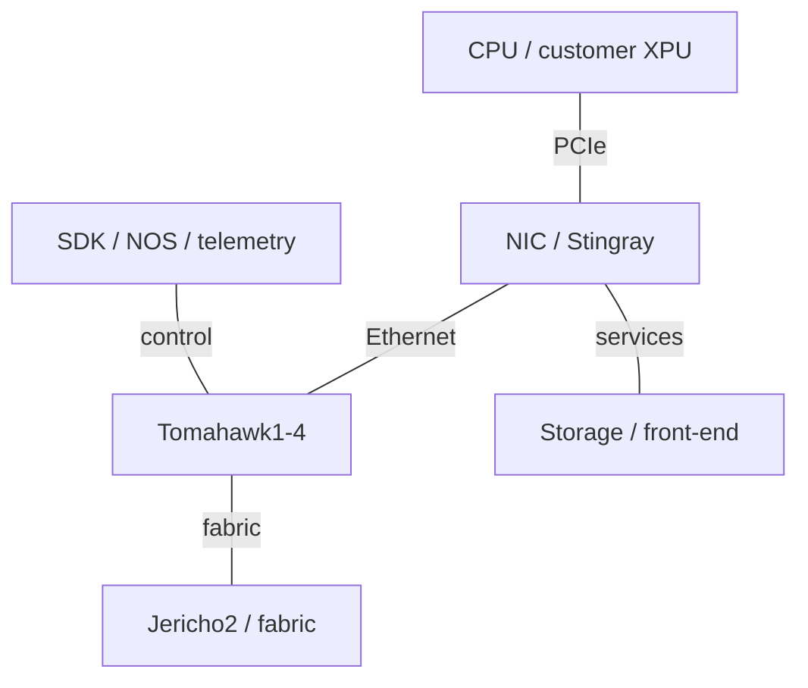
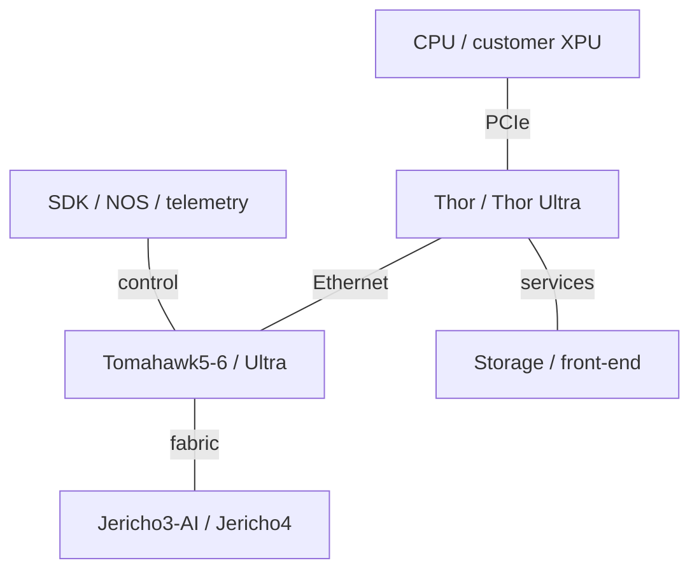

# Broadcom AI Infrastructure Architecture Evolution

2015-2026 | 2026-09-28

## 01 Scope and executive synthesis

Deep coverage: Tomahawk, Jericho, AI Ethernet NICs and their system roles. Full coverage: SerDes, CPO and publicly named custom-XPU programs. CPU and accelerator schemas are retained, but Broadcom is not treated as a merchant server-CPU or general-purpose GPU vendor. Period: 2015-28 September 2026. The latest reviewed events include ISSCC 2025, Hot Chips 2025, the public Hot Chips 2026 program and 2026 partner announcements. Storage connectivity is proportional; VMware is outside the silicon architecture scope.

Broadcom’s evolution is from supplying switch capacity to shaping the entire communication path of an AI system. High radix reduces network tiers; NIC transport handles path diversity and recovery; scheduled fabrics control contention; optics changes physical reach and power. The custom-XPU business connects these technologies to customer-specific compute. The important architectural comparison is not simply Ethernet versus a proprietary fabric, but which layer owns scheduling, ordering, congestion and failure recovery.

## 02 Bandwidth, status and topology conventions

Switch capacity is quoted in the vendor’s native convention and is not automatically the sum of both directions. Endpoint Ethernet rates are line rates; dividing Gb/s by eight gives nominal GB/s before protocol overhead. Jericho front-panel bandwidth and fabric-interface bandwidth must be separated: adding them can produce a headline that is not usable endpoint injection bandwidth. Chip availability, OEM switch qualification and deployed system scale are separate milestones. n/d means not established in reviewed sources; n/a means not applicable.

## 03 Tomahawk1-4: radix and SerDes drive the system

Tomahawk established the high-bandwidth cloud-switch line in the 2015-era baseline. Tomahawk2 doubled capacity to 6.4 Tb/s; Tomahawk3 doubled it again to 12.8 Tb/s and enabled dense 400GbE configurations through 50G PAM4 signaling. Tomahawk4 reached 25.6 Tb/s and subsequently entered production. These transitions are not just larger crossbars: each changes the number of endpoints that can be connected at a fixed radix, the number of tiers, cable count and optical power.

Architectural interpretation: at fixed total switching bandwidth, increasing endpoint speed reduces the number of endpoint-facing ports. Capacity doubling can therefore be consumed entirely by speed doubling, leaving radix unchanged. A system designer should ask whether a new generation buys more nodes per tier, higher bandwidth per node or lower oversubscription. Those are different benefits. Port counts must also reserve uplinks; a 64-port switch is not automatically a nonblocking 64-endpoint leaf.

## 04 Tomahawk5, Tomahawk6 and Tomahawk Ultra

Tomahawk5 couples 51.2 Tb/s switching with 100G-class PAM4 lanes. The ISSCC 2025 paper 16.1 identifies a monolithic 5 nm implementation with 512 PAM4 SerDes lanes; the reviewed press kit establishes that implementation mapping, while product documents establish supported port configurations. This is a useful example of conference synthesis: the circuit venue explains realization and power-management concerns, while the product source explains the network building block. The press kit is not treated as the full paper.

Tomahawk6 reaches 102.4 Tb/s and offers 100G- and 200G-class SerDes configurations. Its architecture combines higher radix with routing, congestion and telemetry functions for AI. The 2025 announcement and the 2026 production announcement are recorded separately. CPO variants are not automatically identical to the electrical package: optical-engine integration changes the package, cooling, serviceability and link-budget problem even when the logical switch capacity remains the same.

Tomahawk Ultra is a specialization branch, not simply the next numbered Tomahawk. The Hot Chips 2025 presentation emphasizes 51.2 Tb/s operation for small packets, roughly 250 ns switching latency, link-level retry, shortened headers and in-network collectives. These features address scale-up traffic where transaction overhead and latency can dominate. A small-packet throughput claim and a bulk-bandwidth claim are different tests; full-size frame line rate cannot establish the former.

## 05 Jericho: scheduled fabrics and regional scale

The Jericho lineage targets richer traffic management and modular fabric construction. Jericho2 combines packet processing, buffering and fabric attachment; its 9.6 Tb/s headline includes interfaces that must not all be counted as endpoint traffic. Jericho3-AI extends this approach to AI fabrics using coordinated scheduling and a separate fabric element. Its significance is contention management across a distributed switch system, rather than a claim that every individual chip has the capacity of the whole cluster.

Jericho4 adds 3 nm implementation, 200G PAM4, MACsec and the 3.2 Tb/s HyperPort abstraction formed from four 800GbE links. The launch discusses RoCE over regional distances beyond 100 km. The availability paragraph says sampling, despite a headline using “ships”; this report uses sampling unless a later production source establishes otherwise. Longer reach expands placement freedom but cannot remove propagation latency, so the suitable parallelism and synchronization cadence remain workload-dependent.

## 06 NICs, SmartNICs and complementary connectivity

Stingray represents infrastructure offload: programmable processing moves cloud services away from the host CPU. Thor and Thor Ultra represent the endpoint communication path. Thor Ultra’s PCIe 6 ×16 interface, 800G Ethernet, multipath delivery, out-of-order placement, selective retransmission and programmable congestion control target AI collective traffic. PSP offload and device security complement transport. These functions do not make it interchangeable with a DPU running arbitrary infrastructure services.

SerDes, retimers, optical DSPs, CPO, PCIe switches and storage connectivity are adjacent but distinct product layers. A retimer restores an electrical link; an optical DSP conditions a modulated optical channel; a switch routes traffic. Their power and latency belong in the end-to-end path rather than being hidden in a switch-chip number. OCP and OFC disclosures are especially relevant for these integration boundaries, while OEM demonstrations establish system compatibility rather than universal deployment.

## 07 Generation and network comparison tables

### Switch generations and capacity basis

| Family | First disclosure / production | Capacity | Implementation / role | Status |
| --- | --- | --- | --- | --- |
| Tomahawk1 | 2014-2015 | 3.2 Tb/s | Cloud Ethernet | Historical shipping |
| Tomahawk2 | 2016 | 6.4 Tb/s | 64 × 100GbE | Historical shipping |
| Tomahawk3 | 2017 / 2018 | 12.8 Tb/s | 50G PAM4 | Historical shipping |
| Tomahawk4 | 2019 / 2020 | 25.6 Tb/s | High-radix Ethernet | Shipping / available |
| Tomahawk5 | 2022 / 2023 | 51.2 Tb/s | 5 nm; 512 PAM4 lanes | Shipping / available |
| Tomahawk6 | 2025 / 2026 | 102.4 Tb/s | 100G / 200G PAM4 | Shipping / available |
| Tomahawk Ultra | 2025 | 51.2 Tb/s | Small-packet / low latency | Shipping / available |
| Jericho2 | 2018 / 2019 | 4.8 Tb/s packet path; separate fabric I/O | Buffered modular switch | Historical shipping |
| Jericho3-AI | 2023 | 28.8 Tb/s vendor combined basis | Scheduled AI fabric | Announced; GA n/d |
| Jericho4 | 2025 | 3.2 Tb/s per HyperPort; chip total n/d | 3 nm; 200G PAM4 | Sampling; GA n/d |

### Networking fixed schema

| Product | GA / milestone | Status | Class | Ports × speed | SerDes | Host interface | Programmable engine | Embedded CPU | On-card memory | Transport / RDMA | Congestion control | Key offloads | Power |
| --- | --- | --- | --- | --- | --- | --- | --- | --- | --- | --- | --- | --- | --- |
| Tomahawk5 | 2023 | Shipping / available | Scale-out switch | 64 × 800GbE | 100G PAM4 | n/a | Switch pipeline | n/d | n/d | Ethernet | Cognitive Routing | L2/L3 / telemetry | n/d |
| Tomahawk Ultra | 2025 | Shipping / available | Scale-up switch | 64 × 800GbE | 100G PAM4 | n/a | Switch / collectives | n/d | n/d | Ethernet / LLR | Adaptive routing | Header reduction / collectives | n/d |
| Tomahawk6 | 2026 production | Shipping / available | Scale-up / out switch | 102.4 Tb/s total | 100G / 200G PAM4 | n/a | Switch pipeline | n/d | n/d | Ethernet | Cognitive Routing 2.0 | Telemetry / CPO option | n/d |
| Jericho4 | 2025 sampling | Sampling; GA n/d | Fabric router | HyperPort 4 × 800G | 200G PAM4 | n/a | Traffic manager | n/d | n/d | Ethernet / RoCE | Deep-buffer fabric | MACsec | n/d |
| Thor Ultra | 2025 announced | Announced; GA n/d | AI NIC | 800 Gb/s | 100G / 200G PAM4 | PCIe 6 ×16 | Programmable congestion pipeline | n/d | n/d | RoCE / UEC | Sender / receiver programmable | PSP / OOO / retry | n/d |
| Stingray | 2020 deployment | Historical shipping | SmartNIC | n/d | n/d | PCIe; n/d | Programmable offload | n/d | n/d | n/d | n/d | Cloud infrastructure | n/d |

## 08 Custom XPUs and portfolio boundaries

Publicly named collaborations establish Broadcom’s role in customer-specific accelerators. Meta identifies the MTIA collaboration, and the June 2026 OpenAI announcement identifies Jalapeño engineering samples and Broadcom’s implementation and networking contribution. Customer architecture ownership and supplier implementation responsibility must remain distinct. There is no single public Broadcom XPU instruction set or uniform accelerator specification that can be assigned to every customer.

Architectural interpretation: reusable SerDes, memory interfaces, die-to-die links and physical-design capabilities can shorten implementation without making customer compute architectures identical. The software burden remains attached to the customer’s compiler, runtime and model kernels. A useful cross-vendor comparison should place MTIA specifications in the Meta report and only documented supplier contributions here, preventing double counting of both engineering claims and installed capacity.

### Host CPU boundary

| Generation / reference SKU | Codename | GA | Status | Core µarch | Cores / threads | Process per die | Dies / packaging | L2 per core | L3 / domain | Memory: channels; rate; GB/s | Sockets / links | PCIe / CXL | TDP | Vector / matrix ISA |
| --- | --- | --- | --- | --- | --- | --- | --- | --- | --- | --- | --- | --- | --- | --- |
| No in-scope merchant host CPU | n/a | n/a | n/a | n/a | n/a | n/a | n/a | n/a | n/a | n/a | n/a | n/a | n/a | n/a |

### Customer-owned accelerator programs

| Product | Architecture | GA / milestone | Status | Process | Dies / packaging | Compute units | Dense BF16 | Dense FP8 | Dense FP6 / FP4 | FP64 vector / matrix | Memory: type; stacks; GB; TB/s | LLC / SRAM | Scale-up: links; GB/s per direction; domain | Host link | Power / cooling | Form factor |
| --- | --- | --- | --- | --- | --- | --- | --- | --- | --- | --- | --- | --- | --- | --- | --- | --- |
| MTIA collaboration | Customer-specific | n/d | See Meta report | n/d | n/d | n/d | n/d | n/d | n/d | n/d | n/d | n/d | n/d | n/d | n/d | n/d |
| Jalapeño | OpenAI inference | n/d | Sampling; GA n/d | n/d | n/d | n/d | n/d | n/d | n/d | n/d | n/d | n/d | n/d | n/d | n/d | n/d |

## 09 Integrated stack and software

The deployed network combines silicon SDKs, operating systems such as SONiC in supported platforms, management and telemetry, and endpoint transport software. Open protocols do not guarantee identical behavior across vendors: feature negotiation, congestion tuning and firmware maturity can dominate interoperability. UEC compliance, RoCE compatibility and scale-up memory semantics are separate questions. Network software must be qualified with the target accelerator collective library and failure scenarios.

### 2015-2020 network stack

Product roles, not a claim that all families are required in one deployment.

### 2023-2026 network stack

Product roles, not a claim that all families are required in one deployment.

### Interconnect roles

| Interconnect | Year / generation | Lane rate | Lanes / link | GB/s per link per direction | Links / device | Topology | Domain limit | Coherence / semantics |
| --- | --- | --- | --- | --- | --- | --- | --- | --- |
| Ethernet / SUE | 2025-2026 | 100G / 200G class | n/d | n/d | n/d | Switched | Topology-dependent | Transport does not establish CPU coherence |
| HyperPort | 2025 | n/d | 4 × 800GbE | 400 GB/s nominal | n/d | Logical grouped port | n/d | Ethernet / RoCE |

### System integration boundary

| Platform | Year / milestone | CPU / accelerator count | Scale-up domain | Scale-out per accelerator | Rack power | Cooling |
| --- | --- | --- | --- | --- | --- | --- |
| OEM switch platforms | 2015-2026 | External CPUs / XPUs | Topology-dependent | n/d | n/d | Platform-dependent |

### Software integration contracts

| Layer | Interface | Function | Boundary |
| --- | --- | --- | --- |
| Switch control | SDK / supported open interfaces | Forwarding and telemetry | ASIC-specific implementation |
| Infrastructure | Firmware / driver / acceleration APIs | Packet, storage and security offload | SKU and platform dependent |
| System integration | Host software and partner stack | Resource and traffic management | No single vendor-only AI framework |

## 10 Derived metrics and architectural trade-offs

### Nominal bandwidth normalization

| Quantity | Calculation | Meaning |
| --- | --- | --- |
| 800GbE | 800/8 = 100 GB/s | Per direction before overhead |
| 3.2T HyperPort | 4×800/8 = 400 GB/s | Logical port; not chip total |
| Tomahawk1 → 6 | 102.4/3.2 = 32× | Native switch-capacity convention |
| HBM / FLOP; performance / W | n/a; n/d | No uniform compute SKU / power basis |

The main trade-off is where complexity sits. An endpoint-scheduled fabric places congestion response in NICs and hosts; a fabric-scheduled design moves more coordination into the network. Low-latency scale-up adds requirements for small packets, retry and collective support that differ from conventional cloud forwarding. CPO shortens electrical reach and can reduce I/O energy, but places optical reliability and maintenance closer to expensive switch silicon. None of these choices eliminates the need to measure job completion time under contention and failure.

## 11 Conference index and naming crosswalk

### Verified disclosure map

| Venue | Year | Paper / talk / disclosure | Presenter / authors | Product | Evidence type | Source |
| --- | --- | --- | --- | --- | --- | --- |
| ISSCC | 2025 | 16.1 Tomahawk5: 51.2Tb/s 5nm Monolithic Switch Chip for AI/ML Networking | Broadcom | Tomahawk5 | Implementation; press kit reviewed | C01 |
| Hot Chips | 2025 | Tomahawk Ultra | Broadcom | Tomahawk Ultra | Architecture slides | C02 |
| Hot Chips | 2026 | Thor Ultra: An Ethernet NIC Chip Optimized for AI & HPC | Hemal Shah | Thor Ultra | Program verified; vendor specs used | C03 E03 |
| OCP Global Summit | 2025 | End-to-end AI networking | Broadcom | Switch / NIC / CPO | System demonstrations | E04 |

ISCA, MICRO, HPCA and ASPLOS are not used here to manufacture a nonexistent product-paper lineage. For this portfolio, the strongest identified bridge is Hot Chips architecture plus ISSCC implementation and vendor/OCP system documentation. OFC is a natural follow-up channel for optics; the present bibliography does not claim exhaustive coverage of every OFC or DAC session. Product names and codenames are crosswalked only where the vendor identifies them.

### Product names

| Marketing family | Product identifier | Distinction |
| --- | --- | --- |
| Tomahawk1 | BCM56960 | Cloud switch baseline |
| Tomahawk5 | BCM78900 | General high-radix switch |
| Tomahawk Ultra | BCM78920 | Scale-up specialization |
| Jericho3-AI | BCM88890 | Scheduled AI fabric |
| Thor Ultra | n/d | AI NIC; not Tomahawk Ultra |

The remaining gaps are quantitative power at a fixed port configuration, full buffer organization for every generation, per-lane electrical detail and customer-XPU implementation specifications. These constrain direct energy comparisons. The most useful next tests would hold endpoint count, port speed, oversubscription, collective mix and failure load constant, then measure delivered bandwidth and tail job latency across endpoint- and fabric-scheduled alternatives.

## Source map

01 Scope and executive synthesis — C01, C02, C03, E01, E02, E03, E11, E12

02 Bandwidth, status and topology conventions — E01, E03, P04, P05

03 Tomahawk1-4: radix and SerDes drive the system — E01, E05, E06, E07, P01, P03

04 Tomahawk5, Tomahawk6 and Tomahawk Ultra — C01, C02, E01, E04, E08, E09, P01, P02

05 Jericho: scheduled fabrics and regional scale — E02, E13, P04, P05

06 NICs, SmartNICs and complementary connectivity — E03, E04, E10

07 Generation and network comparison tables — C01, C02, E01, E02, E03, E05, E06, E07, E08, E09, E10, E13, P01, P03, P04, P05

08 Custom XPUs and portfolio boundaries — E11, E12

09 Integrated stack and software — C02, E01, E02, E03, E04, E10, P01, P02

10 Derived metrics and architectural trade-offs — C02, E01, E02, E03, E04, E11, E12, E13, P03

11 Conference index and naming crosswalk — C01, C02, C03, E03, E04, E13, P01, P02, P03, P05

## References

### Product and technical documentation

[P01] Tomahawk5 BCM78900. [https://www.broadcom.com/products/ethernet-connectivity/switching/strataxgs/bcm78900-series](https://www.broadcom.com/products/ethernet-connectivity/switching/strataxgs/bcm78900-series). Indexed record or searchable official page; product details cross-checked with the associated technical document.

[P02] Tomahawk Ultra BCM78920. [https://www.broadcom.com/products/ethernet-connectivity/switching/strataxgs/bcm78920-series](https://www.broadcom.com/products/ethernet-connectivity/switching/strataxgs/bcm78920-series). Indexed record or searchable official page; product details cross-checked with the associated technical document.

[P03] Tomahawk1 BCM56960. [https://www.broadcom.com/products/ethernet-connectivity/switching/strataxgs/bcm56960-series](https://www.broadcom.com/products/ethernet-connectivity/switching/strataxgs/bcm56960-series). Indexed record or searchable official page; product details cross-checked with the associated technical document.

[P04] Jericho2 datasheet. [https://docs.broadcom.com/doc/BCM88690-9-6-Tb/s-Integrated-Packet-Processor-Traffic-Manager-and-Fabric-Interface-Single-Chip-Device-DS](https://docs.broadcom.com/doc/BCM88690-9-6-Tb/s-Integrated-Packet-Processor-Traffic-Manager-and-Fabric-Interface-Single-Chip-Device-DS). Primary source; accessed by 2026-09-28

[P05] Jericho3-AI product. [https://www.broadcom.com/products/ethernet-connectivity/switching/stratadnx/bcm88890](https://www.broadcom.com/products/ethernet-connectivity/switching/stratadnx/bcm88890). Indexed record or searchable official page; product details cross-checked with the associated technical document.

### Conference records and implementation disclosures

[C01] ISSCC 2025 press kit; paper 16.1 Tomahawk5. [https://submissions.mirasmart.com/ISSCC2025/PDF/ISSCC2025PressKit.pdf](https://submissions.mirasmart.com/ISSCC2025/PDF/ISSCC2025PressKit.pdf). Official conference program or press material; not the full paper.

[C02] Tomahawk Ultra, Hot Chips 2025. [https://hc2025.hotchips.org/assets/program/conference/day1/TU-HotChips-2025-Final-2025-08-25-v1.pdf](https://hc2025.hotchips.org/assets/program/conference/day1/TU-HotChips-2025-Final-2025-08-25-v1.pdf). Primary source; accessed by 2026-09-28

[C03] Thor Ultra, Hot Chips 2026 program. [https://hc2026.hotchips.org/program/conference/](https://hc2026.hotchips.org/program/conference/). Official indexed record or related announcement; full document download unavailable.

### Launches, ecosystem and deployment

[E01] Tomahawk6 launch. [https://investors.broadcom.com/news-releases/news-release-details/broadcom-ships-tomahawk-6-worlds-first-1024-tbps-switch](https://investors.broadcom.com/news-releases/news-release-details/broadcom-ships-tomahawk-6-worlds-first-1024-tbps-switch). Primary source; accessed by 2026-09-28

[E02] Jericho4 launch. [https://investors.broadcom.com/news-releases/news-release-details/broadcom-ships-jericho4-enabling-distributed-ai-computing-across](https://investors.broadcom.com/news-releases/news-release-details/broadcom-ships-jericho4-enabling-distributed-ai-computing-across). Primary source; accessed by 2026-09-28

[E03] Thor Ultra 800G AI Ethernet NIC. [https://investors.broadcom.com/news-releases/news-release-details/broadcom-introduces-industrys-first-800g-ai-ethernet-nic](https://investors.broadcom.com/news-releases/news-release-details/broadcom-introduces-industrys-first-800g-ai-ethernet-nic). Primary source; accessed by 2026-09-28

[E04] OCP 2025 end-to-end AI networking. [https://investors.broadcom.com/news-releases/news-release-details/broadcom-delivers-future-ai-infrastructure-end-end-ai-networking](https://investors.broadcom.com/news-releases/news-release-details/broadcom-delivers-future-ai-infrastructure-end-end-ai-networking). Primary source; accessed by 2026-09-28

[E05] Tomahawk2 announcement. [https://www.broadcom.com/news/product-releases/broadcom-first-to-deliver-64-ports-of-100ge-with-tomahawk-ii-ethernet-switch](https://www.broadcom.com/news/product-releases/broadcom-first-to-deliver-64-ports-of-100ge-with-tomahawk-ii-ethernet-switch). Indexed record or searchable official page; product details cross-checked with the associated technical document.

[E06] Tomahawk3 production. [https://investors.broadcom.com/news-releases/news-release-details/broadcom-achieves-mass-production-industry-leading-128-tbps](https://investors.broadcom.com/news-releases/news-release-details/broadcom-achieves-mass-production-industry-leading-128-tbps). Primary source; accessed by 2026-09-28

[E07] Tomahawk4 production. [https://www.broadcom.com/company/news/product-releases/53966](https://www.broadcom.com/company/news/product-releases/53966). Indexed record or searchable official page; product details cross-checked with the associated technical document.

[E08] Tomahawk5 production. [https://investors.broadcom.com/news-releases/news-release-details/broadcom-now-shipping-worlds-first-512-tbps-switch-production](https://investors.broadcom.com/news-releases/news-release-details/broadcom-now-shipping-worlds-first-512-tbps-switch-production). Primary source; accessed by 2026-09-28

[E09] Tomahawk6 production. [https://www.broadcom.com/company/news/product-releases/64031](https://www.broadcom.com/company/news/product-releases/64031). Indexed record or searchable official page; product details cross-checked with the associated technical document.

[E10] Stingray SmartNIC deployment. [https://www.broadcom.com/company/news/product-releases/53106](https://www.broadcom.com/company/news/product-releases/53106). Indexed record or searchable official page; product details cross-checked with the associated technical document.

[E11] Meta custom silicon partnership. [https://www.broadcom.com/company/news/product-releases/64236](https://www.broadcom.com/company/news/product-releases/64236). Indexed record or searchable official page; product details cross-checked with the associated technical document.

[E12] OpenAI Jalapeno engineering samples. [https://investors.broadcom.com/news-releases/news-release-details/openai-and-broadcom-unveil-llm-optimized-intelligence-processor](https://investors.broadcom.com/news-releases/news-release-details/openai-and-broadcom-unveil-llm-optimized-intelligence-processor). Primary source; accessed by 2026-09-28

[E13] Jericho3-AI scheduled fabric. [https://investors.broadcom.com/news-releases/news-release-details/broadcom-unveils-industrys-highest-performance-fabric-ai](https://investors.broadcom.com/news-releases/news-release-details/broadcom-unveils-industrys-highest-performance-fabric-ai). Primary source; accessed by 2026-09-28
