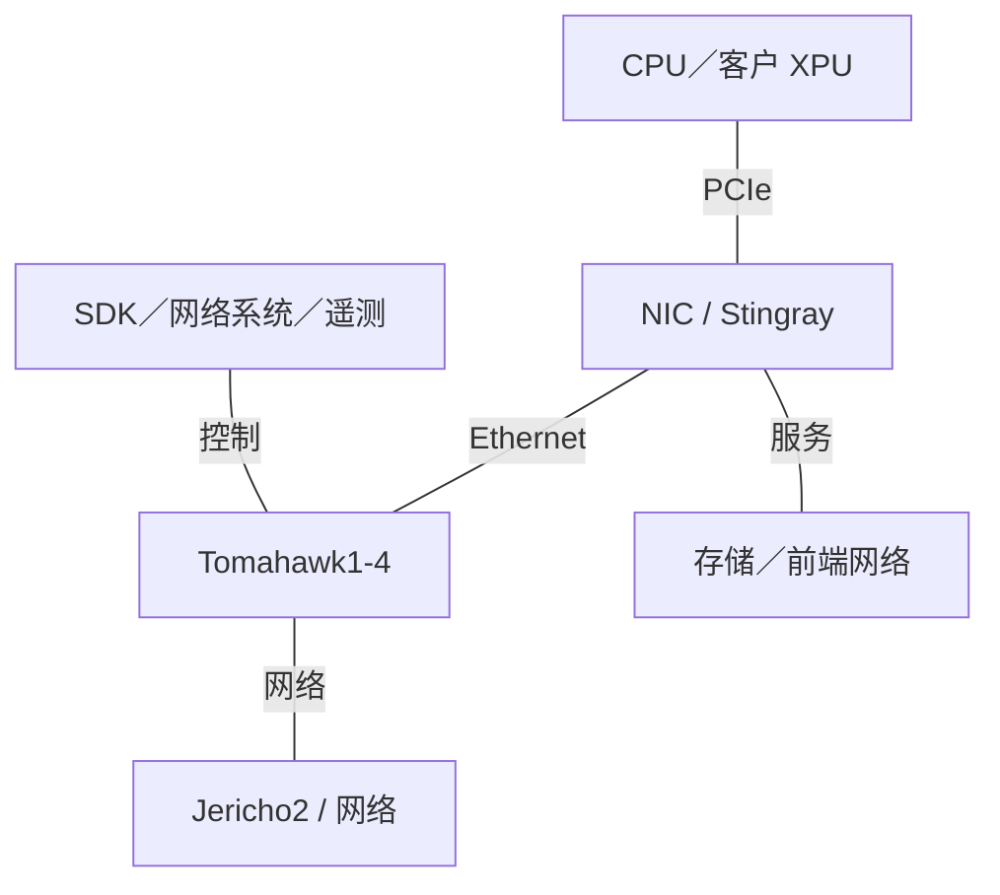
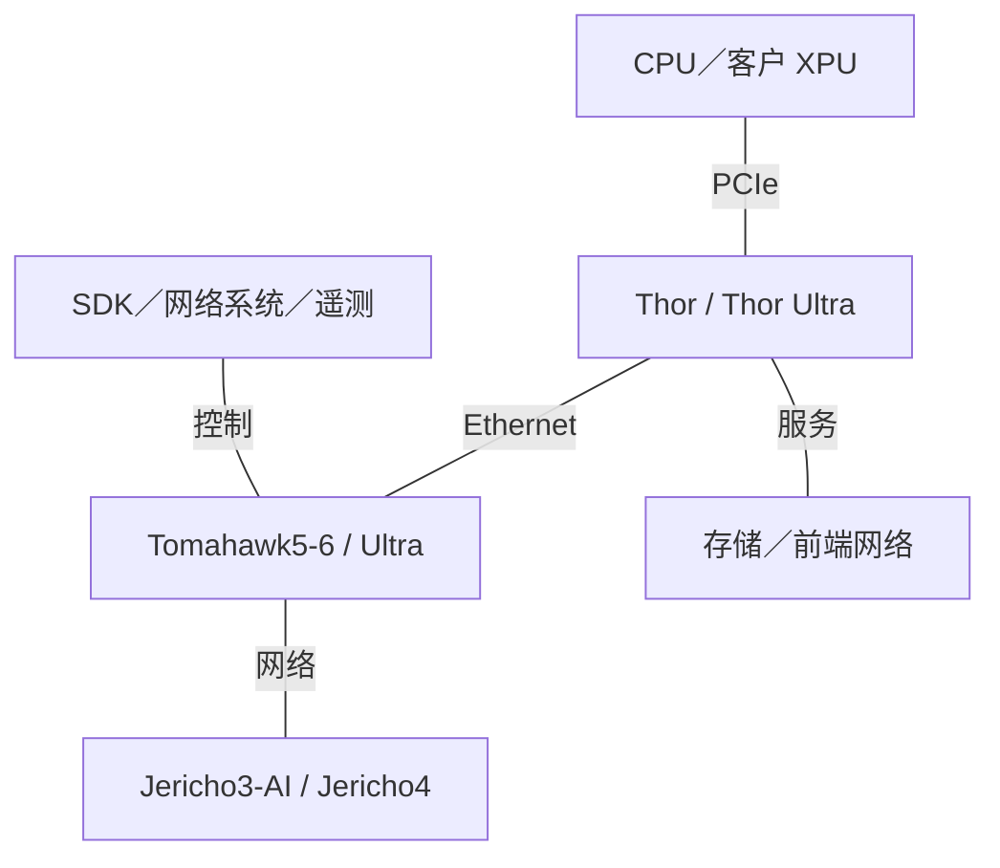

# Broadcom AI 基础设施架构演进

2015-2026 | 2026-09-28

## 01 范围与核心判断

深入覆盖 Tomahawk、Jericho、AI 以太网卡及其系统角色；完整覆盖 SerDes、CPO 和公开具名的定制 XPU 项目。保留 CPU 与加速器表结构，但不把 Broadcom 视为通用商用服务器 CPU 或 GPU 厂商。时间范围：2015 年至 2026 年 9 月 28 日。最新已审阅活动包括 ISSCC 2025、Hot Chips 2025、Hot Chips 2026 公开议程及 2026 年合作伙伴发布。按相关性覆盖存储连接；VMware 不属于本报告芯片架构范围。

Broadcom 的演进，是从提供交换容量转向塑造 AI 系统的完整通信路径。高端口密度减少网络层级；网卡传输处理多路径与恢复；调度式网络控制争用；光互联改变距离与功耗；定制 XPU 则把这些技术连接到客户专用计算。关键架构比较不只是以太网与专有网络之争，而是哪一层负责调度、排序、拥塞及故障恢复。

## 02 带宽、状态与拓扑口径

交换容量保留厂商原始口径，不自动理解为两个方向之和。端点以太网速率是线路速率；Gb/s 除以八得到未扣除协议开销的标称 GB/s。Jericho 的前面板带宽与内部网络接口带宽必须分开；把它们相加得到的标题数字，并不是端点可用注入带宽。芯片可用、OEM 交换机验证和系统部署规模属于不同里程碑。n/d 表示已审阅资料未确定，n/a 表示不适用。

## 03 Tomahawk1-4：端口密度与 SerDes 驱动系统

Tomahawk 在 2015 年前后的基线阶段建立高带宽云交换产品线。Tomahawk2 将容量翻倍至 6.4 Tb/s，Tomahawk3 再翻倍至 12.8 Tb/s，并通过 50G PAM4 支持高密度 400GbE 配置。Tomahawk4 达到 25.6 Tb/s，随后进入量产。这些变化不只是交叉开关变大：每一代都改变固定端口密度下可连接的端点数、网络层级、线缆数量及光模块功耗。

架构解读：在总交换带宽固定时，提高端点速率会减少面向端点的端口数。因此，容量翻倍可能被速率翻倍全部消耗，端口数量并不增加。系统设计者应明确新一代带来的是每层更多节点、每节点更高带宽，还是更低超售比。这是不同收益。端口还必须预留上联；64 端口交换机不自动等于无阻塞连接 64 个端点的叶交换机。

## 04 Tomahawk5、Tomahawk6 与 Tomahawk Ultra

Tomahawk5 把 51.2 Tb/s 交换与 100G 级 PAM4 通道结合。ISSCC 2025 论文 16.1 对应单片 5 nm 实现、512 条 PAM4 SerDes；已审阅的会议新闻资料建立该实现映射，产品文档提供端口配置。这体现了跨会议综合的价值：电路会议解释实现与功耗管理问题，产品资料解释网络构件。本报告不把新闻资料当作论文全文。

Tomahawk6 达到 102.4 Tb/s，提供 100G 与 200G 级 SerDes 配置。其架构把更高端口密度与面向 AI 的路由、拥塞和遥测功能结合。2025 年发布与 2026 年量产分别记录。CPO 变体不自动等同于电接口封装：即使逻辑交换容量相同，光引擎集成也会改变封装、散热、维护和链路预算问题。

Tomahawk Ultra 是专用化分支，并非简单的下一代编号 Tomahawk。Hot Chips 2025 演讲强调小包条件下 51.2 Tb/s、约 250 ns 交换延迟、链路级重试、精简报头与网内集合操作。这些特性针对事务开销和延迟可能占主导的纵向扩展流量。小包吞吐与大块数据带宽是不同测试；大帧满线速无法证明小包性能。

## 05 Jericho：调度式网络与区域扩展

Jericho 谱系侧重更丰富的流量管理及模块化网络构建。Jericho2 结合包处理、缓冲及内部网络连接；9.6 Tb/s 标题包含不同接口，不能全部算作端点流量。Jericho3-AI 通过协调调度与独立网络交换元件，把这一方法扩展到 AI 网络。其意义在于分布式交换系统的争用管理，而不是单颗芯片具有整个集群的容量。

Jericho4 增加 3 nm 实现、200G PAM4、MACsec，并以四条 800GbE 链路构成 3.2 Tb/s HyperPort 抽象。发布资料讨论超过 100 km 区域距离上的 RoCE。虽然标题使用“发货”，可用性段落明确为送样，因此在没有更新量产证据时本报告采用送样状态。更远距离扩大部署自由度，却无法消除传播延迟；合适的并行方式与同步频率仍取决于负载。

## 06 网卡、SmartNIC 与配套连接

Stingray 代表基础设施卸载：通过可编程处理把云服务工作移出主机 CPU。Thor 与 Thor Ultra 则代表端点通信路径。Thor Ultra 的 PCIe 6 ×16、800G 以太网、多路径、乱序放置、选择性重传及可编程拥塞控制，针对 AI 集合通信流量。PSP 卸载与设备安全为传输提供配套能力。这些功能并不使其与运行任意基础设施服务的 DPU 完全可互换。

SerDes、重定时器、光 DSP、CPO、PCIe 交换机与存储连接相邻，但属于不同产品层次。重定时器恢复电链路，光 DSP 处理调制光通道，交换机路由流量。它们的功耗和延迟应计入端到端路径，而不是隐藏在交换芯片指标中。OCP 与 OFC 披露尤其适合研究这些集成边界；OEM 演示证明系统兼容，并不代表全面部署。

## 07 代际与网络对照表

### 交换代际及容量口径

| 家族 | 首次披露／量产 | 容量 | 实现／角色 | 状态 |
| --- | --- | --- | --- | --- |
| Tomahawk1 | 2014-2015 | 3.2 Tb/s | 云以太网 | 历史已商用 |
| Tomahawk2 | 2016 | 6.4 Tb/s | 64 × 100GbE | 历史已商用 |
| Tomahawk3 | 2017 / 2018 | 12.8 Tb/s | 50G PAM4 | 历史已商用 |
| Tomahawk4 | 2019 / 2020 | 25.6 Tb/s | 高端口密度以太网 | 已商用／可获取 |
| Tomahawk5 | 2022 / 2023 | 51.2 Tb/s | 5 nm; 512 PAM4 通道 | 已商用／可获取 |
| Tomahawk6 | 2025 / 2026 | 102.4 Tb/s | 100G / 200G PAM4 | 已商用／可获取 |
| Tomahawk Ultra | 2025 | 51.2 Tb/s | 小包／低延迟 | 已商用／可获取 |
| Jericho2 | 2018 / 2019 | 4.8 Tb/s 包路径；另有内部网络 I/O | 有缓冲模块化交换 | 历史已商用 |
| Jericho3-AI | 2023 | 厂商组合口径 28.8 Tb/s | 调度式 AI 网络 | 已公布；GA n/d |
| Jericho4 | 2025 | 每 HyperPort 3.2 Tb/s；芯片总量 n/d | 3 nm; 200G PAM4 | 送样；正式商用 n/d |

### 网络固定规格表

| 产品 | 商用／里程碑 | 状态 | 类别 | 端口×速率 | SerDes | 主机接口 | 可编程引擎 | 嵌入式 CPU | 板载内存 | 传输／RDMA | 拥塞控制 | 主要卸载 | 功耗 |
| --- | --- | --- | --- | --- | --- | --- | --- | --- | --- | --- | --- | --- | --- |
| Tomahawk5 | 2023 | 已商用／可获取 | 横向交换 | 64 × 800GbE | 100G PAM4 | n/a | 交换流水线 | n/d | n/d | Ethernet | 认知路由 | L2/L3 / telemetry | n/d |
| Tomahawk Ultra | 2025 | 已商用／可获取 | 纵向交换 | 64 × 800GbE | 100G PAM4 | n/a | 交换／集合操作 | n/d | n/d | Ethernet / LLR | 自适应路由 | 精简报头／集合操作 | n/d |
| Tomahawk6 | 2026 量产／生产部署 | 已商用／可获取 | 纵向／横向交换 | 102.4 Tb/s 总量 | 100G / 200G PAM4 | n/a | 交换流水线 | n/d | n/d | Ethernet | Cognitive Routing 2.0 | 遥测／CPO 选项 | n/d |
| Jericho4 | 2025 送样 | 送样；正式商用 n/d | 网络路由器 | HyperPort 4 × 800G | 200G PAM4 | n/a | 流量管理 | n/d | n/d | Ethernet / RoCE | 深缓冲网络 | MACsec | n/d |
| Thor Ultra | 2025 已公布 | 已公布；GA n/d | AI 网卡 | 800 Gb/s | 100G / 200G PAM4 | PCIe 6 ×16 | 可编程拥塞流水线 | n/d | n/d | RoCE / UEC | 发送端／接收端可编程 | PSP / OOO / retry | n/d |
| Stingray | 2020 部署 | 历史已商用 | SmartNIC | n/d | n/d | PCIe; n/d | 可编程卸载 | n/d | n/d | n/d | n/d | 云基础设施 | n/d |

## 08 定制 XPU 与产品边界

公开具名合作确定了 Broadcom 在客户专用加速器中的角色。Meta 披露 MTIA 合作，OpenAI 于 2026 年 6 月披露 Jalapeño 工程样片及 Broadcom 在实现和网络方面的贡献。客户架构所有权与供应商实现职责必须区分。不存在可以统一赋予所有客户项目的公开 Broadcom XPU 指令集或通用加速器规格。

架构解读：可复用的 SerDes、存储接口、裸片互联与物理设计能力，可以缩短实现周期，但不使客户计算架构变得相同。软件负担仍由客户编译器、运行时和模型内核承担。跨厂商比较应把 MTIA 规格放在 Meta 报告中，在此仅记录有证据的供应商贡献，避免工程成果和部署容量重复计算。

### 主机 CPU 边界

| 代际／参考 SKU | 代号 | 正式商用 | 状态 | 核心微架构 | 核心／线程 | 各裸片工艺 | 裸片／封装 | 每核 L2 | L3／共享域 | 内存：通道；速率；GB/s | 插槽／互联 | PCIe／CXL | TDP | 向量／矩阵 ISA |
| --- | --- | --- | --- | --- | --- | --- | --- | --- | --- | --- | --- | --- | --- | --- |
| 范围内无通用商用主机 CPU | n/a | n/a | n/a | n/a | n/a | n/a | n/a | n/a | n/a | n/a | n/a | n/a | n/a | n/a |

### 客户拥有的加速器项目

| 产品 | 架构 | 商用／里程碑 | 状态 | 工艺 | 裸片／封装 | 计算单元 | 稠密 BF16 | 稠密 FP8 | 稠密 FP6／FP4 | FP64 向量／矩阵 | 内存：类型；堆栈；GB；TB/s | 末级缓存／SRAM | 纵向扩展：链路；单向 GB/s；域 | 主机连接 | 功耗／散热 | 形态 |
| --- | --- | --- | --- | --- | --- | --- | --- | --- | --- | --- | --- | --- | --- | --- | --- | --- |
| MTIA collaboration | 依客户 | n/d | 见 Meta 报告 | n/d | n/d | n/d | n/d | n/d | n/d | n/d | n/d | n/d | n/d | n/d | n/d | n/d |
| Jalapeño | OpenAI inference | n/d | 送样；正式商用 n/d | n/d | n/d | n/d | n/d | n/d | n/d | n/d | n/d | n/d | n/d | n/d | n/d | n/d |

## 09 集成技术栈与软件

部署网络结合芯片 SDK、受支持平台上的 SONiC 等操作系统、管理遥测和端点传输软件。开放协议不保证不同厂商行为完全相同：特性协商、拥塞调优及固件成熟度可能主导互操作性。UEC 合规、RoCE 兼容与纵向扩展内存语义是不同问题。网络软件必须结合目标加速器集合库及故障场景验证。

### 2015-2020 网络技术栈

产品角色图，不表示所有家族必须同时用于同一部署。

### 2023-2026 网络技术栈

产品角色图，不表示所有家族必须同时用于同一部署。

### 互联角色

| 互联 | 年份／代际 | 通道速率 | 每链路通道 | 每链路单向 GB/s | 每设备链路 | 拓扑 | 域规模 | 一致性／语义 |
| --- | --- | --- | --- | --- | --- | --- | --- | --- |
| Ethernet / SUE | 2025-2026 | 100G / 200G 级 | n/d | n/d | n/d | 交换式 | 依拓扑 | 传输不等于 CPU 一致性 |
| HyperPort | 2025 | n/d | 4 × 800GbE | 400 GB/s 标称 | n/d | 逻辑组合端口 | n/d | Ethernet / RoCE |

### 系统集成边界

| 平台 | 年份／里程碑 | CPU／加速器数量 | 纵向扩展域 | 每加速器横向带宽 | 机架功耗 | 散热 |
| --- | --- | --- | --- | --- | --- | --- |
| OEM 交换平台 | 2015-2026 | 外部 CPU／XPU | 依拓扑 | n/d | n/d | 依平台 |

### 软件集成契约

| 层 | 接口 | 功能 | 边界 |
| --- | --- | --- | --- |
| 交换控制 | SDK／受支持开放接口 | 转发与遥测 | 依 ASIC 实现 |
| 基础设施 | 固件／驱动／加速 API | 包、存储与安全卸载 | 依 SKU 与平台 |
| 系统集成 | 主机软件及伙伴技术栈 | 资源与流量管理 | 不存在统一纯厂商 AI 框架 |

## 10 推导指标与架构取舍

### 标称带宽归一化

| 项目 | 计算 | 含义 |
| --- | --- | --- |
| 800GbE | 800/8 = 100 GB/s | 每方向；未扣开销 |
| 3.2T HyperPort | 4×800/8 = 400 GB/s | 逻辑端口；非芯片总量 |
| Tomahawk1 → 6 | 102.4/3.2 = 32× | 原始交换容量口径 |
| HBM／FLOP；性能／W | n/a; n/d | 无统一计算 SKU／功耗口径 |

主要取舍在于复杂性放在哪里。端点调度式网络把拥塞响应放在网卡和主机，网络调度式设计则把更多协调放进网络。低延迟纵向扩展增加小包、重试及集合支持要求，不同于传统云转发。CPO 缩短电链路距离，可能降低 I/O 能耗，却把光学可靠性和维护更紧地绑定到昂贵交换芯片。任何一种选择，都不能替代争用与故障条件下的作业完成时间测量。

## 11 会议索引与命名对照

### 已核实披露映射

| 会议／活动 | 年份 | 论文／演讲／披露 | 报告人／作者 | 产品 | 证据类型 | 来源 |
| --- | --- | --- | --- | --- | --- | --- |
| ISSCC | 2025 | 16.1 Tomahawk5: 51.2Tb/s 5nm Monolithic Switch Chip for AI/ML Networking | Broadcom | Tomahawk5 | 实现；审阅新闻资料 | C01 |
| Hot Chips | 2025 | Tomahawk Ultra | Broadcom | Tomahawk Ultra | 架构幻灯片 | C02 |
| Hot Chips | 2026 | Thor Ultra: An Ethernet NIC Chip Optimized for AI & HPC | Hemal Shah | Thor Ultra | 核实议程；规格来自厂商 | C03 E03 |
| OCP Global Summit | 2025 | End-to-end AI networking | Broadcom | Switch / NIC / CPO | 系统演示 | E04 |

本报告不通过 ISCA、MICRO、HPCA 和 ASPLOS 拼造不存在的产品论文谱系。对这类产品，已识别的最强证据链是 Hot Chips 架构、ISSCC 实现及厂商／OCP 系统资料。OFC 是后续光互联研究的重要渠道；本版参考资料不声称穷尽每场 OFC 或 DAC 演讲。仅在厂商明确对应时建立产品名与代号映射。

### 产品名称

| 市场家族 | 产品标识 | 区别 |
| --- | --- | --- |
| Tomahawk1 | BCM56960 | 云交换基线 |
| Tomahawk5 | BCM78900 | 通用高密度交换 |
| Tomahawk Ultra | BCM78920 | 纵向扩展专用化 |
| Jericho3-AI | BCM88890 | 调度式 AI 网络 |
| Thor Ultra | n/d | AI 网卡；区别于 Tomahawk Ultra |

剩余缺口包括固定端口配置下的量化功耗、各代完整缓冲组织、逐通道电气细节及客户 XPU 实现规格。这些限制直接能效比较。下一步最有效的测试，是固定端点数、端口速率、超售比、集合操作组合及故障负载，对比端点调度与网络调度方案的实际带宽和作业尾延迟。

## 来源映射

01 范围与核心判断 — C01, C02, C03, E01, E02, E03, E11, E12

02 带宽、状态与拓扑口径 — E01, E03, P04, P05

03 Tomahawk1-4：端口密度与 SerDes 驱动系统 — E01, E05, E06, E07, P01, P03

04 Tomahawk5、Tomahawk6 与 Tomahawk Ultra — C01, C02, E01, E04, E08, E09, P01, P02

05 Jericho：调度式网络与区域扩展 — E02, E13, P04, P05

06 网卡、SmartNIC 与配套连接 — E03, E04, E10

07 代际与网络对照表 — C01, C02, E01, E02, E03, E05, E06, E07, E08, E09, E10, E13, P01, P03, P04, P05

08 定制 XPU 与产品边界 — E11, E12

09 集成技术栈与软件 — C02, E01, E02, E03, E04, E10, P01, P02

10 推导指标与架构取舍 — C02, E01, E02, E03, E04, E11, E12, E13, P03

11 会议索引与命名对照 — C01, C02, C03, E03, E04, E13, P01, P02, P03, P05

## 参考资料

### 产品与技术文档

[P01] Tomahawk5 BCM78900. [https://www.broadcom.com/products/ethernet-connectivity/switching/strataxgs/bcm78900-series](https://www.broadcom.com/products/ethernet-connectivity/switching/strataxgs/bcm78900-series). 索引或可检索官方页面；产品细节同时参照对应技术文档。

[P02] Tomahawk Ultra BCM78920. [https://www.broadcom.com/products/ethernet-connectivity/switching/strataxgs/bcm78920-series](https://www.broadcom.com/products/ethernet-connectivity/switching/strataxgs/bcm78920-series). 索引或可检索官方页面；产品细节同时参照对应技术文档。

[P03] Tomahawk1 BCM56960. [https://www.broadcom.com/products/ethernet-connectivity/switching/strataxgs/bcm56960-series](https://www.broadcom.com/products/ethernet-connectivity/switching/strataxgs/bcm56960-series). 索引或可检索官方页面；产品细节同时参照对应技术文档。

[P04] Jericho2 datasheet. [https://docs.broadcom.com/doc/BCM88690-9-6-Tb/s-Integrated-Packet-Processor-Traffic-Manager-and-Fabric-Interface-Single-Chip-Device-DS](https://docs.broadcom.com/doc/BCM88690-9-6-Tb/s-Integrated-Packet-Processor-Traffic-Manager-and-Fabric-Interface-Single-Chip-Device-DS). 一手资料；访问截止 2026-09-28

[P05] Jericho3-AI product. [https://www.broadcom.com/products/ethernet-connectivity/switching/stratadnx/bcm88890](https://www.broadcom.com/products/ethernet-connectivity/switching/stratadnx/bcm88890). 索引或可检索官方页面；产品细节同时参照对应技术文档。

### 会议记录与实现披露

[C01] ISSCC 2025 press kit; paper 16.1 Tomahawk5. [https://submissions.mirasmart.com/ISSCC2025/PDF/ISSCC2025PressKit.pdf](https://submissions.mirasmart.com/ISSCC2025/PDF/ISSCC2025PressKit.pdf). 官方会议议程或新闻资料；不是论文全文。

[C02] Tomahawk Ultra, Hot Chips 2025. [https://hc2025.hotchips.org/assets/program/conference/day1/TU-HotChips-2025-Final-2025-08-25-v1.pdf](https://hc2025.hotchips.org/assets/program/conference/day1/TU-HotChips-2025-Final-2025-08-25-v1.pdf). 一手资料；访问截止 2026-09-28

[C03] Thor Ultra, Hot Chips 2026 program. [https://hc2026.hotchips.org/program/conference/](https://hc2026.hotchips.org/program/conference/). 官方索引或相关发布资料；完整文档未能下载。

### 发布、生态与部署

[E01] Tomahawk6 launch. [https://investors.broadcom.com/news-releases/news-release-details/broadcom-ships-tomahawk-6-worlds-first-1024-tbps-switch](https://investors.broadcom.com/news-releases/news-release-details/broadcom-ships-tomahawk-6-worlds-first-1024-tbps-switch). 一手资料；访问截止 2026-09-28

[E02] Jericho4 launch. [https://investors.broadcom.com/news-releases/news-release-details/broadcom-ships-jericho4-enabling-distributed-ai-computing-across](https://investors.broadcom.com/news-releases/news-release-details/broadcom-ships-jericho4-enabling-distributed-ai-computing-across). 一手资料；访问截止 2026-09-28

[E03] Thor Ultra 800G AI Ethernet NIC. [https://investors.broadcom.com/news-releases/news-release-details/broadcom-introduces-industrys-first-800g-ai-ethernet-nic](https://investors.broadcom.com/news-releases/news-release-details/broadcom-introduces-industrys-first-800g-ai-ethernet-nic). 一手资料；访问截止 2026-09-28

[E04] OCP 2025 end-to-end AI networking. [https://investors.broadcom.com/news-releases/news-release-details/broadcom-delivers-future-ai-infrastructure-end-end-ai-networking](https://investors.broadcom.com/news-releases/news-release-details/broadcom-delivers-future-ai-infrastructure-end-end-ai-networking). 一手资料；访问截止 2026-09-28

[E05] Tomahawk2 announcement. [https://www.broadcom.com/news/product-releases/broadcom-first-to-deliver-64-ports-of-100ge-with-tomahawk-ii-ethernet-switch](https://www.broadcom.com/news/product-releases/broadcom-first-to-deliver-64-ports-of-100ge-with-tomahawk-ii-ethernet-switch). 索引或可检索官方页面；产品细节同时参照对应技术文档。

[E06] Tomahawk3 production. [https://investors.broadcom.com/news-releases/news-release-details/broadcom-achieves-mass-production-industry-leading-128-tbps](https://investors.broadcom.com/news-releases/news-release-details/broadcom-achieves-mass-production-industry-leading-128-tbps). 一手资料；访问截止 2026-09-28

[E07] Tomahawk4 production. [https://www.broadcom.com/company/news/product-releases/53966](https://www.broadcom.com/company/news/product-releases/53966). 索引或可检索官方页面；产品细节同时参照对应技术文档。

[E08] Tomahawk5 production. [https://investors.broadcom.com/news-releases/news-release-details/broadcom-now-shipping-worlds-first-512-tbps-switch-production](https://investors.broadcom.com/news-releases/news-release-details/broadcom-now-shipping-worlds-first-512-tbps-switch-production). 一手资料；访问截止 2026-09-28

[E09] Tomahawk6 production. [https://www.broadcom.com/company/news/product-releases/64031](https://www.broadcom.com/company/news/product-releases/64031). 索引或可检索官方页面；产品细节同时参照对应技术文档。

[E10] Stingray SmartNIC deployment. [https://www.broadcom.com/company/news/product-releases/53106](https://www.broadcom.com/company/news/product-releases/53106). 索引或可检索官方页面；产品细节同时参照对应技术文档。

[E11] Meta custom silicon partnership. [https://www.broadcom.com/company/news/product-releases/64236](https://www.broadcom.com/company/news/product-releases/64236). 索引或可检索官方页面；产品细节同时参照对应技术文档。

[E12] OpenAI Jalapeno engineering samples. [https://investors.broadcom.com/news-releases/news-release-details/openai-and-broadcom-unveil-llm-optimized-intelligence-processor](https://investors.broadcom.com/news-releases/news-release-details/openai-and-broadcom-unveil-llm-optimized-intelligence-processor). 一手资料；访问截止 2026-09-28

[E13] Jericho3-AI scheduled fabric. [https://investors.broadcom.com/news-releases/news-release-details/broadcom-unveils-industrys-highest-performance-fabric-ai](https://investors.broadcom.com/news-releases/news-release-details/broadcom-unveils-industrys-highest-performance-fabric-ai). 一手资料；访问截止 2026-09-28
