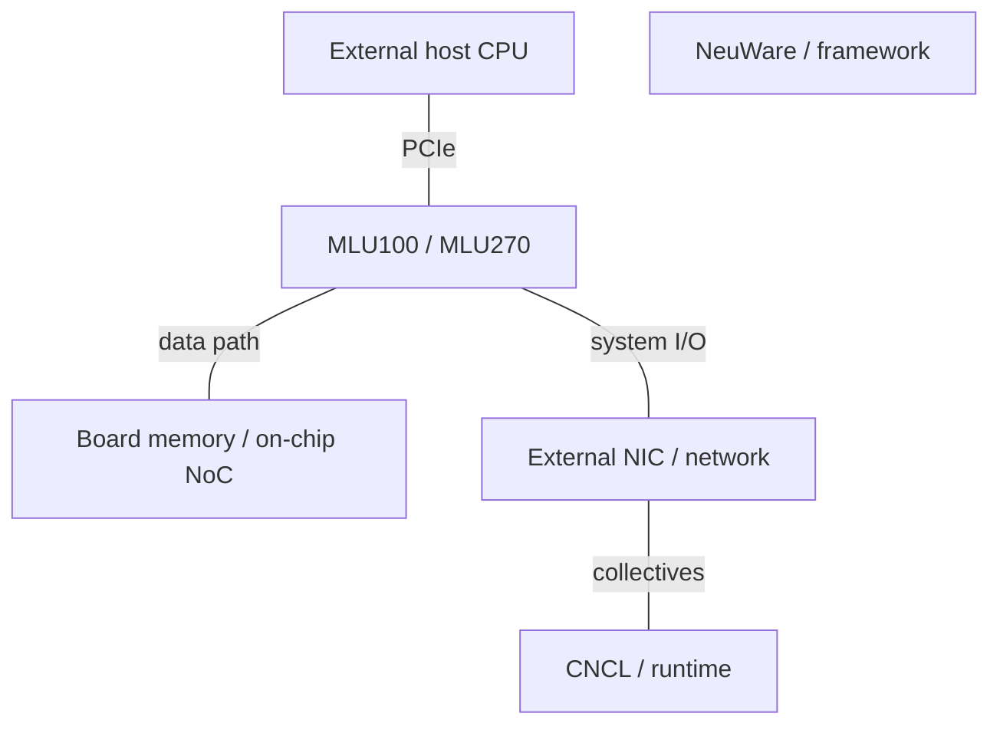
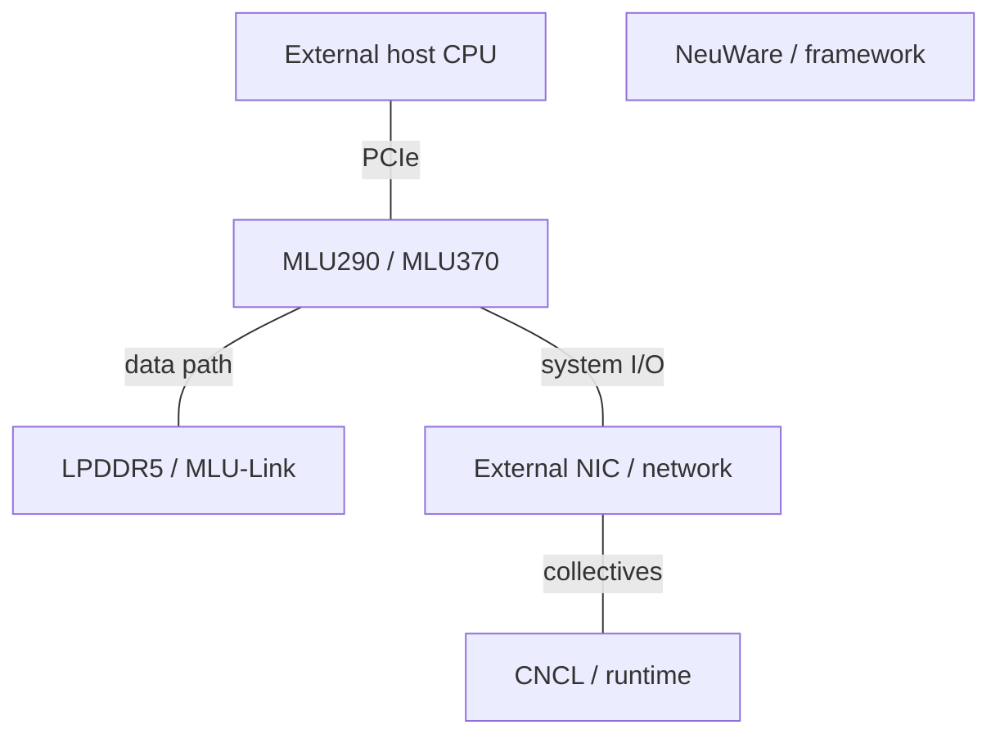

# Cambricon AI Infrastructure Architecture Evolution

2015-2026 | 2026-09-28

## 01 Scope and architectural synthesis

The report covers Cambricon’s publicly documented AI infrastructure from 2015 to 28 September 2026, with DianNao-era research as a pre-company baseline. Deep coverage follows Siyuan/MLU cloud accelerators, memory, MLU-Link and NeuWare. Terminal IP and the MLU220 edge branch explain technology continuity. No proprietary server CPU, merchant DPU or shipping AI NIC is inferred merely from the company’s broader AI ambitions.

The strongest continuity is programmable domain specialization: a machine-learning instruction interface, tensor execution, explicit data movement and a software platform spanning cloud and edge. Commercial evolution adds larger SoCs, training support, chiplets and multi-device communication. The public academic record is much richer than the disclosure of recent commercial implementations. Those two evidence streams should inform each other without being treated as an exact RTL lineage.

## 02 Research lineage: what the architecture conferences establish

DianNao at ASPLOS 2014 and DaDianNao at MICRO 2014 established early neural-acceleration research. PuDianNao at ASPLOS 2015 broadens the machine-learning workload scope; ShiDianNao at ISCA 2015 moves vision processing toward the sensor. The author’s institutional page explicitly reserves the DianNao names for those academic designs. They are therefore recorded as research predecessors, not early commercial Siyuan SKUs.

The ISCA 2016 Cambricon ISA paper addresses the gap between fixed-function neural engines and general-purpose instruction streams. A domain-specific ISA can express common neural operations while preserving programmability. That is a useful lens for understanding later MLU software, but the published prototype’s process, area and performance cannot be transplanted into a commercial MLU table without a documented mapping.

Cambricon-X at MICRO 2016 and Cambricon-S at MICRO 2018 address sparse and irregular networks. Cambricon-F at ISCA 2019 studies a hierarchical, self-similar programming architecture; Cambricon-Q at ISCA 2021 targets efficient training. The research progression spans sparsity, programmability and training precision. It establishes engineering priorities, not proof that an identically named mechanism ships in every generation.

Cambricon-F recursively decomposes operations through nodes sharing an instruction model and a hierarchical memory organization. The proposal aims to reduce the programming burden across scales. Architectural interpretation: a uniform interface does not eliminate placement, reduction or congestion costs; it changes where they are handled. The paper discusses those challenges explicitly. Its research instances F1/F100 are not MLU100 or MLU270 product names.

The 2024 Cambricon-LLM research proposes an NPU plus specially designed flash with on-die processing for low-batch edge inference. It is a useful example of capacity/bandwidth co-design, but is not a disclosed production implementation of a Siyuan server accelerator. Flash capacity, DRAM KV storage and compute-side bandwidth are distinct resources.

## 03 Commercial generations: MLU100, 270 and 290

Siyuan100 introduced the cloud accelerator line in 2018. The 270 generation adds MLUv02, a NoC connecting up to sixteen tensor cores, hardware data compression and video/image functions. Its official page explicitly identifies 128 INT8 TOPS for nonsparse models, alongside 256 INT4 TOPS and 64 INT16 TOPS. Precision changes must not be described as architectural speedups on the same workload.

Siyuan290 is the training-oriented branch, publicly exhibited with MLU290-M5 modules and the XuanSi1000/MLU-X1000 system at WAIC 2021. Its importance is the transition from a predominantly inference product story to multi-accelerator training and system software. This edition does not fill missing board-matched HBM, power or floating-point rates from secondary product lists. A training product’s existence and an exact implementation specification are separate claims.

## 04 MLU370: chiplets, fusion and board differentiation

Siyuan370 combines two AI compute chiplets in a 7 nm product with 39 billion transistors. MLUarch03 adds tensor-unit improvements, the Supercharger convolution mechanism and hardware support for multi-operator fusion. LPDDR5 and MLU-Link expand the memory and multi-device design space. Chiplet integration is a packaging boundary within a chip; a dual-chip board is a separate boundary and must not be counted as the same thing.

The current official specifications are particularly informative: X4 and X8 both list 96 TFLOP/s BF16 and 256 INT8 TOPS, while X8 doubles memory capacity and bandwidth to 48 GB and 614.4 GB/s. X8 uses two Siyuan370 chips and provides a dedicated MLU-Link interface. Thus two chips on a board do not justify doubling the published board compute rate. The S4/S8 branch trades peak compute for a 75 W, compact deployment envelope.

Architectural interpretation: the X8 configuration targets data capacity, bandwidth, codec resources and multi-card communication as much as arithmetic density. This can favor larger or bandwidth-sensitive workloads even when peak BF16 matches X4. Fusion helps only when intermediate data and execution dependencies fit the supported mechanism. A portable model graph may still require layout, quantization and kernel tuning to exploit the hardware.

## 05 Cloud accelerator and board tables

### Commercial reference specifications

| Product | Architecture | GA / milestone | Status | Process | Dies / packaging | Compute units | Dense BF16 | Dense FP8 | Dense FP6 / FP4 | FP64 vector / matrix | Memory: type; stacks; GB; TB/s | LLC / SRAM | Scale-up: links; GB/s per direction; domain | Host link | Power / cooling | Form factor |
| --- | --- | --- | --- | --- | --- | --- | --- | --- | --- | --- | --- | --- | --- | --- | --- | --- |
| Siyuan100 / MLU100 | n/d | 2018 | Historical shipping | n/d | n/d | n/d | n/d | n/d | n/d | n/d | n/d | n/d | n/d | n/d | n/d | Cloud accelerator |
| Siyuan270 / MLU270 | MLUv02 | 2019 | Historical shipping | n/d | n/d | 16 tensor cores | n/d | n/d | n/d | n/d | n/d | n/d | n/d | n/d | n/d | Cloud accelerator |
| Siyuan290 / MLU290-M5 | n/d | 2021 public showcase | Historical shipping | n/d | n/d | n/d | n/d | n/d | n/d | n/d | n/d | n/d | n/d | n/d | n/d | Cloud accelerator |
| MLU370-S4/S8 | MLUarch03 | 2021-2022 product era | Shipping / available | 7 nm | SKU configuration | n/d | 72 TFLOP/s advertised; dense basis n/d | n/d | n/d | n/d | LPDDR5; 24/48 GB; 307.2 GB/s | n/d | n/d | PCIe4 ×16 | 75 W; passive | Half-height / half-length |
| MLU370-X4 | MLUarch03 | 2021-2022 product era | Shipping / available | 7 nm | Siyuan370 chip | n/d | 96 TFLOP/s advertised; dense basis n/d | n/d | n/d | n/d | LPDDR5; 24 GB; 307.2 GB/s | n/d | n/d | PCIe4 ×16 | 150 W; passive | Full-height full-length; 1 slot |
| MLU370-X8 | MLUarch03 | 2021-2022 product era | Shipping / available | 7 nm | 2 Siyuan370 chips | n/d | 96 TFLOP/s advertised; dense basis n/d | n/d | n/d | n/d | LPDDR5; 48 GB; 614.4 GB/s | n/d | 4 ports; 100 GB/s one-way aggregate; 8 cards supported | PCIe4 ×16 | 250 W; passive | Full-height full-length; 2 slots |

### Host CPU boundary

| Generation / reference SKU | Codename | GA | Status | Core µarch | Cores / threads | Process per die | Dies / packaging | L2 per core | L3 / domain | Memory: channels; rate; GB/s | Sockets / links | PCIe / CXL | TDP | Vector / matrix ISA |
| --- | --- | --- | --- | --- | --- | --- | --- | --- | --- | --- | --- | --- | --- | --- |
| No proprietary host CPU established | n/a | n/a | n/a | n/a | n/a | n/a | n/a | n/a | n/a | n/a | n/a | n/a | n/a | n/a |

## 06 MLU-Link, systems and the networking roadmap

The X8 board page resolves a key unit issue: 200 GB/s is aggregate bidirectional MLU-Link bandwidth, corresponding to 100 GB/s per direction when divided symmetrically. It lists four ports, sixteen lanes and 50 Gb/s signaling; the board-wide lane/port wording is retained rather than assuming sixteen lanes per port. The page supports an eight-card server configuration but does not establish transparent memory coherence or a fully connected topology.

The 2025 annual report describes future chip platforms for training, language-model inference, multimodal inference and switching for large models. The switching item belongs in the roadmap, not a shipping AI-NIC or DPU table. No port speeds, SerDes generation or switch capacity are assigned without a named technical disclosure. External NICs and host CPUs remain system dependencies in the documented accelerator portfolio.

### Networking product boundary

| Product | GA / milestone | Status | Class | Ports × speed | SerDes | Host interface | Programmable engine | Embedded CPU | On-card memory | Transport / RDMA | Congestion control | Key offloads | Power |
| --- | --- | --- | --- | --- | --- | --- | --- | --- | --- | --- | --- | --- | --- |
| Large-model switch project | 2025 annual report | Roadmap | Switch R&D | n/d | n/d | n/d | n/d | n/d | n/d | n/d | n/d | n/d | n/d |
| Merchant DPU / AI NIC | n/a | No product established | n/a | n/a | n/a | n/a | n/a | n/a | n/a | n/a | n/a | n/a | n/a |

### MLU370-X8 links

| Interconnect | Year / generation | Lane rate | Lanes / link | GB/s per link per direction | Links / device | Topology | Domain limit | Coherence / semantics |
| --- | --- | --- | --- | --- | --- | --- | --- | --- |
| MLU-Link | MLU370-X8 | 50 Gb/s | 16 total as listed | 100 aggregate/device | 4 ports | n/d | 8-card server supported | Explicit communication; coherence n/d |
| Host PCIe | MLU370 | 16 GT/s | 16 | ~31.5 before packet overhead | 1 | Point-to-point | Host topology | PCIe |

### System disclosures

| Platform | Year / milestone | CPU / accelerator count | Scale-up domain | Scale-out per accelerator | Rack power | Cooling |
| --- | --- | --- | --- | --- | --- | --- |
| XuanSi1000 / MLU-X1000 | WAIC2021 | MLU290; count n/d | n/d | n/d | n/d | n/d |
| MLU370-X8 server | Product documentation | Up to 8 cards | Topology n/d | External NIC; n/d | n/d | Passive boards; server airflow |

## 07 Terminal IP, edge products and software continuity

Cambricon1A, 1H and 1M are licensable terminal processor-IP branches, while Siyuan220/MLU220 supplies edge chips and M.2/SOM modules. An IP core inside another company’s SoC is not a Cambricon-owned complete SoC. These products share software and instruction-family continuity with cloud offerings, but their memory systems, power budgets and host integration differ. The annual report continues to describe cloud, edge and IP activities without publishing a complete new-generation server SKU matrix.

NeuWare brings drivers, runtime, libraries and tools into a shared platform. CNNL implements neural operators, CNCL supplies collective communication and MagicMind provides an MLIR-based inference compilation path. Training supports data, model and hybrid parallelism. Framework support is a starting point: production readiness also requires operator coverage, numerical correctness, communication overlap, profiling and failure recovery at the intended scale.

### Software contracts

| Layer | Product | Function | Scope |
| --- | --- | --- | --- |
| Platform | NeuWare | Driver / runtime / tools | Cloud / edge / terminal |
| Operators | CNNL / BANG | Libraries and kernel programming | Device-specific tuning |
| Communication | CNCL | Distributed collectives | Topology and configuration dependent |
| Inference | MagicMind / MLIR | Graph compilation and optimization | Model and operator coverage dependent |

### 2018-2020 stack

Functional stack; MLU290 and MLU370 are separate branches, not one combined configuration.

### 2021-2026 disclosures stack

Functional stack; MLU290 and MLU370 are separate branches, not one combined configuration.

## 08 Normalized metrics and deployment implications

### Board-level balance

| Metric | Calculation | Basis |
| --- | --- | --- |
| X4 DRAM/BF16 | 307.2e9/96e12 = 0.0032 B/FLOP | Advertised peak; sparsity basis unstated |
| X8 DRAM/BF16 | 614.4e9/96e12 = 0.0064 B/FLOP | Board-wide; not per chiplet |
| X8 capacity/BF16 | 48e9/96e12 = 5e-4 B·s/FLOP | LPDDR, not HBM |
| X8 MLU-Link/DRAM | 100/614.4 = 0.163 | One-way aggregate link rate |
| X4 vs X8 BF16/TDP | 96/150=0.64; 96/250=0.384 TFLOP/s/W | Peak/TDP proxy; workload benefit differs |
| HBM/FLOP; host DDR/core; L3/core | n/d / n/a | No matched published data or own host CPU |

The board comparison illustrates why peak performance per watt can mislead: X8 has a lower BF16/TDP ratio than X4 but twice the memory bandwidth and capacity plus direct multi-card communication. A bandwidth-bound or capacity-limited model can therefore favor X8. The correct evaluation includes achievable precision, model fit, host-to-device traffic, inter-card collectives and software versions. Dense floating-point comparisons with other vendors remain conditional where the source does not state the sparsity convention.

## 09 Conference index and product mapping

### Verified disclosure lineage

| Venue | Year | Paper / talk / disclosure | Presenter / authors | Product | Evidence type | Source |
| --- | --- | --- | --- | --- | --- | --- |
| ASPLOS / MICRO | 2014 | DianNao / DaDianNao | Paper authors / company | Research baseline | Research record | C01 C03 |
| ASPLOS | 2015 | PuDianNao | Paper authors / company | Research | Research record | C03 |
| ISCA | 2015 | ShiDianNao | Paper authors / company | Research | Research record | C03 |
| ISCA | 2016 | Cambricon ISA | Paper authors / company | Research ISA | Research record | C02 |
| MICRO | 2016 | Cambricon-X | Paper authors / company | Research sparsity | Research record | C03 |
| MICRO | 2018 | Cambricon-S | Paper authors / company | Research sparsity | Research record | C03 |
| ISCA | 2019 | Cambricon-F | Paper authors / company | Research programming architecture | Research record | C04 |
| ISCA | 2021 | Cambricon-Q | Paper authors / company | Research training | Research record | C03 |
| WAIC | 2021-2022 | Cloud/edge product exhibitions | Paper authors / company | MLU220/270/290/370 | Product showcase | E03 E04 |

The big-four architecture record is strongest at ISCA, MICRO and ASPLOS. This edition does not establish a direct commercial MLU implementation paper at HPCA, ISSCC or Hot Chips. It also does not treat a same-name academic paper as proof of a commercial design. Recent annual reports describe large-model development and deployment but omit a full named implementation matrix. Accordingly, widely circulated newer model numbers are not assigned speculative process, memory or throughput specifications here; this does not imply that MLU370 is the company’s newest deployed silicon.

### Naming boundaries

| Name | Meaning | Boundary |
| --- | --- | --- |
| DianNao family | Academic designs | Not commercial MLU SKUs |
| Siyuan / MLU | Chip and board families | Always specify board suffix |
| MLU370 chiplet / X8 dual-chip | Package / board integration | Different counting levels |
| MLU-Link / CNCL | Hardware links / collective library | Bandwidth versus software behavior |

## Source map

01 Scope and architectural synthesis — C02, C03, E02, E03, P01, P02

02 Research lineage: what the architecture conferences establish — C01, C02, C03, C04, C05

03 Commercial generations: MLU100, 270 and 290 — E02, E03, E05, P01

04 MLU370: chiplets, fusion and board differentiation — P02, P04, P05, P06, P07

05 Cloud accelerator and board tables — E02, E03, E04, E05, P01, P02, P04, P05, P06

06 MLU-Link, systems and the networking roadmap — E02, E03, P05, P06

07 Terminal IP, edge products and software continuity — E02, E03, E05, P01, P02, P06, P07

08 Normalized metrics and deployment implications — E02, P05, P06

09 Conference index and product mapping — C01, C02, C03, C04, E02, E03, E04, P02, P06, P07

## References

### Product and technical documentation

[P01] Siyuan270. [https://cambricon.com/index.php?a=lists&c=index&catid=15&m=content](https://cambricon.com/index.php?a=lists&c=index&catid=15&m=content). Primary source; accessed by 2026-09-28

[P02] Siyuan370. [https://cambricon.com/index.php?a=lists&c=index&catid=360&m=content](https://cambricon.com/index.php?a=lists&c=index&catid=360&m=content). Primary source; accessed by 2026-09-28

[P04] MLU370-S4/S8 board. [https://www.cambricon.com/index.php?m=content&c=index&a=lists&catid=365](https://www.cambricon.com/index.php?m=content&c=index&a=lists&catid=365). Primary source; accessed by 2026-09-28

[P05] MLU370-X4 board. [https://www.cambricon.com/index.php?m=content&c=index&a=lists&catid=371](https://www.cambricon.com/index.php?m=content&c=index&a=lists&catid=371). Primary source; accessed by 2026-09-28

[P06] MLU370-X8 board. [https://www.cambricon.com/index.php?m=content&c=index&a=lists&catid=406](https://www.cambricon.com/index.php?m=content&c=index&a=lists&catid=406). Primary source; accessed by 2026-09-28

[P07] Cambricon NeuWare. [https://www.cambricon.com/index.php?m=content&c=index&a=lists&catid=71](https://www.cambricon.com/index.php?m=content&c=index&a=lists&catid=71). Primary source; accessed by 2026-09-28

### Conference records and implementation disclosures

[C01] DianNao project and publication lineage. [https://novel.ict.ac.cn/diannao/](https://novel.ict.ac.cn/diannao/). Primary source; accessed by 2026-09-28

[C02] Cambricon ISA, ISCA2016 author record. [https://researchportal.hkust.edu.hk/en/publications/cambricon-an-instruction-set-architecture-for-neural-networks/](https://researchportal.hkust.edu.hk/en/publications/cambricon-an-instruction-set-architecture-for-neural-networks/). Primary source; accessed by 2026-09-28

[C03] Tianshi Chen publications. [https://novel.ict.ac.cn/tchen/](https://novel.ict.ac.cn/tchen/). Primary source; accessed by 2026-09-28

[C04] Cambricon-F, ISCA2019 full author paper. [https://dl.yongwei.site/F.pdf](https://dl.yongwei.site/F.pdf). Primary source; accessed by 2026-09-28

[C05] Cambricon-LLM research, 2024. [https://arxiv.org/abs/2409.15654](https://arxiv.org/abs/2409.15654). Primary source; accessed by 2026-09-28

### Launches, ecosystem and deployment

[E02] Cambricon2025 annual report, company filing mirror. [https://money.finance.sina.com.cn/corp/view/vCB_AllBulletinDetail.php?id=11993143&stockid=688256](https://money.finance.sina.com.cn/corp/view/vCB_AllBulletinDetail.php?id=11993143&stockid=688256). Primary source; accessed by 2026-09-28

[E03] WAIC2021 portfolio. [https://www.cambricon.com/index.php?a=show&c=index&catid=127&id=41&m=content](https://www.cambricon.com/index.php?a=show&c=index&catid=127&id=41&m=content). Primary source; accessed by 2026-09-28

[E04] WAIC2022 portfolio. [https://www.cambricon.com/index.php?a=show&c=index&catid=127&id=51&m=content](https://www.cambricon.com/index.php?a=show&c=index&catid=127&id=51&m=content). Primary source; accessed by 2026-09-28

[E05] Siyuan220 launch. [https://cambricon.com/index.php?a=show&c=index&catid=127&id=11&m=content](https://cambricon.com/index.php?a=show&c=index&catid=127&id=11&m=content). Primary source; accessed by 2026-09-28
