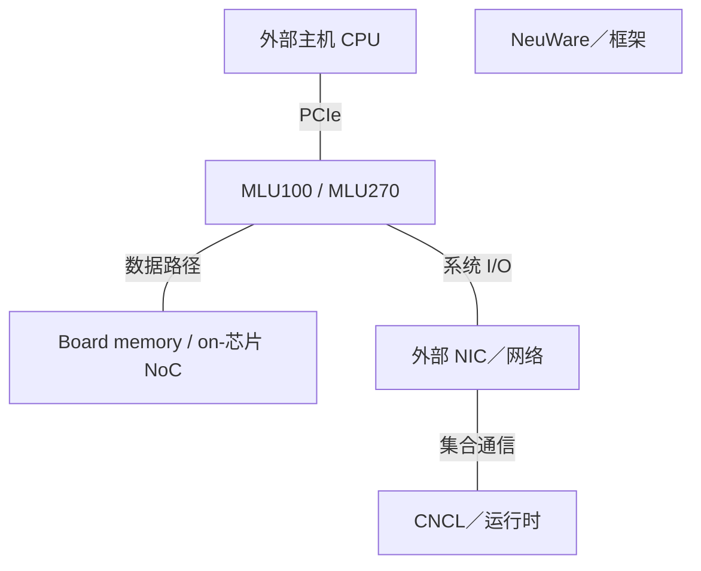
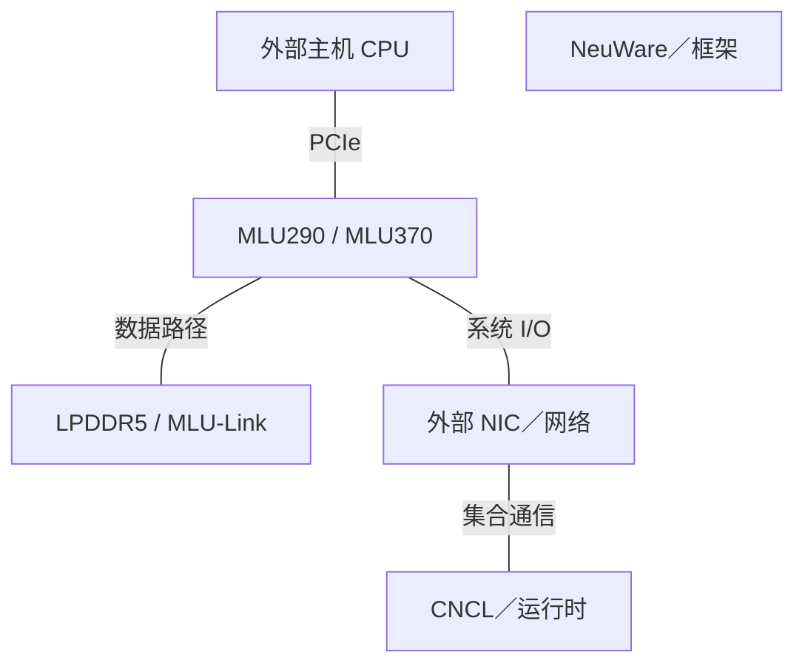

# Cambricon AI 基础设施架构演进

2015-2026 | 2026-09-28

## 01 范围与架构主线

本报告覆盖寒武纪在 2015 年至 2026 年 9 月 28 日公开记录的 AI 基础设施，并以前公司时期的 DianNao 研究为基线。深入梳理思元／MLU 云端加速器、存储、MLU-Link 与 NeuWare；终端 IP 和 MLU220 边缘分支用于解释技术延续。不因公司具有更广泛 AI 战略，就推定存在自研服务器 CPU、商用 DPU 或已交付 AI NIC。

最强的技术延续是可编程领域专用化：机器学习指令接口、张量执行、显式数据搬移，以及横跨云边端的软件平台。商业演进逐步加入更大 SoC、训练支持、小芯片及多设备通信。公开学术记录远比近期商业实现披露丰富，两类证据可以相互解释，但不能视为精确 RTL 谱系。

## 02 研究谱系：架构会议能证明什么

ASPLOS 2014 的 DianNao 与 MICRO 2014 的 DaDianNao 建立早期神经网络加速研究。ASPLOS 2015 的 PuDianNao 扩展机器学习负载范围；ISCA 2015 的 ShiDianNao 把视觉处理推向传感器附近。作者机构主页明确将 DianNao 名称保留给这些学术设计。因此，本报告将其记录为研究前身，而不是早期商业思元 SKU。

ISCA 2016 的 Cambricon ISA 论文针对固定功能神经网络引擎与通用指令流之间的缺口。领域专用 ISA 可以表达常见神经网络操作，同时保留可编程性。这有助于理解后续 MLU 软件，但若缺少明确对应关系，不能把论文原型的工艺、面积和性能移植到商业 MLU 规格表。

MICRO 2016 的 Cambricon-X 与 MICRO 2018 的 Cambricon-S 研究稀疏及不规则网络。ISCA 2019 的 Cambricon-F 研究分层、自相似编程架构；ISCA 2021 的 Cambricon-Q 面向高效训练。研究主线覆盖稀疏性、可编程性和训练精度，建立工程关注点，但不证明同名机制在每代产品中交付。

Cambricon-F 通过共享指令模型及分层存储组织的节点，递归分解操作，目标是降低不同规模下的编程负担。架构解读：统一接口并未消除放置、归约或拥塞成本，而是改变处理这些成本的位置。论文明确讨论这些挑战，其中研究实例 F1／F100 不等于 MLU100 或 MLU270 产品名称。

2024 年 Cambricon-LLM 研究提出 NPU 配合具有片内处理能力的专用闪存，用于小批量边缘推理。这是容量与带宽协同设计的例子，但不是已披露的思元服务器加速器量产实现。闪存容量、DRAM 中的 KV 存储与计算侧带宽是不同资源。

## 03 商业代际：MLU100、270 与 290

思元100 于 2018 年建立云端加速器产品线。270 代增加 MLUv02、连接最多十六个张量核心的片上网络、硬件数据压缩及视频／图像功能。官方页面明确给出非稀疏模型的 INT8 128 TOPS，以及 INT4 256 TOPS 和 INT16 64 TOPS。精度变化不能描述为同一负载的架构加速比。

思元290 是面向训练的分支，在 WAIC 2021 与 MLU290-M5 模块及玄思1000／MLU-X1000 系统一同公开展示。其重要性在于从以推理为主的产品叙事，转向多加速器训练与系统软件。本版不从二手产品列表补填缺少板卡匹配依据的 HBM、功耗或浮点速率。训练产品存在与精确实现规格是两种不同陈述。

## 04 MLU370：小芯片、融合与板卡差异

思元370 采用 7 nm 工艺，将两个 AI 计算小芯片封装为产品，集成 390 亿晶体管。MLUarch03 增加张量单元改进、Supercharger 卷积机制及多算子硬件融合支持。LPDDR5 与 MLU-Link 扩展存储及多设备设计空间。小芯片集成是芯片内部封装边界，双芯板卡则是另一层边界，两者不能混为一谈。

当前官方规格很有说明力：X4 与 X8 都列出 BF16 96 TFLOP/s 和 INT8 256 TOPS，而 X8 把内存容量及带宽加倍至 48 GB、614.4 GB/s。X8 使用两颗思元370，并提供专用 MLU-Link 接口。因此板上两颗芯片不意味着可以把公布的板卡算力再乘二。S4／S8 分支则以较低峰值算力换取 75 W 的紧凑部署条件。

架构解读：X8 配置对数据容量、带宽、编解码资源及多卡通信的关注，不亚于算术密度。即使峰值 BF16 与 X4 相同，它仍可能更适合大型或带宽敏感负载。融合只有在中间数据及执行依赖适合支持机制时才有收益。模型图可移植，也可能仍需调整布局、量化和算子，才能发挥硬件能力。

## 05 云端加速器与板卡规格

### 商业参考规格

| 产品 | 架构 | 商用／里程碑 | 状态 | 工艺 | 裸片／封装 | 计算单元 | 稠密 BF16 | 稠密 FP8 | 稠密 FP6／FP4 | FP64 向量／矩阵 | 内存：类型；堆栈；GB；TB/s | 末级缓存／SRAM | 纵向扩展：链路；单向 GB/s；域 | 主机连接 | 功耗／散热 | 形态 |
| --- | --- | --- | --- | --- | --- | --- | --- | --- | --- | --- | --- | --- | --- | --- | --- | --- |
| 思元100 / MLU100 | n/d | 2018 | 历史已商用 | n/d | n/d | n/d | n/d | n/d | n/d | n/d | n/d | n/d | n/d | n/d | n/d | 云端加速器 |
| 思元270 / MLU270 | MLUv02 | 2019 | 历史已商用 | n/d | n/d | 16 张量核心 | n/d | n/d | n/d | n/d | n/d | n/d | n/d | n/d | n/d | 云端加速器 |
| 思元290 / MLU290-M5 | n/d | 2021 公开展示 | 历史已商用 | n/d | n/d | n/d | n/d | n/d | n/d | n/d | n/d | n/d | n/d | n/d | n/d | 云端加速器 |
| MLU370-S4/S8 | MLUarch03 | 2021-2022 产品时期 | 已商用／可获取 | 7 nm | SKU 配置 | n/d | 72 TFLOP/s 公布值; 稠密口径 n/d | n/d | n/d | n/d | LPDDR5; 24/48 GB; 307.2 GB/s | n/d | n/d | PCIe4 ×16 | 75 W; 被动散热 | 半高／半长 |
| MLU370-X4 | MLUarch03 | 2021-2022 产品时期 | 已商用／可获取 | 7 nm | 思元370 芯片 | n/d | 96 TFLOP/s 公布值; 稠密口径 n/d | n/d | n/d | n/d | LPDDR5; 24 GB; 307.2 GB/s | n/d | n/d | PCIe4 ×16 | 150 W; 被动散热 | 全高全长；单槽 |
| MLU370-X8 | MLUarch03 | 2021-2022 产品时期 | 已商用／可获取 | 7 nm | 2 思元370 芯片 | n/d | 96 TFLOP/s 公布值; 稠密口径 n/d | n/d | n/d | n/d | LPDDR5; 48 GB; 614.4 GB/s | n/d | 4 端口; 100 GB/s 单向 聚合; 8 支持板卡 | PCIe4 ×16 | 250 W; 被动散热 | 全高全长；双槽 |

### 主机 CPU 边界

| 代际／参考 SKU | 代号 | 正式商用 | 状态 | 核心微架构 | 核心／线程 | 各裸片工艺 | 裸片／封装 | 每核 L2 | L3／共享域 | 内存：通道；速率；GB/s | 插槽／互联 | PCIe／CXL | TDP | 向量／矩阵 ISA |
| --- | --- | --- | --- | --- | --- | --- | --- | --- | --- | --- | --- | --- | --- | --- |
| 未建立自研主机 CPU 产品 | n/a | n/a | n/a | n/a | n/a | n/a | n/a | n/a | n/a | n/a | n/a | n/a | n/a | n/a |

## 06 MLU-Link、系统与网络路线图

X8 板卡页面澄清一个关键口径：MLU-Link 的 200 GB/s 是聚合双向带宽，对称分配时对应每方向 100 GB/s。页面列出四端口、十六通道及 50 Gb/s 信号速率；本报告保留板级通道／端口表述，不假定每端口十六通道。页面支持八卡服务器配置，但未证明透明内存一致性或全互联拓扑。

2025 年年报描述未来面向训练、语言模型推理、多模态推理及大模型交换的芯片平台。交换芯片项目应放入路线图，而非已交付 AI NIC 或 DPU 表。缺少具名技术披露时，不赋予端口速率、SerDes 代际或交换容量。在已记录的加速器组合中，外部 NIC 与主机 CPU 仍是系统依赖。

### 网络产品边界

| 产品 | 商用／里程碑 | 状态 | 类别 | 端口×速率 | SerDes | 主机接口 | 可编程引擎 | 嵌入式 CPU | 板载内存 | 传输／RDMA | 拥塞控制 | 主要卸载 | 功耗 |
| --- | --- | --- | --- | --- | --- | --- | --- | --- | --- | --- | --- | --- | --- |
| 大模型交换芯片项目 | 2025 年报 | 路线图 | 交换芯片研发 | n/d | n/d | n/d | n/d | n/d | n/d | n/d | n/d | n/d | n/d |
| 商用 DPU／AI NIC | n/a | 未建立产品 | n/a | n/a | n/a | n/a | n/a | n/a | n/a | n/a | n/a | n/a | n/a |

### MLU370-X8 链路

| 互联 | 年份／代际 | 通道速率 | 每链路通道 | 每链路单向 GB/s | 每设备链路 | 拓扑 | 域规模 | 一致性／语义 |
| --- | --- | --- | --- | --- | --- | --- | --- | --- |
| MLU-Link | MLU370-X8 | 50 Gb/s | 16 原文所列总量 | 100 每设备聚合 | 4 端口 | n/d | 8-card 支持服务器配置 | 显式通信；一致性 n/d |
| 主机 PCIe | MLU370 | 16 GT/s | 16 | ~31.5 扣除包开销前 | 1 | 点对点 | 主机拓扑 | PCIe |

### 系统披露

| 平台 | 年份／里程碑 | CPU／加速器数量 | 纵向扩展域 | 每加速器横向带宽 | 机架功耗 | 散热 |
| --- | --- | --- | --- | --- | --- | --- |
| 玄思1000 / MLU-X1000 | WAIC2021 | MLU290; 数量 n/d | n/d | n/d | n/d | n/d |
| MLU370-X8 服务器 | 产品文档 | 最高 8 板卡 | 拓扑 n/d | 外部 NIC；n/d | n/d | 被动散热板卡；服务器气流 |

## 07 终端 IP、边缘产品与软件延续

寒武纪1A、1H 和1M 属于可授权终端处理器 IP 分支，思元220／MLU220 则提供边缘芯片与 M.2／SOM 模组。集成于其他公司 SoC 的 IP 核，不等于寒武纪自有完整 SoC。这些产品与云端方案共享软件和指令家族延续，但存储系统、功耗预算及主机集成方式不同。年报继续描述云端、边缘及 IP 业务，但未公布完整新一代服务器 SKU 矩阵。

NeuWare 将驱动、运行时、算子库及工具整合为共享平台。CNNL 实现神经网络算子，CNCL 提供集合通信，MagicMind 提供基于 MLIR 的推理编译路径。训练支持数据并行、模型并行及混合并行。框架支持只是起点：生产可用性还需要目标规模下的算子覆盖、数值正确性、通信重叠、性能分析与故障恢复。

### 软件契约

| 层 | 产品 | 功能 | 范围 |
| --- | --- | --- | --- |
| 平台 | NeuWare | 驱动／运行时／工具 | 云／边／端 |
| 算子 | CNNL / BANG | 算子库与内核编程 | 设备相关调优 |
| 通信 | CNCL | 分布式集合通信 | 依赖拓扑与配置 |
| 推理 | MagicMind / MLIR | 图编译与优化 | 依赖模型及算子覆盖 |

### 2018-2020 技术栈

功能技术栈；MLU290 与 MLU370 是不同分支，不是组合配置。

### 2021-2026 disclosures 技术栈

功能技术栈；MLU290 与 MLU370 是不同分支，不是组合配置。

## 08 归一化指标与部署含义

### 板级平衡

| 指标 | 计算 | 口径 |
| --- | --- | --- |
| X4 DRAM/BF16 | 307.2e9/96e12 = 0.0032 B/FLOP | 公布峰值；稀疏口径未明示 |
| X8 DRAM/BF16 | 614.4e9/96e12 = 0.0064 B/FLOP | 整板；非每小芯片 |
| X8 容量/BF16 | 48e9/96e12 = 5e-4 B·s/FLOP | LPDDR，非 HBM |
| X8 MLU-Link/DRAM | 100/614.4 = 0.163 | 单向聚合链路速率 |
| X4 vs X8 BF16/TDP | 96/150=0.64; 96/250=0.384 TFLOP/s/W | 峰值／TDP 代理量；负载收益不同 |
| HBM/FLOP; 主机 DDR/核心; L3/核心 | n/d / n/a | 缺匹配公开数据或自有主机 CPU |

板卡比较说明峰值每瓦性能为何可能误导：X8 的 BF16／TDP 比低于 X4，却拥有两倍内存带宽与容量，并具备直接多卡通信。带宽受限或容量受限模型因此可能更适合 X8。正确评估需涵盖可用精度、模型容纳能力、主机至设备流量、卡间集合通信及软件版本。来源未说明稀疏口径时，与其他厂商的稠密浮点比较仍需保留条件。

## 09 会议索引与产品映射

### 已核实披露谱系

| 会议／活动 | 年份 | 论文／演讲／披露 | 报告人／作者 | 产品 | 证据类型 | 来源 |
| --- | --- | --- | --- | --- | --- | --- |
| ASPLOS / MICRO | 2014 | DianNao / DaDianNao | 论文作者／公司 | 研究基线 | 研究记录 | C01 C03 |
| ASPLOS | 2015 | PuDianNao | 论文作者／公司 | 研究 | 研究记录 | C03 |
| ISCA | 2015 | ShiDianNao | 论文作者／公司 | 研究 | 研究记录 | C03 |
| ISCA | 2016 | Cambricon ISA | 论文作者／公司 | 研究 ISA | 研究记录 | C02 |
| MICRO | 2016 | Cambricon-X | 论文作者／公司 | 稀疏性研究 | 研究记录 | C03 |
| MICRO | 2018 | Cambricon-S | 论文作者／公司 | 稀疏性研究 | 研究记录 | C03 |
| ISCA | 2019 | Cambricon-F | 论文作者／公司 | 研究编程架构 | 研究记录 | C04 |
| ISCA | 2021 | Cambricon-Q | 论文作者／公司 | 训练研究 | 研究记录 | C03 |
| WAIC | 2021-2022 | 云端／边缘产品展示 | 论文作者／公司 | MLU220/270/290/370 | 产品展示 | E03 E04 |

四大架构会议记录以 ISCA、MICRO 和 ASPLOS 最丰富。本版未建立商业 MLU 对应的 HPCA、ISSCC 或 Hot Chips 直接实现论文，也不把同名学术论文当作商业设计证明。近期年报描述大模型研发及部署，但未提供完整具名实现矩阵。因此本报告不为广泛流传的较新型号填入推测工艺、存储或算力；这并不意味着 MLU370 是公司最新部署芯片。

### 命名边界

| 名称 | 含义 | 边界 |
| --- | --- | --- |
| DianNao family | 学术设计 | 不是商业 MLU SKU |
| 思元 / MLU | 芯片及板卡家族 | 始终注明板卡后缀 |
| MLU370 chiplet / X8 双芯片 | 封装／板级集成 | 不同计数层级 |
| MLU-Link / CNCL | 硬件链路／集合通信库 | 带宽与软件行为不同 |

## 来源映射

01 范围与架构主线 — C02, C03, E02, E03, P01, P02

02 研究谱系：架构会议能证明什么 — C01, C02, C03, C04, C05

03 商业代际：MLU100、270 与 290 — E02, E03, E05, P01

04 MLU370：小芯片、融合与板卡差异 — P02, P04, P05, P06, P07

05 云端加速器与板卡规格 — E02, E03, E04, E05, P01, P02, P04, P05, P06

06 MLU-Link、系统与网络路线图 — E02, E03, P05, P06

07 终端 IP、边缘产品与软件延续 — E02, E03, E05, P01, P02, P06, P07

08 归一化指标与部署含义 — E02, P05, P06

09 会议索引与产品映射 — C01, C02, C03, C04, E02, E03, E04, P02, P06, P07

## 参考资料

### 产品与技术文档

[P01] Siyuan270. [https://cambricon.com/index.php?a=lists&c=index&catid=15&m=content](https://cambricon.com/index.php?a=lists&c=index&catid=15&m=content). 一手资料；访问截止 2026-09-28

[P02] Siyuan370. [https://cambricon.com/index.php?a=lists&c=index&catid=360&m=content](https://cambricon.com/index.php?a=lists&c=index&catid=360&m=content). 一手资料；访问截止 2026-09-28

[P04] MLU370-S4/S8 board. [https://www.cambricon.com/index.php?m=content&c=index&a=lists&catid=365](https://www.cambricon.com/index.php?m=content&c=index&a=lists&catid=365). 一手资料；访问截止 2026-09-28

[P05] MLU370-X4 board. [https://www.cambricon.com/index.php?m=content&c=index&a=lists&catid=371](https://www.cambricon.com/index.php?m=content&c=index&a=lists&catid=371). 一手资料；访问截止 2026-09-28

[P06] MLU370-X8 board. [https://www.cambricon.com/index.php?m=content&c=index&a=lists&catid=406](https://www.cambricon.com/index.php?m=content&c=index&a=lists&catid=406). 一手资料；访问截止 2026-09-28

[P07] Cambricon NeuWare. [https://www.cambricon.com/index.php?m=content&c=index&a=lists&catid=71](https://www.cambricon.com/index.php?m=content&c=index&a=lists&catid=71). 一手资料；访问截止 2026-09-28

### 会议记录与实现披露

[C01] DianNao project and publication lineage. [https://novel.ict.ac.cn/diannao/](https://novel.ict.ac.cn/diannao/). 一手资料；访问截止 2026-09-28

[C02] Cambricon ISA, ISCA2016 author record. [https://researchportal.hkust.edu.hk/en/publications/cambricon-an-instruction-set-architecture-for-neural-networks/](https://researchportal.hkust.edu.hk/en/publications/cambricon-an-instruction-set-architecture-for-neural-networks/). 一手资料；访问截止 2026-09-28

[C03] Tianshi Chen publications. [https://novel.ict.ac.cn/tchen/](https://novel.ict.ac.cn/tchen/). 一手资料；访问截止 2026-09-28

[C04] Cambricon-F, ISCA2019 full author paper. [https://dl.yongwei.site/F.pdf](https://dl.yongwei.site/F.pdf). 一手资料；访问截止 2026-09-28

[C05] Cambricon-LLM research, 2024. [https://arxiv.org/abs/2409.15654](https://arxiv.org/abs/2409.15654). 一手资料；访问截止 2026-09-28

### 发布、生态与部署

[E02] Cambricon2025 annual report, company filing mirror. [https://money.finance.sina.com.cn/corp/view/vCB_AllBulletinDetail.php?id=11993143&stockid=688256](https://money.finance.sina.com.cn/corp/view/vCB_AllBulletinDetail.php?id=11993143&stockid=688256). 一手资料；访问截止 2026-09-28

[E03] WAIC2021 portfolio. [https://www.cambricon.com/index.php?a=show&c=index&catid=127&id=41&m=content](https://www.cambricon.com/index.php?a=show&c=index&catid=127&id=41&m=content). 一手资料；访问截止 2026-09-28

[E04] WAIC2022 portfolio. [https://www.cambricon.com/index.php?a=show&c=index&catid=127&id=51&m=content](https://www.cambricon.com/index.php?a=show&c=index&catid=127&id=51&m=content). 一手资料；访问截止 2026-09-28

[E05] Siyuan220 launch. [https://cambricon.com/index.php?a=show&c=index&catid=127&id=11&m=content](https://cambricon.com/index.php?a=show&c=index&catid=127&id=11&m=content). 一手资料；访问截止 2026-09-28
