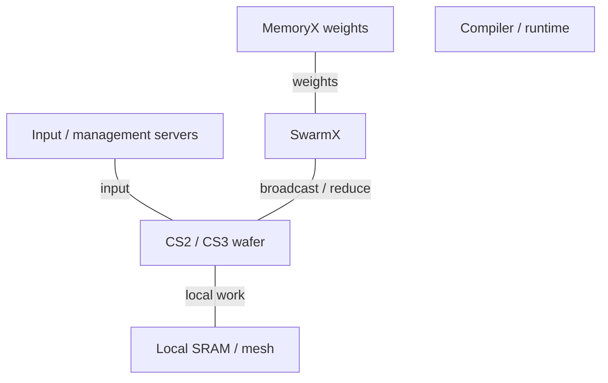
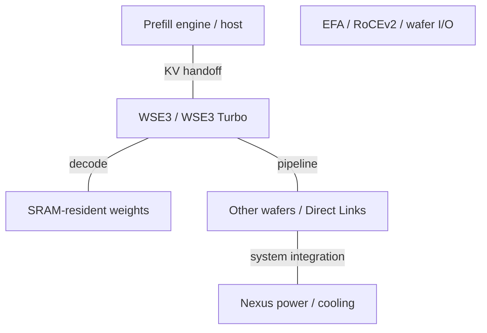

# Cerebras AI Infrastructure Architecture Evolution

2015-2026 | 2026-09-28

## 01 Scope and architectural synthesis

This report covers Cerebras from its 2016 founding through 28 September 2026, within the series’ 2015-2026 window. It follows WSE1/2/3/3 Turbo, CS1/2/3/4, MemoryX, SwarmX, wafer I/O, software and the disclosed CS5/CS6 roadmap. It distinguishes wafer silicon from complete systems and deployment services. There is no separate Cerebras server-CPU or merchant DPU line in the documented portfolio.

Cerebras changes the physical boundary of a computer: hundreds of thousands of small cores and their local SRAM communicate on a continuous wafer-scale mesh. This reduces many package crossings, but replaces commodity packaging with demanding yield repair, power delivery, cooling and mapping requirements. Its evolution moves from making wafer-scale computation practical to separating model storage from execution, and then to organizing multiple wafers for fast inference.

## 02 WSE1 and CS1: making wafer scale work

The 2019 Hot Chips disclosure introduced a 46,225 mm², 16 nm processor with 1.2 trillion transistors, 400,000 cores and 18 GB distributed SRAM. Local memory and a two-dimensional mesh replace the conventional pattern of repeatedly reaching off-chip for operands. The 9 PB/s SRAM figure is the sum of local memory interfaces; the 100 Pb/s fabric figure is an aggregate of mesh links. Neither is a global arbitrary-access bandwidth available to one core.

Architectural interpretation: a wafer-scale device cannot require a defect-free wafer. Redundancy and routing repair are part of the architecture, alongside physical continuity across reticle boundaries. This makes yield a system-design problem rather than merely a transistor-density metric. CS1 adds the power and cooling machinery needed to expose the wafer as usable computing infrastructure.

## 03 WSE2 and CS2: local dataflow and Weight Streaming

WSE2 moves to 7 nm with 850,000 cores and 40 GB SRAM. The 2022 Hot Chips architecture deep dive describes independently programmed cores with 48 KB local memory, a small software-managed accumulator cache, tensor address generation and data-triggered execution. The mesh extends across stitched reticle regions. Source-synchronous parallel links and repair state machines preserve the logical fabric despite manufacturing defects.

Sparsity is supported through dataflow: zero elements can be filtered before sending, so receiving cores do not execute the corresponding work. This is distinct from advertising a fixed two-times structured-sparse peak. Benefits depend on actual sparsity, mapping and communication balance. The local memories also hold code and working data, so aggregate SRAM capacity cannot be assigned entirely to model weights.

Weight Streaming separates parameter storage from wafer execution. MemoryX stores and streams weights; SwarmX broadcasts weights and reduces gradients across CS systems. Each wafer executes the mapped work while external storage supports models larger than its SRAM. This is not an enlargement of on-wafer SRAM and does not create cache-coherent shared memory. The operator-facing simplification of distributed training still depends on a compiler and fabric that move the right data at the right time.

## 04 WSE3 and CS3: more compute, similar memory capacity

WSE3 uses 5 nm, four trillion transistors, 900,000 cores and 44 GB SRAM. The advertised 125 PFLOP/s AI compute rate needs a named numerical and sparsity basis before it can enter a dense BF16 comparison. Core count grows about 5.9% over WSE2, while SRAM capacity grows 10%. The generation’s performance improvement therefore cannot be explained simply as twice as many cores. ISA, datapath and implementation changes matter.

The 2024 launch describes external memory configurations up to 1.2 PB and clusters up to 2,048 CS3 systems. Those are system/storage scale claims, not SRAM capacity per wafer. Hot Chips 2024 explains training through Weight Streaming and inference through model placement on the wafer fabric. For latency-sensitive decode, keeping weights in SRAM avoids repeated off-chip weight reads, but capacity determines how many wafers and pipeline stages a model needs.

## 05 CS4 and WSE3 Turbo: a system-generation change

CS4, announced in August 2026, is a three-wafer rack-scale system using WSE3 Turbo, not a product called WSE4. Each wafer retains four trillion transistors, 900,000 cores and 44 GB SRAM. Higher operating rates accompany new power delivery, modular cooling and wafer I/O in the Nexus platform. The published system totals are 132 GB SRAM, 129.6 PB/s SRAM bandwidth and 7.2 Tb/s off-wafer I/O. First shipments were targeted for that quarter; the announcement alone does not establish completed general availability.

The implementation emphasis shifts toward reducing the final power-delivery distance and making compute, power and I/O modules independently serviceable. Moving power conversion close to the wafer reduces resistive loss; it does not remove the need to dissipate the delivered power. The platform’s usefulness must be assessed with facility power, coolant requirements, maintenance isolation and failure recovery, not solely wafer arithmetic.

The programmable Wafer I/O Module supports RoCEv2 Ethernet and Direct Wafer Links. The latter connects wafers without an intervening switch, with a vendor-reported latency as low as two microseconds. Per-wafer off-wafer bandwidth is 2.4 Tb/s, or 300 GB/s as a nominal unit conversion; the announcement does not unambiguously specify directional aggregation. This external path remains radically smaller than the sum of local SRAM interfaces, making placement and pipelining essential.

## 06 Silicon and system specification tables

### Wafer specifications, per wafer

| Product | Architecture | GA / milestone | Status | Process | Dies / packaging | Compute units | Dense BF16 | Dense FP8 | Dense FP6 / FP4 | FP64 vector / matrix | Memory: type; stacks; GB; TB/s | LLC / SRAM | Scale-up: links; GB/s per direction; domain | Host link | Power / cooling | Form factor |
| --- | --- | --- | --- | --- | --- | --- | --- | --- | --- | --- | --- | --- | --- | --- | --- | --- |
| WSE1 / CS1 | Wafer-scale dataflow | 2019 | Historical shipping | 16 nm | 1 wafer / system | 400000 cores | n/d | n/d | n/d | n/d | No attached HBM; external MemoryX separate | 18 GB SRAM; 9 PB/s aggregate | 2D mesh; per-link n/d; one wafer | System I/O; not host PCIe card | n/d; liquid | Wafer-scale system |
| WSE2 / CS2 | Wafer-scale dataflow | 2021 | Historical shipping | 7 nm | 1 wafer / system | 850000 cores | n/d | n/d | n/d | n/d | No attached HBM; external MemoryX separate | 40 GB SRAM; 20 PB/s aggregate | 2D mesh; per-link n/d; one wafer | System I/O; not host PCIe card | n/d; liquid | Wafer-scale system |
| WSE3 / CS3 | Wafer-scale dataflow | 2024 | Shipping / available | 5 nm | 1 wafer / system | 900000 cores | n/d | n/d | n/d | n/d | No attached HBM; external MemoryX separate | 44 GB SRAM; 21.6 PB/s aggregate | 2D mesh; per-link n/d; one wafer | System I/O; not host PCIe card | n/d; liquid | Wafer-scale system |
| WSE3 Turbo / CS4 | Wafer-scale dataflow | 2026 announcement | Announced; GA n/d | 5 nm | 3 wafers / CS4; numbers per wafer | 900000 cores | n/d | n/d | n/d | n/d | No attached HBM; external MemoryX separate | 44 GB SRAM; 43.2 PB/s aggregate | 2D mesh; per-link n/d; one wafer | System I/O; not host PCIe card | n/d; liquid | Wafer-scale system |

The 2024 slides round WSE3 memory bandwidth to 21 PB/s; the 2026 system comparison uses 21.6 PB/s. This report uses the latter for normalized calculations. An older developer page states a 20% core-count increase, which conflicts with the explicitly published 850,000 and 900,000 counts; the counts are retained. Published fabric figures such as 214 or 220 Pb/s are aggregate link metrics and must not be treated as bisection bandwidth.

### Host CPU boundary

| Generation / reference SKU | Codename | GA | Status | Core µarch | Cores / threads | Process per die | Dies / packaging | L2 per core | L3 / domain | Memory: channels; rate; GB/s | Sockets / links | PCIe / CXL | TDP | Vector / matrix ISA |
| --- | --- | --- | --- | --- | --- | --- | --- | --- | --- | --- | --- | --- | --- | --- |
| External preprocessing / management CPUs | n/a | n/a | Supplier products | n/a | n/a | n/a | n/a | n/a | n/a | n/a | n/a | n/a | n/a | n/a |

### System generations

| Platform | Year / milestone | CPU / accelerator count | Scale-up domain | Scale-out per accelerator | Rack power | Cooling |
| --- | --- | --- | --- | --- | --- | --- |
| CS1 | 2019 | 1 WSE1 | 1 wafer; cluster topology n/d | n/d | n/d | Liquid |
| CS2 + MemoryX/SwarmX | 2021 | 1 WSE2 per CS2 | Weight Streaming cluster | n/d | n/d | Liquid |
| CS3 | 2024 | 1 WSE3; up to 2048 systems | SwarmX / workload placement | 1.2 Tb/s system I/O; direction n/d | n/d | Liquid |
| CS4 / Nexus | 2026 announcement | 3 WSE3T | Direct Wafer Links / Ethernet | 2.4 Tb/s per wafer; direction n/d | n/d | Modular liquid cooling |
| CS5 / CS6 | 2027 target / later | n/d | n/d | n/d | n/d | n/d |

## 07 MemoryX, SwarmX and networking boundaries

### Communication products and functions

| Product | GA / milestone | Status | Class | Ports × speed | SerDes | Host interface | Programmable engine | Embedded CPU | On-card memory | Transport / RDMA | Congestion control | Key offloads | Power |
| --- | --- | --- | --- | --- | --- | --- | --- | --- | --- | --- | --- | --- | --- |
| SwarmX | 2021 | Shipping / available | Broadcast/reduce fabric | n/d | n/d | System Ethernet | Collective acceleration | n/d | n/d | Weight/gradient streaming | n/d | Broadcast / reduction | n/d |
| Wafer I/O Module | 2026 | Announced; GA n/d | Programmable wafer I/O | 2.4 Tb/s/wafer aggregate; direction n/d | n/d | Wafer system interface | Programmable I/O | n/d | n/d | RoCEv2 / Direct Wafer Links | n/d | Wafer-to-wafer data movement | n/d |
| Merchant DPU / host NIC | n/a | n/a | n/a | n/a | n/a | n/a | n/a | n/a | n/a | n/a | n/a | n/a | n/a |

### Interconnect hierarchy

| Interconnect | Year / generation | Lane rate | Lanes / link | GB/s per link per direction | Links / device | Topology | Domain limit | Coherence / semantics |
| --- | --- | --- | --- | --- | --- | --- | --- | --- |
| On-wafer mesh | WSE1-3T | Generation-specific | 32-bit interfaces in HC2022 | n/d | 4 neighbors/core | 2D mesh | Wafer | Explicit local-memory messages |
| SwarmX | 2021 onward | n/d | n/d | n/d | n/d | Broadcast / reduction tree | System configuration | Weight streaming; not coherent |
| Direct Wafer Links | 2026 | n/d | n/d | n/d | n/d | Switchless wafer links | n/d | Explicit communication |

Four bandwidth levels must remain distinct: a core’s SRAM port, the sum of SRAM ports across a wafer, the wafer mesh under a particular traffic pattern, and off-wafer I/O. Adding them or comparing their totals directly with GPU rack bisection obscures bottlenecks. A model that communicates mainly between neighbors can exploit the mesh differently from all-to-all expert routing or a global transpose.

## 08 Programming, deployment and heterogeneous inference

The software has two useful levels: framework/model compilation for AI users and low-level spatial/dataflow programming for kernels and scientific workloads. The compiler must allocate local storage, place work and route communication while respecting defects and resource limits. Weight Streaming hides much distributed-training complexity from the user, but does not make these physical constraints disappear. SC stencil research and wafer-scale FFT work demonstrate alternative mappings, not universal speedups for every scientific application.

The March 2026 AWS collaboration describes CS3 deployment and a planned disaggregated inference path: Trainium performs prefill and transfers KV state over EFA to Cerebras for decode. This makes the phase boundary a system interface. The benefit depends on prompt length, output length, batching, transfer time and queueing. The announcement is not used as proof of public general availability for every named model.

### Software and control layers

| Layer | Component | Function | Constraint |
| --- | --- | --- | --- |
| Model | Framework / model compiler | Compile training and inference | Operator and numerical support |
| Kernel | CSL / dataflow mapping | Spatial compute and communication | Local memory and mesh routing |
| Training | MemoryX / SwarmX control | Weights and gradient reduction | Streaming schedule and bandwidth |
| Operations | Management / preprocessing servers | Input and resource scheduling | External hosts and services |

### 2021-2024 training stack

MemoryX capacity is external to the wafer SRAM.

### 2026 inference integration

Functional options from separate announcements; not a single confirmed shipping configuration.

## 09 Derived balance and future architectural direction

### Normalized metrics

| Metric | Calculation | Meaning |
| --- | --- | --- |
| WSE2→WSE3 core growth | 900000/850000 = 1.059 | 5.9%, not 20% |
| WSE3→CS4 SRAM | 3×44 = 132 GB | System aggregation; not one wafer |
| WSE3T SRAM/external I/O | 43.2 PB/s / 0.0003 PB/s = 144000 | Scale contrast; direction and topology differ |
| CS4 I/O unit conversion | 7.2 Tb/s /8 = 900 GB/s | Nominal aggregate; direction n/d |
| 44 GB / BF16 weight | 44e9/2 = 22 billion parameters | Capacity upper bound before code/KV/workspace |
| Dense HBM/FLOP | n/a | SRAM architecture; no HBM tier |
| SRAM/FLOP; capacity/FLOP; FLOP/W | n/d | Matched dense format and power basis absent |
| Host DDR/core; L3/core | n/a | No proprietary host CPU |

At Hot Chips 2026, Cerebras described CS5 for 2027 using a next-generation WSE, and CS6 as a future combination of wafer-scale SRAM/compute with stacked DRAM. These are roadmap disclosures. The architectural importance of CS6 is a new memory tier: capacity could grow without proportionally multiplying wafers, but locality, stacking yield, thermal resistance and the SRAM/DRAM interface become central. No undisclosed capacity, process or measured speed is assigned to it.

## 10 Conference index and naming crosswalk

### Disclosure map

| Venue | Year | Paper / talk / disclosure | Presenter / authors | Product | Evidence type | Source |
| --- | --- | --- | --- | --- | --- | --- |
| Hot Chips | 2019 | Wafer Scale Engine | Cerebras / research authors | WSE1 | Architecture / implementation / workload | E05 |
| Hot Chips | 2021 | Extreme-scale AI / Weight Streaming | Cerebras / research authors | WSE2 / CS2 | Architecture / implementation / workload | E06 E03 |
| Hot Chips | 2022 | Architecture deep dive | Cerebras / research authors | Core / SRAM / mesh | Architecture / implementation / workload | C01 |
| Hot Chips | 2023 | Inside the Wafer-Scale Cluster | Cerebras / research authors | MemoryX / SwarmX | Architecture / implementation / workload | C06 |
| Hot Chips | 2024 | Wafer-Scale AI | Cerebras / research authors | WSE3 / CS3 | Architecture / implementation / workload | C02 |
| Hot Chips | 2026 | Ultrafast frontier inference | Cerebras / research authors | CS4; CS5/6 roadmap | Architecture / implementation / workload | C03 |
| ISPD | 2020 | Wafer-scale placement contest | Cerebras / research authors | Physical mapping | Architecture / implementation / workload | C05 |
| SC | 2020 | Fast Stencil-Code Computation | Cerebras / research authors | CS1 research workload | Architecture / implementation / workload | C07 |

Hot Chips provides the main product architecture chain; ISPD and SC illuminate mapping and application behavior. This edition does not establish a direct product implementation paper at ISCA, MICRO, HPCA, ASPLOS or ISSCC. IEEE Micro journal articles derived from Hot Chips must not be mislabelled MICRO conference papers. Detailed comparison still needs matched numerical-format peaks, system power and workload-level throughput under a stated service latency.

### Names and counting levels

| Name | Meaning | Boundary |
| --- | --- | --- |
| WSE | Wafer processor | Silicon generation |
| CS | Complete compute system | CS4 uses three WSE3T |
| MemoryX | External model storage/streaming | Not on-wafer SRAM |
| Swarm / SwarmX | On-wafer fabric / cluster fabric | Different physical boundaries |
| Nexus | Rack platform | Power, cooling, I/O modularity |

## Source map

01 Scope and architectural synthesis — C01, C02, C03, E01, E02, E03, E05, E06

02 WSE1 and CS1: making wafer scale work — C01, E05

03 WSE2 and CS2: local dataflow and Weight Streaming — C01, C02, E03, E06, P01

04 WSE3 and CS3: more compute, similar memory capacity — C02, E01, P01

05 CS4 and WSE3 Turbo: a system-generation change — C03, E02, P02

06 Silicon and system specification tables — C02, C03, E01, E02, E03, E05, E06, P01

07 MemoryX, SwarmX and networking boundaries — C01, C04, E02, E03, P01

08 Programming, deployment and heterogeneous inference — C01, C04, C07, E01, E03, E04, P01

09 Derived balance and future architectural direction — C02, C03, E01, E02, E06, P01

10 Conference index and naming crosswalk — C01, C02, C03, C05, C06, C07, E01, E02, E03, E05, E06, P01

## References

### Product and technical documentation

[P01] Wafer-scale cluster architecture. [https://training-api.cerebras.ai/en/latest/wsc/Concepts/how-cerebras-works.html](https://training-api.cerebras.ai/en/latest/wsc/Concepts/how-cerebras-works.html). Primary source; accessed by 2026-09-28

[P02] CS4 platform. [https://www.cerebras.ai/cs4](https://www.cerebras.ai/cs4). Primary source; accessed by 2026-09-28

### Conference records and implementation disclosures

[C01] Cerebras architecture deep dive, Hot Chips2022. [https://www.cerebras.ai/blog/cerebras-architecture-deep-dive-first-look-inside-the-hw-sw-co-design-for-deep-learning](https://www.cerebras.ai/blog/cerebras-architecture-deep-dive-first-look-inside-the-hw-sw-co-design-for-deep-learning). Primary source; accessed by 2026-09-28

[C02] Cerebras wafer-scale AI, Hot Chips2024. [https://hc2024.hotchips.org/assets/program/conference/day2/72_HC2024.Cerebras.Sean.v03.final.pdf](https://hc2024.hotchips.org/assets/program/conference/day2/72_HC2024.Cerebras.Sean.v03.final.pdf). Primary source; accessed by 2026-09-28

[C03] Cerebras Hot Chips2026 deep dive. [https://www.cerebras.ai/blog/ultrafast-frontier-inference-cerebras-deep-dive-at-hot-chips-2026](https://www.cerebras.ai/blog/ultrafast-frontier-inference-cerebras-deep-dive-at-hot-chips-2026). Primary source; accessed by 2026-09-28

[C04] Wafer-scale FFT research. [https://arxiv.org/pdf/2209.15040](https://arxiv.org/pdf/2209.15040). Primary source; accessed by 2026-09-28

[C05] ISPD2020 wafer-scale placement contest. [https://www.ispd.cc/contests/20/index.html](https://www.ispd.cc/contests/20/index.html). Indexed record or searchable official page; product details cross-checked with the associated technical document.

[C06] Inside the Cerebras Wafer-Scale Cluster, Hot Chips2023. [https://doi.org/10.1109/HCS59251.2023.10254700](https://doi.org/10.1109/HCS59251.2023.10254700). Indexed record or searchable official page; product details cross-checked with the associated technical document.

[C07] Fast Stencil-Code Computation, SC2020. [https://arxiv.org/pdf/2010.03660](https://arxiv.org/pdf/2010.03660). Primary source; accessed by 2026-09-28

### Launches, ecosystem and deployment

[E01] WSE3 announcement, March2024. [https://www.cerebras.ai/press-release/cerebras-announces-third-generation-wafer-scale-engine](https://www.cerebras.ai/press-release/cerebras-announces-third-generation-wafer-scale-engine). Primary source; accessed by 2026-09-28

[E02] CS4 announcement, August2026. [https://investors.cerebras.ai/news-releases/news-release-details/cerebras-unveils-cs-4-30-times-faster-gpu-based-solutions](https://investors.cerebras.ai/news-releases/news-release-details/cerebras-unveils-cs-4-30-times-faster-gpu-based-solutions). Primary source; accessed by 2026-09-28

[E03] Weight Streaming, 2021. [https://www.cerebras.ai/blog/scaling-up-and-out-training-massive-models-on-cerebras-systems-using-weight-streaming](https://www.cerebras.ai/blog/scaling-up-and-out-training-massive-models-on-cerebras-systems-using-weight-streaming). Primary source; accessed by 2026-09-28

[E04] Cerebras and AWS disaggregated inference, 2026. [https://www.cerebras.ai/blog/cerebras-is-coming-to-aws](https://www.cerebras.ai/blog/cerebras-is-coming-to-aws). Primary source; accessed by 2026-09-28

[E05] WSE1 introduction, Hot Chips2019. [https://www.cerebras.ai/press-release/cerebras-systems-unveils-the-industrys-first-trillion-transistor-chip](https://www.cerebras.ai/press-release/cerebras-systems-unveils-the-industrys-first-trillion-transistor-chip). Primary source; accessed by 2026-09-28

[E06] WSE2 architecture, 2021. [https://www.cerebras.ai/blog/an-ai-chip-with-unprecedented-performance-to-do-the-unimaginable](https://www.cerebras.ai/blog/an-ai-chip-with-unprecedented-performance-to-do-the-unimaginable). Primary source; accessed by 2026-09-28
