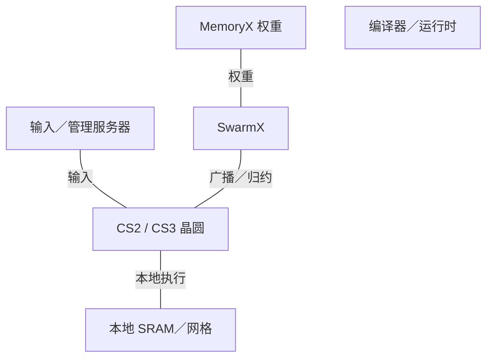
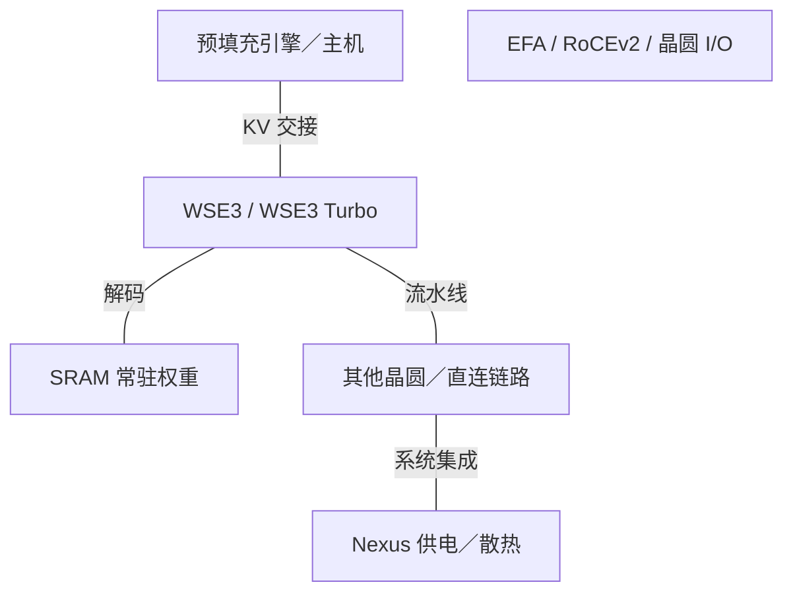

# Cerebras AI 基础设施架构演进

2015-2026 | 2026-09-28

## 01 范围与架构主线

本报告在系列 2015-2026 年窗口内，覆盖 Cerebras 从 2016 年成立至 2026 年 9 月 28 日的发展，追踪 WSE1／2／3／3 Turbo、CS1／2／3／4、MemoryX、SwarmX、晶圆 I/O、软件及已披露 CS5／CS6 路线图。晶圆芯片、完整系统与部署服务分别处理。已记录产品组合中不存在独立 Cerebras 服务器 CPU 或商用 DPU 产品线。

Cerebras 改变计算机的物理边界：数十万个小核心及本地 SRAM 通过连续晶圆级网格通信。这减少许多封装跨越，但也用复杂的良率修复、供电、散热及映射要求替代常规封装。其演进从使晶圆级计算可行，转向分离模型存储与执行，再转向组织多晶圆实现快速推理。

## 02 WSE1 与 CS1：实现晶圆级计算

2019 年 Hot Chips 披露了面积 46,225 mm²、16 nm、1.2 万亿晶体管、40 万核心及 18 GB 分布式 SRAM 的处理器。本地存储与二维网格替代反复到片外取操作数的传统模式。9 PB/s SRAM 带宽是本地存储接口之和；100 Pb/s 网络带宽是网格链路聚合值。两者都不是任意一个核心可享有的全局随机访问带宽。

架构解读：晶圆级设备不能要求整片晶圆无缺陷。冗余和路由修复是架构的一部分，与跨光刻边界的物理连续连接共同工作。因此良率成为系统设计问题，而不只是晶体管密度指标。CS1 增加供电与散热装置，把晶圆转化为可用计算基础设施。

## 03 WSE2 与 CS2：本地数据流与权重流送

WSE2 转向 7 nm，拥有 85 万核心及 40 GB SRAM。2022 年 Hot Chips 架构深析描述独立编程核心、48 KB 本地存储、小型软件管理累加缓存、张量地址生成及数据触发执行。网格跨越连接的光刻区域，源同步并行链路和修复状态机在制造缺陷存在时保持逻辑网络。

稀疏性通过数据流支持：零元素可以在发送前被过滤，接收核心因而不执行对应工作。这不同于公布固定两倍的结构化稀疏峰值。收益取决于实际稀疏度、映射及通信平衡。本地存储同时保存代码与工作数据，因此不能将聚合 SRAM 容量全部分配给模型权重。

权重流送将参数存储与晶圆执行分开。MemoryX 存储并流送权重，SwarmX 在多个 CS 系统间广播权重并归约梯度。各晶圆执行映射任务，外部存储支持超过 SRAM 容量的模型。这不是片上 SRAM 扩容，也不建立缓存一致性共享内存。面向用户的分布式训练简化，仍依赖编译器与网络在正确时间搬移正确数据。

## 04 WSE3 与 CS3：算力增加，存储容量增长较小

WSE3 采用 5 nm、四万亿晶体管、90 万核心和 44 GB SRAM。公布的 125 PFLOP/s AI 算力，需要明确数值及稀疏口径后才能参与稠密 BF16 比较。相较 WSE2，核心数增长约 5.9%，SRAM 容量增长 10%。因此本代性能提升不能简单解释为核心数量翻倍，ISA、数据通路及实现变化同样重要。

2024 年发布描述最高 1.2 PB 外部存储配置及最高 2,048 台 CS3 的集群。这是系统／存储规模，不是每晶圆 SRAM 容量。Hot Chips 2024 通过权重流送解释训练，并通过晶圆网络中的模型放置解释推理。对延迟敏感的解码，将权重保留在 SRAM 可以避免反复片外读取，但容量决定模型需要多少晶圆和流水级。

## 05 CS4 与 WSE3 Turbo：系统代际变化

2026 年 8 月公布的 CS4 是使用 WSE3 Turbo 的三晶圆机架级系统，并不是名为 WSE4 的产品。每晶圆仍有四万亿晶体管、90 万核心和 44 GB SRAM。更高工作速率配合 Nexus 平台的新供电、模块化散热及晶圆 I/O。公布系统总量为 132 GB SRAM、129.6 PB/s SRAM 带宽、7.2 Tb/s 片外 I/O。首批交付目标是当季，发布声明本身不证明已经完成正式商用。

实现重点转向缩短最终供电距离，并使计算、供电及 I/O 模块可独立维护。把电源转换移近晶圆可以减少电阻损耗，却不会消除对所输送功率的散热需求。平台价值必须结合设施供电、冷却液要求、维护隔离及故障恢复评估，不能只看晶圆算术能力。

可编程 Wafer I/O Module 支持 RoCEv2 以太网和 Direct Wafer Links。后者无需中间交换机连接晶圆，厂商报告延迟最低两微秒。每晶圆片外带宽为 2.4 Tb/s，按单位换算为标称 300 GB/s；发布未明确方向聚合口径。该外部路径仍远小于本地 SRAM 接口总和，因此放置与流水化至关重要。

## 06 芯片与系统规格表

### 晶圆规格：每晶圆口径

| 产品 | 架构 | 商用／里程碑 | 状态 | 工艺 | 裸片／封装 | 计算单元 | 稠密 BF16 | 稠密 FP8 | 稠密 FP6／FP4 | FP64 向量／矩阵 | 内存：类型；堆栈；GB；TB/s | 末级缓存／SRAM | 纵向扩展：链路；单向 GB/s；域 | 主机连接 | 功耗／散热 | 形态 |
| --- | --- | --- | --- | --- | --- | --- | --- | --- | --- | --- | --- | --- | --- | --- | --- | --- |
| WSE1 / CS1 | 晶圆级数据流 | 2019 | 历史已商用 | 16 nm | 1 晶圆 / 系统 | 400000 核心 | n/d | n/d | n/d | n/d | 无附加 HBM；外部 MemoryX 单列 | 18 GB SRAM; 9 PB/s 聚合 | 二维网格; 每链路 n/d; one 晶圆 | 系统 I/O；非主机 PCIe 板卡 | n/d; 液冷 | 晶圆级系统 |
| WSE2 / CS2 | 晶圆级数据流 | 2021 | 历史已商用 | 7 nm | 1 晶圆 / 系统 | 850000 核心 | n/d | n/d | n/d | n/d | 无附加 HBM；外部 MemoryX 单列 | 40 GB SRAM; 20 PB/s 聚合 | 二维网格; 每链路 n/d; one 晶圆 | 系统 I/O；非主机 PCIe 板卡 | n/d; 液冷 | 晶圆级系统 |
| WSE3 / CS3 | 晶圆级数据流 | 2024 | 已商用／可获取 | 5 nm | 1 晶圆 / 系统 | 900000 核心 | n/d | n/d | n/d | n/d | 无附加 HBM；外部 MemoryX 单列 | 44 GB SRAM; 21.6 PB/s 聚合 | 二维网格; 每链路 n/d; one 晶圆 | 系统 I/O；非主机 PCIe 板卡 | n/d; 液冷 | 晶圆级系统 |
| WSE3 Turbo / CS4 | 晶圆级数据流 | 2026 发布 | 已公布；GA n/d | 5 nm | 3 晶圆 / CS4; 数值按每晶圆 | 900000 核心 | n/d | n/d | n/d | n/d | 无附加 HBM；外部 MemoryX 单列 | 44 GB SRAM; 43.2 PB/s 聚合 | 二维网格; 每链路 n/d; one 晶圆 | 系统 I/O；非主机 PCIe 板卡 | n/d; 液冷 | 晶圆级系统 |

2024 年幻灯片将 WSE3 内存带宽约写为 21 PB/s，2026 年系统比较采用 21.6 PB/s；本报告归一化计算采用后者。较早开发者页面写核心数增长 20%，与明确公布的 85 万和 90 万数量冲突，因此保留明确数量。214 或 220 Pb/s 等网络指标是链路聚合量，不能当作二分带宽。

### 主机 CPU 边界

| 代际／参考 SKU | 代号 | 正式商用 | 状态 | 核心微架构 | 核心／线程 | 各裸片工艺 | 裸片／封装 | 每核 L2 | L3／共享域 | 内存：通道；速率；GB/s | 插槽／互联 | PCIe／CXL | TDP | 向量／矩阵 ISA |
| --- | --- | --- | --- | --- | --- | --- | --- | --- | --- | --- | --- | --- | --- | --- |
| 外部预处理／管理 CPU | n/a | n/a | 供应商产品 | n/a | n/a | n/a | n/a | n/a | n/a | n/a | n/a | n/a | n/a | n/a |

### 系统代际

| 平台 | 年份／里程碑 | CPU／加速器数量 | 纵向扩展域 | 每加速器横向带宽 | 机架功耗 | 散热 |
| --- | --- | --- | --- | --- | --- | --- |
| CS1 | 2019 | 1 WSE1 | 1 晶圆; 集群 topology n/d | n/d | n/d | 液冷 |
| CS2 + MemoryX/SwarmX | 2021 | 1 WSE2 每 CS2 | 权重流送集群 | n/d | n/d | 液冷 |
| CS3 | 2024 | 1 WSE3; 最高 2048 systems | SwarmX / workload placement | 1.2 Tb/s 系统 I/O; 方向 n/d | n/d | 液冷 |
| CS4 / Nexus | 2026 发布 | 3 WSE3T | Direct Wafer Links / Ethernet | 2.4 Tb/s 每晶圆; 方向 n/d | n/d | 模块化液冷 |
| CS5 / CS6 | 2027 目标 / later | n/d | n/d | n/d | n/d | n/d |

## 07 MemoryX、SwarmX 与网络边界

### 通信产品与功能

| 产品 | 商用／里程碑 | 状态 | 类别 | 端口×速率 | SerDes | 主机接口 | 可编程引擎 | 嵌入式 CPU | 板载内存 | 传输／RDMA | 拥塞控制 | 主要卸载 | 功耗 |
| --- | --- | --- | --- | --- | --- | --- | --- | --- | --- | --- | --- | --- | --- |
| SwarmX | 2021 | 已商用／可获取 | 广播／归约网络 | n/d | n/d | 系统以太网 | 集合通信加速 | n/d | n/d | 权重／梯度流送 | n/d | 广播／归约 | n/d |
| Wafer I/O Module | 2026 | 已公布；GA n/d | 可编程晶圆 I/O | 2.4 Tb/s/晶圆 聚合; 方向 n/d | n/d | 晶圆系统接口 | 可编程 I/O | n/d | n/d | RoCEv2 / Direct Wafer Links | n/d | 晶圆间数据搬移 | n/d |
| 商用 DPU／主机网卡 | n/a | n/a | n/a | n/a | n/a | n/a | n/a | n/a | n/a | n/a | n/a | n/a | n/a |

### 互联层次

| 互联 | 年份／代际 | 通道速率 | 每链路通道 | 每链路单向 GB/s | 每设备链路 | 拓扑 | 域规模 | 一致性／语义 |
| --- | --- | --- | --- | --- | --- | --- | --- | --- |
| On-晶圆 mesh | WSE1-3T | 依代际 | HC2022 中的 32 位接口 | n/d | 4 neighbors/核心 | 二维网格 | Wafer | 显式本地存储消息 |
| SwarmX | 2021 起 | n/d | n/d | n/d | n/d | 广播／归约树 | 系统配置 | 权重流送；非一致性 |
| Direct Wafer Links | 2026 | n/d | n/d | n/d | n/d | 晶圆无交换机直连 | n/d | 显式通信 |

四个带宽层级必须区分：单核心 SRAM 端口、整晶圆 SRAM 端口之和、特定流量模式下的晶圆网格，以及片外 I/O。将其相加或直接拿总量比较 GPU 机架二分带宽，会掩盖瓶颈。以邻居通信为主的模型，利用网格的方式不同于全互联专家路由或全局转置。

## 08 编程、部署与异构推理

软件有两个重要层次：面向 AI 用户的框架／模型编译，以及面向算子和科学计算的低层空间／数据流编程。编译器必须分配本地存储、放置任务并安排通信，同时满足缺陷和资源约束。权重流送对用户隐藏许多分布式训练复杂性，但不会使这些物理限制消失。SC 模板计算研究与晶圆级 FFT 展示其他映射方式，不代表对所有科学应用的通用加速。

2026 年 3 月 AWS 合作描述 CS3 部署及计划中的分离式推理路径：Trainium 执行预填充，通过 EFA 向 Cerebras 传递 KV 状态，由后者执行解码。这把阶段边界变成系统接口。收益取决于输入长度、输出长度、批量、传输时间与排队。发布声明不作为所有具名模型已公共正式商用的证明。

### 软件与控制层

| 层 | 组件 | 功能 | 约束 |
| --- | --- | --- | --- |
| 模型 | 框架／模型编译器 | 编译训练与推理 | 算子与数值支持 |
| 内核 | CSL / dataflow mapping | 空间计算与通信 | 本地存储与网格路由 |
| 训练 | MemoryX / SwarmX 控制 | 权重与梯度归约 | 流送调度与带宽 |
| 运维 | 管理／预处理服务器 | 输入与资源调度 | 外部主机及服务 |

### 2021-2024 年训练栈

MemoryX 容量位于晶圆 SRAM 之外。

### 2026 年推理集成

来自不同披露的功能选项，不代表单一已确认交付配置。

## 09 推导平衡与未来架构方向

### 归一化指标

| 指标 | 计算 | 含义 |
| --- | --- | --- |
| WSE2→WSE3 核心数量增长 | 900000/850000 = 1.059 | 5.9%，非 20% |
| WSE3→CS4 SRAM | 3×44 = 132 GB | 系统聚合；非单晶圆 |
| WSE3T SRAM/外部 I/O | 43.2 PB/s / 0.0003 PB/s = 144000 | 规模对照；方向与拓扑不同 |
| CS4 I/O unit conversion | 7.2 Tb/s /8 = 900 GB/s | 标称聚合；方向 n/d |
| 44 GB / BF16 weight | 44e9/2 = 22 十亿参数 | 扣除代码／KV／工作区前容量上限 |
| Dense HBM/FLOP | n/a | SRAM 架构；无 HBM 层 |
| SRAM/FLOP; 容量/FLOP; FLOP/W | n/d | 缺匹配稠密格式及功耗口径 |
| 主机 DDR/核心; L3/核心 | n/a | 无自研主机 CPU |

在 Hot Chips 2026，Cerebras 描述计划于 2027 年推出、使用下一代 WSE 的 CS5，以及未来结合晶圆级 SRAM／计算与堆叠 DRAM 的 CS6。这些均属路线图披露。CS6 的架构意义是引入新存储层：容量可能无需按比例增加晶圆数量就能增长，但局部性、堆叠良率、热阻及 SRAM／DRAM 接口成为核心。不为其填入未披露容量、工艺或实测速率。

## 10 会议索引与命名对照

### 披露映射

| 会议／活动 | 年份 | 论文／演讲／披露 | 报告人／作者 | 产品 | 证据类型 | 来源 |
| --- | --- | --- | --- | --- | --- | --- |
| Hot Chips | 2019 | Wafer Scale Engine | Cerebras／研究作者 | WSE1 | 架构／实现／负载 | E05 |
| Hot Chips | 2021 | Extreme-scale AI / Weight Streaming | Cerebras／研究作者 | WSE2 / CS2 | 架构／实现／负载 | E06 E03 |
| Hot Chips | 2022 | Architecture deep dive | Cerebras／研究作者 | Core / SRAM / mesh | 架构／实现／负载 | C01 |
| Hot Chips | 2023 | Inside the Wafer-Scale Cluster | Cerebras／研究作者 | MemoryX / SwarmX | 架构／实现／负载 | C06 |
| Hot Chips | 2024 | Wafer-Scale AI | Cerebras／研究作者 | WSE3 / CS3 | 架构／实现／负载 | C02 |
| Hot Chips | 2026 | Ultrafast frontier inference | Cerebras／研究作者 | CS4; CS5/6 路线图 | 架构／实现／负载 | C03 |
| ISPD | 2020 | Wafer-scale placement contest | Cerebras／研究作者 | 物理映射 | 架构／实现／负载 | C05 |
| SC | 2020 | Fast Stencil-Code Computation | Cerebras／研究作者 | CS1 research workload | 架构／实现／负载 | C07 |

Hot Chips 提供主要产品架构链，ISPD 与 SC 解释映射及应用行为。本版未建立 ISCA、MICRO、HPCA、ASPLOS 或 ISSCC 的直接产品实现论文。由 Hot Chips 延伸的 IEEE Micro 期刊文章不能误标为 MICRO 会议论文。详细比较仍需要匹配数值格式的峰值、系统功耗，以及指定服务延迟下的负载吞吐。

### 名称与计数层级

| 名称 | 含义 | 边界 |
| --- | --- | --- |
| WSE | 晶圆处理器 | 芯片代际 |
| CS | 完整计算系统 | CS4 使用三片 WSE3T |
| MemoryX | 外部模型存储／流送 | 不是片上 SRAM |
| Swarm / SwarmX | 片上网络／集群网络 | 不同物理边界 |
| Nexus | 机架平台 | 供电、散热、I/O 模块化 |

## 来源映射

01 范围与架构主线 — C01, C02, C03, E01, E02, E03, E05, E06

02 WSE1 与 CS1：实现晶圆级计算 — C01, E05

03 WSE2 与 CS2：本地数据流与权重流送 — C01, C02, E03, E06, P01

04 WSE3 与 CS3：算力增加，存储容量增长较小 — C02, E01, P01

05 CS4 与 WSE3 Turbo：系统代际变化 — C03, E02, P02

06 芯片与系统规格表 — C02, C03, E01, E02, E03, E05, E06, P01

07 MemoryX、SwarmX 与网络边界 — C01, C04, E02, E03, P01

08 编程、部署与异构推理 — C01, C04, C07, E01, E03, E04, P01

09 推导平衡与未来架构方向 — C02, C03, E01, E02, E06, P01

10 会议索引与命名对照 — C01, C02, C03, C05, C06, C07, E01, E02, E03, E05, E06, P01

## 参考资料

### 产品与技术文档

[P01] Wafer-scale cluster architecture. [https://training-api.cerebras.ai/en/latest/wsc/Concepts/how-cerebras-works.html](https://training-api.cerebras.ai/en/latest/wsc/Concepts/how-cerebras-works.html). 一手资料；访问截止 2026-09-28

[P02] CS4 platform. [https://www.cerebras.ai/cs4](https://www.cerebras.ai/cs4). 一手资料；访问截止 2026-09-28

### 会议记录与实现披露

[C01] Cerebras architecture deep dive, Hot Chips2022. [https://www.cerebras.ai/blog/cerebras-architecture-deep-dive-first-look-inside-the-hw-sw-co-design-for-deep-learning](https://www.cerebras.ai/blog/cerebras-architecture-deep-dive-first-look-inside-the-hw-sw-co-design-for-deep-learning). 一手资料；访问截止 2026-09-28

[C02] Cerebras wafer-scale AI, Hot Chips2024. [https://hc2024.hotchips.org/assets/program/conference/day2/72_HC2024.Cerebras.Sean.v03.final.pdf](https://hc2024.hotchips.org/assets/program/conference/day2/72_HC2024.Cerebras.Sean.v03.final.pdf). 一手资料；访问截止 2026-09-28

[C03] Cerebras Hot Chips2026 deep dive. [https://www.cerebras.ai/blog/ultrafast-frontier-inference-cerebras-deep-dive-at-hot-chips-2026](https://www.cerebras.ai/blog/ultrafast-frontier-inference-cerebras-deep-dive-at-hot-chips-2026). 一手资料；访问截止 2026-09-28

[C04] Wafer-scale FFT research. [https://arxiv.org/pdf/2209.15040](https://arxiv.org/pdf/2209.15040). 一手资料；访问截止 2026-09-28

[C05] ISPD2020 wafer-scale placement contest. [https://www.ispd.cc/contests/20/index.html](https://www.ispd.cc/contests/20/index.html). 索引或可检索官方页面；产品细节同时参照对应技术文档。

[C06] Inside the Cerebras Wafer-Scale Cluster, Hot Chips2023. [https://doi.org/10.1109/HCS59251.2023.10254700](https://doi.org/10.1109/HCS59251.2023.10254700). 索引或可检索官方页面；产品细节同时参照对应技术文档。

[C07] Fast Stencil-Code Computation, SC2020. [https://arxiv.org/pdf/2010.03660](https://arxiv.org/pdf/2010.03660). 一手资料；访问截止 2026-09-28

### 发布、生态与部署

[E01] WSE3 announcement, March2024. [https://www.cerebras.ai/press-release/cerebras-announces-third-generation-wafer-scale-engine](https://www.cerebras.ai/press-release/cerebras-announces-third-generation-wafer-scale-engine). 一手资料；访问截止 2026-09-28

[E02] CS4 announcement, August2026. [https://investors.cerebras.ai/news-releases/news-release-details/cerebras-unveils-cs-4-30-times-faster-gpu-based-solutions](https://investors.cerebras.ai/news-releases/news-release-details/cerebras-unveils-cs-4-30-times-faster-gpu-based-solutions). 一手资料；访问截止 2026-09-28

[E03] Weight Streaming, 2021. [https://www.cerebras.ai/blog/scaling-up-and-out-training-massive-models-on-cerebras-systems-using-weight-streaming](https://www.cerebras.ai/blog/scaling-up-and-out-training-massive-models-on-cerebras-systems-using-weight-streaming). 一手资料；访问截止 2026-09-28

[E04] Cerebras and AWS disaggregated inference, 2026. [https://www.cerebras.ai/blog/cerebras-is-coming-to-aws](https://www.cerebras.ai/blog/cerebras-is-coming-to-aws). 一手资料；访问截止 2026-09-28

[E05] WSE1 introduction, Hot Chips2019. [https://www.cerebras.ai/press-release/cerebras-systems-unveils-the-industrys-first-trillion-transistor-chip](https://www.cerebras.ai/press-release/cerebras-systems-unveils-the-industrys-first-trillion-transistor-chip). 一手资料；访问截止 2026-09-28

[E06] WSE2 architecture, 2021. [https://www.cerebras.ai/blog/an-ai-chip-with-unprecedented-performance-to-do-the-unimaginable](https://www.cerebras.ai/blog/an-ai-chip-with-unprecedented-performance-to-do-the-unimaginable). 一手资料；访问截止 2026-09-28
