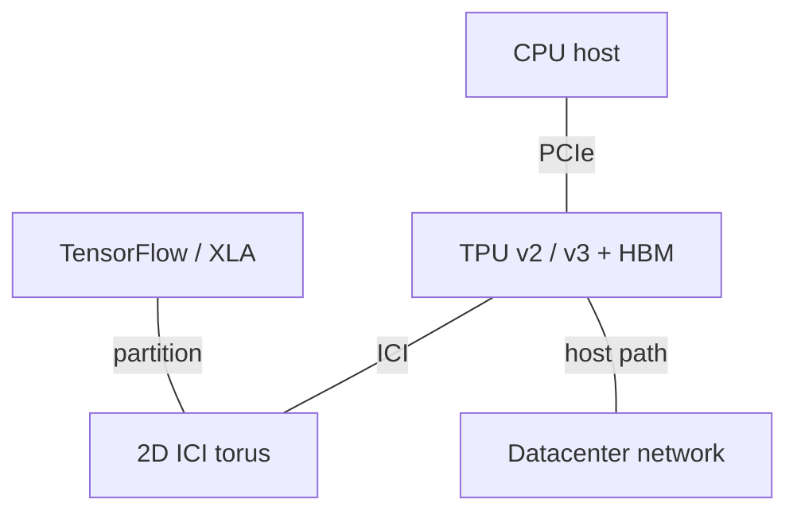
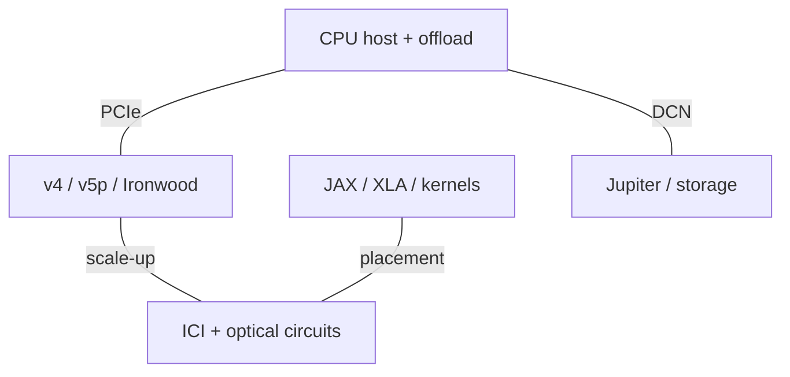
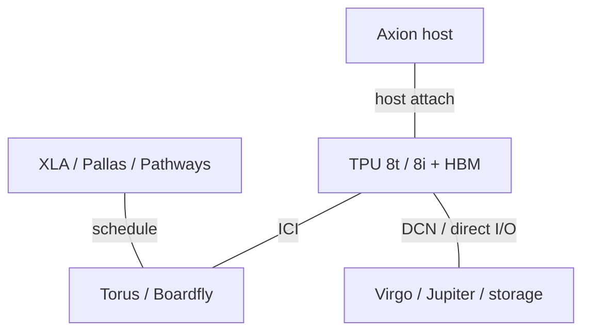

# Google AI Infrastructure Architecture Evolution

2015-2026 | 2026-09-28

## 01 Scope and executive synthesis

Coverage: TPU and ICI are deep; Axion, offload and datacenter networking are full at the publicly disclosed level; video acceleration is proportional. Period: 2015-28 September 2026. The latest architecture disclosures reviewed include Cloud Next 2026, the 2026 training-TPU retrospective, and the public Hot Chips 2026 program. Pixel Tensor and edge Coral are excluded. Availability refers to internal deployment or cloud service availability, explicitly distinguished below.

Google’s central architectural asset is continuity of the compiler-controlled tensor machine inside a changing system. The progression is from a latency-constrained inference coprocessor, to a distributed training computer, to workload-specific training and serving systems. Axion and Titanium extend that control to the host and infrastructure path. The important comparison with a GPU vendor is therefore the complete path from graph compilation to job placement, memory movement, collective communication and recovery, rather than matrix throughput alone.

## 02 Reading the specifications

All compute figures are per physical TPU package and dense unless stated otherwise; TFLOPS counts a multiply-add as two operations. Cloud names such as v3-8 count TensorCores, not eight physical chips. GB and GiB retain source units. HBM bandwidth is not bidirectional ICI bandwidth. Full pod footprint, usable allocation and maximum single-job slice can differ. A source’s first deployment date is not automatically public cloud GA. n/d means not established in the reviewed primary documents; n/a means not applicable.

## 03 Axion: bringing the host into the platform

The first Axion C4A service became generally available in October 2024 and uses Neoverse V2. N4A, generally available on 27 January 2026, uses the N3 core and targets flexible general-purpose VM shapes. These are distinct workload positions, not proof that every N-series core supersedes every C-series core. Published VM limits describe sold resources; they do not establish physical die core counts, memory channels or socket topology.

Architectural implication: a host can bottleneck AI without executing the main matrix workload. Tokenization, input preparation, dispatch and checkpoint movement consume CPU and I/O resources; infrastructure processing competes with those tasks unless offloaded. Titanium removes portions of networking and storage work from the application CPU. The eighth-generation TPU disclosure explicitly includes Axion hosts. This creates a co-design opportunity, but it does not establish coherent CPU-TPU shared physical memory or uniform access latency.

### Host CPU comparison

| Generation / reference SKU | Codename | GA | Status | Core µarch | Cores / threads | Process per die | Dies / packaging | L2 per core | L3 / domain | Memory: channels; rate; GB/s | Sockets / links | PCIe / CXL | TDP | Vector / matrix ISA |
| --- | --- | --- | --- | --- | --- | --- | --- | --- | --- | --- | --- | --- | --- | --- |
| Axion / C4A | n/d | 2024-10 | Shipping / available | Neoverse V2 | n/d physical; VM ≤72 vCPU | n/d | n/d | n/d | n/d | DDR5; channels/rate n/d | n/d | n/d | n/d | Arm64; SVE2 |
| Axion / N4A | n/d | 2026-01-27 | Shipping / available | Neoverse N3 | n/d physical; VM ≤64 vCPU | n/d | n/d | n/d | n/d | DDR5; VM ≤512 GB; peak n/d | n/d | n/d | n/d | Arm64 |

## 04 TPU v1 and the separate inference branch

TPU v1 entered internal service in 2015. Its integer systolic array, software-managed buffers and deterministic execution addressed inference under strict response-time limits. The ISCA 2017 paper is valuable because it connects the machine to production workload measurements, including utilization and memory constraints. A large arithmetic array cannot compensate for insufficient weight reuse; the 34 GB/s off-chip interface made that limitation concrete. Its DDR-based memory and lack of a training pod distinguish it sharply from later HBM systems.

TPU v4i is a distinct inference design, deployed in 2020 and documented at ISCA 2021. Its 7 nm implementation and enlarged on-chip storage reflect an effort to retain useful working sets while controlling serving power. It should not be folded into the training TPU v4 row. More generally, the i, e and p branches represent different optimization objectives; a later number is insufficient to infer which device is best for a particular latency, capacity or scaling requirement.

## 05 TPU v2-v4: from chip to training computer

TPU v2 introduced BF16 training, HBM and a two-dimensional ICI torus. TPU v3 expanded matrix resources and memory capacity and moved to liquid cooling. Hot Chips 2020 explains the architectural organization; the later training retrospective connects it to larger systems and resilience. The important implementation consequence is that more compute in the same generation of manufacturing did not remain a chip-only change: power delivery, cooling, network size and the compiler’s partitioning strategy had to evolve together.

TPU v4 combines stronger compute with SparseCore acceleration for embeddings and an optically reconfigurable interconnect. Optical circuit switches change physical connectivity at a coarse timescale; they are not packet switches executing each collective. Reconfiguration helps assemble healthy slices, vary topology and accommodate unavailable components. The 4,096-chip system is therefore also an availability architecture: at this scale, recovering usable capacity matters alongside reducing collective time. The ISCA 2023 paper supplies the explicit product link.

## 06 v5e, v5p and Trillium: two scaling objectives

TPU v5e is a cost-oriented training and inference platform with a smaller physical domain; v5p targets much larger training systems and more HBM per chip. Trillium (v6e) advances the efficiency branch with more compute and memory bandwidth. The e branch is not merely a partially disabled p chip: its domain size, memory budget and deployment economics should be evaluated on their own. For a model that fits in a small slice, paying for a much larger physical scale-up capability may yield little benefit.

The design question is the bottleneck after partitioning. Dense training can reuse weights enough to benefit from a larger MXU budget, whereas embedding traffic, small batches and decode expose memory and communication. A fair comparison holds model, precision, batch, latency objective and usable chip count constant. Comparing a complete v5p pod with a small Trillium slice answers a procurement-capacity question, not a per-chip architectural efficiency question.

## 07 Ironwood and the eighth-generation split

Ironwood/TPU7x introduces two compute chiplets with distinct local memory spaces. The package contains two TensorCores, four SparseCores and 192 GiB of HBM according to the cloud specification table. The compiler-visible locality differs from the earlier MegaCore abstraction. A larger package peak does not erase cross-chiplet movement: sharding and kernel placement now have an additional physical boundary to respect. The cloud documentation lists JAX and PyTorch support and explicitly excludes TensorFlow on TPU7x.

The April 2026 TPU 8 disclosure makes workload specialization explicit. TPU 8t retains a large torus for training; TPU 8i uses Boardfly for a smaller-diameter serving domain and adds a collective acceleration engine. The published 8i footprint is 1,152 chips, while the topology description separately states up to 1,024 active chips. These numbers must remain separate. Both products are recorded here as announced; the reviewed architectural announcement does not establish general availability.

Architectural interpretation: the split is evidence that domain size and network diameter have become independent product variables. A training system can tolerate more hops when long collective transfers amortize startup cost. Autoregressive inference repeatedly pays synchronization latency and may prefer fewer hops even with a smaller domain. More SRAM helps only the portion of the working set that actually fits; it does not imply that an arbitrary long-context KV cache resides entirely on chip.

## 08 Accelerator generation comparison

### TPU family

| Product | Architecture | GA / milestone | Status | Process | Dies / packaging | Compute units | Dense BF16 | Dense FP8 | Dense FP6 / FP4 | FP64 vector / matrix | Memory: type; stacks; GB; TB/s | LLC / SRAM | Scale-up: links; GB/s per direction; domain | Host link | Power / cooling | Form factor |
| --- | --- | --- | --- | --- | --- | --- | --- | --- | --- | --- | --- | --- | --- | --- | --- | --- |
| TPU v1 | INT8 systolic | 2015 Q2 | Historical shipping | 28 nm | 1 | 1 × 256×256 | n/a | n/a | n/a | n/d | DDR3; 8 GB; 0.034 TB/s | 28 MB | n/a | PCIe; n/d | 75 W chip TDP | Google platform |
| TPU v2 | TensorCore | 2017 Q3 | Historical shipping | 16 nm | 1 | 2 TC | 46 TFLOPS | n/a | n/a | n/d | HBM2; 16 GiB; 0.700 TB/s | 32 MiB | 2D torus; 256 chips; direction n/d | PCIe; n/d | 280 W chip TDP; air | Google platform |
| TPU v3 | TensorCore | 2018 Q4 | Historical shipping | 16 nm | 1 | 2 TC | 123 TFLOPS | n/a | n/a | n/d | HBM2; 4 stacks; 32 GiB; 0.900 TB/s | 32 MiB | 2D torus; 1,024 chips | PCIe; n/d | 450 W chip TDP; liquid | Google platform |
| TPU v4i | Inference | 2020 Q1 | Historical shipping | 7 nm | 1 | 1 TC; 4 MXU | 138 TFLOPS | n/a | n/a | n/d | HBM; 8 GB; 0.614 TB/s | 144 MB | 2 × 400 Gb/s; direction n/d | PCIe; n/d | 175 W chip TDP | Google platform |
| TPU v4 | TensorCore + SparseCore | 2021 deployment | Historical shipping | 7 nm | 1 | 2 TC; 4 SC | 275 TFLOPS | n/a | n/a | n/d | HBM2; 4 stacks; 32 GiB; 1.2 TB/s | 32 MiB | 6 × 50 GB/s/direction; 4,096 | PCIe; n/d | liquid; TDP n/d | Google platform |
| TPU v5e | Efficiency | 2023 | Shipping / available | n/d | n/d | 1 TC | 197 TFLOPS | n/d | n/a | n/d | HBM; stacks n/d; 16 GB; 0.819 TB/s | n/d | 256 chips; 400 GB/s bidirectional | PCIe; n/d | n/d | Google platform |
| TPU v5p | Performance | 2023 preview; GA n/d | Shipping / available | n/d | 1 | 2 TC; 4 SC | 459 TFLOPS | 459 TFLOPS | n/a | n/d | HBM2e; 6 stacks; 95 GiB usable; 2.765 TB/s | 128 MiB | 6 × 100 GB/s/direction; 8,960 | PCIe; n/d | liquid; TDP n/d | Google platform |
| TPU v6e | Trillium | 2024 | Shipping / available | n/d | n/d | 1 TC; 2 SC | 918 TFLOPS | 918 TFLOPS | n/a | n/d | HBM; stacks n/d; 32 GiB; 1.638 TB/s | n/d | 256 chips; 800 GB/s bidirectional | PCIe; n/d | n/d | Google platform |
| TPU7x | Ironwood | 2025 | Shipping / available | n/d | 2 compute chiplets | 2 TC; 4 SC | 2,307 TFLOPS | 4,614 TFLOPS | n/a | n/d | HBM3e; 8 stacks; 192 GiB; 7.380 TB/s | 128 MiB | 6 × 100 GB/s/direction; 9,216 | PCIe; n/d | liquid; TDP n/d | Google platform |
| TPU 8t | Training | 2026-04-22 | Announced; GA n/d | n/d | n/d | n/d | n/d | n/d | 12.6 PFLOPS FP4; dense basis n/d | n/d | 216 GB; 6.528 TB/s | 128 MB | 3D torus; 9,600 | PCIe; n/d | liquid; TDP n/d | Google platform |
| TPU 8i | Serving / CAE | 2026-04-22 | Announced; GA n/d | n/d | compute + CAE chiplet | 2 TC; 1 CAE | n/d | n/d | 10.1 PFLOPS FP4; dense basis n/d | n/d | 288 GB; 8.601 TB/s | 384 MB | Boardfly: 1,152 physical / ≤1,024 active | PCIe; n/d | liquid; TDP n/d | Google platform |

## 09 ICI, Jupiter, Virgo and infrastructure offload

ICI is the accelerator fabric; Jupiter is the datacenter network. The Jupiter Rising and Jupiter Evolving papers explain the progression from centrally controlled Clos fabrics to optical reconfiguration in the datacenter. These disclosures should not be conflated with the TPU’s local ICI topology. Virgo adds a training-oriented scale-out fabric in the TPU 8 era. A million-chip distributed training claim describes aggregation across systems, not a million-chip coherent memory domain or a single ICI pod.

Titanium is an infrastructure offload system, not a publicly documented merchant DPU SKU with a complete per-chip datasheet. Falcon describes a reliable hardware transport; a transport specification is not itself a Google-branded NIC product. The appropriate report boundary is to map the function and deployment path, retaining n/d for undisclosed silicon implementation. Argos video acceleration belongs alongside this portfolio because it shows the same workload-driven specialization at warehouse scale, but its video engines are not TPU tensor cores.

### Networking and offload roles

| Product | GA / milestone | Status | Class | Ports × speed | SerDes | Host interface | Programmable engine | Embedded CPU | On-card memory | Transport / RDMA | Congestion control | Key offloads | Power |
| --- | --- | --- | --- | --- | --- | --- | --- | --- | --- | --- | --- | --- | --- |
| Titanium | n/d | Shipping / available | Infrastructure offload | n/d | n/d | n/d | n/d | n/d | n/d | n/d | n/d | Networking/storage | n/d |
| Jupiter | n/d | Shipping / available | Datacenter fabric | n/d | n/d | n/d | n/d | n/d | n/d | Ethernet | n/d | Fabric control | n/d |
| Falcon | n/d | Shipping / available | Transport; not a NIC SKU | n/d | n/d | n/d | n/d | n/d | n/d | RDMA | n/d | Reliable transport | n/d |
| Virgo | n/d | Announced; GA n/d | AI scale-out fabric | n/d | n/d | n/d | n/d | n/d | n/d | n/d | n/d | Training fabric | n/d |

### ICI evolution

| Interconnect | Year / generation | Lane rate | Lanes / link | GB/s per link per direction | Links / device | Topology | Domain limit | Coherence / semantics |
| --- | --- | --- | --- | --- | --- | --- | --- | --- |
| ICI | v2 | n/d | n/d | n/d | n/d | 2D torus | 256 | Explicit collectives |
| ICI | v3 | n/d | n/d | n/d | n/d | 2D torus | 1024 | Explicit collectives |
| ICI | v4 | n/d | n/d | 50 | 6 | 3D torus / OCS | 4096 | Explicit collectives |
| ICI | Ironwood | n/d | n/d | 100 | 6 | 3D torus | 9216 | Explicit collectives |
| ICI / Boardfly | TPU8i | n/d | n/d | n/d | n/d | Boardfly | 1152 physical / ≤1024 active | Explicit collectives / CAE |

## 10 Software and integrated systems

XLA preserves a relatively stable programming contract while hardware changes. JAX expresses distributed computation; Pallas and Mosaic expose lower-level control for kernels whose data movement dominates. SparseCore and collective engines have value only when the software places and schedules work for them. Therefore portability and peak utilization are separate milestones: executing an unchanged model does not mean that its partitioning, fusion and scratchpad schedule exploit a new generation.

### Software evolution

| Release / layer | Date | Hardware | Capability |
| --- | --- | --- | --- |
| XLA / TensorFlow | 2017-2020 | v2-v3 | Graph compilation and placement |
| JAX / XLA | 2021-2026 | v4 onward | Distributed array programming |
| Pallas / Mosaic | 2025-2026 | Ironwood / TPU8 | Explicit kernel-level locality |
| Native PyTorch | 2026-04 | TPU8 stack | Preview at disclosure |

### 2017-2020: the training pod

Logical roles, not a physical wiring diagram.

### 2021-2025: reconfigurable scale

OCS changes connectivity; computation remains in the TPU.

### 2026: separate training and serving systems

Announced architecture; public GA is not inferred from this diagram.

### System domains

| Platform | Year / milestone | CPU / accelerator count | Scale-up domain | Scale-out per accelerator | Rack power | Cooling |
| --- | --- | --- | --- | --- | --- | --- |
| TPUv4 pod | 2021 | 4096 TPU chips | 4096 | n/d | n/d | Liquid |
| Ironwood pod | 2025 | 9216 TPU chips | 9216 | n/d | n/d | Liquid |
| TPU8t | 2026 announcement | 9600 TPU chips | 9600 | n/d | n/d | Liquid |
| TPU8i | 2026 announcement | 1152 physical / ≤1024 active | Boardfly | n/d | n/d | Liquid |

## 11 Bandwidth balance and architectural trade-offs

Derived ratios below use memory bandwidth divided by dense compute, in bytes/FLOP. Capacity divided by compute has units of byte-seconds/FLOP and is deliberately reported separately in the canonical data. v5p uses 95 GiB of usable cloud memory, while the retrospective describes 96 GiB physical capacity. Ironwood bandwidth is 7,380 GB/s in the current cloud table; the retrospective rounds it differently. These are source-basis differences, not additional hardware generations.

### Derived balance metrics

| Generation | HBM BW / BF16 | HBM BW / FP8 | One-way ICI / HBM | Performance / W |
| --- | --- | --- | --- | --- |
| v2 | 0.015217 | n/a | n/d | n/d: comparable power basis |
| v3 | 0.007317 | n/a | n/d | n/d: comparable power basis |
| v4 | 0.004364 | n/a | 0.250 | n/d: comparable power basis |
| v5p | 0.006024 | 0.006024 | 0.217 | n/d: comparable power basis |
| v6e | 0.001784 | 0.001784 | 0.244 | n/d: comparable power basis |
| v7 | 0.003199 | 0.001599 | 0.081 | n/d: comparable power basis |

Architectural interpretation: from v2 to Ironwood, BF16 compute grows about 50 times while HBM bandwidth grows about 10.5 times. The required reuse rises accordingly. Larger arrays shift responsibility toward compiler tiling, fusion and local storage. At system scale, optical reconfiguration trades a more complex control plane for improved slice assembly and fault accommodation. At the host boundary, direct I/O reduces copies but makes end-to-end scheduling and access protection more consequential. The practical evaluation should therefore include sustained throughput during communication, fault recovery time and the cost of recompiling or retuning models, not only isolated GEMM.

### Capacity and host balance

| Metric | Value / calculation | Basis |
| --- | --- | --- |
| TPUv4 HBM capacity/BF16 | 32×2^30/(275×10^12) = 1.249×10^-4 B·s/FLOP | Per chip; GiB converted to bytes |
| Ironwood HBM capacity/BF16 | 192×2^30/(2307×10^12) = 8.936×10^-5 B·s/FLOP | Per package; dense BF16 |
| Axion DDR/core; L3/core | n/d | Physical CPU specifications incomplete |

## 12 Conference-to-product index

### Verified disclosure map

| Venue | Year | Paper / talk / disclosure | Presenter / authors | Product | Evidence type | Source |
| --- | --- | --- | --- | --- | --- | --- |
| ISCA | 2017 | In-Datacenter Performance Analysis of a Tensor Processing Unit | Jouppi et al. | TPU v1 | Product architecture and measurements | C01 |
| ISCA | 2021 | Ten Lessons From Three Generations Shaped Google’s TPUv4i | Jouppi et al. | TPU v4i | Product implementation and serving | C02 |
| ISCA | 2023 | TPU v4: An Optically Reconfigurable Supercomputer | Jouppi et al. | TPU v4 | Architecture / system | C03 |
| Hot Chips | 2020 | Google training chips TPUv2 and TPUv3 | Norrie / Patil | v2-v3 | Architecture | C04 |
| IEEE Micro | 2026 | Google’s Training Supercomputers from TPU v2 to Ironwood | Google authors | v2-v7 | Implementation / system retrospective | C05 |
| SIGCOMM | 2015 / 2022 | Jupiter Rising / Jupiter Evolving | Google authors | Jupiter | Network systems | C06 C07 |
| ASPLOS | 2021 | Warehouse-Scale Video Acceleration | Ranganathan et al. | Argos | Product co-design | C08 |
| Cloud Next | 2026 | TPU 8t / 8i architecture | Gupta / Mugazambi | TPU8 | Product announcement | P08 |
| Hot Chips | 2026 | The Eighth Generation TPU Family | Google | TPU8 | Program verified; not recording analysis | C09 |

ISCA, ASPLOS, Hot Chips and IEEE Micro provide direct product disclosures in the selected corpus. MICRO and HPCA research should be included only when a documented product connection exists; none is asserted here. An ISSCC/JSSC circuit-paper-to-TPU mapping was not established in this pass, so circuit parameters are drawn from the identified product papers rather than attributed to ISSCC. Cloud Next and OCP are useful for launches and systems; MWC, Computex, GTC and other cloud events do not automatically add independent evidence for Google-owned silicon.

### ISSCC context and implementation topics

| Venue | Year | Paper / talk / disclosure | Presenter / authors | Product | Evidence type | Source |
| --- | --- | --- | --- | --- | --- | --- |
| ISSCC plenary | 2018 | 50 Years of Computer Architecture: From Mainframe CPUs to Neural-Network TPUs | David Patterson | TPU / domain specialization | Official plenary record | C10 |
| ISSCC plenary | 2020 | The Deep Learning Revolution and Its Implications for Computer Architecture and Chip Design | Jeff Dean | TPU / chip-design context | Author companion paper and official record | C11 C10 |
| ISSCC Forum 3 | 2026 | Power Delivery Trends and Demands in Data-Center AI Processors | Houle Gan | Google datacenter processors | Official program; not a per-generation circuit datasheet | C12 |

ISSCC contributes both the domain-specialization rationale and a power-delivery implementation perspective. The 2026 forum entry establishes Google’s participation in that engineering discussion, but does not by itself reveal a particular TPU voltage-regulator circuit. These records complement the ISCA product papers and Hot Chips architecture disclosures rather than replacing them with inferred circuit specifications.

## 13 Naming crosswalk and remaining disclosure gaps

### Names and boundaries

| Name | Maps to | Boundary |
| --- | --- | --- |
| Trillium | TPU v6e | Efficiency branch |
| Ironwood | TPU7x | Family name vs cloud configuration |
| Axion | C4A / N4A | CPU brand vs VM series |
| TPU v4i | Inference TPU | Not training TPU v4 |
| TPU 8t / 8i | Training / serving | Separate architecture objectives |

The largest unresolved implementation fields are the physical Axion package organization, exact TDP and per-die process information for recent TPUs, and complete link electrical parameters. These gaps limit package-level power and area comparisons but do not prevent analysis of the disclosed memory and network hierarchy. The next useful evidence would be a circuit-level implementation paper, a complete TPU 8 service specification, and measured software behavior across Ironwood’s chiplet boundary.

## Source map

01 Scope and executive synthesis — C01, C03, C05, C09, P08, P10

02 Reading the specifications — C02, P07, P09

03 Axion: bringing the host into the platform — E01, P08, P10, P11

04 TPU v1 and the separate inference branch — C01, C02

05 TPU v2-v4: from chip to training computer — C03, C04, C05

06 v5e, v5p and Trillium: two scaling objectives — P04, P05, P06

07 Ironwood and the eighth-generation split — E03, P07, P08, P13

08 Accelerator generation comparison — C01, C02, C03, C04, C05, E02, E03, P04, P05, P06, P07, P08

09 ICI, Jupiter, Virgo and infrastructure offload — C03, C04, C05, C06, C07, C08, E05, P07, P08, P10, P14

10 Software and integrated systems — C03, C04, C05, P07, P08, P13

11 Bandwidth balance and architectural trade-offs — C03, C04, C05, P05, P07, P08, P10

12 Conference-to-product index — C01, C02, C03, C04, C05, C06, C07, C08, C09, C10, C11, C12, P08

13 Naming crosswalk and remaining disclosure gaps — C02, P06, P07, P08, P10

## References

### Product and technical documentation

[P04] Cloud TPU v5e. [https://docs.cloud.google.com/tpu/docs/v5e](https://docs.cloud.google.com/tpu/docs/v5e). Indexed record or searchable official page; product details cross-checked with the associated technical document.

[P05] Cloud TPU v5p. [https://docs.cloud.google.com/tpu/docs/v5p](https://docs.cloud.google.com/tpu/docs/v5p). Indexed record or searchable official page; product details cross-checked with the associated technical document.

[P06] Cloud TPU v6e (Trillium). [https://docs.cloud.google.com/tpu/docs/v6e](https://docs.cloud.google.com/tpu/docs/v6e). Indexed record or searchable official page; product details cross-checked with the associated technical document.

[P07] TPU7x (Ironwood). [https://docs.cloud.google.com/tpu/docs/tpu7x](https://docs.cloud.google.com/tpu/docs/tpu7x). Indexed record or searchable official page; product details cross-checked with the associated technical document.

[P08] Inside the eighth-generation TPU: An architecture deep dive. [https://cloud.google.com/blog/products/compute/tpu-8t-and-tpu-8i-technical-deep-dive](https://cloud.google.com/blog/products/compute/tpu-8t-and-tpu-8i-technical-deep-dive). Indexed record or searchable official page; product details cross-checked with the associated technical document.

[P09] TPU architecture. [https://docs.cloud.google.com/tpu/docs/system-architecture-tpu-vm](https://docs.cloud.google.com/tpu/docs/system-architecture-tpu-vm). Indexed record or searchable official page; product details cross-checked with the associated technical document.

[P10] Axion N4A generally available. [https://cloud.google.com/blog/products/compute/axion-based-n4a-vms-now-in-preview](https://cloud.google.com/blog/products/compute/axion-based-n4a-vms-now-in-preview). Indexed record or searchable official page; product details cross-checked with the associated technical document.

[P11] Arm VMs on Compute. [https://docs.cloud.google.com/compute/docs/instances/arm-on-compute](https://docs.cloud.google.com/compute/docs/instances/arm-on-compute). Indexed record or searchable official page; product details cross-checked with the associated technical document.

[P13] Inside the Ironwood codesigned AI stack. [https://cloud.google.com/blog/products/compute/inside-the-ironwood-tpu-codesigned-ai-stack](https://cloud.google.com/blog/products/compute/inside-the-ironwood-tpu-codesigned-ai-stack). Indexed record or searchable official page; product details cross-checked with the associated technical document.

[P14] Falcon RDMA network profiles. [https://docs.cloud.google.com/vpc/docs/rdma-network-profiles](https://docs.cloud.google.com/vpc/docs/rdma-network-profiles). Indexed record or searchable official page; product details cross-checked with the associated technical document.

### Conference records and implementation disclosures

[C01] In-Datacenter Performance Analysis of a Tensor Processing Unit, ISCA 2017. [https://arxiv.org/pdf/1704.04760](https://arxiv.org/pdf/1704.04760). Primary source; accessed by 2026-09-28

[C02] Ten Lessons From Three Generations Shaped Google’s TPUv4i, ISCA 2021. [https://markgottscho.com/cv/papers/2021_NJouppi_ISCA.pdf](https://markgottscho.com/cv/papers/2021_NJouppi_ISCA.pdf). Primary source; accessed by 2026-09-28

[C03] TPU v4, ISCA 2023. [https://arxiv.org/pdf/2304.01433](https://arxiv.org/pdf/2304.01433). Primary source; accessed by 2026-09-28

[C04] Google training chips TPUv2 and TPUv3, Hot Chips 2020. [https://www.hc32.hotchips.org/assets/program/conference/day2/HotChips2020_ML_Training_Google_Norrie_Patil.v01.pdf](https://www.hc32.hotchips.org/assets/program/conference/day2/HotChips2020_ML_Training_Google_Norrie_Patil.v01.pdf). Primary source; accessed by 2026-09-28

[C05] Google’s Training Supercomputers from TPU v2 to Ironwood, IEEE Micro 2026. [https://arxiv.org/pdf/2606.15870](https://arxiv.org/pdf/2606.15870). Primary source; accessed by 2026-09-28

[C06] Jupiter Rising, SIGCOMM 2015. [https://research.google/pubs/jupiter-rising-a-decade-of-clos-topologies-and-centralized-control-in-googles-datacenter-network/](https://research.google/pubs/jupiter-rising-a-decade-of-clos-topologies-and-centralized-control-in-googles-datacenter-network/). Primary source; accessed by 2026-09-28

[C07] Jupiter Evolving, SIGCOMM 2022. [https://research.google/pubs/jupiter-evolving-transforming-googles-datacenter-network-via-optical-circuit-switches-and-software-defined-networking/](https://research.google/pubs/jupiter-evolving-transforming-googles-datacenter-network-via-optical-circuit-switches-and-software-defined-networking/). Primary source; accessed by 2026-09-28

[C08] Warehouse-Scale Video Acceleration, ASPLOS 2021. [https://research.google/pubs/warehouse-scale-video-acceleration-co-design-and-deployment-in-the-wild/](https://research.google/pubs/warehouse-scale-video-acceleration-co-design-and-deployment-in-the-wild/). Primary source; accessed by 2026-09-28

[C09] Hot Chips 2026 conference program. [https://hc2026.hotchips.org/program/conference/](https://hc2026.hotchips.org/program/conference/). Official indexed record or related announcement; full document download unavailable.

[C10] ISSCC plenary archive: Patterson2018 / Dean2020. [https://www.isscc.org/isscc-plenary-videos](https://www.isscc.org/isscc-plenary-videos). Indexed record or searchable official page; product details cross-checked with the associated technical document.

[C11] Dean ISSCC2020 companion paper. [https://arxiv.org/abs/1911.05289](https://arxiv.org/abs/1911.05289). Indexed record or searchable official page; product details cross-checked with the associated technical document.

[C12] ISSCC2026 Forum3: Google power delivery. [https://submissions.mirasmart.com/ISSCC2026/PDF/ISSCC2026AdvanceProgram.pdf](https://submissions.mirasmart.com/ISSCC2026/PDF/ISSCC2026AdvanceProgram.pdf). Indexed record or searchable official page; product details cross-checked with the associated technical document.

### Launches, ecosystem and deployment

[E01] First Axion C4A generally available. [https://cloud.google.com/blog/products/compute/first-google-axion-processor-c4a-now-ga-with-titanium-ssd/](https://cloud.google.com/blog/products/compute/first-google-axion-processor-c4a-now-ga-with-titanium-ssd/). Indexed record or searchable official page; product details cross-checked with the associated technical document.

[E02] Ironwood and Axion portfolio, November 2025. [https://cloud.google.com/blog/products/compute/ironwood-tpus-and-new-axion-based-vms-for-your-ai-workloads](https://cloud.google.com/blog/products/compute/ironwood-tpus-and-new-axion-based-vms-for-your-ai-workloads). Indexed record or searchable official page; product details cross-checked with the associated technical document.

[E03] Two chips for the agentic era, Cloud Next 2026. [https://blog.google/innovation-and-ai/infrastructure-and-cloud/google-cloud/eighth-generation-tpu-agentic-era/](https://blog.google/innovation-and-ai/infrastructure-and-cloud/google-cloud/eighth-generation-tpu-agentic-era/). Primary source; accessed by 2026-09-28

[E05] Data center and global networks built for the AI era. [https://cloud.google.com/blog/products/networking/data-center-and-global-networks-built-for-ai-era](https://cloud.google.com/blog/products/networking/data-center-and-global-networks-built-for-ai-era). Indexed record or searchable official page; product details cross-checked with the associated technical document.
