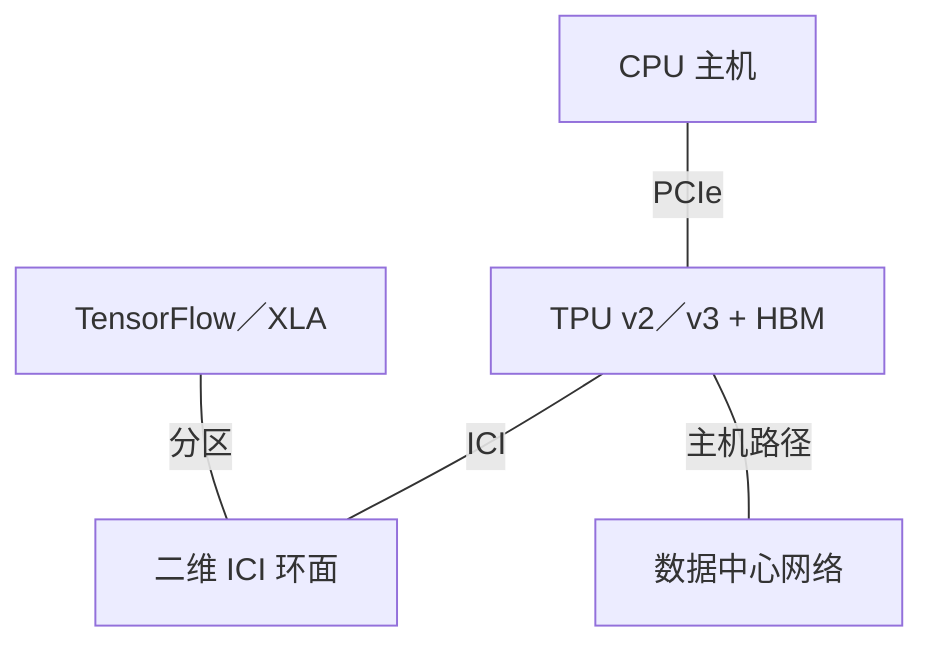
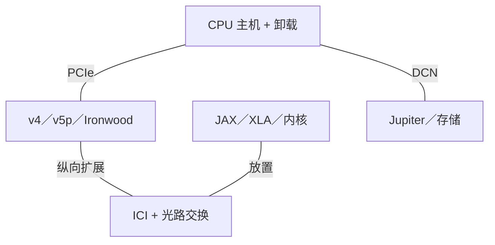
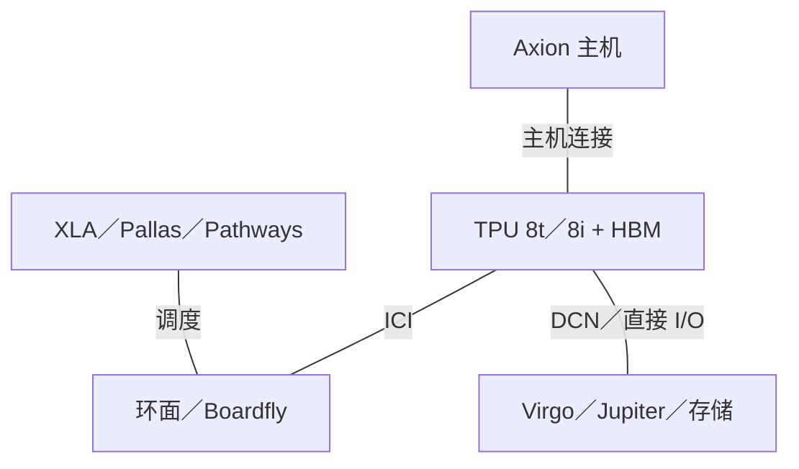

# Google AI 基础设施架构演进

2015-2026 | 2026-09-28

## 01 范围与核心判断

覆盖范围：深入分析 TPU 与 ICI；按公开披露深度完整覆盖 Axion、基础设施卸载及数据中心网络；按相关性覆盖视频加速。时间范围：2015 年至 2026 年 9 月 28 日。已审阅的最新架构资料包括 Cloud Next 2026、2026 年训练 TPU 回顾论文及 Hot Chips 2026 公开议程。不覆盖 Pixel Tensor 与边缘 Coral。下文分别标明内部部署与云服务正式商用。

Google 的核心架构资产，是在持续变化的系统中保持编译器控制的张量计算模型。其演进从受延迟约束的推理协处理器，走向分布式训练计算机，再走向按训练与服务负载优化的系统。Axion 和 Titanium 把这种控制延伸至主机和基础设施路径。因此，与 GPU 厂商比较时，应考察从图编译到作业放置、数据搬移、集合通信和故障恢复的完整路径，而不只是矩阵算力。

## 02 规格口径

算力均以物理 TPU 封装为单位，除非另有说明均为稠密值；乘加按两次运算计。v3-8 等云端名称计算的是 TensorCore 数量，不能理解为八颗物理芯片。GB 与 GiB 保留原始资料口径。HBM 带宽与 ICI 双向带宽不同。完整 Pod 的物理规模、可用分配规模和单作业最大切片可能不同。首次内部部署时间不自动等于云端正式商用时间。n/d 表示已审阅一手资料未确定，n/a 表示不适用。

## 03 Axion：把主机纳入平台

第一代 Axion C4A 服务于 2024 年 10 月正式商用，采用 Neoverse V2。N4A 于 2026 年 1 月 27 日正式商用，采用 N3 核心，侧重灵活的通用虚拟机配置。两者体现不同的负载定位，不能理解为所有 N 系列核心都全面替代 C 系列核心。公开虚拟机上限描述可购买的资源，并不直接确定物理裸片核心数、内存通道数或插槽拓扑。

架构含义：即使不执行主要矩阵计算，主机仍可能限制 AI 系统。分词、输入准备、任务提交和检查点搬移均消耗 CPU 与 I/O；基础设施处理若不卸载，就会与这些任务竞争资源。Titanium 把部分网络和存储处理移出应用 CPU。第八代 TPU 披露明确采用 Axion 主机。这提供了协同设计机会，但不意味着 CPU 与 TPU 具有一致性共享物理内存或均匀访存延迟。

### 主机 CPU 对照

| 代际／参考 SKU | 代号 | 正式商用 | 状态 | 核心微架构 | 核心／线程 | 各裸片工艺 | 裸片／封装 | 每核 L2 | L3／共享域 | 内存：通道；速率；GB/s | 插槽／互联 | PCIe／CXL | TDP | 向量／矩阵 ISA |
| --- | --- | --- | --- | --- | --- | --- | --- | --- | --- | --- | --- | --- | --- | --- |
| Axion / C4A | n/d | 2024-10 | 已商用／可获取 | Neoverse V2 | 物理 n/d；VM ≤72 vCPU | n/d | n/d | n/d | n/d | DDR5；通道／速率 n/d | n/d | n/d | n/d | Arm64; SVE2 |
| Axion / N4A | n/d | 2026-01-27 | 已商用／可获取 | Neoverse N3 | 物理 n/d；VM ≤64 vCPU | n/d | n/d | n/d | n/d | DDR5；VM ≤512 GB；峰值 n/d | n/d | n/d | n/d | Arm64 |

## 04 TPU v1 与独立推理分支

TPU v1 于 2015 年投入内部服务。整数脉动阵列、软件管理缓冲区和确定性执行，服务于严格响应时间限制下的推理。ISCA 2017 论文的价值在于把机器结构与生产负载测量相连，包括利用率和存储约束。算术阵列再大，也无法补偿不足的权重复用；34 GB/s 片外接口使这个限制十分具体。DDR 存储和缺少训练 Pod，使其明显区别于后续 HBM 系统。

TPU v4i 是独立的推理设计，于 2020 年部署，在 ISCA 2021 披露。7 nm 实现与扩大的片上存储，体现了在控制服务功耗的同时保留有效工作集的设计目标。它不能合并到训练 TPU v4 的规格行中。更一般地，i、e、p 分支代表不同优化目标；仅凭代号较新，无法判断哪款设备更适合特定延迟、容量或扩展要求。

## 05 TPU v2-v4：从芯片走向训练计算机

TPU v2 引入 BF16 训练、HBM 和二维 ICI 环面。TPU v3 扩大矩阵资源及内存容量，并转向液冷。Hot Chips 2020 解释了架构组织，后续训练系统回顾论文进一步连接到更大系统及可靠性。关键实现后果是：在同一制造工艺代际中增加算力，并不只是芯片变化；供电、散热、网络规模和编译器分区策略都必须共同演进。

TPU v4 将更强计算、面向嵌入表的 SparseCore 与可光学重构的互联结合。光路交换机在较粗时间尺度上改变物理连接，并不是为每个集合操作逐包转发的交换机。重构可帮助组成健康切片、调整拓扑，并绕过不可用组件。因此，4,096 芯片系统也是一种可用性架构：在这种规模下，恢复可用容量与减少集合通信时间同样重要。ISCA 2023 论文给出了明确的产品对应关系。

## 06 v5e、v5p 与 Trillium：两种扩展目标

TPU v5e 是侧重成本的训练和推理平台，物理域较小；v5p 面向更大型训练系统，单芯片 HBM 更多。Trillium（v6e）继续推进效率分支，增加计算与存储带宽。e 分支不能简单理解为屏蔽部分资源的 p 芯片：其域规模、内存预算和部署经济性应独立评价。若模型能放入较小切片，为更大物理纵向扩展能力付费，未必带来相应收益。

设计问题在于分区之后的瓶颈。稠密训练可能通过权重复用充分利用更多 MXU，而嵌入表流量、小批量和解码更容易暴露存储及通信限制。公平比较应固定模型、精度、批量、延迟目标和可用芯片数。把完整 v5p Pod 与较小 Trillium 切片比较，回答的是采购容量问题，并非单芯片架构效率问题。

## 07 Ironwood 与第八代分化

Ironwood／TPU7x 引入两颗计算芯粒，各有本地内存空间。云端规格表给出的封装配置为两个 TensorCore、四个 SparseCore 和 192 GiB HBM。编译器可见的局部性与此前 MegaCore 抽象不同。更高封装算力不能消除跨芯粒搬移；分片与内核放置必须考虑新增的物理边界。云端文档列出 JAX 和 PyTorch 支持，并明确说明 TPU7x 不支持 TensorFlow。

2026 年 4 月的 TPU 8 披露明确采用负载专用化。TPU 8t 为训练保留大规模环面；TPU 8i 使用 Boardfly 降低服务域的网络直径，并加入集合通信加速引擎。8i 公布的物理规模是 1,152 芯片，拓扑说明另外指出最多 1,024 个活跃芯片，两者必须分开记录。本报告把两款产品列为已公布；已审阅的架构发布资料不足以确定正式商用。

架构解读：这种分化说明域规模与网络直径已成为独立的产品变量。训练系统的长集合传输可摊薄启动开销，因此可以接受更多跳数。自回归推理反复支付同步延迟，可能宁愿采用规模较小但跳数更少的域。更多 SRAM 只帮助真正能放入其中的工作集，不能推导出任意长上下文 KV 缓存都能驻留片上。

## 08 加速器代际对照

### TPU 家族

| 产品 | 架构 | 商用／里程碑 | 状态 | 工艺 | 裸片／封装 | 计算单元 | 稠密 BF16 | 稠密 FP8 | 稠密 FP6／FP4 | FP64 向量／矩阵 | 内存：类型；堆栈；GB；TB/s | 末级缓存／SRAM | 纵向扩展：链路；单向 GB/s；域 | 主机连接 | 功耗／散热 | 形态 |
| --- | --- | --- | --- | --- | --- | --- | --- | --- | --- | --- | --- | --- | --- | --- | --- | --- |
| TPU v1 | INT8 systolic | 2015 Q2 | 历史已商用 | 28 nm | 1 | 1 × 256×256 | n/a | n/a | n/a | n/d | DDR3; 8 GB; 0.034 TB/s | 28 MB | n/a | PCIe; n/d | 75 W 芯片 TDP | Google 平台 |
| TPU v2 | TensorCore | 2017 Q3 | 历史已商用 | 16 nm | 1 | 2 TC | 46 TFLOPS | n/a | n/a | n/d | HBM2; 16 GiB; 0.700 TB/s | 32 MiB | 二维环面；256 芯片；方向 n/d | PCIe; n/d | 280 W 芯片 TDP; 风冷 | Google 平台 |
| TPU v3 | TensorCore | 2018 Q4 | 历史已商用 | 16 nm | 1 | 2 TC | 123 TFLOPS | n/a | n/a | n/d | HBM2; 4 堆栈; 32 GiB; 0.900 TB/s | 32 MiB | 二维环面；1,024 芯片 | PCIe; n/d | 450 W 芯片 TDP; 液冷 | Google 平台 |
| TPU v4i | 推理 | 2020 Q1 | 历史已商用 | 7 nm | 1 | 1 TC; 4 MXU | 138 TFLOPS | n/a | n/a | n/d | HBM; 8 GB; 0.614 TB/s | 144 MB | 2 × 400 Gb/s；方向 n/d | PCIe; n/d | 175 W 芯片 TDP | Google 平台 |
| TPU v4 | TensorCore + SparseCore | 2021 部署 | 历史已商用 | 7 nm | 1 | 2 TC; 4 SC | 275 TFLOPS | n/a | n/a | n/d | HBM2; 4 堆栈; 32 GiB; 1.2 TB/s | 32 MiB | 6 × 50 GB/s/direction; 4,096 | PCIe; n/d | 液冷; TDP n/d | Google 平台 |
| TPU v5e | 效率 | 2023 | 已商用／可获取 | n/d | n/d | 1 TC | 197 TFLOPS | n/d | n/a | n/d | HBM; 堆栈 n/d; 16 GB; 0.819 TB/s | n/d | 256 芯片; 400 GB/s 双向 | PCIe; n/d | n/d | Google 平台 |
| TPU v5p | 性能 | 2023 预览; GA n/d | 已商用／可获取 | n/d | 1 | 2 TC; 4 SC | 459 TFLOPS | 459 TFLOPS | n/a | n/d | HBM2e; 6 堆栈; 95 GiB 可用; 2.765 TB/s | 128 MiB | 6 × 100 GB/s/direction; 8,960 | PCIe; n/d | 液冷; TDP n/d | Google 平台 |
| TPU v6e | Trillium | 2024 | 已商用／可获取 | n/d | n/d | 1 TC; 2 SC | 918 TFLOPS | 918 TFLOPS | n/a | n/d | HBM; 堆栈 n/d; 32 GiB; 1.638 TB/s | n/d | 256 芯片; 800 GB/s 双向 | PCIe; n/d | n/d | Google 平台 |
| TPU7x | Ironwood | 2025 | 已商用／可获取 | n/d | 2 颗计算芯粒 | 2 TC; 4 SC | 2,307 TFLOPS | 4,614 TFLOPS | n/a | n/d | HBM3e; 8 堆栈; 192 GiB; 7.380 TB/s | 128 MiB | 6 × 100 GB/s/direction; 9,216 | PCIe; n/d | 液冷; TDP n/d | Google 平台 |
| TPU 8t | 训练 | 2026-04-22 | 已公布；GA n/d | n/d | n/d | n/d | n/d | n/d | 12.6 PFLOPS FP4；稠密口径 n/d | n/d | 216 GB; 6.528 TB/s | 128 MB | 三维环面; 9,600 | PCIe; n/d | 液冷; TDP n/d | Google 平台 |
| TPU 8i | 推理服务 / CAE | 2026-04-22 | 已公布；GA n/d | n/d | 计算 + CAE 芯粒 | 2 TC; 1 CAE | n/d | n/d | 10.1 PFLOPS FP4；稠密口径 n/d | n/d | 288 GB; 8.601 TB/s | 384 MB | Boardfly：1,152 物理／≤1,024 活跃 | PCIe; n/d | 液冷; TDP n/d | Google 平台 |

## 09 ICI、Jupiter、Virgo 与基础设施卸载

ICI 是加速器网络，Jupiter 是数据中心网络。Jupiter Rising 与 Jupiter Evolving 论文解释了从集中控制的 Clos 网络走向数据中心光学重构的过程，不能与 TPU 本地 ICI 拓扑混为一谈。TPU 8 时代的 Virgo 增加了面向训练的横向扩展网络。百万芯片分布式训练的表述指跨系统聚合，不是百万芯片的一致性内存域或单个 ICI Pod。

Titanium 是基础设施卸载系统，不是具有完整单芯片数据表的公开商用 DPU SKU。Falcon 描述可靠硬件传输机制；传输规范本身不是 Google 品牌网卡产品。报告应映射功能和部署路径，对未披露的芯片实现保留 n/d。Argos 视频加速也应列入产品组合，因为它展示了相同的仓库级负载专用化思路，但视频引擎不等于 TPU 张量核心。

### 网络及卸载角色

| 产品 | 商用／里程碑 | 状态 | 类别 | 端口×速率 | SerDes | 主机接口 | 可编程引擎 | 嵌入式 CPU | 板载内存 | 传输／RDMA | 拥塞控制 | 主要卸载 | 功耗 |
| --- | --- | --- | --- | --- | --- | --- | --- | --- | --- | --- | --- | --- | --- |
| Titanium | n/d | 已商用／可获取 | 基础设施卸载 | n/d | n/d | n/d | n/d | n/d | n/d | n/d | n/d | 网络／存储 | n/d |
| Jupiter | n/d | 已商用／可获取 | 数据中心网络 | n/d | n/d | n/d | n/d | n/d | n/d | Ethernet | n/d | 网络控制 | n/d |
| Falcon | n/d | 已商用／可获取 | 传输；非网卡 SKU | n/d | n/d | n/d | n/d | n/d | n/d | RDMA | n/d | 可靠传输 | n/d |
| Virgo | n/d | 已公布；GA n/d | AI 横向扩展网络 | n/d | n/d | n/d | n/d | n/d | n/d | n/d | n/d | 训练网络 | n/d |

### ICI 演进

| 互联 | 年份／代际 | 通道速率 | 每链路通道 | 每链路单向 GB/s | 每设备链路 | 拓扑 | 域规模 | 一致性／语义 |
| --- | --- | --- | --- | --- | --- | --- | --- | --- |
| ICI | v2 | n/d | n/d | n/d | n/d | 二维环面 | 256 | 显式集合通信 |
| ICI | v3 | n/d | n/d | n/d | n/d | 二维环面 | 1024 | 显式集合通信 |
| ICI | v4 | n/d | n/d | 50 | 6 | 三维环面 / OCS | 4096 | 显式集合通信 |
| ICI | Ironwood | n/d | n/d | 100 | 6 | 三维环面 | 9216 | 显式集合通信 |
| ICI / Boardfly | TPU8i | n/d | n/d | n/d | n/d | Boardfly | 1152 物理 / ≤1024 启用 | 显式集合通信 / CAE |

## 10 软件与集成系统

XLA 在硬件变化时保持相对稳定的编程契约。JAX 表达分布式计算；Pallas 和 Mosaic 为数据搬移占主导的内核提供更低层控制。只有软件能够放置并调度相应工作时，SparseCore 与集合引擎才有价值。因此，可移植性与峰值利用率是两个不同里程碑：模型无修改地运行，并不说明其分区、融合和暂存区调度已发挥新一代硬件能力。

### 软件演进

| 版本／层 | 日期 | 硬件 | 能力 |
| --- | --- | --- | --- |
| XLA / TensorFlow | 2017-2020 | v2-v3 | 图编译与放置 |
| JAX / XLA | 2021-2026 | v4 起 | 分布式数组编程 |
| Pallas / Mosaic | 2025-2026 | Ironwood / TPU8 | 内核级显式局部性 |
| Native PyTorch | 2026-04 | TPU8 stack | 披露时为预览 |

### 2017-2020：训练 Pod

逻辑角色图，并非物理布线图。

### 2021-2025：可重构扩展

OCS 改变连接，计算仍在 TPU 中执行。

### 2026：训练与服务系统分化

已公布架构；本图不推定已正式商用。

### 系统域

| 平台 | 年份／里程碑 | CPU／加速器数量 | 纵向扩展域 | 每加速器横向带宽 | 机架功耗 | 散热 |
| --- | --- | --- | --- | --- | --- | --- |
| TPUv4 pod | 2021 | 4096 TPU 芯片 | 4096 | n/d | n/d | 液冷 |
| Ironwood pod | 2025 | 9216 TPU 芯片 | 9216 | n/d | n/d | 液冷 |
| TPU8t | 2026 发布 | 9600 TPU 芯片 | 9600 | n/d | n/d | 液冷 |
| TPU8i | 2026 发布 | 1152 物理 / ≤1024 启用 | Boardfly | n/d | n/d | 液冷 |

## 11 带宽平衡与架构取舍

以下推导比值用存储带宽除以稠密算力，单位为 byte/FLOP。容量除以算力的单位是 byte·s/FLOP，在规范数据中单独记录。v5p 使用云端可用容量 95 GiB，而回顾论文给出物理容量 96 GiB。当前云端表中的 Ironwood 带宽为 7,380 GB/s，回顾论文采用不同舍入口径。这些是资料口径差异，不是新的硬件代际。

### 推导平衡指标

| 代际 | HBM 带宽／BF16 | HBM 带宽／FP8 | 单向 ICI／HBM | 性能／W |
| --- | --- | --- | --- | --- |
| v2 | 0.015217 | n/a | n/d | n/d：缺少可比功耗口径 |
| v3 | 0.007317 | n/a | n/d | n/d：缺少可比功耗口径 |
| v4 | 0.004364 | n/a | 0.250 | n/d：缺少可比功耗口径 |
| v5p | 0.006024 | 0.006024 | 0.217 | n/d：缺少可比功耗口径 |
| v6e | 0.001784 | 0.001784 | 0.244 | n/d：缺少可比功耗口径 |
| v7 | 0.003199 | 0.001599 | 0.081 | n/d：缺少可比功耗口径 |

架构解读：从 v2 到 Ironwood，BF16 算力约增长 50 倍，HBM 带宽约增长 10.5 倍，所需数据复用程度相应提高。更大阵列把更多责任交给编译器分块、融合及本地存储。在系统层面，光学重构以更复杂控制平面换取切片组装和故障容纳能力。在主机边界，直接 I/O 减少复制，却提高了端到端调度及访问保护的重要性。因此，实际评估应包含通信并发下的持续吞吐、故障恢复时间，以及重编译或调优模型的成本，而不只是独立 GEMM。

### 容量与主机平衡

| 指标 | 数值／计算 | 口径 |
| --- | --- | --- |
| TPUv4 HBM 容量/BF16 | 32×2^30/(275×10^12) = 1.249×10^-4 B·s/FLOP | 每芯片；GiB 换算为字节 |
| Ironwood HBM 容量/BF16 | 192×2^30/(2307×10^12) = 8.936×10^-5 B·s/FLOP | 每封装；稠密 BF16 |
| Axion DDR/核心; L3/核心 | n/d | 物理 CPU 规格不完整 |

## 12 会议与产品索引

### 已核实披露映射

| 会议／活动 | 年份 | 论文／演讲／披露 | 报告人／作者 | 产品 | 证据类型 | 来源 |
| --- | --- | --- | --- | --- | --- | --- |
| ISCA | 2017 | In-Datacenter 性能 Analysis of a Tensor Processing Unit | Jouppi et al. | TPU v1 | 产品架构与测量 | C01 |
| ISCA | 2021 | Ten Lessons From Three Generations Shaped Google’s TPUv4i | Jouppi et al. | TPU v4i | 产品实现与推理服务 | C02 |
| ISCA | 2023 | TPU v4: An Optically Reconfigurable Supercomputer | Jouppi et al. | TPU v4 | 架构／系统 | C03 |
| Hot Chips | 2020 | Google 训练 芯片 TPUv2 and TPUv3 | Norrie / Patil | v2-v3 | 架构 | C04 |
| IEEE Micro | 2026 | Google’s 训练 Supercomputers from TPU v2 to Ironwood | Google authors | v2-v7 | 实现／系统回顾 | C05 |
| SIGCOMM | 2015 / 2022 | Jupiter Rising / Jupiter Evolving | Google authors | Jupiter | 网络系统 | C06 C07 |
| ASPLOS | 2021 | Warehouse-Scale Video Acceleration | Ranganathan et al. | Argos | 产品协同设计 | C08 |
| Cloud Next | 2026 | TPU 8t / 8i architecture | Gupta / Mugazambi | TPU8 | 产品发布 | P08 |
| Hot Chips | 2026 | The Eighth Generation TPU Family | Google | TPU8 | 已核实议程；非录像分析 | C09 |

所选资料中的 ISCA、ASPLOS、Hot Chips 与 IEEE Micro 提供直接产品披露。MICRO、HPCA 研究只有在文献明确建立产品联系时才可归入产品；本报告不作未经证实的归属。本次未建立 ISSCC／JSSC 电路论文与 TPU 的明确映射，因此电路参数采用已识别的产品论文，不把它们归因于 ISSCC。Cloud Next 与 OCP 适合补充发布和系统信息；MWC、Computex、GTC 及其他云活动并不自动构成 Google 自研芯片的独立证据。

### ISSCC 背景与实现主题

| 会议／活动 | 年份 | 论文／演讲／披露 | 报告人／作者 | 产品 | 证据类型 | 来源 |
| --- | --- | --- | --- | --- | --- | --- |
| ISSCC plenary | 2018 | 50 Years of Computer Architecture: From Mainframe CPUs to Neural-Network TPUs | David Patterson | TPU / 域 specialization | 官方主旨报告记录 | C10 |
| ISSCC plenary | 2020 | The Deep Learning Revolution and Its Implications for Computer Architecture and Chip Design | Jeff Dean | TPU / 芯片-design context | 作者配套论文及官方记录 | C11 C10 |
| ISSCC Forum 3 | 2026 | Power Delivery Trends and Demands in Data-Center AI Processors | Houle Gan | Google datacenter processors | 官方议程；非逐代电路数据表 | C12 |

ISSCC 同时提供领域专用化动机及供电实现视角。2026 年论坛条目证明 Google 参与该工程讨论，但其本身并不披露某代 TPU 的具体电压调节电路。这些记录补充 ISCA 产品论文与 Hot Chips 架构披露，不以推测电路规格替代它们。

## 13 命名对照与剩余披露缺口

### 名称及边界

| 名称 | 对应 | 边界 |
| --- | --- | --- |
| Trillium | TPU v6e | 效率分支 |
| Ironwood | TPU7x | 家族名与云端配置 |
| Axion | C4A / N4A | CPU 品牌与虚拟机系列 |
| TPU v4i | 推理 TPU | 区别于训练 TPU v4 |
| TPU 8t / 8i | 训练 / serving | 不同架构目标 |

尚未确定的主要实现字段，是 Axion 的物理封装组织、近期 TPU 的准确 TDP 与逐裸片工艺，以及完整链路电气参数。这些缺口限制封装级功耗和面积比较，但不妨碍分析已披露的存储与网络层次。下一步最有价值的证据，是电路级实现论文、完整 TPU 8 服务规格，以及 Ironwood 跨芯粒边界的软件实测行为。

## 来源映射

01 范围与核心判断 — C01, C03, C05, C09, P08, P10

02 规格口径 — C02, P07, P09

03 Axion：把主机纳入平台 — E01, P08, P10, P11

04 TPU v1 与独立推理分支 — C01, C02

05 TPU v2-v4：从芯片走向训练计算机 — C03, C04, C05

06 v5e、v5p 与 Trillium：两种扩展目标 — P04, P05, P06

07 Ironwood 与第八代分化 — E03, P07, P08, P13

08 加速器代际对照 — C01, C02, C03, C04, C05, E02, E03, P04, P05, P06, P07, P08

09 ICI、Jupiter、Virgo 与基础设施卸载 — C03, C04, C05, C06, C07, C08, E05, P07, P08, P10, P14

10 软件与集成系统 — C03, C04, C05, P07, P08, P13

11 带宽平衡与架构取舍 — C03, C04, C05, P05, P07, P08, P10

12 会议与产品索引 — C01, C02, C03, C04, C05, C06, C07, C08, C09, C10, C11, C12, P08

13 命名对照与剩余披露缺口 — C02, P06, P07, P08, P10

## 参考资料

### 产品与技术文档

[P04] Cloud TPU v5e. [https://docs.cloud.google.com/tpu/docs/v5e](https://docs.cloud.google.com/tpu/docs/v5e). 索引或可检索官方页面；产品细节同时参照对应技术文档。

[P05] Cloud TPU v5p. [https://docs.cloud.google.com/tpu/docs/v5p](https://docs.cloud.google.com/tpu/docs/v5p). 索引或可检索官方页面；产品细节同时参照对应技术文档。

[P06] Cloud TPU v6e (Trillium). [https://docs.cloud.google.com/tpu/docs/v6e](https://docs.cloud.google.com/tpu/docs/v6e). 索引或可检索官方页面；产品细节同时参照对应技术文档。

[P07] TPU7x (Ironwood). [https://docs.cloud.google.com/tpu/docs/tpu7x](https://docs.cloud.google.com/tpu/docs/tpu7x). 索引或可检索官方页面；产品细节同时参照对应技术文档。

[P08] Inside the eighth-generation TPU: An architecture deep dive. [https://cloud.google.com/blog/products/compute/tpu-8t-and-tpu-8i-technical-deep-dive](https://cloud.google.com/blog/products/compute/tpu-8t-and-tpu-8i-technical-deep-dive). 索引或可检索官方页面；产品细节同时参照对应技术文档。

[P09] TPU architecture. [https://docs.cloud.google.com/tpu/docs/system-architecture-tpu-vm](https://docs.cloud.google.com/tpu/docs/system-architecture-tpu-vm). 索引或可检索官方页面；产品细节同时参照对应技术文档。

[P10] Axion N4A generally available. [https://cloud.google.com/blog/products/compute/axion-based-n4a-vms-now-in-preview](https://cloud.google.com/blog/products/compute/axion-based-n4a-vms-now-in-preview). 索引或可检索官方页面；产品细节同时参照对应技术文档。

[P11] Arm VMs on Compute. [https://docs.cloud.google.com/compute/docs/instances/arm-on-compute](https://docs.cloud.google.com/compute/docs/instances/arm-on-compute). 索引或可检索官方页面；产品细节同时参照对应技术文档。

[P13] Inside the Ironwood codesigned AI stack. [https://cloud.google.com/blog/products/compute/inside-the-ironwood-tpu-codesigned-ai-stack](https://cloud.google.com/blog/products/compute/inside-the-ironwood-tpu-codesigned-ai-stack). 索引或可检索官方页面；产品细节同时参照对应技术文档。

[P14] Falcon RDMA network profiles. [https://docs.cloud.google.com/vpc/docs/rdma-network-profiles](https://docs.cloud.google.com/vpc/docs/rdma-network-profiles). 索引或可检索官方页面；产品细节同时参照对应技术文档。

### 会议记录与实现披露

[C01] In-Datacenter Performance Analysis of a Tensor Processing Unit, ISCA 2017. [https://arxiv.org/pdf/1704.04760](https://arxiv.org/pdf/1704.04760). 一手资料；访问截止 2026-09-28

[C02] Ten Lessons From Three Generations Shaped Google’s TPUv4i, ISCA 2021. [https://markgottscho.com/cv/papers/2021_NJouppi_ISCA.pdf](https://markgottscho.com/cv/papers/2021_NJouppi_ISCA.pdf). 一手资料；访问截止 2026-09-28

[C03] TPU v4, ISCA 2023. [https://arxiv.org/pdf/2304.01433](https://arxiv.org/pdf/2304.01433). 一手资料；访问截止 2026-09-28

[C04] Google training chips TPUv2 and TPUv3, Hot Chips 2020. [https://www.hc32.hotchips.org/assets/program/conference/day2/HotChips2020_ML_Training_Google_Norrie_Patil.v01.pdf](https://www.hc32.hotchips.org/assets/program/conference/day2/HotChips2020_ML_Training_Google_Norrie_Patil.v01.pdf). 一手资料；访问截止 2026-09-28

[C05] Google’s Training Supercomputers from TPU v2 to Ironwood, IEEE Micro 2026. [https://arxiv.org/pdf/2606.15870](https://arxiv.org/pdf/2606.15870). 一手资料；访问截止 2026-09-28

[C06] Jupiter Rising, SIGCOMM 2015. [https://research.google/pubs/jupiter-rising-a-decade-of-clos-topologies-and-centralized-control-in-googles-datacenter-network/](https://research.google/pubs/jupiter-rising-a-decade-of-clos-topologies-and-centralized-control-in-googles-datacenter-network/). 一手资料；访问截止 2026-09-28

[C07] Jupiter Evolving, SIGCOMM 2022. [https://research.google/pubs/jupiter-evolving-transforming-googles-datacenter-network-via-optical-circuit-switches-and-software-defined-networking/](https://research.google/pubs/jupiter-evolving-transforming-googles-datacenter-network-via-optical-circuit-switches-and-software-defined-networking/). 一手资料；访问截止 2026-09-28

[C08] Warehouse-Scale Video Acceleration, ASPLOS 2021. [https://research.google/pubs/warehouse-scale-video-acceleration-co-design-and-deployment-in-the-wild/](https://research.google/pubs/warehouse-scale-video-acceleration-co-design-and-deployment-in-the-wild/). 一手资料；访问截止 2026-09-28

[C09] Hot Chips 2026 conference program. [https://hc2026.hotchips.org/program/conference/](https://hc2026.hotchips.org/program/conference/). 官方索引或相关发布资料；完整文档未能下载。

[C10] ISSCC plenary archive: Patterson2018 / Dean2020. [https://www.isscc.org/isscc-plenary-videos](https://www.isscc.org/isscc-plenary-videos). 索引或可检索官方页面；产品细节同时参照对应技术文档。

[C11] Dean ISSCC2020 companion paper. [https://arxiv.org/abs/1911.05289](https://arxiv.org/abs/1911.05289). 索引或可检索官方页面；产品细节同时参照对应技术文档。

[C12] ISSCC2026 Forum3: Google power delivery. [https://submissions.mirasmart.com/ISSCC2026/PDF/ISSCC2026AdvanceProgram.pdf](https://submissions.mirasmart.com/ISSCC2026/PDF/ISSCC2026AdvanceProgram.pdf). 索引或可检索官方页面；产品细节同时参照对应技术文档。

### 发布、生态与部署

[E01] First Axion C4A generally available. [https://cloud.google.com/blog/products/compute/first-google-axion-processor-c4a-now-ga-with-titanium-ssd/](https://cloud.google.com/blog/products/compute/first-google-axion-processor-c4a-now-ga-with-titanium-ssd/). 索引或可检索官方页面；产品细节同时参照对应技术文档。

[E02] Ironwood and Axion portfolio, November 2025. [https://cloud.google.com/blog/products/compute/ironwood-tpus-and-new-axion-based-vms-for-your-ai-workloads](https://cloud.google.com/blog/products/compute/ironwood-tpus-and-new-axion-based-vms-for-your-ai-workloads). 索引或可检索官方页面；产品细节同时参照对应技术文档。

[E03] Two chips for the agentic era, Cloud Next 2026. [https://blog.google/innovation-and-ai/infrastructure-and-cloud/google-cloud/eighth-generation-tpu-agentic-era/](https://blog.google/innovation-and-ai/infrastructure-and-cloud/google-cloud/eighth-generation-tpu-agentic-era/). 一手资料；访问截止 2026-09-28

[E05] Data center and global networks built for the AI era. [https://cloud.google.com/blog/products/networking/data-center-and-global-networks-built-for-ai-era](https://cloud.google.com/blog/products/networking/data-center-and-global-networks-built-for-ai-era). 索引或可检索官方页面；产品细节同时参照对应技术文档。
