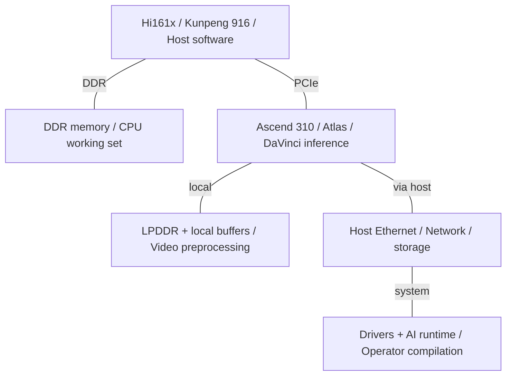
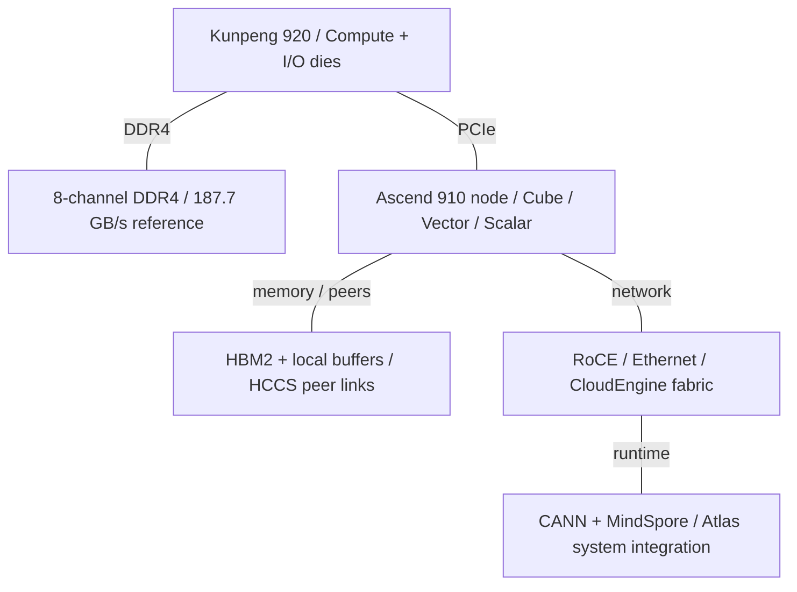
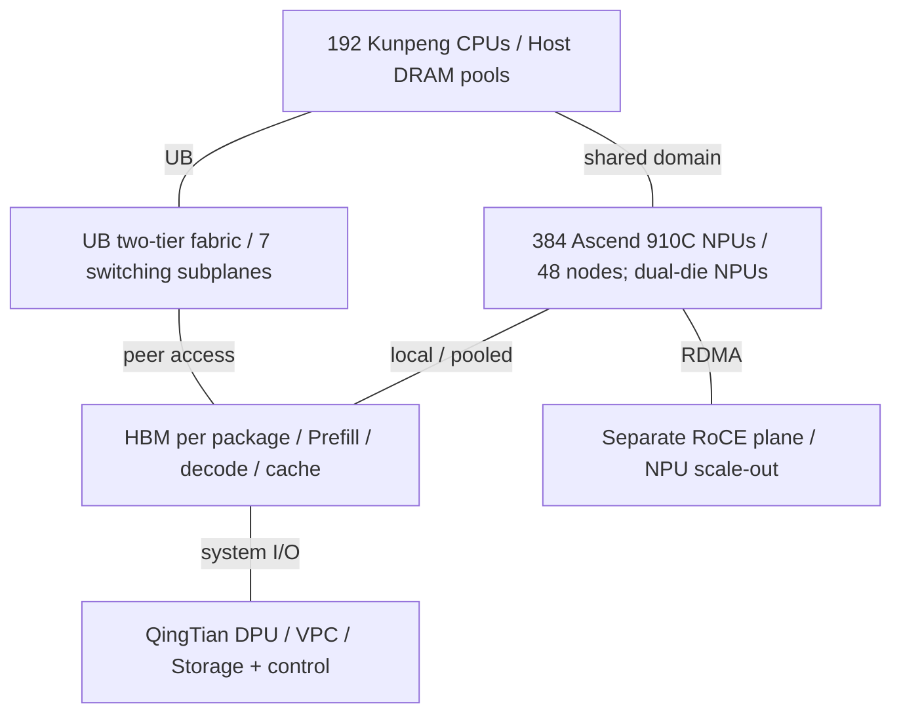
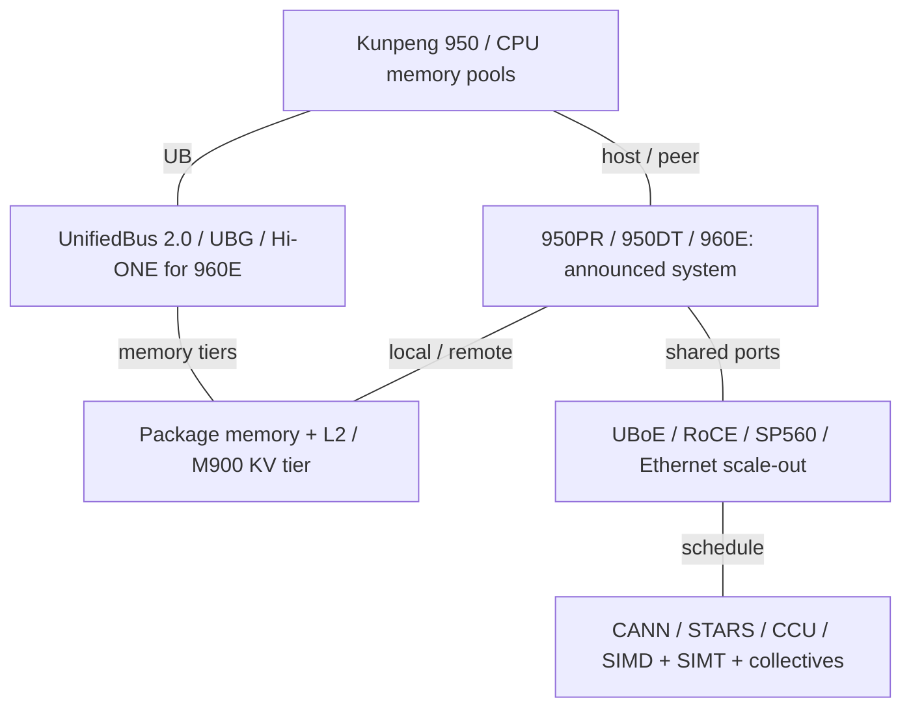

# Huawei AI Infrastructure Architecture Evolution

2015-2026 | 2026-09-28

## 01 Scope and executive synthesis

Coverage: Kunpeng host CPUs and Ascend NPUs receive deep coverage; UnifiedBus, DPUs, AI NICs, systems and software receive full generation-level coverage.
Period: 2015-28 September 2026; latest verified event: HUAWEI CONNECT 2026.
Focus: architecture, implementation and the balance between compute, memory and communication.
Related lines: Atlas edge inference, HiSilicon networking, optical engines and KV-cache storage where they explain the server stack.
Exclusions: an exhaustive Kirin smartphone, consumer GPU, telecom baseband or storage-drive catalogue; unverified manufacturing and capacity estimates.

Huawei’s infrastructure evolved through three architectural commitments. First, it built custom Arm server cores and reusable compute/I/O dies, culminating in the 2019 Kunpeng 920. Second, Ascend separated matrix, vector and scalar work and made explicit data movement central to performance. Third, the system boundary expanded from a server to a switched pool of CPUs, NPUs and memory. CloudMatrix384 made that third commitment concrete; Ascend 950 and UnifiedBus 2.0 extend it with dedicated communication engines and more flexible memory semantics.

The strongest current technical disclosure is the Ascend 950 architecture white paper. It describes two compute dies, two I/O dies, up to 36 matrix cores and 72 vector cores, a coherent on-package memory organization and up to 128 MB of accelerator L2. The PR and DT branches explicitly trade memory cost and bandwidth against workload needs. PR targets prefill and recommendation; DT targets training and complex inference. Atlas 350 is a concrete 950PR card configuration, not the maximum specification of the entire chip family.

The September 2026 roadmap brings Ascend 960DT readiness forward to Q1 2027 and 960PR to Q3 2027. Atlas 960E is an announced 4,096-NPU, liquid-cooled NPO system; its launch is not evidence that 960 silicon is already generally available. The engineering direction is clear: optical reach, collective offload and a hierarchy of HBM, CPU memory and KV storage increasingly determine usable model throughput. At the same time, the public record remains thinner on recent Kunpeng core internals, foundry processes and measured system power than on Ascend programming and system topology.

### Flagship milestones and comparable quantities

| Milestone | CPU / memory | Accelerator matrix BF16 / FP8 | Accelerator memory | Scale-up scope |
| --- | --- | --- | --- | --- |
| 2019 | Kunpeng 920: 64 cores; 187.7 GB/s DDR4 | Ascend 910: BF16 n/d; FP16 256 TFLOPS | 4 HBM2 stacks; ~1.2 TB/s | HCCS-connected accelerator nodes |
| 2025 | CloudMatrix384: 192 Kunpeng CPUs | 910C reference: BF16 supported; peak n/d in reviewed system paper | 2 compute dies, 8 memory stacks per NPU | 384 NPUs |
| 950PR | 8C/16T Linx816 on maximum NPU configuration | 432 / 865 TFLOPS | 128 GB; 1.6 TB/s maximum | 8,192 architectural domain; products vary |
| 950DT | Host Kunpeng 950: 64/96-core server configurations | 486 / 973 TFLOPS | 144 GB; 4 TB/s | 8,192 architectural domain; products vary |
| 960 / 960E | Kunpeng memory pools accompany NPU domains | 8 EFLOPS FP8 per announced 960E system | Up to 1 PB per system | 4,096 NPUs |

## 02 Reading the numbers and product names

Bandwidth uses decimal GB/s and TB/s. Ethernet Gb/s is divided by eight for a raw one-direction byte rate; packet, encoding and protocol overheads remain. A full-duplex total is halved only when the source explicitly identifies it as bidirectional. Peak compute counts a multiply-add as two operations. Matrix-only throughput is kept separate from the sum of Cube and Vector throughput. No sparse multiplier is applied. Precision labels remain exact: FP16 is not BF16, INT8 is not FP8, and MXFP4 is not a generic interchangeable four-bit format.

Ascend names a processor family, DaVinci an architecture, Atlas hardware products, and CloudMatrix a system/cloud architecture. Kunpeng is the CPU family; TaiShan is also used for server products, while TaiShan V110 denotes the 920 core. Unified Buffer and UnifiedBus both abbreviate to UB: the former is local AI-core storage and the latter is the system interconnect. A product marked n/d has a material specification absent from the reviewed evidence; this is not a zero or proof that the feature does not exist.

The bibliography is connected to chapters through a compact source map. Hot Chips 2019 supplies the original DaVinci organization; the HPCA 2021 industry paper and Huawei’s published technical collection add programming and implementation context. IEEE Micro’s Kunpeng paper supplies CPU internals. IEEE Micro is a journal, not the MICRO conference. Related ASPLOS, MICRO and ISCA research is included without treating experimental proposals as shipping circuitry. Announced capabilities, architectural maxima and measured deployments retain their separate scopes.

## 03 Host CPU generations

### Kunpeng: reference configurations and disclosure boundaries

| Generation / reference SKU | Codename | GA | Status | Core µarch | Cores / threads | Process per die | Dies / packaging | L2 per core | L3 / domain | Memory: channels; rate; GB/s | Sockets / links | PCIe / CXL | TDP | Vector / matrix ISA |
| --- | --- | --- | --- | --- | --- | --- | --- | --- | --- | --- | --- | --- | --- | --- |
| Hi1610 / Hi1612 baseline | Hi1610 / Hi1612 | 2015 driver record; GA n/d | Historical shipping | n/d | n/d | n/d | n/d | n/d | n/d | n/d | n/d | n/d | n/d | n/d |
| Kunpeng 916 | Hi1616 | Pre-2019 generation | Historical shipping | n/d | 32 / 32 | 16 nm | n/d | n/d | n/d | DDR4; 4 channels; 2400 MT/s; 76.8 GB/s | 2P boards | PCIe 3.0; CXL n/a | n/d | Arm NEON |
| Kunpeng 920 | Hi1620 | 2019 | Historical shipping | TaiShan V110 | 64 / 64 | Compute 7 nm; I/O 16 nm | 2 compute + 1 I/O; CoWoS reference | 512 KiB | 64 MB; sliced, ~1 MB/core | DDR4; 8 channels; 2933 MT/s; 187.7 GB/s | 2P / 4P; HCCS | PCIe 4.0 ×40; CXL n/a | 200 W paper reference | 128-bit NEON |
| Kunpeng 920 new models | n/d | Current motherboard portfolio; GA n/d | Shipping / available | n/d | SMT2; SKU core count n/d here | n/d | n/d | n/d | n/d | DDR5; channels / bandwidth n/d | 2P / 4P boards | PCIe 5.0; CXL n/d | n/d | n/d |
| Kunpeng 950 | n/d | 2026 H1 server brief | Shipping / available | n/d | 64 / 96 cores per socket; SMT2 | n/d | n/d | n/d | n/d | DDR5 RDIMM 7200 / MRDIMM 8800; channels n/d | 2P reference board | n/d | n/d | n/d |
| Kunpeng 950 larger configuration | n/d | 2025 roadmap; GA n/d | Roadmap | n/d | 192 / 384 | n/d | n/d | n/d | n/d | n/d | n/d | n/d | n/d | n/d |

## 04 2015-2019: from server Arm to Kunpeng 920

The 2015 Linux HNS driver submission establishes Hi1610 and Hi1612 as an early server-platform baseline. Kunpeng 916 then used 32 Arm cores and a DDR4 platform. That generation’s significance was platform integration: boot firmware, network drivers, memory validation and operating-system enablement made the later custom-core server product practical. It is useful context, but the reviewed platform documents do not establish the same core implementation as the custom V110 introduced with Kunpeng 920.

Kunpeng 920’s TaiShan V110 is an out-of-order Arm core with a four-instruction front end/dispatch organization and a multilevel branch-prediction structure. The published design provides separate 64 KiB instruction and data L1 caches and 512 KiB of private L2. Its floating-point/vector units implement 128-bit NEON operations; it should not be assigned Neoverse or SVE characteristics merely because it executes the Arm ISA. Public detail does not establish a complete reorder-buffer, scheduler, load/store queue or branch-predictor capacity inventory.

The LLC averages about 1 MB per core in the 64-core configuration. Tags and distributed data slices connect through the on-die fabric; the paper organizes coherence around home agents rather than a single large centralized cache. The dual-ring fabric emphasizes predictable service and throughput. These details matter because a server’s sustainable performance depends on where a cache miss is resolved and how memory traffic crosses compute-die boundaries, not simply on the sum of cache capacity.

The high-end reference combines two 32-core 7 nm compute dies with a 16 nm compute-I/O die. The paper describes CoWoS assembly and a roughly 400 GB/s coherent die-to-die connection; its bandwidth direction is not specified and is therefore not halved in this report. A single-compute-die Lite configuration demonstrates the reuse strategy. Compute and I/O technology can be selected separately, and the same I/O building blocks feed other HiSilicon products. The cost is that package links, memory placement and NUMA policy become first-class design choices.

Eight 64-bit DDR4-2933 channels yield a theoretical 187.7 GB/s, or 2.93 GB/s per core at 64 cores. The CPU also offers PCIe 4.0 and integrated high-speed Ethernet options. UMA and NUMA presentation modes are both discussed in the technical record; one address space should not be read as identical physical latency to every memory location. The practical AI-host role is data preparation, orchestration, networking and memory staging, while dense matrix work belongs on Ascend.

## 05 Updated 920 and Kunpeng 950: platform evolution

The current motherboard portfolio explicitly distinguishes “new-model Kunpeng 920” from the original DDR4 product. New-model boards support simultaneous multithreading, DDR5 and PCIe 5.0, including two- and four-socket configurations. The 920 brand therefore spans materially different platforms. It would be incorrect to combine the original V110 core/cache disclosure with the newer board’s memory and I/O and call that a fully documented single SKU.

The 2026 H1 Kunpeng 950 board brief is more concrete than the earlier roadmap: it specifies two processors with 64- or 96-core options, a 2.3 GHz base clock with Turbo, up to 24 DIMMs, DDR5 RDIMM operation up to 7200 MT/s and MRDIMM operation up to 8800 MT/s. Its 3 TB capacity is a two-socket system configuration. Twenty-four DIMM sockets do not establish twelve memory channels per processor; the document does not disclose the necessary channel-to-slot mapping.

The platform emphasizes Arm CCA, secure device access, trusted measurement and RAS, including online handling of faulty cores. These are important when a CPU hosts multi-tenant AI services or provides memory to other processors. They do not establish a confidential-computing guarantee for every external NPU, NIC and software path. The earlier 192-core/384-thread 950 configuration remains separately identified as a roadmap item unless a matching shipping SKU and system are documented.

Kunpeng’s emerging role extends beyond feeding an accelerator over PCIe. CloudMatrix and the later Peerium architecture expose CPU-attached memory as a resource for the wider compute domain. This can improve capacity efficiency for embedding tables, KV state and agent sandboxes, but locality still matters: remote bandwidth, synchronization, ownership and failure recovery have to be handled by the runtime. A large pool is a capacity resource before it is a substitute for local HBM bandwidth.

## 06 Ascend generation comparison

### Ascend NPUs: chip and card scopes are explicit

| Product | Architecture | GA / milestone | Status | Process | Dies / packaging | Compute units | Dense BF16 | Dense FP8 | Dense FP6 / FP4 | FP64 vector / matrix | Memory: type; stacks; GB; TB/s | LLC / SRAM | Scale-up: links; GB/s per direction; domain | Host link | Power / cooling | Form factor |
| --- | --- | --- | --- | --- | --- | --- | --- | --- | --- | --- | --- | --- | --- | --- | --- | --- |
| Ascend 310 | DaVinci | 2018 | Historical shipping | 12 nm | n/d | 2 AI cores | n/d | n/d | n/d | n/d | External LPDDR; board-dependent | n/d | n/d | PCIe | 8 W chip | Chip / Atlas modules |
| Ascend 910 | DaVinci | 2019 | Historical shipping | Compute N7+; other die nodes n/d | Compute + Nimbus I/O + 4 HBM2 + dummy dies | 32 AI cores | n/d; FP16 256 TFLOPS | n/d | n/d | n/d | HBM2; 4 stacks; capacity SKU-dependent; ~1.2 TB/s | L2 fabric 4 TB/s in HC talk | 3 × 240 Gb/s HCCS; direction n/d | PCIe 4.0 | 350 W HC target; launch 310 W | Atlas accelerator / server |
| Ascend 310P | Inference branch | Atlas 300I Pro / Duo generation | Historical shipping | n/d | n/d | n/d | n/d | n/d | n/d | n/d | LPDDR; configuration-dependent | n/d | n/d | PCIe | n/d | Inference cards / edge systems |
| Ascend 910B2 / A2 | DaVinci | 2023-era A2 systems | Historical shipping | n/d | n/d | 24 AIC + 48 AIV | Supported; SKU peak n/d | n/d | n/d | n/d | 64 GB HBM in ENEC 910B2 test system; rate n/d | n/d | HCCS; configuration-dependent | PCIe | n/d | Atlas A2 servers / modules |
| Ascend 910C / A3 | DaVinci | 2025-03 | Shipping / available | n/d | 2 compute dies; 8 memory stacks | 48 AIC + 96 AIV | Supported; peak n/d in R02 | INT8 path; native FP8 not established | n/d | n/d | 8 stacks; capacity / rate n/d in R02 | n/d | 7 UB transceivers per die; 384-NPU domain | Kunpeng / UB system | n/d | Atlas 900 A3 / CloudMatrix384 |
| Ascend 950PR | DaVinci 3 | 2026; Atlas 350 product | Shipping / available | n/d | 2 AI + 2 I/O dies; 8 memory modules | 32 AIC + 64 AIV | 432 TFLOPS | 865 TFLOPS | MXFP4 1730 TFLOPS; FP6 n/d | n/d | 128 GB; 1.6 TB/s; stack generation n/d | 128 MB | 18 ×4 ports; 56 GB/s raw/link/direction; 1008 GB/s total/direction before port reuse | PCIe 5.0 ×16 | n/d | Chip; several bins |
| Atlas 350 | 950PR / DaVinci 3 | 2026 product listing | Shipping / available | n/d | 950PR card configuration | 28 AIC + 56 AIV | 378 TFLOPS | 756 TFLOPS | MXFP4 1513 TFLOPS | n/d | 112 GB HBM; 1.4 TB/s | 112 MB | 4 cards: 159 GB/s/direction/card; 2 cards: 212 GB/s/direction/card | PCIe 5.0 ×16 | ≤600 W; passive heatsink | PCIe OH FL DW |
| Ascend 950DT | DaVinci 3 | 2026 systems listed; earlier Q4 target | Product-listed; chip GA date n/d | n/d | 2 AI + 2 I/O dies; 4 memory modules | 36 AIC + 72 AIV | 486 TFLOPS | 973 TFLOPS | MXFP4 1946 TFLOPS | n/d | 144 GB max; 4 TB/s; 96 GB variant | 128 MB | 18 ×4 ports; 56 GB/s raw/link/direction; 1008 GB/s total/direction before port reuse | PCIe 5.0 ×16 | n/d | Chip; several bins |
| Ascend 960DT / PR | n/d | DT Q1 2027; PR Q3 2027 readiness | Roadmap | n/d | n/d | n/d | n/d | n/d | n/d | n/d | n/d | n/d | n/d | n/d | n/d | Future chips; Atlas 960E system announced |

The 950 table uses Cube-only throughput, at the largest disclosed bin for each chip and the actual 28-Cube bin for Atlas 350. The Atlas 350 product page instead advertises 425 TFLOPS BF16, 804 TFLOPS MXFP8/HiF8 and 1,561 TFLOPS MXFP4 by combining Cube and Vector capability. The white paper gives 378, 756 and 1,513 TFLOPS respectively for its Cube engines. These are different accounting bases, not a contradiction. A quoted mixed-engine peak is not necessarily simultaneously attainable by one GEMM kernel.

## 07 2018-2021: DaVinci and the first Ascend systems

DaVinci’s original design separates scalar control, vector operations and a Cube matrix engine. A 16×16×16 FP16 multiplication produces 4,096 multiply-accumulates, conventionally counted as 8,192 floating-point operations per cycle. That headline rate requires operands to be tiled and reused through local buffers. MTE data-movement engines, L1 storage, L0 operand/result buffers and the Unified Buffer form an explicitly managed hierarchy. Overlapping transfer, matrix work and vector epilogues is the central programming task.

Ascend 310 put that architecture into an approximately 8 W inference chip with two AI cores, up to 16 TOPS INT8 or 8 TFLOPS FP16. Atlas modules and cards coupled inference with video preprocessing and host integration. The point of covering 310 alongside a datacenter product is architectural continuity: the local-buffer and operator-programming model scales across power envelopes. Mobile SoCs using DaVinci blocks and later 310P edge products extend this lineage, but their CPU and memory subsystems are different products.

Ascend 910 scaled to 32 AI cores and a package combining a 456 mm² compute die, an I/O die and four HBM2 stacks. The Hot Chips talk shows a 6×4 on-chip mesh, roughly 1.2 TB/s external memory bandwidth and HCCS plus Ethernet interfaces. Its compute-die area must not be confused with the sum of all die areas in the package. Likewise, the same talk’s concept combining logic, 3D SRAM and twelve HBM stacks is a forward-looking packaging illustration, not the shipping 910 configuration.

Hot Chips used a 350 W design target, while the August 2019 launch reported a maximum of 310 W for 256 TFLOPS FP16 and 512 TOPS INT8. The difference is a disclosure update, not permission to apply 310 W to every later 910 board. The HPCA 2021 industry account explains how the hardware and software stack serve multiple AI scenarios. Taken together, these disclosures establish a complete early architecture story: specialized execution, explicitly controlled storage, heterogeneous packaging and a compiler/runtime that must schedule the resulting parallel engines.

## 08 A2 to A3: accelerator nodes become a compute pool

Atlas A2 products and the 910B family represent the intermediate server generation. Processor suffixes, enabled cores, memory configurations and server names vary; a single enthusiast specification table is not a safe substitute for an exact product document. The ISCA 2026 ENEC paper identifies its 910B2 test device as 24 Cube and 48 Vector units with 64 GB HBM, a useful fixed reference within that broader family. The ASPLOS 2025 study is valuable because it measures Ascend operator behavior and develops a component-level roofline model. It shows why peak matrix throughput alone misses serial execution phases, pipeline imbalance and interference between computation and data movement. That is product characterization and optimization research, not a disclosure of an unrelated next-generation chip.

Huawei dates Atlas 900 A3 delivery to March 2025 and identifies its accelerators as Ascend 910C. The CloudMatrix384 paper describes the corresponding dual-compute-die NPU package with eight memory stacks. Each die has 24 matrix cores and 48 vector cores, seven scale-up transceivers and a separate scale-out interface. The package-level count is therefore 48 matrix and 96 vector cores. This is an important hierarchy change: matrix engines, compute dies, NPU packages and server nodes are four different counting units.

CloudMatrix384 contains 48 compute nodes, each with eight NPUs, four Kunpeng CPUs and seven on-board UB switches: 384 NPUs and 192 CPUs in total. Twelve compute racks and four communication racks house a two-tier fabric. Seven independent switching subplanes connect the nodes without L2 oversubscription in the published topology. The CPU and NPU resources share the UB scale-up plane; NPU scale-out uses a separate RoCE plane; a QingTian DPU provides the VPC and storage-facing plane. The published system does not collapse all three into one physical network.

CloudMatrix-Infer separates prefill, decode and cache resources and uses large expert-parallel domains for mixture-of-experts serving. The paper reports DeepSeek-R1 results including 6,688 prefill tokens/s/NPU for a 4K prompt and 1,943 decode tokens/s/NPU with a 4K cache and time per output token below 50 ms. A tighter 15 ms constraint gives 538 decode tokens/s/NPU. These are vendor-reported end-to-end measurements with specific quantization and scheduling choices. They demonstrate the importance of the throughput/latency operating point; they are not interchangeable with a chip’s FLOPS or an uncontrolled GPU comparison.

## 09 Ascend 950: computation, memory and communication co-design

The 950 package separates two AI dies from two I/O dies. PR uses eight memory modules; DT uses four higher-bandwidth modules. The maximum physical organization has 36 AI subsystems, each containing one Cube and two Vector cores, while commercial bins disable different amounts of compute and memory. Eight Linx816 Armv8-A CPU cores with two threads each supply local control and CPU operators. Their own caches are distinct from accelerator L2; hardware coherence connects the CPU and AI-core memory views inside the package.

DaVinci 3 strengthens work around the matrix multiply. Register-based vector execution, dual issue and SIMD/SIMT function blocks address elementwise arithmetic, gather/scatter and branch-heavy code. SIMD remains the principal throughput mode; SIMT improves irregular kernels rather than turning the entire NPU into a conventional GPU. A direct Cube-to-Vector path and conversions during result movement reduce round trips through shared memory. N-dimensional DMA performs layout-aware transfers, easing the cost of tensor tiling and rearrangement.

The disclosed per-AI-core storage includes 512 KB L1, 64 KB each for L0A and L0B, 256 KB L0C and 512 KB Unified Buffer. Global accelerator L2 reaches 128 MB. Its 512-byte lines are divided into 128-byte sectors, allowing small irregular accesses without always moving a full line. Software can use allocation hints and residency controls. Coherence across the two dies does not eliminate locality: the white paper explicitly preserves local affinity, so scheduling and tiling should still avoid unnecessary cross-die movement.

Seventy-two 112 Gb/s SerDes lanes form eighteen ×4 ports. This is 56 GB/s raw per port per direction, or 1,008 GB/s across all ports; Huawei quotes 2,016 GB/s bidirectional. Four ports can instead implement PCIe 5.0 ×16, and two ports can implement two 400 Gb/s UBoE interfaces. Those modes consume shared physical resources. A design cannot add maximum UB, PCIe and Ethernet figures as if each came from a separate set of pins. Optics may further constrain off-enclosure speed.

STARS 2.0 schedules heterogeneous engines and synchronizes their work. The CCU executes collective-communication tasks without dedicating the same AI cores to every transfer and reduction. URMA provides asynchronous remote-memory/message operations; UB Memory provides synchronous load/store/atomic semantics. These are complementary mechanisms. The published 128 TB access capability of a chip interface, the 8,192-card architectural domain and a particular SuperPoD’s advertised address space are separate limits with separate scopes.

Atlas 350 demonstrates why chip maxima must be translated into board topology. Its 112 GB HBM runs at 1.4 TB/s, and its board power is at most 600 W. A four-card full mesh uses three ×4 UB ports per card and advertises 318 GB/s bidirectional; a two-card arrangement uses four ports for 424 GB/s. Their one-direction equivalents are 159 and 212 GB/s. Both are much smaller than the full chip I/O maximum, because the card exposes a different port allocation and physical link configuration.

## 10 960 and later: roadmap revisions and optical systems

The 2025 announcement named 950PR for Q1 2026, 950DT for Q4 2026, and a later 960 generation. It described an Atlas 950 design point of 8,192 accelerators across 160 cabinets. The July 2026 WAIC disclosure instead describes a particular 1,024-card Atlas 950 with 1 EFLOPS FP8, 2 EFLOPS FP4 and a 256 TB unified address space. The later white paper still supports an 8,192-card architectural domain. These numbers describe a roadmap design point, a concrete system configuration and an architecture limit; they need not be forced into one product row.

At HUAWEI CONNECT 2026, 960DT readiness moved forward by three quarters to Q1 2027, and 960PR by one quarter to Q3 2027. The company also named 970 and 980 for 2028 and 2029. Atlas 960E couples 4,096 NPUs with Hi-ONE near-packaged optical engines and liquid cooling. Its advertised system peaks are 8 EFLOPS FP8 and 16 EFLOPS FP4 with up to 1 PB of HBM. A system announcement and testing milestone should be tracked separately from silicon readiness and broad customer availability.

## 11 Scale-up links and memory semantics

### Interconnect lineage and normalized directions

| Interconnect | Year / generation | Lane rate | Lanes / link | GB/s per link per direction | Links / device | Topology | Domain limit | Coherence / semantics |
| --- | --- | --- | --- | --- | --- | --- | --- | --- |
| Kunpeng 920 D2D | 2019 | n/d | n/d | 400 GB/s quoted aggregate; direction n/d | n/d | Compute / I/O chiplet links | Processor package | Coherent on-package fabric |
| Ascend 910 HCCS | 2019 | n/d | n/d | 240 Gb/s = 30 GB/s quoted link; direction n/d | 3 | Board/system dependent | n/d | Accelerator communication; do not assume general CPU coherence |
| UnifiedBus 1.0 | 2025 | n/d | n/d | n/d | 7 transceivers per 910C die | Two-tier switched; 7 subplanes | 384 NPUs | Peer access; pooled CPU/NPU memory |
| UnifiedBus 2.0 / 950 | 2026 | 112 Gb/s | 4 | 56 raw; 1008 aggregate/device | 18 | nD mesh / Clos | 8,192 NPUs | URMA; load/store/atomic; on-package coherence separately documented |
| Atlas 350 UB | 2026 | n/d | 4 | 53 from card bidirectional rating | 3 in 4-card mesh; 4 in 2-card mode | Full mesh / paired | 4 / 2 cards | Card UB links |
| 950 UBoE | 2026 | n/d | n/d | 50 raw per 400G port | 2 | Ethernet fabric | Cluster architecture >128K cards | UB over Ethernet; consumes shared ports |
| 2026 UB optical device | 2026 | 1.6 Tb/s per port | n/d | 200 raw/port; direction basis of 280T total unspecified | 176 | Inter-cabinet optical fabric | System-dependent | UnifiedBus; advertised RTT 2 µs |

A shared address range is only one part of a memory system. The protocol must also define ordering, atomics, cacheability, synchronization, permissions and failure behavior. Ascend 950 explicitly documents coherent caches across its compute dies and CPU/AI subsystem; that does not establish uniform CPU-style cache coherence across every SuperPoD endpoint. URMA, UB Memory and UBoE should be evaluated by their own semantics and the software paths that use them.

## 12 DPUs, NICs and the AI communication path

### Network products and infrastructure offload

| Product | GA / milestone | Status | Class | Ports × speed | SerDes | Host interface | Programmable engine | Embedded CPU | On-card memory | Transport / RDMA | Congestion control | Key offloads | Power |
| --- | --- | --- | --- | --- | --- | --- | --- | --- | --- | --- | --- | --- | --- |
| SP681 | Current portfolio; GA n/d | Shipping / available | NIC | 2 ×25GE | n/d | PCIe 3.0 ×8 | n/d | n/d | n/d | RoCE v2 | PFC / ETS | Checksum; virtualization; network offload | n/d |
| SP670 | Current portfolio; GA n/d | Shipping / available | NIC | 2 ×100GE | n/d | PCIe 4.0 ×16 | Hi1822; engine ISA n/d | n/d | n/d | RoCE v2 | PFC / ETS | Virtualization and network offload | n/d |
| SP680 / SP623Q | Current portfolio; GA n/d | Shipping / available | NIC / SmartNIC | 4 ×25GE | n/d | PCIe 4.0 ×16 | Hi1822; DPU Solution ecosystem | n/d | n/d | Ethernet; RoCE depends on model | PFC / ETS | OVS / DPI / virtualization ecosystem | n/d |
| SP923Q / SP900 | Current product brief; GA n/d | Shipping / available | DPU | 4 ×25GE | n/d | PCIe 4.0 ×16 | DPAK | Hi1822; 24 cores | 32 GB DDR4-2400; 4 channels | Ethernet; storage/network offload | PFC / ETS | Bare-metal network/storage; management | n/d |
| QingTian card | 2025 documented system | Shipping / available | Cloud infrastructure DPU | n/d | n/d | n/d | n/d | n/d | n/d | VPC / Ethernet; UB integration by platform | n/d | Virtualization, I/O offload, isolation, trust | n/d |
| SP230 | WAIC 2026 | Announced; GA n/d | Standard NIC | 25-200GE family; port count n/d | n/d | n/d | n/d | n/d | n/d | Ethernet | n/d | Host networking | n/d |
| SP560 AI NIC | WAIC 2026 | Announced; GA n/d | AI NIC | 800G advertised; port mapping n/d | n/d | UnifiedBus + PCIe | Programmable protocol; ISA n/d | n/d | n/d | RDMA | n/d | Direct NPU/GPU memory access; collective submission | n/d |

Huawei has three distinct networking roles. A conventional or smart NIC connects a host and may offload packet processing. A DPU moves infrastructure services and trust boundaries away from the tenant CPU. An AI NIC prioritizes accelerator communication, direct memory access and collective submission. A network switch and a UB scale-up switch are separate products again. Sharing HiSilicon IP or software interfaces does not make these categories interchangeable.

The SP923Q is a concrete SP900-family DPU: a 24-core Hi1822, four DDR4-2400 channels with 32 GB ECC memory, PCIe 4.0 ×16 and four 25GE ports. Two small M.2 drives support the local operating environment; DPAK exposes network, storage and compute acceleration. The brief specifies an 8 A at 12 V supply requirement, which is not a declared 96 W TDP. Its host link also has more raw capacity than four 25GE ports, illustrating that PCIe provision and external network throughput are different constraints.

The 2026 SP560 announcement adds an 800G AI NIC with UnifiedBus and PCIe host attachment. Direct access to accelerator memory and programmable protocol handling are the disclosed differentiators; the public event record does not provide a full port map, SerDes inventory, embedded-core count or board power. Its 800G label therefore remains a family-level advertised rate, not an invented two-port or four-port configuration. It is also distinct from storage products that happen to reuse the SP560 identifier.

## 13 Ethernet switching, optics and KV storage

CloudEngine 16800 introduced a high-density 400GE datacenter platform in 2019; the 2023 CloudEngine 16800-X disclosure advanced the portfolio toward 800GE. Current XH16800 documentation describes a chassis fabric, cell switching, ECMP, AI ECN and PFC deadlock prevention. These functions manage congestion and forwarding across an Ethernet fabric. They should not be confused with the number of ports on one switch ASIC or with the bandwidth of a UB accelerator domain. The XH16800 document’s “evolution to 800GE” wording is retained rather than treating every listed line card as already 800GE.

The September 2026 UnifiedBus system announcement introduces a 176-port, 1.6T-per-port optical interconnect device and a UBG switch with radix up to 1,024. The first multiplication yields 281.6 Tbit/s of advertised port rate, consistent with the rounded “280T” claim; it does not define bidirectional payload switching capacity. Nor should the second number be read as 1,024 such ports on one monolithic ASIC. Cabinet, chassis, chip and network topology remain separate accounting levels.

Hi-ONE is specified at 7.2 Tbit/s per optical engine with an integrated light source. The 960E comparison replaces 48,000 conventional 800G optical modules with 5,500 engines and claims more than 550 kW of savings. This is Huawei’s topology-level comparison, not a measured per-NPU TDP improvement. NPO places optics near the package; it should not automatically be renamed co-packaged optics. The design motivation is to shorten high-speed electrical reach and reduce cabling and power while preserving a large switched domain.

OceanStor M900 adds a PB-scale KV-cache tier, described by Huawei as L3.5 and reachable in one UnifiedBus hop. “L3.5” is a system-tier label, not a CPU cache level. A useful mental model is local HBM for active execution, CPU memory for larger working sets, and a shared persistent or semi-persistent KV tier for reusable context. Storage can avoid recomputation and improve capacity economics, but latency-sensitive decoding still depends on how much useful state reaches HBM on time.

## 14 System generations and deployment boundaries

### From server nodes to SuperPoD and SuperCluster

| Platform | Year / milestone | CPU / accelerator count | Scale-up domain | Scale-out per accelerator | Rack power | Cooling |
| --- | --- | --- | --- | --- | --- | --- |
| Atlas 2019 systems | 2019 | Configuration-dependent Ascend nodes | HCCS-connected nodes | 910 integrates 2 ×100Gb/s Ethernet; 25 GB/s raw aggregate | n/d | System-dependent |
| Atlas A2 | 2023-era | Server/module-dependent | HCCS; system-dependent | n/d | n/d | Air / liquid by product |
| CloudMatrix384 / Atlas 900 A3 | 2025 | 192 CPUs + 384 NPUs; 48 nodes | 384 NPUs | Dedicated RoCE per NPU die; rate n/d | n/d | Liquid-cooled SuperPoD |
| Atlas 950 2025 design point | 2025 roadmap for 2026 | 8,192 NPUs; 160 cabinets | 8,192 NPUs | UBoE / RoCE; port allocation dependent | n/d | Liquid |
| Atlas 950 WAIC configuration | 2026-07 | 1,024 NPUs | 1,024 NPUs | n/d | n/d | Liquid |
| Atlas 850E | 2026-07 | Up to 96 cards | 96 cards | n/d | n/d | Air; VCE phase-change technology |
| Atlas 960E | 2026 announcement; 960 chips 2027 | 4,096 NPUs | 4,096 NPUs | UB network / RoCE; per-NPU rate n/d | n/d | Full liquid; NPO |
| Kunpeng SuperPoD update | 2026-09 | Up to 4,096 nodes | 256 TB unified pool disclosed | n/a | n/d | n/d |

A maximum supported cluster is not an installed cluster. The 2026 disclosures describe very large scale-out topologies, including hundreds of thousands of NPUs and a multi-rail path to one million. Their engineering significance is the hierarchy and reach of the interconnect; the report does not treat those limits as verified customer installations. Likewise, an addressable memory pool is not necessarily the sum of all physical DRAM in every node.

## 15 Software evolution and research feedback

### Software capabilities aligned with hardware

| Release / layer | Date | Hardware enabled | Key features |
| --- | --- | --- | --- |
| CANN / MindSpore launch | 2019 | Ascend 310 / 910 | Graph compilation, operators, runtime and framework |
| CANN 3.0 | 2020 | Ascend | Broader developer interfaces and operator optimization |
| Ascend C | Current documentation | Ascend AI cores | Explicit tiling, queue/buffer management, pipelined compute and transfer |
| CloudMatrix-Infer | 2025 | CloudMatrix384 | Prefill/decode/cache separation; expert parallelism; INT8 kernels |
| CANN / Mind open source | 2025-2026 | Ascend | Compiler/runtime/kernel ecosystem opening; framework integration |
| DaVinci 3 / STARS 2.0 / CCU | 2026 | Ascend 950 | SIMD/SIMT; NDDMA; collective offload; cache hints; low-precision formats |
| DPAK / QingTian / openEuler | Generation-dependent | Kunpeng / SP900 / cloud | Host OS, network/storage offload and tenant isolation |

Ascend C exposes the machine’s memory hierarchy directly enough that kernel authors must understand tiling, buffer lifetime, queues and synchronization. The payoff is precise overlap between data movement and compute; the cost is that porting an operator may involve more than translating its arithmetic. A framework adapter alone does not guarantee equivalent scheduling, collective behavior or quantization quality. CANN, optimized kernels, HCCL-style collectives and inference-serving software have to mature together.

The academic record adds mechanisms rather than a second marketing timeline. ASPLOS 2025’s component roofline explains operator bottlenecks. ISCA 2026’s ENEC optimizes lossless weight compression for Ascend, including vector-friendly decoding and dependency reduction. MICRO 2025’s RICH Prefetcher explores storing richer prefetch information in memory to trade capacity and bandwidth for latency hiding. ENEC is software/research on Ascend; RICH is related CPU research. Neither establishes that a specific new decompressor or prefetcher shipped in Kunpeng or Ascend.

## 16 Bandwidth hierarchy and derived ratios

### Bandwidth by era: scopes are intentionally separate

| Era / reference | On die / die-to-die | Memory | Host attachment | Scale-up per accelerator | Scale-out per accelerator |
| --- | --- | --- | --- | --- | --- |
| 2015-2018 / 310 | Explicit local buffers; numeric rate n/d | LPDDR; board-dependent | PCIe; n/d | n/d | n/d |
| 2019-2022 / 910 | L2 fabric 4 TB/s; per-AI-core 128 GB/s read + 128 GB/s write | ~1.2 TB/s HBM2 | PCIe 4.0 | 3 ×240 Gb/s HCCS; direction n/d | 2 ×100 Gb/s Ethernet = 25 GB/s raw aggregate |
| 2023-2025 / 910C | Dual compute die; D2D rate n/d | 8 memory stacks; R02 rate n/d | Kunpeng / UB | 7 UB transceivers per die; rate n/d | Separate RoCE interface per die; rate n/d |
| 2026 / maximum 950 | 2 AI + 2 I/O; D2D rate n/d | PR 1.6; DT 4 TB/s | PCIe 5.0 ×16: nominal 64 GB/s/direction | 1008 GB/s raw/direction before port reuse | 2 ×400G UBoE: 100 GB/s raw aggregate; shared ports |
| 2026 / Atlas 350 card | 28-Cube bin; D2D rate n/d | 1.4 TB/s | PCIe 5.0 ×16: nominal 64 GB/s/direction | 159 GB/s/direction at 4 cards; 212 at 2 cards | Server NIC-dependent |

### Derived balance metrics, not measured application performance

| Reference | Calculation | Result | Interpretation / boundary |
| --- | --- | --- | --- |
| Kunpeng 920 | 8 × 8 × 2.933 / 64 | 2.933 GB/s/core | Theoretical DDR4 payload; controller/workload efficiency excluded |
| Kunpeng 920 | 64 MB / 64 | 1 MB/core | Average shared LLC budget, not private allocation |
| Ascend 910 | 1.2e12 / 256e12 | 0.00469 byte/FP16 FLOP | FP16; not a BF16 comparison |
| 950PR max | 1.6e12 / 432e12 | 0.00370 byte/BF16 FLOP | Cube-only dense peak |
| 950PR max | 1.6e12 / 865e12 | 0.00185 byte/FP8 FLOP | Cube-only dense peak |
| 950DT max | 4e12 / 486e12 | 0.00823 byte/BF16 FLOP | 2.22× PR bandwidth per BF16 FLOP |
| 950DT max | 4e12 / 973e12 | 0.00411 byte/FP8 FLOP | Cube-only dense peak |
| Atlas 350, 4 cards | 159 / 1400 | 0.114 | One-way card scale-up / HBM; ~11.4% |
| Atlas 350 | 378 TFLOPS / 600 W | 0.630 TFLOPS/W | BF16 Cube peak / maximum board power; not measured efficiency |

## 17 Integrated stack across four eras

The diagrams show deployment roles and traffic paths. Lines indicate connectivity, not equal bandwidth, universal coherence or simultaneous use of every optional interface. Source coverage follows the preceding family chapters.

### 2015-2018: host-led inference

A small NPU augments a server or edge host; this is not yet a large shared accelerator domain.

### 2019-2022: chiplets and accelerator nodes

Reusable silicon blocks coexist with explicit accelerator data movement; scale-out remains a network problem.

### 2023-2025: CloudMatrix384 resource pooling

The UB, RoCE and VPC planes have different roles; CloudMatrix-Infer maps serving stages across the pooled resources.

### 2026 disclosures: differentiated NPUs and optical scale

This combines product roles, not a claim that every listed component ships in one SKU. 960 chips remain on the 2027 roadmap.

## 18 Engineering trends and disclosure gaps

Chiplet reuse predates the current AI boom in Huawei’s portfolio. Kunpeng 920 used separate compute and I/O dies; the first 910 paired a large compute die with I/O and HBM; 950 makes the compute/I/O partition more explicit while varying its memory subsystem by workload. The benefit is modularity and the ability to optimize different die functions separately. The cost is package wiring, coherent data movement and another layer of placement sensitivity. No public source reviewed here establishes a universal 3D-stacked SRAM design across these shipping products.

Low precision raises compute faster than it raises the supply of useful bytes. The 950 matrix path doubles throughput from BF16 to FP8 and approximately doubles it again to MXFP4. Quantization, vector processing and data layout become increasingly important as the arithmetic gets cheaper. More HBM bandwidth helps memory-bound phases, but operator fusion and keeping intermediate data in L0/L1/Unified Buffer can remove transfers altogether. The next bottleneck may therefore be vector work, synchronization or communication rather than the Cube array.

The PR/DT split is quantitatively meaningful. DT’s maximum matrix BF16 throughput is only about 12.5% above PR’s, but its memory bandwidth is 2.5 times as large. It therefore offers roughly 2.22 times the memory bandwidth per BF16 FLOP. That is consistent with a training/decoding branch that must sustain more movement per unit of arithmetic. It is an architectural interpretation of the disclosed ratios, not a guarantee that every decode workload runs 2.22 times faster.

Larger scale-up domains give mixture-of-experts models more aggregate memory and more choices for expert placement. They also increase the importance of fabric bisection bandwidth, tail latency, optics reliability and failure containment. A domain of thousands of NPUs cannot be judged by multiplying chip peak alone. The strongest evidence would combine measured model throughput and latency, full system power, recovery behavior and the exact topology under the same workload. These measurements are not uniformly disclosed across Huawei’s generations.

The architecture gains more from avoiding unnecessary movement than from renaming all resources “memory.” Pooling expands capacity and creates another scheduler’s degree of freedom, while also introducing queueing, placement, durability and recovery concerns. Optical integration reduces electrical reach and cable burden, but requires thermal, mechanical and serviceability engineering. These are system-level trade-offs, and should be evaluated with workload traces and failure behavior rather than a single aggregate bandwidth number.

The implementation record is asymmetric. Early Hot Chips and the Kunpeng technical paper reveal die partitioning and core details. ISSCC provides independently identifiable wireline circuit disclosures, including a Huawei 60 Gb/s PAM4 ADC-DSP transceiver, but no reviewed primary link proves that exact circuit is the SerDes in a named Kunpeng or Ascend product. Recent NPU documentation exposes programming and memory mechanisms well, while foundry nodes, yield, package capacity, transistor counts and many power figures remain undisclosed. Manufacturing constraints should therefore be discussed as constraints, not filled with unattributed die-analysis claims.

Opening software and publishing a protocol can broaden adoption, but ecosystem compatibility remains an engineering property. Kernel coverage, compiler quality, collective behavior, device management and the licensing/implementation status of an interconnect all matter. Huawei’s combination of CANN, its own system fabric, cloud services and partner boards supplies an increasingly complete stack. Its differentiation is the coordination of these layers; the unresolved comparison is how much useful workload performance and operational resilience that coordination delivers per unit of cost and power.

## 19 Conference-to-product index

### Verified disclosures and related research

| Venue | Year | Paper / talk / disclosure | Presenter / authors | Product | Evidence type | Source |
| --- | --- | --- | --- | --- | --- | --- |
| Hot Chips 31 | 2019 | DaVinci: A Scalable Architecture for Neural Network Computing | Heng Liao; Jiajin Tu; Jing Xia; Xiping Zhou | Ascend 310 / 910 | Architecture, die/package, memory, links | C01 |
| HPCA industry track | 2021 | Ascend: a scalable and unified architecture for ubiquitous deep neural network computing | Heng Liao et al. | Ascend / DaVinci | Product architecture; vendor reprint read | C04 / P01 |
| IEEE Micro journal | 2021 | HiSilicon Kunpeng 920: First 7-nm Chiplet-Based 64-Core Server CPU With Arm Ecosystem | Jing Xia; Chuanning Cheng; Xiping Zhou; Yuxing Hu; Peter Chun | Kunpeng 920 | Core, cache, die partitioning; journal, not MICRO conference | P01 / C02 |
| ISSCC | 2019 | 6.2: 60Gb/s PAM-4 ADC-DSP Transceiver; 7nm; adaptive power scaling | M.-A. LaCroix et al., Huawei Ottawa | Wireline IP; product adoption unproven | Circuit; program reports 6.9 pJ/b at 32 dB loss | C05 |
| ASPLOS | 2025 | Squeezing Operator Performance Potential for the Ascend Architecture | Yuhang Zhou et al. | Ascend | Operator characterization and optimization research | R01 |
| MICRO | 2025 | RICH Prefetcher: Storing Rich Information in Memory to Trade Capacity and Bandwidth for Latency Hiding | Ningzhi Ai et al. | Related CPU research | Research; no confirmed Kunpeng adoption | R06 |
| ISCA | 2026 | ENEC: A Lossless AI Model Compression Method Enabling Fast Inference on Ascend NPUs | Jinwu Yang et al. | Ascend 910B2 study | Model compression research | R03 / R05 |
| R-CCS Symposium | 2020 | Kunpeng platform presentation | Zhaohui | Hi161x / Kunpeng 916 / 920 | CPU roadmap and platform; historical future targets | C03 |
| Huawei Developer Conference | 2025 | CloudMatrix384 cloud service | Huawei Cloud | CloudMatrix384 | Cloud/system availability | E17 / R02 |
| HUAWEI CONNECT | 2025 | SuperPoD, 950/960 roadmap, UnifiedBus 2.0, CANN opening | Eric Xu; Yang Chaobin; Zhang Dixuan | Kunpeng / Ascend / UB | Architecture roadmap and ecosystem | E02 / E09 / E16 |
| MWC Barcelona | 2026 | SuperPoD and AI infrastructure showcase | Huawei | Atlas / Kunpeng | System and industry deployment | E05 |
| WAIC | 2026 | Atlas 950, Atlas 850E, SP560 AI NIC, compute modules | Huawei | Ascend / networking | System and product launch | E18 / E13 |
| IEEE ISCAS | 2026 | Tau scaling and logic folding | Huawei researchers | Related scaling research | Research direction; not ISSCC or a product node disclosure | E06 |
| HUAWEI CONNECT | 2026 | 960E, Hi-ONE, Peerium, M900, Kunpeng pools | David Wang; Huawei | AI infrastructure stack | System launch, roadmap update, optics/storage architecture | E01 / E03 / E04 / E10 / E11 / E12 |

The index is a verified conference-to-product map, not a claim to enumerate every Huawei-affiliated publication. No reviewed primary disclosure establishes a generation-by-generation Kunpeng/Ascend product paper at DAC, VLSI, IEDM, ECTC, OFC, SC or ISC. Likewise, Computex, OCP, GTC, re:Invent, Ignite and Google Cloud Next are not automatically Huawei product disclosure channels. They remain search targets rather than invented entries. MWC, WAIC, HUAWEI CONNECT and Huawei’s developer events have direct, useful records for this portfolio.

## 20 Names, reuse and items that must not be merged

### Product and architecture crosswalk

| Name / identifier | Meaning | Important boundary |
| --- | --- | --- |
| Hi1620 / Kunpeng 920 / TaiShan V110 | Original 2019 CPU / product / core | New-model 920 platforms have separate specifications |
| Kunpeng 950 / Linx816 | Host CPU family / embedded Ascend CPU core | Do not equate the two microarchitectures |
| DaVinci / Ascend / Atlas | Architecture / processor / hardware system | One architecture spans multiple chips and boards |
| 910C / Atlas 900 A3 / CloudMatrix384 | NPU / SuperPoD product / cloud-system architecture | The paper abbreviates the processor to Ascend 910; launch identifies 910C |
| 950PR / Atlas 350 | Prefill/recommendation processor / 28-Cube PCIe card | 128 GB chip maximum vs 112 GB card configuration |
| UB buffer / UnifiedBus | AI-core local memory / system interconnect | Same acronym, different layers |
| HCCS / HCCL | Hardware interconnect / collective software library | A library name does not specify link bandwidth |
| SP600 / SP900 / SP560 AI NIC | NIC family / DPU family / AI NIC | Do not infer the AI NIC from a similarly named SSD |
| Hi-ONE / NPO | Optical engine / near-packaged optics | Not a blanket synonym for CPO |
| OceanStor M900 / L3.5 | KV storage system / system-tier label | Not a CPU L3 cache or on-chip SRAM |

## Source map

01 Scope and executive synthesis — C01, E01, E02, E03, E11, P01, P08, P14, P15, R02

02 Reading the numbers and product names — C01, C04, P01, P14, P15, R01, R02, R03, R05, R06

03 Host CPU generations — C03, E02, P01, P08, P09, P10, P13, P16, R07

04 2015-2019: from server Arm to Kunpeng 920 — C03, P01, P10, P16, R04, R07

05 Updated 920 and Kunpeng 950: platform evolution — E02, E11, E12, P08, P09, R02

06 Ascend generation comparison — C01, E02, E03, E07, E11, E18, E20, P01, P12, P14, P15, R01, R02, R05

07 2018-2021: DaVinci and the first Ascend systems — C01, C04, E07, E20, P01, P12

08 A2 to A3: accelerator nodes become a compute pool — E02, P12, R01, R02, R05

09 Ascend 950: computation, memory and communication co-design — P14, P15

10 960 and later: roadmap revisions and optical systems — E02, E03, E11, E12, E18, P15

11 Scale-up links and memory semantics — C01, E02, E04, P01, P14, P15, R02

12 DPUs, NICs and the AI communication path — E13, P04, P05, P06, P07, P15, R02

13 Ethernet switching, optics and KV storage — E03, E04, E10, E11, E14, E15, P11

14 System generations and deployment boundaries — C01, E02, E03, E05, E07, E11, E12, E18, P12, R02

15 Software evolution and research feedback — E08, E09, E18, E20, P01, P03, P04, P07, P08, P15, R01, R02, R03, R05, R06

16 Bandwidth hierarchy and derived ratios — C01, P01, P14, P15, R02

17 Integrated stack across four eras — C01, E03, E11, E13, P01, P15, R02

18 Engineering trends and disclosure gaps — C01, C05, E03, E09, E11, E12, E17, P01, P08, P15, R01, R02

19 Conference-to-product index — C01, C02, C03, C04, C05, E01, E02, E03, E04, E05, E06, E09, E10, E11, E12, E13, E16, E17, E18, P01, R01, R02, R03, R05, R06

20 Names, reuse and items that must not be merged — C01, E02, E03, E11, E13, P01, P04, P06, P08, P09, P12, P14, P15, R02

## References

### Product and technical documentation

[P01] Huawei Research, June 2022: Ascend architecture. [https://www-file.huawei.com/admin/asset/v1/pro/view/6ca306adab0a4852bacffce25f5573ec.pdf](https://www-file.huawei.com/admin/asset/v1/pro/view/6ca306adab0a4852bacffce25f5573ec.pdf). Primary source; accessed by 2026-09-28

[P03] Ascend C overview, CANN 9.1. [https://www.hiascend.com/document/detail/en/CANNCommunityEdition/910/programug/Ascendcopdevg/docs/en/guide/getting_started/ascend_c_overview_and_learning_path.md](https://www.hiascend.com/document/detail/en/CANNCommunityEdition/910/programug/Ascendcopdevg/docs/en/guide/getting_started/ascend_c_overview_and_learning_path.md). Primary source; accessed by 2026-09-28

[P04] SP900 DPU cards product brief. [https://www.hikunpeng.com/s/kunpengstatic/lst/files/pdf/SP900_series_DPU_card_2.pdf](https://www.hikunpeng.com/s/kunpengstatic/lst/files/pdf/SP900_series_DPU_card_2.pdf). Primary source; accessed by 2026-09-28

[P05] SP900 DPU current portfolio. [https://e.huawei.com/cn/products/computing/kunpeng/components/dpu](https://e.huawei.com/cn/products/computing/kunpeng/components/dpu). Primary source; accessed by 2026-09-28

[P06] SP600 NIC and Hi1822 portfolio. [https://e.huawei.com/cn/products/computing/kunpeng/components/nic](https://e.huawei.com/cn/products/computing/kunpeng/components/nic). Primary source; accessed by 2026-09-28

[P07] QingTian System Security Technical White Paper, November 2025. [https://support.huaweicloud.com/intl/en-us/twp-ecs/twp-ecs-pdf.pdf](https://support.huaweicloud.com/intl/en-us/twp-ecs/twp-ecs-pdf.pdf). Primary source; accessed by 2026-09-28

[P08] Kunpeng 950 server motherboard brief, 2026 H1. [https://e.huawei.com/marketingcloud/pep/asset/20000001/Material/1dd095dc1b3b4c76813b0571ce367c54/M3T1A669N1234186214628368617/%E9%B2%B2%E9%B9%8F%E7%B3%BB%E5%88%97%E4%B8%BB%E6%9D%BFR25-%E5%BD%A9%E9%A1%B5_26H1_-Kunpeng%20950.pdf](https://e.huawei.com/marketingcloud/pep/asset/20000001/Material/1dd095dc1b3b4c76813b0571ce367c54/M3T1A669N1234186214628368617/%E9%B2%B2%E9%B9%8F%E7%B3%BB%E5%88%97%E4%B8%BB%E6%9D%BFR25-%E5%BD%A9%E9%A1%B5_26H1_-Kunpeng%20950.pdf). Primary source; accessed by 2026-09-28

[P09] Kunpeng server motherboard generation portfolio. [https://e.huawei.com/cn/products/computing/kunpeng/server-board](https://e.huawei.com/cn/products/computing/kunpeng/server-board). Primary source; accessed by 2026-09-28

[P10] Kunpeng 916 S916X00 motherboard. [https://e.huawei.com/cn/products/computing/kunpeng/server-board/s916x00](https://e.huawei.com/cn/products/computing/kunpeng/server-board/s916x00). Primary source; accessed by 2026-09-28

[P11] CloudEngine XH16800 datasheet. [https://e.huawei.com/marketingcloud/pep/asset/20000001/Material/4df3ccbe52fa406f8bc5a43654b0849c/M3T1A590N1245485026104709135/Huawei%20CloudEngine%20XH16800%20Data%20Center%20Switch%20Datasheet.pdf](https://e.huawei.com/marketingcloud/pep/asset/20000001/Material/4df3ccbe52fa406f8bc5a43654b0849c/M3T1A590N1245485026104709135/Huawei%20CloudEngine%20XH16800%20Data%20Center%20Switch%20Datasheet.pdf). Primary source; accessed by 2026-09-28

[P12] Ascend processor to hardware product mapping. [https://www.hiascend.com/document/detail/en/AscendFAQ/ProduTech/productform/hardwaredesc_0001.html](https://www.hiascend.com/document/detail/en/AscendFAQ/ProduTech/productform/hardwaredesc_0001.html). Primary source; accessed by 2026-09-28

[P13] Kunpeng hardware FAQ. [https://www.hikunpeng.com/document/detail/en/kunpengfaq/productfaq/hardwarefaq/hardware_faq_0001.html](https://www.hikunpeng.com/document/detail/en/kunpengfaq/productfaq/hardwarefaq/hardware_faq_0001.html). Primary source; accessed by 2026-09-28

[P14] Atlas 350 accelerator card current specifications. [https://www.hiascend.com/hardware/accelerator-card](https://www.hiascend.com/hardware/accelerator-card). Primary source; accessed by 2026-09-28

[P15] Ascend 950 NPU architecture white paper, 2026. [https://public-download.obs.cn-east-2.myhuaweicloud.com/ascend/%E6%98%87%E8%85%BE950%20NPU%E6%9E%B6%E6%9E%84%E7%99%BD%E7%9A%AE%E4%B9%A6.pdf](https://public-download.obs.cn-east-2.myhuaweicloud.com/ascend/%E6%98%87%E8%85%BE950%20NPU%E6%9E%B6%E6%9E%84%E7%99%BD%E7%9A%AE%E4%B9%A6.pdf). Primary source; accessed by 2026-09-28

[P16] Kunpeng motherboard portfolio brief, 2025 H2. [https://e.huawei.com/marketingcloud/pep/asset/20000001/Material/3fac6f690c044894af93b7177cce7c07/M3T1A669N1174649161251803199/%E9%B2%B2%E9%B9%8F%E4%B8%BB%E6%9D%BF_Kunpeng%20Board%20R25-%E5%BD%A9%E9%A1%B5_25H2_.pdf](https://e.huawei.com/marketingcloud/pep/asset/20000001/Material/3fac6f690c044894af93b7177cce7c07/M3T1A669N1174649161251803199/%E9%B2%B2%E9%B9%8F%E4%B8%BB%E6%9D%BF_Kunpeng%20Board%20R25-%E5%BD%A9%E9%A1%B5_25H2_.pdf). Primary source; accessed by 2026-09-28

### Conference records and implementation disclosures

[C01] DaVinci: A Scalable Architecture for Neural Network Computing, Hot Chips 2019. [https://old.hotchips.org/hc31/HC31_1.11_Huawei.Davinci.HengLiao_v4.0.pdf](https://old.hotchips.org/hc31/HC31_1.11_Huawei.Davinci.HengLiao_v4.0.pdf). Primary source; accessed by 2026-09-28

[C02] HiSilicon Kunpeng 920: First 7-nm Chiplet-Based 64-Core Server CPU With Arm Ecosystem, IEEE Micro 2021. [https://ieeexplore.ieee.org/document/9444893](https://ieeexplore.ieee.org/document/9444893). Indexed record or searchable official page; product details cross-checked with the associated technical document.

[C03] Huawei Kunpeng Computing, R-CCS Symposium 2020. [https://www.r-ccs.riken.jp/R-CCS-Symposium/2020/shared/images/under/program/2-03_Zhaohui.pdf](https://www.r-ccs.riken.jp/R-CCS-Symposium/2020/shared/images/under/program/2-03_Zhaohui.pdf). Primary source; accessed by 2026-09-28

[C04] Ascend: a Scalable and Unified Architecture for Ubiquitous Deep Neural Network Computing, HPCA 2021. [https://doi.org/10.1109/HPCA51647.2021.00071](https://doi.org/10.1109/HPCA51647.2021.00071). Indexed record or searchable official page; product details cross-checked with the associated technical document.

[C05] ISSCC 2019 advance program, paper 6.2: 60Gb/s PAM4 ADC-DSP transceiver. [https://www.isscc.org/s/ISSCC-2019-Advance-Program.pdf](https://www.isscc.org/s/ISSCC-2019-Advance-Program.pdf). Official conference press kit; not the full paper.

### Research papers and publication registries

[R01] Squeezing Operator Performance Potential for the Ascend Architecture, ASPLOS 2025. [https://cs.nju.edu.cn/tianchen/lunwen/2025/asplos25-yuhang.pdf](https://cs.nju.edu.cn/tianchen/lunwen/2025/asplos25-yuhang.pdf). Primary source; accessed by 2026-09-28

[R02] Serving Large Language Models on Huawei CloudMatrix384, 2025. [https://arxiv.org/pdf/2506.12708](https://arxiv.org/pdf/2506.12708). Primary source; accessed by 2026-09-28

[R03] ISCA 2026 official conference program. [https://www.iscaconf.org/isca2026/program/](https://www.iscaconf.org/isca2026/program/). Primary source; accessed by 2026-09-28

[R04] NUMA-Aware DGEMM Based on 64-Bit ARMv8 Multicore Processors Architecture, 2021. [https://www.mdpi.com/2079-9292/10/16/1984](https://www.mdpi.com/2079-9292/10/16/1984). Primary source; accessed by 2026-09-28

[R05] ENEC: A Lossless AI Model Compression Method Enabling Fast Inference on Ascend NPUs, ISCA 2026. [https://arxiv.org/pdf/2604.03298](https://arxiv.org/pdf/2604.03298). Primary source; accessed by 2026-09-28

[R06] MICRO 2025 official program: RICH Prefetcher. [https://microarch.org/micro58/program/index.php](https://microarch.org/micro58/program/index.php). Primary source; accessed by 2026-09-28

[R07] HiSilicon HNS network driver submission, September 2015. [https://lists.openwall.net/netdev/2015/09/17/36](https://lists.openwall.net/netdev/2015/09/17/36). Primary source; accessed by 2026-09-28

### Launches, ecosystem and deployment

[E01] Advancing the Agentic World, Building a Solid Silicon Foundation, HUAWEI CONNECT 2026. [https://www.huawei.com/en/news/2026/9/hc-wang-keynote](https://www.huawei.com/en/news/2026/9/hc-wang-keynote). Primary source; accessed by 2026-09-28

[E02] Groundbreaking SuperPoD Interconnect, HUAWEI CONNECT 2025. [https://www.huawei.com/en/news/2025/9/hc-xu-keynote-speech](https://www.huawei.com/en/news/2025/9/hc-xu-keynote-speech). Primary source; accessed by 2026-09-28

[E03] Huawei Launches Atlas 960E SuperPoD, September 2026. [https://www.huawei.com/en/news/2026/9/hc-ascend960-supernode](https://www.huawei.com/en/news/2026/9/hc-ascend960-supernode). Primary source; accessed by 2026-09-28

[E04] 以灵衢互联为核心，打造集群与超节点协同的新计算架构, 2026. [https://e.huawei.com/cn/news/2026/solutions/computing/hc-lingqu-agent-ai](https://e.huawei.com/cn/news/2026/solutions/computing/hc-lingqu-agent-ai). Primary source; accessed by 2026-09-28

[E05] Huawei SuperPoD global debut, MWC 2026. [https://www.huawei.com/en/news/2026/3/mwc-superpod-ai](https://www.huawei.com/en/news/2026/3/mwc-superpod-ai). Primary source; accessed by 2026-09-28

[E06] Tau Scaling Law and LogicFolding, ISCAS 2026 keynote. [https://www.huawei.com/en/news/2026/5/ieee-iscas-tau-scaling](https://www.huawei.com/en/news/2026/5/ieee-iscas-tau-scaling). Primary source; accessed by 2026-09-28

[E07] Atlas AI Computing Platform commercially available, April 2019. [https://www.huawei.com/en/news/2019/4/huawei-atlas-intelligent-computing-launch](https://www.huawei.com/en/news/2019/4/huawei-atlas-intelligent-computing-launch). Primary source; accessed by 2026-09-28

[E08] Full-stack Ascend AI software, CANN 3.0, 2020. [https://www.huawei.com/en/news/2020/8/huawei-hai-ascend](https://www.huawei.com/en/news/2020/8/huawei-hai-ascend). Primary source; accessed by 2026-09-28

[E09] Ascend: Open for All, HUAWEI CONNECT 2025. [https://www.huawei.com/en/news/2025/9/hc-shengten-opensource](https://www.huawei.com/en/news/2025/9/hc-shengten-opensource). Primary source; accessed by 2026-09-28

[E10] 华为发布围绕AI DC的系列创新方案与成果, 2026. [https://www.huawei.com/cn/news/2026/9/hc-ai-dc-innovation-summit](https://www.huawei.com/cn/news/2026/9/hc-ai-dc-innovation-summit). Primary source; accessed by 2026-09-28

[E11] 智启新未来，打造智能世界的硅基黑土地, 2026. [https://www.huawei.com/cn/news/2026/9/hc-wang-keynote](https://www.huawei.com/cn/news/2026/9/hc-wang-keynote). Primary source; accessed by 2026-09-28

[E12] Peerium Computing Architecture, HUAWEI CONNECT 2026. [https://www.huawei.com/en/news/2026/9/new-computing-architecture-peerium](https://www.huawei.com/en/news/2026/9/new-computing-architecture-peerium). Primary source; accessed by 2026-09-28

[E13] 华为计算模组首次亮相WAIC大会, July 2026. [https://jdc.huawei.com/jdc/refactor/viewthread?tid=1181426](https://jdc.huawei.com/jdc/refactor/viewthread?tid=1181426). Indexed record or searchable official page; product details cross-checked with the associated technical document.

[E14] CloudEngine 16800 launch, 2019. [https://www.huawei.com/en/news/2019/1/huawei-data-center-switch-built-cloudengine-16800](https://www.huawei.com/en/news/2019/1/huawei-data-center-switch-built-cloudengine-16800). Primary source; accessed by 2026-09-28

[E15] CloudEngine 16800-X 800GE launch, 2023. [https://e.huawei.com/cn/news/2023/solutions/data-center/first-800ge-data-center-switch](https://e.huawei.com/cn/news/2023/solutions/data-center/first-800ge-data-center-switch). Primary source; accessed by 2026-09-28

[E16] SuperPoD architecture and Atlas 350 launch, 2025. [https://www.huawei.com/cn/news/2025/9/hc-superpod-innovation](https://www.huawei.com/cn/news/2025/9/hc-superpod-innovation). Primary source; accessed by 2026-09-28

[E17] CloudMatrix384 cloud service, HDC 2025. [https://www.huaweicloud.com/eu/news/20250620192415143.html](https://www.huaweicloud.com/eu/news/20250620192415143.html). Primary source; accessed by 2026-09-28

[E18] Atlas 950 SuperPoD at WAIC 2026. [https://www.huawei.com/cn/news/2026/7/atlas-950-superpod](https://www.huawei.com/cn/news/2026/7/atlas-950-superpod). Primary source; accessed by 2026-09-28

[E20] Huawei launches Ascend 910 and MindSpore, 23 August 2019. [https://www.mindspore.cn/news/en/172](https://www.mindspore.cn/news/en/172). Primary source; accessed by 2026-09-28
