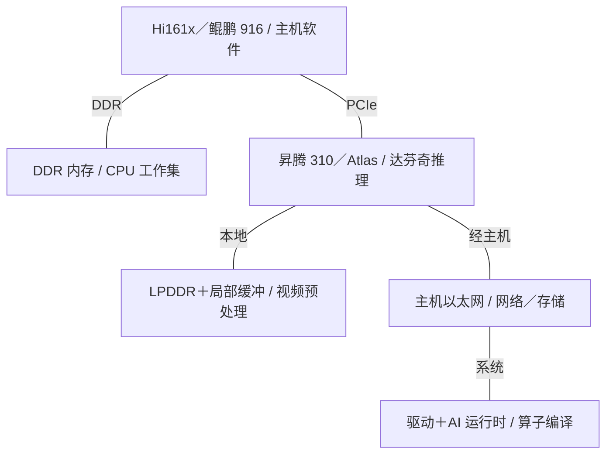
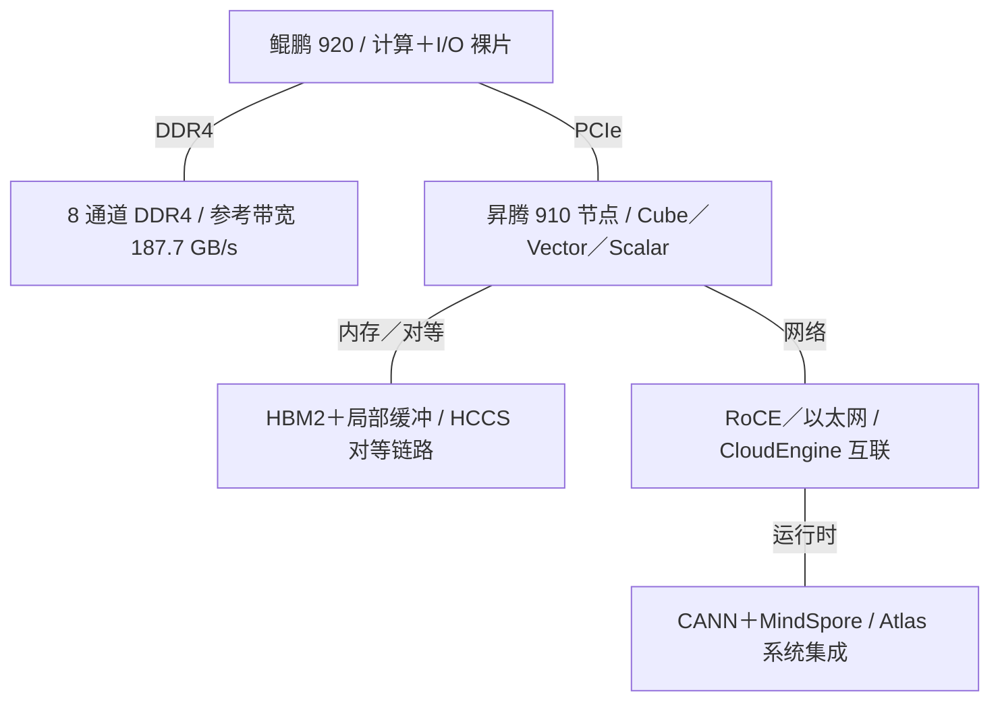
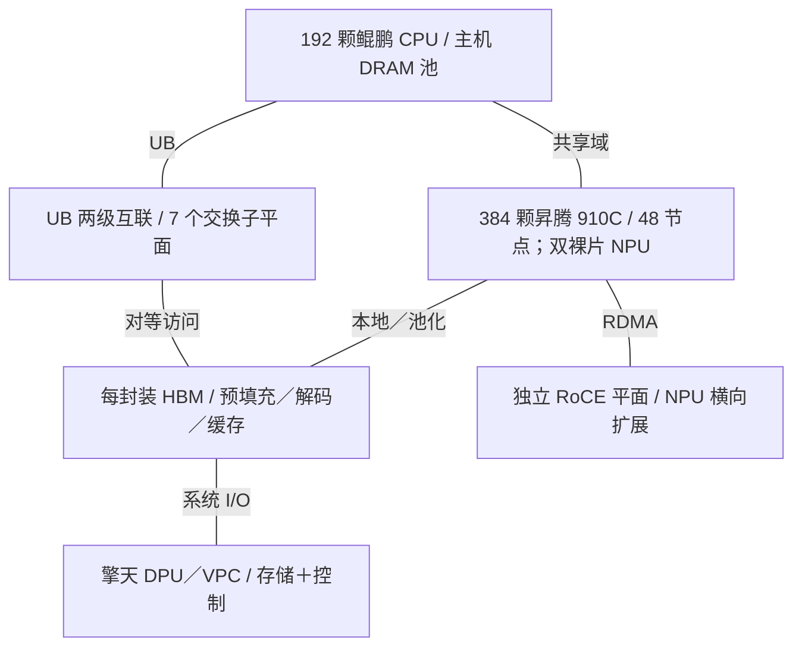
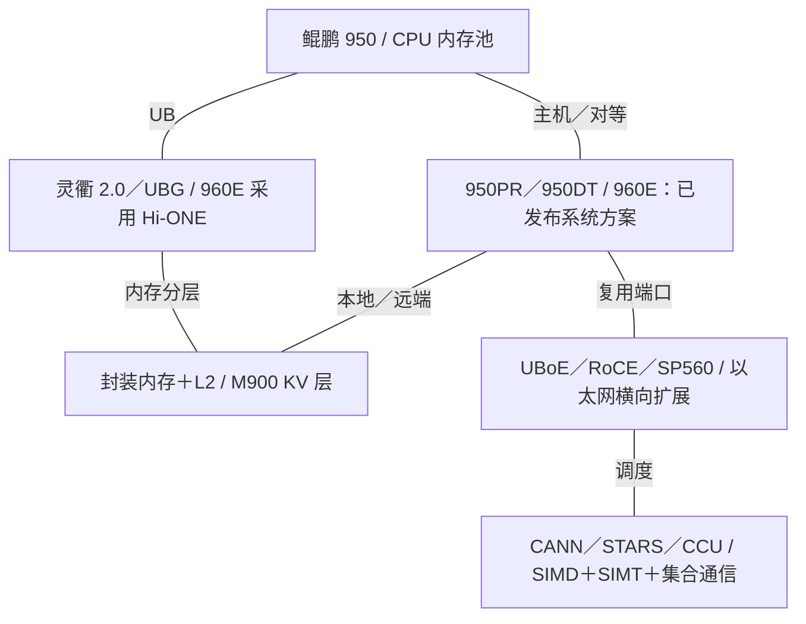

# Huawei AI 基础设施架构演进

2015-2026 | 2026-09-28

## 01 研究范围与核心结论

覆盖：深入研究鲲鹏主机 CPU、昇腾 NPU；完整梳理灵衢、DPU、AI 网卡、系统和软件的代际演进。
时间：2015 年至 2026 年 9 月 28 日；最新核验活动为 2026 年华为全联接大会。
重点：架构、实现，以及计算、内存和通信之间的平衡。
关联产品：解释服务器技术栈所需的 Atlas 边缘推理、海思网络芯片、光引擎和 KV 缓存存储。
不包含：完整的麒麟手机、消费 GPU、通信基带或存储硬盘目录，以及未经证实的制造与产能估计。

华为基础设施的演进围绕三个架构选择展开。首先是自研 Arm 服务器核心与可复用的计算、I/O 裸片，2019 年鲲鹏 920 是这一阶段的代表。其次，昇腾将矩阵、向量、标量工作分离，把显式数据搬运放在性能优化的中心。第三，系统边界从一台服务器扩展到通过交换网络连接的 CPU、NPU 与内存资源池。CloudMatrix384 将第三个选择落地；昇腾 950 和灵衢 2.0 进一步加入专用通信引擎与更灵活的内存语义。

当前最完整的技术披露是昇腾 950 架构白皮书：两颗计算裸片、两颗 I/O 裸片，最多 36 个矩阵核心与 72 个向量核心，封装内一致性内存组织，以及最高 128 MB 的加速器 L2。PR、DT 两条分支针对工作负载，在内存成本与带宽之间作出不同选择。PR 面向预填充和推荐，DT 面向训练与复杂推理。Atlas 350 是一个具体的 950PR 加速卡配置，不能代表整个芯片家族的最高规格。

2026 年 9 月路线图将昇腾 960DT 就绪时间提前到 2027 年第一季度，960PR 提前到第三季度。Atlas 960E 是已经发布的 4096 NPU、液冷、NPO 系统方案；发布本身不等于 960 芯片已全面商用。工程方向很明确：光互联距离、集合通信卸载，以及 HBM、CPU 内存和 KV 存储的分层，越来越决定模型的有效吞吐。与此同时，近期鲲鹏核心内部结构、制造工艺及系统实测功耗的公开程度，仍低于昇腾编程模型与系统拓扑。

### 旗舰里程碑与可比指标

| 里程碑 | CPU／内存 | 加速器矩阵 BF16／FP8 | 加速器内存 | 纵向扩展范围 |
| --- | --- | --- | --- | --- |
| 2019 | 鲲鹏 920：64 核；DDR4 187.7 GB/s | 昇腾 910：BF16 n/d；FP16 256 TFLOPS | 4 个 HBM2 堆栈；约 1.2 TB/s | HCCS 加速器节点 |
| 2025 | CloudMatrix384：192 颗鲲鹏 CPU | 910C 参考：支持 BF16；已审阅系统论文未给峰值 | 每 NPU：2 颗计算裸片、8 个内存堆栈 | 384 NPUs |
| 950PR | NPU 最大配置集成 8 核／16 线程 Linx816 | 432 / 865 TFLOPS | 最高 128 GB；1.6 TB/s | 架构域支持 8192 卡；产品配置不同 |
| 950DT | 主机鲲鹏 950：64／96 核服务器配置 | 486 / 973 TFLOPS | 144 GB; 4 TB/s | 架构域支持 8192 卡；产品配置不同 |
| 960 / 960E | 鲲鹏内存池与 NPU 域协同 | 已公布 960E 系统：FP8 8 EFLOPS | 每系统最高 1 PB | 4,096 NPUs |

## 02 数值口径与产品命名

带宽采用十进制 GB/s、TB/s。以太网 Gb/s 除以八得到单向原始字节速率，仍需扣除编码、报文和协议开销。只有资料明确标为双向汇总时，才将其折半。峰值算力按一次乘加两次运算计；矩阵核心算力与 Cube、Vector 合计算力分开列出，不引入稀疏倍率。精度名称保持原样：FP16 不等于 BF16，INT8 不等于 FP8，MXFP4 也不能与任意四比特格式互换。

昇腾是处理器家族，达芬奇是架构，Atlas 是硬件产品，CloudMatrix 是系统／云架构。鲲鹏是 CPU 家族；TaiShan 也用于服务器命名，而 TaiShan V110 指 920 的核心。Unified Buffer 与 UnifiedBus 均缩写为 UB：前者是 AI 核内部存储，后者是系统互联。表格中的 n/d 表示已审阅资料未确定该项规格，不表示数值为零，也不证明不存在该功能。

参考资料通过文末来源映射对应各章。Hot Chips 2019 提供初代达芬奇组织结构，HPCA 2021 工业论文及华为公开技术文集补充编程和实现背景，IEEE Micro 的鲲鹏论文提供 CPU 内部细节。IEEE Micro 是期刊，不是 MICRO 会议。ASPLOS、MICRO、ISCA 的相关研究单独归类，不把实验性方案当成已商用电路。已公布能力、架构上限与实际部署配置始终保持各自口径。

## 03 主机 CPU 代际总表

### 鲲鹏：参考配置与披露边界

| 代际／参考 SKU | 代号 | 正式商用 | 状态 | 核心微架构 | 核心／线程 | 各裸片工艺 | 裸片／封装 | 每核 L2 | L3／共享域 | 内存：通道；速率；GB/s | 插槽／互联 | PCIe／CXL | TDP | 向量／矩阵 ISA |
| --- | --- | --- | --- | --- | --- | --- | --- | --- | --- | --- | --- | --- | --- | --- |
| Hi1610／Hi1612 基线 | Hi1610 / Hi1612 | 2015 年驱动记录；GA n/d | 历史已商用 | n/d | n/d | n/d | n/d | n/d | n/d | n/d | n/d | n/d | n/d | n/d |
| Kunpeng 916 | Hi1616 | 2019 年以前代际 | 历史已商用 | n/d | 32 / 32 | 16 nm | n/d | n/d | n/d | DDR4；4 通道；2400 MT/s；76.8 GB/s | 双路主板 | PCIe 3.0; CXL n/a | n/d | Arm NEON |
| Kunpeng 920 | Hi1620 | 2019 | 历史已商用 | TaiShan V110 | 64 / 64 | 计算 7 nm；I/O 16 nm | 2 计算＋1 I/O；CoWoS 参考实现 | 512 KiB | 64 MB；分片，约 1 MB／核 | DDR4；8 通道；2933 MT/s；187.7 GB/s | 双路／四路；HCCS | PCIe 4.0 ×40; CXL n/a | 论文参考配置 200 W | 128-bit NEON |
| 鲲鹏 920 新型号 | n/d | 当前主板产品线；GA n/d | 已商用／可获取 | n/d | SMT2；此处 SKU 核数 n/d | n/d | n/d | n/d | n/d | DDR5；通道／带宽 n/d | 双路／四路主板 | PCIe 5.0; CXL n/d | n/d | n/d |
| Kunpeng 950 | n/d | 2026 上半年服务器资料 | 已商用／可获取 | n/d | 每插槽 64／96 核；SMT2 | n/d | n/d | n/d | n/d | DDR5 RDIMM 7200／MRDIMM 8800；通道 n/d | 双路参考主板 | n/d | n/d | n/d |
| 鲲鹏 950 更高配置 | n/d | 2025 年路线图；GA n/d | 路线图 | n/d | 192 / 384 | n/d | n/d | n/d | n/d | n/d | n/d | n/d | n/d | n/d |

## 04 2015-2019：从服务器 Arm 到鲲鹏 920

2015 年 Linux HNS 驱动提交记录确立了 Hi1610、Hi1612 这一早期服务器平台基线。随后鲲鹏 916 采用 32 个 Arm 核和 DDR4 平台。这一代的意义在于平台集成：启动固件、网络驱动、内存验证与操作系统适配，为后续自研核心服务器奠定基础。它提供了必要背景，但已审阅的平台资料并未证明它与鲲鹏 920 的自研 V110 采用相同核心实现。

鲲鹏 920 的 TaiShan V110 是乱序 Arm 核，采用四指令宽的前端／分发组织和多级分支预测结构。公开设计提供独立的 64 KiB 指令、数据 L1，以及每核 512 KiB 私有 L2。浮点／向量单元支持 128 位 NEON 运算；不能因为执行 Arm 指令集，就把 Neoverse 或 SVE 特征套用到它上面。公开资料并未完整给出重排序缓冲、调度器、访存队列及预测器的容量。

64 核配置的末级缓存平均约为每核 1 MB。标签与分布式数据切片连接片上互联，论文围绕归属代理组织一致性，而不是采用一个集中式大缓存。双环互联强调可预测服务与吞吐。这些细节决定缓存未命中在哪里处理、内存流量如何跨计算裸片，因此持续性能不能只看缓存容量总和。

高端参考实现将两颗 32 核、7 nm 计算裸片与一颗 16 nm 计算 I/O 裸片组合。论文描述了 CoWoS 封装与约 400 GB/s 的一致性裸片互联，但没有明确带宽方向，因此本报告不将其折半。单计算裸片的 Lite 配置体现了复用策略。计算、I/O 可分别选择工艺，同类 I/O 构件也用于其他海思产品。代价是封装链路、内存放置与 NUMA 策略成为一级设计问题。

八个 64 位 DDR4-2933 通道提供理论 187.7 GB/s，64 核时平均每核 2.93 GB/s。CPU 同时提供 PCIe 4.0 与集成高速以太网选项。技术资料讨论了 UMA、NUMA 两种呈现模式；统一地址空间并不意味着访问所有物理内存的时延相同。在 AI 系统中，其实际职责主要是数据准备、编排、网络和内存暂存，密集矩阵工作则交给昇腾。

## 05 新款 920 与鲲鹏 950：平台演进

当前主板产品线明确区分“鲲鹏 920 新型号”和原 DDR4 产品。新型号主板支持双线程、DDR5、PCIe 5.0，并提供双路与四路配置。因此，920 品牌覆盖了实质不同的平台。不能把原 V110 的核心／缓存披露与新版主板的内存、I/O 合并，再把它当成一个资料完整的单一 SKU。

2026 年上半年鲲鹏 950 主板资料比早期路线图更具体：双处理器、64 或 96 核选项，2.3 GHz 基准频率并支持 Turbo，最多 24 条 DIMM，DDR5 RDIMM 最高 7200 MT/s、MRDIMM 最高 8800 MT/s。3 TB 容量属于双路系统配置。24 个 DIMM 插槽不能推导出每处理器 12 个内存通道，因为资料未给出通道与插槽映射。

平台强调 Arm CCA、安全设备访问、可信度量与 RAS，包括故障核心的在线处理。当 CPU 承载多租户 AI 服务、或向其他处理器提供内存时，这些能力尤为重要，但不能据此推定每条外部 NPU、网卡和软件路径都具备机密计算保证。早期公布的 192 核／384 线程 950 配置，在没有匹配的商用 SKU 与系统资料前，仍单列为路线图项。

鲲鹏的新角色超出了通过 PCIe 为加速器提供数据。CloudMatrix 及后续 Peerium 架构把 CPU 所连内存作为更大计算域的资源，可改善嵌入表、KV 状态和智能体沙箱的容量利用率。但局部性仍然重要：远端带宽、同步、所有权和故障恢复都需要运行时处理。大内存池首先是容量资源，不能直接替代本地 HBM 带宽。

## 06 昇腾代际比较

### 昇腾 NPU：明确芯片与加速卡口径

| 产品 | 架构 | 商用／里程碑 | 状态 | 工艺 | 裸片／封装 | 计算单元 | 稠密 BF16 | 稠密 FP8 | 稠密 FP6／FP4 | FP64 向量／矩阵 | 内存：类型；堆栈；GB；TB/s | 末级缓存／SRAM | 纵向扩展：链路；单向 GB/s；域 | 主机连接 | 功耗／散热 | 形态 |
| --- | --- | --- | --- | --- | --- | --- | --- | --- | --- | --- | --- | --- | --- | --- | --- | --- |
| Ascend 310 | DaVinci | 2018 | 历史已商用 | 12 nm | n/d | 2 个 AI 核 | n/d | n/d | n/d | n/d | 外部 LPDDR；依板卡 | n/d | n/d | PCIe | 芯片 8 W | 芯片／Atlas 模组 |
| Ascend 910 | DaVinci | 2019 | 历史已商用 | 计算裸片 N7+；其他裸片工艺 n/d | 计算＋Nimbus I/O＋4 HBM2＋填充裸片 | 32 个 AI 核 | n/d；FP16 256 TFLOPS | n/d | n/d | n/d | HBM2；4 堆栈；容量依 SKU；约 1.2 TB/s | HC 演讲：L2 互联 4 TB/s | 3×240 Gb/s HCCS；方向 n/d | PCIe 4.0 | HC 目标 350 W；发布值 310 W | Atlas 加速器／服务器 |
| Ascend 310P | 推理分支 | Atlas 300I Pro／Duo 代际 | 历史已商用 | n/d | n/d | n/d | n/d | n/d | n/d | n/d | LPDDR；依配置 | n/d | n/d | PCIe | n/d | 推理卡／边缘系统 |
| Ascend 910B2 / A2 | DaVinci | 2023 年前后 A2 系统 | 历史已商用 | n/d | n/d | 24 AIC + 48 AIV | 支持；SKU 峰值 n/d | n/d | n/d | n/d | ENEC 的 910B2 测试系统为 64 GB HBM；速率 n/d | n/d | HCCS；依配置 | PCIe | n/d | Atlas A2 服务器／模组 |
| Ascend 910C / A3 | DaVinci | 2025-03 | 已商用／可获取 | n/d | 2 计算裸片；8 内存堆栈 | 48 AIC + 96 AIV | 支持；R02 未给峰值 | INT8 路径；原生 FP8 未确定 | n/d | n/d | 8 堆栈；R02 未给容量／速率 | n/d | 每裸片 7 个 UB 收发器；384 NPU 域 | 鲲鹏／UB 系统 | n/d | Atlas 900 A3／CloudMatrix384 |
| Ascend 950PR | DaVinci 3 | 2026；Atlas 350 产品 | 已商用／可获取 | n/d | 2 AI＋2 I/O 裸片；8 内存模组 | 32 AIC + 64 AIV | 432 TFLOPS | 865 TFLOPS | MXFP4 1730 TFLOPS；FP6 n/d | n/d | 128 GB；1.6 TB/s；堆栈代际 n/d | 128 MB | 18 个 ×4 端口；每链路原始单向 56 GB/s；复用前单向合计 1008 GB/s | PCIe 5.0 ×16 | n/d | 芯片；多种配置 |
| Atlas 350 | 950PR / DaVinci 3 | 2026 年产品目录 | 已商用／可获取 | n/d | 950PR 加速卡配置 | 28 AIC + 56 AIV | 378 TFLOPS | 756 TFLOPS | MXFP4 1513 TFLOPS | n/d | 112 GB HBM; 1.4 TB/s | 112 MB | 4 卡：每卡单向 159 GB/s；2 卡：每卡单向 212 GB/s | PCIe 5.0 ×16 | ≤600 W；被动散热 | PCIe OH FL DW |
| Ascend 950DT | DaVinci 3 | 2026 已列系统；早期目标 Q4 | 已列产品；芯片 GA 日期 n/d | n/d | 2 AI＋2 I/O 裸片；4 内存模组 | 36 AIC + 72 AIV | 486 TFLOPS | 973 TFLOPS | MXFP4 1946 TFLOPS | n/d | 最高 144 GB；4 TB/s；另有 96 GB 配置 | 128 MB | 18 个 ×4 端口；每链路原始单向 56 GB/s；复用前单向合计 1008 GB/s | PCIe 5.0 ×16 | n/d | 芯片；多种配置 |
| Ascend 960DT / PR | n/d | DT 2027 Q1；PR 2027 Q3 就绪 | 路线图 | n/d | n/d | n/d | n/d | n/d | n/d | n/d | n/d | n/d | n/d | n/d | n/d | 未来芯片；Atlas 960E 系统已发布 |

950 表格采用仅 Cube 算力：芯片取公开最高配置，Atlas 350 取实际的 28 Cube 配置。Atlas 350 产品页宣传 BF16 425 TFLOPS、MXFP8／HiF8 804 TFLOPS、MXFP4 1561 TFLOPS，口径为 Cube 与 Vector 合计；白皮书对应 Cube 数值分别为 378、756、1513 TFLOPS。两者是统计口径不同，并不矛盾；混合引擎峰值也不一定能由一个 GEMM 内核同时实现。

## 07 2018-2021：达芬奇与首代昇腾系统

初代达芬奇将标量控制、向量运算和 Cube 矩阵引擎分离。16×16×16 的 FP16 计算包含 4096 次乘加，通常计为每周期 8192 次浮点运算。要达到这一峰值，必须通过局部缓冲分块并复用操作数。MTE 数据搬运引擎、L1、L0 操作数／结果缓冲与 Unified Buffer 组成显式管理的层级。编程的核心是让搬运、矩阵计算和向量后处理重叠执行。

昇腾 310 将该架构用于约 8 W 的推理芯片，包含两个 AI 核，最高提供 INT8 16 TOPS 或 FP16 8 TFLOPS。Atlas 模组与板卡把推理、视频预处理和主机集成结合起来。与数据中心产品一同讨论 310，是为了说明局部缓冲和算子编程模型如何跨功耗范围延续。采用达芬奇模块的手机 SoC、后续 310P 边缘产品延展了这一谱系，但其 CPU 与内存子系统属于不同产品。

昇腾 910 扩展到 32 个 AI 核，封装包含一颗 456 mm² 计算裸片、一颗 I/O 裸片和四个 HBM2 堆栈。Hot Chips 演讲展示了 6×4 片上网格、约 1.2 TB/s 外存带宽，以及 HCCS 和以太网接口。计算裸片面积不能与封装内所有裸片面积之和混淆。同场演讲中“逻辑＋3D SRAM＋十二个 HBM”的构想属于前瞻封装示意，并不是商用 910 配置。

Hot Chips 使用 350 W 设计目标，而 2019 年 8 月发布时给出的最大功耗为 310 W，对应 FP16 256 TFLOPS、INT8 512 TOPS。差异属于披露更新，不能把 310 W 套到所有后续 910 板卡。HPCA 2021 工业论文解释了软硬件栈如何覆盖多种 AI 场景。综合这些资料，可以还原早期架构全貌：专用执行单元、显式控制的存储、异构封装，以及负责调度并行引擎的编译器和运行时。

## 08 从 A2 到 A3：加速器节点走向计算资源池

Atlas A2 产品与 910B 家族构成中间一代服务器平台。处理器后缀、启用核心、内存配置和服务器名称各不相同，不能用一张非官方规格表替代具体产品文档。ISCA 2026 ENEC 论文明确其 910B2 测试设备配置为 24 个 Cube、48 个 Vector 单元及 64 GB HBM，为这一较大的产品家族提供了固定参考。ASPLOS 2025 研究的价值在于测量昇腾算子行为，并构建组件级 Roofline 模型，说明仅看矩阵峰值会忽略串行阶段、流水线失衡，以及计算与数据搬运的干扰。这属于产品特征分析和优化研究，而不是另一款下一代芯片的发布。

华为将 Atlas 900 A3 交付起点定为 2025 年 3 月，并明确其加速器为昇腾 910C。CloudMatrix384 论文描述了对应的双计算裸片、八内存堆栈 NPU 封装。每裸片有 24 个矩阵核心、48 个向量核心、七个纵向扩展收发器，以及独立的横向扩展接口；因此每封装为 48 个矩阵、96 个向量核心。这里的矩阵引擎、计算裸片、NPU 封装与服务器节点是四种不同计数单位。

CloudMatrix384 包含 48 个计算节点，每节点配置八颗 NPU、四颗鲲鹏 CPU 和七颗板载 UB 交换芯片，合计 384 NPU、192 CPU。十二个计算柜与四个通信柜承载两级互联；公开拓扑用七个独立交换子平面连接节点，第二级没有带宽超售。CPU、NPU 共享 UB 纵向扩展平面，NPU 横向扩展使用独立 RoCE 平面，擎天 DPU 提供 VPC 和面向存储的平面。已披露系统并未把三个平面全部合并成一个物理网络。

CloudMatrix-Infer 分离预填充、解码与缓存资源，并用大规模专家并行域承载混合专家模型。论文报告了 DeepSeek-R1 结果：4K 提示下每 NPU 预填充 6688 token/s；4K 缓存、每输出 token 时延低于 50 ms 时，解码为每 NPU 1943 token/s；更严格的 15 ms 条件下为 538 token/s。这些是采用特定量化和调度策略的厂商端到端测试，体现吞吐／时延工作点的重要性，不能与芯片 FLOPS 或条件不一致的 GPU 测试直接互换。

## 09 昇腾 950：计算、内存与通信协同设计

950 封装将两颗 AI 裸片与两颗 I/O 裸片分离。PR 使用八个内存模组，DT 使用四个更高带宽模组。最大物理组织包含 36 个 AI 子系统，每个包含一个 Cube、两个 Vector 核；不同商业配置启用的计算与内存资源不同。八个支持双线程的 Linx816 Armv8-A CPU 核负责本地控制与 CPU 算子，其私有缓存与加速器 L2 分开，封装内硬件一致性连接 CPU 与 AI 核的内存视图。

达芬奇第三代强化了矩阵乘法周围的工作。基于寄存器的向量执行、双发射以及 SIMD／SIMT 函数块，分别服务逐元素运算、gather/scatter 和分支较多的代码。SIMD 仍是主要吞吐模式；SIMT 改善不规则内核，并不意味着整个 NPU 变成传统 GPU。Cube 到 Vector 的直连通路及结果搬运中的格式转换，减少了共享存储往返；N 维 DMA 提供感知布局的搬运，降低张量分块与重排成本。

公开的每 AI 核存储包括 512 KB L1、各 64 KB 的 L0A 和 L0B、256 KB L0C，以及 512 KB Unified Buffer。全局加速器 L2 最高 128 MB；512 字节缓存行划分为 128 字节扇区，使小粒度离散访问不必总搬运完整缓存行。软件可使用分配提示和驻留控制。双裸片一致性没有消除局部性：白皮书明确保留本地亲和性，因此调度和分块仍应减少不必要的跨裸片搬运。

72 条 112 Gb/s SerDes 通道组成 18 个 ×4 端口。每端口原始单向带宽为 56 GB/s，全部端口单向合计 1008 GB/s，华为给出的双向值为 2016 GB/s。其中四个端口可改作 PCIe 5.0 ×16，两个端口可改作两路 400 Gb/s UBoE。这些模式复用物理资源，因此不能把最大 UB、PCIe、以太网带宽当成三组独立引脚直接相加。跨机框速率还可能受到光模块限制。

STARS 2.0 负责异构引擎调度与同步；CCU 执行集合通信任务，减少每次传输和归约都占用 AI 核的需要。URMA 提供异步远端内存／消息操作，UB Memory 提供同步 load/store/atomic 语义，两者互补。芯片接口公开的 128 TB 访问能力、8192 卡架构域，以及某款超节点宣传的地址空间，分别属于不同范围的限制，不能合并成一个数字。

Atlas 350 说明芯片最大值必须转换成板级拓扑再分析。其 112 GB HBM 带宽为 1.4 TB/s，板卡最大功耗 600 W。四卡全互连时，每卡使用三个 ×4 UB 端口，双向 318 GB/s；双卡时使用四个端口，双向 424 GB/s，折合单向分别为 159、212 GB/s。这两者都明显低于完整芯片 I/O 上限，因为板卡采用不同的端口分配与物理链路配置。

## 10 960 及后续：路线图更新与光互联系统

2025 年发布将 950PR 定于 2026 年第一季度、950DT 定于第四季度，并公布后续 960 代际；当时 Atlas 950 的设计点是 160 柜、8192 加速器。2026 年 7 月 WAIC 则披露一种具体的 1024 卡 Atlas 950 配置，提供 FP8 1 EFLOPS、FP4 2 EFLOPS 和 256 TB 统一地址空间。后续白皮书仍支持 8192 卡架构域。这些数值分别属于路线图设计点、具体系统配置与架构上限，不应强行合并为同一个产品规格。

2026 年华为全联接大会将 960DT 就绪时间提前三个季度至 2027 年第一季度，960PR 提前一个季度至第三季度，并公布 2028 年的 970 与 2029 年的 980。Atlas 960E 将 4096 颗 NPU、Hi-ONE 近封装光引擎和液冷结合，宣传系统峰值为 FP8 8 EFLOPS、FP4 16 EFLOPS，HBM 最高 1 PB。系统发布、测试里程碑、芯片就绪和广泛客户可用，应分别跟踪。

## 11 纵向扩展链路与内存语义

### 互联谱系与带宽方向归一化

| 互联 | 年份／代际 | 通道速率 | 每链路通道 | 每链路单向 GB/s | 每设备链路 | 拓扑 | 域规模 | 一致性／语义 |
| --- | --- | --- | --- | --- | --- | --- | --- | --- |
| Kunpeng 920 D2D | 2019 | n/d | n/d | 公布合计 400 GB/s；方向 n/d | n/d | 计算／I/O 芯粒连接 | 处理器封装 | 封装内一致性互联 |
| Ascend 910 HCCS | 2019 | n/d | n/d | 每链路公布 240 Gb/s＝30 GB/s；方向 n/d | 3 | 依板卡／系统 | n/d | 加速器通信；不推定通用 CPU 一致性 |
| UnifiedBus 1.0 | 2025 | n/d | n/d | n/d | 每 910C 裸片 7 收发器 | 两级交换；7 子平面 | 384 NPUs | 对等访问；CPU／NPU 内存池 |
| UnifiedBus 2.0 / 950 | 2026 | 112 Gb/s | 4 | 原始 56；每设备合计 1008 | 18 | n 维网格／Clos | 8,192 NPUs | URMA；load/store/atomic；封装内一致性另有说明 |
| Atlas 350 UB | 2026 | n/d | 4 | 按板卡双向值换算为 53 | 四卡网格用 3；双卡模式用 4 | 全互连／双卡 | 4 / 2 cards | 板级 UB 链路 |
| 950 UBoE | 2026 | n/d | n/d | 每 400G 端口原始 50 | 2 | 以太网互联 | 集群架构超过 128K 卡 | 以太网承载 UB；占用复用端口 |
| 2026 UB optical device | 2026 | 1.6 Tb/s per port | n/d | 每端口原始 200；280T 合计方向口径未给 | 176 | 跨柜光互联 | 依系统 | 灵衢；公布 RTT 2 µs |

共享地址范围只是内存系统的一部分，协议还必须定义顺序、原子操作、可缓存性、同步、权限和故障行为。昇腾 950 明确描述了计算裸片之间及 CPU／AI 子系统之间的缓存一致性，但这不足以证明整个超节点每个端点都采用统一的 CPU 式缓存一致性。URMA、UB Memory、UBoE 应分别按自身语义与软件使用路径评估。

## 12 DPU、网卡与 AI 通信路径

### 网络产品与基础设施卸载

| 产品 | 商用／里程碑 | 状态 | 类别 | 端口×速率 | SerDes | 主机接口 | 可编程引擎 | 嵌入式 CPU | 板载内存 | 传输／RDMA | 拥塞控制 | 主要卸载 | 功耗 |
| --- | --- | --- | --- | --- | --- | --- | --- | --- | --- | --- | --- | --- | --- |
| SP681 | 当前产品线；GA n/d | 已商用／可获取 | NIC | 2 ×25GE | n/d | PCIe 3.0 ×8 | n/d | n/d | n/d | RoCE v2 | PFC / ETS | 校验和；虚拟化；网络卸载 | n/d |
| SP670 | 当前产品线；GA n/d | 已商用／可获取 | NIC | 2 ×100GE | n/d | PCIe 4.0 ×16 | Hi1822；引擎 ISA n/d | n/d | n/d | RoCE v2 | PFC / ETS | 虚拟化与网络卸载 | n/d |
| SP680 / SP623Q | 当前产品线；GA n/d | 已商用／可获取 | 网卡／智能网卡 | 4 ×25GE | n/d | PCIe 4.0 ×16 | Hi1822；DPU Solution 生态 | n/d | n/d | 以太网；RoCE 依型号 | PFC / ETS | OVS／DPI／虚拟化生态 | n/d |
| SP923Q / SP900 | 当前产品资料；GA n/d | 已商用／可获取 | DPU | 4 ×25GE | n/d | PCIe 4.0 ×16 | DPAK | Hi1822; 24 cores | 32 GB DDR4-2400; 4 channels | 以太网；存储／网络卸载 | PFC / ETS | 裸金属网络／存储；管理 | n/d |
| 擎天卡 | 2025 年系统披露 | 已商用／可获取 | 云基础设施 DPU | n/d | n/d | n/d | n/d | n/d | n/d | VPC／以太网；UB 集成依平台 | n/d | 虚拟化、I/O 卸载、隔离、可信 | n/d |
| SP230 | WAIC 2026 | 已公布；GA n/d | 标准网卡 | 25-200GE 家族；端口数 n/d | n/d | n/d | n/d | n/d | n/d | Ethernet | n/d | 主机网络 | n/d |
| SP560 AI NIC | WAIC 2026 | 已公布；GA n/d | AI 网卡 | 公布 800G；端口映射 n/d | n/d | UnifiedBus + PCIe | 协议可编程；ISA n/d | n/d | n/d | RDMA | n/d | 直访 NPU／GPU 内存；集合通信聚合下发 | n/d |

华为网络产品有三类不同职责。标准或智能网卡连接主机，可卸载报文处理；DPU 将基础设施服务和信任边界从租户 CPU 中移出；AI 网卡优先处理加速器通信、直接内存访问和集合通信下发。网络交换机与 UB 纵向扩展交换芯片又属于另外的产品。共享海思 IP 或软件接口，并不意味着这些类别可以互换。

SP923Q 是一个规格明确的 SP900 家族 DPU：24 核 Hi1822、四通道 DDR4-2400 与 32 GB ECC 内存、PCIe 4.0 ×16、四个 25GE 端口。两块小容量 M.2 盘支持本地运行环境，DPAK 提供网络、存储与计算加速接口。资料要求 12 V、8 A 供电，这不等于声明了 96 W TDP。其主机链路原始容量也高于四路 25GE，说明 PCIe 配置与外部网络吞吐是不同约束。

2026 年 SP560 发布增加了支持灵衢、PCIe 主机连接的 800G AI 网卡。已披露的主要差异是直访加速器内存与可编程协议处理，公开活动记录没有提供完整端口映射、SerDes 数量、嵌入式核数或板卡功耗。因此，800G 保持为家族公布速率，不臆造两端口或四端口配置；也不能与恰好复用 SP560 标识的存储产品混淆。

## 13 以太网交换、光互联与 KV 存储

CloudEngine 16800 在 2019 年引入高密度 400GE 数据中心平台，2023 年 CloudEngine 16800-X 披露将产品线推进到 800GE。当前 XH16800 文档描述了机框交换结构、信元交换、ECMP、AI ECN 和 PFC 死锁预防。这些功能管理以太网中的拥塞和转发，不能与单颗交换 ASIC 的端口数或 UB 加速器域的带宽混为一谈。XH16800 资料中“演进到 800GE”的措辞予以保留，不把每款已列线卡都写成已经支持 800GE。

2026 年 9 月灵衢系统发布引入了 176 端口、每端口 1.6T 的光互联设备，以及 Radix 最高 1024 的 UBG 交换机。前者相乘为 281.6 Tbit/s 端口标称速率，与取整后的“280T”一致，但没有定义双向有效交换容量；后者也不能理解为一颗单片 ASIC 上有 1024 个同等速率端口。机柜、机框、芯片与网络拓扑必须分别计数。

Hi-ONE 单光引擎标称 7.2 Tbit/s，集成光源。960E 的比较方案用 5500 个光引擎替代 48000 个传统 800G 光模块，声称节省超过 550 kW。这是华为给出的拓扑级比较，不是每颗 NPU TDP 的实测下降。NPO 将光学部件放在封装附近，不能直接改称共封装光学。其设计动机是缩短高速电信号传输距离、减少线缆与功耗，同时维持大规模交换域。

OceanStor M900 增加 PB 级 KV 缓存层，华为称为 L3.5，可经灵衢一跳访问。“L3.5”是系统分层名称，不是 CPU 缓存级别。可以将层次理解为：本地 HBM 服务当前计算，CPU 内存容纳更大工作集，共享持久或半持久 KV 层保存可复用上下文。存储可减少重算、改善容量成本，但时延敏感的解码仍取决于有多少有效状态能及时送入 HBM。

## 14 系统代际与部署边界

### 从服务器节点到 SuperPoD、SuperCluster

| 平台 | 年份／里程碑 | CPU／加速器数量 | 纵向扩展域 | 每加速器横向带宽 | 机架功耗 | 散热 |
| --- | --- | --- | --- | --- | --- | --- |
| Atlas 2019 系统 | 2019 | 依配置的昇腾节点 | HCCS 连接节点 | 910 集成 2×100Gb/s 以太网；原始合计 25 GB/s | n/d | 依系统 |
| Atlas A2 | 2023 年前后 | 依服务器／模组 | HCCS；依系统 | n/d | n/d | 依产品风冷／液冷 |
| CloudMatrix384 / Atlas 900 A3 | 2025 | 192 CPU＋384 NPU；48 节点 | 384 NPUs | 每 NPU 裸片独立 RoCE；速率 n/d | n/d | 液冷超节点 |
| Atlas 950 2025 设计点 | 2025 公布、目标 2026 | 8192 NPU；160 柜 | 8,192 NPUs | UBoE／RoCE；依端口分配 | n/d | 液冷 |
| Atlas 950 WAIC 配置 | 2026-07 | 1,024 NPUs | 1,024 NPUs | n/d | n/d | 液冷 |
| Atlas 850E | 2026-07 | 最高 96 卡 | 96 cards | n/d | n/d | 风冷；VCE 相变技术 |
| Atlas 960E | 2026 发布；960 芯片目标 2027 | 4,096 NPUs | 4,096 NPUs | UB 网络／RoCE；每 NPU 速率 n/d | n/d | 全液冷；NPO |
| 鲲鹏超节点更新 | 2026-09 | 最高 4096 节点 | 公布 256 TB 统一内存池 | n/a | n/d | n/d |

支持的最大集群不等于已安装集群。2026 年披露描述了数十万 NPU 的横向扩展拓扑，以及通过多轨网络达到百万规模的路径。其工程意义在于互联层次与距离，本报告不把这些上限当成已经核实的客户装机。同样，可寻址内存池也不一定等于所有节点物理 DRAM 的总和。

## 15 软件演进与研究反馈

### 与硬件对齐的软件能力

| 版本／层次 | 时间 | 对应硬件 | 关键能力 |
| --- | --- | --- | --- |
| CANN／MindSpore 发布 | 2019 | Ascend 310 / 910 | 图编译、算子、运行时与框架 |
| CANN 3.0 | 2020 | Ascend | 扩展开发接口与算子优化 |
| Ascend C | 当前文档 | Ascend AI cores | 显式分块、队列／缓冲管理、计算与搬运流水化 |
| CloudMatrix-Infer | 2025 | CloudMatrix384 | 预填充／解码／缓存分离；专家并行；INT8 内核 |
| CANN / Mind open source | 2025-2026 | Ascend | 编译器／运行时／算子生态开放；框架集成 |
| DaVinci 3 / STARS 2.0 / CCU | 2026 | Ascend 950 | SIMD／SIMT；NDDMA；集合通信卸载；缓存提示；低精度格式 |
| DPAK / QingTian / openEuler | 依代际 | Kunpeng / SP900 / cloud | 主机操作系统、网络／存储卸载与租户隔离 |

Ascend C 暴露了较多机器存储层级，因此内核作者必须理解分块、缓冲生命周期、队列和同步。收益是可以精确重叠搬运与计算；代价是移植算子往往不仅仅是翻译算术表达式。单有框架适配层，不能保证调度、集合通信或量化质量等效。CANN、优化内核、HCCL 类集合通信和推理服务软件需要共同成熟。

学术记录提供机制解释，而不是另一条营销时间线。ASPLOS 2025 的组件级 Roofline 解释算子瓶颈；ISCA 2026 的 ENEC 面向昇腾优化权重无损压缩，包括适合向量执行的解码和依赖消除；MICRO 2025 的 RICH Prefetcher 研究将更丰富的预取信息存放到内存，用容量和带宽换取时延隐藏。ENEC 属于昇腾上的软件／研究，RICH 属于相关 CPU 研究，都不能证明鲲鹏或昇腾已经集成了某个新解压器或预取器。

## 16 带宽层级与派生指标

### 分时期带宽层级：严格区分范围

| 时期／参考产品 | 片内／裸片间 | 内存 | 主机连接 | 每加速器纵向扩展 | 每加速器横向扩展 |
| --- | --- | --- | --- | --- | --- |
| 2015-2018／310 | 显式局部缓冲；速率 n/d | LPDDR；依板卡 | PCIe; n/d | n/d | n/d |
| 2019-2022／910 | L2 互联 4 TB/s；每 AI 核读 128 GB/s＋写 128 GB/s | ~1.2 TB/s HBM2 | PCIe 4.0 | 3×240 Gb/s HCCS；方向 n/d | 2×100 Gb/s 以太网＝原始合计 25 GB/s |
| 2023-2025／910C | 双计算裸片；D2D 速率 n/d | 8 内存堆栈；R02 未给速率 | 鲲鹏／UB | 每裸片 7 UB 收发器；速率 n/d | 每裸片独立 RoCE 接口；速率 n/d |
| 2026／最大配置 950 | 2 AI＋2 I/O；D2D 速率 n/d | PR 1.6; DT 4 TB/s | PCIe 5.0 ×16：标称单向 64 GB/s | 端口复用前原始单向 1008 GB/s | 2×400G UBoE：原始合计 100 GB/s；复用端口 |
| 2026／Atlas 350 卡 | 28 Cube 配置；D2D 速率 n/d | 1.4 TB/s | PCIe 5.0 ×16：标称单向 64 GB/s | 四卡时单向 159 GB/s；双卡 212 | 依服务器网卡 |

### 派生平衡指标：不是应用实测性能

| 参考配置 | 计算 | 结果 | 含义／边界 |
| --- | --- | --- | --- |
| Kunpeng 920 | 8 × 8 × 2.933 / 64 | 2.933 GB/s/core | DDR4 理论数据带宽；未计控制器／工作负载效率 |
| Kunpeng 920 | 64 MB / 64 | 1 MB/core | 共享 LLC 平均预算，不是私有分配 |
| Ascend 910 | 1.2e12 / 256e12 | 0.00469 byte/FP16 FLOP | FP16；不是 BF16 比较 |
| 950PR max | 1.6e12 / 432e12 | 0.00370 byte/BF16 FLOP | 仅 Cube 稠密峰值 |
| 950PR max | 1.6e12 / 865e12 | 0.00185 byte/FP8 FLOP | 仅 Cube 稠密峰值 |
| 950DT max | 4e12 / 486e12 | 0.00823 byte/BF16 FLOP | 每 BF16 FLOP 的带宽为 PR 的 2.22 倍 |
| 950DT max | 4e12 / 973e12 | 0.00411 byte/FP8 FLOP | 仅 Cube 稠密峰值 |
| Atlas 350, 4 cards | 159 / 1400 | 0.114 | 板卡单向纵向带宽／HBM；约 11.4% |
| Atlas 350 | 378 TFLOPS / 600 W | 0.630 TFLOPS/W | BF16 Cube 峰值／最大板功耗；不是实测能效 |

## 17 四个时期的完整技术栈

以下图示呈现部署职责和流量路径。连线表示连接关系，不代表等带宽、全域一致性，也不表示每个可选接口可以同时启用。来源与前述产品章节一致。

### 2015-2018：主机驱动的推理

小型 NPU 为服务器或边缘主机提供加速，此时尚未形成大规模共享加速器域。

### 2019-2022：芯粒与加速器节点

可复用硅模块与显式加速器搬运并存，横向扩展仍主要通过网络完成。

### 2023-2025：CloudMatrix384 资源池化

UB、RoCE、VPC 平面职责不同，CloudMatrix-Infer 将服务阶段映射到池化资源。

### 2026 年披露：分化 NPU 与光互联扩展

图中组合的是产品职责，不表示所有部件已在同一 SKU 中交付；960 芯片仍处于 2027 年路线图。

## 18 工程趋势与披露缺口

华为产品中的芯粒复用早于当前 AI 热潮。鲲鹏 920 分离计算与 I/O 裸片，初代 910 将大计算裸片与 I/O、HBM 组合，950 进一步明确计算／I/O 分工，并按负载配置不同内存子系统。收益是模块化与不同功能的独立优化，代价是封装布线、一致性搬运和更强的放置敏感性。已审阅公开资料没有证明这些商用产品普遍采用 3D 堆叠 SRAM。

低精度提升计算的速度往往快于有效数据供给。950 矩阵路径从 BF16 到 FP8 吞吐翻倍，再到 MXFP4 约翻倍。算术变便宜后，量化、向量处理和布局的重要性上升。更多 HBM 带宽有助于内存受限阶段，而算子融合、将中间数据留在 L0／L1／Unified Buffer，则可能直接消除搬运。因此，下一个瓶颈可能是向量工作、同步或通信，而不是 Cube 阵列。

PR／DT 分化具有明确的量化意义。DT 最大矩阵 BF16 吞吐只比 PR 高约 12.5%，内存带宽却为其 2.5 倍，因此每 BF16 FLOP 对应的内存带宽约为 2.22 倍。这与训练／解码分支每单位算术需要更多数据搬运相吻合。这里是基于公开比例的架构解释，并不保证每种解码负载都加速 2.22 倍。

更大的纵向扩展域为混合专家模型提供更多总内存和专家放置选择，同时提高了对网络对分带宽、尾时延、光器件可靠性和故障隔离的要求。数千 NPU 的域不能仅靠芯片峰值相乘来评价。最有说服力的证据应同时提供同一负载下的模型吞吐与时延、整机功耗、恢复行为及确切拓扑；华为各代公开资料尚未均匀覆盖这些指标。

这一架构的收益更多来自减少无效搬运，而不是把全部资源统称为“内存”。池化扩大容量、增加调度自由度，同时引入排队、放置、持久性和恢复问题。光集成缩短电连接距离、减少线缆负担，却需要热、机械与可维护性设计。这些都是系统级权衡，应结合工作负载轨迹和故障行为评估，而不能只看一个汇总带宽数字。

实现资料的公开程度并不均衡。早期 Hot Chips 和鲲鹏技术论文披露了裸片划分、核心细节；ISSCC 则有可明确识别的高速有线电路论文，包括华为 60 Gb/s PAM4 ADC-DSP 收发器，但已审阅一手资料没有证明该电路就是某款鲲鹏或昇腾的 SerDes。近期 NPU 文档较充分地公开编程与内存机制，制造节点、良率、封装产能、晶体管数和许多功耗指标仍未公开。因此，制造限制应作为限制来讨论，不能用未注明来源的拆解传言填空。

开放软件与发布协议有助于扩大采用，但生态兼容性仍是工程属性，取决于内核覆盖、编译质量、集合通信行为、设备管理，以及互联协议的许可与实现状态。CANN、自有系统互联、云服务和合作伙伴主板使华为形成越来越完整的技术栈。差异化在于这些层次的协同；仍需进一步比较的是，协同最终能以多少成本和功耗换取有效负载性能与运行韧性。

## 19 会议与产品对应索引

### 已核验披露与相关研究

| 会议／活动 | 年份 | 论文／演讲／披露 | 报告人／作者 | 产品 | 证据类型 | 来源 |
| --- | --- | --- | --- | --- | --- | --- |
| Hot Chips 31 | 2019 | DaVinci: A Scalable Architecture for Neural Network Computing | Heng Liao; Jiajin Tu; Jing Xia; Xiping Zhou | Ascend 310 / 910 | 架构、裸片／封装、内存、链路 | C01 |
| HPCA industry track | 2021 | Ascend 可扩展统一神经网络计算架构 | Heng Liao et al. | Ascend / DaVinci | 产品架构；阅读厂商重印版本 | C04 / P01 |
| IEEE Micro journal | 2021 | HiSilicon Kunpeng 920: First 7-nm Chiplet-Based 64-Core Server CPU With Arm Ecosystem | Jing Xia；Chuanning Cheng；Xiping Zhou；Yuxing Hu；Peter Chun | Kunpeng 920 | 核心、缓存、裸片划分；期刊而非 MICRO 会议 | P01 / C02 |
| ISSCC | 2019 | 6.2: 60Gb/s PAM-4 ADC-DSP Transceiver; 7nm; adaptive power scaling | M.-A. LaCroix et al., Huawei Ottawa | 高速有线 IP；未证明具体产品采用 | 电路；会议程序公布 32 dB 损耗下 6.9 pJ/b | C05 |
| ASPLOS | 2025 | Squeezing Operator Performance Potential for the Ascend Architecture | Yuhang Zhou et al. | Ascend | 算子特征分析与优化研究 | R01 |
| MICRO | 2025 | RICH Prefetcher: Storing Rich Information in Memory to Trade Capacity and Bandwidth for Latency Hiding | Ningzhi Ai et al. | 相关 CPU 研究 | 研究；未确认鲲鹏采用 | R06 |
| ISCA | 2026 | ENEC: A Lossless AI Model Compression Method Enabling Fast Inference on Ascend NPUs | Jinwu Yang et al. | Ascend 910B2 study | 模型压缩研究 | R03 / R05 |
| R-CCS Symposium | 2020 | 鲲鹏平台演讲 | Zhaohui | Hi161x／鲲鹏 916／920 | CPU 路线图与平台；包含历史未来目标 | C03 |
| Huawei Developer Conference | 2025 | CloudMatrix384 云服务 | 华为云 | CloudMatrix384 | 云／系统可用性 | E17 / R02 |
| HUAWEI CONNECT | 2025 | 超节点、950／960 路线图、灵衢 2.0、CANN 开放 | Eric Xu; Yang Chaobin; Zhang Dixuan | Kunpeng / Ascend / UB | 架构路线图与生态 | E02 / E09 / E16 |
| MWC Barcelona | 2026 | 超节点与 AI 基础设施展示 | 华为 | Atlas / Kunpeng | 系统与行业部署 | E05 |
| WAIC | 2026 | Atlas 950、Atlas 850E、SP560 AI 网卡、计算模组 | 华为 | Ascend / networking | 系统与产品发布 | E18 / E13 |
| IEEE ISCAS | 2026 | τ 定律与逻辑折叠 | 华为研究人员 | 相关扩展研究 | 研究方向；不是 ISSCC，也不是产品工艺节点披露 | E06 |
| HUAWEI CONNECT | 2026 | 960E、Hi-ONE、Peerium、M900、鲲鹏内存池 | David Wang; Huawei | AI infrastructure stack | 系统发布、路线图更新、光学／存储架构 | E01 / E03 / E04 / E10 / E11 / E12 |

该索引是经过核验的会议-产品映射，不声称穷尽所有华为作者论文。已审阅一手资料没有建立 DAC、VLSI、IEDM、ECTC、OFC、SC、ISC 上按代际连续披露鲲鹏／昇腾产品的记录。同样，Computex、OCP、GTC、re:Invent、Ignite、Google Cloud Next 也不能自动视为华为产品披露渠道；它们仍是检索目标，而不是凭空填入的条目。MWC、WAIC、华为全联接大会和开发者活动，则有直接且有用的产品记录。

## 20 名称、复用与不能合并的项目

### 产品与架构名称对照

| 名称／标识 | 含义 | 重要边界 |
| --- | --- | --- |
| Hi1620 / Kunpeng 920 / TaiShan V110 | 原 2019 CPU／产品／核心 | 920 新型号平台规格另列 |
| Kunpeng 950 / Linx816 | 主机 CPU 家族／昇腾内嵌 CPU 核 | 不能认定二者微架构相同 |
| DaVinci / Ascend / Atlas | 架构／处理器／硬件系统 | 同一架构覆盖多款芯片与板卡 |
| 910C / Atlas 900 A3 / CloudMatrix384 | NPU／超节点产品／云系统架构 | 论文简写 Ascend 910；发布资料明确为 910C |
| 950PR / Atlas 350 | 预填充／推荐处理器／28 Cube PCIe 卡 | 芯片最高 128 GB；板卡配置 112 GB |
| UB buffer / UnifiedBus | AI 核局部存储／系统互联 | 缩写相同，层次不同 |
| HCCS / HCCL | 硬件互联／集合通信软件库 | 库名称不决定链路带宽 |
| SP600 / SP900 / SP560 AI NIC | 网卡家族／DPU 家族／AI 网卡 | 不能从同名 SSD 推定 AI 网卡规格 |
| Hi-ONE / NPO | 光引擎／近封装光学 | 不能笼统等同于 CPO |
| OceanStor M900 / L3.5 | KV 存储系统／系统分层名称 | 不是 CPU L3 或片内 SRAM |

## 来源映射

01 研究范围与核心结论 — C01, E01, E02, E03, E11, P01, P08, P14, P15, R02

02 数值口径与产品命名 — C01, C04, P01, P14, P15, R01, R02, R03, R05, R06

03 主机 CPU 代际总表 — C03, E02, P01, P08, P09, P10, P13, P16, R07

04 2015-2019：从服务器 Arm 到鲲鹏 920 — C03, P01, P10, P16, R04, R07

05 新款 920 与鲲鹏 950：平台演进 — E02, E11, E12, P08, P09, R02

06 昇腾代际比较 — C01, E02, E03, E07, E11, E18, E20, P01, P12, P14, P15, R01, R02, R05

07 2018-2021：达芬奇与首代昇腾系统 — C01, C04, E07, E20, P01, P12

08 从 A2 到 A3：加速器节点走向计算资源池 — E02, P12, R01, R02, R05

09 昇腾 950：计算、内存与通信协同设计 — P14, P15

10 960 及后续：路线图更新与光互联系统 — E02, E03, E11, E12, E18, P15

11 纵向扩展链路与内存语义 — C01, E02, E04, P01, P14, P15, R02

12 DPU、网卡与 AI 通信路径 — E13, P04, P05, P06, P07, P15, R02

13 以太网交换、光互联与 KV 存储 — E03, E04, E10, E11, E14, E15, P11

14 系统代际与部署边界 — C01, E02, E03, E05, E07, E11, E12, E18, P12, R02

15 软件演进与研究反馈 — E08, E09, E18, E20, P01, P03, P04, P07, P08, P15, R01, R02, R03, R05, R06

16 带宽层级与派生指标 — C01, P01, P14, P15, R02

17 四个时期的完整技术栈 — C01, E03, E11, E13, P01, P15, R02

18 工程趋势与披露缺口 — C01, C05, E03, E09, E11, E12, E17, P01, P08, P15, R01, R02

19 会议与产品对应索引 — C01, C02, C03, C04, C05, E01, E02, E03, E04, E05, E06, E09, E10, E11, E12, E13, E16, E17, E18, P01, R01, R02, R03, R05, R06

20 名称、复用与不能合并的项目 — C01, E02, E03, E11, E13, P01, P04, P06, P08, P09, P12, P14, P15, R02

## 参考资料

### 产品与技术文档

[P01] Huawei Research, June 2022: Ascend architecture. [https://www-file.huawei.com/admin/asset/v1/pro/view/6ca306adab0a4852bacffce25f5573ec.pdf](https://www-file.huawei.com/admin/asset/v1/pro/view/6ca306adab0a4852bacffce25f5573ec.pdf). 一手资料；访问截止 2026-09-28

[P03] Ascend C overview, CANN 9.1. [https://www.hiascend.com/document/detail/en/CANNCommunityEdition/910/programug/Ascendcopdevg/docs/en/guide/getting_started/ascend_c_overview_and_learning_path.md](https://www.hiascend.com/document/detail/en/CANNCommunityEdition/910/programug/Ascendcopdevg/docs/en/guide/getting_started/ascend_c_overview_and_learning_path.md). 一手资料；访问截止 2026-09-28

[P04] SP900 DPU cards product brief. [https://www.hikunpeng.com/s/kunpengstatic/lst/files/pdf/SP900_series_DPU_card_2.pdf](https://www.hikunpeng.com/s/kunpengstatic/lst/files/pdf/SP900_series_DPU_card_2.pdf). 一手资料；访问截止 2026-09-28

[P05] SP900 DPU current portfolio. [https://e.huawei.com/cn/products/computing/kunpeng/components/dpu](https://e.huawei.com/cn/products/computing/kunpeng/components/dpu). 一手资料；访问截止 2026-09-28

[P06] SP600 NIC and Hi1822 portfolio. [https://e.huawei.com/cn/products/computing/kunpeng/components/nic](https://e.huawei.com/cn/products/computing/kunpeng/components/nic). 一手资料；访问截止 2026-09-28

[P07] QingTian System Security Technical White Paper, November 2025. [https://support.huaweicloud.com/intl/en-us/twp-ecs/twp-ecs-pdf.pdf](https://support.huaweicloud.com/intl/en-us/twp-ecs/twp-ecs-pdf.pdf). 一手资料；访问截止 2026-09-28

[P08] Kunpeng 950 server motherboard brief, 2026 H1. [https://e.huawei.com/marketingcloud/pep/asset/20000001/Material/1dd095dc1b3b4c76813b0571ce367c54/M3T1A669N1234186214628368617/%E9%B2%B2%E9%B9%8F%E7%B3%BB%E5%88%97%E4%B8%BB%E6%9D%BFR25-%E5%BD%A9%E9%A1%B5_26H1_-Kunpeng%20950.pdf](https://e.huawei.com/marketingcloud/pep/asset/20000001/Material/1dd095dc1b3b4c76813b0571ce367c54/M3T1A669N1234186214628368617/%E9%B2%B2%E9%B9%8F%E7%B3%BB%E5%88%97%E4%B8%BB%E6%9D%BFR25-%E5%BD%A9%E9%A1%B5_26H1_-Kunpeng%20950.pdf). 一手资料；访问截止 2026-09-28

[P09] Kunpeng server motherboard generation portfolio. [https://e.huawei.com/cn/products/computing/kunpeng/server-board](https://e.huawei.com/cn/products/computing/kunpeng/server-board). 一手资料；访问截止 2026-09-28

[P10] Kunpeng 916 S916X00 motherboard. [https://e.huawei.com/cn/products/computing/kunpeng/server-board/s916x00](https://e.huawei.com/cn/products/computing/kunpeng/server-board/s916x00). 一手资料；访问截止 2026-09-28

[P11] CloudEngine XH16800 datasheet. [https://e.huawei.com/marketingcloud/pep/asset/20000001/Material/4df3ccbe52fa406f8bc5a43654b0849c/M3T1A590N1245485026104709135/Huawei%20CloudEngine%20XH16800%20Data%20Center%20Switch%20Datasheet.pdf](https://e.huawei.com/marketingcloud/pep/asset/20000001/Material/4df3ccbe52fa406f8bc5a43654b0849c/M3T1A590N1245485026104709135/Huawei%20CloudEngine%20XH16800%20Data%20Center%20Switch%20Datasheet.pdf). 一手资料；访问截止 2026-09-28

[P12] Ascend processor to hardware product mapping. [https://www.hiascend.com/document/detail/en/AscendFAQ/ProduTech/productform/hardwaredesc_0001.html](https://www.hiascend.com/document/detail/en/AscendFAQ/ProduTech/productform/hardwaredesc_0001.html). 一手资料；访问截止 2026-09-28

[P13] Kunpeng hardware FAQ. [https://www.hikunpeng.com/document/detail/en/kunpengfaq/productfaq/hardwarefaq/hardware_faq_0001.html](https://www.hikunpeng.com/document/detail/en/kunpengfaq/productfaq/hardwarefaq/hardware_faq_0001.html). 一手资料；访问截止 2026-09-28

[P14] Atlas 350 accelerator card current specifications. [https://www.hiascend.com/hardware/accelerator-card](https://www.hiascend.com/hardware/accelerator-card). 一手资料；访问截止 2026-09-28

[P15] Ascend 950 NPU architecture white paper, 2026. [https://public-download.obs.cn-east-2.myhuaweicloud.com/ascend/%E6%98%87%E8%85%BE950%20NPU%E6%9E%B6%E6%9E%84%E7%99%BD%E7%9A%AE%E4%B9%A6.pdf](https://public-download.obs.cn-east-2.myhuaweicloud.com/ascend/%E6%98%87%E8%85%BE950%20NPU%E6%9E%B6%E6%9E%84%E7%99%BD%E7%9A%AE%E4%B9%A6.pdf). 一手资料；访问截止 2026-09-28

[P16] Kunpeng motherboard portfolio brief, 2025 H2. [https://e.huawei.com/marketingcloud/pep/asset/20000001/Material/3fac6f690c044894af93b7177cce7c07/M3T1A669N1174649161251803199/%E9%B2%B2%E9%B9%8F%E4%B8%BB%E6%9D%BF_Kunpeng%20Board%20R25-%E5%BD%A9%E9%A1%B5_25H2_.pdf](https://e.huawei.com/marketingcloud/pep/asset/20000001/Material/3fac6f690c044894af93b7177cce7c07/M3T1A669N1174649161251803199/%E9%B2%B2%E9%B9%8F%E4%B8%BB%E6%9D%BF_Kunpeng%20Board%20R25-%E5%BD%A9%E9%A1%B5_25H2_.pdf). 一手资料；访问截止 2026-09-28

### 会议记录与实现披露

[C01] DaVinci: A Scalable Architecture for Neural Network Computing, Hot Chips 2019. [https://old.hotchips.org/hc31/HC31_1.11_Huawei.Davinci.HengLiao_v4.0.pdf](https://old.hotchips.org/hc31/HC31_1.11_Huawei.Davinci.HengLiao_v4.0.pdf). 一手资料；访问截止 2026-09-28

[C02] HiSilicon Kunpeng 920: First 7-nm Chiplet-Based 64-Core Server CPU With Arm Ecosystem, IEEE Micro 2021. [https://ieeexplore.ieee.org/document/9444893](https://ieeexplore.ieee.org/document/9444893). 索引或可检索官方页面；产品细节同时参照对应技术文档。

[C03] Huawei Kunpeng Computing, R-CCS Symposium 2020. [https://www.r-ccs.riken.jp/R-CCS-Symposium/2020/shared/images/under/program/2-03_Zhaohui.pdf](https://www.r-ccs.riken.jp/R-CCS-Symposium/2020/shared/images/under/program/2-03_Zhaohui.pdf). 一手资料；访问截止 2026-09-28

[C04] Ascend: a Scalable and Unified Architecture for Ubiquitous Deep Neural Network Computing, HPCA 2021. [https://doi.org/10.1109/HPCA51647.2021.00071](https://doi.org/10.1109/HPCA51647.2021.00071). 索引或可检索官方页面；产品细节同时参照对应技术文档。

[C05] ISSCC 2019 advance program, paper 6.2: 60Gb/s PAM4 ADC-DSP transceiver. [https://www.isscc.org/s/ISSCC-2019-Advance-Program.pdf](https://www.isscc.org/s/ISSCC-2019-Advance-Program.pdf). 官方会议新闻资料；不是论文全文。

### 研究论文与出版目录

[R01] Squeezing Operator Performance Potential for the Ascend Architecture, ASPLOS 2025. [https://cs.nju.edu.cn/tianchen/lunwen/2025/asplos25-yuhang.pdf](https://cs.nju.edu.cn/tianchen/lunwen/2025/asplos25-yuhang.pdf). 一手资料；访问截止 2026-09-28

[R02] Serving Large Language Models on Huawei CloudMatrix384, 2025. [https://arxiv.org/pdf/2506.12708](https://arxiv.org/pdf/2506.12708). 一手资料；访问截止 2026-09-28

[R03] ISCA 2026 official conference program. [https://www.iscaconf.org/isca2026/program/](https://www.iscaconf.org/isca2026/program/). 一手资料；访问截止 2026-09-28

[R04] NUMA-Aware DGEMM Based on 64-Bit ARMv8 Multicore Processors Architecture, 2021. [https://www.mdpi.com/2079-9292/10/16/1984](https://www.mdpi.com/2079-9292/10/16/1984). 一手资料；访问截止 2026-09-28

[R05] ENEC: A Lossless AI Model Compression Method Enabling Fast Inference on Ascend NPUs, ISCA 2026. [https://arxiv.org/pdf/2604.03298](https://arxiv.org/pdf/2604.03298). 一手资料；访问截止 2026-09-28

[R06] MICRO 2025 official program: RICH Prefetcher. [https://microarch.org/micro58/program/index.php](https://microarch.org/micro58/program/index.php). 一手资料；访问截止 2026-09-28

[R07] HiSilicon HNS network driver submission, September 2015. [https://lists.openwall.net/netdev/2015/09/17/36](https://lists.openwall.net/netdev/2015/09/17/36). 一手资料；访问截止 2026-09-28

### 发布、生态与部署

[E01] Advancing the Agentic World, Building a Solid Silicon Foundation, HUAWEI CONNECT 2026. [https://www.huawei.com/en/news/2026/9/hc-wang-keynote](https://www.huawei.com/en/news/2026/9/hc-wang-keynote). 一手资料；访问截止 2026-09-28

[E02] Groundbreaking SuperPoD Interconnect, HUAWEI CONNECT 2025. [https://www.huawei.com/en/news/2025/9/hc-xu-keynote-speech](https://www.huawei.com/en/news/2025/9/hc-xu-keynote-speech). 一手资料；访问截止 2026-09-28

[E03] Huawei Launches Atlas 960E SuperPoD, September 2026. [https://www.huawei.com/en/news/2026/9/hc-ascend960-supernode](https://www.huawei.com/en/news/2026/9/hc-ascend960-supernode). 一手资料；访问截止 2026-09-28

[E04] 以灵衢互联为核心，打造集群与超节点协同的新计算架构, 2026. [https://e.huawei.com/cn/news/2026/solutions/computing/hc-lingqu-agent-ai](https://e.huawei.com/cn/news/2026/solutions/computing/hc-lingqu-agent-ai). 一手资料；访问截止 2026-09-28

[E05] Huawei SuperPoD global debut, MWC 2026. [https://www.huawei.com/en/news/2026/3/mwc-superpod-ai](https://www.huawei.com/en/news/2026/3/mwc-superpod-ai). 一手资料；访问截止 2026-09-28

[E06] Tau Scaling Law and LogicFolding, ISCAS 2026 keynote. [https://www.huawei.com/en/news/2026/5/ieee-iscas-tau-scaling](https://www.huawei.com/en/news/2026/5/ieee-iscas-tau-scaling). 一手资料；访问截止 2026-09-28

[E07] Atlas AI Computing Platform commercially available, April 2019. [https://www.huawei.com/en/news/2019/4/huawei-atlas-intelligent-computing-launch](https://www.huawei.com/en/news/2019/4/huawei-atlas-intelligent-computing-launch). 一手资料；访问截止 2026-09-28

[E08] Full-stack Ascend AI software, CANN 3.0, 2020. [https://www.huawei.com/en/news/2020/8/huawei-hai-ascend](https://www.huawei.com/en/news/2020/8/huawei-hai-ascend). 一手资料；访问截止 2026-09-28

[E09] Ascend: Open for All, HUAWEI CONNECT 2025. [https://www.huawei.com/en/news/2025/9/hc-shengten-opensource](https://www.huawei.com/en/news/2025/9/hc-shengten-opensource). 一手资料；访问截止 2026-09-28

[E10] 华为发布围绕AI DC的系列创新方案与成果, 2026. [https://www.huawei.com/cn/news/2026/9/hc-ai-dc-innovation-summit](https://www.huawei.com/cn/news/2026/9/hc-ai-dc-innovation-summit). 一手资料；访问截止 2026-09-28

[E11] 智启新未来，打造智能世界的硅基黑土地, 2026. [https://www.huawei.com/cn/news/2026/9/hc-wang-keynote](https://www.huawei.com/cn/news/2026/9/hc-wang-keynote). 一手资料；访问截止 2026-09-28

[E12] Peerium Computing Architecture, HUAWEI CONNECT 2026. [https://www.huawei.com/en/news/2026/9/new-computing-architecture-peerium](https://www.huawei.com/en/news/2026/9/new-computing-architecture-peerium). 一手资料；访问截止 2026-09-28

[E13] 华为计算模组首次亮相WAIC大会, July 2026. [https://jdc.huawei.com/jdc/refactor/viewthread?tid=1181426](https://jdc.huawei.com/jdc/refactor/viewthread?tid=1181426). 索引或可检索官方页面；产品细节同时参照对应技术文档。

[E14] CloudEngine 16800 launch, 2019. [https://www.huawei.com/en/news/2019/1/huawei-data-center-switch-built-cloudengine-16800](https://www.huawei.com/en/news/2019/1/huawei-data-center-switch-built-cloudengine-16800). 一手资料；访问截止 2026-09-28

[E15] CloudEngine 16800-X 800GE launch, 2023. [https://e.huawei.com/cn/news/2023/solutions/data-center/first-800ge-data-center-switch](https://e.huawei.com/cn/news/2023/solutions/data-center/first-800ge-data-center-switch). 一手资料；访问截止 2026-09-28

[E16] SuperPoD architecture and Atlas 350 launch, 2025. [https://www.huawei.com/cn/news/2025/9/hc-superpod-innovation](https://www.huawei.com/cn/news/2025/9/hc-superpod-innovation). 一手资料；访问截止 2026-09-28

[E17] CloudMatrix384 cloud service, HDC 2025. [https://www.huaweicloud.com/eu/news/20250620192415143.html](https://www.huaweicloud.com/eu/news/20250620192415143.html). 一手资料；访问截止 2026-09-28

[E18] Atlas 950 SuperPoD at WAIC 2026. [https://www.huawei.com/cn/news/2026/7/atlas-950-superpod](https://www.huawei.com/cn/news/2026/7/atlas-950-superpod). 一手资料；访问截止 2026-09-28

[E20] Huawei launches Ascend 910 and MindSpore, 23 August 2019. [https://www.mindspore.cn/news/en/172](https://www.mindspore.cn/news/en/172). 一手资料；访问截止 2026-09-28
