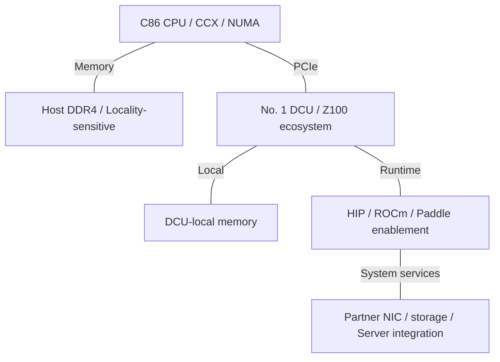
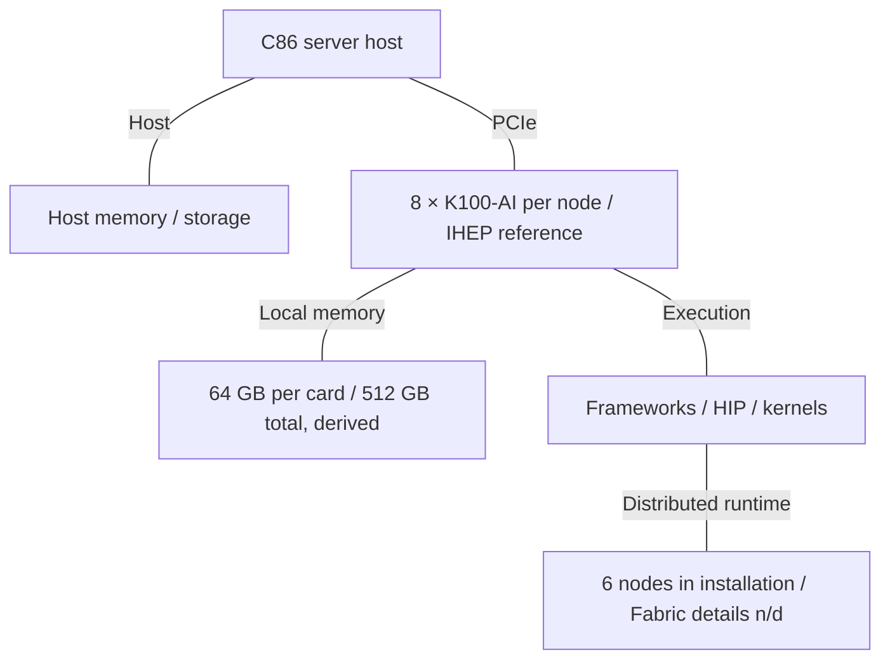
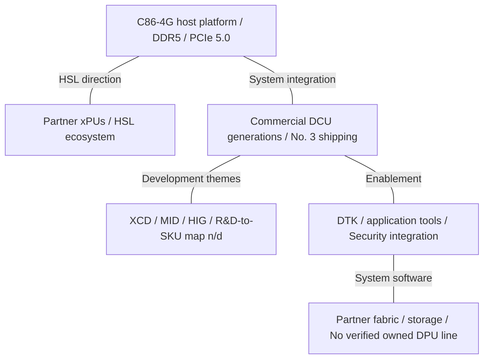

# Hygon AI Infrastructure Architecture Evolution

2015-2026 | 2026-09-28

## 01 Scope and executive synthesis

Company: Hygon Information Technology (688041). Period: 2015-28 September 2026. Deep coverage: C86 server CPUs and Deep Computing Units (DCUs); proportional coverage: workstation derivatives, HSL, systems and software. Networking is covered as an integration layer; no separately documented Hygon merchant DPU or AI NIC family was identified. Latest fully reviewed company technical disclosure: the interim report published on 14 August 2026; the event index includes HAIC 2025 and IHEP 2025. The cutoff does not imply a verified presentation at every 2026 conference.

Hygon evolved from a licensed x86 starting point into a CPU-accelerator platform. The durable architectural choices are software continuity on the host, general-purpose parallel execution on the DCU, and increasingly explicit investment in the connections between them. The CPU progression is visible in commercial platforms: the second-generation 7200 family offered up to 32 cores, eight DDR4 channels and PCIe 3.0; fourth-generation C86 platforms support up to 64 cores per socket, DDR5 and PCIe 5.0. The important transition is a better host for memory and I/O intensive work, not simply a larger core count.

The DCU history has firmer commercial milestones than public peak-performance tables. Deep Computing No. 1 entered commercial use in 2021; No. 2 was sold to commercial customers in 2023; No. 3 entered commercial use in 2025. Z100 and K100/K100-AI are useful board-level identities in software and deployment records, but public material does not provide a sufficiently consistent one-to-one mapping from every board name to each silicon generation. This report preserves both naming systems without silently joining them.

HSL makes the platform strategy concrete: Hygon opened its system-interconnect initiative in September 2025 and released the HSL 1.0 specification at HAIC that December. The engineering objective is tighter CPU-xPU integration with ecosystem partners. Physical bandwidth, switch radix and a maximum coherent domain are separate implementation questions; the reviewed public disclosures do not establish a normalized specification for them.

### Selected anchors across generations

| Anchor | CPU / host | Accelerator / memory | Integration |
| --- | --- | --- | --- |
| 2018-2020 baseline | Dhyana: 32 cores; 4 dies | Early heterogeneous research systems | PCIe; NUMA-aware placement |
| 2021-2022 | 7200: 170.624 GB/s derived DDR peak | No. 1: 32 GB HBM2; 1.024 TB/s | PCIe 4.0 x16 on DCU; host may limit rate |
| 2024-2025 deployment | Generation 3; DDR4 host ecosystem | IHEP: 6 nodes × 8 K100-AI; 64 GB/card | Actual eight-card servers; link-domain limit n/d |
| 2025-2026 platform | C86-4G: 64 cores/socket; DDR5-5600 platform | No. 3 commercial; dense BF16/FP8 n/d | HSL 1.0; DTK; CPU-DCU security work |

## 02 Evidence and numerical conventions

The report combines issuer technical disclosures, OEM documentation, upstream software records, deployment presentations and peer-reviewed research. Product facts and experimental configurations remain separate. A research paper can establish the topology of its tested Dhyana system or the scheduling model of its DCU; it cannot establish the implementation of every later Hygon product. The conference audit found useful systems evidence and related research, but no verified generation-by-generation Hygon product sequence at Hot Chips or ISSCC. Missing circuit details are retained as disclosure gaps.

n/d means not established by the reviewed public sources; n/a means not applicable. Bandwidth uses decimal GB/s and TB/s. DDR peak equals channels × transfer rate × 8 bytes, excluding ECC bits and protocol effects. PCIe examples are encoding-adjusted link ceilings before packet overhead. FLOP/s values are dense only when explicitly established; FP16 does not automatically establish BF16 throughput. A quoted accelerator interconnect aggregate is not divided into a one-way figure unless directionality is known.

Dates distinguish design start, production and observed commercial availability. For products without a dated general-availability announcement, a deployment establishes availability by that date rather than an exact launch day. R&D disclosures of XCD/MID partitioning, HIG virtualization, stacked-cache IP or PCIe 6.0 readiness are not retroactively attached to a shipping SKU. References are consolidated at the end, with a section-to-source map and a shared claims dataset.

## 03 CPU lineage: 2015-2018 and Dhyana

AMD announced the THATIC joint venture in April 2016, licensing processor and SoC technology for server products in China. Hygon’s prospectus dates first-generation design work to March 2016 and production to April 2018. The upstream 2018 Dhyana enablement patch identifies the first generation as originating from AMD technology and introduces the Hygon Family 18h identity. That is a firm lineage anchor; it is not a license to label subsequent Hygon generations Zen 2, Zen 3 or Zen 4.

A Journal of Software study describes a 32-core Dhyana package built from four dies, each with two four-core CCXs. Each core has private 64 KB instruction and 32 KB data L1 caches and 512 KB L2; four cores share 8 MB L3. This produces 64 MB aggregate L3, with locality organized around the CCX rather than a uniform 64 MB cache. The study reports a 14 nm implementation, two-way SMT and AVX/AVX2 support on its platform.

The consequence is software-visible locality. Thread placement, first-touch allocation and the placement of accelerator buffers matter because computation can be close to one die’s memory or traverse the package fabric. HygonBLIS research demonstrates why host-side kernels remain relevant in a heterogeneous solver: improving the CPU portion changes load balance and panel work even when the accelerator performs most arithmetic. This is an application result on a specific system, not a universal IPC claim.

## 04 Generation 2: the 7200 / 5200 / 3200 platform

Generation 2 entered production in January 2020. Its market tiers make the design economics clear: 7200 targets large servers, 5200 smaller servers and workstations, and 3200 workstation or edge roles. These are tiers within a generation, not three successive architectures. The 7200 family supports up to 32 cores/64 threads, eight DDR4-2666 channels and 128 PCIe 3.0 lanes. The lanes can serve PCIe, storage or coherent processor connections, so 128 should not be read as a guaranteed count of externally free lanes in every multi-socket board.

The scaled-down families preserve a roughly balanced memory interface at their maximum core counts: 5200 pairs 16 cores with four channels; 3200 pairs eight with two. At DDR4-2666, all three yield a derived 5.332 GB/s per core. The prospectus specifies 512 KB L2 per core and tier-dependent L3 capacity. This gives architects a useful baseline for bandwidth-sensitive work, although sustained bandwidth depends on NUMA locality, DIMM population and access pattern.

The platform also includes a security processor, secure boot, domestic cryptographic algorithms and trusted-computing support. These are part of the processor’s platform value in enterprise deployment. They do not establish equivalence to any particular AMD SEV generation, and the exact security mode must be checked against processor, firmware and hypervisor versions.

## 05 Generation 3: platform renewal before the DDR5 transition

Hygon’s June 2022 launch presented the third-generation CPU and a CPU-DCU heterogeneous platform. The 2022 annual report records small-volume sales that year. H3C’s R4930 G5 documentation supports second- and third-generation CPUs, up to 32 cores per processor, up to 32 DDR4 DIMMs per two-socket server and platform rates up to 3200 MT/s. PCIe slots are listed as 4.0/3.0, so exact capability is configuration-dependent.

The available evidence supports a platform-level transition rather than a complete reconstructed core block diagram. Higher memory transfer rates can raise the bandwidth ceiling without more cores, while a newer PCIe path reduces the host-transfer bottleneck for DCUs and fast NICs. Public documents reviewed here do not establish a generation-wide ROB size, front-end width, vector datapath width or complete cache-sharing map. The report therefore does not borrow those values from contemporary AMD cores.

## 06 Generation 4 and the current host platform

H3C’s R4930 G7 is a concrete fourth-generation reference. Its C86-4G processors reach 64 cores per socket with SMT, up to 2.7 GHz and a listed maximum processor power of 400 W. The two-socket server reaches 128 physical cores, supports 24 DDR5 DIMM slots at up to 5600 MT/s depending on CPU, and offers up to ten PCIe 5.0 slots. The 128-core number belongs to the two-socket system.

The simultaneous increase in core count, memory generation and I/O generation changes the host’s budget. More CPU threads can feed data pipelines, but they also compete for memory and power. DDR5 DIMM-slot count alone does not prove the number of independently active channels or DIMMs per channel; a defensible per-core bandwidth comparison needs the channel map. Likewise, a count of PCIe slots does not establish lanes per socket or nonblocking connectivity among accelerators and NICs.

Later CPU development is discussed in company disclosures, but this source set does not establish general availability for a named fifth-generation server product. It is retained as a roadmap entry. The current technical direction includes larger and better-managed caches, stronger branch prediction, modular chiplets, security and coherent I/O. These are documented development themes; shipping feature attribution still requires a SKU-level document.

## 07 CPU generation comparison

### CPU comparison: reference products, not inferred Zen equivalents

| Generation / reference SKU | Codename | GA | Status | Core µarch | Cores / threads | Process per die | Dies / packaging | L2 per core | L3 / domain | Memory: channels; rate; GB/s | Sockets / links | PCIe / CXL | TDP | Vector / matrix ISA |
| --- | --- | --- | --- | --- | --- | --- | --- | --- | --- | --- | --- | --- | --- | --- |
| No. 1 / 7100 | Dhyana | 2018-04 production | Historical shipping | Licensed origin; Hygon Family 18h | 32 / 64 | 14 nm | 4 dies; 2 CCX/die | 512 KB | 64 MB; 8 MB / 4 cores | n/d | Multi-socket; link rate n/d | n/d | n/d | AVX / AVX2 |
| No. 2 / 7200 | n/d | 2020-01 production | Historical shipping | Hygon C86; details n/d | 32 / 64 | n/d | n/d | 512 KB | 32 / 64 MB; domain n/d | DDR4; 8; 2666 MT/s; 170.624 GB/s | 2P observed; links n/d | 128 PCIe 3.0 lanes, shared uses; CXL n/d | 225 W typical upper value | n/d |
| No. 3 / 7300 platform | n/d | 2022 small-volume sales | Shipping / available | Hygon C86; details n/d | 32 cores; threads n/d in OEM brief | n/d | n/d | n/d | n/d | DDR4; channels n/d; up to 3200 MT/s; GB/s n/d | 2P platform; links n/d | PCIe 4.0/3.0 platform; CXL n/d | n/d | n/d |
| No. 4 / C86-4G | n/d | Available by cutoff; exact GA n/d | Shipping / available | Hygon C86; details n/d | 64 cores; SMT; max threads n/d | n/d | n/d | n/d | n/d | DDR5; channels n/d; up to 5600 MT/s; GB/s n/d | 2P; links n/d | PCIe 5.0 platform; CXL SKU mapping n/d | 400 W processor maximum | n/d |
| No. 5 | n/d | n/d | Roadmap | n/d | n/d | n/d | n/d | n/d | n/d | n/d | n/d | n/d | n/d | n/d |

## 08 Workstation and edge derivatives

The 3000 and 5000 families matter because they expose how the server technology is scaled into smaller packages and platforms. In the second generation, the 5200 family has eight or sixteen cores, four DDR4 channels and 64 PCIe 3.0 lanes; the 3200 has four or eight cores, two channels and 32 lanes. Typical power ranges in the prospectus are 90-135 W and 45-105 W, respectively. These products extend the same software environment into workstation, edge and smaller-server deployments.

The reuse advantage is compatibility and deployment tooling; the trade-off is less memory capacity and fewer attachment lanes. A workstation board using the same CPU family is not automatically an equivalent AI host: slot power, firmware support, memory population and NIC placement still constrain the system. No separate Hygon consumer graphics architecture is needed to explain the DCU line in the evidence reviewed here.

## 09 Deep Computing No. 1: the 2021 accelerator baseline

The IPO prospectus supplies an unusually concrete first-generation reference: 7 nm FinFET, 64 compute units containing 4,096 processing elements, 32 GB HBM2 on a 4,096-bit interface, 1,024 GB/s memory bandwidth, a 350 W TDP and PCIe 4.0 x16. It quotes two xGMI links and up to 184 GB/s, without a clear direction convention. That figure is preserved as an unnormalized vendor aggregate, not entered as a one-way bandwidth.

The peer-reviewed depthwise-convolution study documents a 64-CU DCU with four SIMD16 units per CU, 64-thread wavefronts and 64 KB of shared memory per CU. Its kernel analysis explains the main portability issue: CUDA-like source structure can survive a move to HIP, but launch geometry, register use and shared-memory tiling must be retuned for the target. These observations apply to the tested device, not every later DCU.

The first commercial generation established a practical software foothold. Baidu documented PaddlePaddle validation on Hygon 7000 CPUs and Z100 DCUs in 2021. Paddle Inference’s build guide subsequently identifies a Z100 configuration using ROCm 4.0.1 and source compilation. This is evidence of framework enablement and the software lineage; it does not make Z100 binary-compatible with NVIDIA CUDA or make the chip identical to an AMD accelerator.

## 10 Deep Computing No. 2 and K100-class deployments

In November 2023 Hygon confirmed that Deep Computing No. 2 had been sold to commercial customers. Its statement describes general-purpose parallel computation with floating-point and integer support, but does not supply a complete dense-throughput and memory table. Claims of a broad performance uplift cannot be substituted for BF16, FP8 or FP64 rates without the workload and numerical format.

K100 and K100-AI appear in real research and system deployments. IHEP’s August 2025 presentation records six eight-card K100-AI servers, with 64 GB per PCIe card. Southeast University also documents a 64 GB, 400 W K100 AI card in a Hygon 7491 system. These establish useful board capacities and deployment scale. They do not establish a universal K100-AI peak compute rate, memory technology, or an authoritative mapping to Deep Computing No. 2 versus No. 3.

The architectural question shifts from whether an application runs to how much of the available system it uses. Eight cards increase aggregate memory capacity, but tensor parallelism also adds communication and synchronization. Capacity divided across devices is not automatically a coherent shared memory pool. Model placement must account for per-card capacity, replication, collective traffic and host staging. Deployment records are therefore more useful than multiplying an uncertain card peak by eight.

## 11 Deep Computing No. 3 and implementation direction

Hygon’s review of 2025 states that Deep Computing No. 3 entered commercial use during that year. This advances the product timeline, but the public documents reviewed do not disclose enough silicon-level detail to reconstruct its compute-unit count, die count, HBM organization, dense BF16/FP8 rates or board power. The generation is included as shipping, while those fields remain n/d. The report does not use unverified KW-series aliases to fill them.

The 2026 interim report describes physically separated compute chiplets (XCD) and memory/I/O chiplets (MID), high-speed die-to-die interfaces, HIG resource partitioning, distributed SDMA and work on CPU-DCU security. It also records 2.5D packaging and 3D integration development. These disclosures show where the implementation effort is moving: separate compute scaling from I/O, isolate shared accelerator resources, and reduce movement across heterogeneous components. Their exact mapping to a commercial DCU generation is not disclosed.

Interpretation: separating compute and memory/I/O can allow different blocks to evolve at different rates, but introduces a die-to-die bandwidth and power budget. Resource partitioning can improve consolidation, yet usable isolation depends on scheduling, memory bandwidth, cache and DMA behavior together. Without package topology and measured partition behavior, neither the chiplet label nor a virtualization feature name is sufficient to estimate application scaling.

An April 2026 investor question asked about CPU No. 5 and DCU No. 4. Hygon answered that CPU and DCU development and customer validation were proceeding according to plan, without confirming launch or delivery of either named item. This report therefore does not promote the proposed fourth DCU generation to shipping status.

## 12 Accelerator comparison and software-visible identities

### DCU comparison

| Product | Architecture | GA / milestone | Status | Process | Dies / packaging | Compute units | Dense BF16 | Dense FP8 | Dense FP6 / FP4 | FP64 vector / matrix | Memory: type; stacks; GB; TB/s | LLC / SRAM | Scale-up: links; GB/s per direction; domain | Host link | Power / cooling | Form factor |
| --- | --- | --- | --- | --- | --- | --- | --- | --- | --- | --- | --- | --- | --- | --- | --- | --- |
| Deep Computing No. 1 | GPGPU; commercial codename n/d | 2021 commercial | Historical shipping | 7 nm FinFET | Die count n/d; HBM package | 64 CUs / 4096 | n/d | n/d | n/d | n/d | HBM2; stacks n/d; 32 GB; 1.024 TB/s | n/d | 2 xGMI; 184 GB/s quoted, direction n/d; domain n/d | PCIe 4.0 x16 | 350 W TDP; cooling n/d | n/d |
| Deep Computing No. 2 | GPGPU | By 2023-11 commercial | Shipping / available | n/d | n/d | n/d | n/d | n/d | n/d | n/d | n/d | n/d | n/d | n/d | n/d | n/d |
| Deep Computing No. 3 | GPGPU | 2025 commercial | Shipping / available | n/d | n/d | n/d | n/d | n/d | n/d | n/d | n/d | n/d | n/d | n/d | n/d | n/d |
| K100-AI deployment reference | Generation crosswalk n/d | 2024-2025 deployed | Shipping / available | n/d | n/d | n/d | n/d | n/d | n/d | n/d | 64 GB; type, stacks, bandwidth n/d | n/d | 8-card servers observed; link/domain maximum n/d | PCIe | 400 W in P08 configuration; cooling n/d | PCIe card |

## 13 HSL, xGMI and the networking boundary

Three links must be kept distinct. PCIe connects a DCU to its host root complex. The first-generation prospectus names xGMI for DCU peer connections. HSL is the later CPU-xPU system-interconnect initiative, opened with ecosystem partners. Sharing a high-level purpose does not establish an identical wire protocol, coherence model or physical lane rate among these links.

The HSL 1.0 release includes a protocol stack, IP reference design and instruction-set material according to the company’s 2025 review. Openness here is an ecosystem design and licensing proposition; it does not by itself establish membership in UALink, UEC or CXL compliance programs. Actual coherence, DMA reachability and interoperability need to be established for each implementation.

### Interconnect inventory

| Interconnect | Year / generation | Lane rate | Lanes / link | GB/s per link per direction | Links / device | Topology | Domain limit | Coherence / semantics |
| --- | --- | --- | --- | --- | --- | --- | --- | --- |
| PCIe host path | Gen3 → Gen4 → Gen5 platforms | 8 / 16 / 32 GT/s | x16 reference | 15.754 / 31.508 / 63.015 | Board dependent | Root complex / switch | n/a | I/O transport; no assumed cache coherence |
| xGMI, No. 1 | 2021 | n/d | n/d | n/d | 2 | n/d | n/d | Peer-link semantics n/d |
| HSL 1.0 | 2025-12 | n/d | n/d | n/d | n/d | CPU-xPU ecosystem | n/d | Tightly coupled integration; exact public protocol details n/d |

No merchant Hygon DPU, programmable SmartNIC or AI NIC with a separate model and datasheet was identified. The supported system boundary is third-party networking: H3C provides PCIe network-adapter attachment and an OCP option on the G5 platform. Port speeds, RDMA behavior, collective traffic placement and congestion control therefore belong to the selected NIC and fabric, not to the Hygon CPU or DCU merely because they share a server. The same applies to storage controllers and optics.

### Networking scope

| Product | GA / milestone | Status | Class | Ports × speed | SerDes | Host interface | Programmable engine | Embedded CPU | On-card memory | Transport / RDMA | Congestion control | Key offloads | Power |
| --- | --- | --- | --- | --- | --- | --- | --- | --- | --- | --- | --- | --- | --- |
| Partner NICs in Hygon servers | Platform-dependent | Shipping / available | Integration layer; not Hygon-owned SKU | n/d | n/d | PCIe / OCP | Adapter-dependent | n/d | n/d | Adapter/fabric-dependent | n/d | n/d | n/d |

## 14 Systems: commercial hosts and eight-card deployments

The system evidence spans two useful scales. OEM host specifications establish socket count, memory generation, I/O expansion and processor power. IHEP establishes an operational multi-node DCU installation and its application work. A six-node installation with eight accelerators per node proves a deployment configuration, but does not prove a 48-device hardware scale-up domain. Network topology, collective implementation and measured scaling must be provided separately.

### Reference systems

| Platform | Year / milestone | CPU / accelerator count | Scale-up domain | Scale-out per accelerator | Rack power | Cooling |
| --- | --- | --- | --- | --- | --- | --- |
| H3C R4930 G5 | Current documentation | 2 × generation 2/3 CPUs; accelerator options | n/d | n/d | n/d | Platform fans; configuration dependent |
| H3C R4930 G7 | Current documentation | 2 × C86-4G; up to 128 CPU cores | n/d | n/d | n/d | Server configuration dependent |
| IHEP AI DCU installation | 2024-2025 | 6 × 8 K100-AI; CPU model n/d here | 8 cards/node; protocol domain n/d | n/d | n/d | n/d |
| SEU equipment reference | Available by cutoff | 2 × Hygon 7491; 1 × K100 AI 64 GB | n/a | n/d | n/d | N+1 cooling; dual PSU |

Power must be budgeted at the same scope as capacity. Eight 400 W cards would alone require a derived 3.2 kW, but that calculation is an illustrative configuration using P08’s card power, not a measured IHEP node rating. CPU packages, DIMMs, NICs, fans and power-conversion losses add to the node budget. Neither card TDP nor processor maximum power establishes rack power or liquid-cooling requirements.

## 15 Software: from ROCm/HIP enablement to DTK

DTK is the software foundation for Hygon’s accelerator ecosystem. The useful abstraction is a stack: driver and runtime, compiler and programming model, mathematical and neural-network kernels, framework integration, and application serving. Paddle’s early Z100 instructions expose the ROCm/HIP foundation; later company disclosures describe DTK, application components and model-adaptation work. A framework importing successfully is only the first stage: operator coverage, numerical behavior and distributed execution determine whether production workloads are practical.

HIP can preserve much of a CUDA-style host/device programming structure. It does not preserve every library ABI, inline PTX fragment, warp-level assumption or kernel tuning choice. The convolution studies give concrete reasons to revisit data reuse, occupancy and memory tiling. The 2025 diverse-precision paper’s abstract reports separate FP16 and FP32 results and end-to-end network effects; this is application optimization evidence, not a chip peak-throughput specification.

The security trajectory extends from host secure boot and encryption toward CPU-DCU coordinated protection. CSV 3.0 and HIG appear in the 2026 technical disclosures. For deployment, the important distinction is between a named capability and a verified isolation boundary: attestation, trusted firmware, memory protection, DMA access and partition scheduling all need compatible versions. HYGON-AI’s public repositories include DAS adaptations of vLLM, SGLang, Mooncake and Megatron-LM. Their descriptions use the HCU hardware label; this is recorded as a software-visible identity without inventing a mapping to a new silicon generation.

### Software milestones

| Release / evidence | Date | Hardware enabled | Key features |
| --- | --- | --- | --- |
| Paddle validation | 2021 | Hygon 7000 + Z100 | Framework compatibility validation |
| Paddle Inference guide | Historical published guide | Z100 / ROCm 4.0.1 | Source build; driver/runtime environment |
| Research kernel optimization | 2024-2025 | Tested DCU configurations | HIP; MIOpen baseline; tuned memory reuse |
| DTK and ecosystem disclosure | 2025-2026 | CPU + DCU portfolio; exact version matrix n/d | Compilers, kernels, model adaptation; security and virtualization development |

## 16 Implementation trends and architectural trade-offs

The first-generation Dhyana reference already uses multiple dies. The later development story is therefore not simply a move from monolithic to chiplet. It is a move toward more specialized chiplet roles, richer packaging and a broader system interface. The 2025 annual report describes modular chiplet design, DDR/HBM controller IP, coherent data-fabric IP and advanced cache and interface work. A future package can trade yield and reuse against fabric latency and energy, but the public evidence does not quantify those costs per generation.

Memory scaling is more measurable in early products than current DCUs. The 7200 reference gives a clean per-core DDR baseline; the first DCU gives a clean HBM-bandwidth baseline. Current board capacity is visible in deployment records, while comparable dense BF16/FP8 peaks are not. Consequently, a purported generational bytes-per-FLOP curve would be misleading. The correct comparison retains missing ratios rather than combining unrelated SKUs or numerical formats.

The CPU remains consequential in accelerator systems. It handles scheduling, data preparation, storage and network services, and often the serial portion of scientific solvers. HSL potentially changes the cost of crossing the CPU-accelerator boundary; it does not eliminate memory hierarchy or contention. The highest-value next disclosures would be a coherent topology diagram, per-direction link rates, host-memory access behavior, a supported partition matrix and workload-level scaling measurements.

## 17 Integrated stack across three eras

The figures describe supported architectural relationships, not undocumented product wiring. Partner networking and storage remain outside Hygon’s documented chip portfolio. The last figure is the disclosed integration direction, with deployment details left to specific systems.

### Era 1: enterprise host and early DCU, 2018-2022

No. 1 silicon specifications and Z100 software support are separate evidence anchors; the figure does not force a universal SKU mapping.

### Era 2: operational multi-card systems, 2023-2025

Aggregate card capacity is not a unified physical-memory guarantee. Eight cards per node and six nodes are deployment counts, not maximum link-domain sizes.

### Era 3: CPU-DCU platform direction, 2025-2026

The diagram separates shipping host/DCU products from implementation capabilities and partner fabric. It does not claim a particular HSL link on an identified DCU SKU.

## 18 Bandwidth hierarchy and derived ratios

### Bandwidth hierarchy by evidence era

| Era / reference | On-die / die-to-die | Memory | CPU-DCU | Scale-up / accelerator | Scale-out / accelerator |
| --- | --- | --- | --- | --- | --- |
| 7200 + No. 1 DCU | n/d | CPU 170.624 GB/s; DCU 1024 GB/s | DCU Gen4 x16 31.508 GB/s/direction; Gen3 host caps at 15.754 | 184 GB/s quoted; direction n/d | n/d |
| K100-AI deployment | n/d | 64 GB/card; bandwidth n/d | PCIe; negotiated rate n/d | n/d | n/d |
| C86-4G / HSL era | n/d | DDR5-5600 platform; channel map n/d | Gen5 x16 ceiling 63.015 GB/s/direction; HSL n/d | n/d | n/d |

### Reproducible ratios and their limits

| Metric | Calculation | Result | Scope / limit |
| --- | --- | --- | --- |
| 7200 DDR bandwidth/core | 8 × 2666 × 10^6 × 8 / 32 | 5.332 GB/s/core | Derived; 32-core SKU at peak rate |
| 7200 L3/core, 64 MB SKU | 64 / 32 | 2 MB/core | Arithmetic average; not private cache |
| No. 1 HBM / Gen4 x16 | 1024 / 31.508 | 32.50× | Memory bandwidth vs one-way link ceiling |
| 8-card capacity | 8 × 64 GB | 512 GB | K100-AI node aggregate; not unified memory |
| HBM bytes / dense BF16 or FP8 FLOP | n/d | n/d | No matched format/throughput denominator |
| Scale-up/HBM; scale-out/card; FLOP/W | n/d | n/d | Direction, NIC mapping or compute/power pair missing |

## 19 Conference-to-product index and search coverage

### Verified disclosures and research anchors

| Venue | Year | Paper / talk / disclosure | Presenter / authors | Product | Evidence type | Source |
| --- | --- | --- | --- | --- | --- | --- |
| Hygon spring launch | 2022 | CPU No. 3 and heterogeneous platform launch | Hygon; named speaker n/d | No. 3 CPU + DCU | Company product event | C03 |
| HAIC | 2025 | HSL 1.0 specification release | Hygon and ecosystem partners | HSL 1.0 | System / interconnect; issuer recap | E05 |
| IHEP technical presentation | 2025 | AI@IHEPCC | IHEP computing team | K100 / K100-AI | Deployed systems / applications | C02 |
| Journal of Software | 2021 | CPU-side High Performance BLAS Library Optimization in Heterogeneous HPL Algorithm | Cai Y. et al. | Dhyana | Related research; tested CPU topology | R02 |
| CCF Trans. HPC | 2024 | Optimizing depthwise separable convolution on DCU | Liu Z. et al. | 64-CU test device | Related research; kernels / architecture | R01 |
| CCF Trans. HPC | 2025 / 2026 | Optimizing Standard Convolution for Diverse Precision on DCU | Hua H. et al. | DCU | Related research; abstract read only | R03 |

Searches covered Hygon, Haiguang, Dhyana, C86 and DCU with ISCA, MICRO, HPCA, ASPLOS, Hot Chips, ISSCC and DAC. No primary product-architecture or circuit paper was verified for a complete Hygon generation in those venues. Search hits included author affiliations, patents citing conference work and papers referencing Hygon research; these are not product disclosures. This is a result of this source audit, not a claim that Hygon has never participated.

SC/ISC, interconnect and systems venues, and industry events such as MWC, Computex, OCP, GTC, re:Invent, Ignite and Google Cloud Next were considered as possible deployment channels. No specific Hygon product talk at these events was used to establish a specification. The strongest verified event material here comes from Hygon’s own launch ecosystem, HAIC and the IHEP system presentation. The missing Hot Chips/ISSCC layer is not replaced with AMD papers about later Zen or CDNA products.

## 20 Names, product boundaries and remaining disclosures

### Product and technology crosswalk

| Name | Meaning | Mapped identity | Boundary |
| --- | --- | --- | --- |
| Dhyana | Initial CPU identity | Hygon Family 18h | Do not reuse as a later Zen-generation mapping |
| 7100 / 5100 / 3100 | Generation 1 tiers | No. 1 CPU | Server / smaller server / workstation tiers |
| 7200 / 5200 / 3200 | Generation 2 tiers | No. 2 CPU | Tier is not a generation |
| C86-4G | Fourth-generation host platform | No. 4 CPU; 64-core/socket OEM reference | 128 cores means two sockets in P04 |
| Deep Computing No. 1/2/3 | DCU silicon generations | Commercial milestones 2021/2023/2025 | Not CPU family numbering |
| Z100 / K100 / K100-AI | Software and board identities | Actual validation / deployment names | Full silicon-generation crosswalk n/d |
| XCD / MID / HIG | Chiplet and partitioning terminology | Disclosed development capabilities | Commercial SKU mapping n/d |
| HSL / DTK | System Link / software toolkit | Platform integration / enablement | Not independent DPU or AI NIC products |

The highest-impact disclosure gaps are concentrated, not universal: later CPU core and cache organization; a complete DCU generation-to-board map; dense numerical-format throughput; HBM stacks and bandwidth on newer silicon; link direction and domain limits; and the association of packaging, virtualization and security features with commercial SKUs. The established story is already clear: a compatible server CPU base expanded into a general-purpose accelerator ecosystem, then toward a more tightly integrated CPU-xPU platform. The next architecture comparison should test that integration at the workload level.

## Source map

01 Scope and executive synthesis — C02, E01, E02, E03, E05, E11, P04, P07, R02

02 Evidence and numerical conventions — C02, E01, E03, E04, P04, P05, R01, R02

03 CPU lineage: 2015-2018 and Dhyana — E03, E06, P05, R02

04 Generation 2: the 7200 / 5200 / 3200 platform — E03

05 Generation 3: platform renewal before the DDR5 transition — C03, E07, P07

06 Generation 4 and the current host platform — E01, E04, E07, E12, P04

07 CPU generation comparison — C03, E03, E07, P04, P05, P07, R02

08 Workstation and edge derivatives — E03, E04

09 Deep Computing No. 1: the 2021 accelerator baseline — E02, E03, P03, R01

10 Deep Computing No. 2 and K100-class deployments — C02, E11, P08

11 Deep Computing No. 3 and implementation direction — E01, E05, E12

12 Accelerator comparison and software-visible identities — C02, E03, E05, E11, P08

13 HSL, xGMI and the networking boundary — E03, E05, P04, P07

14 Systems: commercial hosts and eight-card deployments — C02, P04, P07, P08

15 Software: from ROCm/HIP enablement to DTK — E01, E02, E04, P03, P09, P10, R01, R03

16 Implementation trends and architectural trade-offs — C02, E03, E04, E05, R02

17 Integrated stack across three eras — C02, E01, E03, E05

18 Bandwidth hierarchy and derived ratios — C02, E03, E05, P04, P08

19 Conference-to-product index and search coverage — C02, C03, E05, P05, R01, R02, R03

20 Names, product boundaries and remaining disclosures — C02, E01, E02, E03, E04, E05, E11, P03, P04, P05, R02

## References

### Product and technical documentation

[P03] PaddlePaddle Hygon DCU inference support. [https://raw.githubusercontent.com/PaddlePaddle/Paddle-Inference-Demo/master/docs-official/guides/hardware_support/dcu_hygon_cn.md](https://raw.githubusercontent.com/PaddlePaddle/Paddle-Inference-Demo/master/docs-official/guides/hardware_support/dcu_hygon_cn.md). Primary source; accessed by 2026-09-28

[P04] H3C UniServer R4930 G7 technical specifications. [https://www.h3c.com/cn/Products_And_Solution/Server/H3C/Products/RackServer/Products_Series/Dualway_Server/R4930_G7/](https://www.h3c.com/cn/Products_And_Solution/Server/H3C/Products/RackServer/Products_Series/Dualway_Server/R4930_G7/). Primary source; accessed by 2026-09-28

[P05] Hygon Dhyana Xen support patch. [https://old-list-archives.xen.org/archives/html/xen-devel/2018-09/msg01505.html](https://old-list-archives.xen.org/archives/html/xen-devel/2018-09/msg01505.html). Primary source; accessed by 2026-09-28

[P07] H3C R4930 G5 specifications. [https://www.h3c.com/cn/Products_And_Solution/Server/H3C/Products/RackServer/Products_Series/Dualway_Server/R4930_G5/](https://www.h3c.com/cn/Products_And_Solution/Server/H3C/Products/RackServer/Products_Series/Dualway_Server/R4930_G5/). Primary source; accessed by 2026-09-28

[P08] Southeast University deployed Hygon 7491 and K100 AI equipment. [https://dxyq.seu.edu.cn/detail.action?equipDetail=true&id=8ac0b1c19aa1a927019aa44e55e901ef](https://dxyq.seu.edu.cn/detail.action?equipDetail=true&id=8ac0b1c19aa1a927019aa44e55e901ef). Primary source; accessed by 2026-09-28

[P09] Hygon DCU and CUDA migration: PaddlePaddle documentation. [https://paddlepaddle-static.cdn.bcebos.com/documentation/docs/zh/hardware_support/dcu/index_cn.html](https://paddlepaddle-static.cdn.bcebos.com/documentation/docs/zh/hardware_support/dcu/index_cn.html). Primary source; accessed by 2026-09-28

[P10] HYGON-AI open source software organization. [https://github.com/HYGON-AI](https://github.com/HYGON-AI). Primary source; accessed by 2026-09-28

### Conference records and implementation disclosures

[C02] IHEP computing and AI infrastructure, August 2025. [https://indico.ihep.ac.cn/event/26373/contributions/198403/attachments/93861/122983/AI%40IHEPCC-20250825-v5.pdf](https://indico.ihep.ac.cn/event/26373/contributions/198403/attachments/93861/122983/AI%40IHEPCC-20250825-v5.pdf). Primary source; accessed by 2026-09-28

[C03] Hygon 2022 spring product launch. [https://www.hygon.cn/news?newsid=102](https://www.hygon.cn/news?newsid=102). Indexed record or searchable official page; product details cross-checked with the associated technical document.

### Research papers and publication registries

[R01] Optimizing depthwise separable convolution on DCU. [https://link.springer.com/article/10.1007/s42514-024-00200-3](https://link.springer.com/article/10.1007/s42514-024-00200-3). Primary source; accessed by 2026-09-28

[R02] High-performance BLAS optimization on CPU in heterogeneous HPL. [https://jos.org.cn/html/2021/8/6002.htm](https://jos.org.cn/html/2021/8/6002.htm). Primary source; accessed by 2026-09-28

[R03] Optimizing Standard Convolution for Diverse Precision on DCU (abstract). [https://link.springer.com/article/10.1007/s42514-025-00253-y](https://link.springer.com/article/10.1007/s42514-025-00253-y). Publisher abstract reviewed; no full-text specifications used.

### Launches, ecosystem and deployment

[E01] Hygon Information 2026 interim report. [https://static.cninfo.com.cn/finalpage/2026-08-14/1225472510.PDF](https://static.cninfo.com.cn/finalpage/2026-08-14/1225472510.PDF). Primary source; accessed by 2026-09-28

[E02] PaddlePaddle and Hygon DCU Z100 validation, 2021. [https://ai.baidu.com/support/news?action=detail&id=2619](https://ai.baidu.com/support/news?action=detail&id=2619). Primary source; accessed by 2026-09-28

[E03] Hygon IPO prospectus 2022. [https://static.cninfo.com.cn/finalpage/2022-08-09/1214251824.PDF](https://static.cninfo.com.cn/finalpage/2022-08-09/1214251824.PDF). Primary source; accessed by 2026-09-28

[E04] Hygon 2025 annual report. [https://static.cninfo.com.cn/finalpage/2026-04-08/1225083088.PDF](https://static.cninfo.com.cn/finalpage/2026-04-08/1225083088.PDF). Primary source; accessed by 2026-09-28

[E05] Hygon 2026 action plan and 2025 review. [https://static.cninfo.com.cn/finalpage/2026-04-08/1225083107.PDF](https://static.cninfo.com.cn/finalpage/2026-04-08/1225083107.PDF). Primary source; accessed by 2026-09-28

[E06] AMD Q1 2016 results and THATIC joint venture. [https://ir.amd.com/financial-information/sec-filings/content/0000002488-16-000118/q116991.htm](https://ir.amd.com/financial-information/sec-filings/content/0000002488-16-000118/q116991.htm). Primary source; accessed by 2026-09-28

[E07] Hygon 2022 annual report. [https://static.cninfo.com.cn/finalpage/2023-04-18/1216442414.PDF](https://static.cninfo.com.cn/finalpage/2023-04-18/1216442414.PDF). Primary source; accessed by 2026-09-28

[E11] Hygon investor response: Deep Computing No. 2 commercial sales, 22 November 2023 (issuer statement reproduced). [https://yuanchuang.10jqka.com.cn/20231122/c652443688.shtml](https://yuanchuang.10jqka.com.cn/20231122/c652443688.shtml). Primary source; accessed by 2026-09-28

[E12] Hygon investor response on CPU/DCU development and customer validation, 21 April 2026. [https://yuanchuang.10jqka.com.cn/20260421/c676157793.shtml](https://yuanchuang.10jqka.com.cn/20260421/c676157793.shtml). Primary source; accessed by 2026-09-28
