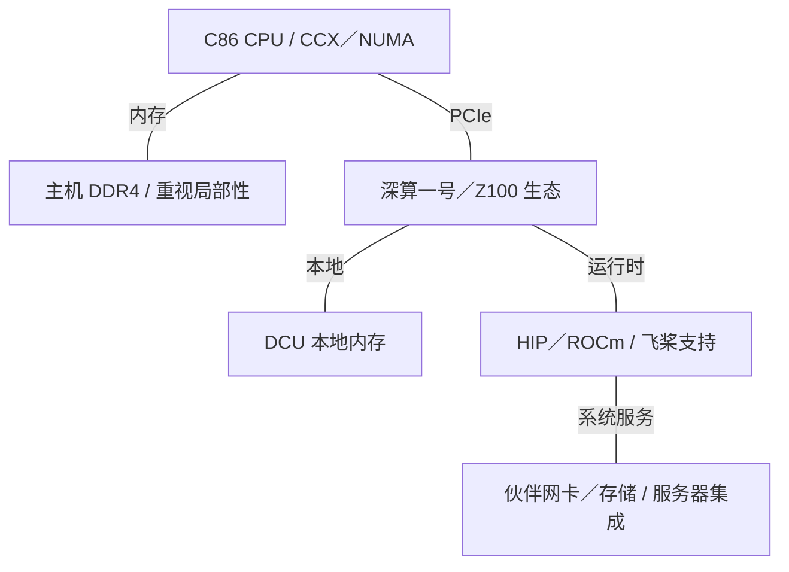
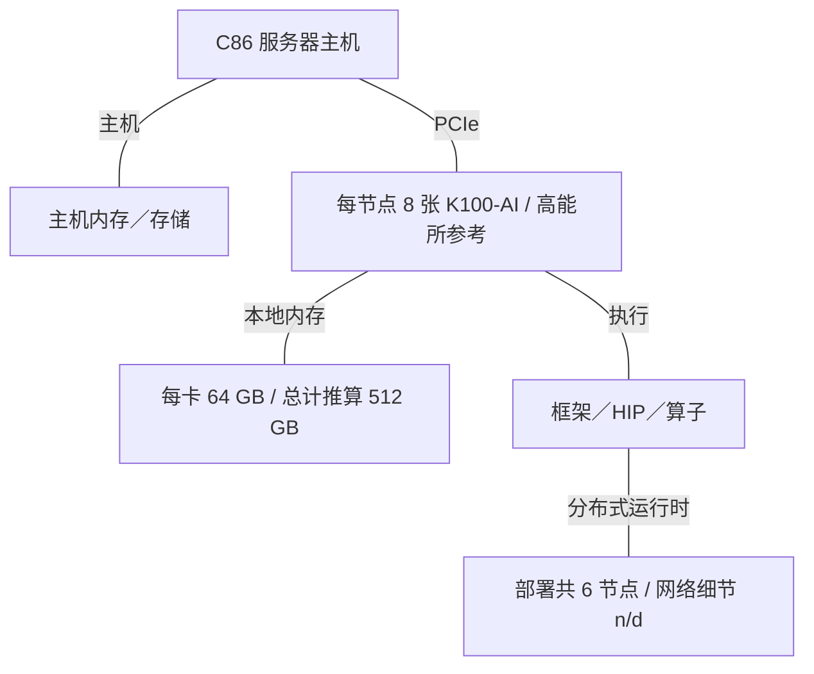
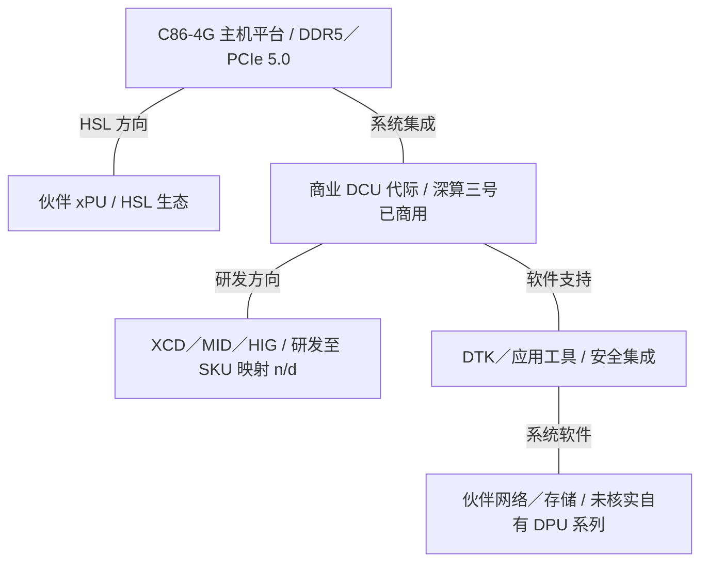

# Hygon AI 基础设施架构演进

2015-2026 | 2026-09-28

## 01 研究范围与核心结论

研究对象为海光信息技术股份有限公司（688041）。时间范围：2015 年至 2026 年 9 月 28 日。深度覆盖 C86 服务器 CPU 与深算 DCU；按相关性覆盖工作站衍生产品、HSL、系统及软件。网络作为系统集成层纳入；本次未查到具有独立技术资料的海光自有商用 DPU 或 AI 网卡产品线。完整审阅的最新公司技术披露为 2026 年 8 月 14 日发布的半年度报告；活动索引覆盖 HAIC 2025 和 IHEP 2025。研究截止日期不代表已核实海光在所有 2026 年会议上的报告。

海光从获得授权的 x86 技术起点，发展为 CPU 与加速器协同的平台。贯穿其中的架构选择是主机软件的连续性、DCU 的通用并行执行能力，以及不断加强的双芯互联。商用平台呈现出明确的 CPU 演进：第二代 7200 系列最高 32 核、八通道 DDR4 和 PCIe 3.0；第四代 C86 平台最高每颗 64 核，并支持 DDR5 与 PCIe 5.0。关键变化是更能承担内存与 I/O 密集型任务的主机平台，而不仅是核心数量增长。

DCU 的商业化时间线比公开峰值性能表更完整：深算一号于 2021 年实现商业化，深算二号于 2023 年销售给商业客户，深算三号于 2025 年实现商业化。Z100、K100／K100-AI 是软件与部署资料中有用的板卡标识，但公开资料不足以把所有板卡名称与芯片代际建立一致的一一对应关系。本报告保留两套命名，不擅自合并。

HSL 使平台战略更加具体：海光于 2025 年 9 月开放系统互联方案，并在同年 12 月 HAIC 发布 HSL 1.0 规范，目标是与生态伙伴实现更紧密的 CPU-xPU 集成。物理带宽、交换芯片端口数和最大一致性域属于进一步的实现问题；已审阅的公开披露尚不足以建立这些参数的统一规格表。

### 各代际的关键技术锚点

| 锚点 | CPU／主机 | 加速器／内存 | 集成方式 |
| --- | --- | --- | --- |
| 2018-2020 基线 | Dhyana：32 核；4 裸片 | 早期异构研究系统 | PCIe；感知 NUMA 的部署 |
| 2021-2022 | 7200：DDR 理论峰值推算为 170.624 GB/s | 深算一号：32 GB HBM2；1.024 TB/s | DCU 端 PCIe 4.0 x16；速率仍受主机限制 |
| 2024-2025 部署 | 第三代；DDR4 主机生态 | 高能所：6 节点×8 张 K100-AI；每卡 64 GB | 实际八卡服务器；互联域上限 n/d |
| 2025-2026 平台 | C86-4G：每颗 64 核；DDR5-5600 平台 | 深算三号已商用；稠密 BF16／FP8 n/d | HSL 1.0；DTK；CPU-DCU 安全协同 |

## 02 证据与数值口径

报告综合公司技术披露、整机文档、上游软件记录、部署报告及同行评审研究。产品事实与实验配置分别处理。论文能够说明所测 Dhyana 系统的拓扑或 DCU 的调度模型，但不能据此确定所有后续海光产品的实现。本次会议检索取得了有价值的系统资料和相关研究，但未核实到海光在 Hot Chips 或 ISSCC 上逐代披露产品的完整序列。缺失的电路细节保留为披露缺口。

n/d 表示已审阅公开资料未能确定；n/a 表示不适用。带宽采用十进制 GB/s、TB/s。DDR 峰值按通道数×传输速率×8 字节计算，不计 ECC 位和协议影响。PCIe 示例是扣除编码开销后、尚未扣除分组开销的链路上限。只有明确依据时才填写稠密 FLOP/s；FP16 不能自动等同于 BF16。加速器互联的聚合值如未说明方向，不能直接折算为单向值。

日期分别记录研发启动、量产及已观察到的商业可用性。产品若没有带日期的正式商用公告，部署记录只能证明当时已可获取，不能替代精确发布日期。XCD／MID 划分、HIG 虚拟化、堆叠缓存 IP 或 PCIe 6.0 储备等研发披露，不倒推为某个已上市 SKU 的规格。参考资料集中置于文末，附章节来源映射及共享事实数据。

## 03 CPU 技术起点：2015-2018 与 Dhyana

AMD 于 2016 年 4 月宣布与 THATIC 的合资安排，为中国服务器产品授权处理器及 SoC 技术。海光招股书记载，第一代产品于 2016 年 3 月启动设计，2018 年 4 月量产。2018 年上游 Dhyana 支持补丁明确第一代来自 AMD 技术，并引入 Hygon Family 18h 标识。这构成可靠的技术谱系起点，但不能据此把后续海光产品标成 Zen 2、Zen 3 或 Zen 4。

《软件学报》研究描述了一个 32 核 Dhyana 封装：四个裸片，每个裸片含两个四核 CCX。每核独享 64 KB 指令 L1、32 KB 数据 L1 和 512 KB L2；四核共享 8 MB L3。因此总 L3 为 64 MB，但访问局部性以 CCX 为单位，不能视为均匀的 64 MB 缓存。论文记录的平台采用 14 nm 工艺，支持双线程 SMT 和 AVX／AVX2。

这种结构使局部性直接影响软件：线程绑定、首次触碰内存分配及加速器缓冲区位置，决定数据是就近访问还是经过封装内互联。HygonBLIS 研究说明了异构求解器中优化主机算子的价值：即使大部分运算由加速器完成，CPU 端优化仍会改变负载均衡和面板处理效率。这是特定系统上的应用结果，不是普遍的 IPC 结论。

## 04 第二代：7200／5200／3200 平台

第二代于 2020 年 1 月量产。其市场分层体现了设计上的经济性：7200 面向高端服务器，5200 面向较小规模服务器及工作站，3200 面向工作站或边缘场景。这是同一代内的档次划分，不是三种连续演进的架构。7200 最高支持 32 核／64 线程、八通道 DDR4-2666 和 128 条 PCIe 3.0 通道。通道可用于 PCIe、存储或处理器一致性互联，因此不能把 128 理解为所有多路主板都能对外提供的可用通道数。

较低档产品在最大核心数下保持了近似一致的内存配比：5200 为 16 核配四通道，3200 为八核配双通道。按 DDR4-2666 推算，三档均为每核 5.332 GB/s。招股书明确每核 L2 为 512 KB，L3 容量随档次变化。这为带宽敏感型工作负载提供了比较基线，但持续带宽还取决于 NUMA 局部性、DIMM 配置和访问模式。

平台还集成安全处理器、安全启动、国密算法及可信计算支持，这些能力构成企业部署中的平台价值。它们不能直接等同于某一代 AMD SEV；实际安全模式仍须按处理器、固件和虚拟机监控器版本核对。

## 05 第三代：DDR5 之前的平台更新

海光于 2022 年 6 月发布第三代 CPU，并展示 CPU-DCU 异构平台。2022 年年报记录了当年的小批量销售。新华三 R4930 G5 文档覆盖第二、第三代处理器，最高每颗 32 核，双路服务器最多 32 根 DDR4 DIMM，平台内存速率最高 3200 MT/s；PCIe 插槽标为 4.0／3.0，具体能力取决于配置。

现有证据能够说明平台层面的更新，尚不能完整重建核心框图。内存传输速率提高，可以在核心数不增加时提高带宽上限；更新的 PCIe 通路则有助于缓解 DCU 和高速网卡的主机传输瓶颈。已审阅资料未确定本代统一的 ROB 大小、前端宽度、向量数据通路宽度或完整缓存共享关系，因此不借用同期 AMD 核心参数补齐。

## 06 第四代与当前主机平台

新华三 R4930 G7 是具体的第四代参考平台。其 C86-4G 处理器最高每颗 64 核并支持 SMT，最高主频 2.7 GHz，列明的处理器最大功率为 400 W。双路整机最高 128 个物理核心，提供 24 个 DDR5 DIMM 插槽，速率依 CPU 最高达 5600 MT/s，并最多提供十个 PCIe 5.0 插槽。128 核属于双路整机口径。

核心数、内存代际与 I/O 代际同步提升，改变了主机资源配比。更多 CPU 线程可以供给数据流水线，也会竞争内存与功率预算。仅凭 DDR5 插槽数量，不能确定独立活跃通道数或每通道 DIMM 数；严谨的每核带宽比较需要通道拓扑。同样，PCIe 插槽数量也不能说明每颗 CPU 的通道数，或加速器与网卡之间是否具有无阻塞连接。

公司披露涉及后续 CPU 研发，但本次资料未能确定具名第五代服务器产品的正式商用状态，因此保留为路线图项。当前技术方向包括更大的缓存与更好的管理算法、分支预测优化、模块化芯粒、安全及一致性 I/O。这些属于已披露的研发方向，具体已上市功能仍需 SKU 级文档确认。

## 07 CPU 代际对照

### CPU 对照：以海光参考产品为准，不推定对应 Zen 代际

| 代际／参考 SKU | 代号 | 正式商用 | 状态 | 核心微架构 | 核心／线程 | 各裸片工艺 | 裸片／封装 | 每核 L2 | L3／共享域 | 内存：通道；速率；GB/s | 插槽／互联 | PCIe／CXL | TDP | 向量／矩阵 ISA |
| --- | --- | --- | --- | --- | --- | --- | --- | --- | --- | --- | --- | --- | --- | --- |
| 海光一号／7100 | Dhyana | 2018-04 量产 | 历史已商用 | 授权起点；Hygon Family 18h | 32 / 64 | 14 nm | 4 裸片；每裸片 2 CCX | 512 KB | 64 MB；每 4 核 8 MB | n/d | 多路；链路速率 n/d | n/d | n/d | AVX / AVX2 |
| 海光二号／7200 | n/d | 2020-01 量产 | 历史已商用 | 海光 C86；细节 n/d | 32 / 64 | n/d | n/d | 512 KB | 32／64 MB；共享域 n/d | DDR4; 8; 2666 MT/s; 170.624 GB/s | 已验证双路；链路 n/d | 128 条 PCIe 3.0 通道，多用途；CXL n/d | 典型功耗上限值 225 W | n/d |
| 海光三号／7300 平台 | n/d | 2022 小批量销售 | 已商用／可获取 | 海光 C86；细节 n/d | 32 核；整机简表线程数 n/d | n/d | n/d | n/d | n/d | DDR4；通道 n/d；最高 3200 MT/s；GB/s n/d | 双路平台；链路 n/d | PCIe 4.0／3.0 平台；CXL n/d | n/d | n/d |
| 海光四号／C86-4G | n/d | 截至资料截止已可获取；精确 GA n/d | 已商用／可获取 | 海光 C86；细节 n/d | 64 核；SMT；最高线程数 n/d | n/d | n/d | n/d | n/d | DDR5；通道 n/d；最高 5600 MT/s；GB/s n/d | 双路；链路 n/d | PCIe 5.0 平台；CXL SKU 映射 n/d | 处理器最大 400 W | n/d |
| 海光五号 | n/d | n/d | 路线图 | n/d | n/d | n/d | n/d | n/d | n/d | n/d | n/d | n/d | n/d | n/d |

## 08 工作站与边缘衍生产品

3000 与 5000 系列体现服务器技术如何缩放到较小的封装及平台。第二代 5200 配八核或十六核、四通道 DDR4、64 条 PCIe 3.0 通道；3200 配四核或八核、双通道 DDR4、32 条 PCIe 3.0 通道。招股书列出的典型功耗分别为 90-135 W 和 45-105 W。这些产品把同一软件环境扩展到工作站、边缘及较小规模服务器。

复用优势主要体现在兼容性与部署工具，代价是内存容量及连接通道减少。使用同系列 CPU 的工作站主板，不会自动成为等效的 AI 主机：插槽供电、固件支持、内存配置及网卡位置仍会限制系统。本次证据中，无需引入独立的海光消费级图形架构来解释 DCU 产品线。

## 09 深算一号：2021 年加速器基线

招股书为第一代提供了较为完整的参考配置：7 nm FinFET、64 个计算单元及 4,096 个处理单元、4,096 位接口的 32 GB HBM2、1,024 GB/s 内存带宽、350 W TDP，以及 PCIe 4.0 x16。资料列出两条 xGMI 链路和最高 184 GB/s，但未明确方向口径。因此报告保留该原始聚合值，不把它写成单向带宽。

深度可分离卷积论文描述了所测 64-CU DCU：每个 CU 有四组 SIMD16，采用 64 线程波前，每个 CU 配 64 KB 共享内存。其算子分析揭示了迁移的核心问题：类似 CUDA 的源代码结构可以迁到 HIP，但启动配置、寄存器使用和共享内存分块仍需针对目标硬件重新调优。这些结论针对测试设备，不扩展为所有后续 DCU 的统一规格。

第一代商业产品建立了可用的软件基础。百度于 2021 年记录飞桨在海光 7000 CPU 和 Z100 DCU 上的验证；后续 Paddle Inference 编译文档列明 Z100 使用 ROCm 4.0.1，并通过源码构建。这证明框架支持与软件技术来源，不能据此认定 Z100 与 NVIDIA CUDA 二进制兼容，或与某款 AMD 加速器相同。

## 10 深算二号与 K100 系列部署

2023 年 11 月，海光确认深算二号已向商业客户销售。公司将其描述为支持浮点及整型运算的通用并行计算产品，但未给出完整的稠密算力与内存规格表。泛化的性能提升描述，在缺少工作负载和数值格式时，不能代替 BF16、FP8 或 FP64 的具体速率。

K100 与 K100-AI 已出现在实际研究及系统部署中。高能所 2025 年 8 月报告记录了六台八卡 K100-AI 服务器，每张 PCIe 卡为 64 GB。东南大学设备资料也记录了搭载海光 7491 的系统以及 64 GB、400 W K100 AI 卡。这些资料确定了具体板卡容量与部署规模，但不足以建立适用于全部 K100-AI 的峰值算力、显存类型，或其与深算二号、三号的权威对应关系。

架构问题从应用能否运行，转向能利用多少系统资源。八张卡提高了总显存容量，但张量并行也引入通信与同步。分布在多卡上的容量，不会自动成为缓存一致的共享内存池。模型部署必须考虑每卡容量、数据复制、集合通信和主机中转，因此实际部署记录比把不确定的单卡峰值乘以八更有价值。

## 11 深算三号与实现技术方向

海光对 2025 年的回顾明确深算三号在当年实现商业化。这推进了产品时间线，但已审阅公开资料尚不足以重建其计算单元数量、裸片数、HBM 组织、稠密 BF16／FP8 算力或板卡功耗。因此本代记为已商用，相关参数保留 n/d，不使用未经核实的 KW 系列别名补齐。

2026 年半年度报告描述了物理分离的计算芯粒 XCD 与内存／I/O 芯粒 MID、高速裸片互联、HIG 资源划分、分布式 SDMA，以及 CPU-DCU 安全协同，并披露 2.5D 封装和 3D 集成研发。这些信息表明实现重点正转向计算与 I/O 的独立扩展、共享加速器资源隔离，以及减少异构部件间的数据搬运；其与具体商业 DCU 代际的对应尚未披露。

架构解读：把计算与内存／I/O 分离，可使不同模块按各自节奏演进，但会引入裸片互联的带宽和功率预算。资源划分有助于提高共享利用率，实际隔离能力却取决于调度、内存带宽、缓存及 DMA 的共同表现。缺少封装拓扑和分区实测时，仅凭芯粒化或虚拟化功能名称，无法估计应用扩展效率。

2026 年 4 月，有投资者询问海光五号 CPU 与深算四号 DCU 的发布及交付进展。公司回答称 CPU、DCU 正按规划推进研发与客户验证，未确认上述具名产品已发布或交付。因此本报告不把拟议的第四代 DCU 提升为已商用状态。

## 12 加速器对照与软件可见型号

### DCU 对照

| 产品 | 架构 | 商用／里程碑 | 状态 | 工艺 | 裸片／封装 | 计算单元 | 稠密 BF16 | 稠密 FP8 | 稠密 FP6／FP4 | FP64 向量／矩阵 | 内存：类型；堆栈；GB；TB/s | 末级缓存／SRAM | 纵向扩展：链路；单向 GB/s；域 | 主机连接 | 功耗／散热 | 形态 |
| --- | --- | --- | --- | --- | --- | --- | --- | --- | --- | --- | --- | --- | --- | --- | --- | --- |
| 深算一号 | GPGPU；商业代号 n/d | 2021 商用 | 历史已商用 | 7 nm FinFET | 裸片数 n/d；HBM 封装 | 64 CUs / 4096 | n/d | n/d | n/d | n/d | HBM2; stacks n/d; 32 GB; 1.024 TB/s | n/d | 2 条 xGMI；原值 184 GB/s，方向 n/d；域 n/d | PCIe 4.0 x16 | 350 W TDP；散热 n/d | n/d |
| 深算二号 | GPGPU | 截至 2023-11 已商用 | 已商用／可获取 | n/d | n/d | n/d | n/d | n/d | n/d | n/d | n/d | n/d | n/d | n/d | n/d | n/d |
| 深算三号 | GPGPU | 2025 商用 | 已商用／可获取 | n/d | n/d | n/d | n/d | n/d | n/d | n/d | n/d | n/d | n/d | n/d | n/d | n/d |
| K100-AI 部署参考 | 代际映射 n/d | 2024-2025 已部署 | 已商用／可获取 | n/d | n/d | n/d | n/d | n/d | n/d | n/d | 64 GB；类型、堆栈及带宽 n/d | n/d | 观察到八卡服务器；链路／域上限 n/d | PCIe | P08 配置为 400 W；散热 n/d | PCIe 板卡 |

## 13 HSL、xGMI 与网络产品边界

必须区分三类连接：PCIe 将 DCU 接到主机根复合体；第一代招股书用 xGMI 描述 DCU 对等互联；HSL 则是后续面向 CPU-xPU、与生态伙伴共同开放的系统互联方案。用途相近，并不意味着它们具有相同的线协议、一致性模型或物理通道速率。

公司 2025 年回顾说明，HSL 1.0 开放内容包括协议栈、IP 参考设计和指令集材料。这里的开放首先是生态设计与授权安排，不能自动等同于参与 UALink、UEC，或通过 CXL 一致性测试。每种实现的缓存一致性、DMA 可达性及互操作性仍需分别核实。

### 互联技术表

| 互联 | 年份／代际 | 通道速率 | 每链路通道 | 每链路单向 GB/s | 每设备链路 | 拓扑 | 域规模 | 一致性／语义 |
| --- | --- | --- | --- | --- | --- | --- | --- | --- |
| PCIe 主机通路 | Gen3 → Gen4 → Gen5 平台 | 8 / 16 / 32 GT/s | x16 参考 | 15.754 / 31.508 / 63.015 | 依主板 | 根复合体／交换机 | n/a | I/O 传输；不默认缓存一致性 |
| 深算一号 xGMI | 2021 | n/d | n/d | n/d | 2 | n/d | n/d | 对等连接语义 n/d |
| HSL 1.0 | 2025-12 | n/d | n/d | n/d | n/d | CPU-xPU 生态 | n/d | 紧耦合集成；公开协议细节 n/d |

本次未查到具备独立型号和数据手册的海光商用 DPU、可编程 SmartNIC 或 AI 网卡。可以核实的是第三方网络集成：新华三平台支持 PCIe 网卡，G5 另提供 OCP 选项。端口速率、RDMA 行为、集合通信流量路径及拥塞控制，因而属于所选网卡和网络，而不会仅因与海光 CPU／DCU 同机就成为海光芯片能力。存储控制器与光模块同理。

### 网络覆盖范围

| 产品 | 商用／里程碑 | 状态 | 类别 | 端口×速率 | SerDes | 主机接口 | 可编程引擎 | 嵌入式 CPU | 板载内存 | 传输／RDMA | 拥塞控制 | 主要卸载 | 功耗 |
| --- | --- | --- | --- | --- | --- | --- | --- | --- | --- | --- | --- | --- | --- |
| 海光服务器中的伙伴网卡 | 依平台 | 已商用／可获取 | 集成层；非海光自有 SKU | n/d | n/d | PCIe / OCP | 依网卡 | n/d | n/d | 依网卡／网络 | n/d | n/d | n/d |

## 14 系统：商用主机与八卡部署

系统证据覆盖两种有用尺度：整机规格确定插槽数、内存代际、I/O 扩展和处理器功率；高能所资料则确定多节点 DCU 部署及其应用工作。六节点、每节点八卡的集群证明一种部署配置，不能证明存在 48 设备的硬件纵向扩展域。网络拓扑、集合通信实现和扩展实测仍需单独提供。

### 参考系统

| 平台 | 年份／里程碑 | CPU／加速器数量 | 纵向扩展域 | 每加速器横向带宽 | 机架功耗 | 散热 |
| --- | --- | --- | --- | --- | --- | --- |
| H3C R4930 G5 | 现行文档 | 2 颗第二／三代 CPU；可选加速器 | n/d | n/d | n/d | 平台风扇；依配置 |
| H3C R4930 G7 | 现行文档 | 2 颗 C86-4G；最高 128 CPU 核 | n/d | n/d | n/d | 依服务器配置 |
| 高能所 AI DCU 部署 | 2024-2025 | 6×8 张 K100-AI；此处 CPU 型号 n/d | 每节点 8 卡；协议域 n/d | n/d | n/d | n/d |
| 东南大学设备参考 | 截至资料截止已可获取 | 2 颗海光 7491；1 张 64 GB K100 AI | n/a | n/d | n/d | N+1 散热；双电源 |

功率预算必须与容量采用相同范围。若采用八张 400 W 卡，仅板卡就需推算 3.2 kW，但这是使用 P08 单卡功率的示例配置，不是高能所节点的实测额定功率。CPU、DIMM、网卡、风扇和电源转换损耗还需另计。板卡 TDP 或处理器最大功率，都不能直接确定机架功率或液冷要求。

## 15 软件：从 ROCm／HIP 支持到 DTK

DTK 是海光加速器生态的软件基础。应按层次理解：驱动与运行时、编译器及编程模型、数学与神经网络算子、框架集成，以及应用服务。飞桨早期 Z100 文档展示了 ROCm／HIP 基础，后续公司披露则覆盖 DTK、应用组件和模型适配。框架能够成功加载只是第一步；算子覆盖、数值行为与分布式执行能力，才决定生产负载是否实用。

HIP 可以保留大量 CUDA 风格的主机／设备编程结构，但不会保留所有库 ABI、内联 PTX、warp 级假设或算子调优参数。卷积研究提供了重新优化数据复用、占用率和内存分块的具体依据。2025 年不同精度卷积论文的摘要分别报告 FP16、FP32 及端到端网络效果；这些是应用优化证据，不是芯片峰值算力规格。

安全能力从主机安全启动与加密，扩展到 CPU-DCU 协同保护。CSV 3.0 与 HIG 出现在 2026 年技术披露中。部署时应区分功能名称与已验证的隔离边界：证明机制、可信固件、内存保护、DMA 访问和分区调度都需要兼容版本。HYGON-AI 公开仓库包括 vLLM、SGLang、Mooncake 和 Megatron-LM 的 DAS 适配。仓库描述使用 HCU 硬件名称；报告将其记录为软件可见标识，不据此虚构新的芯片代际映射。

### 软件里程碑

| 版本／证据 | 日期 | 支持硬件 | 主要内容 |
| --- | --- | --- | --- |
| 飞桨验证 | 2021 | 海光 7000 + Z100 | 框架兼容性验证 |
| Paddle Inference 指南 | 历史公开指南 | Z100 / ROCm 4.0.1 | 源码构建；驱动／运行时环境 |
| 研究算子优化 | 2024-2025 | 论文测试 DCU 配置 | HIP；MIOpen 基线；内存复用调优 |
| DTK 与生态披露 | 2025-2026 | CPU + DCU 产品组合；精确版本矩阵 n/d | 编译器、算子、模型适配；安全与虚拟化研发 |

## 16 实现技术趋势与架构权衡

第一代 Dhyana 参考配置已采用多裸片，因此后续故事并非简单的单片到芯粒。演进方向是更专门化的芯粒角色、更复杂的封装及更广的系统接口。2025 年年报描述模块化芯粒设计、DDR／HBM 控制器 IP、一致性数据互联 IP，以及缓存和接口研发。未来封装可在良率、复用与互联延迟、能耗之间权衡，但公开证据尚未逐代量化这些成本。

早期产品的内存扩展更容易量化。7200 提供明确的每核 DDR 基线，第一代 DCU 提供明确的 HBM 带宽基线。当前板卡容量可从部署资料核实，但可比的稠密 BF16／FP8 峰值尚不完整。因此不能绘制看似连续、实则混合不同 SKU 或精度的每 FLOP 字节数曲线；应保留缺失比值。

CPU 在加速系统中仍然重要：它承担调度、数据准备、存储与网络服务，以及科学求解器中的串行部分。HSL 有望改变跨越 CPU-加速器边界的成本，但不会消除存储层次或资源竞争。最有价值的后续披露包括一致性拓扑图、单向链路速率、主机内存访问行为、受支持的分区矩阵，以及工作负载级扩展实测。

## 17 三个阶段的完整基础设施视图

下图表示有证据支持的架构关系，不推定未披露的实际布线。伙伴网络和存储仍置于海光已核实芯片产品组合之外。最后一图表示已披露的集成方向，具体部署细节依系统确定。

### 阶段一：企业主机与早期 DCU，2018-2022

深算一号芯片规格与 Z100 软件支持是两类证据，图中不强制建立通用 SKU 对应关系。

### 阶段二：实际多卡系统，2023-2025

板卡容量相加不代表统一物理内存。每节点八卡及六节点是部署数量，不是链路域最大规模。

### 阶段三：CPU-DCU 平台方向，2025-2026

图中区分已商用主机／DCU、实现能力及伙伴网络，不声称某个具名 DCU SKU 已采用特定 HSL 链路。

## 18 带宽层次与推算比值

### 按证据阶段整理的带宽层次

| 阶段／参考 | 片内／裸片互联 | 内存 | CPU-DCU | 每加速器纵向扩展 | 每加速器横向扩展 |
| --- | --- | --- | --- | --- | --- |
| 7200 + 深算一号 DCU | n/d | CPU 170.624 GB/s；DCU 1024 GB/s | DCU Gen4 x16 单向 31.508 GB/s；Gen3 主机上限 15.754 | 原值 184 GB/s；方向 n/d | n/d |
| K100-AI 部署 | n/d | 每卡 64 GB；带宽 n/d | PCIe；协商速率 n/d | n/d | n/d |
| C86-4G／HSL 阶段 | n/d | DDR5-5600 平台；通道图 n/d | Gen5 x16 单向上限 63.015 GB/s；HSL n/d | n/d | n/d |

### 可复算比值及适用范围

| 指标 | 计算 | 结果 | 范围／限制 |
| --- | --- | --- | --- |
| 7200 每核 DDR 带宽 | 8 × 2666 × 10^6 × 8 / 32 | 5.332 GB/s/core | 推算；32 核 SKU 最高速率 |
| 7200 每核 L3，64 MB SKU | 64 / 32 | 2 MB/core | 算术平均；不是私有缓存 |
| 深算一号 HBM／Gen4 x16 | 1024 / 31.508 | 32.50× | 内存带宽与单向链路上限之比 |
| 八卡容量 | 8 × 64 GB | 512 GB | K100-AI 节点总量；不是统一内存 |
| HBM 字节／稠密 BF16 或 FP8 FLOP | n/d | n/d | 缺少对应精度／算力分母 |
| 纵向互联／HBM；横向带宽／卡；FLOP/W | n/d | n/d | 缺少方向、网卡映射或算力／功耗配对 |

## 19 会议到产品索引与检索覆盖

### 已核实披露与研究锚点

| 会议／活动 | 年份 | 论文／演讲／披露 | 报告人／作者 | 产品 | 证据类型 | 来源 |
| --- | --- | --- | --- | --- | --- | --- |
| 海光春季发布会 | 2022 | 海光三号及异构平台发布 | 海光；具名报告人 n/d | 海光三号 CPU + DCU | 公司产品活动 | C03 |
| HAIC | 2025 | HSL 1.0 规范发布 | 海光及生态伙伴 | HSL 1.0 | 系统／互联；公司回顾 | E05 |
| 高能所技术报告 | 2025 | AI@IHEPCC | 高能所计算团队 | K100 / K100-AI | 部署系统／应用 | C02 |
| Journal of Software | 2021 | CPU-side High Performance BLAS Library Optimization in Heterogeneous HPL Algorithm | Cai Y. et al. | Dhyana | 相关研究；测试 CPU 拓扑 | R02 |
| CCF Trans. HPC | 2024 | Optimizing depthwise separable convolution on DCU | Liu Z. et al. | 64-CU 测试设备 | 相关研究；算子／架构 | R01 |
| CCF Trans. HPC | 2025 / 2026 | Optimizing Standard Convolution for Diverse Precision on DCU | Hua H. et al. | DCU | 相关研究；仅审阅摘要 | R03 |

检索组合覆盖 Hygon、Haiguang、Dhyana、C86、DCU 与 ISCA、MICRO、HPCA、ASPLOS、Hot Chips、ISSCC、DAC。本次未核实到这些会议中能够披露海光完整产品代际的一手架构或电路论文。命中项包括作者单位、引用会议工作的专利，以及引用海光相关研究的论文，均不能作为产品披露。这是本次来源核查结果，不代表海光从未参会。

SC／ISC、互联与系统会议，以及 MWC、Computex、OCP、GTC、re:Invent、Ignite、Google Cloud Next 等产业活动，作为潜在部署披露渠道纳入考虑。本报告未使用这些活动中某个未经核实的海光产品演讲来确定规格。已核实的重点活动材料来自海光自身发布生态、HAIC 及高能所系统报告。缺失的 Hot Chips／ISSCC 层信息，不用后续 AMD Zen 或 CDNA 产品论文替代。

## 20 命名、产品边界与待补披露

### 产品与技术名称对照

| 名称 | 含义 | 对应身份 | 边界 |
| --- | --- | --- | --- |
| Dhyana | 初代 CPU 标识 | Hygon Family 18h | 不用于推定后续 Zen 代际 |
| 7100 / 5100 / 3100 | 第一代档次 | 海光一号 CPU | 高端服务器／较小服务器／工作站档次 |
| 7200 / 5200 / 3200 | 第二代档次 | 海光二号 CPU | 档次不等于代际 |
| C86-4G | 第四代主机平台 | 海光四号 CPU；整机参考每颗 64 核 | P04 的 128 核是双路口径 |
| 深算一号／二号／三号 | DCU 芯片代际 | 商业里程碑 2021／2023／2025 | 不是 CPU 系列编号 |
| Z100 / K100 / K100-AI | 软件及板卡身份 | 实际验证／部署名称 | 完整芯片代际映射 n/d |
| XCD / MID / HIG | 芯粒与资源划分术语 | 已披露研发能力 | 商业 SKU 映射 n/d |
| HSL / DTK | 系统互联／软件工具包 | 平台集成／软件支持 | 不是独立 DPU 或 AI 网卡产品 |

关键披露缺口集中在若干方面：后续 CPU 核心与缓存组织、完整 DCU 代际到板卡映射、各数值格式的稠密算力、新芯片 HBM 堆栈和带宽、互联方向与域上限，以及封装、虚拟化、安全能力对应的商业 SKU。已确定的演进主线清晰：兼容服务器 CPU 基础扩展成通用加速器生态，再走向更紧密的 CPU-xPU 平台。下一步架构比较应在工作负载层面检验这种集成。

## 来源映射

01 研究范围与核心结论 — C02, E01, E02, E03, E05, E11, P04, P07, R02

02 证据与数值口径 — C02, E01, E03, E04, P04, P05, R01, R02

03 CPU 技术起点：2015-2018 与 Dhyana — E03, E06, P05, R02

04 第二代：7200／5200／3200 平台 — E03

05 第三代：DDR5 之前的平台更新 — C03, E07, P07

06 第四代与当前主机平台 — E01, E04, E07, E12, P04

07 CPU 代际对照 — C03, E03, E07, P04, P05, P07, R02

08 工作站与边缘衍生产品 — E03, E04

09 深算一号：2021 年加速器基线 — E02, E03, P03, R01

10 深算二号与 K100 系列部署 — C02, E11, P08

11 深算三号与实现技术方向 — E01, E05, E12

12 加速器对照与软件可见型号 — C02, E03, E05, E11, P08

13 HSL、xGMI 与网络产品边界 — E03, E05, P04, P07

14 系统：商用主机与八卡部署 — C02, P04, P07, P08

15 软件：从 ROCm／HIP 支持到 DTK — E01, E02, E04, P03, P09, P10, R01, R03

16 实现技术趋势与架构权衡 — C02, E03, E04, E05, R02

17 三个阶段的完整基础设施视图 — C02, E01, E03, E05

18 带宽层次与推算比值 — C02, E03, E05, P04, P08

19 会议到产品索引与检索覆盖 — C02, C03, E05, P05, R01, R02, R03

20 命名、产品边界与待补披露 — C02, E01, E02, E03, E04, E05, E11, P03, P04, P05, R02

## 参考资料

### 产品与技术文档

[P03] PaddlePaddle Hygon DCU inference support. [https://raw.githubusercontent.com/PaddlePaddle/Paddle-Inference-Demo/master/docs-official/guides/hardware_support/dcu_hygon_cn.md](https://raw.githubusercontent.com/PaddlePaddle/Paddle-Inference-Demo/master/docs-official/guides/hardware_support/dcu_hygon_cn.md). 一手资料；访问截止 2026-09-28

[P04] H3C UniServer R4930 G7 technical specifications. [https://www.h3c.com/cn/Products_And_Solution/Server/H3C/Products/RackServer/Products_Series/Dualway_Server/R4930_G7/](https://www.h3c.com/cn/Products_And_Solution/Server/H3C/Products/RackServer/Products_Series/Dualway_Server/R4930_G7/). 一手资料；访问截止 2026-09-28

[P05] Hygon Dhyana Xen support patch. [https://old-list-archives.xen.org/archives/html/xen-devel/2018-09/msg01505.html](https://old-list-archives.xen.org/archives/html/xen-devel/2018-09/msg01505.html). 一手资料；访问截止 2026-09-28

[P07] H3C R4930 G5 specifications. [https://www.h3c.com/cn/Products_And_Solution/Server/H3C/Products/RackServer/Products_Series/Dualway_Server/R4930_G5/](https://www.h3c.com/cn/Products_And_Solution/Server/H3C/Products/RackServer/Products_Series/Dualway_Server/R4930_G5/). 一手资料；访问截止 2026-09-28

[P08] Southeast University deployed Hygon 7491 and K100 AI equipment. [https://dxyq.seu.edu.cn/detail.action?equipDetail=true&id=8ac0b1c19aa1a927019aa44e55e901ef](https://dxyq.seu.edu.cn/detail.action?equipDetail=true&id=8ac0b1c19aa1a927019aa44e55e901ef). 一手资料；访问截止 2026-09-28

[P09] Hygon DCU and CUDA migration: PaddlePaddle documentation. [https://paddlepaddle-static.cdn.bcebos.com/documentation/docs/zh/hardware_support/dcu/index_cn.html](https://paddlepaddle-static.cdn.bcebos.com/documentation/docs/zh/hardware_support/dcu/index_cn.html). 一手资料；访问截止 2026-09-28

[P10] HYGON-AI open source software organization. [https://github.com/HYGON-AI](https://github.com/HYGON-AI). 一手资料；访问截止 2026-09-28

### 会议记录与实现披露

[C02] IHEP computing and AI infrastructure, August 2025. [https://indico.ihep.ac.cn/event/26373/contributions/198403/attachments/93861/122983/AI%40IHEPCC-20250825-v5.pdf](https://indico.ihep.ac.cn/event/26373/contributions/198403/attachments/93861/122983/AI%40IHEPCC-20250825-v5.pdf). 一手资料；访问截止 2026-09-28

[C03] Hygon 2022 spring product launch. [https://www.hygon.cn/news?newsid=102](https://www.hygon.cn/news?newsid=102). 索引或可检索官方页面；产品细节同时参照对应技术文档。

### 研究论文与出版目录

[R01] Optimizing depthwise separable convolution on DCU. [https://link.springer.com/article/10.1007/s42514-024-00200-3](https://link.springer.com/article/10.1007/s42514-024-00200-3). 一手资料；访问截止 2026-09-28

[R02] High-performance BLAS optimization on CPU in heterogeneous HPL. [https://jos.org.cn/html/2021/8/6002.htm](https://jos.org.cn/html/2021/8/6002.htm). 一手资料；访问截止 2026-09-28

[R03] Optimizing Standard Convolution for Diverse Precision on DCU (abstract). [https://link.springer.com/article/10.1007/s42514-025-00253-y](https://link.springer.com/article/10.1007/s42514-025-00253-y). 仅审阅出版方摘要；未使用正文规格。

### 发布、生态与部署

[E01] Hygon Information 2026 interim report. [https://static.cninfo.com.cn/finalpage/2026-08-14/1225472510.PDF](https://static.cninfo.com.cn/finalpage/2026-08-14/1225472510.PDF). 一手资料；访问截止 2026-09-28

[E02] PaddlePaddle and Hygon DCU Z100 validation, 2021. [https://ai.baidu.com/support/news?action=detail&id=2619](https://ai.baidu.com/support/news?action=detail&id=2619). 一手资料；访问截止 2026-09-28

[E03] Hygon IPO prospectus 2022. [https://static.cninfo.com.cn/finalpage/2022-08-09/1214251824.PDF](https://static.cninfo.com.cn/finalpage/2022-08-09/1214251824.PDF). 一手资料；访问截止 2026-09-28

[E04] Hygon 2025 annual report. [https://static.cninfo.com.cn/finalpage/2026-04-08/1225083088.PDF](https://static.cninfo.com.cn/finalpage/2026-04-08/1225083088.PDF). 一手资料；访问截止 2026-09-28

[E05] Hygon 2026 action plan and 2025 review. [https://static.cninfo.com.cn/finalpage/2026-04-08/1225083107.PDF](https://static.cninfo.com.cn/finalpage/2026-04-08/1225083107.PDF). 一手资料；访问截止 2026-09-28

[E06] AMD Q1 2016 results and THATIC joint venture. [https://ir.amd.com/financial-information/sec-filings/content/0000002488-16-000118/q116991.htm](https://ir.amd.com/financial-information/sec-filings/content/0000002488-16-000118/q116991.htm). 一手资料；访问截止 2026-09-28

[E07] Hygon 2022 annual report. [https://static.cninfo.com.cn/finalpage/2023-04-18/1216442414.PDF](https://static.cninfo.com.cn/finalpage/2023-04-18/1216442414.PDF). 一手资料；访问截止 2026-09-28

[E11] Hygon investor response: Deep Computing No. 2 commercial sales, 22 November 2023 (issuer statement reproduced). [https://yuanchuang.10jqka.com.cn/20231122/c652443688.shtml](https://yuanchuang.10jqka.com.cn/20231122/c652443688.shtml). 一手资料；访问截止 2026-09-28

[E12] Hygon investor response on CPU/DCU development and customer validation, 21 April 2026. [https://yuanchuang.10jqka.com.cn/20260421/c676157793.shtml](https://yuanchuang.10jqka.com.cn/20260421/c676157793.shtml). 一手资料；访问截止 2026-09-28
