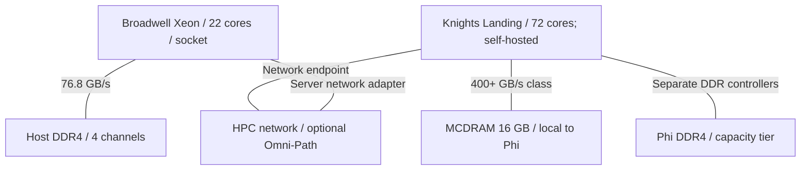
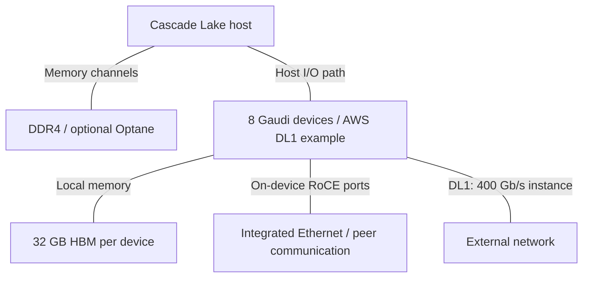
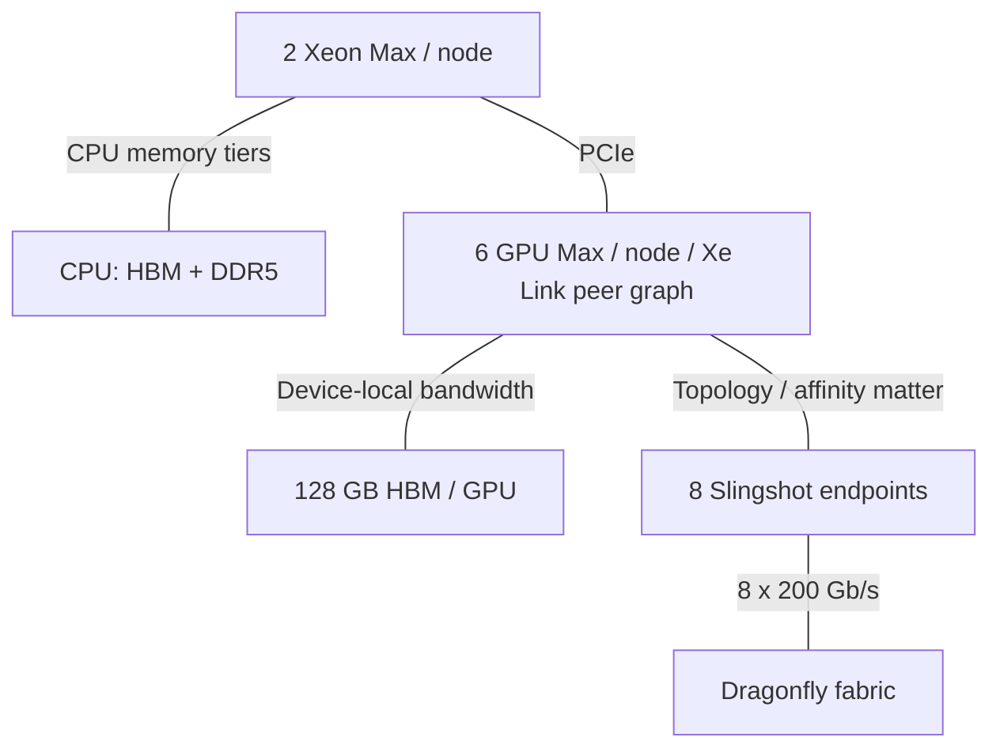
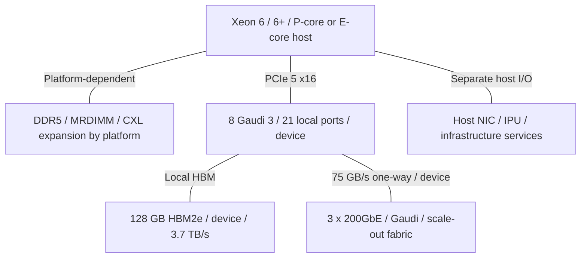

# Intel AI Infrastructure Architecture Evolution

2015-2026 | 2026-09-28

## 01 Executive synthesis and scope

Intel’s AI infrastructure history is a history of several interacting architectures, rather than a single accelerator succession. Xeon remains the general-purpose execution and orchestration layer. Gaudi builds a training system around matrix engines and integrated Ethernet. Ponte Vecchio pursues heterogeneous packaging and high-performance scientific computing. IPUs remove infrastructure work from tenant CPUs. The latest inference GPU direction emphasizes model capacity and deployment into air-cooled servers. The central architectural question is how these independently developed components form a useful system.

Coverage runs from 2015 to 28 September 2026, with a short Haswell baseline. The organizing unit is the product generation. CPU and accelerator sections receive the greatest depth; networking, IPUs, packaging, optics, FPGA, memory, software and systems complete the portfolio. Client and edge products appear where they explain shared technology or a distinct deployment model. This is a curated technical history, not an inventory of every SKU or every Intel-affiliated conference paper.

The most consequential CPU transitions are the move from ring to mesh, the separation of private-cache and last-level-cache roles, the arrival of AMX and integrated offload engines, and the split into performance-core and efficiency-core server products. Chiplets then change from a way to extend die area into a way to place cores, cache and I/O on different processes. Clearwater Forest makes that separation vertical; Diamond Rapids extends it into a new announced performance-core platform. On accelerators, continuity is weaker: technical achievement and commercial roadmap survival must be assessed separately.

### Portfolio map at the cutoff

| Layer | Families | Architectural role | Status boundary |
| --- | --- | --- | --- |
| Host compute | Xeon Scalable / Xeon 6 / 6+ | General compute, AMX, orchestration | Diamond Rapids disclosed; GA not established |
| Accelerators | Gaudi / GPU Max / Flex / Crescent Island | Training, HPC, media and inference | Crescent Island announced; Falcon Shores internal only |
| Network / infrastructure | E810 / E830 / E835; IPU E2000/E2100 | RDMA, packet processing, storage isolation | NIC and IPU are different device classes |
| Adjacent technology | EMIB / Foveros / OCI / Altera / Optane | Integration, optical links, programmable logic, memory | OCI demonstration; Altera 49% retained; Optane exited |

## 02 How to read the numbers

All bandwidths use decimal GB/s or TB/s. DRAM peak equals channels × transfer rate × eight data bytes; ECC bits do not add payload bandwidth. PCIe figures are per direction and precede protocol overhead. Ethernet Gb/s is divided by eight before comparison with memory bandwidth. A bidirectional aggregate is divided by two only when the source makes that convention explicit. HBM, package fabric, scale-up and scale-out bandwidth remain separate budgets.

CPU rows use representative high-end shipping configurations, not a composite assembled from different SKUs. Accelerator arithmetic is dense peak, with multiply-add counted as two operations. Tensor BF16 is not vector BF16; emulated formats are not native formats. Historical shipping does not mean currently orderable. Announcement, sampling and general availability are distinct. n/d means the reviewed evidence did not establish the value; n/a means the field does not apply. Sources are collected in the final source map and bibliography so the narrative can remain readable.

## 03 Xeon generation atlas

The table is a reference-SKU comparison: 8592+ is 350 W, while other Emerald Rapids SKUs have different power limits. Cooper Lake and Ice Lake are both called third-generation Xeon Scalable but address different socket segments and use different cores. Sierra Forest’s shipping 144-core reference must not be silently replaced by an earlier 288-core roadmap target. The Diamond Rapids row records the August 2026 disclosure, not final SKU specifications. Its memory figure is a channel-rate calculation; the reviewed announcement does not establish the final DIMM qualification matrix.

### CPU reference configurations

| Generation / reference SKU | Codename | GA | Status | Core µarch | Cores / threads | Process per die | Dies / packaging | L2 per core | L3 / domain | Memory: channels; rate; GB/s | Sockets / links | PCIe / CXL | TDP | Vector / matrix ISA |
| --- | --- | --- | --- | --- | --- | --- | --- | --- | --- | --- | --- | --- | --- | --- |
| E5 v4 / 2699 v4 | Broadwell-EP | 2016 | Historical shipping | Broadwell | 22 / 44 | 14 nm | Monolithic; ring | 256 KB | 55 MB inclusive | DDR4; 4; 2400; 76.8 | 2S; QPI 9.6 GT/s | 40 PCIe 3; CXL n/a | 145 W | AVX2 |
| 1st / 8180 | Skylake-SP | 2017 | Historical shipping | Skylake | 28 / 56 | 14 nm | Monolithic; mesh | 1 MB | 38.5 MB non-inclusive | DDR4; 6; 2666; ~128 | 2/4/8S; 3 UPI 10.4 GT/s | 48 PCIe 3; CXL n/a | 205 W | AVX-512 |
| 2nd / 8280 | Cascade Lake | 2019 | Historical shipping | Skylake-derived | 28 / 56 | 14 nm | Monolithic; mesh | 1 MB | 38.5 MB | DDR4; 6; 2933; ~140.8 | 2/4/8S; 3 UPI 10.4 GT/s | 48 PCIe 3; CXL n/a | 205 W | AVX-512; VNNI |
| 3rd / 8380HL | Cooper Lake | 2020 | Historical shipping | Skylake-derived | 28 / 56 | 14 nm | Monolithic; scale-up | 1 MB | 38.5 MB | DDR4; 6; 3200; 153.6 | 4/8S; 6 UPI 10.4 GT/s | 48 PCIe 3; CXL n/a | 250 W | AVX-512; BF16; VNNI |
| 3rd / 8380 | Ice Lake-SP | 2021 | Historical shipping | Sunny Cove | 40 / 80 | 10 nm | Monolithic; mesh | 1.25 MB | 60 MB | DDR4; 8; 3200; 204.8 | 2S; 3 UPI 11.2 GT/s | 64 PCIe 4; CXL n/a | 270 W | AVX-512; VNNI |
| 4th / 8490H | Sapphire Rapids | 2023 | Historical shipping | Golden Cove | 60 / 120 | Intel 7 | 4 compute tiles; EMIB | 2 MB | 112.5 MB | DDR5; 8; 4800; 307.2 | up to 8S; 4 UPI 16 GT/s | 80 PCIe 5; CXL 1.1 | 350 W | AVX-512; AMX INT8/BF16 |
| Xeon Max / 9480 | Sapphire Rapids HBM | 2023 | Historical shipping | Golden Cove | 56 / 112 | Intel 7 | 4 tiles + 4 HBM stacks; EMIB | 2 MB | 112.5 MB | DDR5; 8; 4800; 307.2 + HBM2e 64 GB ~1000 | 2S; UPI 16 GT/s | 80 PCIe 5; CXL 1.1 | 350 W | AVX-512; AMX INT8/BF16 |
| 5th / 8592+ | Emerald Rapids | 2023-12 | Historical shipping | Raptor Cove | 64 / 128 | Intel 7 | 2 tiles high-end; EMIB | 2 MB | 320 MB | DDR5; 8; 5600; 358.4 | 2S; 4 UPI 20 GT/s | 80 PCIe 5; CXL 1.1 | 350 W | AVX-512; AMX INT8/BF16 |
| 6 E / 6780E | Sierra Forest | 2024-06 | Shipping | Crestmont | 144 / 144 | Intel 3 + Intel 7 I/O | Compute + 2 I/O; EMIB | 4 MB / 4-core cluster | 108 MB | DDR5; 8; 6400; 409.6 | 2S; UPI 24 GT/s | 88 PCIe 5; CXL 2.0; shared lane budget | 330 W | AVX2; VNNI; no AMX |
| 6 P / 6980P | Granite Rapids | 2024-09 | Shipping | Redwood Cove | 128 / 256 | Intel 3 + Intel 7 I/O | 3 compute + 2 I/O; EMIB | 2 MB | 504 MB | DDR5; 12; 6400; 614.4 / MRDIMM 8800; 844.8 | 2S; UPI 24 GT/s | 96 PCIe 5; CXL 2.0 | 500 W | AVX-512; AMX INT8/BF16/FP16 |
| 6+ / 6990E+ | Clearwater Forest | 2026-06 | Shipping | Darkmont | 288 / 288 | Intel 18A compute; Intel 3 base; Intel 7 I/O | 12 compute + 3 base + 2 I/O; 3D + EMIB | n/d | 576 MB | DDR5; 12; 8000; 768 | 2S; link details n/d | 96 PCIe 5; CXL allocation n/d | 450 W | AVX2; no AMX |
| Next Xeon | Diamond Rapids | n/d | Disclosed; GA n/d | New performance core | 256 / n/d | Intel 18A-P | Foveros Direct 3D; UCIe-S | n/d | 1.28 GB | 16; 12800 MT/s; 1638.4 derived | n/d | 128 PCIe 6; CXL 3.0 | n/d | APX; enhanced AMX |

## 04 Haswell and Broadwell: the monolithic baseline

Haswell-EP established the 2015 starting point with AVX2, DDR4 and a ring-connected server die. Broadwell-EP’s 2016 shrink to 14 nm raised the high-end E5 core count to 22 while retaining a 256 KB private L2 and a large inclusive LLC. The important constraint is the balance among cores, four memory channels and the ring. More cores increase aggregate execution demand without proportionately increasing off-chip bandwidth. Even before dedicated AI hardware, streaming and sparse workloads could run out of memory bandwidth before they ran out of arithmetic.

E5-2600 and E7 should be kept separate: E7 emphasized larger coherent socket domains and reliability, while E5 defined mainstream one- and two-socket servers. Xeon D brought related x86 technology into an integrated, lower-power SoC for network and edge systems. Desktop Core shared a core lineage but not the server’s memory-channel count, cache organization or socket interconnect. This distinction remains necessary throughout the report: core architecture is only one component of a server product.

## 05 Skylake, Cascade Lake and Cooper Lake

Skylake-SP’s 2017 change is architectural, not merely a core-count increment. A two-dimensional mesh replaces the ring. Private L2 grows from 256 KB to 1 MB, while the LLC becomes smaller per core and non-inclusive. Capacity comparisons that add or compare L3 alone therefore misread the hierarchy. The larger private cache retains active data closer to execution; the LLC can act more effectively as a shared capacity and victim resource. Mesh routing, directory behavior and sub-NUMA clustering make placement important even inside one socket.

Six DDR4 channels, UPI and AVX-512 accompany the mesh. AVX-512 doubles vector width relative to AVX2, but supported execution resources and operating frequency depend on SKU and instruction mix. Sustained application gain cannot be inferred from width alone. Cascade Lake keeps this broad organization and adds VNNI to reduce the instruction work for low-precision dot products. Its Optane persistent-memory support changes capacity and persistence semantics, not simply memory speed. The 9200-series Cascade Lake AP places two dies in one package; its 56-core headline is a separate product construction.

Cooper Lake adds AVX-512 BF16 and stronger multi-socket connectivity for scale-up systems. It is not the same silicon generation as Ice Lake, despite sharing the third-generation Xeon Scalable label. BF16 keeps FP32-like exponent range while shortening the significand, making it useful for neural-network arithmetic with appropriate accumulation. This is still vector execution, before AMX’s tile-based matrix datapath. Hot Chips’ Cascade Lake presentation supplies the feature transition; product and optimization documentation identify the actual deployment and programming constraints.

## 06 Ice Lake: a wider core and a wider server

Ice Lake-SP arrives in 2021 with Sunny Cove, up to 40 cores, eight DDR4 channels and PCIe 4. The core expands out-of-order resources and the memory subsystem relative to the Skylake family, while the server implementation supplies a 1.25 MB L2 per core. A client Sunny Cove block diagram is useful background but is not a substitute for server cache and uncore documentation. The shift to eight memory channels raises theoretical DDR bandwidth to 204.8 GB/s, a substantial system change alongside the process and core improvements.

The server gains a more useful I/O budget for storage and accelerators, while SGX and memory-protection features address cloud isolation requirements. Yet it remains a monolithic CPU with a conventional external accelerator relationship. PCIe 4 x16 offers about 31.5 GB/s in one direction before higher-level overhead, far below the local memory bandwidth of contemporary HBM accelerators. Offloading a small kernel can therefore lose to keeping the computation on the CPU once transfer and synchronization are included. Xeon D derivatives adapt related technology to edge connectivity and long-lived platforms rather than reproducing the full server socket.

## 07 Sapphire Rapids and Xeon Max: tiles and engines

Sapphire Rapids, commercially launched in January 2023, combines Golden Cove cores with DDR5, PCIe 5, CXL 1.1 and a four-tile EMIB construction in its high-end configuration. Each tile participates in a package-wide coherent system rather than exposing four independent processors. The ISSCC 2022 disclosure describes a quasi-monolithic integration approach and 10 TB/s of total die-to-die bandwidth across 20 interfaces at 0.5 pJ/bit. Those are implementation-level aggregate figures; they are not socket DRAM bandwidth or a software-visible remote-memory guarantee. Intel 7 is the commercial process name despite differing terminology in some conference summaries.

AMX changes CPU AI execution more fundamentally than another vector-width increase. Software configures tile registers and invokes matrix operations on blocks of INT8 or BF16 data. Libraries must select supported kernels, pack operands and manage tile state. Matrix peak rises faster than DRAM bandwidth, so cache reuse and batching become more valuable. AMX is therefore especially useful when a workload can retain data in cache or amortize weight reads; it does not make every inference workload compute-bound. CPU computation remains attractive for control-heavy operators and modest deployment sizes.

DSA, IAA, QAT and DLB target different kinds of overhead: data movement, analytics/compression, cryptography/compression, and event distribution. Their value comes from removing work and cache pollution from cores, but queue submission, completion, data locality and minimum useful transfer sizes still matter. The ASPLOS 2024 DSA study measures these tradeoffs on actual hardware. A block appearing on the package is not evidence that an application automatically uses it; software enablement and SKU licensing/configuration must be checked.

Xeon Max adds 64 GB of HBM2e around the CPU tiles, exposing HBM-only, flat and cache usage modes. This brings roughly 1 TB/s of local high-bandwidth memory to CPU code without converting the application to a GPU execution model. In flat mode, allocation policy determines which objects receive HBM service; in cache mode, locality and working-set behavior determine the benefit. HBM and DDR peaks cannot simply be added as the sustained bandwidth of one stream. Capacity-limited applications may still require DDR, while bandwidth-heavy scientific kernels can benefit substantially from the near-memory tier.

## 08 Emerald Rapids: cache and integration efficiency

Emerald Rapids launches in December 2023 on the established platform, with up to 64 cores and 320 MB LLC. The high-end implementation uses two larger tiles rather than Sapphire Rapids’ four-tile arrangement. Reducing tile boundaries changes fabric traffic, physical integration and cache organization without requiring a wholesale platform replacement. ISSCC 2024 is the useful implementation anchor: the disclosure emphasizes the Intel 7 multichip construction and substantially larger shared cache. Its reported iso-power workload gains are measured comparisons, not a universal IPC multiplier.

The representative 64-core part provides 5 MB of LLC per core, versus 1.875 MB for the 60-core Sapphire Rapids reference. That capacity increase can reduce expensive DRAM accesses for databases, graph structures and reused model data. DDR5-5600 also raises the channel peak, but the architectural gain depends on whether a workload was cache-capacity-limited, bandwidth-limited or compute-limited. This generation demonstrates why packaging and cache redesign can matter even when the process node and major matrix ISA remain unchanged.

## 09 Xeon 6: separating performance and density

Hot Chips 2023 disclosed the shared platform strategy behind Granite Rapids and Sierra Forest before their 2024 launches. Compute tiles and I/O tiles are separated, allowing Intel 3 cores to be combined with Intel 7 I/O. The server family offers common infrastructure with different compute choices; it is not a hybrid desktop CPU mixing P-cores and E-cores in one socket. DDR5, CXL 2.0 and built-in accelerators belong to the platform story, while vector capability, cache organization and thread behavior remain core-family-specific.

Granite Rapids’ high-end 6900P configuration reaches 128 Redwood Cove cores, three compute tiles, twelve memory channels and 500 W on the 6980P reference. MRDIMM raises the qualified memory data rate to 8800 MT/s, yielding 844.8 GB/s of theoretical channel bandwidth. AMX adds FP16 support. The engineering point is balanced throughput: a much larger core complex needs more memory bandwidth and package connectivity, not just faster cores. The 6700P expansion in 2025 serves a different platform and channel envelope; its specifications should not be mixed with 6900P.

Sierra Forest’s 144-core shipping reference uses Crestmont E-cores without SMT or AMX. Four-core clusters share L2. The intended gain is density for independent throughput-oriented services, not equivalence to 144 large vector cores. A cloud service with many small requests can exploit this configuration; a heavily vectorized AMX workload cannot assume the same instruction path as Granite Rapids. At full population, the reference has about 2.84 GB/s of DRAM channel bandwidth per core. Core count is therefore meaningful only alongside workload concurrency, cache behavior and memory demand.

## 10 Clearwater Forest and Diamond Rapids

Clearwater Forest was discussed at Hot Chips 2025 and MWC 2026, then launched as Xeon 6+ in June 2026. Its 288 Darkmont E-cores occupy twelve Intel 18A compute chiplets above three Intel 3 base dies, with Intel 7 I/O. Foveros Direct 3D and EMIB combine vertical and lateral integration. This separates dense compute from cache/fabric and I/O implementation. The architectural opportunity is process specialization and shorter dense vertical connections; the corresponding engineering burden includes assembly yield, thermal coupling, power delivery and fabric placement.

The 6990E+ reference has 576 MB LLC and twelve DDR5-8000 channels. Compared with Sierra Forest’s reference, core count doubles while DRAM peak rises from 409.6 to 768 GB/s. Per-core channel bandwidth therefore changes from about 2.84 to 2.67 GB/s, while average LLC capacity rises from 0.75 to 2 MB per core. This is a cache-and-density design, not a claim that every core receives more external bandwidth. Its 288 cores are 288 hardware threads; multiplying by two would incorrectly apply P-core SMT behavior.

At Hot Chips 2026, Intel disclosed Diamond Rapids with up to 256 new cores, 1.28 GB LLC, sixteen memory channels at 12800 MT/s, 128 PCIe 6 lanes and CXL 3.0. Intel 18A-P, Foveros Direct 3D, UCIe-S, a unified memory fabric, APX and enhanced AMX define the announced direction. The design moves performance-core Xeon toward a much larger distributed package. The public announcement establishes these headline parameters; it does not establish final SKU power, detailed queue sizes, thread count or commercial availability. Coral Rapids remains a subsequent roadmap name rather than a table of shipping specifications.

## 11 Accelerator generation atlas

### Accelerator reference configurations

| Product | Architecture | GA / milestone | Status | Process | Dies / packaging | Compute units | Dense BF16 | Dense FP8 | Dense FP6 / FP4 | FP64 vector / matrix | Memory: type; stacks; GB; TB/s | LLC / SRAM | Scale-up: links; GB/s per direction; domain | Host link | Power / cooling | Form factor |
| --- | --- | --- | --- | --- | --- | --- | --- | --- | --- | --- | --- | --- | --- | --- | --- | --- |
| Xeon Phi 7290 | Knights Landing | 2016 | Historical shipping | 14 nm | CPU + on-package MCDRAM | 72 cores / 288 threads | n/a | n/a | n/a | ~3.46 TF / n/a | MCDRAM; 8; 16; >0.4 measured STREAM; DDR4 separate | 36 MB distributed L2 | n/a; optional Omni-Path fabric | Self-hosted; PCIe 3 | 245 W | Socketed processor |
| Gaudi / HL-205 | Gaudi | 2021 AWS DL1 | Historical shipping | 16 nm | 1 compute die + HBM | 8 TPC; MME | n/d | n/a | n/a | n/a | HBM2; n/d; 32; ~1 | n/d | 10 x 100GbE; 125 total; 8-device server | PCIe 4 | n/d | OAM |
| Gaudi 2 | Gaudi 2 | 2022 | Historical shipping | 7 nm | 1 compute die + HBM | 24 TPC / 2 MME | 432 TF | 865 TF | n/a | n/a | HBM2e; 6; 96; 2.46 | 48 MB SRAM | 24 x 100GbE; 300 total; 8-device server | PCIe 4 x16 | 600 W | OAM |
| Gaudi 3 / HL-325L | Gaudi 3 | 2024 | Shipping | 5 nm | 2 compute dies + HBM | 64 TPC / 8 MME | 1678 TF | 1678 TF | n/a | n/a | HBM2e; 8; 128; 3.7 | 96 MB SRAM | 24 x 200GbE; 600 total; 8-device server | PCIe 5 x16 | Up to 900 W; air/liquid variants | OAM |
| GPU Max 1550 | Ponte Vecchio / Xe-HPC | 2023 | Historical shipping | TSMC N5 compute; Intel 7 base; TSMC N7 link | 47-tile integration; EMIB + Foveros | 128 Xe cores / 1024 XMX | 839 TF | n/a | n/a | 52 TF native; split n/d | HBM2e; 8; 128; 3.2 | 408 MB L2 | Xe Link; 318 on Lenovo reference; 4-GPU domain | PCIe 5 x16 | 600 W; platform-dependent | OAM |
| GPU Flex 170 | Xe-HPG | 2022 | Historical shipping | TSMC N6 | Single GPU | 32 Xe cores | n/d | n/a | n/a | n/d | GDDR6; n/a; 16; 0.576 | n/d | n/a | PCIe 4 x16 | 150 W; passive air | PCIe |
| Crescent Island | Xe3P | n/d | Disclosed; GA n/d | n/d | n/d | 32 Xe cores / 256 XMX | n/d | n/d | n/d | n/d | LPDDR5X; n/a; up to 480; n/d | n/d | n/d | PCIe; generation n/d | 350 W; air | PCIe |

Gaudi 3 uses the retrieved architecture whitepaper’s 1678 TFLOPS BF16/FP8 values, not a mixture with other clock-point marketing figures. The 600 W HL-338 PCIe card is a separate configuration and should not inherit OAM peak numbers without verification. GPU Max’s 636 GB/s bidirectional Xe Link figure comes from the specific Lenovo system specification and is normalized to 318 GB/s per direction. It is not a claim that every Ponte Vecchio system exposes the same external link topology. Xeon Phi is included as a historical many-core accelerator lineage, although Knights Landing can boot its own operating system.

## 12 Xeon Phi and Nervana: earlier parallel-compute paths

Knights Landing, disclosed at Hot Chips 2015 and commercialized in 2016, combines many small x86 cores, four hardware threads per core, wide vector execution, a mesh and 16 GB of on-package MCDRAM. It is more than a PCIe coprocessor: a self-hosted system can run a conventional operating system and use DDR4 for capacity. Cache, flat and hybrid memory modes expose an early version of the placement problem later revisited by Xeon Max. The software appeal is x86 and familiar parallel programming; achieving throughput still requires vectorization, many concurrent threads and careful memory use.

Knights Mill redirected the many-core line toward deep learning with specialized vector instructions, but it did not become the AMX architecture used by later Xeons. Nervana’s NNP-T and NNP-I subsequently explored dedicated training and inference datapaths. Intel’s acquisition of Habana and the later concentration on Gaudi changed the commercial direction. These branches belong in the history because they reveal changing assumptions about programmability, numerical formats and interconnect, not because they form a continuous shipping sequence into current GPUs. A discontinued program’s projected successor must not appear as a delivered generation.

## 13 Gaudi 1, 2 and 3: Ethernet inside the accelerator

Gaudi begins with a different decomposition from a graphics-derived GPU. Matrix multiplication engines perform the dense linear algebra; programmable Tensor Processor Cores handle the surrounding operations; local HBM supplies capacity and bandwidth; integrated RoCE-capable Ethernet ports carry device communication. AWS DL1’s October 2021 general availability provides a concrete first-generation deployment milestone: eight Gaudi devices with 32 GB HBM each. Its 400 Gb/s instance networking is a cloud service limit and must not be confused with the sum of every on-chip Gaudi port.

Gaudi 2 scales the design to 24 TPCs, two MMEs, 96 GB HBM2e and 24 × 100 GbE ports. The matrix path supports BF16 and FP8 at different peak rates. A large software-managed SRAM helps reuse data and reduce HBM traffic, but it is not automatically equivalent to a CPU’s coherent last-level cache. The architecture depends on compiler scheduling across matrix, vector, DMA and communication resources. Its main system distinction is the ability to build both the local accelerator group and the external fabric from Ethernet mechanisms.

Gaudi 3 moves to two compute dies, eight MMEs, 64 TPCs, 128 GB HBM2e and 24 × 200 GbE. The two-die construction expands compute and memory interfaces, while communication must cross internal partitions when data is not local. On the eight-accelerator baseboard, 21 ports per device supply three links to each of seven peers, leaving three ports for scale-out. That partitions the 600 GB/s one-way all-port budget into 525 GB/s local peer traffic and 75 GB/s external traffic. The total cannot be counted independently in both directions and both roles.

Integrated networking removes the need for a separate NIC for these accelerator links, but it does not remove the Ethernet switching fabric, congestion control, cabling or collective algorithms. HCCL, SynapseAI and framework integration determine whether the hardware overlaps communication with computation and supports the needed operators. Gaudi 3’s PCIe variant extends deployment into more conventional servers with a different power envelope. The practical comparison with a GPU system is therefore a complete supported training or inference configuration, including software and network topology, rather than a single peak-FLOPS column.

## 14 Ponte Vecchio: a heterogeneous HPC package

Ponte Vecchio’s ISSCC 2022 disclosure is one of the clearest examples of implementation driving architecture. The 47-tile integration includes sixteen 5 nm compute tiles and multiple process technologies, connected through Foveros and EMIB. The count is not 47 compute dies. Compute tiles, base/cache resources, link tiles and HBM perform different roles. This lets each function use a suitable manufacturing and integration choice, at the cost of complex assembly, testing, power delivery and thermal management. The conference prototype’s measured figures and the later GPU Max SKU peaks are different evidence points.

The commercial Max 1550 combines 128 Xe-HPC cores, XMX matrix execution, strong native FP64, 128 GB HBM2e and a large distributed L2. Unlike an inference-only accelerator, it invests heavily in scientific arithmetic and HPC execution. Xe Link connects peer GPUs; PCIe connects the host. A unified programming abstraction does not make CPU DDR and GPU HBM physically uniform or equally fast. Aurora demonstrates a system built around CPU and GPU high-bandwidth memory, but its communication and placement costs still have to be managed by applications and runtimes.

Ponte Vecchio’s technical success as an integration vehicle should be separated from the breadth and longevity of the commercial line. Lenovo’s SD650-I V3 product guide is explicitly marked withdrawn, despite documenting a real four-GPU system. Falcon Shores was later designated an internal test chip rather than a marketed successor. Consequently, it is misleading to draw an uninterrupted arrow from Xeon Phi through GPU Max to a shipping Falcon Shores platform. Product continuity, software support and deployable system supply are architecture constraints in their own right.

## 15 Flex, Arc and Crescent Island: inference branches

Flex 140 and Flex 170 serve media processing, cloud graphics, virtualization and visual inference with Xe-HPG technology and GDDR6. Flex 140 places two small GPUs on a 75 W card, with separate 6 GB memories; these are not one coherent 12 GB GPU. Flex 170 uses one 32-core GPU with 16 GB and a 150 W board envelope. Shared technology with Arc explains the graphics and media engines, but server drivers, virtualization, cooling and supported workloads determine the datacenter product. A graphics-derived matrix engine does not imply GPU Max’s FP64 or HBM characteristics.

Crescent Island is a distinct inference-oriented direction. The October 2025 OCP announcement described 160 GB LPDDR5X and customer sampling targeted for the second half of 2026. By Computex and Hot Chips 2026, Intel described up to 480 GB, a 350 W air-cooled PCIe card, 32 Xe3P cores and 256 XMX engines. The later capacity disclosure supersedes the earlier headline rather than proving that every future SKU has 480 GB. Sampling expectations are not general availability. No unsupported memory-bandwidth or low-precision throughput figure is inferred from the core count.

The architectural inference is that Intel is prioritizing resident model capacity, long contexts and installation in existing air-cooled facilities. Large memory can avoid model sharding and repeated host transfers, but capacity alone does not establish token latency. Decode may remain bandwidth-bound, while prefill demands matrix throughput; concurrency changes both. LPDDR and HBM therefore occupy different design points. The meaningful test is tokens per second at a specified latency, model, context length, precision and power limit, not whether one memory capacity number exceeds an HBM GPU’s capacity.

Core Ultra extends the same heterogeneous-compute idea into the client and edge, combining CPU, integrated GPU and NPU. The NPU’s low-power inference role differs from a datacenter training accelerator, while Arc-derived graphics and media technology connects to the Flex lineage. OpenVINO provides an inference deployment layer across supported CPU, GPU and NPU devices. Model conversion and common APIs help portability, but device plugins, supported operators, memory limits and precision still differ. Shared branding or a common runtime must not be used to transfer server GPU bandwidth or matrix rates to a client part.

## 16 Ethernet NICs, IPUs and programmable networks

### Network and infrastructure devices

| Product | GA / milestone | Status | Class | Ports × speed | SerDes | Host interface | Programmable engine | Embedded CPU | On-card memory | Transport / RDMA | Congestion control | Key offloads | Power |
| --- | --- | --- | --- | --- | --- | --- | --- | --- | --- | --- | --- | --- | --- |
| E810 | 2019 | Historical shipping | Ethernet NIC | Up to 100GbE; card-dependent | 25G NRZ | PCIe 4 | DDP pipeline profiles | n/a | n/d | iWARP / RoCEv2 | Protocol / driver-dependent | Virtualization, RSS, timing | n/d |
| E830-CQDA2 | 2025 | Shipping | Ethernet NIC | 2 x 100GbE | 50G PAM4 | PCIe 5 x8 / PCIe 4 x16 | DDP / packet classification | n/a | n/d | Ethernet; RDMA SKU-dependent | n/d | Packet processing, timing, telemetry | n/d |
| E835 | 2026-06 | Shipping | Ethernet NIC | 1 x 200 / 2 x 100GbE; variants | n/d | n/d | Configurable ports / packet processing | n/a | n/d | iWARP + RoCEv2 | n/d | RDMA, timing, security | n/d |
| IPU E2100-CCQDA2 | 2023-2024 documentation | Shipping | ASIC IPU | 1 x 200 / 2 x 100GbE | 50G PAM4 / 25G NRZ | PCIe 4 x16 | P4 pipeline | 16 Arm Neoverse N1 | 48 GB LPDDR4x; 32 MB SLC | Ethernet; programmable storage transport | Traffic shaping; implementation-specific | NVMe, IPsec, crypto, compression, isolation | n/d |
| Gaudi 3 integrated NIC | 2024 | Shipping | On-accelerator fabric | 24 x 200GbE | 48 x 112G PAM4 | Internal to accelerator | Communication engines | n/a | Uses accelerator memory | RoCE | Ethernet fabric configuration | Device RDMA and collectives | Included in accelerator power |

Intel’s conventional Ethernet controllers evolve from E810’s 100 GbE generation toward E830 and E835 configurations reaching 200 GbE. These products support general server networking, virtualization, timing and selected RDMA capabilities. They should not be relabeled as dedicated AI collective engines merely because they can carry AI traffic. The host link, port allocation and transport configuration limit delivered bandwidth. A 200 Gb/s port is 25 GB/s in one direction before overhead; two connectors do not necessarily mean two independently available 200 Gb/s ports.

The IPU is a different architectural layer. Mount Evans/E2000 introduced an ASIC infrastructure processor co-developed with Google; E2100 adapter documentation specifies a 16-core Arm Neoverse N1 complex, a P4 packet pipeline, 48 GB LPDDR4x and hardware storage/security engines. The Arm cores run infrastructure software independently of the tenant host. The offload path can terminate virtual storage and networking while preserving a separate trust and management domain. E2000 denotes the family/architectural lineage; the E2100 adapter brief explicitly names an E2100 SoC, so those labels should not be collapsed into an unsupported silicon identity claim.

Google Cloud Next 2022 connected the IPU architecture to a real service: C3 combined fourth-generation Xeon with Google’s custom Intel IPU, initially in private preview and generally available in May 2023. This is stronger deployment evidence than a generic roadmap slide. FPGA-based IPU and SmartNIC designs represent another implementation branch, trading reconfigurability for a different power, cost and software profile. Tofino’s P4-programmable switch datapath is yet another class: switching and stateful packet processing do not make it a host IPU. Intel’s discontinuation of the Tofino line limits its role to historical infrastructure and deployed systems.

Architecture Day 2021 made the implementation branches explicit. Oak Springs Canyon combined Xeon D and Agilex FPGA as an IPU reference platform, while Arrow Creek became the N6000 FPGA-based acceleration development platform/SmartNIC. Mount Evans used an ASIC approach. The distinction matters when evaluating programmability: FPGA logic can change the datapath itself, whereas an ASIC packet pipeline exposes a bounded programming model and general-purpose cores handle exceptions and control. None of these names alone establishes a particular AI collective-offload capability.

## 17 Interconnect, memory, optics and programmable logic

### Separate bandwidth domains

| Interconnect | Year / generation | Lane rate | Lanes / link | GB/s per link per direction | Links / device | Topology | Domain limit | Coherence / semantics |
| --- | --- | --- | --- | --- | --- | --- | --- | --- |
| PCIe 3 | 2010s | 8 GT/s | 16 | 15.75 | Platform-dependent | Root / switch tree | n/a | I/O; no general cache coherence |
| PCIe 4 | Ice Lake / Gaudi 2 | 16 GT/s | 16 | 31.51 | Platform-dependent | Root / switch tree | n/a | I/O DMA |
| PCIe 5 | Sapphire / Gaudi 3 | 32 GT/s | 16 | 63.02 | Platform-dependent | Root / switch tree | n/a | I/O; CXL is a separate protocol |
| CXL 1.1 → 2.0 → 3.0 | SPR → Xeon 6 → Diamond | PCIe PHY generation-dependent | n/d | n/d | Shared physical lane budget | Direct / switched by version | n/d | Cache / memory semantics by device type |
| Gaudi 3 Ethernet | 2024 | 112G PAM4 SerDes | 2 per 200GbE | 25 | 24 | 3 links × 7 peers + 3 external | 8 local | RDMA; not CPU cache coherence |
| Xe Link / Max 1550 | 2023 | n/d | n/d | n/d | n/d | System-wired GPU graph | 4 GPU Lenovo reference | Peer GPU memory traffic |
| Optical compute interconnect | 2024 demo | 32 Gb/s optical channel | n/a | 250 aggregate TX, derived | n/a | Optical chip-to-chip | n/d | Physical I/O demonstration, not a coherence protocol |

UPI maintains CPU socket coherence, whereas PCIe is primarily an I/O transport and CXL adds defined cache and memory protocols over related physical links. Version support alone does not prove that every device type, switching configuration or pooling mode is enabled in a server. Real CXL measurements on Sapphire Rapids at MICRO 2023 show why latency, bandwidth asymmetry, placement and device implementation matter. A larger addressable memory tier is useful only if software places the right data there. The same reasoning applies to Optane: persistence requires crash-consistency mechanisms and has different read/write behavior from DRAM.

Intel’s OFC 2024 optical compute interconnect demonstration co-packaged an optical I/O chiplet with a CPU and carried live data. The disclosed 4 Tb/s bidirectional aggregate is 500 GB/s combined, or 250 GB/s per direction under the stated symmetric convention. Its purpose is to extend reach and improve electrical-to-optical integration as electrical package escape becomes expensive. It is a technology demonstration, not evidence that shipping Xeons already expose an optical coherent fabric. Optical I/O, Ethernet switching and memory coherence solve different layers of the system problem.

Altera’s Stratix and Agilex families bring reconfigurable datapaths, hardened interfaces and packaging experience into Intel’s historical infrastructure portfolio. FPGA acceleration is attractive when a streaming pipeline, protocol or low-latency operation can be specialized; it is not interchangeable with a general training GPU. EMIB’s role in FPGA integration also helps explain its later use in Xeon and GPU packages. Ownership changes the current portfolio boundary: the sale of 51% of Altera closed on 12 September 2025, leaving Intel with 49%. Treating Altera as a wholly owned Intel product group in 2026 would therefore be incorrect.

Optane was exited in 2022; a planned future persistent-memory module should not be counted as a shipped Sapphire Rapids feature. Omni-Path belongs to Intel’s earlier HPC fabric history, while subsequent Cornelis products belong to that company’s portfolio. Loihi 2 and Hala Point are neuromorphic research systems with event-driven computation and a different programming model, not drop-in datacenter GPUs. These technologies are important context, but none should be used to inflate the count of currently supported Intel AI training platforms.

## 18 Systems and software: the usable architecture

### Representative deployed or documented systems

| Platform | Year / milestone | CPU / accelerator count | Scale-up domain | Scale-out per accelerator | Rack power | Cooling |
| --- | --- | --- | --- | --- | --- | --- |
| AWS DL1 | 2021 GA | 2 Xeon; 8 Gaudi | 8 Gaudi | 400Gb/s instance ÷ 8 = 6.25 GB/s average; shared | n/d | n/d |
| Aurora | 2023 installation; later user service | 2 Xeon Max + 6 GPU Max / node | 6 GPU node; Xe Link topology | 8 x 200Gb/s NIC ÷ 6 = 33.3 GB/s average | n/d | Direct liquid |
| Lenovo SD650-I V3 | 2023; withdrawn 2024 | Up to 2 Xeon + 4 GPU Max | 4 GPU | Adapter-dependent | n/d | Direct water cooling |
| Gaudi 3 HLB-325 | 2024 | Host CPUs + 8 Gaudi 3 | 8 Gaudi | 3 x 200GbE = 75 GB/s one-way | n/d | Air / liquid variants |
| Google C3 | 2023 GA | Xeon 4th gen + custom IPU | CPU virtual machine | n/a | n/d | n/d |

Aurora’s two CPU Max and six GPU Max devices per node demonstrate why system ratios matter. Eight Slingshot endpoints provide scale-out connectivity, but dividing their aggregate rate by six is an average budget, not six dedicated identical NIC paths. Affinity among CPU NUMA domains, GPU tiles and network endpoints affects real communication. Likewise, an eight-Gaudi baseboard’s local fully connected graph is not an entire datacenter fabric. Oversubscription, collective scheduling and failure recovery determine cluster behavior beyond the node.

### Software milestones and hardware relationship

| Stack / release | Date / era | Hardware enabled | Key features / constraint |
| --- | --- | --- | --- |
| oneDNN / CPU framework libraries | 2017-2026 | Xeon AVX-512 / VNNI / AMX | ISA dispatch, packing and kernel selection; application must use enabled path |
| oneAPI / SYCL / Level Zero | 2020s | Xe GPU / CPU | Shared programming model; placement and device-specific tuning remain |
| SynapseAI / Gaudi software 1.24 | 2026 documentation | Gaudi 2 / Gaudi 3 | PyTorch integration, graph compilation, TPC kernels and HCCL |
| IPU SDK | 2023-2024 documentation | E2100 IPU | P4 pipeline, infrastructure services and host integration |
| DSA / IAA software interfaces | 2023 onward | Xeon integrated engines | Work queues, shared virtual addressing and asynchronous completion; overhead matters |

The software lines are related but not interchangeable. oneAPI/SYCL and Level Zero expose Intel GPU execution; Gaudi uses its own compiler/runtime and communication stack; Xeon libraries dispatch to vector or AMX kernels; IPU software manages infrastructure services. A common framework frontend does not guarantee equal operator coverage, numerical behavior or performance. Evaluate complete model graphs, fallback behavior, quantization, checkpoint portability and distributed communication. This is especially important when a hardware roadmap changes: a technically portable source program may still depend on a vendor-specific optimized kernel ecosystem.

OpenVINO is the inference-oriented bridge across Intel’s CPU, GPU and NPU portfolio. It belongs alongside, rather than in place of, the lower-level compiler/runtime and mathematical libraries. For an enterprise inference deployment, supported model transformations, precision conversion, batching, device selection and profiling can matter more than the application seeing a particular instruction. Its hardware support matrix should be checked against the exact runtime release; a framework’s generic device name is not a promise that every older Intel accelerator remains supported.

## 19 Four system views

These diagrams summarize actual architectural relationships across four eras. Lines identify data paths, not necessarily coherent memory. A per-device bandwidth is not multiplied by device count unless an aggregate is explicitly requested. The drawings intentionally distinguish accelerator-local memory, host memory and external networking; none represents all memory as a uniform pool.

### 2015-2016: host CPU and self-hosted many-core

Xeon and Phi are alternative node constructions here; the diagram does not imply Knights Landing is attached to Broadwell as a mandatory coprocessor.

### 2019-2021: CPU plus Ethernet-connected AI devices

DL1’s external service bandwidth differs from Gaudi’s on-chip aggregate network port bandwidth. Optane is a CPU platform option, not Gaudi HBM.

### 2023-2024: Aurora’s heterogeneous memory hierarchy

An average 33.3 GB/s scale-out budget per GPU follows from 8 × 200 Gb/s divided by six; it is not a uniform dedicated link allocation.

### 2024-2026: specialized compute and infrastructure paths

This is a role diagram, not a claim of one mandatory OEM configuration. Crescent Island is a separate announced PCIe inference branch with LPDDR5X; Diamond Rapids is a disclosed future host platform.

## 20 Normalized ratios and design implications

### Derived ratios from stated reference configurations

| Reference | DRAM GB/s per core | L3 MB per core | Interpretation |
| --- | --- | --- | --- |
| Broadwell 2699 v4 | 3.49 | 2.50 | 22 cores share four channels |
| Skylake 8180 | 4.57 | 1.375 | L2 grows; L3 changes inclusion policy |
| Sapphire 8490H | 5.12 | 1.875 | AMX raises arithmetic demand |
| Emerald 8592+ | 5.60 | 5.00 | Large LLC capacity increase |
| Sierra 6780E | 2.84 | 0.75 | Density-oriented reference |
| Granite 6980P / MRDIMM | 6.60 | 3.9375 | 12 channels at 8800 MT/s |
| Clearwater 6990E+ | 2.67 | 2.00 | Double cores; more cache per core |

### Accelerator balance, dense BF16 basis

| Device | HBM bytes/FLOP | All-port network / HBM BW | External BW / device | BF16 peak / device power |
| --- | --- | --- | --- | --- |
| Gaudi 2 | 0.00569 | 0.122 | 37.5 GB/s, 3 x 100GbE allocation | 0.720 TF/W at 600 W |
| Gaudi 3 | 0.00221 | 0.162 | 75 GB/s, 3 x 200GbE allocation | 1.864 TF/W at 900 W |
| GPU Max 1550 | 0.00381 | 0.0994 Xe Link / HBM, Lenovo basis | System-dependent | 1.398 TF/W at 600 W |

Gaudi 3 increases matrix peak more quickly than HBM bandwidth relative to Gaudi 2: the HBM bytes available per peak BF16 operation fall by more than half on the selected whitepaper basis. More reuse, larger useful tiles or greater batching is needed to approach compute peak. Network bandwidth also remains a fraction of local HBM bandwidth. Communication-heavy parallelism cannot be judged by arithmetic scaling alone. These ratios describe resource balance; they do not predict a model benchmark without its arithmetic intensity and communication pattern.

Peak FLOPS divided by board or device power is an upper-level arithmetic normalization, not measured energy efficiency. It omits host CPUs, DIMMs, switches, optics, cooling and utilization. No cross-vendor performance-per-watt ranking is inferred from this table. For CPUs, per-core memory bandwidth is similarly an equal-share budget, not a guaranteed allocation. The useful engineering question is which layer saturates first and whether software can increase locality or overlap before more hardware is added.

## 21 What the major architecture conferences add

Hot Chips and ISSCC answer complementary questions. Hot Chips usually exposes the block diagram, hierarchy, interfaces and product intent. ISSCC can explain the physical implementation that makes those blocks practical: multi-die signaling, energy per bit, package construction, clocking and power. The strongest examples here are Sapphire Rapids’ quasi-monolithic EMIB fabric, Ponte Vecchio’s multi-process 3D integration and Emerald Rapids’ cache-rich two-tile design. Conference numbers must remain attached to their prototype, measurement condition and disclosure date before being reconciled with commercial SKU data.

ISCA, MICRO, HPCA and ASPLOS are particularly valuable for testing how product mechanisms behave. LIA at ISCA 2025 uses AMX-enabled Xeons and a GPU cooperatively, showing that CPU matrix execution can change offloading decisions. MICRO 2023’s real-device CXL study distinguishes actual memory expansion from software emulation. ASPLOS 2024’s DSA analysis identifies when asynchronous data movement pays for its submission and completion overhead. HPCA 2020’s persistent-memory keynote examines the programming consequences of capacity, persistence and asymmetric access. These are research or measurement results, not proof that Intel adopted every proposed mechanism in silicon.

The conference index distinguishes direct product disclosure, implementation disclosure, independent measurement, and deployment evidence. DAC and Foundry Direct Connect are useful for design enablement, packaging and EDA context; MWC emphasizes telecom and edge; OCP emphasizes platform integration; Computex and Intel’s own launch events establish product positioning and availability. Cloud Next and AWS disclosures connect chips to services. No specific GTC, Microsoft Ignite or DAC product-architecture talk is asserted where a qualifying primary record was not established in this review. That is a bounded coverage gap, not evidence that Intel never participated.

### Conference-to-product index

| Venue | Year | Paper / talk / disclosure | Presenter / authors | Product | Evidence type | Source |
| --- | --- | --- | --- | --- | --- | --- |
| Hot Chips | 2015 | Knights Landing | Avinash Sodani | Xeon Phi | Product architecture | C13 |
| Hot Chips | 2018 | Cascade Lake | Akhilesh Kumar | Xeon 2nd gen | Architecture / VNNI / memory | C06 |
| Hot Chips | 2019 | Nervana; packaging; Optane | Intel | NNP-T / NNP-I | Official press release | C14 |
| HPCA | 2020 | Persistent Memory and the Path to Being Comfortably NUMB | Steven Swanson | Optane context | Independent research keynote | R05 |
| ISSCC | 2022 | Ponte Vecchio: A Multi-Tile 3D Stacked Processor for Exascale Computing | W. Gomes et al. | Ponte Vecchio | Implementation; paper 2.1 press kit | C03 |
| ISSCC | 2022 | Sapphire Rapids: Next-Generation Xeon | Intel | Sapphire Rapids | Implementation; paper 2.2 press kit | C03 |
| Google Cloud Next | 2022 | C3 and custom Intel IPU | Google / Intel | Sapphire Rapids + IPU | Preview; GA followed 2023 | E15 |
| Hot Chips | 2023 | Granite Rapids and Sierra Forest | Intel | Xeon 6 | Architecture briefing slides | C12 |
| MICRO | 2023 | Demystifying CXL Memory with Genuine CXL-Ready Systems and Devices | Yan Sun et al. | Sapphire Rapids / CXL | Real-device measurement | R04 |
| ISSCC | 2024 | Emerald Rapids: 5th-Generation Xeon Scalable | Ashley O. Munch et al. | Emerald Rapids | Implementation; paper 2.3 press kit | C04 |
| ASPLOS | 2024 | A Quantitative Analysis and Guidelines of Data Streaming Accelerator in Modern Intel Xeon Scalable Processors | Reese Kuper et al. | DSA / Sapphire Rapids | Measured offload behavior | R02 |
| Hot Chips | 2024 | Gaudi 3; Xeon 6; optical I/O | Intel | Gaudi 3 / Xeon 6 / OCI | Architecture and demo summary | E13 |
| OFC | 2024 | Integrated optical compute interconnect | Intel IPS | OCI chiplet | Live technology demonstration | E12 |
| Intel Vision | 2024 | Gaudi 3 architecture and open systems | Intel | Gaudi 3 | Product announcement | E20 |
| ISCA | 2025 | LIA: cooperative AMX CPU-GPU computation and CXL offloading | Hyungyo Kim et al. | Sapphire / Granite Rapids | Independent system research | R01 |
| Hot Chips / Tech Tour | 2025 | Clearwater Forest | Intel | Xeon 6+ | Architecture / packaging | P08 |
| OCP Global Summit | 2025 | Crescent Island initial disclosure | Intel | Crescent Island | Roadmap / sampling target | E03 |
| MWC | 2026 | Xeon 6+ network and edge positioning | Intel | Clearwater Forest | Platform demonstration | E16 |
| Computex | 2026 | Xeon 6+ and E835 launch | Intel | Clearwater / E835 / Crescent | Commercial launch / update | E02 |
| Hot Chips | 2026 | Diamond Rapids and Crescent Island | Intel | Diamond / Crescent | Architecture announcement | E01 |
| Foundry Direct Connect | 2024-2025 | Process and packaging enablement | Intel / EDA partners | 18A / EMIB / Foveros | Technology ecosystem | E19 |

## 22 Architecture conclusions and remaining gaps

Intel’s durable architectural assets are the CPU software base, increasingly specialized host execution, heterogeneous packaging, and infrastructure offload. Its accelerator history is more fragmented. Gaudi offers a distinctive Ethernet-centered system; GPU Max demonstrates ambitious HPC integration; Crescent Island pursues capacity-oriented inference economics. These are complementary design points, not interchangeable generations of one GPU. The correct unit of comparison is the deployable workload system: compute format, memory residence, locality, fabric, power envelope and maintained software path.

The remaining material gaps are concentrated in final Diamond Rapids SKU and availability details, Crescent Island’s memory bandwidth and arithmetic rates, the precise shipping configuration matrix of newer NICs, and restricted conference slide or full-paper access. The report therefore uses official announcement-level claims for those products and leaves unsupported fields as n/d. Earlier packaging roadmaps are reconciled with later launch records rather than treated as actual shipment dates. The canonical data file preserves source IDs, claim scope, numerical basis and product status so these gaps can be updated without changing the report structure.

## Source map

01 Executive synthesis and scope — C03, C12, E01, E02, E07, E11, E12, E17, P02, P03, P05, P06, P10, P14

02 How to read the numbers — P02, P05, P09, P16, P17

03 Xeon generation atlas — C03, C04, C06, C12, E01, E02, E16, P01, P03, P05, P06, P08, P13, P16, P17, P18, P19, P20, P21, P22, P23, P24, P25, P26, P35

04 Haswell and Broadwell: the monolithic baseline — P05, P07, P20

05 Skylake, Cascade Lake and Cooper Lake — C06, P05, P06, P22, P23

06 Ice Lake: a wider core and a wider server — P05, P07, P24

07 Sapphire Rapids and Xeon Max: tiles and engines — C03, P03, P05, P13, R01, R02

08 Emerald Rapids: cache and integration efficiency — C04, P03, P26

09 Xeon 6: separating performance and density — C12, E04, E06, P16, P17, P18

10 Clearwater Forest and Diamond Rapids — E01, E02, E08, E16, P01, P08, P17, P19, P35

11 Accelerator generation atlas — C03, C13, E01, E03, E05, E14, P02, P05, P09, P11, P27, P28, P29, P30, P37

12 Xeon Phi and Nervana: earlier parallel-compute paths — C13, C14, E17, P05, P28, P30

13 Gaudi 1, 2 and 3: Ethernet inside the accelerator — E09, E14, P02, P04, P09, P30

14 Ponte Vecchio: a heterogeneous HPC package — C03, E17, P11, P27, P31

15 Flex, Arc and Crescent Island: inference branches — E01, E02, E03, P11, P29, P38, R01

16 Ethernet NICs, IPUs and programmable networks — E02, E15, E18, E21, P02, P10, P14, P15, P32

17 Interconnect, memory, optics and programmable logic — C12, C14, E01, E07, E10, E11, E12, E13, E17, P02, P03, P05, P24, P27, P33, R04, R05

18 Systems and software: the usable architecture — E14, E15, P02, P03, P05, P10, P11, P27, P30, P31, P34, P38, R02

19 Four system views — E01, P02, P05, P31

20 Normalized ratios and design implications — P01, P02, P03, P06, P16, P17, P18, P19, P20, P21, P25, P26, P27, P30

21 What the major architecture conferences add — C03, C04, C06, C12, C13, C14, E01, E02, E03, E12, E13, E14, E15, E16, E19, E20, P08, R01, R02, R04, R05

22 Architecture conclusions and remaining gaps — E01, E02, E03, E07, P02, P03, P10, P14

## References

### Product and technical documentation

[P01] Xeon 6+ product family and SKUs. [https://www.intel.com/content/www/us/en/products/details/processors/xeon/6-plus-series.html](https://www.intel.com/content/www/us/en/products/details/processors/xeon/6-plus-series.html). Primary source; accessed by 2026-09-28

[P02] Gaudi 3 architecture whitepaper. [https://cdrdv2-public.intel.com/817486/gaudi-3-ai-accelerator-white-paper.pdf](https://cdrdv2-public.intel.com/817486/gaudi-3-ai-accelerator-white-paper.pdf). Primary source; accessed by 2026-09-28

[P03] 4th generation Xeon architectural overview. [https://www.intel.com/content/www/us/en/developer/articles/technical/fourth-generation-xeon-scalable-family-overview.html](https://www.intel.com/content/www/us/en/developer/articles/technical/fourth-generation-xeon-scalable-family-overview.html). Primary source; accessed by 2026-09-28

[P04] Intel internal Gaudi deployment. [https://www.intel.com/content/dam/www/central-libraries/us/en/documents/2025-03/it-training-ml-on-gaudi-paper.pdf](https://www.intel.com/content/dam/www/central-libraries/us/en/documents/2025-03/it-training-ml-on-gaudi-paper.pdf). Primary source; accessed by 2026-09-28

[P05] Intel optimization reference manual Volume 1. [https://cdrdv2-public.intel.com/814198/248966-Optimization-Reference-Manual-V1-049.pdf](https://cdrdv2-public.intel.com/814198/248966-Optimization-Reference-Manual-V1-049.pdf). Primary source; accessed by 2026-09-28

[P06] Skylake-SP architecture overview. [https://www.intel.com/content/www/us/en/developer/articles/technical/xeon-processor-scalable-family-technical-overview.html](https://www.intel.com/content/www/us/en/developer/articles/technical/xeon-processor-scalable-family-technical-overview.html). Primary source; accessed by 2026-09-28

[P07] Xeon D-2100 architecture. [https://www.intel.com/content/www/us/en/developer/articles/technical/intel-xeon-processor-d-2100-product-family-technical-overview.html](https://www.intel.com/content/www/us/en/developer/articles/technical/intel-xeon-processor-d-2100-product-family-technical-overview.html). Primary source; accessed by 2026-09-28

[P08] Xeon 6+ product architecture deck. [https://cdrdv2-public.intel.com/866623/xeon-6-plus-product-deck.pdf](https://cdrdv2-public.intel.com/866623/xeon-6-plus-product-deck.pdf). Official indexed record or related announcement; full document download unavailable.

[P09] Gaudi 3 PCIe product brief. [https://cdrdv2-public.intel.com/817488/Gaudi%203%20PCIe%20Product%20Brief_RB_1_V6.pdf](https://cdrdv2-public.intel.com/817488/Gaudi%203%20PCIe%20Product%20Brief_RB_1_V6.pdf). Primary source; accessed by 2026-09-28

[P10] IPU E2100-CCQDA2 product brief. [https://cdrdv2-public.intel.com/816692/Intel%20Infrastructure%20Processing%20Unit%20Adapter%20E2100-CCQDA2.pdf](https://cdrdv2-public.intel.com/816692/Intel%20Infrastructure%20Processing%20Unit%20Adapter%20E2100-CCQDA2.pdf). Primary source; accessed by 2026-09-28

[P11] Xe GPU architecture optimization guide. [https://www.intel.com/content/www/us/en/docs/oneapi/optimization-guide-gpu/2024-1/xe-arch.html](https://www.intel.com/content/www/us/en/docs/oneapi/optimization-guide-gpu/2024-1/xe-arch.html). Primary source; accessed by 2026-09-28

[P13] Xeon CPU Max product brief. [https://www.intel.co.uk/content/dam/www/central-libraries/us/en/documents/2023-01/xeon-cpu-max-series-product-brief.pdf](https://www.intel.co.uk/content/dam/www/central-libraries/us/en/documents/2023-01/xeon-cpu-max-series-product-brief.pdf). Primary source; accessed by 2026-09-28

[P14] Ethernet 800 Series product guide. [https://cdrdv2-public.intel.com/709766/Intel%20Ethernet%20800%20Series%20Product%20Guide.pdf](https://cdrdv2-public.intel.com/709766/Intel%20Ethernet%20800%20Series%20Product%20Guide.pdf). Primary source; accessed by 2026-09-28

[P15] E830 OCP adapter product brief. [https://cdrdv2-public.intel.com/855027/Intel%20Ethernet%20Network%20Adapter%20E830-CQDA2%20for%20OCP%203.pdf](https://cdrdv2-public.intel.com/855027/Intel%20Ethernet%20Network%20Adapter%20E830-CQDA2%20for%20OCP%203.pdf). Primary source; accessed by 2026-09-28

[P16] Xeon 6980P specifications. [https://www.intel.com/content/www/us/en/products/sku/240777/intel-xeon-6980p-processor-504m-cache-2-00-ghz/specifications.html](https://www.intel.com/content/www/us/en/products/sku/240777/intel-xeon-6980p-processor-504m-cache-2-00-ghz/specifications.html). Primary source; accessed by 2026-09-28

[P17] Xeon 6780E specifications. [https://www.intel.com/content/www/us/en/products/sku/240362/intel-xeon-6780e-processor-108m-cache-2-20-ghz/specifications.html](https://www.intel.com/content/www/us/en/products/sku/240362/intel-xeon-6780e-processor-108m-cache-2-20-ghz/specifications.html). Primary source; accessed by 2026-09-28

[P18] Xeon 6 P-core SKU stack summary. [https://cdrdv2-public.intel.com/860027/IntelXeon6withPcores_SKUStackSummary.pdf](https://cdrdv2-public.intel.com/860027/IntelXeon6withPcores_SKUStackSummary.pdf). Official indexed record or related announcement; full document download unavailable.

[P19] Xeon 6+ product brief. [https://www.intel.com/content/www/us/en/content-details/918009/intel-xeon-6-product-brief-formerly-codenamed-clearwater-forest.html](https://www.intel.com/content/www/us/en/content-details/918009/intel-xeon-6-product-brief-formerly-codenamed-clearwater-forest.html). Primary source; accessed by 2026-09-28

[P20] Xeon E5-2699 v4 specifications. [https://www.intel.com/content/www/us/en/products/sku/91317/intel-xeon-processor-e52699-v4-55m-cache-2-20-ghz/specifications.html](https://www.intel.com/content/www/us/en/products/sku/91317/intel-xeon-processor-e52699-v4-55m-cache-2-20-ghz/specifications.html). Primary source; accessed by 2026-09-28

[P21] Xeon 8180 specifications. [https://www.intel.com/content/www/us/en/products/sku/120496/intel-xeon-platinum-8180-processor-38-5m-cache-2-50-ghz/specifications.html](https://www.intel.com/content/www/us/en/products/sku/120496/intel-xeon-platinum-8180-processor-38-5m-cache-2-50-ghz/specifications.html). Primary source; accessed by 2026-09-28

[P22] Xeon 8280 specifications. [https://www.intel.com/content/www/us/en/products/sku/192478/intel-xeon-platinum-8280-processor-38-5m-cache-2-70-ghz/specifications.html](https://www.intel.com/content/www/us/en/products/sku/192478/intel-xeon-platinum-8280-processor-38-5m-cache-2-70-ghz/specifications.html). Primary source; accessed by 2026-09-28

[P23] Xeon 8380HL specifications. [https://www.intel.com/content/www/us/en/products/sku/205684/intel-xeon-platinum-8380hl-processor-38-5m-cache-2-90-ghz/specifications.html](https://www.intel.com/content/www/us/en/products/sku/205684/intel-xeon-platinum-8380hl-processor-38-5m-cache-2-90-ghz/specifications.html). Primary source; accessed by 2026-09-28

[P24] Xeon 8380 specifications. [https://www.intel.com/content/www/us/en/products/sku/212287/intel-xeon-platinum-8380-processor-60m-cache-2-30-ghz/specifications.html](https://www.intel.com/content/www/us/en/products/sku/212287/intel-xeon-platinum-8380-processor-60m-cache-2-30-ghz/specifications.html). Primary source; accessed by 2026-09-28

[P25] Intel Xeon family SKU registry. [https://www.intel.com/content/www/us/en/ark/products/series/595/intel-xeon-processors.html](https://www.intel.com/content/www/us/en/ark/products/series/595/intel-xeon-processors.html). Primary source; accessed by 2026-09-28

[P26] Xeon 8592+ specifications. [https://www.intel.com/content/www/us/en/products/sku/237261/intel-xeon-platinum-8592-processor-320m-cache-1-90-ghz/specifications.html](https://www.intel.com/content/www/us/en/products/sku/237261/intel-xeon-platinum-8592-processor-320m-cache-1-90-ghz/specifications.html). Primary source; accessed by 2026-09-28

[P27] Lenovo SD650-I V3 GPU Max system specifications. [https://lenovopress.lenovo.com/lp1602-thinksystem-sd650-i-v3-server](https://lenovopress.lenovo.com/lp1602-thinksystem-sd650-i-v3-server). Primary source; accessed by 2026-09-28

[P28] Xeon Phi Knights Landing product registry. [https://www.intel.de/content/www/de/de/ark/products/codename/48999/products-formerly-knights-landing.html](https://www.intel.de/content/www/de/de/ark/products/codename/48999/products-formerly-knights-landing.html). Primary source; accessed by 2026-09-28

[P29] Data Center GPU Flex product brief. [https://cdrdv2-public.intel.com/768797/intel-data-center-gpu-flex-series-product-brief-final.pdf](https://cdrdv2-public.intel.com/768797/intel-data-center-gpu-flex-series-product-brief-final.pdf). Primary source; accessed by 2026-09-28

[P30] Gaudi architecture documentation. [https://docs.habana.ai/en/latest/Gaudi_Overview/Gaudi_Architecture.html](https://docs.habana.ai/en/latest/Gaudi_Overview/Gaudi_Architecture.html). Primary source; accessed by 2026-09-28

[P31] Aurora machine overview, Argonne. [https://docs.alcf.anl.gov/aurora/](https://docs.alcf.anl.gov/aurora/). Official indexed record or related announcement; full document download unavailable.

[P32] Intel IPU E2100 product and architecture documentation. [https://www.intel.com/content/www/us/en/products/details/network-io/ipu/adapter-e2100.html](https://www.intel.com/content/www/us/en/products/details/network-io/ipu/adapter-e2100.html). Primary source; accessed by 2026-09-28

[P33] Cornelis TACC case study and Omni-Path acquisition history. [https://www.cornelis.com/pdf-archive/2023/10/TACC-Case-Study.pdf](https://www.cornelis.com/pdf-archive/2023/10/TACC-Case-Study.pdf). Primary source; accessed by 2026-09-28

[P34] Gaudi software documentation 1.24. [https://docs.habana.ai/en/latest/](https://docs.habana.ai/en/latest/). Primary source; accessed by 2026-09-28

[P35] Intel Clearwater Forest process and packaging whitepaper. [https://www.intel.com/content/dam/www/central-libraries/us/en/documents/2024-02/intel-tech-clearwater-wp.pdf](https://www.intel.com/content/dam/www/central-libraries/us/en/documents/2024-02/intel-tech-clearwater-wp.pdf). Primary source; accessed by 2026-09-28

[P37] Gaudi 2 original architecture whitepaper. [https://habana.ai/wp-content/uploads/pdf/2021/gaudi2-whitepaper.pdf](https://habana.ai/wp-content/uploads/pdf/2021/gaudi2-whitepaper.pdf). Primary source; accessed by 2026-09-28

[P38] OpenVINO CPU, GPU and NPU deployment product brief. [https://cdrdv2-public.intel.com/671060/OpenVINO-product-brief-2024.3-671060.pdf](https://cdrdv2-public.intel.com/671060/OpenVINO-product-brief-2024.3-671060.pdf). Official indexed record or related announcement; full document download unavailable.

### Conference records and implementation disclosures

[C03] ISSCC 2022 press kit: Ponte Vecchio and Sapphire Rapids. [https://www.isscc.org/s/ISSCC2022PressKit.pdf](https://www.isscc.org/s/ISSCC2022PressKit.pdf). Official conference press kit; not the full paper.

[C04] ISSCC 2024 press kit: Emerald Rapids. [https://static1.squarespace.com/static/6130ef779c7a2574bd4b8888/t/683f410397a851776dcd8fe3/1748975883344/ISSCC2024PressKit.pdf](https://static1.squarespace.com/static/6130ef779c7a2574bd4b8888/t/683f410397a851776dcd8fe3/1748975883344/ISSCC2024PressKit.pdf). Official conference press kit; not the full paper.

[C06] Cascade Lake Hot Chips 2018 slides. [https://old.hotchips.org/hc30/2conf/2.15_Intel_Cascade_Lake_HC30.Intel.Akhilesh.CLXCPU.Final.pdf](https://old.hotchips.org/hc30/2conf/2.15_Intel_Cascade_Lake_HC30.Intel.Akhilesh.CLXCPU.Final.pdf). Primary source; accessed by 2026-09-28

[C12] Granite Rapids and Sierra Forest Hot Chips 2023. [https://download.intel.com/newsroom/2023/data-center-hpc/Hot_Chips_23_Granite_Rapids_Sierra_Forest_Xeon_Press_Briefing.pdf](https://download.intel.com/newsroom/2023/data-center-hpc/Hot_Chips_23_Granite_Rapids_Sierra_Forest_Xeon_Press_Briefing.pdf). Primary source; accessed by 2026-09-28

[C13] Knights Landing, Avinash Sodani, Hot Chips 2015. [https://old.hotchips.org/wp-content/uploads/hc_archives/hc27/HC27.25-Tuesday-Epub/HC27.25.70-Processors-Epub/HC27.25.710-Knights-Landing-Sodani-Intel.pdf](https://old.hotchips.org/wp-content/uploads/hc_archives/hc27/HC27.25-Tuesday-Epub/HC27.25.70-Processors-Epub/HC27.25.710-Knights-Landing-Sodani-Intel.pdf). Primary source; accessed by 2026-09-28

[C14] Intel press release: Nervana, packaging and Optane at Hot Chips 2019. [https://www.hpcwire.com/off-the-wire/intel-presents-on-nervana-packaging-and-optane-memory-at-hot-chips-2019/](https://www.hpcwire.com/off-the-wire/intel-presents-on-nervana-packaging-and-optane-memory-at-hot-chips-2019/). Official indexed record or related announcement; full document download unavailable.

### Research papers and publication registries

[R01] LIA: cooperative AMX CPU-GPU inference, ISCA 2025. [https://experts.illinois.edu/en/publications/lia-a-single-gpu-llm-inference-acceleration-with-cooperative-amx-/](https://experts.illinois.edu/en/publications/lia-a-single-gpu-llm-inference-acceleration-with-cooperative-amx-/). Primary source; accessed by 2026-09-28

[R02] Quantitative Analysis and Guidelines of DSA, ASPLOS 2024. [https://arxiv.org/pdf/2305.02480](https://arxiv.org/pdf/2305.02480). Primary source; accessed by 2026-09-28

[R04] Demystifying CXL Memory, MICRO 2023. [https://hxji.github.io/assets/pdf/cxl-micro23.pdf](https://hxji.github.io/assets/pdf/cxl-micro23.pdf). Primary source; accessed by 2026-09-28

[R05] HPCA 2020 persistent-memory keynote. [https://www.hpca-conf.org/2020/persistent-memory-and-the-path-to-being-comfortably-numb/](https://www.hpca-conf.org/2020/persistent-memory-and-the-path-to-being-comfortably-numb/). Primary source; accessed by 2026-09-28

### Launches, ecosystem and deployment

[E01] Intel Hot Chips 2026 architecture disclosures. [https://www.intel.com/content/www/us/en/newsroom/news/client-computing/intel-outlines-architectures-for-agentic-ai-at-hot-chips-2026.html](https://www.intel.com/content/www/us/en/newsroom/news/client-computing/intel-outlines-architectures-for-agentic-ai-at-hot-chips-2026.html). Primary source; accessed by 2026-09-28

[E02] Computex 2026 Xeon 6+, E835 and Crescent Island. [https://www.intel.com/content/www/us/en/newsroom/news/data-center/intel-puts-agentic-ai-xeon-6-networking-ai-systems.html](https://www.intel.com/content/www/us/en/newsroom/news/data-center/intel-puts-agentic-ai-xeon-6-networking-ai-systems.html). Primary source; accessed by 2026-09-28

[E03] Crescent Island initial OCP announcement. [https://www.intel.com/content/www/us/en/newsroom/news/artificial-intelligence/intel-to-expand-ai-accelerator-portfolio-with-new-gpu.html](https://www.intel.com/content/www/us/en/newsroom/news/artificial-intelligence/intel-to-expand-ai-accelerator-portfolio-with-new-gpu.html). Primary source; accessed by 2026-09-28

[E04] Xeon 6 press kit. [https://newsroom.intel.com/press-kit/press-kit-intel-xeon-6-processors](https://newsroom.intel.com/press-kit/press-kit-intel-xeon-6-processors). Primary source; accessed by 2026-09-28

[E05] Xeon 6 P-core and Gaudi 3 launch. [https://www.intc.com/news-events/press-releases/detail/1713/intel-unveils-next-generation-ai-solutions-with-the-launch](https://www.intc.com/news-events/press-releases/detail/1713/intel-unveils-next-generation-ai-solutions-with-the-launch). Primary source; accessed by 2026-09-28

[E06] Xeon 6 February 2025 expansion. [https://newsroom.intel.com/data-center/intel-unveils-leadership-ai-networking-solutions-xeon-6-processors](https://newsroom.intel.com/data-center/intel-unveils-leadership-ai-networking-solutions-xeon-6-processors). Primary source; accessed by 2026-09-28

[E07] Intel 2025 annual report: product and ownership changes. [https://www.intc.com/filings-reports/annual-reports/content/0000050863-26-000011/0000050863-26-000011.pdf](https://www.intc.com/filings-reports/annual-reports/content/0000050863-26-000011/0000050863-26-000011.pdf). Primary source; accessed by 2026-09-28

[E08] Intel Q4 2025 prepared earnings remarks. [https://download.intel.com/newsroom/2026/earnings/Intel-4Q2025-Earnings-Call.pdf](https://download.intel.com/newsroom/2026/earnings/Intel-4Q2025-Earnings-Call.pdf). Primary source; accessed by 2026-09-28

[E09] Gaudi 3 availability expansion 2025. [https://www.intel.com/content/www/us/en/newsroom/news/artificial-intelligence/intel-gaudi-3-expands-availability-drive-ai-innovation-scale.html](https://www.intel.com/content/www/us/en/newsroom/news/artificial-intelligence/intel-gaudi-3-expands-availability-drive-ai-innovation-scale.html). Primary source; accessed by 2026-09-28

[E10] Loihi 2 Hala Point research system. [https://www.intel.com/content/www/us/en/newsroom/news/intel-builds-worlds-largest-neuromorphic-system.html](https://www.intel.com/content/www/us/en/newsroom/news/intel-builds-worlds-largest-neuromorphic-system.html). Primary source; accessed by 2026-09-28

[E11] Altera majority investment closes. [https://www.altera.com/newsroom/news/press-release/altera-silver-lake](https://www.altera.com/newsroom/news/press-release/altera-silver-lake). Primary source; accessed by 2026-09-28

[E12] Intel optical compute interconnect demonstration. [https://www.intel.com/content/www/us/en/newsroom/news/intel-unveils-first-integrated-optical-io-chiplet.html](https://www.intel.com/content/www/us/en/newsroom/news/intel-unveils-first-integrated-optical-io-chiplet.html). Primary source; accessed by 2026-09-28

[E13] Hot Chips 2024: Xeon 6, Gaudi 3 and optical I/O. [https://www.intel.com/content/www/us/en/newsroom/news/hot-chips-2024-ai-architectural-expertise.html](https://www.intel.com/content/www/us/en/newsroom/news/hot-chips-2024-ai-architectural-expertise.html). Primary source; accessed by 2026-09-28

[E14] AWS DL1 general availability. [https://aws.amazon.com/about-aws/whats-new/2021/10/amazon-ec2-dl1-instances-cost-efficient-training-deep-learning-models/](https://aws.amazon.com/about-aws/whats-new/2021/10/amazon-ec2-dl1-instances-cost-efficient-training-deep-learning-models/). Primary source; accessed by 2026-09-28

[E15] Google Next 2022 C3 and co-developed Intel IPU. [https://cloud.google.com/blog/products/compute/introducing-c3-machines-with-googles-custom-intel-ipu](https://cloud.google.com/blog/products/compute/introducing-c3-machines-with-googles-custom-intel-ipu). Primary source; accessed by 2026-09-28

[E16] Intel at MWC 2026. [https://newsroom.intel.com/press-kit/press-kit-intel-at-mwc-barcelona-2026](https://newsroom.intel.com/press-kit/press-kit-intel-at-mwc-barcelona-2026). Primary source; accessed by 2026-09-28

[E17] Intel 2024 annual report: Falcon Shores and Optane exits. [https://www.intc.com/filings-reports/all-sec-filings/content/0000050863-25-000009/intc-20241228.htm](https://www.intc.com/filings-reports/all-sec-filings/content/0000050863-25-000009/intc-20241228.htm). Primary source; accessed by 2026-09-28

[E18] Intel support statement on Tofino discontinuation. [https://community.intel.com/t5/Ethernet-Products/Setup-Tofino-Switch/m-p/1539149](https://community.intel.com/t5/Ethernet-Products/Setup-Tofino-Switch/m-p/1539149). Official indexed record or related announcement; full document download unavailable.

[E19] Intel Foundry Direct Connect 2025 technology disclosures. [https://www.intel.com/content/www/us/en/newsroom/news/corporate/intel-foundry-gathers-customers-partners-outlines-priorities.html](https://www.intel.com/content/www/us/en/newsroom/news/corporate/intel-foundry-gathers-customers-partners-outlines-priorities.html). Primary source; accessed by 2026-09-28

[E20] Intel Vision 2024 Gaudi 3 announcement. [https://newsroom.intel.com/artificial-intelligence/vision-2024-gaudi-3-ai-accelerator](https://newsroom.intel.com/artificial-intelligence/vision-2024-gaudi-3-ai-accelerator). Primary source; accessed by 2026-09-28

[E21] Intel Architecture Day 2021 official press release. [https://download.intel.com/newsroom/archive/2025/en-us-2021-08-19-intel-architecture-day-2021.pdf](https://download.intel.com/newsroom/archive/2025/en-us-2021-08-19-intel-architecture-day-2021.pdf). Primary source; accessed by 2026-09-28
