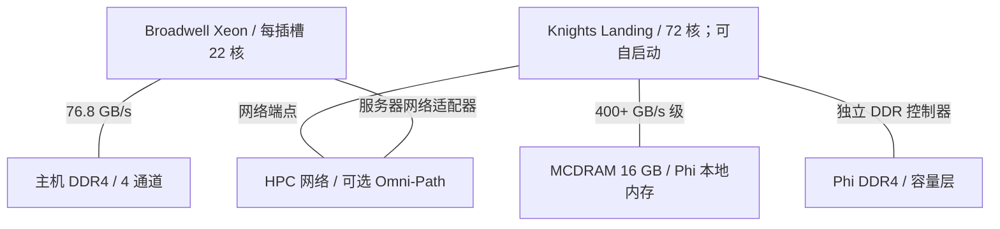
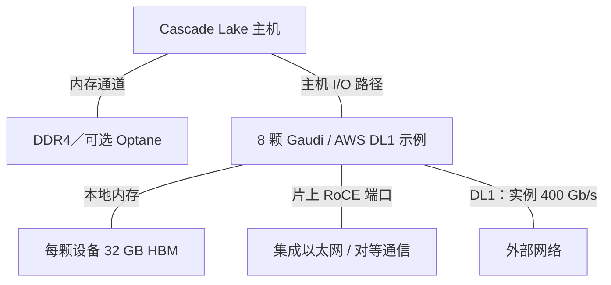
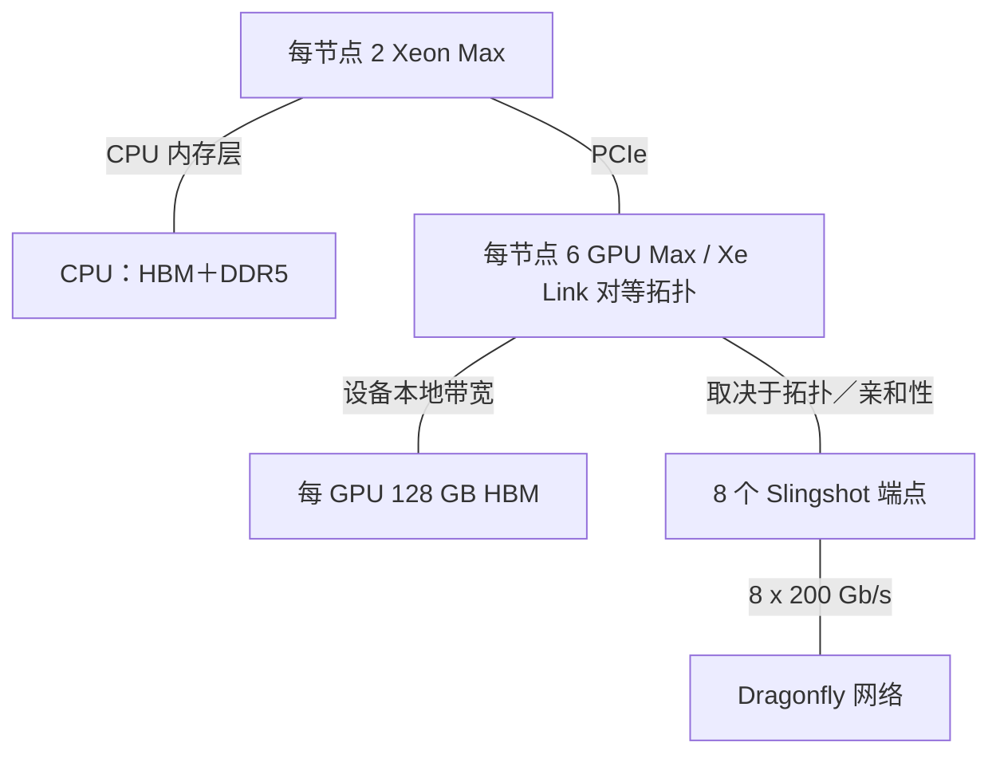
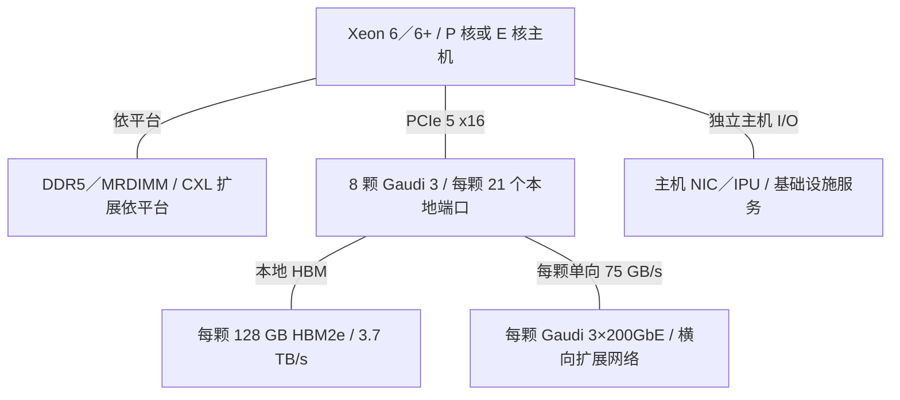

# Intel AI 基础设施架构演进

2015-2026 | 2026-09-28

## 01 执行摘要与范围

Intel 的 AI 基础设施史由多条相互作用的架构路线组成，并非单一加速器的连续换代。Xeon 承担通用执行与编排；Gaudi 围绕矩阵引擎和集成以太网构建训练系统；Ponte Vecchio 面向异构封装与高性能科学计算；IPU 将基础设施工作从租户 CPU 卸载；最新的推理 GPU 路线则强调模型容量以及在风冷服务器中的部署。核心架构问题是：这些独立发展的组件如何组成有效的系统。

报告覆盖 2015 年至 2026 年 9 月 28 日，并以 Haswell 作简短基线。内容按产品代际组织，CPU 和加速器是重点；网络、IPU、封装、光互联、FPGA、内存、软件与系统补全产品版图。客户端和边缘产品用于解释共享技术或不同部署模式。本报告是经过筛选的技术史，并非全部 SKU 或 Intel 相关会议论文的穷尽目录。

CPU 最重要的变化包括：环形互联转向网格，私有缓存与末级缓存重新分工，AMX 和集成卸载引擎加入，以及服务器产品分为性能核和能效核路线。芯粒也从扩展裸片面积的手段，演变为让核心、缓存和 I/O 使用不同工艺的组织方式。Clearwater Forest 将这种分工推进到垂直堆叠；Diamond Rapids 则把它扩展至新公布的性能核平台。加速器路线的连续性较弱，必须分别评价技术成果和商业路线能否延续。

### 截止日期的产品版图

| 层次 | 产品线 | 架构角色 | 状态边界 |
| --- | --- | --- | --- |
| 主机计算 | Xeon Scalable / Xeon 6 / 6+ | 通用计算、AMX、编排 | Diamond Rapids 已披露；GA 未确定 |
| 加速器 | Gaudi / GPU Max / Flex / Crescent Island | 训练、HPC、媒体与推理 | Crescent Island 已公布；Falcon Shores 仅内部使用 |
| 网络／基础设施 | E810 / E830 / E835; IPU E2000/E2100 | RDMA、报文处理、存储隔离 | NIC 与 IPU 属于不同设备类别 |
| 邻接技术 | EMIB / Foveros / OCI / Altera / Optane | 集成、光链路、可编程逻辑、内存 | OCI 为演示；保留 Altera 49% 股权；Optane 已退出 |

## 02 数值口径

带宽统一采用十进制 GB/s 或 TB/s。DRAM 峰值等于通道数乘传输率再乘八个数据字节；ECC 位不增加有效载荷带宽。PCIe 数值按单方向计算，尚未扣除协议开销。以太网 Gb/s 先除以八，再与内存带宽比较。只有来源明确使用双向聚合口径时，才将数值除以二。HBM、封装内部互联、纵向扩展和横向扩展分别统计。

CPU 表采用有代表性的高端商用配置，不将不同 SKU 的最大值拼成虚构产品。加速器算力使用稠密峰值，乘加计为两次运算。矩阵 BF16 不等于向量 BF16，模拟格式也不等于原生格式。历史已商用不代表目前仍可订购。公布、送样与正式商用分别标识。n/d 表示已审阅证据未确定该数值，n/a 表示不适用。来源集中列于文末映射和参考资料，保持正文流畅。

## 03 Xeon 代际总览

表格比较参考 SKU：8592+ 为 350 W，其他 Emerald Rapids 型号的功耗限制不同。Cooper Lake 和 Ice Lake 都属于第三代 Xeon Scalable，但面向不同插槽市场并采用不同核心。不能用早期路线图中的 288 核目标替换 Sierra Forest 已商用的 144 核参考配置。Diamond Rapids 行记录 2026 年 8 月披露，并非最终 SKU 规格；内存带宽由通道和速率计算，已审阅公告尚未给出最终 DIMM 验证矩阵。

### CPU 参考配置

| 代际／参考 SKU | 代号 | 正式商用 | 状态 | 核心微架构 | 核心／线程 | 各裸片工艺 | 裸片／封装 | 每核 L2 | L3／共享域 | 内存：通道；速率；GB/s | 插槽／互联 | PCIe／CXL | TDP | 向量／矩阵 ISA |
| --- | --- | --- | --- | --- | --- | --- | --- | --- | --- | --- | --- | --- | --- | --- |
| E5 v4 / 2699 v4 | Broadwell-EP | 2016 | 历史已商用 | Broadwell | 22 / 44 | 14 nm | 单裸片；环形 | 256 KB | 55 MB 包含式 | DDR4; 4; 2400; 76.8 | 2S; QPI 9.6 GT/s | 40 PCIe 3; CXL n/a | 145 W | AVX2 |
| 1st / 8180 | Skylake-SP | 2017 | 历史已商用 | Skylake | 28 / 56 | 14 nm | 单裸片；网格 | 1 MB | 38.5 MB 非包含式 | DDR4; 6; 2666; ~128 | 2/4/8S; 3 UPI 10.4 GT/s | 48 PCIe 3; CXL n/a | 205 W | AVX-512 |
| 2nd / 8280 | Cascade Lake | 2019 | 历史已商用 | Skylake 衍生 | 28 / 56 | 14 nm | 单裸片；网格 | 1 MB | 38.5 MB | DDR4; 6; 2933; ~140.8 | 2/4/8S; 3 UPI 10.4 GT/s | 48 PCIe 3; CXL n/a | 205 W | AVX-512; VNNI |
| 3rd / 8380HL | Cooper Lake | 2020 | 历史已商用 | Skylake 衍生 | 28 / 56 | 14 nm | 单裸片；多路扩展 | 1 MB | 38.5 MB | DDR4; 6; 3200; 153.6 | 4/8S; 6 UPI 10.4 GT/s | 48 PCIe 3; CXL n/a | 250 W | AVX-512; BF16; VNNI |
| 3rd / 8380 | Ice Lake-SP | 2021 | 历史已商用 | Sunny Cove | 40 / 80 | 10 nm | 单裸片；网格 | 1.25 MB | 60 MB | DDR4; 8; 3200; 204.8 | 2S; 3 UPI 11.2 GT/s | 64 PCIe 4; CXL n/a | 270 W | AVX-512; VNNI |
| 4th / 8490H | Sapphire Rapids | 2023 | 历史已商用 | Golden Cove | 60 / 120 | Intel 7 | 4 个计算芯粒；EMIB | 2 MB | 112.5 MB | DDR5; 8; 4800; 307.2 | 最高 8S; 4 UPI 16 GT/s | 80 PCIe 5; CXL 1.1 | 350 W | AVX-512; AMX INT8/BF16 |
| Xeon Max / 9480 | Sapphire Rapids HBM | 2023 | 历史已商用 | Golden Cove | 56 / 112 | Intel 7 | 4 芯粒＋4 HBM 堆栈；EMIB | 2 MB | 112.5 MB | DDR5; 8; 4800; 307.2 + HBM2e 64 GB ~1000 | 2S; UPI 16 GT/s | 80 PCIe 5; CXL 1.1 | 350 W | AVX-512; AMX INT8/BF16 |
| 5th / 8592+ | Emerald Rapids | 2023-12 | 历史已商用 | Raptor Cove | 64 / 128 | Intel 7 | 高端为 2 芯粒；EMIB | 2 MB | 320 MB | DDR5; 8; 5600; 358.4 | 2S; 4 UPI 20 GT/s | 80 PCIe 5; CXL 1.1 | 350 W | AVX-512; AMX INT8/BF16 |
| 6 E / 6780E | Sierra Forest | 2024-06 | 已商用 | Crestmont | 144 / 144 | Intel 3 + Intel 7 I/O | 计算芯粒＋2 I/O；EMIB | 4 MB／4 核簇 | 108 MB | DDR5; 8; 6400; 409.6 | 2S; UPI 24 GT/s | 88 PCIe 5；CXL 2.0；共享通道预算 | 330 W | AVX2; VNNI; 无 AMX |
| 6 P / 6980P | Granite Rapids | 2024-09 | 已商用 | Redwood Cove | 128 / 256 | Intel 3 + Intel 7 I/O | 3 计算＋2 I/O；EMIB | 2 MB | 504 MB | DDR5; 12; 6400; 614.4 / MRDIMM 8800; 844.8 | 2S; UPI 24 GT/s | 96 PCIe 5; CXL 2.0 | 500 W | AVX-512; AMX INT8/BF16/FP16 |
| 6+ / 6990E+ | Clearwater Forest | 2026-06 | 已商用 | Darkmont | 288 / 288 | Intel 18A 计算; Intel 3 基底; Intel 7 I/O | 12 计算＋3 基底＋2 I/O；3D＋EMIB | n/d | 576 MB | DDR5; 12; 8000; 768 | 2S; 链路细节 n/d | 96 PCIe 5; CXL 分配 n/d | 450 W | AVX2; 无 AMX |
| 下一代 Xeon | Diamond Rapids | n/d | 已披露；GA n/d | 新性能核 | 256 / n/d | Intel 18A-P | Foveros Direct 3D；UCIe-S | n/d | 1.28 GB | 16; 12800 MT/s; 1638.4 推导值 | n/d | 128 PCIe 6; CXL 3.0 | n/d | APX; 增强 AMX |

## 04 Haswell 与 Broadwell：单裸片基线

Haswell-EP 以 AVX2、DDR4 和环形片上互联构成 2015 年的起点。2016 年 Broadwell-EP 转向 14 nm，将高端 E5 核心数提高到 22，同时保留每核 256 KB L2 与较大的包含式末级缓存。关键约束是核心、四个内存通道和环形互联之间的配比。增加核心会提高总执行需求，却不会同比增加片外带宽。即使在专用 AI 硬件出现之前，流式和稀疏工作负载也可能先耗尽内存带宽，而不是算术能力。

E5-2600 与 E7 应分别讨论：E7 强调更大的多路一致性域与可靠性，E5 则定义主流单路和双路服务器。Xeon D 将相关 x86 技术带入面向网络与边缘的低功耗集成 SoC。桌面 Core 共享核心谱系，但不共享服务器的内存通道数、缓存组织或插槽互联。后续各代也必须保持这一区分：核心架构只是服务器产品的一部分。

## 05 Skylake、Cascade Lake 与 Cooper Lake

2017 年 Skylake-SP 的变化是架构性的，而不仅是增加核心。二维网格取代环形互联；私有 L2 从 256 KB 增加到 1 MB；每核对应的末级缓存则缩小并转为非包含式。因此，仅比较或相加 L3 容量会误读整个层次。更大的私有缓存将活跃数据留在执行单元附近，末级缓存更多承担共享容量和被逐出数据的存储。网格路由、目录行为与子 NUMA 聚类，使单插槽内部的数据放置也变得重要。

网格同时配合六通道 DDR4、UPI 与 AVX-512。AVX-512 相比 AVX2 将向量宽度翻倍，但执行资源与运行频率取决于 SKU 和指令组合，不能由宽度直接推导持续应用收益。Cascade Lake 延续总体组织，并通过 VNNI 减少低精度点积所需指令。它对 Optane 持久内存的支持改变容量和持久性语义，而不只是改变速度。Cascade Lake AP 的 9200 系列在一个封装中放置两个裸片，56 核属于另一种产品构造。

Cooper Lake 为多路扩展系统增加 AVX-512 BF16 和更强的插槽互联。虽然同属第三代 Xeon Scalable，它并不是 Ice Lake 的同一种芯片。BF16 保留类似 FP32 的指数范围，同时缩短有效数，在合适累加方式下适合神经网络运算。这仍是向量执行，还未采用 AMX 的分块矩阵数据通路。Hot Chips 的 Cascade Lake 演讲解释功能转折，产品和优化文档则限定实际部署与编程条件。

## 06 Ice Lake：核心与服务器同时扩展

2021 年 Ice Lake-SP 采用 Sunny Cove，最高 40 核、八通道 DDR4 和 PCIe 4。相对 Skylake 家族，核心扩展乱序执行资源和内存子系统，服务器实现提供每核 1.25 MB L2。客户端 Sunny Cove 框图可以提供背景，却不能替代服务器缓存与非核心部分文档。八通道内存将理论 DDR 带宽提高至 204.8 GB/s，这是与工艺和核心改进同样重要的系统变化。

服务器获得更实用的存储与加速器 I/O 预算，SGX 和内存保护功能服务于云隔离需求。但它仍是单裸片 CPU，与外部加速器保持传统连接关系。PCIe 4 x16 在扣除高层协议开销前，单方向约为 31.5 GB/s，远低于同期 HBM 加速器的本地带宽。因此计入传输与同步后，将小型内核卸载到加速器，可能反而不如留在 CPU 上执行。Xeon D 衍生产品将相关技术用于边缘连接和长生命周期平台，并不复制完整服务器插槽。

## 07 Sapphire Rapids 与 Xeon Max：芯粒和专用引擎

2023 年 1 月商用的 Sapphire Rapids 将 Golden Cove 核心与 DDR5、PCIe 5、CXL 1.1 相结合，高端配置通过 EMIB 连接四个芯粒。各芯粒共同构成封装级一致性系统，并非四颗独立处理器。ISSCC 2022 披露准单片式集成方案，20 个接口合计提供 10 TB/s 裸片间带宽，能耗为 0.5 pJ/bit。这些是实现层面的聚合数值，不能作为插槽 DRAM 带宽或软件可见的远端内存保证。其商业工艺名称为 Intel 7，部分会议摘要的命名不同。

AMX 对 CPU AI 执行方式的改变，比再次增加向量宽度更根本。软件配置 tile 寄存器，对 INT8 或 BF16 数据块执行矩阵操作。库需要选择适用内核、打包操作数并管理 tile 状态。矩阵峰值增长快于 DRAM 带宽，因此缓存复用和批处理更加重要。工作负载能够将数据保留在缓存，或摊薄权重读取成本时，AMX 尤其有效；它不会让所有推理任务都变成计算受限。控制密集型算子和较小部署规模仍适合 CPU。

DSA、IAA、QAT 与 DLB 分别处理不同开销：数据搬移、分析／压缩、密码／压缩以及事件分发。它们通过减少核心工作和缓存污染创造价值，但队列提交、完成通知、数据局部性以及有效传输规模仍然重要。ASPLOS 2024 的 DSA 研究在真实硬件上测量了这些权衡。封装内存在某个模块，不代表应用自动使用它；还需要核对软件启用和 SKU 授权／配置。

Xeon Max 在 CPU 芯粒周围加入 64 GB HBM2e，提供仅 HBM、平坦寻址和缓存等使用模式。CPU 代码因此获得约 1 TB/s 的本地高带宽内存，而无需改写为 GPU 执行模型。平坦模式下，分配策略决定哪些对象使用 HBM；缓存模式下，局部性与工作集行为决定收益。不能将 HBM 和 DDR 峰值直接相加，视为单一数据流的持续带宽。容量受限应用仍可能需要 DDR，而带宽密集型科学内核可以显著受益于近端内存层。

## 08 Emerald Rapids：缓存与集成效率

Emerald Rapids 于 2023 年 12 月在既有平台上推出，最高 64 核、320 MB 末级缓存。高端实现使用两个较大芯粒，而不是 Sapphire Rapids 的四芯粒组织。减少芯粒边界会改变互联流量、物理集成与缓存组织，同时避免全面更换平台。ISSCC 2024 是重要实现依据，重点披露 Intel 7 多芯片构造和大幅扩大的共享缓存。其中的等功耗工作负载收益属于特定测量，不能当作通用 IPC 倍数。

64 核参考产品平均每核对应 5 MB LLC，而 60 核 Sapphire Rapids 参考产品为 1.875 MB。容量增加可以减少数据库、图结构和重复使用的模型数据所产生的昂贵 DRAM 访问。DDR5-5600 同时提高通道峰值，但实际架构收益取决于工作负载原先受限于缓存容量、带宽还是计算。这一代说明：即使工艺节点和主要矩阵 ISA 不变，封装与缓存重构仍可能非常重要。

## 09 Xeon 6：性能与密度分线

Hot Chips 2023 在两款产品于 2024 年商用前，披露了 Granite Rapids 和 Sierra Forest 的共享平台策略。计算芯粒与 I/O 芯粒分离，使 Intel 3 核心可以搭配 Intel 7 I/O。服务器家族在共同基础设施上提供不同计算选择，并不是在同一插槽混合 P 核与 E 核的桌面混合 CPU。DDR5、CXL 2.0 和内置加速器属于平台层面；向量能力、缓存组织与线程行为则因核心家族而异。

Granite Rapids 高端 6900P 配置达到 128 个 Redwood Cove 核心、三个计算芯粒和十二个内存通道，6980P 参考产品为 500 W。MRDIMM 将支持的数据速率提高到 8800 MT/s，对应 844.8 GB/s 理论通道带宽。AMX 增加 FP16 支持。工程重点是吞吐配比：更大的核心复合体需要更多内存带宽和封装连接，而不仅是更快的核心。2025 年扩展的 6700P 使用不同平台和通道配置，不能与 6900P 混用规格。

Sierra Forest 已商用参考配置采用 144 个 Crestmont 能效核，没有 SMT 或 AMX，四核簇共享 L2。其目标是提高相互独立、面向吞吐的服务密度，而不是等同于 144 个大型向量核心。包含大量小请求的云服务可以利用这一配置；重度依赖向量和 AMX 的工作负载不能假设它具有 Granite Rapids 的执行路径。满核配置下，理论 DRAM 通道带宽平均每核约 2.84 GB/s。因此核心数必须结合并发度、缓存行为和内存需求理解。

## 10 Clearwater Forest 与 Diamond Rapids

Clearwater Forest 在 Hot Chips 2025 和 MWC 2026 进行展示，随后于 2026 年 6 月以 Xeon 6+ 商用。288 个 Darkmont 能效核位于十二个 Intel 18A 计算芯粒中，下方为三个 Intel 3 基底裸片，并配合 Intel 7 I/O。Foveros Direct 3D 与 EMIB 结合垂直和水平集成，使高密度计算与缓存／互联、I/O 实现分离。架构机会在于工艺分工和更短、更密集的垂直连接；对应工程负担包括组装良率、热耦合、供电与互联放置。

6990E+ 参考配置具有 576 MB LLC 和十二通道 DDR5-8000。相对 Sierra Forest 参考配置，核心数翻倍，DRAM 峰值从 409.6 增至 768 GB/s。因此平均每核通道带宽从约 2.84 变为 2.67 GB/s，而平均每核 LLC 容量从 0.75 增至 2 MB。这是强调缓存和密度的设计，并不意味着每个核心获得更多外部带宽。288 个核心对应 288 个硬件线程，不能套用 P 核 SMT 行为再乘以二。

Intel 在 Hot Chips 2026 披露 Diamond Rapids：最高 256 个新核心、1.28 GB LLC、十六个 12800 MT/s 内存通道、128 条 PCIe 6 通道以及 CXL 3.0。Intel 18A-P、Foveros Direct 3D、UCIe-S、统一内存互联、APX 和增强 AMX 构成已公布方向。性能核 Xeon 因此走向更大的分布式封装。公开公告确认这些主要参数，但未确定最终 SKU 功耗、详细队列规模、线程数或商用时间。Coral Rapids 仍属于后续路线图名称，不能填写为已商用规格。

## 11 加速器代际总览

### 加速器参考配置

| 产品 | 架构 | 商用／里程碑 | 状态 | 工艺 | 裸片／封装 | 计算单元 | 稠密 BF16 | 稠密 FP8 | 稠密 FP6／FP4 | FP64 向量／矩阵 | 内存：类型；堆栈；GB；TB/s | 末级缓存／SRAM | 纵向扩展：链路；单向 GB/s；域 | 主机连接 | 功耗／散热 | 形态 |
| --- | --- | --- | --- | --- | --- | --- | --- | --- | --- | --- | --- | --- | --- | --- | --- | --- |
| Xeon Phi 7290 | Knights Landing | 2016 | 历史已商用 | 14 nm | CPU＋封装内 MCDRAM | 72 核心 / 288 线程 | n/a | n/a | n/a | ~3.46 TF / n/a | MCDRAM；8；16；STREAM 实测 >0.4；另有 DDR4 | 36 MB 分布式 L2 | n/a；可选 Omni-Path 网络 | 自启动；PCIe 3 | 245 W | 插槽处理器 |
| Gaudi / HL-205 | Gaudi | 2021 AWS DL1 | 历史已商用 | 16 nm | 1 计算裸片＋HBM | 8 TPC; MME | n/d | n/a | n/a | n/a | HBM2；n/d；32；约 1 | n/d | 10×100GbE；合计 125；8 芯片服务器 | PCIe 4 | n/d | OAM |
| Gaudi 2 | Gaudi 2 | 2022 | 历史已商用 | 7 nm | 1 计算裸片＋HBM | 24 TPC / 2 MME | 432 TF | 865 TF | n/a | n/a | HBM2e; 6; 96; 2.46 | 48 MB SRAM | 24×100GbE；合计 300；8 芯片服务器 | PCIe 4 x16 | 600 W | OAM |
| Gaudi 3 / HL-325L | Gaudi 3 | 2024 | 已商用 | 5 nm | 2 计算裸片＋HBM | 64 TPC / 8 MME | 1678 TF | 1678 TF | n/a | n/a | HBM2e; 8; 128; 3.7 | 96 MB SRAM | 24×200GbE；合计 600；8 芯片服务器 | PCIe 5 x16 | 最高 900 W；风冷／液冷变体 | OAM |
| GPU Max 1550 | Ponte Vecchio / Xe-HPC | 2023 | 历史已商用 | TSMC N5 计算; Intel 7 基底; TSMC N7 link | 47 芯粒集成；EMIB＋Foveros | 128 Xe 核心 / 1024 XMX | 839 TF | n/a | n/a | 原生 52 TF；拆分 n/d | HBM2e; 8; 128; 3.2 | 408 MB L2 | Xe Link；Lenovo 参考配置 318；4 GPU 域 | PCIe 5 x16 | 600 W；依平台 | OAM |
| GPU Flex 170 | Xe-HPG | 2022 | 历史已商用 | TSMC N6 | 单 GPU | 32 Xe 核心 | n/d | n/a | n/a | n/d | GDDR6；n/a；16；0.576 | n/d | n/a | PCIe 4 x16 | 150 W；被动风冷 | PCIe |
| Crescent Island | Xe3P | n/d | 已披露；GA n/d | n/d | n/d | 32 Xe 核心 / 256 XMX | n/d | n/d | n/d | n/d | LPDDR5X；n/a；最高 480；n/d | n/d | n/d | PCIe; 代际 n/d | 350 W；风冷 | PCIe |

Gaudi 3 使用本次获取的架构白皮书中 BF16／FP8 均为 1678 TFLOPS 的数值，不与其他时钟工作点的宣传值混合。600 W 的 HL-338 PCIe 卡属于另一配置，未经核实不能套用 OAM 峰值。GPU Max 的 Xe Link 双向 636 GB/s 来自特定 Lenovo 系统规格，归一化为单方向 318 GB/s，并不代表所有 Ponte Vecchio 系统都开放相同外部链路拓扑。Xeon Phi 作为历史多核加速器谱系列入，尽管 Knights Landing 能独立启动操作系统。

## 12 Xeon Phi 与 Nervana：早期并行计算路线

Knights Landing 在 Hot Chips 2015 披露，并于 2016 年商用。它结合大量小型 x86 核心、每核四个硬件线程、宽向量执行、网格互联和 16 GB 封装内 MCDRAM。它不只是 PCIe 协处理器，还能独立运行常规操作系统，并通过 DDR4 扩充容量。缓存、平坦和混合内存模式，较早暴露了后来 Xeon Max 再次面对的数据放置问题。软件吸引力是 x86 和熟悉的并行编程，但高吞吐仍依赖向量化、大量并发线程和谨慎的内存使用。

Knights Mill 通过专门向量指令将多核路线转向深度学习，但它并未成为后来 Xeon 的 AMX 架构。此后 Nervana 的 NNP-T 和 NNP-I 分别探索专用训练与推理数据通路。Intel 收购 Habana 并随后集中资源于 Gaudi，改变了商业方向。这些分支值得纳入历史，是因为它们反映了对可编程性、数值格式和互联假设的变化，而不是因为它们与当前 GPU 构成连续商用序列。已终止项目所规划的后继者不能列作已交付代际。

## 13 Gaudi 1、2 与 3：加速器内置以太网

Gaudi 的功能划分不同于源于图形处理的 GPU。矩阵乘法引擎负责稠密线性代数，可编程 Tensor Processor Core 处理周边运算，本地 HBM 提供容量和带宽，集成的支持 RoCE 的以太网端口承担设备通信。AWS DL1 于 2021 年 10 月正式商用，为第一代提供具体部署里程碑：八颗 Gaudi，每颗 32 GB HBM。实例的 400 Gb/s 网络吞吐属于云服务限制，不能与 Gaudi 所有片上端口之和混淆。

Gaudi 2 将设计扩展至 24 个 TPC、两个 MME、96 GB HBM2e 和 24×100 GbE 端口。矩阵路径对 BF16 与 FP8 提供不同峰值。较大的软件管理 SRAM 帮助复用数据并减少 HBM 流量，但它不自动等同于 CPU 的一致性末级缓存。架构依赖编译器对矩阵、向量、DMA 和通信资源进行调度。系统上的主要区别是：本地加速器组和外部网络都可以基于以太网机制构建。

Gaudi 3 转向双计算裸片，配备八个 MME、64 个 TPC、128 GB HBM2e 和 24×200 GbE。双裸片扩大计算和内存接口，但非本地数据需要跨越内部区域通信。在八加速器基板上，每颗芯片的 21 个端口分别以三条链路连接其余七颗芯片，留下三个端口用于横向扩展。因此单方向 600 GB/s 的全部端口预算，被划分为 525 GB/s 本地对等流量和 75 GB/s 外部流量，不能在两个方向和两种用途上重复计算总量。

集成网络消除了这些加速器链路对独立 NIC 的需求，却不会消除以太网交换网络、拥塞控制、布线或集合通信算法。HCCL、SynapseAI 和框架集成决定硬件能否重叠通信与计算，以及是否支持所需算子。Gaudi 3 的 PCIe 变体以不同功耗范围进入更常规的服务器。与 GPU 系统比较时，应比较完整且受支持的训练或推理配置，包括软件和网络拓扑，而不是只看一个峰值 FLOPS 列。

## 14 Ponte Vecchio：异构 HPC 封装

Ponte Vecchio 在 ISSCC 2022 的披露，是实现方式推动架构的典型案例。47 芯粒集成包含十六个 5 nm 计算芯粒及多种工艺，并通过 Foveros 和 EMIB 连接。这里并非 47 个计算裸片：计算芯粒、基底／缓存资源、互联芯粒和 HBM 分别承担不同角色。各功能可以采用适合的制造与集成方式，代价是复杂组装、测试、供电和热管理。会议原型的实测指标与后来 GPU Max SKU 的峰值属于不同证据点。

商用 Max 1550 结合 128 个 Xe-HPC 核心、XMX 矩阵执行、较强的原生 FP64、128 GB HBM2e 和大型分布式 L2。与仅面向推理的加速器不同，它在科学计算精度和 HPC 执行方面投入较多资源。Xe Link 连接对等 GPU，PCIe 连接主机。统一编程抽象不会让 CPU DDR 与 GPU HBM 在物理上统一或等速。Aurora 展示了围绕 CPU 和 GPU 高带宽内存构建的系统，但应用与运行时仍需管理通信和数据放置成本。

Ponte Vecchio 作为集成技术载体的成果，应与商业产品线的覆盖范围和持续时间分开评价。Lenovo SD650-I V3 产品指南明确标记停止营销，但它确实记录了实际存在的四 GPU 系统。Falcon Shores 后来被定位为内部测试芯片，而非上市后继产品。因此，不能画出从 Xeon Phi 经 GPU Max 直接走向已商用 Falcon Shores 的连续路线。产品延续性、软件支持和可部署系统供应本身就是架构约束。

## 15 Flex、Arc 与 Crescent Island：推理分支

Flex 140 和 Flex 170 采用 Xe-HPG 与 GDDR6，服务于媒体处理、云图形、虚拟化和视觉推理。Flex 140 在 75 W 板卡上放置两颗小 GPU，各有独立的 6 GB 内存，并非一颗具有一致性 12 GB 内存的 GPU。Flex 170 采用单颗 32 核 GPU、16 GB 内存和 150 W 板级功耗。与 Arc 共享技术解释了图形和媒体引擎，但服务器驱动、虚拟化、散热和受支持工作负载才定义数据中心产品。源于图形路线的矩阵引擎不意味着具有 GPU Max 的 FP64 或 HBM 特性。

Crescent Island 是另一条面向推理的路线。2025 年 10 月 OCP 公告描述 160 GB LPDDR5X，并计划于 2026 年下半年向客户送样。到 Computex 和 Hot Chips 2026，Intel 披露最高 480 GB、350 W 风冷 PCIe 卡、32 个 Xe3P 核心和 256 个 XMX 引擎。后续容量披露更新了早期主要指标，并不证明所有未来 SKU 都有 480 GB。送样计划不等于正式商用，也不能仅凭核心数推算未披露的内存带宽或低精度算力。

从架构上可以推断，Intel 正优先考虑模型常驻容量、长上下文，以及在既有风冷机房中的安装。大内存可以减少模型分片和反复主机传输，但容量本身不能决定 token 延迟。解码可能仍受带宽限制，预填充则需要矩阵吞吐，并发度又会改变两者。因此 LPDDR 与 HBM 对应不同设计点。有效测试应在指定延迟、模型、上下文长度、精度和功耗条件下测量每秒 token 数，而不是只比较内存容量是否超过某款 HBM GPU。

Core Ultra 将异构计算思路扩展至客户端与边缘，结合 CPU、集成 GPU 和 NPU。NPU 的低功耗推理角色不同于数据中心训练加速器，而源于 Arc 的图形与媒体技术则与 Flex 谱系关联。OpenVINO 在受支持的 CPU、GPU 和 NPU 上提供推理部署层。模型转换和共同 API 有助于可移植性，但设备插件、算子覆盖、内存限制和精度仍然不同。共享品牌或运行时不能作为将服务器 GPU 带宽和矩阵算力套用到客户端产品的依据。

## 16 以太网 NIC、IPU 与可编程网络

### 网络与基础设施设备

| 产品 | 商用／里程碑 | 状态 | 类别 | 端口×速率 | SerDes | 主机接口 | 可编程引擎 | 嵌入式 CPU | 板载内存 | 传输／RDMA | 拥塞控制 | 主要卸载 | 功耗 |
| --- | --- | --- | --- | --- | --- | --- | --- | --- | --- | --- | --- | --- | --- |
| E810 | 2019 | 历史已商用 | Ethernet NIC | 最高 100GbE；依板卡 | 25G NRZ | PCIe 4 | DDP 流水线配置 | n/a | n/d | iWARP / RoCEv2 | 依协议／驱动 | 虚拟化、RSS、定时 | n/d |
| E830-CQDA2 | 2025 | 已商用 | Ethernet NIC | 2 x 100GbE | 50G PAM4 | PCIe 5 x8 / PCIe 4 x16 | DDP／报文分类 | n/a | n/d | Ethernet; RDMA 依 SKU | n/d | 报文处理、定时、遥测 | n/d |
| E835 | 2026-06 | 已商用 | Ethernet NIC | 1×200／2×100GbE；多个变体 | n/d | n/d | 可配置端口／报文处理 | n/a | n/d | iWARP + RoCEv2 | n/d | RDMA、定时、安全 | n/d |
| IPU E2100-CCQDA2 | 2023-2024 文档 | 已商用 | ASIC IPU | 1 x 200 / 2 x 100GbE | 50G PAM4 / 25G NRZ | PCIe 4 x16 | P4 pipeline | 16 Arm Neoverse N1 | 48 GB LPDDR4x; 32 MB SLC | 以太网；可编程存储传输 | 流量整形；依实现 | NVMe、IPsec、密码、压缩、隔离 | n/d |
| Gaudi 3 integrated NIC | 2024 | 已商用 | 加速器内置网络 | 24 x 200GbE | 48 x 112G PAM4 | 加速器内部 | 通信引擎 | n/a | 使用加速器内存 | RoCE | 以太网网络配置 | 设备 RDMA 与集合通信 | 包含于加速器功耗 |

Intel 常规以太网控制器从 E810 的 100 GbE 代际，发展到可达 200 GbE 的 E830 和 E835 配置。这些产品支持通用服务器网络、虚拟化、定时和部分 RDMA 能力。能够承载 AI 流量，并不意味着它们就是专门的 AI 集合通信引擎。主机接口、端口分配和传输配置共同限制实际带宽。200 Gb/s 端口在扣除开销前单方向为 25 GB/s，两个连接器也不一定代表两个可独立使用的 200 Gb/s 端口。

IPU 属于另一架构层。Mount Evans／E2000 引入与 Google 联合开发的 ASIC 基础设施处理器；E2100 适配器文档列出 16 核 Arm Neoverse N1 复合体、P4 报文流水线、48 GB LPDDR4x，以及硬件存储和安全引擎。Arm 核心独立于租户主机运行基础设施软件。卸载路径可以终结虚拟存储和网络，同时保留独立的信任与管理域。E2000 表示家族／架构谱系，而 E2100 适配器简报明确称其采用 E2100 SoC，因此不能未经证实就把这些名称合并为完全相同的芯片。

Google Cloud Next 2022 将 IPU 架构与实际服务连接起来：C3 搭配第四代 Xeon 和 Google 定制的 Intel IPU，先进行私有预览，再于 2023 年 5 月正式商用。这比一般路线图幻灯片更能证明实际部署。基于 FPGA 的 IPU 与 SmartNIC 是另一实现分支，以可重构性换取不同功耗、成本和软件特征。Tofino 的 P4 可编程交换数据通路又属于不同类别，交换和有状态报文处理并不使其成为主机 IPU。Intel 终止 Tofino 产品线后，它主要属于历史基础设施和既有部署。

Architecture Day 2021 明确区分了这些实现分支。Oak Springs Canyon 将 Xeon D 与 Agilex FPGA 组合为 IPU 参考平台；Arrow Creek 则对应 N6000 基于 FPGA 的加速开发平台／SmartNIC；Mount Evans 采用 ASIC 路线。评估可编程性时，这一区别非常重要：FPGA 逻辑可以改变数据通路本身，ASIC 报文流水线则开放有边界的编程模型，通用核心处理异常与控制。这些产品名称本身都不能证明具备某种 AI 集合通信卸载能力。

## 17 互联、内存、光学与可编程逻辑

### 分离的带宽域

| 互联 | 年份／代际 | 通道速率 | 每链路通道 | 每链路单向 GB/s | 每设备链路 | 拓扑 | 域规模 | 一致性／语义 |
| --- | --- | --- | --- | --- | --- | --- | --- | --- |
| PCIe 3 | 2010s | 8 GT/s | 16 | 15.75 | 依平台 | 根／交换树 | n/a | I/O；无通用缓存一致性 |
| PCIe 4 | Ice Lake / Gaudi 2 | 16 GT/s | 16 | 31.51 | 依平台 | 根／交换树 | n/a | I/O DMA |
| PCIe 5 | Sapphire / Gaudi 3 | 32 GT/s | 16 | 63.02 | 依平台 | 根／交换树 | n/a | I/O；CXL 是另一协议 |
| CXL 1.1 → 2.0 → 3.0 | SPR → Xeon 6 → Diamond | 取决于 PCIe PHY 代际 | n/d | n/d | 共享物理通道预算 | 随版本支持直连／交换 | n/d | 缓存／内存语义依设备类型 |
| Gaudi 3 Ethernet | 2024 | 112G PAM4 SerDes | 2 每 200GbE | 25 | 24 | 3 链路×7 对端＋3 外联 | 8 本地 | RDMA；非 CPU 缓存一致性 |
| Xe Link / Max 1550 | 2023 | n/d | n/d | n/d | n/d | 系统布线的 GPU 图 | Lenovo 参考为 4 GPU | 对等 GPU 内存流量 |
| Optical 计算 interconnect | 2024 demo | 32 Gb/s optical channel | n/a | 合计发送 250，推导值 | n/a | 芯片间光连接 | n/d | 物理 I/O 演示，非一致性协议 |

UPI 维持 CPU 插槽间一致性；PCIe 主要承担 I/O 传输；CXL 则在相关物理链路上加入定义明确的缓存和内存协议。支持某版本，不证明服务器启用了所有设备类型、交换配置或池化模式。MICRO 2023 对 Sapphire Rapids 上真实 CXL 设备的测量，说明延迟、带宽不对称、数据放置与设备实现的重要性。更大的可寻址内存层只有在软件放入合适数据时才有价值。Optane 同理：持久性需要崩溃一致性机制，其读写行为也不同于 DRAM。

Intel 在 OFC 2024 的光计算互联演示，将光 I/O 芯粒与 CPU 共封装并传输实时数据。披露的双向聚合 4 Tb/s 相当于合计 500 GB/s，在对称口径下每方向为 250 GB/s。目标是在电气封装出线代价上升时，扩大连接距离并改善电光集成。这属于技术演示，不证明已商用 Xeon 已经开放光学一致性网络。光 I/O、以太网交换和内存一致性解决的是不同系统层问题。

Altera 的 Stratix 和 Agilex 家族将可重构数据通路、硬化接口和封装经验带入 Intel 的历史基础设施版图。当流式流水线、协议或低延迟操作适合专门化时，FPGA 加速具有吸引力，但它不能与通用训练 GPU 互换。EMIB 在 FPGA 集成中的作用，也有助于理解其后来在 Xeon 和 GPU 封装中的应用。所有权变化决定当前产品边界：2025 年 9 月 12 日完成出售 Altera 51% 股权，Intel 保留 49%。因此，2026 年不能再将 Altera 写成 Intel 全资产品部门。

Intel 于 2022 年退出 Optane；不能把规划中的后续持久内存模块算作已交付的 Sapphire Rapids 功能。Omni-Path 属于 Intel 早期 HPC 网络历史，后续 Cornelis 产品则属于该公司版图。Loihi 2 和 Hala Point 是采用事件驱动计算及不同编程模型的神经形态研究系统，并非可直接替换的数据中心 GPU。这些技术提供重要背景，但不能据此扩大当前受支持的 Intel AI 训练平台数量。

## 18 系统与软件：可实际使用的架构

### 代表性部署与文档化系统

| 平台 | 年份／里程碑 | CPU／加速器数量 | 纵向扩展域 | 每加速器横向带宽 | 机架功耗 | 散热 |
| --- | --- | --- | --- | --- | --- | --- |
| AWS DL1 | 2021 GA | 2 Xeon；8 Gaudi | 8 Gaudi | 实例 400Gb/s÷8＝平均 6.25 GB/s；共享 | n/d | n/d |
| Aurora | 2023 完成安装；随后提供用户服务 | 每节点 2 Xeon Max＋6 GPU Max | 6 GPU 节点；Xe Link 拓扑 | 8×200Gb/s NIC÷6＝平均 33.3 GB/s | n/d | 直接液冷 |
| Lenovo SD650-I V3 | 2023; 停止营销 2024 | 最高 2 Xeon＋4 GPU Max | 4 GPU | 依适配器 | n/d | 直接水冷 |
| Gaudi 3 HLB-325 | 2024 | 主机 CPU＋8 Gaudi 3 | 8 Gaudi | 3×200GbE＝单向 75 GB/s | n/d | 风冷／液冷变体 |
| Google C3 | 2023 GA | 第四代 Xeon＋定制 IPU | CPU 虚拟机 | n/a | n/d | n/d |

Aurora 每节点两颗 CPU Max 和六颗 GPU Max，说明系统配比的重要性。八个 Slingshot 端点提供横向连接，但将总速率除以六只是平均预算，并不代表六条独立相同的 NIC 路径。CPU NUMA 域、GPU 区域与网络端点之间的亲和性会影响实际通信。同样，八 Gaudi 基板的本地全连接图并不是完整数据中心网络。超售、集合通信调度和故障恢复决定节点之外的集群行为。

### 软件里程碑与硬件关系

| 软件栈／版本 | 日期／时期 | 支持硬件 | 主要功能／约束 |
| --- | --- | --- | --- |
| oneDNN／CPU 框架库 | 2017-2026 | Xeon AVX-512 / VNNI / AMX | ISA 分派、打包和内核选择；应用必须使用已启用路径 |
| oneAPI / SYCL / Level Zero | 2020s | Xe GPU / CPU | 共享编程模型；仍需数据放置和设备特定调优 |
| SynapseAI / Gaudi software 1.24 | 2026 文档 | Gaudi 2 / Gaudi 3 | PyTorch 集成、图编译、TPC 内核与 HCCL |
| IPU SDK | 2023-2024 文档 | E2100 IPU | P4 流水线、基础设施服务与主机集成 |
| DSA / IAA software interfaces | 2023 起 | Xeon 集成引擎 | 工作队列、共享虚拟寻址和异步完成；需考虑开销 |

这些软件路线相互关联，但不能互换。oneAPI／SYCL 和 Level Zero 开放 Intel GPU 执行；Gaudi 使用自己的编译器、运行时和通信栈；Xeon 库分派到向量或 AMX 内核；IPU 软件管理基础设施服务。相同框架前端不保证相同算子覆盖、数值行为或性能。评估应覆盖完整模型图、回退行为、量化、检查点可移植性与分布式通信。硬件路线发生变化时，这一点尤其重要：源代码在技术上可移植，仍可能依赖厂商专用的优化内核生态。

OpenVINO 是连接 Intel CPU、GPU 和 NPU 产品的推理部署层，与底层编译器／运行时及数学库协作，而非取代它们。企业推理部署中，受支持的模型变换、精度转换、批处理、设备选择和性能分析，可能比应用是否直接看到某条指令更重要。硬件支持矩阵必须与具体运行时版本核对；框架使用通用设备名称，不代表所有旧 Intel 加速器都仍受支持。

## 19 四个时期的系统视图

以下图示概括四个时期的架构关系。连线表示数据路径，并不必然意味着内存一致性。除非明确统计聚合值，否则不将单设备带宽乘以设备数。图中区分加速器本地内存、主机内存和外部网络，不把全部内存画成统一等速池。

### 2015-2016：主机 CPU 与可自启动多核处理器

此处 Xeon 与 Phi 表示不同节点构造；图中不表示 Knights Landing 必须作为 Broadwell 的协处理器连接。

### 2019-2021：CPU 与以太网互联 AI 设备

DL1 外部服务带宽不同于 Gaudi 片上全部网络端口带宽。Optane 属于 CPU 平台选项，并非 Gaudi HBM。

### 2023-2024：Aurora 异构内存层次

8×200 Gb/s 除以六得到平均每 GPU 33.3 GB/s 横向预算，但这不是均匀的专用链路分配。

### 2024-2026：分工明确的计算与基础设施路径

本图表示角色分工，并非唯一 OEM 配置。Crescent Island 是另行公布、采用 LPDDR5X 的 PCIe 推理分支；Diamond Rapids 是已披露的未来主机平台。

## 20 归一化配比与设计含义

### 由已列参考配置推导的配比

| 参考配置 | 每核 DRAM GB/s | 每核 L3 MB | 解释 |
| --- | --- | --- | --- |
| Broadwell 2699 v4 | 3.49 | 2.50 | 22 核共享四通道 |
| Skylake 8180 | 4.57 | 1.375 | L2 扩大；L3 包含策略改变 |
| Sapphire 8490H | 5.12 | 1.875 | AMX 提高计算供数需求 |
| Emerald 8592+ | 5.60 | 5.00 | LLC 容量大幅增加 |
| Sierra 6780E | 2.84 | 0.75 | 面向密度的参考配置 |
| Granite 6980P / MRDIMM | 6.60 | 3.9375 | 12 通道、8800 MT/s |
| Clearwater 6990E+ | 2.67 | 2.00 | 核心翻倍；每核缓存增多 |

### 加速器配比：稠密 BF16 口径

| 设备 | HBM 字节／FLOP | 全端口网络／HBM 带宽 | 每设备外部带宽 | BF16 峰值／设备功耗 |
| --- | --- | --- | --- | --- |
| Gaudi 2 | 0.00569 | 0.122 | 37.5 GB/s，分配 3×100GbE | 600 W 下 0.720 TF/W |
| Gaudi 3 | 0.00221 | 0.162 | 75 GB/s，分配 3×200GbE | 900 W 下 1.864 TF/W |
| GPU Max 1550 | 0.00381 | 0.0994 Xe Link／HBM，Lenovo 口径 | 依系统 | 600 W 下 1.398 TF/W |

按所选白皮书口径，Gaudi 3 相比 Gaudi 2 的矩阵峰值增长快于 HBM 带宽，每个峰值 BF16 运算对应的 HBM 字节预算下降超过一半。要接近计算峰值，需要更多复用、更有效的矩阵块或更大批处理。网络带宽也仍只是本地 HBM 带宽的一部分，通信密集型并行不能只按算力增长评价。这些配比描述资源平衡；若不知道算术强度和通信模式，就无法预测模型基准成绩。

峰值 FLOPS 除以板级或设备功耗，只是算术能力归一化，并非实测能效。它没有计入主机 CPU、DIMM、交换机、光学、散热和利用率，因此不能据此给出跨厂商每瓦性能排名。CPU 的每核内存带宽也只是均分预算，不是保证分配量。工程上更有用的问题是：哪一层首先饱和，以及增加硬件之前，软件能否改善局部性或重叠执行。

## 21 主要架构会议补充了什么

Hot Chips 与 ISSCC 回答互补问题。Hot Chips 通常公开框图、层次、接口和产品意图；ISSCC 则解释这些模块如何实现，包括多裸片信号、每比特能耗、封装构造、时钟和供电。本报告中最强的组合案例是 Sapphire Rapids 的准单片 EMIB 互联、Ponte Vecchio 的多工艺 3D 集成，以及 Emerald Rapids 的大缓存双芯粒设计。会议数值必须保留原型、测量条件和披露日期，再与商业 SKU 对照。

ISCA、MICRO、HPCA 和 ASPLOS 尤其适合检验产品机制在系统中的行为。ISCA 2025 的 LIA 协同使用支持 AMX 的 Xeon 与 GPU，说明 CPU 矩阵执行可以改变卸载决策。MICRO 2023 的真实设备 CXL 研究区分实际内存扩展和软件模拟。ASPLOS 2024 的 DSA 分析识别异步数据搬移何时能够抵消提交和完成开销。HPCA 2020 的持久内存主题演讲讨论容量、持久性和非对称访问带来的编程后果。这些属于研究或测量结果，不证明 Intel 将所有提议机制都采用到芯片中。

会议索引区分直接产品披露、实现披露、独立测量和部署证据。DAC 与 Foundry Direct Connect 对设计使能、封装和 EDA 背景有价值；MWC 强调电信和边缘；OCP 强调平台集成；Computex 和 Intel 自身发布活动用于确认产品定位与供应。Cloud Next 与 AWS 公告将芯片连接到云服务。本次未建立合格一手记录的 GTC、Microsoft Ignite 或 DAC 产品架构演讲，不在报告中虚构具体条目。这是本次覆盖的边界，并不意味着 Intel 从未参加这些活动。

### 会议到产品索引

| 会议／活动 | 年份 | 论文／演讲／披露 | 报告人／作者 | 产品 | 证据类型 | 来源 |
| --- | --- | --- | --- | --- | --- | --- |
| Hot Chips | 2015 | Knights Landing | Avinash Sodani | Xeon Phi | 产品架构 | C13 |
| Hot Chips | 2018 | Cascade Lake | Akhilesh Kumar | Xeon 2nd gen | 架构／VNNI／内存 | C06 |
| Hot Chips | 2019 | Nervana; packaging; Optane | Intel | NNP-T / NNP-I | 官方新闻稿 | C14 |
| HPCA | 2020 | Persistent Memory and the Path to Being Comfortably NUMB | Steven Swanson | Optane 相关背景 | 独立研究主题演讲 | R05 |
| ISSCC | 2022 | Ponte Vecchio: A Multi-Tile 3D Stacked Processor for Exascale Computing | W. Gomes et al. | Ponte Vecchio | 实现；论文 2.1 新闻资料 | C03 |
| ISSCC | 2022 | Sapphire Rapids: Next-Generation Xeon | Intel | Sapphire Rapids | 实现；论文 2.2 新闻资料 | C03 |
| Google Cloud Next | 2022 | C3 and custom Intel IPU | Google / Intel | Sapphire Rapids + IPU | 预览；2023 年商用 | E15 |
| Hot Chips | 2023 | Granite Rapids and Sierra Forest | Intel | Xeon 6 | 架构介绍幻灯片 | C12 |
| MICRO | 2023 | Demystifying CXL Memory with Genuine CXL-Ready Systems and Devices | Yan Sun et al. | Sapphire Rapids / CXL | 真实设备测量 | R04 |
| ISSCC | 2024 | Emerald Rapids: 5th-Generation Xeon Scalable | Ashley O. Munch et al. | Emerald Rapids | 实现；论文 2.3 新闻资料 | C04 |
| ASPLOS | 2024 | A Quantitative Analysis and Guidelines of Data Streaming Accelerator in Modern Intel Xeon Scalable Processors | Reese Kuper 等 | DSA / Sapphire Rapids | 卸载行为测量 | R02 |
| Hot Chips | 2024 | Gaudi 3; Xeon 6; optical I/O | Intel | Gaudi 3 / Xeon 6 / OCI | 架构与演示摘要 | E13 |
| OFC | 2024 | Integrated optical 计算 interconnect | Intel IPS | OCI chiplet | 实时技术演示 | E12 |
| Intel Vision | 2024 | Gaudi 3 architecture and open systems | Intel | Gaudi 3 | 产品公布 | E20 |
| ISCA | 2025 | LIA: cooperative AMX CPU-GPU computation and CXL offloading | Hyungyo Kim 等 | Sapphire / Granite Rapids | 独立系统研究 | R01 |
| Hot Chips / Tech Tour | 2025 | Clearwater Forest | Intel | Xeon 6+ | 架构／封装 | P08 |
| OCP Global Summit | 2025 | Crescent Island initial disclosure | Intel | Crescent Island | 路线图／送样目标 | E03 |
| MWC | 2026 | Xeon 6+ network and edge positioning | Intel | Clearwater Forest | 平台演示 | E16 |
| Computex | 2026 | Xeon 6+ and E835 launch | Intel | Clearwater / E835 / Crescent | 商用发布／更新 | E02 |
| Hot Chips | 2026 | Diamond Rapids and Crescent Island | Intel | Diamond / Crescent | 架构公布 | E01 |
| Foundry Direct Connect | 2024-2025 | Process and packaging enablement | Intel / EDA partners | 18A / EMIB / Foveros | 技术生态 | E19 |

## 22 架构结论与剩余缺口

Intel 持续积累的架构资产包括 CPU 软件基础、日益专门化的主机执行、异构封装和基础设施卸载。加速器历史则更为分散。Gaudi 提供具有特色的以太网系统，GPU Max 展示复杂的 HPC 集成，Crescent Island 追求容量导向的推理经济性。这些是互补设计点，而非同一 GPU 的可互换代际。正确比较单位是可部署的工作负载系统：计算格式、内存常驻、局部性、网络、功耗范围以及持续维护的软件路径。

剩余重要缺口集中在 Diamond Rapids 最终 SKU 与商用细节、Crescent Island 的内存带宽和算力、新 NIC 的具体商用配置矩阵，以及部分会议幻灯片或论文全文访问。相关产品因此采用官方公告层面的事实，未获支持的字段保留 n/d。早期封装路线图与后续发布记录进行对照，而不把计划时间当作实际出货日期。配套规范数据文件保留来源编号、事实范围、数值口径和产品状态，便于沿用报告结构更新这些缺口。

## 来源映射

01 执行摘要与范围 — C03, C12, E01, E02, E07, E11, E12, E17, P02, P03, P05, P06, P10, P14

02 数值口径 — P02, P05, P09, P16, P17

03 Xeon 代际总览 — C03, C04, C06, C12, E01, E02, E16, P01, P03, P05, P06, P08, P13, P16, P17, P18, P19, P20, P21, P22, P23, P24, P25, P26, P35

04 Haswell 与 Broadwell：单裸片基线 — P05, P07, P20

05 Skylake、Cascade Lake 与 Cooper Lake — C06, P05, P06, P22, P23

06 Ice Lake：核心与服务器同时扩展 — P05, P07, P24

07 Sapphire Rapids 与 Xeon Max：芯粒和专用引擎 — C03, P03, P05, P13, R01, R02

08 Emerald Rapids：缓存与集成效率 — C04, P03, P26

09 Xeon 6：性能与密度分线 — C12, E04, E06, P16, P17, P18

10 Clearwater Forest 与 Diamond Rapids — E01, E02, E08, E16, P01, P08, P17, P19, P35

11 加速器代际总览 — C03, C13, E01, E03, E05, E14, P02, P05, P09, P11, P27, P28, P29, P30, P37

12 Xeon Phi 与 Nervana：早期并行计算路线 — C13, C14, E17, P05, P28, P30

13 Gaudi 1、2 与 3：加速器内置以太网 — E09, E14, P02, P04, P09, P30

14 Ponte Vecchio：异构 HPC 封装 — C03, E17, P11, P27, P31

15 Flex、Arc 与 Crescent Island：推理分支 — E01, E02, E03, P11, P29, P38, R01

16 以太网 NIC、IPU 与可编程网络 — E02, E15, E18, E21, P02, P10, P14, P15, P32

17 互联、内存、光学与可编程逻辑 — C12, C14, E01, E07, E10, E11, E12, E13, E17, P02, P03, P05, P24, P27, P33, R04, R05

18 系统与软件：可实际使用的架构 — E14, E15, P02, P03, P05, P10, P11, P27, P30, P31, P34, P38, R02

19 四个时期的系统视图 — E01, P02, P05, P31

20 归一化配比与设计含义 — P01, P02, P03, P06, P16, P17, P18, P19, P20, P21, P25, P26, P27, P30

21 主要架构会议补充了什么 — C03, C04, C06, C12, C13, C14, E01, E02, E03, E12, E13, E14, E15, E16, E19, E20, P08, R01, R02, R04, R05

22 架构结论与剩余缺口 — E01, E02, E03, E07, P02, P03, P10, P14

## 参考资料

### 产品与技术文档

[P01] Xeon 6+ product family and SKUs. [https://www.intel.com/content/www/us/en/products/details/processors/xeon/6-plus-series.html](https://www.intel.com/content/www/us/en/products/details/processors/xeon/6-plus-series.html). 一手资料；访问截止 2026-09-28

[P02] Gaudi 3 architecture whitepaper. [https://cdrdv2-public.intel.com/817486/gaudi-3-ai-accelerator-white-paper.pdf](https://cdrdv2-public.intel.com/817486/gaudi-3-ai-accelerator-white-paper.pdf). 一手资料；访问截止 2026-09-28

[P03] 4th generation Xeon architectural overview. [https://www.intel.com/content/www/us/en/developer/articles/technical/fourth-generation-xeon-scalable-family-overview.html](https://www.intel.com/content/www/us/en/developer/articles/technical/fourth-generation-xeon-scalable-family-overview.html). 一手资料；访问截止 2026-09-28

[P04] Intel internal Gaudi deployment. [https://www.intel.com/content/dam/www/central-libraries/us/en/documents/2025-03/it-training-ml-on-gaudi-paper.pdf](https://www.intel.com/content/dam/www/central-libraries/us/en/documents/2025-03/it-training-ml-on-gaudi-paper.pdf). 一手资料；访问截止 2026-09-28

[P05] Intel optimization reference manual Volume 1. [https://cdrdv2-public.intel.com/814198/248966-Optimization-Reference-Manual-V1-049.pdf](https://cdrdv2-public.intel.com/814198/248966-Optimization-Reference-Manual-V1-049.pdf). 一手资料；访问截止 2026-09-28

[P06] Skylake-SP architecture overview. [https://www.intel.com/content/www/us/en/developer/articles/technical/xeon-processor-scalable-family-technical-overview.html](https://www.intel.com/content/www/us/en/developer/articles/technical/xeon-processor-scalable-family-technical-overview.html). 一手资料；访问截止 2026-09-28

[P07] Xeon D-2100 architecture. [https://www.intel.com/content/www/us/en/developer/articles/technical/intel-xeon-processor-d-2100-product-family-technical-overview.html](https://www.intel.com/content/www/us/en/developer/articles/technical/intel-xeon-processor-d-2100-product-family-technical-overview.html). 一手资料；访问截止 2026-09-28

[P08] Xeon 6+ product architecture deck. [https://cdrdv2-public.intel.com/866623/xeon-6-plus-product-deck.pdf](https://cdrdv2-public.intel.com/866623/xeon-6-plus-product-deck.pdf). 官方索引或相关发布资料；完整文档未能下载。

[P09] Gaudi 3 PCIe product brief. [https://cdrdv2-public.intel.com/817488/Gaudi%203%20PCIe%20Product%20Brief_RB_1_V6.pdf](https://cdrdv2-public.intel.com/817488/Gaudi%203%20PCIe%20Product%20Brief_RB_1_V6.pdf). 一手资料；访问截止 2026-09-28

[P10] IPU E2100-CCQDA2 product brief. [https://cdrdv2-public.intel.com/816692/Intel%20Infrastructure%20Processing%20Unit%20Adapter%20E2100-CCQDA2.pdf](https://cdrdv2-public.intel.com/816692/Intel%20Infrastructure%20Processing%20Unit%20Adapter%20E2100-CCQDA2.pdf). 一手资料；访问截止 2026-09-28

[P11] Xe GPU architecture optimization guide. [https://www.intel.com/content/www/us/en/docs/oneapi/optimization-guide-gpu/2024-1/xe-arch.html](https://www.intel.com/content/www/us/en/docs/oneapi/optimization-guide-gpu/2024-1/xe-arch.html). 一手资料；访问截止 2026-09-28

[P13] Xeon CPU Max product brief. [https://www.intel.co.uk/content/dam/www/central-libraries/us/en/documents/2023-01/xeon-cpu-max-series-product-brief.pdf](https://www.intel.co.uk/content/dam/www/central-libraries/us/en/documents/2023-01/xeon-cpu-max-series-product-brief.pdf). 一手资料；访问截止 2026-09-28

[P14] Ethernet 800 Series product guide. [https://cdrdv2-public.intel.com/709766/Intel%20Ethernet%20800%20Series%20Product%20Guide.pdf](https://cdrdv2-public.intel.com/709766/Intel%20Ethernet%20800%20Series%20Product%20Guide.pdf). 一手资料；访问截止 2026-09-28

[P15] E830 OCP adapter product brief. [https://cdrdv2-public.intel.com/855027/Intel%20Ethernet%20Network%20Adapter%20E830-CQDA2%20for%20OCP%203.pdf](https://cdrdv2-public.intel.com/855027/Intel%20Ethernet%20Network%20Adapter%20E830-CQDA2%20for%20OCP%203.pdf). 一手资料；访问截止 2026-09-28

[P16] Xeon 6980P specifications. [https://www.intel.com/content/www/us/en/products/sku/240777/intel-xeon-6980p-processor-504m-cache-2-00-ghz/specifications.html](https://www.intel.com/content/www/us/en/products/sku/240777/intel-xeon-6980p-processor-504m-cache-2-00-ghz/specifications.html). 一手资料；访问截止 2026-09-28

[P17] Xeon 6780E specifications. [https://www.intel.com/content/www/us/en/products/sku/240362/intel-xeon-6780e-processor-108m-cache-2-20-ghz/specifications.html](https://www.intel.com/content/www/us/en/products/sku/240362/intel-xeon-6780e-processor-108m-cache-2-20-ghz/specifications.html). 一手资料；访问截止 2026-09-28

[P18] Xeon 6 P-core SKU stack summary. [https://cdrdv2-public.intel.com/860027/IntelXeon6withPcores_SKUStackSummary.pdf](https://cdrdv2-public.intel.com/860027/IntelXeon6withPcores_SKUStackSummary.pdf). 官方索引或相关发布资料；完整文档未能下载。

[P19] Xeon 6+ product brief. [https://www.intel.com/content/www/us/en/content-details/918009/intel-xeon-6-product-brief-formerly-codenamed-clearwater-forest.html](https://www.intel.com/content/www/us/en/content-details/918009/intel-xeon-6-product-brief-formerly-codenamed-clearwater-forest.html). 一手资料；访问截止 2026-09-28

[P20] Xeon E5-2699 v4 specifications. [https://www.intel.com/content/www/us/en/products/sku/91317/intel-xeon-processor-e52699-v4-55m-cache-2-20-ghz/specifications.html](https://www.intel.com/content/www/us/en/products/sku/91317/intel-xeon-processor-e52699-v4-55m-cache-2-20-ghz/specifications.html). 一手资料；访问截止 2026-09-28

[P21] Xeon 8180 specifications. [https://www.intel.com/content/www/us/en/products/sku/120496/intel-xeon-platinum-8180-processor-38-5m-cache-2-50-ghz/specifications.html](https://www.intel.com/content/www/us/en/products/sku/120496/intel-xeon-platinum-8180-processor-38-5m-cache-2-50-ghz/specifications.html). 一手资料；访问截止 2026-09-28

[P22] Xeon 8280 specifications. [https://www.intel.com/content/www/us/en/products/sku/192478/intel-xeon-platinum-8280-processor-38-5m-cache-2-70-ghz/specifications.html](https://www.intel.com/content/www/us/en/products/sku/192478/intel-xeon-platinum-8280-processor-38-5m-cache-2-70-ghz/specifications.html). 一手资料；访问截止 2026-09-28

[P23] Xeon 8380HL specifications. [https://www.intel.com/content/www/us/en/products/sku/205684/intel-xeon-platinum-8380hl-processor-38-5m-cache-2-90-ghz/specifications.html](https://www.intel.com/content/www/us/en/products/sku/205684/intel-xeon-platinum-8380hl-processor-38-5m-cache-2-90-ghz/specifications.html). 一手资料；访问截止 2026-09-28

[P24] Xeon 8380 specifications. [https://www.intel.com/content/www/us/en/products/sku/212287/intel-xeon-platinum-8380-processor-60m-cache-2-30-ghz/specifications.html](https://www.intel.com/content/www/us/en/products/sku/212287/intel-xeon-platinum-8380-processor-60m-cache-2-30-ghz/specifications.html). 一手资料；访问截止 2026-09-28

[P25] Intel Xeon family SKU registry. [https://www.intel.com/content/www/us/en/ark/products/series/595/intel-xeon-processors.html](https://www.intel.com/content/www/us/en/ark/products/series/595/intel-xeon-processors.html). 一手资料；访问截止 2026-09-28

[P26] Xeon 8592+ specifications. [https://www.intel.com/content/www/us/en/products/sku/237261/intel-xeon-platinum-8592-processor-320m-cache-1-90-ghz/specifications.html](https://www.intel.com/content/www/us/en/products/sku/237261/intel-xeon-platinum-8592-processor-320m-cache-1-90-ghz/specifications.html). 一手资料；访问截止 2026-09-28

[P27] Lenovo SD650-I V3 GPU Max system specifications. [https://lenovopress.lenovo.com/lp1602-thinksystem-sd650-i-v3-server](https://lenovopress.lenovo.com/lp1602-thinksystem-sd650-i-v3-server). 一手资料；访问截止 2026-09-28

[P28] Xeon Phi Knights Landing product registry. [https://www.intel.de/content/www/de/de/ark/products/codename/48999/products-formerly-knights-landing.html](https://www.intel.de/content/www/de/de/ark/products/codename/48999/products-formerly-knights-landing.html). 一手资料；访问截止 2026-09-28

[P29] Data Center GPU Flex product brief. [https://cdrdv2-public.intel.com/768797/intel-data-center-gpu-flex-series-product-brief-final.pdf](https://cdrdv2-public.intel.com/768797/intel-data-center-gpu-flex-series-product-brief-final.pdf). 一手资料；访问截止 2026-09-28

[P30] Gaudi architecture documentation. [https://docs.habana.ai/en/latest/Gaudi_Overview/Gaudi_Architecture.html](https://docs.habana.ai/en/latest/Gaudi_Overview/Gaudi_Architecture.html). 一手资料；访问截止 2026-09-28

[P31] Aurora machine overview, Argonne. [https://docs.alcf.anl.gov/aurora/](https://docs.alcf.anl.gov/aurora/). 官方索引或相关发布资料；完整文档未能下载。

[P32] Intel IPU E2100 product and architecture documentation. [https://www.intel.com/content/www/us/en/products/details/network-io/ipu/adapter-e2100.html](https://www.intel.com/content/www/us/en/products/details/network-io/ipu/adapter-e2100.html). 一手资料；访问截止 2026-09-28

[P33] Cornelis TACC case study and Omni-Path acquisition history. [https://www.cornelis.com/pdf-archive/2023/10/TACC-Case-Study.pdf](https://www.cornelis.com/pdf-archive/2023/10/TACC-Case-Study.pdf). 一手资料；访问截止 2026-09-28

[P34] Gaudi software documentation 1.24. [https://docs.habana.ai/en/latest/](https://docs.habana.ai/en/latest/). 一手资料；访问截止 2026-09-28

[P35] Intel Clearwater Forest process and packaging whitepaper. [https://www.intel.com/content/dam/www/central-libraries/us/en/documents/2024-02/intel-tech-clearwater-wp.pdf](https://www.intel.com/content/dam/www/central-libraries/us/en/documents/2024-02/intel-tech-clearwater-wp.pdf). 一手资料；访问截止 2026-09-28

[P37] Gaudi 2 original architecture whitepaper. [https://habana.ai/wp-content/uploads/pdf/2021/gaudi2-whitepaper.pdf](https://habana.ai/wp-content/uploads/pdf/2021/gaudi2-whitepaper.pdf). 一手资料；访问截止 2026-09-28

[P38] OpenVINO CPU, GPU and NPU deployment product brief. [https://cdrdv2-public.intel.com/671060/OpenVINO-product-brief-2024.3-671060.pdf](https://cdrdv2-public.intel.com/671060/OpenVINO-product-brief-2024.3-671060.pdf). 官方索引或相关发布资料；完整文档未能下载。

### 会议记录与实现披露

[C03] ISSCC 2022 press kit: Ponte Vecchio and Sapphire Rapids. [https://www.isscc.org/s/ISSCC2022PressKit.pdf](https://www.isscc.org/s/ISSCC2022PressKit.pdf). 官方会议新闻资料；不是论文全文。

[C04] ISSCC 2024 press kit: Emerald Rapids. [https://static1.squarespace.com/static/6130ef779c7a2574bd4b8888/t/683f410397a851776dcd8fe3/1748975883344/ISSCC2024PressKit.pdf](https://static1.squarespace.com/static/6130ef779c7a2574bd4b8888/t/683f410397a851776dcd8fe3/1748975883344/ISSCC2024PressKit.pdf). 官方会议新闻资料；不是论文全文。

[C06] Cascade Lake Hot Chips 2018 slides. [https://old.hotchips.org/hc30/2conf/2.15_Intel_Cascade_Lake_HC30.Intel.Akhilesh.CLXCPU.Final.pdf](https://old.hotchips.org/hc30/2conf/2.15_Intel_Cascade_Lake_HC30.Intel.Akhilesh.CLXCPU.Final.pdf). 一手资料；访问截止 2026-09-28

[C12] Granite Rapids and Sierra Forest Hot Chips 2023. [https://download.intel.com/newsroom/2023/data-center-hpc/Hot_Chips_23_Granite_Rapids_Sierra_Forest_Xeon_Press_Briefing.pdf](https://download.intel.com/newsroom/2023/data-center-hpc/Hot_Chips_23_Granite_Rapids_Sierra_Forest_Xeon_Press_Briefing.pdf). 一手资料；访问截止 2026-09-28

[C13] Knights Landing, Avinash Sodani, Hot Chips 2015. [https://old.hotchips.org/wp-content/uploads/hc_archives/hc27/HC27.25-Tuesday-Epub/HC27.25.70-Processors-Epub/HC27.25.710-Knights-Landing-Sodani-Intel.pdf](https://old.hotchips.org/wp-content/uploads/hc_archives/hc27/HC27.25-Tuesday-Epub/HC27.25.70-Processors-Epub/HC27.25.710-Knights-Landing-Sodani-Intel.pdf). 一手资料；访问截止 2026-09-28

[C14] Intel press release: Nervana, packaging and Optane at Hot Chips 2019. [https://www.hpcwire.com/off-the-wire/intel-presents-on-nervana-packaging-and-optane-memory-at-hot-chips-2019/](https://www.hpcwire.com/off-the-wire/intel-presents-on-nervana-packaging-and-optane-memory-at-hot-chips-2019/). 官方索引或相关发布资料；完整文档未能下载。

### 研究论文与出版目录

[R01] LIA: cooperative AMX CPU-GPU inference, ISCA 2025. [https://experts.illinois.edu/en/publications/lia-a-single-gpu-llm-inference-acceleration-with-cooperative-amx-/](https://experts.illinois.edu/en/publications/lia-a-single-gpu-llm-inference-acceleration-with-cooperative-amx-/). 一手资料；访问截止 2026-09-28

[R02] Quantitative Analysis and Guidelines of DSA, ASPLOS 2024. [https://arxiv.org/pdf/2305.02480](https://arxiv.org/pdf/2305.02480). 一手资料；访问截止 2026-09-28

[R04] Demystifying CXL Memory, MICRO 2023. [https://hxji.github.io/assets/pdf/cxl-micro23.pdf](https://hxji.github.io/assets/pdf/cxl-micro23.pdf). 一手资料；访问截止 2026-09-28

[R05] HPCA 2020 persistent-memory keynote. [https://www.hpca-conf.org/2020/persistent-memory-and-the-path-to-being-comfortably-numb/](https://www.hpca-conf.org/2020/persistent-memory-and-the-path-to-being-comfortably-numb/). 一手资料；访问截止 2026-09-28

### 发布、生态与部署

[E01] Intel Hot Chips 2026 architecture disclosures. [https://www.intel.com/content/www/us/en/newsroom/news/client-computing/intel-outlines-architectures-for-agentic-ai-at-hot-chips-2026.html](https://www.intel.com/content/www/us/en/newsroom/news/client-computing/intel-outlines-architectures-for-agentic-ai-at-hot-chips-2026.html). 一手资料；访问截止 2026-09-28

[E02] Computex 2026 Xeon 6+, E835 and Crescent Island. [https://www.intel.com/content/www/us/en/newsroom/news/data-center/intel-puts-agentic-ai-xeon-6-networking-ai-systems.html](https://www.intel.com/content/www/us/en/newsroom/news/data-center/intel-puts-agentic-ai-xeon-6-networking-ai-systems.html). 一手资料；访问截止 2026-09-28

[E03] Crescent Island initial OCP announcement. [https://www.intel.com/content/www/us/en/newsroom/news/artificial-intelligence/intel-to-expand-ai-accelerator-portfolio-with-new-gpu.html](https://www.intel.com/content/www/us/en/newsroom/news/artificial-intelligence/intel-to-expand-ai-accelerator-portfolio-with-new-gpu.html). 一手资料；访问截止 2026-09-28

[E04] Xeon 6 press kit. [https://newsroom.intel.com/press-kit/press-kit-intel-xeon-6-processors](https://newsroom.intel.com/press-kit/press-kit-intel-xeon-6-processors). 一手资料；访问截止 2026-09-28

[E05] Xeon 6 P-core and Gaudi 3 launch. [https://www.intc.com/news-events/press-releases/detail/1713/intel-unveils-next-generation-ai-solutions-with-the-launch](https://www.intc.com/news-events/press-releases/detail/1713/intel-unveils-next-generation-ai-solutions-with-the-launch). 一手资料；访问截止 2026-09-28

[E06] Xeon 6 February 2025 expansion. [https://newsroom.intel.com/data-center/intel-unveils-leadership-ai-networking-solutions-xeon-6-processors](https://newsroom.intel.com/data-center/intel-unveils-leadership-ai-networking-solutions-xeon-6-processors). 一手资料；访问截止 2026-09-28

[E07] Intel 2025 annual report: product and ownership changes. [https://www.intc.com/filings-reports/annual-reports/content/0000050863-26-000011/0000050863-26-000011.pdf](https://www.intc.com/filings-reports/annual-reports/content/0000050863-26-000011/0000050863-26-000011.pdf). 一手资料；访问截止 2026-09-28

[E08] Intel Q4 2025 prepared earnings remarks. [https://download.intel.com/newsroom/2026/earnings/Intel-4Q2025-Earnings-Call.pdf](https://download.intel.com/newsroom/2026/earnings/Intel-4Q2025-Earnings-Call.pdf). 一手资料；访问截止 2026-09-28

[E09] Gaudi 3 availability expansion 2025. [https://www.intel.com/content/www/us/en/newsroom/news/artificial-intelligence/intel-gaudi-3-expands-availability-drive-ai-innovation-scale.html](https://www.intel.com/content/www/us/en/newsroom/news/artificial-intelligence/intel-gaudi-3-expands-availability-drive-ai-innovation-scale.html). 一手资料；访问截止 2026-09-28

[E10] Loihi 2 Hala Point research system. [https://www.intel.com/content/www/us/en/newsroom/news/intel-builds-worlds-largest-neuromorphic-system.html](https://www.intel.com/content/www/us/en/newsroom/news/intel-builds-worlds-largest-neuromorphic-system.html). 一手资料；访问截止 2026-09-28

[E11] Altera majority investment closes. [https://www.altera.com/newsroom/news/press-release/altera-silver-lake](https://www.altera.com/newsroom/news/press-release/altera-silver-lake). 一手资料；访问截止 2026-09-28

[E12] Intel optical compute interconnect demonstration. [https://www.intel.com/content/www/us/en/newsroom/news/intel-unveils-first-integrated-optical-io-chiplet.html](https://www.intel.com/content/www/us/en/newsroom/news/intel-unveils-first-integrated-optical-io-chiplet.html). 一手资料；访问截止 2026-09-28

[E13] Hot Chips 2024: Xeon 6, Gaudi 3 and optical I/O. [https://www.intel.com/content/www/us/en/newsroom/news/hot-chips-2024-ai-architectural-expertise.html](https://www.intel.com/content/www/us/en/newsroom/news/hot-chips-2024-ai-architectural-expertise.html). 一手资料；访问截止 2026-09-28

[E14] AWS DL1 general availability. [https://aws.amazon.com/about-aws/whats-new/2021/10/amazon-ec2-dl1-instances-cost-efficient-training-deep-learning-models/](https://aws.amazon.com/about-aws/whats-new/2021/10/amazon-ec2-dl1-instances-cost-efficient-training-deep-learning-models/). 一手资料；访问截止 2026-09-28

[E15] Google Next 2022 C3 and co-developed Intel IPU. [https://cloud.google.com/blog/products/compute/introducing-c3-machines-with-googles-custom-intel-ipu](https://cloud.google.com/blog/products/compute/introducing-c3-machines-with-googles-custom-intel-ipu). 一手资料；访问截止 2026-09-28

[E16] Intel at MWC 2026. [https://newsroom.intel.com/press-kit/press-kit-intel-at-mwc-barcelona-2026](https://newsroom.intel.com/press-kit/press-kit-intel-at-mwc-barcelona-2026). 一手资料；访问截止 2026-09-28

[E17] Intel 2024 annual report: Falcon Shores and Optane exits. [https://www.intc.com/filings-reports/all-sec-filings/content/0000050863-25-000009/intc-20241228.htm](https://www.intc.com/filings-reports/all-sec-filings/content/0000050863-25-000009/intc-20241228.htm). 一手资料；访问截止 2026-09-28

[E18] Intel support statement on Tofino discontinuation. [https://community.intel.com/t5/Ethernet-Products/Setup-Tofino-Switch/m-p/1539149](https://community.intel.com/t5/Ethernet-Products/Setup-Tofino-Switch/m-p/1539149). 官方索引或相关发布资料；完整文档未能下载。

[E19] Intel Foundry Direct Connect 2025 technology disclosures. [https://www.intel.com/content/www/us/en/newsroom/news/corporate/intel-foundry-gathers-customers-partners-outlines-priorities.html](https://www.intel.com/content/www/us/en/newsroom/news/corporate/intel-foundry-gathers-customers-partners-outlines-priorities.html). 一手资料；访问截止 2026-09-28

[E20] Intel Vision 2024 Gaudi 3 announcement. [https://newsroom.intel.com/artificial-intelligence/vision-2024-gaudi-3-ai-accelerator](https://newsroom.intel.com/artificial-intelligence/vision-2024-gaudi-3-ai-accelerator). 一手资料；访问截止 2026-09-28

[E21] Intel Architecture Day 2021 official press release. [https://download.intel.com/newsroom/archive/2025/en-us-2021-08-19-intel-architecture-day-2021.pdf](https://download.intel.com/newsroom/archive/2025/en-us-2021-08-19-intel-architecture-day-2021.pdf). 一手资料；访问截止 2026-09-28
