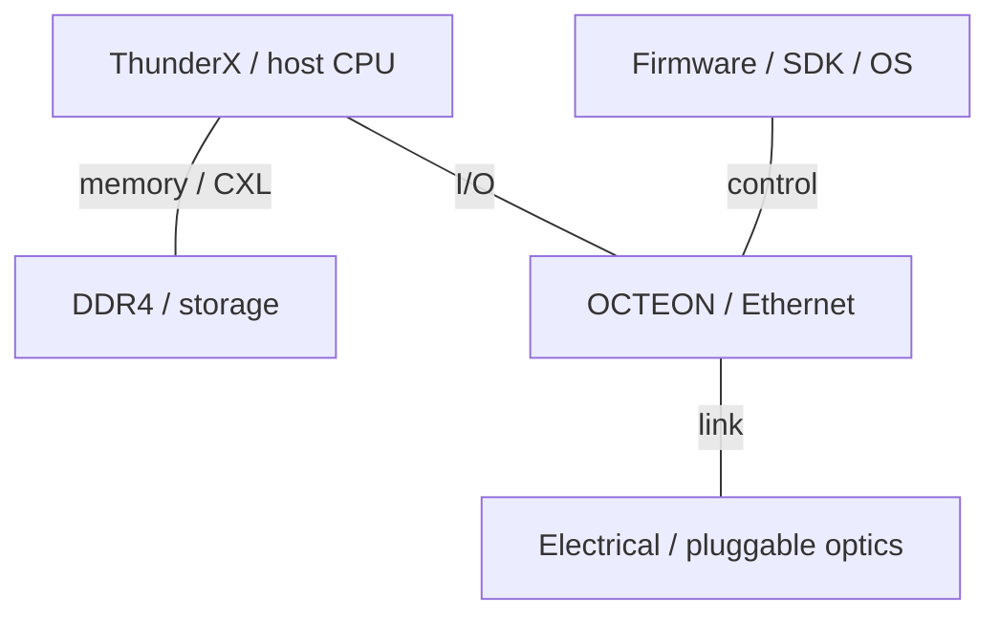
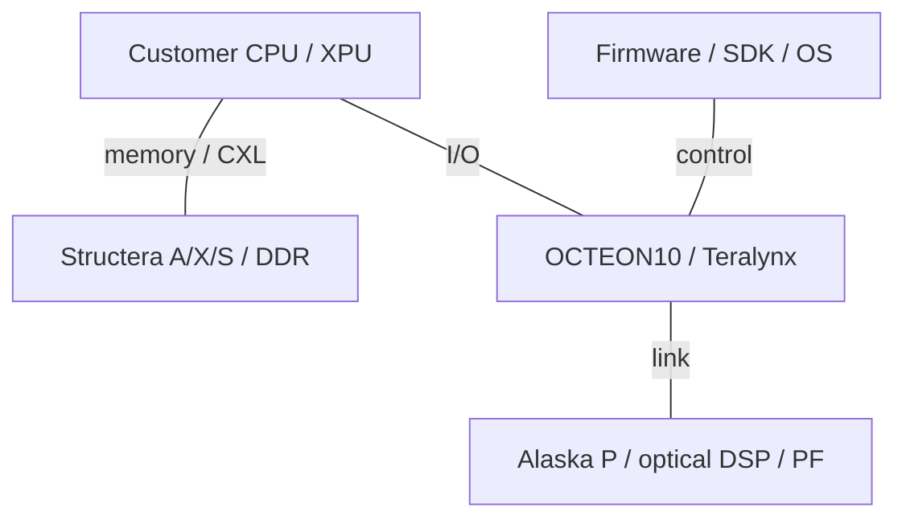

# Marvell AI Infrastructure Architecture Evolution

2015-2026 | 2026-09-28

## 01 Scope and executive synthesis

Deep coverage: OCTEON, Teralynx, optical connectivity and memory/scale-up interconnect. Historical ThunderX CPUs are covered through their move toward custom solutions. Custom XPUs are covered only where implementation capabilities or customer links are public. Period: 2015-28 September 2026. Celestial AI and XConn are included with their pre-acquisition lineage because both acquisitions closed in February 2026. Storage and security controllers are proportional; enterprise access switching and wireless RF are outside the deep scope.

Marvell is best understood as a supplier of the data-movement and implementation substrate surrounding compute. Its CPU history matters because processor and SoC capability reappears in DPUs, near-memory acceleration and custom silicon. Its optical and electrical portfolio spans distances from a package boundary to a datacenter interconnect. The architectural question is how these components change the cost of placing compute, memory and network endpoints apart, and which software layer can exploit that freedom.

## 02 Scope and numerical conventions

A DPU core count is not a server-CPU product, and a near-memory accelerator is not a general AI training GPU. Switch bandwidth, optical-module capacity, SerDes lane rate and CXL payload bandwidth describe different resources. Lane GT/s, coded Gb/s and useful GB/s are retained separately. Product announcements and sampling targets do not establish volume availability. n/d denotes an unestablished field and n/a a nonapplicable field. Demonstrations announced for a future event are not treated as completed deployments.

## 03 ThunderX: merchant CPUs to custom compute

ThunderX originated at Cavium, which joined Marvell in 2018. ThunderX2 established a dual-socket Arm server platform and reached production deployments including Microsoft’s internal Azure development servers. ThunderX3 was disclosed as a 96-core, four-thread-per-core design with eight DDR4-3200 channels and PCIe 4. The subsequent strategy statement shifted emphasis to hyperscaler-specific solutions. The 2020 ThunderX3 disclosure is therefore recorded as announced/repositioned, not proof of a continuing mass-market CPU roadmap.

Architectural interpretation: four-way SMT increases the number of runnable contexts without multiplying memory channels or execution units by four. Its benefit depends on latency hiding, instruction supply and interference. For a buy-side comparison, threads must not be compared directly with single-threaded Arm cores. The useful continuity is expertise in coherent fabrics, RAS and memory systems; it does not imply that current OCTEON cores are the same microarchitecture as ThunderX.

### Historical host CPU lineage

| Generation / reference SKU | Codename | GA | Status | Core µarch | Cores / threads | Process per die | Dies / packaging | L2 per core | L3 / domain | Memory: channels; rate; GB/s | Sockets / links | PCIe / CXL | TDP | Vector / matrix ISA |
| --- | --- | --- | --- | --- | --- | --- | --- | --- | --- | --- | --- | --- | --- | --- |
| ThunderX | n/d | 2015-era | Historical shipping | Custom Armv8 | n/d | n/d | n/d | n/d | n/d | DDR4; n/d | n/d | n/d | n/d | Armv8 |
| ThunderX2 | n/d | 2018-era | Historical shipping | Custom Armv8 | n/d | n/d | n/d | n/d | n/d | DDR4; n/d | 2; links n/d | n/d | n/d | Armv8 |
| ThunderX3 | n/d | n/d | Announced / repositioned | Custom Armv8 | 96 / 384 | TSMC 7P | n/d | n/d | n/d | 8 × DDR4-3200; 204.8 GB/s | 1-2; links n/d | PCIe 4; 64 lanes | n/d | 4 × 128-bit Neon |

## 04 OCTEON: infrastructure execution and acceleration

OCTEON’s historical MIPS and subsequent Arm families target packet processing, security and storage rather than generic host replacement. OCTEON TX and TX2 carry that infrastructure lineage into Arm-based SoCs. OCTEON10 moves to 5 nm and Neoverse N2, combining CPU execution with packet, crypto and machine-learning engines. The platform whitepaper describes a coherent cache and memory system around those engines, making it an integrated data-plane computer rather than a NIC with only fixed offloads.

The integrated ML engine serves inline or near-data inference, including infrastructure and networking workloads. Its presence does not make OCTEON a direct substitute for an HBM training accelerator. OCTEON10 Fusion adds radio-oriented acceleration and belongs to the 5G/vRAN branch; MWC disclosures help explain that branch but should not be allowed to dominate the AI datacenter narrative. SKU-specific CPU count, memory interface and port configuration must remain separate rather than assembled into an imaginary maximum device.

## 05 Teralynx: acquired switching architecture at AI scale

The Teralynx line came through Innovium and complements Marvell’s other switching families. Teralynx7 provides a 12.8 Tb/s baseline. Teralynx10 moves to 51.2 Tb/s and entered production in 2024. The 2026 T100 announcement describes 102.4 Tb/s on a monolithic 3 nm die and a sampling target. Low latency, telemetry and congestion management matter because a training job exposes synchronized bursts rather than only independent cloud flows.

Architectural interpretation: a monolithic switch avoids some internal die-to-die crossings, but still faces a perimeter, SerDes and power-delivery budget. A faster switch can reduce fabric tiers only if its port configuration matches endpoint speed and required uplinks. The relevant comparison against Tomahawk is therefore a topology at a fixed traffic matrix, including small-packet rate, buffer pressure, congestion response and optical power, not a single aggregate Tb/s label.

## 06 Optical DSPs, CPO and Photonic Fabric

Marvell’s optical DSP progression includes the 5 nm Nova 1.6T platform, the 3 nm Ara platform and later use-case-specific derivatives. The 2026 connectivity disclosures add 2 nm demonstrations and products such as Libra; the ECOC announcement is recorded as an announced demonstration at this cutoff. DSP specialization reflects the fact that reach, modulation, equalization and power budgets differ across intra-datacenter and longer-distance links. A transmit-only design changes the module partition rather than eliminating all signal-processing requirements.

Celestial AI’s Photonic Fabric, disclosed at Hot Chips 2025 before the acquisition, targets optical connectivity closer to compute and memory. Marvell completed the acquisition on 2 February 2026. The acquisition announcement anticipates revenue contribution in later fiscal periods, so the technology should not be described as broadly deployed merely because the transaction closed. The slides provide an architectural direction and module concepts; they do not establish every proposed memory configuration as a shipping product.

Architectural interpretation: optics addresses distance and bandwidth density; it does not make remote memory equivalent to local HBM. Serialization, protocol traversal, endpoint buffering and software placement remain. An optical memory fabric needs a precise contract for addressability, consistency, latency, failure isolation and allocation. The power saved in electrical reach must be balanced against lasers, thermal control, packaging yield and repair strategy.

## 07 Structera, Alaska P and the memory hierarchy

Structera X expands memory; Structera A adds near-memory compute. The A 2504 disclosure combines sixteen Neoverse V2 cores with four DDR5-6400 channels and a CXL2.0/PCIe5 ×16 host interface. This distinction is fundamental: attached DRAM bandwidth can exceed the host link, while local compute can operate on data without sending every byte back to the CPU. Compression may reduce traffic for compressible data but is not a fixed bandwidth multiplier for all workloads.

XConn closed on 10 February 2026 and adds PCIe/CXL switching. Subsequent Structera S announcements include a 260-lane PCIe6 switch and a CXL switch with Q3 2026 sampling targets. Alaska P retimers support the electrical reach between endpoints and these switches. A retimer, a switch, a memory expander and a near-memory processor occupy four different positions in the path; combining their headline bandwidths would be meaningless.

## 08 Fixed-schema product comparisons

### DPU and switch families

| Product | GA / milestone | Status | Class | Ports × speed | SerDes | Host interface | Programmable engine | Embedded CPU | On-card memory | Transport / RDMA | Congestion control | Key offloads | Power |
| --- | --- | --- | --- | --- | --- | --- | --- | --- | --- | --- | --- | --- | --- |
| OCTEON TX2 | 2020-era | Historical shipping | DPU | ≤200G datapath | n/d | n/d | Packet / crypto engines | 12-36 Armv8 | n/d | Ethernet | n/d | Security / storage | n/d |
| OCTEON10 | 2021 announced | Shipping / available | DPU | SKU-dependent | 56G class; SKU-dependent | PCIe 5 | Packet / crypto / ML | Neoverse N2 | DDR5; SKU-dependent | Ethernet | n/d | Infrastructure / inline ML | n/d |
| Teralynx7 | pre-2021 | Historical shipping | Switch | 12.8 Tb/s | n/d | n/a | Switch pipeline | n/d | n/d | Ethernet | Telemetry | L2/L3 | n/d |
| Teralynx10 | 2024 production | Shipping / available | Switch | 51.2 Tb/s | 100G class | n/a | Switch pipeline | n/d | n/d | Ethernet | Congestion-aware routing | L2/L3 / telemetry | n/d |
| Teralynx T100 | 2026 sampling target | Announced; GA n/d | Switch | 102.4 Tb/s | n/d | n/a | Switch pipeline | n/d | n/d | Ethernet | AI congestion control | BGA / CPC / CPO | n/d |

### Accelerator boundary

| Product | Architecture | GA / milestone | Status | Process | Dies / packaging | Compute units | Dense BF16 | Dense FP8 | Dense FP6 / FP4 | FP64 vector / matrix | Memory: type; stacks; GB; TB/s | LLC / SRAM | Scale-up: links; GB/s per direction; domain | Host link | Power / cooling | Form factor |
| --- | --- | --- | --- | --- | --- | --- | --- | --- | --- | --- | --- | --- | --- | --- | --- | --- |
| Structera A 2504 | Near-memory Arm compute | n/d | Announced; GA n/d | 5 nm | n/d | 16 Neoverse V2 | n/d | n/d | n/d | n/d | DDR5; 4 channels; 6400 MT/s; 204.8 GB/s | n/d | n/a | CXL2.0 / PCIe5 ×16 | n/d | CXL device |
| Customer custom XPU | Customer-specific | n/d | Per customer program | n/d | n/d | n/d | n/d | n/d | n/d | n/d | n/d | n/d | n/d | n/d | n/d | n/d |

### Connectivity products

| Interconnect | Year / generation | Lane rate | Lanes / link | GB/s per link per direction | Links / device | Topology | Domain limit | Coherence / semantics |
| --- | --- | --- | --- | --- | --- | --- | --- | --- |
| Alaska P | 2024-2026 | PCIe6: 64 GT/s | 16 | n/d | n/d | Retimed point-to-point | n/a | Protocol-aware retimer |
| Structera S PCIe 60260 | 2026 | PCIe6: 64 GT/s | 260 lanes / switch | n/d | n/d | Switched PCIe | n/d | PCIe |
| Structera X / A | 2024 | PCIe5: 32 GT/s | 16 | ~63 before protocol overhead | 1 | CXL attachment | n/d | CXL memory; nonuniform latency |
| Photonic Fabric | 2025-2026 | n/d | n/d | n/d | n/d | Optical fabric | n/d | Module-specific; not assumed coherent |

## 09 Integrated systems and software

Marvell’s custom-silicon offering brings compute, packaging and interface IP together, but a customer program is not a public merchant accelerator SKU. The NVIDIA collaboration establishes an integration direction for custom platforms without proving that every custom XPU uses NVLink. System diagrams therefore show functional interfaces, not an invented Marvell-only rack. Storage controllers and cryptographic engines remain important for data ingestion, persistence and trust, even when they do not execute model layers.

OCTEON uses infrastructure software and acceleration APIs, Teralynx uses a switch SDK and supported SAI/SONiC integration, and CXL products depend on host firmware and operating-system memory management. These are separate software contracts. An open interface helps integration but does not automatically solve placement, paging or fault containment. Near-memory compute additionally needs an offload mechanism with a measured break-even point between moving data and moving work.

### 2015-2020 integrated roles

The second era includes announced and roadmap components; it is not a shipping rack bill of materials.

### 2021-2026 integrated roles

The second era includes announced and roadmap components; it is not a shipping rack bill of materials.

### System boundary

| Platform | Year / milestone | CPU / accelerator count | Scale-up domain | Scale-out per accelerator | Rack power | Cooling |
| --- | --- | --- | --- | --- | --- | --- |
| Partner/custom platforms | 2015-2026 | Customer-specific | n/d | n/d | n/d | n/d |

### Software integration contracts

| Layer | Interface | Function | Boundary |
| --- | --- | --- | --- |
| Switch control | SDK / supported open interfaces | Forwarding and telemetry | ASIC-specific implementation |
| Infrastructure | Firmware / driver / acceleration APIs | Packet, storage and security offload | SKU and platform dependent |
| System integration | Host software and partner stack | Resource and traffic management | No single vendor-only AI framework |

## 10 Derived balance and engineering implications

### Derived bandwidth hierarchy

| Resource | Peak calculation | Consequence |
| --- | --- | --- |
| ThunderX3 DRAM/core | 8×3200×8/1000/96 = 2.133 GB/s | Per core; not per SMT thread |
| Structera A local DRAM | 4×6400×8/1000 = 204.8 GB/s | Local memory-controller peak |
| PCIe5 ×16 | ~63 GB/s each direction | Coding-adjusted; packet overhead extra |
| Local DRAM / host-link ratio | 204.8/63 ≈ 3.25 | Local compute can avoid host-link bottleneck |
| Custom-XPU HBM / FLOP / W | n/d | Customer specifications not public |

The strongest cross-generation trend is separation of concerns: host compute, infrastructure compute, near-memory compute and transport each acquire specialized silicon. This can improve efficiency but adds integration boundaries and failure domains. Memory expansion should be evaluated as a tier with latency and bandwidth asymmetry; optical scale-up should be evaluated as a system with endpoint and control overhead. The decisive measurements are workload-level traffic avoided, tail latency, recovery behavior and power for the complete link, not isolated component peaks.

## 11 Conference index and product crosswalk

### Disclosure map

| Venue | Year | Paper / talk / disclosure | Presenter / authors | Product | Evidence type | Source |
| --- | --- | --- | --- | --- | --- | --- |
| Hot Chips | 2020 | ThunderX3 | Marvell | ThunderX3 | Vendor confirmation of presentation | E09 E08 |
| Hot Chips | 2025 | Photonic Fabric Module | Phil Winterbottom | Celestial AI | Architecture; pre-acquisition | C01 |
| ISSCC / VLSI | 2022-2025 | SerDes disclosures indexed by vendor | Marvell | SerDes IP | Vendor index; not product-wide attribution | C02 |
| OFC / company events | 2023-2026 | Optical DSP evolution | Marvell | Nova / Ara | Implementation platform / launch | E10 E14 |
| ECOC | 2026 | 2nm optical demonstrations | Marvell | Optical connectivity | Announcement; event completion not asserted | E15 |

No direct ISCA/MICRO/HPCA/ASPLOS product-paper chain is asserted for current Marvell DPUs and switches in this edition. The conference emphasis shifts appropriately toward Hot Chips, ISSCC/VLSI signaling and OFC/ECOC integration. A SerDes test-chip result must not be copied into a product table without a documented implementation link. The appendix preserves the vendor’s conference index as a research lead, not as a substitute for reading each circuit paper.

### Names and roles

| Name | Lineage | Role |
| --- | --- | --- |
| ThunderX | Cavium → Marvell | Historical server CPU / custom transition |
| Teralynx | Innovium → Marvell | Datacenter switches |
| Photonic Fabric | Celestial AI → Marvell | Optical scale-up platform |
| Structera S | XConn integration | PCIe / CXL switching |
| Structera A / X | Marvell | Near-memory compute / expansion |

The material gaps are customer-XPU compute specifications, matched DPU power/SKU tables, confirmed volume availability of the newest switches, and fully measured optical-memory access behavior. Public information is sufficient to reconstruct portfolio direction, but not to rank a custom Marvell accelerator against a GPU on dense BF16 or performance per watt. That comparison requires the named customer system and its actual software configuration.

## Source map

01 Scope and executive synthesis — E04, E06, E07, E09, E11, P02

02 Scope and numerical conventions — E11, E12, E15, P01, P03

03 ThunderX: merchant CPUs to custom compute — E08, E09, E17, P01, P05

04 OCTEON: infrastructure execution and acceleration — E01, P01, P02

05 Teralynx: acquired switching architecture at AI scale — E02, E03, P03

06 Optical DSPs, CPO and Photonic Fabric — C01, E06, E10, E14, E15

07 Structera, Alaska P and the memory hierarchy — E07, E11, E12, E13, E16, P06

08 Fixed-schema product comparisons — C01, E01, E02, E03, E04, E05, E06, E11, E12, E16, P01, P02, P03

09 Integrated systems and software — E03, E04, E05, E11, P02

10 Derived balance and engineering implications — C01, E04, E08, E11

11 Conference index and product crosswalk — C01, C02, E03, E04, E05, E06, E07, E08, E09, E10, E11, E12, E13, E14, E15, P03

## References

### Product and technical documentation

[P01] OCTEON10 DPU platform whitepaper. [https://www.marvell.com/content/dam/marvell/en/public-collateral/embedded-processors/marvell-octeon-10-dpu-platform-white-paper.pdf](https://www.marvell.com/content/dam/marvell/en/public-collateral/embedded-processors/marvell-octeon-10-dpu-platform-white-paper.pdf). Primary source; accessed by 2026-09-28

[P02] Data processing units. [https://www.marvell.com/products/data-processing-units.html](https://www.marvell.com/products/data-processing-units.html). Primary source; accessed by 2026-09-28

[P03] Teralynx switching portfolio. [https://www.marvell.com/products/data-center-switches.html](https://www.marvell.com/products/data-center-switches.html). Primary source; accessed by 2026-09-28

[P05] Product selector guide July2020. [https://www.marvell.com/content/dam/marvell/en/psg/marvell_psg.pdf](https://www.marvell.com/content/dam/marvell/en/psg/marvell_psg.pdf). Primary source; accessed by 2026-09-28

[P06] Structera CXL products. [https://www.marvell.com/products/cxl.html](https://www.marvell.com/products/cxl.html). Primary source; accessed by 2026-09-28

### Conference records and implementation disclosures

[C01] Celestial AI Photonic Fabric Module, Hot Chips2025. [https://hc2025.hotchips.org/assets/program/conference/day2/76-Hotchips_25_Celestial_AI_v4.pdf](https://hc2025.hotchips.org/assets/program/conference/day2/76-Hotchips_25_Celestial_AI_v4.pdf). Primary source; accessed by 2026-09-28

[C02] Custom AI investor event2025; SerDes conference index. [https://www.marvell.com/content/dam/marvell/en/company/assets/marvell-custom-ai-investor-event-2025.pdf](https://www.marvell.com/content/dam/marvell/en/company/assets/marvell-custom-ai-investor-event-2025.pdf). Primary source; accessed by 2026-09-28

### Launches, ecosystem and deployment

[E01] OCTEON10 introduction, 2021. [https://www.marvell.com/company/newsroom/marvell-extends-octeon-leadership-industry-first-5nm-dpu.html](https://www.marvell.com/company/newsroom/marvell-extends-octeon-leadership-industry-first-5nm-dpu.html). Primary source; accessed by 2026-09-28

[E02] Teralynx10 51.2T production. [https://www.marvell.com/company/newsroom/marvell-teralynx-512t-ethernet-switch-enters-volume-production-for-global-ai-cloud-deployments.html](https://www.marvell.com/company/newsroom/marvell-teralynx-512t-ethernet-switch-enters-volume-production-for-global-ai-cloud-deployments.html). Primary source; accessed by 2026-09-28

[E03] Teralynx T100 102.4T. [https://investor.marvell.com/news-events/press-releases/detail/1024/marvell-announces-availability-of-industrys-first-102-4-tbps-switch-purpose-built-for-ai-and-cloud-data-center-infrastructure](https://investor.marvell.com/news-events/press-releases/detail/1024/marvell-announces-availability-of-industrys-first-102-4-tbps-switch-purpose-built-for-ai-and-cloud-data-center-infrastructure). Primary source; accessed by 2026-09-28

[E04] Accelerated infrastructure for the AI era, 2025. [https://www.marvell.com/content/dam/marvell/en/company/assets/marvell-accelerated-infrastructure-for-the-ai-era-event.pdf](https://www.marvell.com/content/dam/marvell/en/company/assets/marvell-accelerated-infrastructure-for-the-ai-era-event.pdf). Primary source; accessed by 2026-09-28

[E05] Custom AI infrastructure with NVIDIA. [https://investor.marvell.com/news-events/press-releases/detail/97/marvell-and-nvidia-to-provide-custom-solutions-for-advanced-ai-infrastructure](https://investor.marvell.com/news-events/press-releases/detail/97/marvell-and-nvidia-to-provide-custom-solutions-for-advanced-ai-infrastructure). Primary source; accessed by 2026-09-28

[E06] Celestial AI acquisition completion. [https://www.marvell.com/company/newsroom/marvell-completes-acquisition-of-celestial-ai.html](https://www.marvell.com/company/newsroom/marvell-completes-acquisition-of-celestial-ai.html). Primary source; accessed by 2026-09-28

[E07] XConn acquisition completion. [https://investor.marvell.com/news-events/press-releases/detail/1007/marvell-completes-acquisition-of-xconn-technologies](https://investor.marvell.com/news-events/press-releases/detail/1007/marvell-completes-acquisition-of-xconn-technologies). Primary source; accessed by 2026-09-28

[E08] ThunderX3 architecture. [https://www.marvell.com/blogs/the-next-generation-of-thunderx-delivers-performance-and-power-advantages-to-cloud-and-hpc-server-markets.html](https://www.marvell.com/blogs/the-next-generation-of-thunderx-delivers-performance-and-power-advantages-to-cloud-and-hpc-server-markets.html). Primary source; accessed by 2026-09-28

[E09] ThunderX strategy change. [https://www.marvell.com/blogs/arm-processors-in-the-data-center.html](https://www.marvell.com/blogs/arm-processors-in-the-data-center.html). Primary source; accessed by 2026-09-28

[E10] Teralynx10 and Nova platform. [https://investor.marvell.com/news-events/press-releases/detail/188/marvell-announces-cloud-optimized-51-2-tbps-networking-platform-for-aiml-and-data-center-networks](https://investor.marvell.com/news-events/press-releases/detail/188/marvell-announces-cloud-optimized-51-2-tbps-networking-platform-for-aiml-and-data-center-networks). Primary source; accessed by 2026-09-28

[E11] Structera A and X launch. [https://www.marvell.com/company/newsroom/marvell-introduces-breakthrough-structera-cxl-product-line-to-address-server-memory-bandwidth-and-capacity-challenges-in-cloud-data-centers.html](https://www.marvell.com/company/newsroom/marvell-introduces-breakthrough-structera-cxl-product-line-to-address-server-memory-bandwidth-and-capacity-challenges-in-cloud-data-centers.html). Primary source; accessed by 2026-09-28

[E12] Structera S PCIe6 260-lane switch. [https://www.marvell.com/company/newsroom/marvell-260-lane-pcie-6-switch-ai-data-center-scale-up.html](https://www.marvell.com/company/newsroom/marvell-260-lane-pcie-6-switch-ai-data-center-scale-up.html). Primary source; accessed by 2026-09-28

[E13] Structera S CXL switch. [https://investor.marvell.com/news-events/press-releases/detail/1017/marvell-launches-next-generation-cxl-switch-enabling-memory-pooling-to-break-through-the-ai-memory-wall](https://investor.marvell.com/news-events/press-releases/detail/1017/marvell-launches-next-generation-cxl-switch-enabling-memory-pooling-to-break-through-the-ai-memory-wall). Primary source; accessed by 2026-09-28

[E14] Optical DSP platform evolution. [https://www.marvell.com/company/newsroom/marvell-1-6t-optical-dsp-ai-data-center-connectivity.html](https://www.marvell.com/company/newsroom/marvell-1-6t-optical-dsp-ai-data-center-connectivity.html). Primary source; accessed by 2026-09-28

[E15] ECOC2026 demonstration announcement. [https://www.marvell.com/company/newsroom/marvell-industry-first-2nm-optical-technology-ai-data-center-infrastructure-ecoc-2026.html](https://www.marvell.com/company/newsroom/marvell-industry-first-2nm-optical-technology-ai-data-center-infrastructure-ecoc-2026.html). Primary source; accessed by 2026-09-28

[E16] Alaska P adoption. [https://investor.marvell.com/news-events/press-releases/detail/1001/marvell-announces-adoption-of-its-pcie-retimers-by-leading-ai-and-data-center-infrastructure-providers](https://investor.marvell.com/news-events/press-releases/detail/1001/marvell-announces-adoption-of-its-pcie-retimers-by-leading-ai-and-data-center-infrastructure-providers). Primary source; accessed by 2026-09-28

[E17] ThunderX2 deployment. [https://www.marvell.com/company/newsroom/marvells-thunderx2-solution-now-deployed-for-microsoft-azure-development.html](https://www.marvell.com/company/newsroom/marvells-thunderx2-solution-now-deployed-for-microsoft-azure-development.html). Primary source; accessed by 2026-09-28
