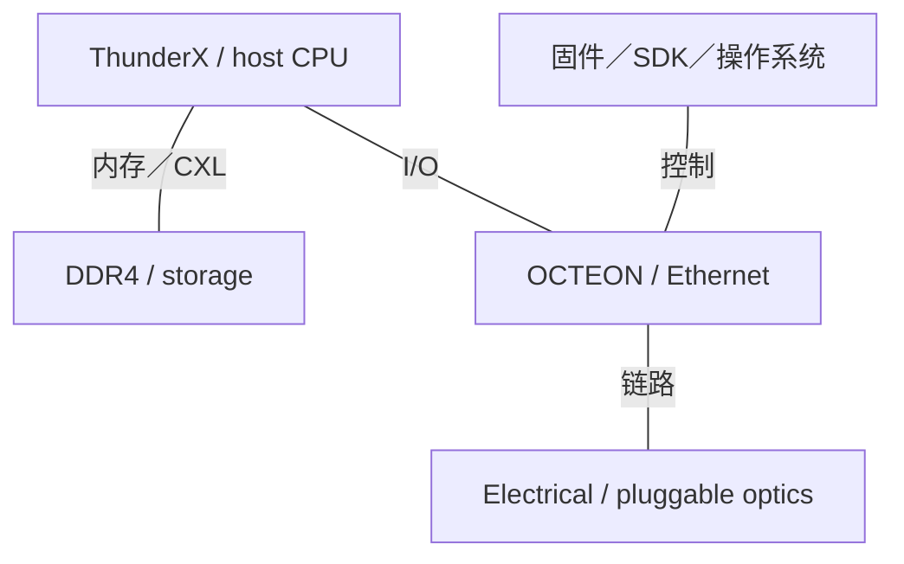
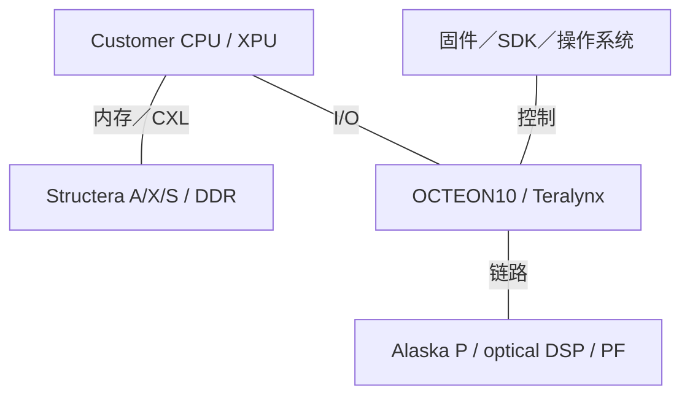

# Marvell AI 基础设施架构演进

2015-2026 | 2026-09-28

## 01 范围与核心判断

深入覆盖 OCTEON、Teralynx、光连接及存储／纵向扩展互联。历史 ThunderX CPU 覆盖至其转向定制方案。定制 XPU 仅采用公开的实现能力及客户关联。时间范围：2015 年至 2026 年 9 月 28 日。Celestial AI 与 XConn 均于 2026 年 2 月完成收购，因此纳入其收购前谱系。按相关性覆盖存储和安全控制器；企业接入交换及无线射频不作深入分析。

理解 Marvell 的关键，是其为计算提供数据搬移和芯片实现基础。CPU 历史之所以重要，是因为处理器及 SoC 能力重新出现在 DPU、近存加速与定制芯片中。光电连接产品覆盖从封装边界到数据中心互联的不同距离。架构问题在于：这些组件如何改变计算、内存及网络端点分离放置的成本，以及哪一层软件能利用这种自由度。

## 02 范围与数值口径

DPU 核心数不等于服务器 CPU 产品，近存加速器也不是通用 AI 训练 GPU。交换带宽、光模块容量、SerDes 通道速率及 CXL 有效载荷带宽描述不同资源。GT/s、编码后的 Gb/s 与有效 GB/s 分别保留。产品发布及送样目标不能证明量产可用。n/d 表示未确定字段，n/a 表示不适用。为未来活动宣布的演示，不作为已完成部署。

## 03 ThunderX：从商用 CPU 转向定制计算

ThunderX 源于 Cavium，后者于 2018 年并入 Marvell。ThunderX2 建立双插槽 Arm 服务器平台，并进入包括 Microsoft 内部 Azure 开发服务器在内的生产部署。ThunderX3 披露为 96 核、每核四线程、八通道 DDR4-3200 和 PCIe 4 的设计。随后战略声明转向超大规模客户定制方案。因此，2020 年 ThunderX3 披露记录为已公布／重新定位，不作为持续通用商用 CPU 路线图的证明。

架构解读：四路 SMT 增加可运行上下文数量，并不把内存通道或执行单元增加四倍。其收益取决于延迟隐藏、指令供给及干扰。买方比较时，不能把线程直接等同于单线程 Arm 核心。有价值的延续是缓存一致性网络、RAS 和存储系统能力，不意味着当前 OCTEON 核心与 ThunderX 采用同一微架构。

### 历史主机 CPU 谱系

| 代际／参考 SKU | 代号 | 正式商用 | 状态 | 核心微架构 | 核心／线程 | 各裸片工艺 | 裸片／封装 | 每核 L2 | L3／共享域 | 内存：通道；速率；GB/s | 插槽／互联 | PCIe／CXL | TDP | 向量／矩阵 ISA |
| --- | --- | --- | --- | --- | --- | --- | --- | --- | --- | --- | --- | --- | --- | --- |
| ThunderX | n/d | 2015时期 | 历史已商用 | Custom Armv8 | n/d | n/d | n/d | n/d | n/d | DDR4; n/d | n/d | n/d | n/d | Armv8 |
| ThunderX2 | n/d | 2018时期 | 历史已商用 | Custom Armv8 | n/d | n/d | n/d | n/d | n/d | DDR4; n/d | 2; 链路 n/d | n/d | n/d | Armv8 |
| ThunderX3 | n/d | n/d | 已公布／重新定位 | Custom Armv8 | 96 / 384 | TSMC 7P | n/d | n/d | n/d | 8 × DDR4-3200; 204.8 GB/s | 1-2; 链路 n/d | PCIe 4; 64 通道 | n/d | 4 × 128-bit Neon |

## 04 OCTEON：基础设施执行与加速

OCTEON 的历史 MIPS 家族及后续 Arm 家族，面向包处理、安全和存储，而不是通用主机替代。OCTEON TX 与 TX2 把该基础设施谱系延伸到 Arm SoC。OCTEON10 转向 5 nm 和 Neoverse N2，把 CPU 执行与包处理、加密及机器学习引擎结合。平台白皮书描述围绕这些引擎构建的一致性缓存和存储系统，使其成为集成数据平面计算机，而非只有固定卸载功能的网卡。

集成 ML 引擎服务于在线或近数据推理，包括基础设施及网络负载；它的存在并不使 OCTEON 直接替代 HBM 训练加速器。OCTEON10 Fusion 增加面向无线接入的加速，属于 5G／vRAN 分支；MWC 披露可解释该分支，但不应主导 AI 数据中心主线。不同 SKU 的 CPU 数量、内存接口和端口配置必须分别处理，不能拼接成不存在的“最大规格设备”。

## 05 Teralynx：走向 AI 规模的交换架构

Teralynx 通过 Innovium 并入 Marvell，与其他交换家族互补。Teralynx7 提供 12.8 Tb/s 基线。Teralynx10 提升至 51.2 Tb/s，于 2024 年进入量产。2026 年 T100 发布描述单片 3 nm、102.4 Tb/s，并给出送样目标。低延迟、遥测和拥塞管理的重要性，在于训练作业产生同步突发流量，而不只是相互独立的云端数据流。

架构解读：单片交换机避免部分内部裸片间跨越，但仍受芯片周边接口、SerDes 与供电预算限制。更快交换机只有在端口配置匹配端点速率及上联需求时，才能减少网络层级。因此，与 Tomahawk 的有效比较，应是在固定流量矩阵下比较完整拓扑，包括小包速率、缓冲压力、拥塞响应和光模块功耗，而不是只比较一个聚合 Tb/s 标签。

## 06 光 DSP、CPO 与 Photonic Fabric

Marvell 光 DSP 演进包括 5 nm Nova 1.6T 平台、3 nm Ara 平台及后续针对不同用途的变体。2026 年连接披露增加 2 nm 演示及 Libra 等产品；截至本报告日期，ECOC 声明按已宣布演示记录。DSP 专用化源于数据中心内部与更远距离链路在距离、调制、均衡和功耗预算上的差异。仅发送端 DSP 改变的是模块分工，不是消除全部信号处理需求。

Celestial AI 在收购前于 Hot Chips 2025 披露 Photonic Fabric，目标是把光连接进一步推进到计算与存储附近。Marvell 于 2026 年 2 月 2 日完成收购。收购声明预计在更后面的财年产生收入贡献，因此不能因为交易完成，就把技术描述为已广泛部署。幻灯片提供架构方向与模块概念，不足以证明每种提出的内存配置都已成为商用产品。

架构解读：光互联解决距离和带宽密度问题，并不会使远端内存等同于本地 HBM。串行化、协议遍历、端点缓冲和软件放置仍然存在。光内存网络需要明确地址可见性、一致性、延迟、故障隔离与分配契约。电链路节省的功耗，必须与激光器、温控、封装良率及维修策略共同权衡。

## 07 Structera、Alaska P 与存储层次

Structera X 扩展内存，Structera A 增加近存计算。A 2504 披露把十六个 Neoverse V2 核心、四通道 DDR5-6400 与 CXL2.0／PCIe5 ×16 主机接口结合。这一区别非常关键：附加 DRAM 带宽可以超过主机链路，本地计算则不必把每个字节都送回 CPU。压缩可能减少可压缩数据的流量，但不是适用于所有负载的固定带宽倍增器。

XConn 于 2026 年 2 月 10 日完成收购，补充 PCIe／CXL 交换能力。后续 Structera S 发布包括 260 通道 PCIe6 交换机及 CXL 交换机，给出的送样目标为 2026 年第三季度。Alaska P 重定时器支持端点与交换机之间的电链路距离。重定时器、交换机、内存扩展器和近存处理器处于四个不同位置，把它们的标题带宽相加没有意义。

## 08 固定结构产品对照

### DPU 与交换家族

| 产品 | 商用／里程碑 | 状态 | 类别 | 端口×速率 | SerDes | 主机接口 | 可编程引擎 | 嵌入式 CPU | 板载内存 | 传输／RDMA | 拥塞控制 | 主要卸载 | 功耗 |
| --- | --- | --- | --- | --- | --- | --- | --- | --- | --- | --- | --- | --- | --- |
| OCTEON TX2 | 2020时期 | 历史已商用 | DPU | ≤200G datapath | n/d | n/d | 包／加密引擎 | 12-36 Armv8 | n/d | Ethernet | n/d | 安全／存储 | n/d |
| OCTEON10 | 2021 已公布 | 已商用／可获取 | DPU | 依 SKU | 56G 级; 依 SKU | PCIe 5 | 包／加密／ML | Neoverse N2 | DDR5；依 SKU | Ethernet | n/d | 基础设施／在线 ML | n/d |
| Teralynx7 | pre-2021 | 历史已商用 | 交换机 | 12.8 Tb/s | n/d | n/a | 交换流水线 | n/d | n/d | Ethernet | 遥测 | L2/L3 | n/d |
| Teralynx10 | 2024 量产／生产部署 | 已商用／可获取 | 交换机 | 51.2 Tb/s | 100G 级 | n/a | 交换流水线 | n/d | n/d | Ethernet | 拥塞感知路由 | L2/L3 / telemetry | n/d |
| Teralynx T100 | 2026 送样目标 | 已公布；GA n/d | 交换机 | 102.4 Tb/s | n/d | n/a | 交换流水线 | n/d | n/d | Ethernet | AI 拥塞控制 | BGA / CPC / CPO | n/d |

### 加速器边界

| 产品 | 架构 | 商用／里程碑 | 状态 | 工艺 | 裸片／封装 | 计算单元 | 稠密 BF16 | 稠密 FP8 | 稠密 FP6／FP4 | FP64 向量／矩阵 | 内存：类型；堆栈；GB；TB/s | 末级缓存／SRAM | 纵向扩展：链路；单向 GB/s；域 | 主机连接 | 功耗／散热 | 形态 |
| --- | --- | --- | --- | --- | --- | --- | --- | --- | --- | --- | --- | --- | --- | --- | --- | --- |
| Structera A 2504 | Near-memory Arm 计算 | n/d | 已公布；GA n/d | 5 nm | n/d | 16 Neoverse V2 | n/d | n/d | n/d | n/d | DDR5; 4 通道; 6400 MT/s; 204.8 GB/s | n/d | n/a | CXL2.0 / PCIe5 ×16 | n/d | CXL 设备 |
| 客户定制 XPU | 依客户 | n/d | 依客户项目 | n/d | n/d | n/d | n/d | n/d | n/d | n/d | n/d | n/d | n/d | n/d | n/d | n/d |

### 连接产品

| 互联 | 年份／代际 | 通道速率 | 每链路通道 | 每链路单向 GB/s | 每设备链路 | 拓扑 | 域规模 | 一致性／语义 |
| --- | --- | --- | --- | --- | --- | --- | --- | --- |
| Alaska P | 2024-2026 | PCIe6: 64 GT/s | 16 | n/d | n/d | 重定时点对点 | n/a | 协议感知重定时器 |
| Structera S PCIe 60260 | 2026 | PCIe6: 64 GT/s | 每交换机 260 通道 | n/d | n/d | 交换式 PCIe | n/d | PCIe |
| Structera X / A | 2024 | PCIe5: 32 GT/s | 16 | ~63 扣除协议开销前 | 1 | CXL 连接 | n/d | CXL 内存；非均匀延迟 |
| Photonic Fabric | 2025-2026 | n/d | n/d | n/d | n/d | 光网络 | n/d | 依模块；不假定一致性 |

## 09 集成系统与软件

Marvell 定制芯片方案结合计算、封装与接口 IP，但客户项目不是公开商用加速器 SKU。与 NVIDIA 的合作建立了定制平台集成方向，并不证明所有定制 XPU 都使用 NVLink。因此，系统图展示功能接口，不构造虚假的纯 Marvell 机架。即使不执行模型层，存储控制器与加密引擎仍对数据输入、持久化和信任边界至关重要。

OCTEON 使用基础设施软件与加速 API，Teralynx 使用交换 SDK 及受支持的 SAI／SONiC 集成，CXL 产品依赖主机固件和操作系统内存管理。这些是不同软件契约。开放接口有助于集成，但不会自动解决放置、分页或故障隔离。近存计算还需要卸载机制，并实测搬移数据与搬移计算任务的收益交叉点。

### 2015-2020 集成角色

第二阶段包含已公布及路线图组件，并非已交付机架物料清单。

### 2021-2026 集成角色

第二阶段包含已公布及路线图组件，并非已交付机架物料清单。

### 系统边界

| 平台 | 年份／里程碑 | CPU／加速器数量 | 纵向扩展域 | 每加速器横向带宽 | 机架功耗 | 散热 |
| --- | --- | --- | --- | --- | --- | --- |
| 伙伴／定制平台 | 2015-2026 | 依客户 | n/d | n/d | n/d | n/d |

### 软件集成契约

| 层 | 接口 | 功能 | 边界 |
| --- | --- | --- | --- |
| 交换控制 | SDK／受支持开放接口 | 转发与遥测 | 依 ASIC 实现 |
| 基础设施 | 固件／驱动／加速 API | 包、存储与安全卸载 | 依 SKU 与平台 |
| 系统集成 | 主机软件及伙伴技术栈 | 资源与流量管理 | 不存在统一纯厂商 AI 框架 |

## 10 推导平衡与工程含义

### 推导带宽层次

| 资源 | 峰值计算 | 后果 |
| --- | --- | --- |
| ThunderX3 DRAM/核心 | 8×3200×8/1000/96 = 2.133 GB/s | 按核心；非 SMT 线程 |
| Structera A local DRAM | 4×6400×8/1000 = 204.8 GB/s | 本地内存控制器峰值 |
| PCIe5 ×16 | ~63 GB/s 每方向 | 已计编码；另扣包开销 |
| 本地 DRAM／主机链路比 | 204.8/63 ≈ 3.25 | 本地计算可避开主机链路瓶颈 |
| 定制 XPU HBM／FLOP／W | n/d | 客户规格未公开 |

最显著的跨代趋势是职责分离：主机计算、基础设施计算、近存计算及传输，分别获得专用芯片。这可以提高效率，也增加集成边界和故障域。内存扩展应作为具有延迟与带宽不对称性的层级评价，光纵向互联应作为包含端点及控制开销的系统评价。决定性测量是负载层面减少的流量、尾延迟、恢复行为和完整链路功耗，而不是孤立组件峰值。

## 11 会议索引与产品命名

### 披露映射

| 会议／活动 | 年份 | 论文／演讲／披露 | 报告人／作者 | 产品 | 证据类型 | 来源 |
| --- | --- | --- | --- | --- | --- | --- |
| Hot Chips | 2020 | ThunderX3 | Marvell | ThunderX3 | 厂商确认参会披露 | E09 E08 |
| Hot Chips | 2025 | Photonic Fabric Module | Phil Winterbottom | Celestial AI | 架构；收购前 | C01 |
| ISSCC / VLSI | 2022-2025 | SerDes disclosures indexed by vendor | Marvell | SerDes IP | 厂商索引；不泛化到全部产品 | C02 |
| OFC / company events | 2023-2026 | Optical DSP evolution | Marvell | Nova / Ara | 实现平台／发布 | E10 E14 |
| ECOC | 2026 | 2nm optical demonstrations | Marvell | Optical connectivity | 已宣布；不推定活动已完成 | E15 |

本版不声称当前 Marvell DPU 与交换机存在已核实的 ISCA／MICRO／HPCA／ASPLOS 产品论文链。会议重点相应转向 Hot Chips、ISSCC／VLSI 信号传输及 OFC／ECOC 集成。没有明确实现对应关系时，不能把 SerDes 测试芯片结果直接放入产品表。文末保留厂商会议索引作为研究线索，而不是代替逐篇阅读电路论文。

### 名称与角色

| 名称 | 谱系 | 角色 |
| --- | --- | --- |
| ThunderX | Cavium → Marvell | 历史服务器 CPU／转向定制 |
| Teralynx | Innovium → Marvell | 数据中心交换机 |
| Photonic Fabric | Celestial AI → Marvell | 光纵向互联平台 |
| Structera S | XConn integration | PCIe／CXL 交换 |
| Structera A / X | Marvell | 近存计算／扩展 |

实质缺口包括客户 XPU 计算规格、相匹配的 DPU 功耗／SKU 表、最新交换机的已确认量产状态，以及完整实测的光内存访问行为。公开信息足以重建产品方向，但不足以把某个定制 Marvell 加速器按稠密 BF16 或每瓦性能与 GPU 排名。此类比较需要具名客户系统及实际软件配置。

## 来源映射

01 范围与核心判断 — E04, E06, E07, E09, E11, P02

02 范围与数值口径 — E11, E12, E15, P01, P03

03 ThunderX：从商用 CPU 转向定制计算 — E08, E09, E17, P01, P05

04 OCTEON：基础设施执行与加速 — E01, P01, P02

05 Teralynx：走向 AI 规模的交换架构 — E02, E03, P03

06 光 DSP、CPO 与 Photonic Fabric — C01, E06, E10, E14, E15

07 Structera、Alaska P 与存储层次 — E07, E11, E12, E13, E16, P06

08 固定结构产品对照 — C01, E01, E02, E03, E04, E05, E06, E11, E12, E16, P01, P02, P03

09 集成系统与软件 — E03, E04, E05, E11, P02

10 推导平衡与工程含义 — C01, E04, E08, E11

11 会议索引与产品命名 — C01, C02, E03, E04, E05, E06, E07, E08, E09, E10, E11, E12, E13, E14, E15, P03

## 参考资料

### 产品与技术文档

[P01] OCTEON10 DPU platform whitepaper. [https://www.marvell.com/content/dam/marvell/en/public-collateral/embedded-processors/marvell-octeon-10-dpu-platform-white-paper.pdf](https://www.marvell.com/content/dam/marvell/en/public-collateral/embedded-processors/marvell-octeon-10-dpu-platform-white-paper.pdf). 一手资料；访问截止 2026-09-28

[P02] Data processing units. [https://www.marvell.com/products/data-processing-units.html](https://www.marvell.com/products/data-processing-units.html). 一手资料；访问截止 2026-09-28

[P03] Teralynx switching portfolio. [https://www.marvell.com/products/data-center-switches.html](https://www.marvell.com/products/data-center-switches.html). 一手资料；访问截止 2026-09-28

[P05] Product selector guide July2020. [https://www.marvell.com/content/dam/marvell/en/psg/marvell_psg.pdf](https://www.marvell.com/content/dam/marvell/en/psg/marvell_psg.pdf). 一手资料；访问截止 2026-09-28

[P06] Structera CXL products. [https://www.marvell.com/products/cxl.html](https://www.marvell.com/products/cxl.html). 一手资料；访问截止 2026-09-28

### 会议记录与实现披露

[C01] Celestial AI Photonic Fabric Module, Hot Chips2025. [https://hc2025.hotchips.org/assets/program/conference/day2/76-Hotchips_25_Celestial_AI_v4.pdf](https://hc2025.hotchips.org/assets/program/conference/day2/76-Hotchips_25_Celestial_AI_v4.pdf). 一手资料；访问截止 2026-09-28

[C02] Custom AI investor event2025; SerDes conference index. [https://www.marvell.com/content/dam/marvell/en/company/assets/marvell-custom-ai-investor-event-2025.pdf](https://www.marvell.com/content/dam/marvell/en/company/assets/marvell-custom-ai-investor-event-2025.pdf). 一手资料；访问截止 2026-09-28

### 发布、生态与部署

[E01] OCTEON10 introduction, 2021. [https://www.marvell.com/company/newsroom/marvell-extends-octeon-leadership-industry-first-5nm-dpu.html](https://www.marvell.com/company/newsroom/marvell-extends-octeon-leadership-industry-first-5nm-dpu.html). 一手资料；访问截止 2026-09-28

[E02] Teralynx10 51.2T production. [https://www.marvell.com/company/newsroom/marvell-teralynx-512t-ethernet-switch-enters-volume-production-for-global-ai-cloud-deployments.html](https://www.marvell.com/company/newsroom/marvell-teralynx-512t-ethernet-switch-enters-volume-production-for-global-ai-cloud-deployments.html). 一手资料；访问截止 2026-09-28

[E03] Teralynx T100 102.4T. [https://investor.marvell.com/news-events/press-releases/detail/1024/marvell-announces-availability-of-industrys-first-102-4-tbps-switch-purpose-built-for-ai-and-cloud-data-center-infrastructure](https://investor.marvell.com/news-events/press-releases/detail/1024/marvell-announces-availability-of-industrys-first-102-4-tbps-switch-purpose-built-for-ai-and-cloud-data-center-infrastructure). 一手资料；访问截止 2026-09-28

[E04] Accelerated infrastructure for the AI era, 2025. [https://www.marvell.com/content/dam/marvell/en/company/assets/marvell-accelerated-infrastructure-for-the-ai-era-event.pdf](https://www.marvell.com/content/dam/marvell/en/company/assets/marvell-accelerated-infrastructure-for-the-ai-era-event.pdf). 一手资料；访问截止 2026-09-28

[E05] Custom AI infrastructure with NVIDIA. [https://investor.marvell.com/news-events/press-releases/detail/97/marvell-and-nvidia-to-provide-custom-solutions-for-advanced-ai-infrastructure](https://investor.marvell.com/news-events/press-releases/detail/97/marvell-and-nvidia-to-provide-custom-solutions-for-advanced-ai-infrastructure). 一手资料；访问截止 2026-09-28

[E06] Celestial AI acquisition completion. [https://www.marvell.com/company/newsroom/marvell-completes-acquisition-of-celestial-ai.html](https://www.marvell.com/company/newsroom/marvell-completes-acquisition-of-celestial-ai.html). 一手资料；访问截止 2026-09-28

[E07] XConn acquisition completion. [https://investor.marvell.com/news-events/press-releases/detail/1007/marvell-completes-acquisition-of-xconn-technologies](https://investor.marvell.com/news-events/press-releases/detail/1007/marvell-completes-acquisition-of-xconn-technologies). 一手资料；访问截止 2026-09-28

[E08] ThunderX3 architecture. [https://www.marvell.com/blogs/the-next-generation-of-thunderx-delivers-performance-and-power-advantages-to-cloud-and-hpc-server-markets.html](https://www.marvell.com/blogs/the-next-generation-of-thunderx-delivers-performance-and-power-advantages-to-cloud-and-hpc-server-markets.html). 一手资料；访问截止 2026-09-28

[E09] ThunderX strategy change. [https://www.marvell.com/blogs/arm-processors-in-the-data-center.html](https://www.marvell.com/blogs/arm-processors-in-the-data-center.html). 一手资料；访问截止 2026-09-28

[E10] Teralynx10 and Nova platform. [https://investor.marvell.com/news-events/press-releases/detail/188/marvell-announces-cloud-optimized-51-2-tbps-networking-platform-for-aiml-and-data-center-networks](https://investor.marvell.com/news-events/press-releases/detail/188/marvell-announces-cloud-optimized-51-2-tbps-networking-platform-for-aiml-and-data-center-networks). 一手资料；访问截止 2026-09-28

[E11] Structera A and X launch. [https://www.marvell.com/company/newsroom/marvell-introduces-breakthrough-structera-cxl-product-line-to-address-server-memory-bandwidth-and-capacity-challenges-in-cloud-data-centers.html](https://www.marvell.com/company/newsroom/marvell-introduces-breakthrough-structera-cxl-product-line-to-address-server-memory-bandwidth-and-capacity-challenges-in-cloud-data-centers.html). 一手资料；访问截止 2026-09-28

[E12] Structera S PCIe6 260-lane switch. [https://www.marvell.com/company/newsroom/marvell-260-lane-pcie-6-switch-ai-data-center-scale-up.html](https://www.marvell.com/company/newsroom/marvell-260-lane-pcie-6-switch-ai-data-center-scale-up.html). 一手资料；访问截止 2026-09-28

[E13] Structera S CXL switch. [https://investor.marvell.com/news-events/press-releases/detail/1017/marvell-launches-next-generation-cxl-switch-enabling-memory-pooling-to-break-through-the-ai-memory-wall](https://investor.marvell.com/news-events/press-releases/detail/1017/marvell-launches-next-generation-cxl-switch-enabling-memory-pooling-to-break-through-the-ai-memory-wall). 一手资料；访问截止 2026-09-28

[E14] Optical DSP platform evolution. [https://www.marvell.com/company/newsroom/marvell-1-6t-optical-dsp-ai-data-center-connectivity.html](https://www.marvell.com/company/newsroom/marvell-1-6t-optical-dsp-ai-data-center-connectivity.html). 一手资料；访问截止 2026-09-28

[E15] ECOC2026 demonstration announcement. [https://www.marvell.com/company/newsroom/marvell-industry-first-2nm-optical-technology-ai-data-center-infrastructure-ecoc-2026.html](https://www.marvell.com/company/newsroom/marvell-industry-first-2nm-optical-technology-ai-data-center-infrastructure-ecoc-2026.html). 一手资料；访问截止 2026-09-28

[E16] Alaska P adoption. [https://investor.marvell.com/news-events/press-releases/detail/1001/marvell-announces-adoption-of-its-pcie-retimers-by-leading-ai-and-data-center-infrastructure-providers](https://investor.marvell.com/news-events/press-releases/detail/1001/marvell-announces-adoption-of-its-pcie-retimers-by-leading-ai-and-data-center-infrastructure-providers). 一手资料；访问截止 2026-09-28

[E17] ThunderX2 deployment. [https://www.marvell.com/company/newsroom/marvells-thunderx2-solution-now-deployed-for-microsoft-azure-development.html](https://www.marvell.com/company/newsroom/marvells-thunderx2-solution-now-deployed-for-microsoft-azure-development.html). 一手资料；访问截止 2026-09-28
