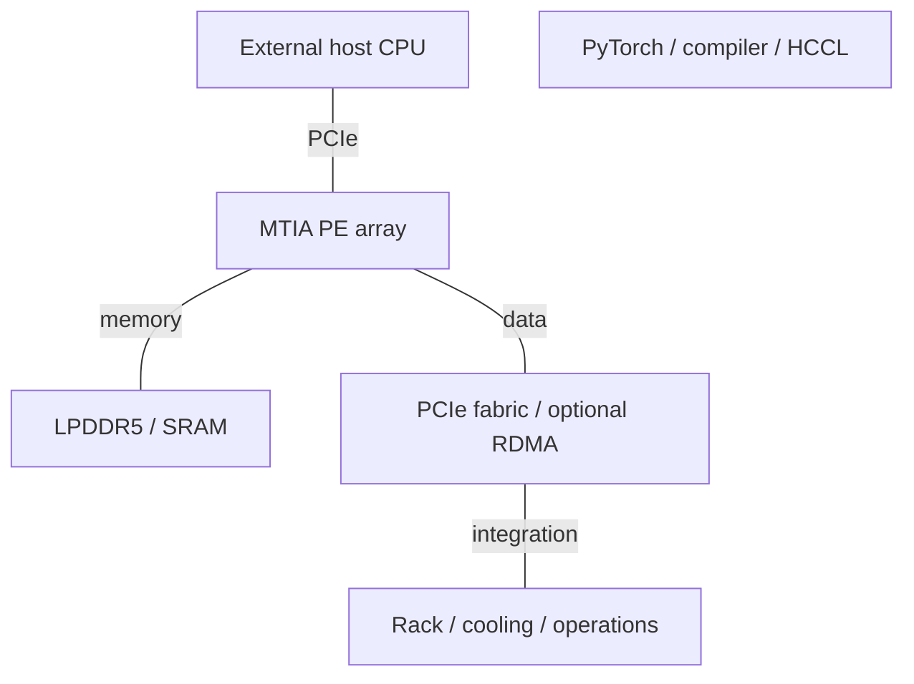
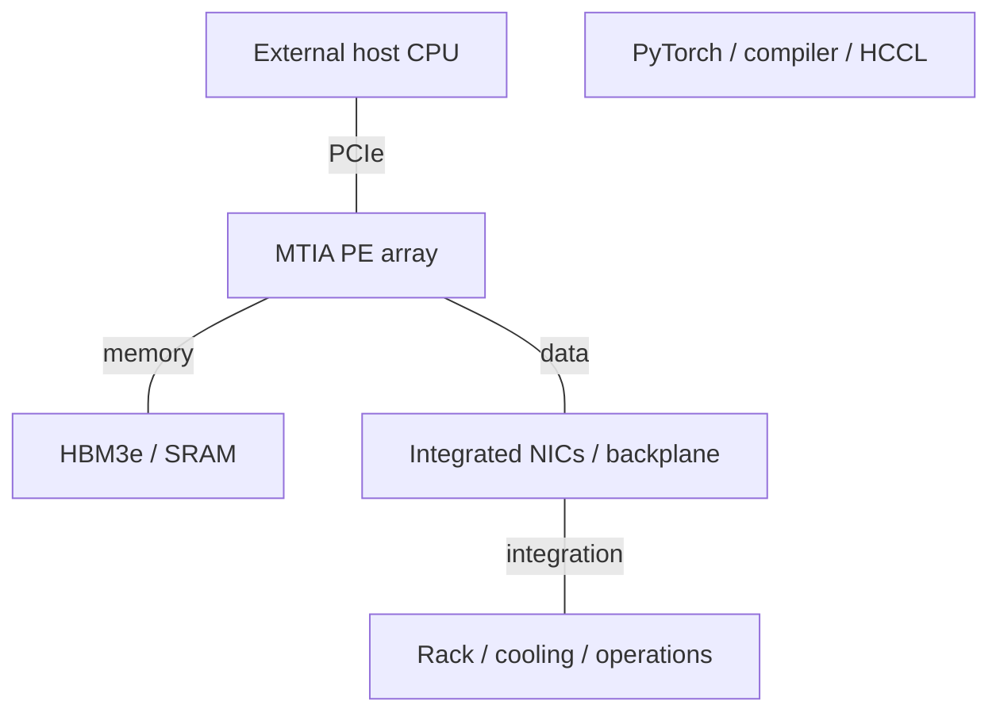

# Meta AI Infrastructure Architecture Evolution

2015-2026 | 2026-09-28

## 01 Scope and executive synthesis

This report covers Meta’s AI infrastructure from 2015 to 28 September 2026: MTIA accelerators, their integrated AI networking, system packaging and software, plus the related MSVP video-processing branch. Merchant CPUs, GPUs and switch ASICs are distinguished from Meta-designed silicon. Earlier years establish infrastructure context rather than an invented annual sequence of custom chips.

MTIA evolves from low-power recommendation inference into an HBM-based training platform and then an inference-oriented generative-AI roadmap. The decisive transition is not merely more arithmetic: it adds network chiplets, near-memory reduction and rack-scale communication while preserving a PyTorch-facing software contract. Meta’s workload ownership allows narrower optimization than a merchant GPU, but portability, reliability and model evolution remain constraints.

## 02 MTIA100 and MTIA200: recommendation inference

MTIA100, originally MTIA v1, was designed around recommendation inference and disclosed at ISCA 2023. Its 7 nm implementation combines an 8×8 processing-element grid, local memories and a larger shared SRAM tier with LPDDR5. The key architectural balance is enough arithmetic for dense portions of the model without sacrificing the storage and access behavior needed by sparse features. This is a different objective from maximizing large-batch transformer training FLOPS.

MTIA200, originally MTIA2i, retains the 64-PE organization while moving to 5 nm, higher frequency, more local storage and 256 MB shared SRAM. Dense FP16/BF16 rises from 51.2 to 177 TFLOP/s, while LPDDR5 bandwidth increases only from 176 to 204.8 GB/s. The design therefore relies increasingly on on-chip reuse and sparse-workload scheduling. The 2024 platform fits 72 accelerators in a rack, but this is not the same as the 72-device dedicated scale-up domain introduced with MTIA400.

## 03 MTIA300: training changes the data path

The ISCA 2026 paper describes one compute chiplet, two network chiplets and six HBM3e stacks. A 12×6 active PE array combines RISC-V vector control, dot-product, special-function, reduction and DMA engines. The memory system provides 216 GB and 6.1 TB/s. Redundant PE resources address yield and faults. Moving from LPDDR to HBM changes both packaging and the balance between dense layers, embeddings and collective traffic.

Each network chiplet integrates six 800 Gb/s RDMA controllers. The aggregate endpoint rate is 1.2 TB/s in each direction. Message engines and near-memory reduction let collectives progress without occupying the principal compute engines or passing the payload through the host PCIe link. The paper’s deployed scale-up configuration uses 800 GB/s, with support up to 1,000 GB/s; scale-out is 200 GB/s. The marketing table uses the supported maximum. Both configurations are retained rather than silently merged.

A one-to-one host-CPU/accelerator relationship supports optimizer offload. Large HBM capacity can permit larger local batches and fewer communicating trainers, but the benefit depends on optimizer state, precision and convergence constraints. HCCL can fuse communication and computation; the reported collective results are workload- and topology-specific. Integrated NICs reduce one bottleneck, not every synchronization or network bottleneck.

## 04 MTIA400, 450 and 500: the inference roadmap

The March 2026 roadmap identifies MTIA300 as in production, MTIA400 as laboratory-tested and moving toward deployment, and MTIA450/500 as planned for 2027. MTIA400 uses two compute chiplets and a 72-device scale-up system. MTIA450 prioritizes memory bandwidth and low-precision inference. MTIA500 moves to four compute chiplets plus separate network and host-I/O functions. These are disclosure statuses, not assumed public-cloud or merchant availability.

Architectural interpretation: reusing chassis and network infrastructure can shorten deployment cycles, but it fixes parts of the system bandwidth budget while compute and HBM continue to grow. From 400 to 500, scale-up remains 1.2 TB/s and scale-out 100 GB/s per device, while HBM bandwidth triples. The compiler must consequently preserve more locality or change parallelization. A 25× comparison from MTIA300 MX8 to MTIA500 MX4 crosses numerical formats and is not a like-for-like arithmetic speedup.

## 05 Generation specifications and disclosure reconciliation

### MTIA reference specifications

| Product | Architecture | GA / milestone | Status | Process | Dies / packaging | Compute units | Dense BF16 | Dense FP8 | Dense FP6 / FP4 | FP64 vector / matrix | Memory: type; stacks; GB; TB/s | LLC / SRAM | Scale-up: links; GB/s per direction; domain | Host link | Power / cooling | Form factor |
| --- | --- | --- | --- | --- | --- | --- | --- | --- | --- | --- | --- | --- | --- | --- | --- | --- |
| MTIA100 / v1 | Recommendation inference | 2023 disclosure | Historical shipping | 7 nm | 1 logic die | 64 PEs | 51.2 TFLOP/s | n/a | n/a | n/d | LPDDR5; 64 GB; 0.176 TB/s | 128 MB; 128 KB/PE | n/a | PCIe4 ×8 | 25 W | Accelerator board |
| MTIA200 / 2i | Recommendation inference | 2024 deployment | Shipping / available | 5 nm | 1 logic die | 64 PEs | 177 TFLOP/s | n/a | n/a | n/d | LPDDR5; 64-128 GB; 0.2048 TB/s | 256 MB; 384 KB/PE | PCIe fabric; not dedicated scale-up | PCIe5 ×8 | 90 W launch; 85 W paper | Accelerator board |
| MTIA300 | R&R training | 2026 production | Shipping / available | n/d | 1 compute + 2 network; interposer | 72 active PEs | 560 TFLOP/s (paper) | 1120 TFLOP/s (paper) | n/d | n/d | HBM3e; 6; 216 GB; 6.1 TB/s | 192 MB; 512 KB/PE | 800-1000 GB/s one-way; 16 devices | PCIe5 ×16 | 912 W TDP / 667 W typical (paper) | Liquid-cooled module |
| MTIA400 | GenAI / inference | 2026 deployment path | Announced; GA n/d | n/d | 2 compute chiplets | n/d | 3 PFLOP/s advertised; dense basis n/d | 6 PFLOP/s FP8/MX8; dense basis n/d | 12 PFLOP/s MX4; dense basis n/d | n/d | HBM; stacks n/d; 288 GB; 9.2 TB/s | n/d | 1200 GB/s one-way; 72 devices | n/d | 1200 W module; liquid/AALC | Rack module |
| MTIA450 | GenAI / inference | early 2027 target | Roadmap | n/d | n/d | n/d | 3.5 PFLOP/s advertised; dense basis n/d | 7 PFLOP/s FP8/MX8; dense basis n/d | 21 PFLOP/s MX4; dense basis n/d | n/d | HBM; stacks n/d; 288 GB; 18.4 TB/s | n/d | 1200 GB/s one-way; 72 devices | n/d | 1400 W module; liquid/AALC | Rack module |
| MTIA500 | GenAI / inference | 2027 target | Roadmap | n/d | 4 compute + 2 network + SoC | n/d | 5 PFLOP/s advertised; dense basis n/d | 10 PFLOP/s FP8/MX8; dense basis n/d | 30 PFLOP/s MX4; dense basis n/d | n/d | HBM; stacks n/d; 384-512 GB; 27.6 TB/s | n/d | 1200 GB/s one-way; 72 devices | n/d | 1700 W module; liquid/AALC | Rack module |

The March roadmap lists MTIA300 at 0.6 PFLOP/s BF16, 1.2 PFLOP/s FP8/MX8 and 800 W module TDP. The ISCA paper lists 560/1,120 TFLOP/s and 912 W TDP with 667 W typical power. These represent different published configurations or measurement bases; no undocumented reconciliation is imposed. For derived ratios, the paper’s matched values are used. Likewise, MTIA200’s launch states 90 W while the later comparison table states 85 W. Sparse peaks are kept separate from dense values.

### Host CPU boundary

| Generation / reference SKU | Codename | GA | Status | Core µarch | Cores / threads | Process per die | Dies / packaging | L2 per core | L3 / domain | Memory: channels; rate; GB/s | Sockets / links | PCIe / CXL | TDP | Vector / matrix ISA |
| --- | --- | --- | --- | --- | --- | --- | --- | --- | --- | --- | --- | --- | --- | --- |
| External host CPUs | n/a | n/a | Supplier products | n/a | n/a | n/a | n/a | n/a | n/a | n/a | n/a | n/a | n/a | n/a |

## 06 Integrated NICs, networking and MSVP

### MTIA network chiplets

| Product | GA / milestone | Status | Class | Ports × speed | SerDes | Host interface | Programmable engine | Embedded CPU | On-card memory | Transport / RDMA | Congestion control | Key offloads | Power |
| --- | --- | --- | --- | --- | --- | --- | --- | --- | --- | --- | --- | --- | --- |
| MTIA300 network chiplets | 2026 | Shipping / available | Integrated AI NIC | 2×6×800 Gb/s | n/d | Die-to-die | Message engines / near-memory reduction | RISC-V control | Shared accelerator memory | RDMA | Credit-based fabric mechanisms | Collectives; reductions; direct data path | Within module |

MSVP is a dedicated video-transcoding ASIC disclosed in 2023. It belongs in the infrastructure portfolio because video processing consumes substantial fleet resources, but it is not an MTIA generation or a general neural-network accelerator. Likewise, Meta’s OCP server and networking designs, including switch software and rack standards, should not be confused with ownership of every merchant ASIC they contain.

### Interconnect evolution

| Interconnect | Year / generation | Lane rate | Lanes / link | GB/s per link per direction | Links / device | Topology | Domain limit | Coherence / semantics |
| --- | --- | --- | --- | --- | --- | --- | --- | --- |
| MTIA200 host fabric | 2024 | PCIe5 32 GT/s | 8 | ~31.5 before packet overhead | n/d | PCIe switching | 72/rack is packaging count | PCIe |
| MTIA300 scale-up | 2026 | 800 Gb/s port | n/d | 100 | Configuration-specific | Rack fabric | 16 | RDMA; explicit collectives |
| MTIA400/450/500 scale-up | 2026 roadmap | n/d | n/d | 1200 aggregate/device | n/d | Switched backplane | 72 | Explicit communication |

## 07 Rack architecture and software

### 2023-2024 stack

Later diagram includes announced products; silicon and rack availability are tracked separately.

### 2026 roadmap stack

Later diagram includes announced products; silicon and rack availability are tracked separately.

### System generations

| Platform | Year / milestone | CPU / accelerator count | Scale-up domain | Scale-out per accelerator | Rack power | Cooling |
| --- | --- | --- | --- | --- | --- | --- |
| MTIA200 rack | 2024 | 72 accelerators; 3 chassis | PCIe topology | Optional external RDMA NIC | n/d | Air |
| MTIA300 rack | 2026 | 16 accelerators; 1 CPU/accelerator | 16 | 200 GB/s nominal one-way | n/d | Liquid |
| MTIA400/450/500 rack | 2026-2027 targets | 72 accelerators | 72 | 100 GB/s nominal one-way | n/d | AALC / facility liquid |

### Software stack

| Layer | Component | Function | Architectural implication |
| --- | --- | --- | --- |
| Frontend | PyTorch / torch.compile / export | Model capture | Shared framework interface |
| Compiler | TorchInductor / Triton / MLIR / LLVM | Graph and kernel lowering | Schedule local memories and engines |
| Communication | Hoot Collective Communications Library | Collectives and reduction offload | HCCL here is Meta Hoot |
| Runtime | Rust user-space driver / firmware | Memory, execution, observability | Host and device coordination |
| Serving | vLLM plugin | Serving integration | Backend-specific optimized kernels |

## 08 Normalized trends and engineering tradeoffs

### Memory and communication balance

| Product / metric | Calculation | Interpretation |
| --- | --- | --- |
| MTIA100 DRAM/BF16 | 176e9/51.2e12 = 0.00344 B/FLOP | Dense peak |
| MTIA200 DRAM/BF16 | 204.8e9/177e12 = 0.00116 B/FLOP | More reuse required than MTIA100 |
| MTIA300 HBM/BF16 | 6.1e12/560e12 = 0.0109 B/FLOP | Paper configuration |
| MTIA300 capacity/BF16 | 216e9/560e12 = 3.86e-4 B·s/FLOP | Per accelerator |
| MTIA300 scale-up/HBM | 0.8/6.1 = 0.131 | Deployed paper configuration |
| MTIA400→500 scale-up/HBM | 1.2/9.2=0.130 → 1.2/27.6=0.0435 | Network grows slower than HBM |
| MTIA300 BF16/TDP | 560/912 = 0.614 TFLOP/s/W | Peak/TDP; not application efficiency |
| Host DDR/core and L3/core | n/a | No Meta host-CPU SKU asserted |

The large increase in bytes per BF16 FLOP at MTIA300 reflects a workload choice: recommendation training needs embedding capacity and traffic handling. Subsequent inference products raise both HBM and low-precision compute but retain a fixed rack network budget. Their success depends on model placement, expert routing, KV-cache behavior and compiler utilization. Compare at matched precision, quality, batch size and service-level latency, with module and rack power kept separate.

## 09 Conference and product crosswalk

### Disclosure map

| Venue | Year | Paper / talk / disclosure | Presenter / authors | Product | Evidence type | Source |
| --- | --- | --- | --- | --- | --- | --- |
| ISCA | 2023 | MTIA v1 | Meta authors | MTIA100 | Architecture paper; official companion | C02 P03 |
| ISCA | 2025 | Second-generation MTIA | Meta authors | MTIA200 / 2i | Paper record; official architecture | C03 P04 |
| ISCA | 2026 | MTIA300 built-in NICs | Meta authors | MTIA300 | Full paper | C01 |
| AI Infra @Scale | 2024 | Hardware and co-design of MTIA | Colburn; Lan; Montgomery | MTIA200 | Engineering presentation | P02 |
| SC | 2026 | HCCL | Meta authors | MTIA communication | Preprint; November event still future | C04 |
| Company technical disclosure | 2026 | Four MTIA chips in two years | Meta | 300 / 400 / 450 / 500 | Product and roadmap | E01 |

No product-specific ISSCC, HPCA, MICRO or ASPLOS circuit/architecture chain is established here for MTIA. ISCA provides the strongest direct product evidence. The public roadmap is broader than the available implementation papers: process, die details and dense/sparse arithmetic basis remain incomplete for 400/450/500. The report retains those gaps in the tables rather than extrapolating earlier silicon details.

### Naming and ownership

| Name | Alias / role | Boundary |
| --- | --- | --- |
| MTIA100 | MTIA v1 | Inference ASIC |
| MTIA200 | MTIA2i | Not MTIA300 training chip |
| HCCL | Hoot | Not Huawei HCCL |
| MSVP | Video transcoding | Separate ASIC branch |
| Broadcom | MTIA development partner | Not a merchant MTIA SKU |

### ISSCC background

| Venue | Year | Paper / talk / disclosure | Presenter / authors | Product | Evidence type | Source |
| --- | --- | --- | --- | --- | --- | --- |
| ISSCC plenary | 2019 | Deep Learning Hardware: Past, Present, & Future | Yann LeCun | Research context; not MTIA implementation | Official plenary record | C05 |

## Source map

01 Scope and executive synthesis — C01, E01, E03, E04, P03, P04

02 MTIA100 and MTIA200: recommendation inference — C02, C03, P03, P04

03 MTIA300: training changes the data path — C01, C04, E01, P01

04 MTIA400, 450 and 500: the inference roadmap — E01

05 Generation specifications and disclosure reconciliation — C01, E01, E03, P03, P04

06 Integrated NICs, networking and MSVP — C01, E01, E03, E04, P01, P04

07 Rack architecture and software — C01, C04, E01, P01, P04

08 Normalized trends and engineering tradeoffs — C01, E01, P04

09 Conference and product crosswalk — C01, C02, C03, C04, C05, E01, E04, P02, P03, P04

## References

### Product and technical documentation

[P01] MTIA300 built-in NICs and collective offload. [https://engineering.fb.com/2026/08/24/networking-traffic/mtia-300-meta-training-chip-built-in-nics/](https://engineering.fb.com/2026/08/24/networking-traffic/mtia-300-meta-training-chip-built-in-nics/). Primary source; accessed by 2026-09-28

[P02] Inside MTIA hardware co-design, 2024. [https://engineering.fb.com/2024/08/22/ml-applications/meta-mtia-hardware-co-design/](https://engineering.fb.com/2024/08/22/ml-applications/meta-mtia-hardware-co-design/). Primary source; accessed by 2026-09-28

[P03] First generation MTIA architecture. [https://ai.meta.com/blog/meta-training-inference-accelerator-AI-MTIA/](https://ai.meta.com/blog/meta-training-inference-accelerator-AI-MTIA/). Primary source; accessed by 2026-09-28

[P04] Second generation MTIA architecture. [https://ai.meta.com/blog/next-generation-meta-training-inference-accelerator-AI-MTIA/](https://ai.meta.com/blog/next-generation-meta-training-inference-accelerator-AI-MTIA/). Primary source; accessed by 2026-09-28

### Conference records and implementation disclosures

[C01] MTIA300 ISCA2026 paper. [https://aisystemcodesign.github.io/papers/MTIA300_ISCA2026.pdf](https://aisystemcodesign.github.io/papers/MTIA300_ISCA2026.pdf). Primary source; accessed by 2026-09-28

[C02] MTIA v1, ISCA2023. [https://dl.acm.org/doi/10.1145/3579371.3589348](https://dl.acm.org/doi/10.1145/3579371.3589348). Official indexed record or related announcement; full document download unavailable.

[C03] Second generation MTIA, ISCA2025. [https://dl.acm.org/doi/10.1145/3695053.3731409](https://dl.acm.org/doi/10.1145/3695053.3731409). Official indexed record or related announcement; full document download unavailable.

[C04] HCCL collective communications, 2026 preprint. [https://arxiv.org/pdf/2608.00358](https://arxiv.org/pdf/2608.00358). Primary source; accessed by 2026-09-28

[C05] ISSCC2019 LeCun plenary record. [https://www.isscc.org/isscc-plenary-videos](https://www.isscc.org/isscc-plenary-videos). Indexed record or searchable official page; product details cross-checked with the associated technical document.

### Launches, ecosystem and deployment

[E01] Four MTIA chips in two years, March2026. [https://ai.meta.com/blog/meta-mtia-scale-ai-chips-for-billions/](https://ai.meta.com/blog/meta-mtia-scale-ai-chips-for-billions/). Primary source; accessed by 2026-09-28

[E03] Infrastructure evolution, 2025. [https://engineering.fb.com/2025/09/29/data-infrastructure/metas-infrastructure-evolution-and-the-advent-of-ai/](https://engineering.fb.com/2025/09/29/data-infrastructure/metas-infrastructure-evolution-and-the-advent-of-ai/). Primary source; accessed by 2026-09-28

[E04] MSVP first video transcoding ASIC. [https://ai.meta.com/blog/meta-scalable-video-processor-MSVP/](https://ai.meta.com/blog/meta-scalable-video-processor-MSVP/). Indexed record or searchable official page; product details cross-checked with the associated technical document.
