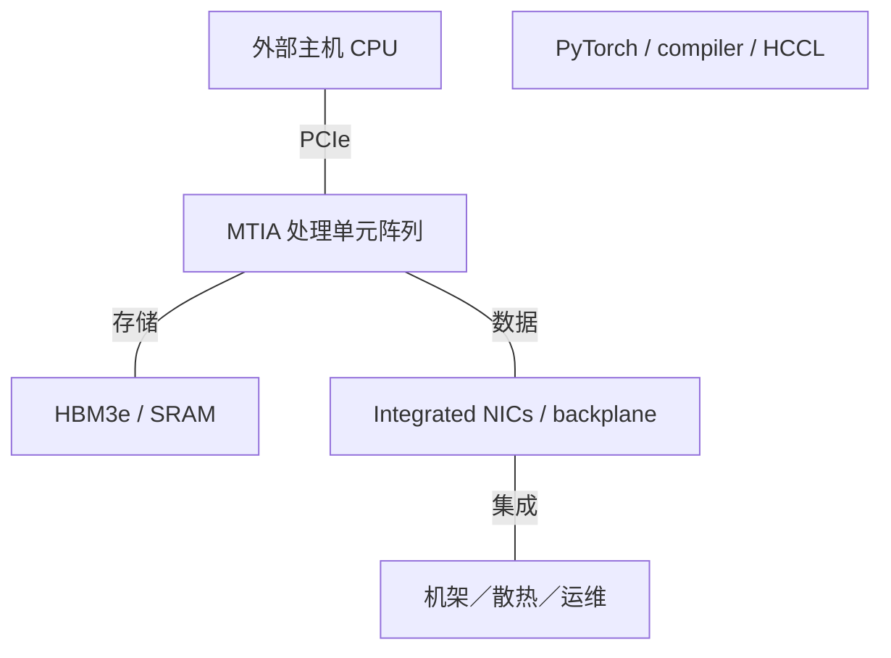

# Meta AI 基础设施架构演进

2015-2026 | 2026-09-28

## 01 范围与核心判断

本报告覆盖 Meta 在 2015 年至 2026 年 9 月 28 日的 AI 基础设施：MTIA 加速器、集成 AI 网络、系统封装与软件，以及相关 MSVP 视频处理分支。商用 CPU、GPU 和交换 ASIC 与 Meta 设计芯片分别处理。早期年份用于建立基础设施背景，不虚构逐年自研芯片序列。

MTIA 从低功耗推荐推理，演进到基于 HBM 的训练平台，再延伸至面向生成式 AI 推理的路线图。决定性转变不只是增加算术能力，还增加网络小芯片、近存归约与机架级通信，同时保持面向 PyTorch 的软件契约。Meta 掌握自身负载，可以比通用商用 GPU 更有针对性地优化，但可移植性、可靠性与模型变化仍是约束。

## 02 MTIA100 与 MTIA200：推荐推理

MTIA100 原名 MTIA v1，围绕推荐推理设计，于 ISCA 2023 披露。其 7 nm 实现结合 8×8 处理单元阵列、本地存储、较大共享 SRAM 层及 LPDDR5。核心平衡是为模型的稠密部分提供足够算术能力，同时保留稀疏特征需要的存储与访问能力。这与最大化大批量 Transformer 训练 FLOPS 的目标不同。

MTIA200 原名 MTIA2i，保留 64 个处理单元的组织，转向 5 nm、更高频率、更大本地存储及 256 MB 共享 SRAM。稠密 FP16／BF16 从 51.2 提高到 177 TFLOP/s，而 LPDDR5 带宽仅从 176 提高到 204.8 GB/s。因此设计更依赖片上复用与稀疏负载调度。2024 年平台可在机架中容纳 72 个加速器，但这不同于 MTIA400 引入的 72 设备专用纵向扩展域。

## 03 MTIA300：训练改变数据路径

ISCA 2026 论文描述一个计算小芯片、两个网络小芯片及六堆栈 HBM3e。12×6 启用处理单元阵列结合 RISC-V 向量控制、点积、特殊函数、归约与 DMA 引擎。存储系统提供 216 GB 和 6.1 TB/s，冗余处理单元用于良率与故障处理。从 LPDDR 转向 HBM，同时改变封装以及稠密层、嵌入表与集合通信之间的平衡。

每个网络小芯片集成六个 800 Gb/s RDMA 控制器，总端点速率为每方向 1.2 TB/s。消息引擎与近存归约使集合通信无需占用主要计算引擎，也不必把载荷送过主机 PCIe 链路。论文部署配置采用 800 GB/s 纵向带宽，支持最高 1,000 GB/s；横向扩展为 200 GB/s。产品表采用支持上限，因此本报告保留两种配置，不将其静默合并。

一对一主机 CPU／加速器关系支持优化器卸载。更大 HBM 容量可能允许更大本地批量并减少参与通信的训练设备，但收益取决于优化器状态、精度及收敛约束。HCCL 可融合通信与计算，公布的集合通信结果依赖具体负载与拓扑。集成 NIC 减少一种瓶颈，不会消除所有同步或网络瓶颈。

## 04 MTIA400、450 与 500：推理路线图

2026 年 3 月路线图将 MTIA300 列为已生产部署，MTIA400 列为已完成实验室测试、正在推进部署，MTIA450／500 列为计划于 2027 年部署。MTIA400 使用两个计算小芯片及 72 设备纵向扩展系统；MTIA450 优先提升内存带宽和低精度推理；MTIA500 转向四个计算小芯片，并分离网络与主机 I/O 功能。以上是披露状态，不推定公共云或商用芯片可获取性。

架构解读：复用机箱与网络基础设施可以缩短部署周期，但当算力和 HBM 持续增长时，部分系统带宽预算被固定。从 400 到 500，每设备纵向扩展仍为 1.2 TB/s、横向扩展仍为 100 GB/s，而 HBM 带宽增加至三倍。因此编译器必须保留更多局部性或改变并行方式。MTIA300 MX8 至 MTIA500 MX4 的 25 倍比较跨越数值格式，不是同口径算术加速比。

## 05 代际规格与披露差异

### MTIA 参考规格

| 产品 | 架构 | 商用／里程碑 | 状态 | 工艺 | 裸片／封装 | 计算单元 | 稠密 BF16 | 稠密 FP8 | 稠密 FP6／FP4 | FP64 向量／矩阵 | 内存：类型；堆栈；GB；TB/s | 末级缓存／SRAM | 纵向扩展：链路；单向 GB/s；域 | 主机连接 | 功耗／散热 | 形态 |
| --- | --- | --- | --- | --- | --- | --- | --- | --- | --- | --- | --- | --- | --- | --- | --- | --- |
| MTIA100 / v1 | 推荐推理 | 2023 披露 | 历史已商用 | 7 nm | 1 逻辑裸片 | 64 PEs | 51.2 TFLOP/s | n/a | n/a | n/d | LPDDR5; 64 GB; 0.176 TB/s | 128 MB; 128 KB/PE | n/a | PCIe4 ×8 | 25 W | 加速板卡 |
| MTIA200 / 2i | 推荐推理 | 2024 部署 | 已商用／可获取 | 5 nm | 1 逻辑裸片 | 64 PEs | 177 TFLOP/s | n/a | n/a | n/d | LPDDR5; 64-128 GB; 0.2048 TB/s | 256 MB; 384 KB/PE | PCIe 网络; 非专用纵向扩展 | PCIe5 ×8 | 90 W 发布; 85 W 论文 | 加速板卡 |
| MTIA300 | R&R 训练 | 2026 量产／生产部署 | 已商用／可获取 | n/d | 1 计算＋ 2 网络; 中介层 | 72 启用 PEs | 560 TFLOP/s (论文) | 1120 TFLOP/s (论文) | n/d | n/d | HBM3e; 6; 216 GB; 6.1 TB/s | 192 MB; 512 KB/PE | 800-1000 GB/s 单向; 16 设备 | PCIe5 ×16 | 912 W TDP / 667 W 典型 (论文) | 液冷模块 |
| MTIA400 | 生成式 AI／推理 | 2026 部署推进中 | 已公布；GA n/d | n/d | 2 计算小芯片 | n/d | 3 PFLOP/s 公布值; 稠密口径 n/d | 6 PFLOP/s FP8/MX8; 稠密口径 n/d | 12 PFLOP/s MX4; 稠密口径 n/d | n/d | HBM; 堆栈 n/d; 288 GB; 9.2 TB/s | n/d | 1200 GB/s 单向; 72 设备 | n/d | 1200 W 模块; 液冷/AALC | 机架模块 |
| MTIA450 | 生成式 AI／推理 | 年初 2027 目标 | 路线图 | n/d | n/d | n/d | 3.5 PFLOP/s 公布值; 稠密口径 n/d | 7 PFLOP/s FP8/MX8; 稠密口径 n/d | 21 PFLOP/s MX4; 稠密口径 n/d | n/d | HBM; 堆栈 n/d; 288 GB; 18.4 TB/s | n/d | 1200 GB/s 单向; 72 设备 | n/d | 1400 W 模块; 液冷/AALC | 机架模块 |
| MTIA500 | 生成式 AI／推理 | 2027 目标 | 路线图 | n/d | 4 计算＋ 2 网络＋ SoC | n/d | 5 PFLOP/s 公布值; 稠密口径 n/d | 10 PFLOP/s FP8/MX8; 稠密口径 n/d | 30 PFLOP/s MX4; 稠密口径 n/d | n/d | HBM; 堆栈 n/d; 384-512 GB; 27.6 TB/s | n/d | 1200 GB/s 单向; 72 设备 | n/d | 1700 W 模块; 液冷/AALC | 机架模块 |

3 月路线图将 MTIA300 列为 BF16 0.6 PFLOP/s、FP8／MX8 1.2 PFLOP/s、模块 TDP 800 W；ISCA 论文则列出 560／1,120 TFLOP/s、TDP 912 W、典型功耗 667 W。它们代表不同公开配置或测量口径，不强行作无依据统一。推导指标使用论文中相匹配的数值。同样，MTIA200 发布时写 90 W，后续比较表写 85 W。稀疏峰值与稠密数值分别处理。

### 主机 CPU 边界

| 代际／参考 SKU | 代号 | 正式商用 | 状态 | 核心微架构 | 核心／线程 | 各裸片工艺 | 裸片／封装 | 每核 L2 | L3／共享域 | 内存：通道；速率；GB/s | 插槽／互联 | PCIe／CXL | TDP | 向量／矩阵 ISA |
| --- | --- | --- | --- | --- | --- | --- | --- | --- | --- | --- | --- | --- | --- | --- |
| 外部主机 CPU | n/a | n/a | 供应商产品 | n/a | n/a | n/a | n/a | n/a | n/a | n/a | n/a | n/a | n/a | n/a |

## 06 集成 NIC、网络与 MSVP

### MTIA 网络小芯片

| 产品 | 商用／里程碑 | 状态 | 类别 | 端口×速率 | SerDes | 主机接口 | 可编程引擎 | 嵌入式 CPU | 板载内存 | 传输／RDMA | 拥塞控制 | 主要卸载 | 功耗 |
| --- | --- | --- | --- | --- | --- | --- | --- | --- | --- | --- | --- | --- | --- |
| MTIA300 网络小芯片 | 2026 | 已商用／可获取 | 集成 AI NIC | 2×6×800 Gb/s | n/d | 裸片间 | 消息引擎／近存归约 | RISC-V 控制 | 共享加速器存储 | RDMA | 基于信用的网络机制 | 集合通信；归约；直接数据路径 | 包含在模块内 |

MSVP 是 2023 年披露的专用视频转码 ASIC。视频处理消耗大量集群资源，因此应纳入基础设施组合，但它不是 MTIA 的一代，也不是通用神经网络加速器。同样，Meta 的 OCP 服务器及网络设计，包括交换软件与机架标准，不等于 Meta 自研其中全部商用 ASIC。

### 互联演进

| 互联 | 年份／代际 | 通道速率 | 每链路通道 | 每链路单向 GB/s | 每设备链路 | 拓扑 | 域规模 | 一致性／语义 |
| --- | --- | --- | --- | --- | --- | --- | --- | --- |
| MTIA200 host 网络 | 2024 | PCIe5 32 GT/s | 8 | ~31.5 扣除包开销前 | n/d | PCIe switching | 72/机架 is packaging count | PCIe |
| MTIA300 纵向扩展 | 2026 | 800 Gb/s 端口 | n/d | 100 | 依配置 | 机架网络 | 16 | RDMA; explicit collectives |
| MTIA400/450/500 纵向扩展 | 2026 路线图 | n/d | n/d | 1200 每设备聚合 | n/d | 交换背板 | 72 | 显式通信 |

## 07 机架架构与软件

### 2023-2024 技术栈

后期图包含已公布产品；芯片与机架可用性分别记录。

### 2026 roadmap 技术栈

后期图包含已公布产品；芯片与机架可用性分别记录。

### 系统代际

| 平台 | 年份／里程碑 | CPU／加速器数量 | 纵向扩展域 | 每加速器横向带宽 | 机架功耗 | 散热 |
| --- | --- | --- | --- | --- | --- | --- |
| MTIA200 机架 | 2024 | 72 加速器; 3 机箱 | PCIe topology | 可选外部 RDMA NIC | n/d | Air |
| MTIA300 机架 | 2026 | 16 加速器; 1 CPU/加速器 | 16 | 200 GB/s 标称 单向 | n/d | 液冷 |
| MTIA400/450/500 机架 | 2026-2027 目标 | 72 加速器 | 72 | 100 GB/s 标称 单向 | n/d | AALC／设施液冷 |

### 软件栈

| 层 | 组件 | 功能 | 架构含义 |
| --- | --- | --- | --- |
| 前端 | PyTorch / torch.compile / export | 模型捕获 | 共享框架接口 |
| 编译器 | TorchInductor / Triton / MLIR / LLVM | 图与算子编译 | 调度本地存储与引擎 |
| 通信 | Hoot Collective Communications Library | 集合通信与归约卸载 | 本文 HCCL 为 Meta Hoot |
| 运行时 | Rust 用户态驱动／固件 | 存储、执行、可观测性 | 主机与设备协同 |
| 服务 | vLLM plugin | 推理服务集成 | 后端专用优化算子 |

## 08 归一化趋势与工程取舍

### 存储与通信平衡

| 产品／指标 | 计算 | 解读 |
| --- | --- | --- |
| MTIA100 DRAM/BF16 | 176e9/51.2e12 = 0.00344 B/FLOP | 稠密峰值 |
| MTIA200 DRAM/BF16 | 204.8e9/177e12 = 0.00116 B/FLOP | 比 MTIA100 更需要复用 |
| MTIA300 HBM/BF16 | 6.1e12/560e12 = 0.0109 B/FLOP | 论文配置 |
| MTIA300 容量/BF16 | 216e9/560e12 = 3.86e-4 B·s/FLOP | 每加速器 |
| MTIA300 纵向扩展/HBM | 0.8/6.1 = 0.131 | 论文部署配置 |
| MTIA400→500 纵向扩展/HBM | 1.2/9.2=0.130 → 1.2/27.6=0.0435 | 网络增长慢于 HBM |
| MTIA300 BF16/TDP | 560/912 = 0.614 TFLOP/s/W | 峰值／TDP；非应用效率 |
| 主机 DDR／核与 L3／核 | n/a | 不声称 Meta 主机 CPU SKU |

MTIA300 每 BF16 FLOP 对应字节的大幅提高，反映负载选择：推荐训练需要嵌入表容量与流量处理能力。后续推理产品同时提高 HBM 与低精度算力，但保持固定机架网络预算。其成功取决于模型放置、专家路由、KV 缓存行为及编译器利用率。比较时应匹配精度、质量、批量及服务延迟，并区分模块和机架功耗。

## 09 会议与产品对照

### 披露映射

| 会议／活动 | 年份 | 论文／演讲／披露 | 报告人／作者 | 产品 | 证据类型 | 来源 |
| --- | --- | --- | --- | --- | --- | --- |
| ISCA | 2023 | MTIA v1 | Meta authors | MTIA100 | 架构论文；官方配套材料 | C02 P03 |
| ISCA | 2025 | Second-generation MTIA | Meta authors | MTIA200 / 2i | 论文记录；官方架构 | C03 P04 |
| ISCA | 2026 | MTIA300 built-in NICs | Meta authors | MTIA300 | 完整论文 | C01 |
| AI Infra @Scale | 2024 | Hardware and co-design of MTIA | Colburn; Lan; Montgomery | MTIA200 | 工程演讲 | P02 |
| SC | 2026 | HCCL | Meta authors | MTIA communication | 预印本；11 月会议尚未举行 | C04 |
| 公司技术披露 | 2026 | Four MTIA 芯片 in two years | Meta | 300 / 400 / 450 / 500 | 产品与路线图 | E01 |

本版未建立 MTIA 对应的产品级 ISSCC、HPCA、MICRO 或 ASPLOS 电路／架构论文链。ISCA 提供最强的直接产品证据。公开路线图比可获取实现论文更广：400／450／500 的工艺、裸片细节与稠密／稀疏算术口径仍不完整。表中保留这些缺口，不从早期芯片外推。

### 命名与归属

| 名称 | 别名／角色 | 边界 |
| --- | --- | --- |
| MTIA100 | MTIA v1 | 推理 ASIC |
| MTIA200 | MTIA2i | 不同于 MTIA300 训练芯片 |
| HCCL | Hoot | 不同于华为 HCCL |
| MSVP | 视频转码 | 独立 ASIC 分支 |
| Broadcom | MTIA 开发伙伴 | 不是商用 MTIA SKU |

### ISSCC 背景

| 会议／活动 | 年份 | 论文／演讲／披露 | 报告人／作者 | 产品 | 证据类型 | 来源 |
| --- | --- | --- | --- | --- | --- | --- |
| ISSCC plenary | 2019 | Deep Learning Hardware: Past, Present, & Future | Yann LeCun | 研究 context; not MTIA implementation | 官方主旨报告记录 | C05 |

## 来源映射

01 范围与核心判断 — C01, E01, E03, E04, P03, P04

02 MTIA100 与 MTIA200：推荐推理 — C02, C03, P03, P04

03 MTIA300：训练改变数据路径 — C01, C04, E01, P01

04 MTIA400、450 与 500：推理路线图 — E01

05 代际规格与披露差异 — C01, E01, E03, P03, P04

06 集成 NIC、网络与 MSVP — C01, E01, E03, E04, P01, P04

07 机架架构与软件 — C01, C04, E01, P01, P04

08 归一化趋势与工程取舍 — C01, E01, P04

09 会议与产品对照 — C01, C02, C03, C04, C05, E01, E04, P02, P03, P04

## 参考资料

### 产品与技术文档

[P01] MTIA300 built-in NICs and collective offload. [https://engineering.fb.com/2026/08/24/networking-traffic/mtia-300-meta-training-chip-built-in-nics/](https://engineering.fb.com/2026/08/24/networking-traffic/mtia-300-meta-training-chip-built-in-nics/). 一手资料；访问截止 2026-09-28

[P02] Inside MTIA hardware co-design, 2024. [https://engineering.fb.com/2024/08/22/ml-applications/meta-mtia-hardware-co-design/](https://engineering.fb.com/2024/08/22/ml-applications/meta-mtia-hardware-co-design/). 一手资料；访问截止 2026-09-28

[P03] First generation MTIA architecture. [https://ai.meta.com/blog/meta-training-inference-accelerator-AI-MTIA/](https://ai.meta.com/blog/meta-training-inference-accelerator-AI-MTIA/). 一手资料；访问截止 2026-09-28

[P04] Second generation MTIA architecture. [https://ai.meta.com/blog/next-generation-meta-training-inference-accelerator-AI-MTIA/](https://ai.meta.com/blog/next-generation-meta-training-inference-accelerator-AI-MTIA/). 一手资料；访问截止 2026-09-28

### 会议记录与实现披露

[C01] MTIA300 ISCA2026 paper. [https://aisystemcodesign.github.io/papers/MTIA300_ISCA2026.pdf](https://aisystemcodesign.github.io/papers/MTIA300_ISCA2026.pdf). 一手资料；访问截止 2026-09-28

[C02] MTIA v1, ISCA2023. [https://dl.acm.org/doi/10.1145/3579371.3589348](https://dl.acm.org/doi/10.1145/3579371.3589348). 官方索引或相关发布资料；完整文档未能下载。

[C03] Second generation MTIA, ISCA2025. [https://dl.acm.org/doi/10.1145/3695053.3731409](https://dl.acm.org/doi/10.1145/3695053.3731409). 官方索引或相关发布资料；完整文档未能下载。

[C04] HCCL collective communications, 2026 preprint. [https://arxiv.org/pdf/2608.00358](https://arxiv.org/pdf/2608.00358). 一手资料；访问截止 2026-09-28

[C05] ISSCC2019 LeCun plenary record. [https://www.isscc.org/isscc-plenary-videos](https://www.isscc.org/isscc-plenary-videos). 索引或可检索官方页面；产品细节同时参照对应技术文档。

### 发布、生态与部署

[E01] Four MTIA chips in two years, March2026. [https://ai.meta.com/blog/meta-mtia-scale-ai-chips-for-billions/](https://ai.meta.com/blog/meta-mtia-scale-ai-chips-for-billions/). 一手资料；访问截止 2026-09-28

[E03] Infrastructure evolution, 2025. [https://engineering.fb.com/2025/09/29/data-infrastructure/metas-infrastructure-evolution-and-the-advent-of-ai/](https://engineering.fb.com/2025/09/29/data-infrastructure/metas-infrastructure-evolution-and-the-advent-of-ai/). 一手资料；访问截止 2026-09-28

[E04] MSVP first video transcoding ASIC. [https://ai.meta.com/blog/meta-scalable-video-processor-MSVP/](https://ai.meta.com/blog/meta-scalable-video-processor-MSVP/). 索引或可检索官方页面；产品细节同时参照对应技术文档。
