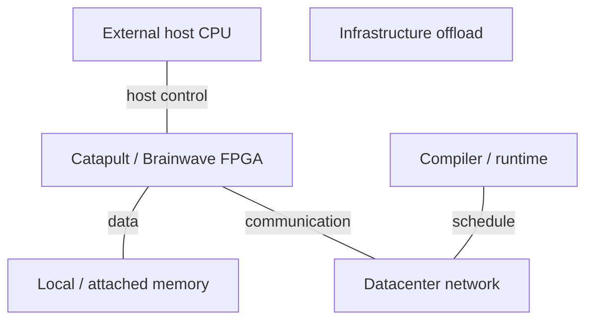
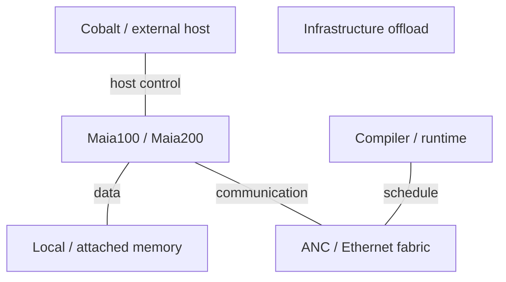

# Microsoft AI Infrastructure Architecture Evolution

2015-2026 | 2026-09-28

## 01 Scope and architectural synthesis

This report follows Microsoft-owned cloud silicon from the FPGA era to Cobalt CPUs, Maia accelerators and Azure Boost infrastructure offload, covering 2015-28 September 2026 with a 2014 Catapult baseline. AMD, Intel and NVIDIA systems in Azure provide deployment context; they are not relabelled Microsoft silicon. Xbox and client devices are outside the deep scope. Internal production, customer preview and public VM general availability are distinct milestones.

The continuity is explicit control over data movement. Catapult moved services into a reconfigurable network path; Maia exposes a hierarchy of scratchpads, DMA and synchronization; Boost removes infrastructure work from host CPUs. Cobalt supplies the general-purpose execution plane. These are complementary machines with different programming contracts. Their joint value depends on resource isolation and utilization across the service, rather than the largest accelerator FLOPS number.

## 02 The FPGA foundation: Catapult and Brainwave

The ISCA 2014 Catapult paper is a pre-period baseline for accelerating Bing ranking with distributed FPGAs. The MICRO 2016 configurable-cloud work shifts the emphasis toward a datacenter-wide reconfigurable fabric integrated with networking. Brainwave, described at ISCA 2018, maps real-time neural inference onto FPGAs. The progression matters: an accelerator becomes a service and network resource, not merely a peripheral attached to one application process.

Reconfigurability lets the operator move functions as protocols and models change, but consumes area and energy compared with dedicated logic. A later ASIC can harden stable operations while retaining programmable control. This is an architectural lineage, not evidence that Maia reuses a particular Catapult RTL block or that every Boost generation is an FPGA. Research prototypes, production infrastructure and public VM products must remain separate in the timeline.

## 03 Cobalt: general-purpose cloud compute

Cobalt 100 establishes Microsoft’s own Arm server-CPU line with 128 Neoverse N2 cores. Its VMs became generally available in October 2024. The relevant comparison is a matched VM and service workload, including memory, storage and network limits; a processor core count alone does not describe the customer-visible machine.

Cobalt 200 moves to Neoverse CSS V3 and a chiplet implementation. Microsoft discloses 132 active cores, 3 MB L2 per core and 192 MB shared system cache. The June 2026 VM milestone is early-access preview, with VM sizes up to 128 vCPUs. The difference between 132 physical active cores and 128 customer vCPUs should be preserved. Larger caches target the cost of bringing data to the core; advertised service gains are not a universal IPC multiplier.

### CPU generations

| Generation / reference SKU | Codename | GA | Status | Core µarch | Cores / threads | Process per die | Dies / packaging | L2 per core | L3 / domain | Memory: channels; rate; GB/s | Sockets / links | PCIe / CXL | TDP | Vector / matrix ISA |
| --- | --- | --- | --- | --- | --- | --- | --- | --- | --- | --- | --- | --- | --- | --- |
| Cobalt 100 | n/d | 2024-10 | Shipping / available | Neoverse N2 | 128 / 128 | n/d | n/d | n/d | n/d | DDR5; channels/rate n/d | n/d | n/d | n/d | Armv9 |
| Cobalt 200 | n/d | 2026-06 preview | Early-access preview | Neoverse CSS V3 | 132 / 132 | 3 nm | Chiplets; count n/d | 3 MB | 192 MB / SoC | n/d | n/d | n/d | n/d | Armv9 |

## 04 Maia 100: building a software-defined machine

Hot Chips 2024 supplies the implementation picture missing from the original launch: an approximately 820 mm² N5 die, CoWoS-S packaging, 64 GB HBM2e at 1.8 TB/s and roughly 500 MB of local SRAM. Sixteen clusters each contain four tiles, with tensor, vector, data-movement and control functions. The slide specification separates a 700 W design target from 500 W provisioned power. Those are not interchangeable operating points.

The compiler orchestrates asynchronous engines using semaphores. Triton offers a higher-level route, while the Maia API exposes explicit placement and scheduling. This trades automatic cache management for control over reuse and overlap. A good schedule can fuse elementwise work with matrix operations and communication; a poor schedule can stall a large tensor engine despite abundant peak compute. Six- and nine-bit tensor formats in the slides must not be renamed FP4 and FP8.

## 05 Maia 200: dataflow extends through the network

The 2026 technical paper makes Maia 200 a software-defined dataflow system rather than a matrix engine with an attached NIC. A monolithic 3 nm compute die uses six HBM3e stacks, 216 GB capacity and 7 TB/s bandwidth. Four clusters contain nine or ten tiles each. Separate data and control networks, specialized SRAM, DMA and synchronization engines let software describe when data is ready and where it must move. The published peak is 10,145 TFLOP/s FP4 and 5,072 TFLOP/s FP8 within a 750 W TDP.

Twenty-eight integrated 400 Gb/s controllers supply 1.4 TB/s in each direction. Twenty ports use fixed links and eight feed four switched planes. The described deployment design point is 6,144 chips with oversubscription in the external fabric; it is not a fully connected 6,144-chip memory domain. ATLv2 provides transport, encryption, selective retransmission and congestion control. Remote SRAM access uses explicit send/receive and synchronization, not CPU-style transparent cache coherence.

Architectural interpretation: integrating communication into the dataflow contract can reduce launch and host-interface overhead, but transfers scheduling responsibility into the compiler and runtime. The practical test is whether compute, memory traffic and collectives overlap for the actual model shape. More low-precision arithmetic increases the reuse required to remain compute-bound; it does not remove the HBM or network roofline.

### Accelerator generations

| Product | Architecture | GA / milestone | Status | Process | Dies / packaging | Compute units | Dense BF16 | Dense FP8 | Dense FP6 / FP4 | FP64 vector / matrix | Memory: type; stacks; GB; TB/s | LLC / SRAM | Scale-up: links; GB/s per direction; domain | Host link | Power / cooling | Form factor |
| --- | --- | --- | --- | --- | --- | --- | --- | --- | --- | --- | --- | --- | --- | --- | --- | --- |
| Maia 100 | Software-defined dataflow | 2023 launch; HC2024 | Historical shipping | TSMC N5 | 1 logic die; CoWoS-S | 64 tiles / 16 clusters | 800 TFLOP/s | n/a; 9-bit: 1.5 POPS | 6-bit: 3 POPS; FP4 n/d | n/d | HBM2e; stacks n/d; 64 GB; 1.8 TB/s | ~500 MB | 12×400G; 600 GB/s one-way; domain n/d | PCIe5 ×8 (spec table) | 700 W design / 500 W provision | Azure module |
| Maia 200 | SDLA | 2026 deployment | Shipping / available | 3 nm | 1 logic die; 75×75 mm package | 4 clusters; 9-10 tiles/cluster | n/d | 5072 TFLOP/s | FP4: 10145 TFLOP/s | n/d | HBM3e; 6; 216 GB; 7 TB/s | 272 MB | 28×400G; 1400 GB/s one-way; topology-specific | PCIe6 ×8 | 750 W; liquid | Azure module |

The Maia 100 slide block diagram contains an older PCIe label, while its specification table states PCIe5 ×8; this report uses the specification table and preserves the discrepancy. Maia 200’s paper uses both TB/s and TiB/s wording for memory bandwidth; the main specification and vendor architecture disclosure use 7 TB/s, the basis for calculations here. No measured application efficiency is inferred from TDP and peak FLOPS.

## 06 Azure Boost, AI NICs and security

Azure Boost is an infrastructure system; the Azure Boost DPU is a silicon component in that evolution. The 2024 DPU announcement and the 2026 general availability of a newer Boost generation describe hardening more storage and networking functions into dedicated hardware. MANA supplies the guest-facing network interface. Up to 400 Gb/s is a supported platform/VM ceiling, not evidence that every VM receives that rate. Cerberus anchors the hardware trust boundary.

### Infrastructure and integrated NICs

| Product | GA / milestone | Status | Class | Ports × speed | SerDes | Host interface | Programmable engine | Embedded CPU | On-card memory | Transport / RDMA | Congestion control | Key offloads | Power |
| --- | --- | --- | --- | --- | --- | --- | --- | --- | --- | --- | --- | --- | --- |
| Azure Boost / DPU | 2024 announcement; 2026 system GA | Shipping / available | Infrastructure offload | Up to 400 Gb/s platform | n/d | n/d | Dedicated offload logic | n/d | n/d | MANA / RDMA | n/d | Network; storage; virtualization; trust | n/d |
| Maia 200 ANC | 2026 | Shipping / available | Integrated AI NIC | 28×400 Gb/s | n/d | On-chip NoC | DMA / ATLv2 | n/a | Shared chip memories | ATLv2 / Ethernet | Window-based; ECMP / entropy | Remote memory; encryption; retransmit | Included in SoC TDP |

### Interconnect hierarchy

| Interconnect | Year / generation | Lane rate | Lanes / link | GB/s per link per direction | Links / device | Topology | Domain limit | Coherence / semantics |
| --- | --- | --- | --- | --- | --- | --- | --- | --- |
| Maia100 Ethernet | 2024 | 400 Gb/s port | n/d | 50 | 12 | Direct + switched | n/d | Explicit transfer |
| Maia200 fixed links | 2026 | 400 Gb/s port | n/d | 50 | 20 | Tray fixed links | 4 chips/tray | Explicit SDLA transfer |
| Maia200 switched links | 2026 | 400 Gb/s port | n/d | 50 | 8 | 4 planes; 2 tiers | 6144 design point | Explicit transfer; not coherent |

## 07 Systems and programming stack

### 2015-2018 system roles

Functional relationships; not a claim that every Maia host is Cobalt.

### 2024-2026 system roles

Functional relationships; not a claim that every Maia host is Cobalt.

### System scope

| Platform | Year / milestone | CPU / accelerator count | Scale-up domain | Scale-out per accelerator | Rack power | Cooling |
| --- | --- | --- | --- | --- | --- | --- |
| Maia100 Azure | 2023-2024 | n/d | Topology-specific | n/d | n/d | Liquid |
| Maia200 deployment design | 2026 | 4 chips/tray; up to 6144 | Fixed links + switched planes | 8×400G = 400 GB/s nominal | n/d | Liquid |
| Cobalt200 VMs | 2026 preview | Up to 128 vCPUs | n/a | VM-specific | n/d | n/d |

### Software contracts

| Layer | Component | Function | Boundary |
| --- | --- | --- | --- |
| Host | Arm Linux / Azure VMs | General-purpose services | VM limits differ from SoC |
| Accelerator | PyTorch / Triton / Maia API | Graph, kernels, placement | Compiler-managed scratchpads |
| Communication | Maia collectives / ATLv2 | Collectives and transport | Explicit remote data movement |
| Infrastructure | MANA / Boost / Cerberus | Networking, storage, trust | Platform and guest drivers |

## 08 Normalized balance and trends

### Derived metrics

| Metric | Calculation | Meaning |
| --- | --- | --- |
| Cobalt200 L3/core | 192/132 = 1.455 MB | Shared capacity / active core |
| Maia100 HBM/BF16 | 1.8e12/800e12 = 0.00225 B/FLOP | Dense peak balance |
| Maia100 capacity/BF16 | 64e9/800e12 = 8.0e-5 B·s/FLOP | Capacity normalized by peak |
| Maia200 HBM/FP8 | 7e12/5072e12 = 0.00138 B/FLOP | Different format from row above |
| Maia200 capacity/FP8 | 216e9/5072e12 = 4.26e-5 B·s/FLOP | Per chip; decimal bytes |
| Maia200 network/HBM | 1.4/7 = 0.20 | All ports one-way; not all external |
| Maia200 FP8/TDP | 5072/750 = 6.763 TFLOP/s/W | Peak/TDP proxy; not measured efficiency |
| Cobalt DDR bandwidth/core | n/d | Matched memory-controller data absent |

The Maia transition increases HBM capacity by 3.375× and bandwidth by 3.89×, while total integrated network bandwidth grows 2.33×. It also changes numerical formats and the on-chip memory organization, so a single compute-growth ratio would hide important differences. For deployment decisions, measure latency under realistic batching, scratchpad occupancy, communication overlap and failure recovery. These expose whether the custom architecture improves a service rather than only a kernel.

## 09 Conference-to-product index

### Primary disclosure map

| Venue | Year | Paper / talk / disclosure | Presenter / authors | Product | Evidence type | Source |
| --- | --- | --- | --- | --- | --- | --- |
| ISCA | 2014 | Catapult | Putnam et al. | FPGA infrastructure | Pre-period research baseline | C04 |
| MICRO | 2016 | A Configurable Cloud | Microsoft Research | Catapult | Architecture / deployment | P03 |
| ISCA | 2018 | Brainwave | Microsoft Research | FPGA inference | Architecture paper | C05 |
| Hot Chips | 2024 | Inside Maia100 | Sherry Xu; Chandru Ramakrishnan | Maia100 | Full technical slides | C06 |
| Hot Chips | 2026 | Maia200 | Microsoft | Maia200 | Program plus companion technical paper | C03 C01 |
| Ignite / Build | 2023-2026 | Cobalt / Maia / Boost | Microsoft | Cloud portfolio | Launch and availability | E03 E02 E05 E06 |

ISCA and MICRO establish the FPGA lineage; Hot Chips supplies the Maia block and implementation views. ISSCC2026 paper 17.4 establishes an additional Maia implementation disclosure; the official program does not specify a generation suffix. This edition does not establish a Cobalt/Maia product-specific HPCA or ASPLOS paper. A conference program proves a presentation exists; detailed specifications here come from the slides, technical paper and product documentation. The main remaining gaps are complete Cobalt memory/PCIe specifications, matched Maia operating points and SKU-level Boost implementation details.

### ISSCC implementation disclosure

| Venue | Year | Paper / talk / disclosure | Presenter / authors | Product | Evidence type | Source |
| --- | --- | --- | --- | --- | --- | --- |
| ISSCC | 2026 | 17.4 MAIA: A Reticle-Scale AI Accelerator | S. Xu et al. | Maia; generation suffix not in program | Official program / published paper record; full digest not accessed | C07 |

The ISSCC record establishes a circuit/implementation disclosure alongside the Hot Chips architectural chain. Because the full digest was not accessible in this review, its title is not used to assign undisclosed clocking, voltage-regulator or SRAM-circuit details to Maia100 or Maia200. The full Hot Chips slides and the Maia200 technical paper remain the quantitative implementation sources.

## 10 Naming crosswalk

### Products and roles

| Name | Role | Do not conflate with |
| --- | --- | --- |
| Cobalt | General-purpose host CPU | Maia |
| Maia / ANC | AI accelerator / integrated network controller | Boost DPU |
| Azure Boost | Infrastructure system including specialized hardware | One fixed chip generation |
| MANA | Microsoft Azure Network Adapter | Maia backend fabric |

## Source map

01 Scope and architectural synthesis — C01, C04, C06, E02, E03, P03, P04

02 The FPGA foundation: Catapult and Brainwave — C04, C05, E06, P03

03 Cobalt: general-purpose cloud compute — E02, E07, E08, P01

04 Maia 100: building a software-defined machine — C06

05 Maia 200: dataflow extends through the network — C01, C06, P02

06 Azure Boost, AI NICs and security — C01, C06, E05, E06, P04

07 Systems and programming stack — C01, C06, E02, E06, E07, P04

08 Normalized balance and trends — C01, C06, P01

09 Conference-to-product index — C01, C03, C04, C05, C06, C07, E02, E03, E05, E06, P01, P03, P04

10 Naming crosswalk — C01, E02, E06, P04

## References

### Product and technical documentation

[P01] Cobalt200 architecture announcement. [https://techcommunity.microsoft.com/blog/AzureInfrastructureBlog/announcing-cobalt-200-azure%E2%80%99s-next-cloud-native-cpu/4469807](https://techcommunity.microsoft.com/blog/AzureInfrastructureBlog/announcing-cobalt-200-azure%E2%80%99s-next-cloud-native-cpu/4469807). Indexed record or searchable official page; product details cross-checked with the associated technical document.

[P02] Maia200 architecture deep dive. [https://techcommunity.microsoft.com/blog/azureinfrastructureblog/deep-dive-into-the-maia-200-architecture/4489312/](https://techcommunity.microsoft.com/blog/azureinfrastructureblog/deep-dive-into-the-maia-200-architecture/4489312/). Indexed record or searchable official page; product details cross-checked with the associated technical document.

[P03] Catapult publications and MICRO2016. [https://www.microsoft.com/en-us/research/project/project-catapult/publications/](https://www.microsoft.com/en-us/research/project/project-catapult/publications/). Official indexed record or related announcement; full document download unavailable.

[P04] Azure Boost overview. [https://learn.microsoft.com/en-us/azure/azure-boost/overview](https://learn.microsoft.com/en-us/azure/azure-boost/overview). Primary source; accessed by 2026-09-28

### Conference records and implementation disclosures

[C01] Maia200: A Software Defined Dataflow System, 2026. [https://arxiv.org/pdf/2608.24664](https://arxiv.org/pdf/2608.24664). Primary source; accessed by 2026-09-28

[C03] Hot Chips2026 program, Maia200. [https://hc2026.hotchips.org/program/conference/](https://hc2026.hotchips.org/program/conference/). Official indexed record or related announcement; full document download unavailable.

[C04] Catapult ISCA2014. [https://www.microsoft.com/en-us/research/wp-content/uploads/2016/02/Catapult_ISCA_2014.pdf](https://www.microsoft.com/en-us/research/wp-content/uploads/2016/02/Catapult_ISCA_2014.pdf). Official indexed record or related announcement; full document download unavailable.

[C05] Brainwave ISCA2018. [https://www.microsoft.com/en-us/research/uploads/prod/2018/06/ISCA18-Brainwave-CameraReady.pdf](https://www.microsoft.com/en-us/research/uploads/prod/2018/06/ISCA18-Brainwave-CameraReady.pdf). Official indexed record or related announcement; full document download unavailable.

[C06] Inside Maia100, Hot Chips2024 slides. [https://hc2024.hotchips.org/assets/program/conference/day2/81_HC2024.Microsoft.Xu.Ramakrishnan.final.v2.pdf](https://hc2024.hotchips.org/assets/program/conference/day2/81_HC2024.Microsoft.Xu.Ramakrishnan.final.v2.pdf). Primary source; accessed by 2026-09-28

[C07] ISSCC2026 advance program; 17.4 MAIA: A Reticle-Scale AI Accelerator. [https://submissions.mirasmart.com/ISSCC2026/PDF/ISSCC2026AdvanceProgram.pdf](https://submissions.mirasmart.com/ISSCC2026/PDF/ISSCC2026AdvanceProgram.pdf). Official conference program or press material; not the full paper.

### Launches, ecosystem and deployment

[E02] Cobalt200 early access preview, June2026. [https://azure.microsoft.com/en-us/blog/new-azure-cobalt-200-vms-deliver-50-performance-improvement-fully-optimized-for-modern-agentic-ai-workloads/](https://azure.microsoft.com/en-us/blog/new-azure-cobalt-200-vms-deliver-50-performance-improvement-fully-optimized-for-modern-agentic-ai-workloads/). Indexed record or searchable official page; product details cross-checked with the associated technical document.

[E03] Ignite2023 Cobalt Maia Boost. [https://news.microsoft.com/source/features/ai/in-house-chips-silicon-to-service-to-meet-ai-demand/](https://news.microsoft.com/source/features/ai/in-house-chips-silicon-to-service-to-meet-ai-demand/). Official indexed record or related announcement; full document download unavailable.

[E05] Azure Boost DPU, Ignite2024. [https://techcommunity.microsoft.com/blog/azureinfrastructureblog/enhancing-infrastructure-efficiency-with-azure-boost-dpu/4298901](https://techcommunity.microsoft.com/blog/azureinfrastructureblog/enhancing-infrastructure-efficiency-with-azure-boost-dpu/4298901). Indexed record or searchable official page; product details cross-checked with the associated technical document.

[E06] Next generation Azure Boost GA, 2026. [https://techcommunity.microsoft.com/blog/azurecompute/announcing-the-general-availability-of-the-next-generation-of-azure-boost/4519136](https://techcommunity.microsoft.com/blog/azurecompute/announcing-the-general-availability-of-the-next-generation-of-azure-boost/4519136). Indexed record or searchable official page; product details cross-checked with the associated technical document.

[E07] Cobalt100 VM general availability, October2024. [https://azure.microsoft.com/en-us/blog/azure-cobalt-100-based-virtual-machines-are-now-generally-available/](https://azure.microsoft.com/en-us/blog/azure-cobalt-100-based-virtual-machines-are-now-generally-available/). Indexed record or searchable official page; product details cross-checked with the associated technical document.

[E08] Arm earnings disclosure: Cobalt N2 and V3. [https://investors.arm.com/static-files/941fd4cb-0027-4e81-9541-66dcd954a14a](https://investors.arm.com/static-files/941fd4cb-0027-4e81-9541-66dcd954a14a). Primary source; accessed by 2026-09-28
