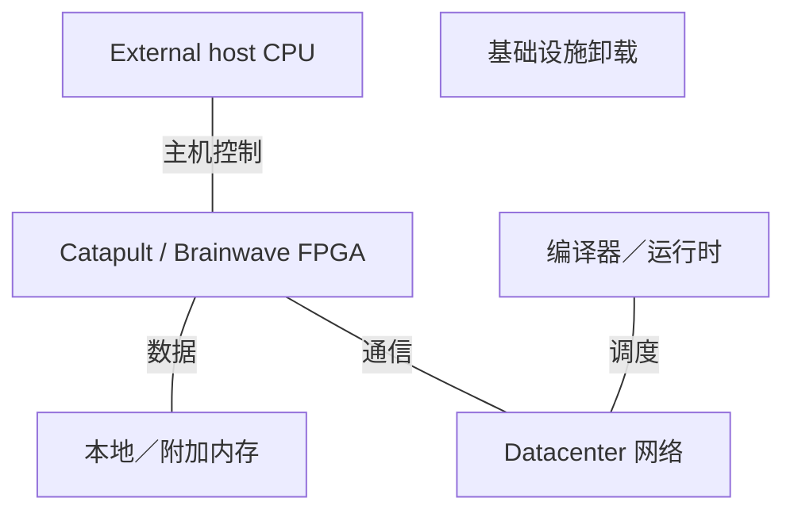
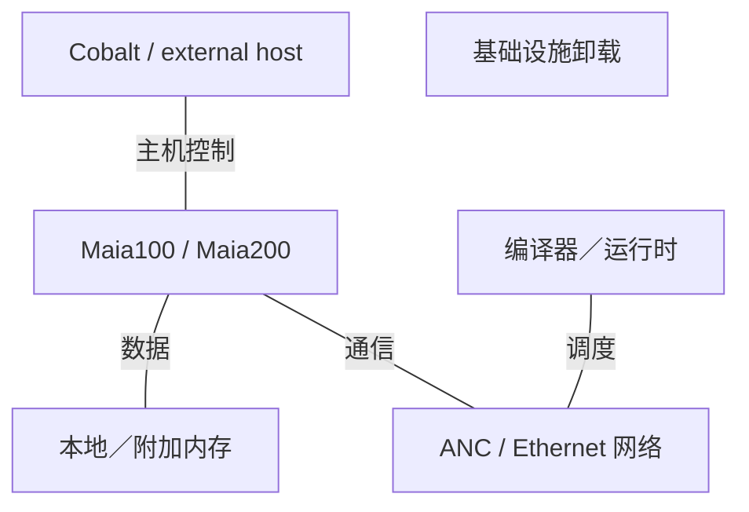

# Microsoft AI 基础设施架构演进

2015-2026 | 2026-09-28

## 01 范围与架构主线

本报告沿微软自研云端芯片，从 FPGA 时代追踪至 Cobalt CPU、Maia 加速器及 Azure Boost 基础设施卸载，覆盖 2015 年至 2026 年 9 月 28 日，并以 2014 年 Catapult 为基线。Azure 中的 AMD、Intel 和 NVIDIA 系统提供部署背景，不改称微软芯片。Xbox 与客户端设备不作深入覆盖。内部生产部署、客户预览与公共虚拟机正式商用分别记录。

贯穿各代的是对数据搬移的显式控制。Catapult 把服务放入可重构网络路径；Maia 暴露分层暂存器、DMA 和同步机制；Boost 把基础设施工作从主机 CPU 卸载。Cobalt 提供通用执行平面。这些互补机器具有不同编程契约，整体价值取决于服务层面的资源隔离与利用率，而非最大的加速器 FLOPS 数字。

## 02 FPGA 基础：Catapult 与 Brainwave

ISCA 2014 的 Catapult 论文是时期之前的基线，使用分布式 FPGA 加速 Bing 排序。MICRO 2016 的可配置云工作，把重点移向与网络集成的数据中心级可重构网络。ISCA 2018 披露的 Brainwave 把实时神经网络推理映射到 FPGA。该演进的重要之处是：加速器成为服务和网络资源，而不只是挂在一个应用进程旁的外设。

可重构性允许运营方随协议和模型变化迁移功能，但相比专用逻辑会付出面积与能耗成本。后续 ASIC 可以固化稳定操作，同时保留可编程控制。这是架构思路的延续，不证明 Maia 复用某个 Catapult RTL 模块，也不意味着每一代 Boost 都是 FPGA。研究原型、生产基础设施与公共虚拟机产品在时间线上分别处理。

## 03 Cobalt：通用云计算

Cobalt 100 以 128 个 Neoverse N2 核心建立微软自有 Arm 服务器 CPU 产品线，其虚拟机于 2024 年 10 月正式商用。有效比较应匹配虚拟机配置及服务负载，包括内存、存储和网络限制；处理器核心数本身不能描述客户可见的机器。

Cobalt 200 转向 Neoverse CSS V3 和小芯片实现。微软披露 132 个启用核心、每核 3 MB L2 及 192 MB 共享系统缓存。2026 年 6 月的虚拟机里程碑为早期访问预览，虚拟机规格最高 128 vCPU。132 个物理启用核心与 128 个客户 vCPU 的区别应保留。更大缓存针对数据送至核心的成本，厂商公布的服务收益不代表通用 IPC 倍增。

### CPU 代际

| 代际／参考 SKU | 代号 | 正式商用 | 状态 | 核心微架构 | 核心／线程 | 各裸片工艺 | 裸片／封装 | 每核 L2 | L3／共享域 | 内存：通道；速率；GB/s | 插槽／互联 | PCIe／CXL | TDP | 向量／矩阵 ISA |
| --- | --- | --- | --- | --- | --- | --- | --- | --- | --- | --- | --- | --- | --- | --- |
| Cobalt 100 | n/d | 2024-10 | 已商用／可获取 | Neoverse N2 | 128 / 128 | n/d | n/d | n/d | n/d | DDR5; 通道/速率 n/d | n/d | n/d | n/d | Armv9 |
| Cobalt 200 | n/d | 2026-06 预览 | 早期访问预览 | Neoverse CSS V3 | 132 / 132 | 3 nm | 小芯片；数量 n/d | 3 MB | 192 MB / SoC | n/d | n/d | n/d | n/d | Armv9 |

## 04 Maia 100：建立软件定义机器

Hot Chips 2024 补上最初发布所缺的实现细节：约 820 mm² 的 N5 裸片、CoWoS-S 封装、64 GB HBM2e、1.8 TB/s 带宽，以及约 500 MB 本地 SRAM。十六个集群各含四个计算块，分别提供张量、向量、数据搬移与控制功能。幻灯片规格区分 700 W 设计目标与 500 W 配置功耗，两者不能作为可互换工作点。

编译器使用信号量协调异步引擎。Triton 提供较高层路径，Maia API 则显式暴露放置与调度。这以自动缓存管理换取对复用和重叠执行的控制。良好调度可以融合逐元素运算、矩阵计算和通信；不良调度则可能让大规模张量引擎在峰值算力充裕时仍然停顿。幻灯片中的六位、九位张量格式不能改称 FP4 和 FP8。

## 05 Maia 200：数据流延伸至网络

2026 年技术论文将 Maia 200 描述为软件定义数据流系统，而不是外接网卡的矩阵引擎。单片 3 nm 计算裸片配六堆栈 HBM3e，容量 216 GB、带宽 7 TB/s。四个集群各含九或十个计算块。分离的数据与控制网络、专用 SRAM、DMA 和同步引擎，让软件描述数据何时就绪及其目标位置。公布峰值为 FP4 10,145 TFLOP/s、FP8 5,072 TFLOP/s，TDP 为 750 W。

二十八个集成 400 Gb/s 控制器提供每方向 1.4 TB/s。二十个端口连接固定链路，八个端口接入四个交换平面。论文描述的部署设计点为 6,144 芯片，外部网络存在超额订阅，并非 6,144 芯片全互联内存域。ATLv2 提供传输、加密、选择性重传与拥塞控制。远端 SRAM 访问使用显式发送／接收及同步，不是 CPU 式透明缓存一致性。

架构解读：把通信纳入数据流契约，可以降低启动与主机接口开销，但也把调度责任交给编译器及运行时。实际检验是计算、存储流量与集合通信能否在真实模型形状下重叠。更多低精度算术提高了保持计算受限所需的复用程度，并未消除 HBM 或网络上限。

### 加速器代际

| 产品 | 架构 | 商用／里程碑 | 状态 | 工艺 | 裸片／封装 | 计算单元 | 稠密 BF16 | 稠密 FP8 | 稠密 FP6／FP4 | FP64 向量／矩阵 | 内存：类型；堆栈；GB；TB/s | 末级缓存／SRAM | 纵向扩展：链路；单向 GB/s；域 | 主机连接 | 功耗／散热 | 形态 |
| --- | --- | --- | --- | --- | --- | --- | --- | --- | --- | --- | --- | --- | --- | --- | --- | --- |
| Maia 100 | 软件定义数据流 | 2023 发布; HC2024 | 历史已商用 | TSMC N5 | 1 逻辑裸片; CoWoS-S | 64 计算块 / 16 集群 | 800 TFLOP/s | n/a; 9-bit: 1.5 POPS | 6-bit: 3 POPS; FP4 n/d | n/d | HBM2e; 堆栈 n/d; 64 GB; 1.8 TB/s | ~500 MB | 12×400G; 600 GB/s 单向; 域 n/d | PCIe5 ×8 (规格表) | 700 W 设计／ 500 W 配置 | Azure 模块 |
| Maia 200 | SDLA | 2026 部署 | 已商用／可获取 | 3 nm | 1 逻辑裸片; 75×75 mm package | 4 集群; 9-10 计算块/集群 | n/d | 5072 TFLOP/s | FP4: 10145 TFLOP/s | n/d | HBM3e; 6; 216 GB; 7 TB/s | 272 MB | 28×400G; 1400 GB/s 单向; topology-specific | PCIe6 ×8 | 750 W; 液冷 | Azure 模块 |

Maia 100 幻灯片框图包含较旧 PCIe 标注，而规格表写 PCIe5 ×8；本报告采用规格表，并保留该差异。Maia 200 论文对内存带宽同时出现 TB/s 与 TiB/s 表述；主要规格及厂商架构披露采用 7 TB/s，本报告据此计算。不根据 TDP 与峰值 FLOPS 推定实测应用效率。

## 06 Azure Boost、AI NIC 与安全

Azure Boost 是基础设施系统，Azure Boost DPU 是其演进中的芯片组件。2024 年 DPU 发布及 2026 年新一代 Boost 正式商用，描述将更多存储与网络功能固化到专用硬件。MANA 提供客户机可见网络接口。最高 400 Gb/s 是支持的平台／虚拟机上限，不证明每个虚拟机都获得该速率。Cerberus 提供硬件信任边界。

### 基础设施与集成 NIC

| 产品 | 商用／里程碑 | 状态 | 类别 | 端口×速率 | SerDes | 主机接口 | 可编程引擎 | 嵌入式 CPU | 板载内存 | 传输／RDMA | 拥塞控制 | 主要卸载 | 功耗 |
| --- | --- | --- | --- | --- | --- | --- | --- | --- | --- | --- | --- | --- | --- |
| Azure Boost / DPU | 2024 发布; 2026 系统正式商用 | 已商用／可获取 | 基础设施卸载 | 最高 400 Gb/s platform | n/d | n/d | 专用卸载逻辑 | n/d | n/d | MANA / RDMA | n/d | 网络；存储；虚拟化；信任 | n/d |
| Maia 200 ANC | 2026 | 已商用／可获取 | 集成 AI NIC | 28×400 Gb/s | n/d | 片上 NoC | DMA / ATLv2 | n/a | 共享芯片存储 | ATLv2 / Ethernet | Window-based; ECMP / entropy | 远端存储；加密；重传 | 包含在 SoC TDP 内 |

### 互联层次

| 互联 | 年份／代际 | 通道速率 | 每链路通道 | 每链路单向 GB/s | 每设备链路 | 拓扑 | 域规模 | 一致性／语义 |
| --- | --- | --- | --- | --- | --- | --- | --- | --- |
| Maia100 Ethernet | 2024 | 400 Gb/s 端口 | n/d | 50 | 12 | 直连＋交换 | n/d | 显式传输 |
| Maia200 固定 链路 | 2026 | 400 Gb/s 端口 | n/d | 50 | 20 | 托盘固定链路 | 4 芯片/tray | 显式 SDLA 传输 |
| Maia200 交换式 链路 | 2026 | 400 Gb/s 端口 | n/d | 50 | 8 | 4 planes; 2 tiers | 6144 设计点 | 显式传输；非一致性 |

## 07 系统与编程栈

### 2015-2018 系统角色

功能关系图；不意味着每台 Maia 主机均采用 Cobalt。

### 2024-2026 系统角色

功能关系图；不意味着每台 Maia 主机均采用 Cobalt。

### 系统范围

| 平台 | 年份／里程碑 | CPU／加速器数量 | 纵向扩展域 | 每加速器横向带宽 | 机架功耗 | 散热 |
| --- | --- | --- | --- | --- | --- | --- |
| Maia100 Azure | 2023-2024 | n/d | 依拓扑 | n/d | n/d | 液冷 |
| Maia200 部署 design | 2026 | 4 芯片/tray; 最高 6144 | 固定链路＋交换平面 | 8×400G = 400 GB/s 标称 | n/d | 液冷 |
| Cobalt200 VMs | 2026 预览 | 最高 128 vCPUs | n/a | VM-specific | n/d | n/d |

### 软件契约

| 层 | 组件 | 功能 | 边界 |
| --- | --- | --- | --- |
| 主机 | Arm Linux / Azure VMs | 通用服务 | VM 限额不同于 SoC |
| 加速器 | PyTorch / Triton / Maia API | 图、算子、放置 | 编译器管理暂存器 |
| 通信 | Maia collectives / ATLv2 | 集合通信与传输 | 显式远端数据搬移 |
| 基础设施 | MANA / Boost / Cerberus | 网络、存储、信任 | 平台与客户机驱动 |

## 08 归一化平衡与趋势

### 推导指标

| 指标 | 计算 | 含义 |
| --- | --- | --- |
| Cobalt200 L3/核心 | 192/132 = 1.455 MB | 共享容量／启用核心 |
| Maia100 HBM/BF16 | 1.8e12/800e12 = 0.00225 B/FLOP | 稠密峰值平衡 |
| Maia100 容量/BF16 | 64e9/800e12 = 8.0e-5 B·s/FLOP | 容量除以峰值 |
| Maia200 HBM/FP8 | 7e12/5072e12 = 0.00138 B/FLOP | 与上行格式不同 |
| Maia200 容量/FP8 | 216e9/5072e12 = 4.26e-5 B·s/FLOP | 每芯片；十进制字节 |
| Maia200 网络/HBM | 1.4/7 = 0.20 | 全部端口单向；并非全为外部链路 |
| Maia200 FP8/TDP | 5072/750 = 6.763 TFLOP/s/W | 峰值／TDP 代理量；非实测效率 |
| Cobalt DDR 带宽/核心 | n/d | 缺匹配内存控制器数据 |

Maia 换代使 HBM 容量增加至 3.375 倍、带宽增至 3.89 倍，集成网络总带宽增至 2.33 倍。同时数值格式与片上存储组织也改变，因此单一算力增长比会掩盖重要差异。部署决策应测量真实批处理下的延迟、暂存器占用、通信重叠及故障恢复，以判断定制架构提升的是完整服务还是仅某个算子。

## 09 会议与产品索引

### 一手披露映射

| 会议／活动 | 年份 | 论文／演讲／披露 | 报告人／作者 | 产品 | 证据类型 | 来源 |
| --- | --- | --- | --- | --- | --- | --- |
| ISCA | 2014 | Catapult | Putnam et al. | FPGA infrastructure | 时期前研究基线 | C04 |
| MICRO | 2016 | A 可配置 Cloud | Microsoft 研究 | Catapult | 架构／部署 | P03 |
| ISCA | 2018 | Brainwave | Microsoft 研究 | FPGA inference | 架构论文 | C05 |
| Hot Chips | 2024 | Inside Maia100 | Sherry Xu; Chandru Ramakrishnan | Maia100 | 完整技术幻灯片 | C06 |
| Hot Chips | 2026 | Maia200 | Microsoft | Maia200 | 议程与配套技术论文 | C03 C01 |
| Ignite / Build | 2023-2026 | Cobalt / Maia / Boost | Microsoft | 云端产品组合 | 发布与可用性 | E03 E02 E05 E06 |

ISCA 与 MICRO 建立 FPGA 谱系，Hot Chips 提供 Maia 的模块及实现视图。ISSCC2026 论文 17.4 增加了 Maia 实现披露；官方议程未注明代际后缀。本版未建立 Cobalt／Maia 对应的产品级 HPCA 或 ASPLOS 论文。会议议程证明演讲存在；本文详细规格来自幻灯片、技术论文及产品文档。主要缺口是完整 Cobalt 内存／PCIe 规格、匹配的 Maia 工作点及 SKU 级 Boost 实现细节。

### ISSCC 实现披露

| 会议／活动 | 年份 | 论文／演讲／披露 | 报告人／作者 | 产品 | 证据类型 | 来源 |
| --- | --- | --- | --- | --- | --- | --- |
| ISSCC | 2026 | 17.4 MAIA: A Reticle-Scale AI Accelerator | S. Xu et al. | Maia; generation suffix not in program | 官方议程／已发表论文记录；未获取完整文集 | C07 |

ISSCC 记录在 Hot Chips 架构链之外，建立电路／实现披露入口。由于本次未获取完整文集，不能仅根据题目把未披露时钟、电压调节器或 SRAM 电路细节分配给 Maia100 或 Maia200。完整 Hot Chips 幻灯片与 Maia200 技术论文仍是定量实现依据。

## 10 命名对照

### 产品与角色

| 名称 | 角色 | 需区分 |
| --- | --- | --- |
| Cobalt | 通用主机 CPU | Maia |
| Maia / ANC | AI 加速器／集成网络控制器 | Boost DPU |
| Azure Boost | 含专用硬件的基础设施系统 | 单一固定芯片代际 |
| MANA | 微软 Azure 网络适配器 | Maia 后端网络 |

## 来源映射

01 范围与架构主线 — C01, C04, C06, E02, E03, P03, P04

02 FPGA 基础：Catapult 与 Brainwave — C04, C05, E06, P03

03 Cobalt：通用云计算 — E02, E07, E08, P01

04 Maia 100：建立软件定义机器 — C06

05 Maia 200：数据流延伸至网络 — C01, C06, P02

06 Azure Boost、AI NIC 与安全 — C01, C06, E05, E06, P04

07 系统与编程栈 — C01, C06, E02, E06, E07, P04

08 归一化平衡与趋势 — C01, C06, P01

09 会议与产品索引 — C01, C03, C04, C05, C06, C07, E02, E03, E05, E06, P01, P03, P04

10 命名对照 — C01, E02, E06, P04

## 参考资料

### 产品与技术文档

[P01] Cobalt200 architecture announcement. [https://techcommunity.microsoft.com/blog/AzureInfrastructureBlog/announcing-cobalt-200-azure%E2%80%99s-next-cloud-native-cpu/4469807](https://techcommunity.microsoft.com/blog/AzureInfrastructureBlog/announcing-cobalt-200-azure%E2%80%99s-next-cloud-native-cpu/4469807). 索引或可检索官方页面；产品细节同时参照对应技术文档。

[P02] Maia200 architecture deep dive. [https://techcommunity.microsoft.com/blog/azureinfrastructureblog/deep-dive-into-the-maia-200-architecture/4489312/](https://techcommunity.microsoft.com/blog/azureinfrastructureblog/deep-dive-into-the-maia-200-architecture/4489312/). 索引或可检索官方页面；产品细节同时参照对应技术文档。

[P03] Catapult publications and MICRO2016. [https://www.microsoft.com/en-us/research/project/project-catapult/publications/](https://www.microsoft.com/en-us/research/project/project-catapult/publications/). 官方索引或相关发布资料；完整文档未能下载。

[P04] Azure Boost overview. [https://learn.microsoft.com/en-us/azure/azure-boost/overview](https://learn.microsoft.com/en-us/azure/azure-boost/overview). 一手资料；访问截止 2026-09-28

### 会议记录与实现披露

[C01] Maia200: A Software Defined Dataflow System, 2026. [https://arxiv.org/pdf/2608.24664](https://arxiv.org/pdf/2608.24664). 一手资料；访问截止 2026-09-28

[C03] Hot Chips2026 program, Maia200. [https://hc2026.hotchips.org/program/conference/](https://hc2026.hotchips.org/program/conference/). 官方索引或相关发布资料；完整文档未能下载。

[C04] Catapult ISCA2014. [https://www.microsoft.com/en-us/research/wp-content/uploads/2016/02/Catapult_ISCA_2014.pdf](https://www.microsoft.com/en-us/research/wp-content/uploads/2016/02/Catapult_ISCA_2014.pdf). 官方索引或相关发布资料；完整文档未能下载。

[C05] Brainwave ISCA2018. [https://www.microsoft.com/en-us/research/uploads/prod/2018/06/ISCA18-Brainwave-CameraReady.pdf](https://www.microsoft.com/en-us/research/uploads/prod/2018/06/ISCA18-Brainwave-CameraReady.pdf). 官方索引或相关发布资料；完整文档未能下载。

[C06] Inside Maia100, Hot Chips2024 slides. [https://hc2024.hotchips.org/assets/program/conference/day2/81_HC2024.Microsoft.Xu.Ramakrishnan.final.v2.pdf](https://hc2024.hotchips.org/assets/program/conference/day2/81_HC2024.Microsoft.Xu.Ramakrishnan.final.v2.pdf). 一手资料；访问截止 2026-09-28

[C07] ISSCC2026 advance program; 17.4 MAIA: A Reticle-Scale AI Accelerator. [https://submissions.mirasmart.com/ISSCC2026/PDF/ISSCC2026AdvanceProgram.pdf](https://submissions.mirasmart.com/ISSCC2026/PDF/ISSCC2026AdvanceProgram.pdf). 官方会议议程或新闻资料；不是论文全文。

### 发布、生态与部署

[E02] Cobalt200 early access preview, June2026. [https://azure.microsoft.com/en-us/blog/new-azure-cobalt-200-vms-deliver-50-performance-improvement-fully-optimized-for-modern-agentic-ai-workloads/](https://azure.microsoft.com/en-us/blog/new-azure-cobalt-200-vms-deliver-50-performance-improvement-fully-optimized-for-modern-agentic-ai-workloads/). 索引或可检索官方页面；产品细节同时参照对应技术文档。

[E03] Ignite2023 Cobalt Maia Boost. [https://news.microsoft.com/source/features/ai/in-house-chips-silicon-to-service-to-meet-ai-demand/](https://news.microsoft.com/source/features/ai/in-house-chips-silicon-to-service-to-meet-ai-demand/). 官方索引或相关发布资料；完整文档未能下载。

[E05] Azure Boost DPU, Ignite2024. [https://techcommunity.microsoft.com/blog/azureinfrastructureblog/enhancing-infrastructure-efficiency-with-azure-boost-dpu/4298901](https://techcommunity.microsoft.com/blog/azureinfrastructureblog/enhancing-infrastructure-efficiency-with-azure-boost-dpu/4298901). 索引或可检索官方页面；产品细节同时参照对应技术文档。

[E06] Next generation Azure Boost GA, 2026. [https://techcommunity.microsoft.com/blog/azurecompute/announcing-the-general-availability-of-the-next-generation-of-azure-boost/4519136](https://techcommunity.microsoft.com/blog/azurecompute/announcing-the-general-availability-of-the-next-generation-of-azure-boost/4519136). 索引或可检索官方页面；产品细节同时参照对应技术文档。

[E07] Cobalt100 VM general availability, October2024. [https://azure.microsoft.com/en-us/blog/azure-cobalt-100-based-virtual-machines-are-now-generally-available/](https://azure.microsoft.com/en-us/blog/azure-cobalt-100-based-virtual-machines-are-now-generally-available/). 索引或可检索官方页面；产品细节同时参照对应技术文档。

[E08] Arm earnings disclosure: Cobalt N2 and V3. [https://investors.arm.com/static-files/941fd4cb-0027-4e81-9541-66dcd954a14a](https://investors.arm.com/static-files/941fd4cb-0027-4e81-9541-66dcd954a14a). 一手资料；访问截止 2026-09-28
