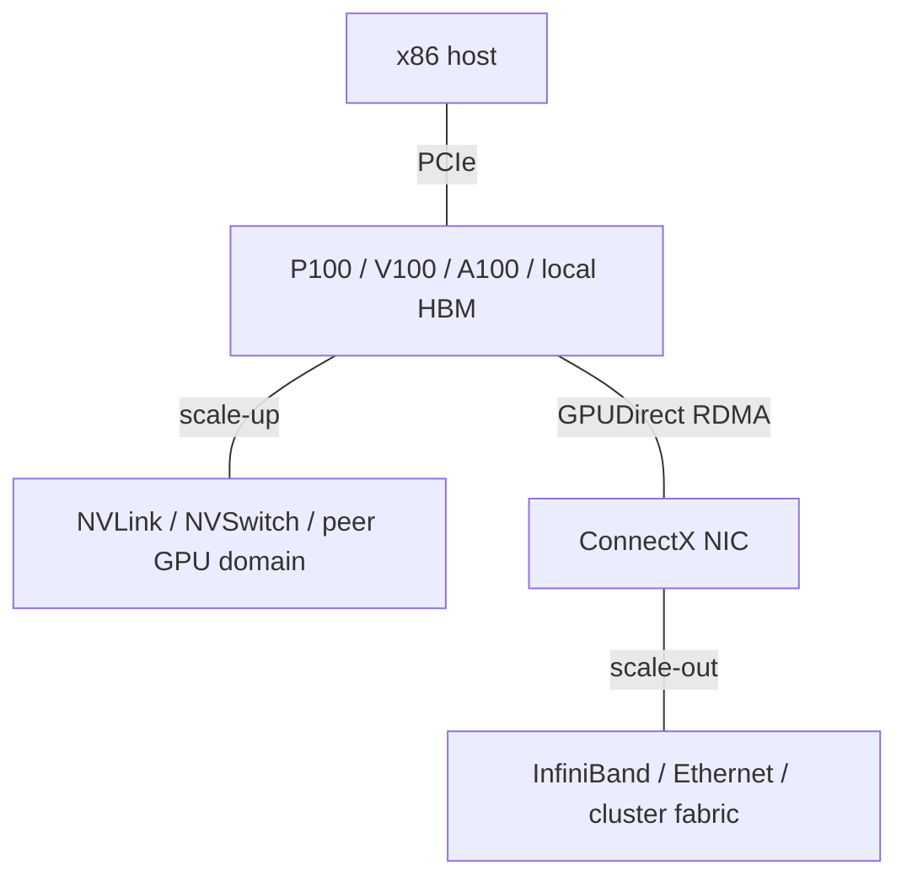
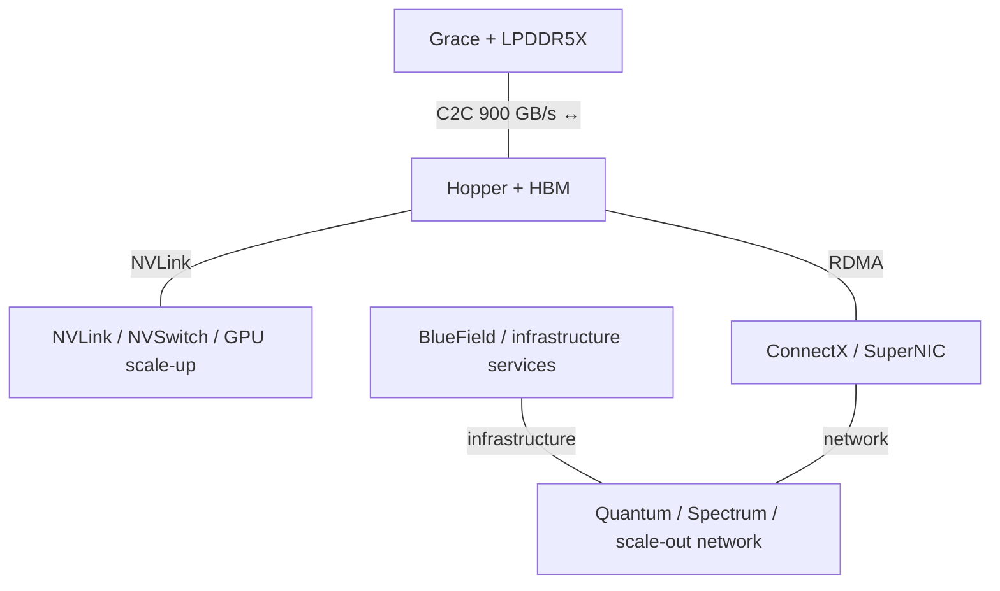
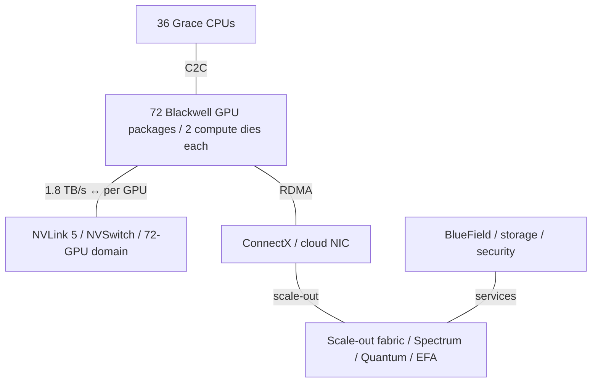
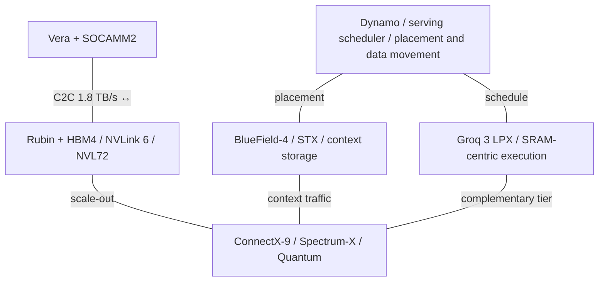

# NVIDIA AI Infrastructure Architecture Evolution

2015-2026 | 2026-09-28

## 01 Executive synthesis

NVIDIA’s decade-long transition is best understood as a change in the unit of architecture: from a PCIe accelerator, to an NVLink-connected server, to a coherent CPU-GPU module, and finally to a rack-scale compute and networking platform. Tensor Core arithmetic is one part of that transition. Memory capacity, data movement, synchronization, network congestion, power delivery, and software scheduling increasingly determine how much of the arithmetic a deployed system can use.

Five changes define the product history. Pascal made HBM and GPU-to-GPU links central to the datacenter GPU. Volta established programmable matrix acceleration. Ampere broadened numerical formats and introduced practical multi-instance partitioning. Hopper reorganized execution around asynchronous tensor computation and data movement while Grace supplied a coherent, high-bandwidth CPU memory tier. Blackwell crossed the reticle boundary and moved the primary scale-up domain into the rack. Rubin extends this system approach with a new CPU core, HBM4, faster fabrics, and a more explicit separation between GPU computation, infrastructure processing, and latency-oriented inference.

This report covers 2015 through 28 September 2026. It is organized by product generation, not conference chronology. Hot Chips supplies high-level architecture; ISSCC supplies selected implementation disclosures; ISCA, MICRO, HPCA and ASPLOS supply research mechanisms and context. Vendor specifications, tuning guides and partner availability announcements connect those disclosures to commercial products. Research proposals are not treated as proof of adoption. The conference index is a curated map of the most useful disclosures, not an exhaustive bibliography of every NVIDIA-affiliated paper or appearance.

### The main architecture transitions

| Era | Flagship | Architectural change | System implication |
| --- | --- | --- | --- |
| 2015-2016 | M40 → P100 | HBM2; NVLink 1 | Move beyond host-mediated PCIe data movement |
| 2017-2019 | V100 / DGX-2 | Tensor Cores; NVSwitch | Matrix acceleration plus a switched GPU domain |
| 2020-2021 | A100 | BF16 / TF32 / FP64 Tensor Cores; MIG | One architecture serves AI, HPC and isolated instances |
| 2022-2024 | H100 / H200 / GH200 | FP8; TMA; clusters; coherent C2C | Hide movement and extend the memory hierarchy |
| 2024-2025 | B200 / B300 / GB200 / GB300 | Two compute dies; FP4; NVL72 | Package and rack become coordinated design units |
| 2026 | Vera Rubin / BlueField-4 / LPX | HBM4; Olympus; NVLink 6; inference specialization | Co-design across compute, fabric, storage and serving |

Availability is a product-level attribute. A production announcement, an OEM shipment, a cloud service reaching general availability, and an MLPerf preview submission are different milestones. Blackwell has direct cloud GA evidence in 2025. Rubin has production disclosures and September 2026 preview results; those do not, by themselves, establish broad cloud GA. The report therefore records announced capabilities and the deployment milestone separately. Roadmap products remain separate from shipping comparisons.

## 02 Reading the specifications correctly

All compute rates are peak theoretical rates unless explicitly identified as measured results. A multiply-add counts as two operations. Dense and structured-sparse rates are kept separate; a sparse headline is not a dense capability. FP16 is not BF16, INT8 TOPS are not floating-point TFLOPS, and emulated FP64 is not native FP64. The report uses decimal GB/s and TB/s for interface bandwidth. A full-duplex total is divided by two only when the source defines a symmetric aggregate bidirectional rate. Switch capacity, endpoint injection rate, bisection bandwidth and the sum of all links are different quantities.

SKU identity matters as much as architecture identity. PCIe and SXM GPUs can differ in enabled SMs, clocks, HBM speed, power and NVLink support. B200 HGX specifications are not automatically GB200 specifications. Blackwell Ultra’s dense and sparse FP4 modes do not share a universal 2:1 ratio. The HGX page gives B200 and B300 different dense FP4 rates despite the same sparse headline. Similarly, the Rubin chip-level peak and the power-managed NVL72 configuration expose different HBM and NVLink bandwidths. Both are retained with their configuration labels instead of selecting the larger number everywhere.

n/d means the reviewed primary sources did not establish the value at the required product scope; it does not mean zero. n/a means the field does not apply. Historical shipping means commercial deployment occurred, not that every old SKU remains orderable. GA columns use the first commercial year where established; an explicit announcement or preview label is not a GA date. Table panels retain the complete family schema. Bibliography IDs are collected in the source map at the end so the technical narrative remains readable.

## 03 GPU specification atlas

### Datacenter GPU generations: representative configurations

| Generation | Codename / architecture | GA / milestone | Status | Process | Dies and packaging | Compute units | Dense BF16 | Dense FP8 | Dense FP6 / FP4 | FP64 vector / matrix | HBM: generation; stacks; GB; TB/s | Last-level cache | Scale-up: links; GB/s one-way; domain | Host link | TBP and cooling | Form factor |
| --- | --- | --- | --- | --- | --- | --- | --- | --- | --- | --- | --- | --- | --- | --- | --- | --- |
| M40 | GM200 / Maxwell | 2015 | Historical shipping | 28 nm | 1 die; GDDR board | 24 SM / 3072 CUDA | n/a | n/a | n/a | n/d / n/a | n/a; GDDR5 24 GB; 0.288 TB/s | 3 MB | n/a | PCIe 3 x16 | 250 W; air | PCIe |
| P100 SXM2 | GP100 / Pascal | 2016 | Historical shipping | 16 nm | 1 die + HBM interposer | 56 SM / 3584 CUDA | n/a | n/a | n/a | 5.3 TF / n/a | HBM2; 4; 16; 0.732 | 4 MB | 4; 80; server topology | PCIe 3 | 300 W; platform-dependent | SXM2 |
| V100 SXM2 | GV100 / Volta | 2017 | Historical shipping | 12 nm | 1 die + HBM interposer | 80 SM / 640 TC | n/a | n/a | n/a | 7.8 TF / n/a | HBM2; 4; 16/32; 0.900 | 6 MB | 6; 150; up to 16 via NVSwitch | PCIe 3 | 300 W; platform-dependent | SXM2 |
| A100 SXM 80 GB | GA100 / Ampere | 2020 | Historical shipping | 7 nm | 1 die + HBM interposer | 108 SM / 432 TC | 312 TF | n/a | n/a | 9.7 / 19.5 TF | HBM2e; 5 active; 80; 2.039 | 40 MB | 12; 300; 8-GPU HGX | PCIe 4 | 400 W; platform-dependent | SXM4 |
| H100 SXM | GH100 / Hopper | 2022 | Shipping | 4N | 1 die + HBM interposer | 132 SM / 528 TC | 989 TF | 1.979 PF | n/a | 34 / 67 TF | HBM3; 5 active; 80; 3.35 | 50 MB | 18; 450; 8-GPU HGX | PCIe 5 | 700 W; platform-dependent | SXM5 |
| H200 SXM | GH100 / Hopper | 2024 | Shipping | 4N | Hopper + HBM3e | 132 SM / 528 TC | 989 TF | 1.979 PF | n/a | 34 / 67 TF | HBM3e; n/d; 141; 4.8 | 50 MB | 18; 450; 8-GPU HGX | PCIe 5 | 700 W; platform-dependent | SXM5 |
| B200 / HGX basis | Blackwell | 2024-2025 | Shipping | 4NP | 2 compute dies; NV-HBI; HBM | SKU-dependent | 2.25 PF | 4.5 PF | 4.5 / 9 PF | 37 TF published FP64; split n/d | HBM3e; 8; 180; 8 | 126 MB GB200 reference; SKU-specific | 18; 900; 8-GPU HGX | PCIe 6 | Up to 1000 W module; cooling by system | SXM |
| B300 / HGX basis | Blackwell Ultra | 2025 | Shipping | 4NP | 2 compute dies; NV-HBI; HBM | Up to 160 SM / 640 TC; SKU-dependent | 2.25 PF | 4.5 PF | 4.5 / 13.5 PF | 1.25 TF published FP64; split n/d | HBM3e; 8; up to 288; 8 | n/d | 18; 900; 8-GPU HGX | PCIe 6 | n/d at uniform module basis | SXM |
| Rubin / chip peak | Rubin | 2026 preview; GA n/d | Production / preview | n/d | 2 compute dies; NV-HBI; HBM4 | 224 SM / 896 TC | 4 PF | 17.5 PF training | 17.5 / 35 PF training | 33 TF native; 200 TF DGEMM emulated | HBM4; 8; 288; 22 | n/d | n/d; 1800 peak; NVL72 | PCIe 6 | Configuration-dependent; liquid | NVL / HGX |

The atlas selects one reference configuration rather than merging every variant. P100 and V100 accelerate FP16 but do not have native BF16 Tensor Cores. A100’s original 40 GB version has 1.555 TB/s HBM bandwidth; the table uses the later 80 GB SXM version. B200/B300 compute figures are normalized from the HGX eight-GPU aggregate. B300 nominal memory is up to 288 GB per GPU in the DGX guide, while the HGX page lists 2.1 TB per eight-GPU platform; these are not silently equated. Product-specific memory accounting must be checked before capacity planning. The Rubin row is a preliminary chip-peak reference, not a promise that a rack sustains those rates simultaneously.

## 04 Maxwell and Pascal: establishing the accelerator system

Tesla M40 is the useful 2015 baseline: a graphics-derived Maxwell GPU adapted to datacenter deep learning, with GDDR5, a PCIe host connection and conventional CUDA arithmetic. Its value was parallel FP32 throughput and a mature programming platform, not dedicated tensor hardware. This establishes why a chronology beginning with Tensor Cores misses a major transition: before optimizing matrix instructions, NVIDIA had to improve the bandwidth and topology around the processor.

P100’s GP100 die combines a compute-oriented SM, stronger FP64 capability, packed FP16 arithmetic, HBM2 and first-generation NVLink. Four HBM stacks move memory onto the advanced package; the resulting bandwidth comes with packaging complexity, stack capacity limits and thermal coupling. Four NVLink connections provide 80 GB/s in each direction in aggregate. That is a peer interconnect budget, not additional HBM bandwidth. PCIe still connects the host, and the actual usefulness of NVLink depends on which GPU pairs the server wires together.

Pascal also demonstrates why architecture names are insufficient for product comparisons. P4 and P40 use GDDR memory and emphasize efficient inference, including INT8, rather than reproducing GP100’s HBM and HPC balance. P4’s low-profile, low-power deployment target and P40’s larger inference card are separate points on the same market map. A system architect should therefore track training/HPC and inference/graphics derivatives as branches, not treat every Pascal product as a smaller P100. Hot Chips 2016 explains the P100/NVLink system direction; product briefs distinguish the commercial branches.

## 05 Volta: matrix execution and switched scale-up

Volta’s defining change is the Tensor Core: a matrix multiply-accumulate datapath exposed through CUDA programming abstractions and libraries. V100’s peak FP16 tensor rate is not a replacement for its conventional FP32 or FP64 rate; it applies to a particular operand format, accumulation behavior and matrix execution path. Algorithms must produce suitable tiles and feed those units. The SM also separates integer and floating-point execution resources and introduces independent thread scheduling, changing the assumptions under which warp-synchronous code is safe.

Second-generation NVLink raises V100’s aggregate one-way peer bandwidth to 150 GB/s. NVSwitch subsequently changes the server from a collection of selected direct links into a switched GPU fabric, exemplified by the 16-GPU DGX-2 domain. The important gain is not only link speed: a more regular topology makes all-to-all communication and collective scheduling easier to exploit. It does not remove collective algorithm costs, synchronization or memory placement decisions. HBM remains physically local to each GPU even when remote data is addressable.

Turing’s T4 is the parallel inference branch. It combines Tensor Cores, low-precision inference support, video capability and a 70 W PCIe form factor with GDDR6 rather than HBM. That combination favors broad server deployment and inference density, not a large NVLink training domain. The distinction persists through L4, L40S and RTX PRO Blackwell: a shared numerical or shader lineage does not imply equivalent memory bandwidth, FP64 capability or scale-up connectivity.

## 06 Ampere: numerical breadth, isolation and implementation

A100 makes the tensor path useful to a wider range of workloads. BF16 preserves a large exponent range for training; TF32 gives FP32-facing workloads a tensor execution option with reduced mantissa precision; FP64 Tensor Cores extend matrix acceleration into HPC. Structured sparsity increases throughput only when the required sparsity pattern and software path are satisfied. This is an algorithmic contract, not a universal doubling of the chip. The 40 MB L2 cache and software-managed data movement help reuse operands before going back to HBM.

Multi-Instance GPU partitions A100 into as many as seven hardware-isolated GPU instances, with assigned compute and memory-system resources. This is materially different from merely time-sharing a process context. It enables smaller services to consume fractions of an expensive accelerator with stronger performance isolation. The trade-off is fragmentation: fixed profiles and memory capacity can strand resources when requests do not match the available partitions. Cluster placement, model size and scheduling remain necessary complements to the hardware.

The ISSCC 2021 A100 disclosure supplies a rare direct bridge from the marketed architecture to implementation: a 7 nm, approximately 54-billion-transistor, 826 mm² datacenter GPU. Combined with the Ampere whitepaper and Hot Chips material, it connects arithmetic, partitioning and I/O to a very large monolithic die. The 80 GB HBM2e refresh increases both capacity and bandwidth without a new SM generation. This is an early example of a recurring pattern: a memory refresh can materially improve model fit and utilization even when headline compute changes little.

## 07 Hopper and H200: asynchronous computation and memory

Hopper addresses the work required to keep tensor arithmetic busy. The Tensor Memory Accelerator moves multidimensional tiles with less thread involvement. Warp-group matrix instructions coordinate a larger execution group than the earlier warp-level path. Thread-block clusters and distributed shared memory allow cooperating blocks to share data and synchronize within a defined locality domain. Together these mechanisms encourage pipelined kernels: one stage prepares data while another computes. They do not eliminate resource constraints; registers, shared memory, barriers and cluster occupancy still bound the useful pipeline depth.

The Transformer Engine couples FP8 hardware with software-managed scaling and precision selection. E4M3 and E5M2 serve different numerical needs, so a throughput figure without format and accuracy conditions is incomplete. Hopper also adds DPX instructions for dynamic programming and strengthens confidential-computing support. Those capabilities widen the GPU’s workload and deployment envelope; they should not be reduced to an LLM-only narrative. H100’s fourth-generation NVLink supplies 900 GB/s aggregate bidirectional bandwidth, or 450 GB/s per direction, while an eight-GPU HGX fabric remains a distinct resource from its external network.

H200 retains Hopper computation and replaces the memory balance: 141 GB HBM3e at 4.8 TB/s, compared with H100 SXM’s 80 GB at 3.35 TB/s. Capacity rises by about 1.76× and bandwidth by about 1.43×, while the selected dense BF16 peak is unchanged. This is particularly useful when inference is limited by weights or KV-cache traffic rather than arithmetic. It also changes how many devices a model needs simply to fit, potentially reducing communication. GH200 is a different product construction: a Grace CPU coherently attached to a Hopper GPU, with its own HBM configurations. H200’s 141 GB must not be copied onto every GH200.

## 08 Blackwell and Ultra: crossing die and rack boundaries

Blackwell combines two large compute dies through a 10 TB/s NV-HBI connection and presents them as one CUDA GPU. That boundary is fundamentally different from connecting two separate GPUs with NVLink. The on-package fabric must support the internal behavior of one processor, including the interaction between compute and the distributed memory hierarchy. The approximately 208-billion-transistor design uses TSMC 4NP. Packaging makes the larger logical processor possible, but does not make die-to-die traffic free: locality, buffering, power and physical routing remain architectural costs.

Fifth-generation Tensor Cores extend low-precision execution to FP4 and FP6, with fine-grained scaling. NVFP4 uses block scaling plus a tensor-level scale to improve the usable numerical range of four-bit values. Tensor Memory supplies storage associated with tensor execution, reducing pressure on the conventional register path; two-SM cooperation changes how matrix work is distributed. These features require compiler, kernel and quantization support. A model’s quality and latency target, not just supported bit width, determines whether FP4 is the right operating point.

GB200 places Grace alongside two Blackwell GPUs, and NVL72 connects 72 GPU packages into a rack-scale NVLink domain. GB300 upgrades that construction with Blackwell Ultra. The rack is not simply nine unrelated eight-GPU servers: communication topology, cooling, serviceability, power and scheduling are co-designed around a larger domain. Conversely, an NVL72 does not imply a uniform-latency 72-GPU memory pool. Software still decides tensor, pipeline, expert and data parallel placement, and crossing the rack boundary invokes a different fabric and congestion regime.

Ultra increases memory capacity and dense FP4 capability, but it is not a uniform multiplier across every datapath. The HGX comparison gives B300 much less native FP64 throughput than B200. That matters for mixed AI/HPC procurement and for numerical algorithms that cannot replace native FP64 with emulation. Cloud adoption also demonstrates configuration diversity: AWS P6e GB200 combines the GPU scale-up domain with EFA, while other deployments use NVIDIA networking. The GPU vendor’s reference platform is therefore an important baseline, not a universal description of every hyperscaler installation.

## 09 Rubin: a platform generation, with configuration-specific limits

Rubin couples a new GPU generation to Vera, NVLink 6, ConnectX-9, BlueField-4 and Spectrum networking. The GPU moves to HBM4 and a larger tensor-compute budget; Vera changes the host CPU microarchitecture rather than merely raising Grace’s clock. This increases the importance of balanced supply: more tensor work needs more operand bandwidth, collective bandwidth and orchestration capacity. The platform also introduces explicit support for infrastructure-side context storage and complementary low-latency inference, rather than requiring every task to occupy the same kind of GPU resource.

Two published Rubin configurations must remain distinct. The chip-oriented HGX specification lists 288 GB HBM4 at 22 TB/s and 3.6 TB/s aggregate bidirectional NVLink. The NVL72 page, under its DSX/MaxLPS at-scale configuration, lists 19.2 TB/s HBM bandwidth and 3 TB/s bidirectional NVLink per GPU. It also reports 0.45 TB/s bidirectional scale-out bandwidth per GPU. These values are operating-point and system-scope disclosures, not interchangeable descriptions of one unconstrained chip. Power management can trade instantaneous peaks for higher useful throughput across an entire facility.

The arithmetic table also needs execution-mode labels. Published Rubin training figures include dense FP4 at 35 PFLOPS and dense FP8/FP6 at 17.5 PFLOPS; the 50 PFLOPS NVFP4 inference headline has a sparse basis. It is unsafe to derive a single dense number by halving every headline. Native FP64 at 33 TFLOPS and an emulated FP64 DGEMM rate of 200 TFLOPS describe different mechanisms. An HPC application must validate accuracy, conditioning and library behavior before using the emulated rate in a performance model.

Hot Chips 2026 and the associated technical disclosures deepen the public architecture record. September 2026 MLPerf results are preview submissions, including a partner submission, and demonstrate working systems rather than a universal GA date. Rubin CPX remains a separately announced long-context branch in the evidence reviewed here: its original 2025 disclosure described GDDR7 and a late-2026 target, but this report does not infer final configuration or cancellation from later omission. Rubin Ultra and Feynman belong in the roadmap, not in shipping specification comparisons.

## 10 Grace and Vera CPUs: the host becomes architectural

### CPU generations: one CPU chip unless specified

| Generation | Codename | GA / milestone | Status | Core µarch | Max cores / threads | Process per die | Chiplets and packaging | L2 per core | L3 total / domain | Memory: type / channels / speed / GB/s | Sockets and socket links | PCIe / CXL | Max TDP | Matrix / vector ISA |
| --- | --- | --- | --- | --- | --- | --- | --- | --- | --- | --- | --- | --- | --- | --- |
| Grace | Grace | 2023 | Shipping | Arm Neoverse V2 | 72 / 72 | 4N | CPU + LPDDR; dual CPU or CPU-GPU C2C | 1 MB | 114 MB / chip | LPDDR5X; up to 480 GB; 512 GB/s; channel/speed SKU-dependent | 1 or 2; C2C 900 GB/s bidirectional | 64 lanes PCIe 5; CXL n/d | 500 W dual-CPU Superchip including memory; single-chip n/d | Armv9.0-A; 4 × 128-bit SVE2 |
| Vera | Olympus | 2026 production / preview | GA n/d | NVIDIA Olympus | 88 / 176 | n/d | CPU + SOCAMM2; C2C platform | 2 MB | 164 MB / chip | LPDDR5X SOCAMM2; up to 1.5 TB; 1200 GB/s; channel/speed n/d | 1 or 2; C2C 1800 GB/s bidirectional | PCIe 6 / CXL 3.1; lane count n/d | n/d | Armv9.2; 6 × 128-bit SVE2; FP8 |

Grace’s value is the CPU memory system and its connection to the accelerator. Seventy-two Neoverse V2 cores share a mesh and a large system cache, while LPDDR5X supplies high bandwidth with a different power and serviceability trade-off from conventional DIMMs. A two-CPU Grace Superchip doubles the cores and memory resources; GH200 instead couples Grace to Hopper. Coherent C2C allows fine-grained CPU-GPU sharing and access to a larger memory capacity without treating every transfer as an explicit bulk copy. Remote CPU memory remains slower for the GPU than local HBM, so coherence simplifies programming without erasing locality.

ISSCC 2023’s NVLink-C2C disclosure makes this connection unusually concrete. It describes a 40 Gb/s-per-pin, single-ended off-package coherent interface, including a 5 nm PHY and clocking/skew techniques. Ten links support the disclosed 900 GB/s bidirectional interface. The older ISSCC 2018 ground-referenced-signaling research is relevant circuit lineage, but its 25 Gb/s-per-pin test vehicle is not the production Grace interface. This is precisely where conference synthesis is valuable: Hot Chips explains the memory-system purpose, while ISSCC reveals how an electrically demanding package boundary is implemented.

Vera replaces licensed Neoverse cores with NVIDIA’s Olympus design. Its 88 cores expose 176 spatial threads, with a ten-wide front end, advanced prediction, memory renaming, value prediction and graph-oriented prefetching among the disclosed mechanisms. The architecture is aimed at host-side work that cannot simply be pushed into a large matrix operation: orchestration, irregular access, graph traversal and agent execution. Public descriptions do not establish every queue size or execution latency, so those are not reverse-engineered from marketing comparisons.

Vera’s memory changes are equally consequential: up to 1.5 TB of replaceable SOCAMM2 LPDDR5X at 1.2 TB/s, larger private and shared caches, and twice Grace’s C2C bidirectional rate. Using peak specifications, memory bandwidth per core rises from roughly 7.1 to 13.6 GB/s. Spatial threading does not double the memory system, so per-thread bandwidth is a different ratio. CXL 3.1 and Arm confidential-computing mechanisms broaden deployment options. The key trajectory is from a high-bandwidth accelerator companion to a CPU designed as a first-class component of the AI serving system.

## 11 Inference, workstation and edge branches

### Related product branches

| Product | Era | Memory | Deployment distinction |
| --- | --- | --- | --- |
| P4 / P40 | 2016 | GDDR5 | Pascal INT8 inference; not GP100 HBM/NVLink equivalence |
| T4 | 2018 | 16 GB GDDR6; 320 GB/s | 70 W PCIe; inference and video; no NVLink |
| L4 | 2023 | 24 GB GDDR6; 300 GB/s | 72 W Ada inference/video; no NVLink |
| L40S | 2023 | 48 GB GDDR6; 864 GB/s | 350 W; graphics plus AI; no NVLink |
| RTX PRO 6000 Blackwell Server Edition | 2025 | 96 GB GDDR7; 1597 GB/s | Up to 600 W; graphics, AI and partitioned services |
| GB10 / DGX Spark | 2025-2026 | 128 GB LPDDR5X; 273 GB/s | 20 Arm cores; coherent shared memory; desktop AI; 140 W SoC TDP |
| Jetson AGX Thor | 2025-2026 | Edge configuration; not server HBM equivalence | Blackwell-derived edge/robotics branch; benchmark scope differs |

These branches share programming tools and selected architectural mechanisms with datacenter accelerators, but optimize different constraints. GDDR-based cards can fit existing air-cooled servers and serve graphics, media and inference together. HBM-based GPUs prioritize bandwidth and large-scale compute fabrics. GB10 instead uses a coherent unified LPDDR memory system: its 128 GB capacity can be attractive for local model development, but 273 GB/s is far below a flagship HBM GPU’s bandwidth. Its one-PFLOPS FP4 headline should not be read as a one-PFLOPS dense training guarantee. The 240 W power supply rating is also not the 140 W SoC TDP.

## 12 NVLink, NVSwitch and coherent C2C

### Interconnect generations

| Name / version | Year | Lane rate | Lanes per link | GB/s per link per direction | Links per device | Topology | Max / reference domain | Coherence / memory semantics |
| --- | --- | --- | --- | --- | --- | --- | --- | --- |
| NVLink 1 | 2016 | 20 Gb/s | 8 | 20 | 4 | Direct peer links | Server wiring-dependent | GPU peer access; not uniform memory |
| NVLink 2 | 2017-2018 | 25 Gb/s | 8 | 25 | 6 | Direct + NVSwitch | 16 GPUs (DGX-2) | Peer memory; platform-specific CPU coherence |
| NVLink 3 | 2020 | 50 Gb/s | 4 | 25 | 12 | NVSwitch | 8 GPUs (HGX) | GPU peer memory |
| NVLink 4 | 2022 | 100 Gb/s | 2 | 25 | 18 | NVSwitch | 8 HGX; larger external switch systems | GPU peer memory / collectives |
| NVLink 5 | 2024-2025 | n/d | n/d | 50 | 18 | NVSwitch | 72 GPUs (NVL72) | Rack peer domain; not uniform latency |
| NVLink 6 | 2026 | n/d | n/d | n/d | n/d | NVSwitch | 72 GPUs (NVL72) | 3600 GB/s bidirectional peak per GPU; configured 3000 |
| NVLink-C2C / Grace | 2023 | 40 Gb/s/pin | n/d | n/d | 10 | CPU-CPU / CPU-GPU | Coherent module | 900 GB/s bidirectional; coherent access |
| NVLink-C2C / Vera | 2026 | n/d | n/d | n/d | n/d | CPU-GPU / CPU-CPU | Coherent platform | 1800 GB/s bidirectional |

NVLink Fusion opens selected NVLink system integration paths to custom CPUs and accelerators. It should be understood as an integration and ecosystem program, not as proof that every participating chip implements the same coherence semantics as Grace-Hopper. A custom processor must still satisfy interface, switch, software and platform requirements. This matters strategically because the scale-up fabric can remain NVIDIA-centered even when one compute component is supplied by another vendor. It does not mean Ethernet or InfiniBand disappear; those still serve scale-out and infrastructure roles.

## 13 ConnectX and BlueField: endpoints and infrastructure

NVIDIA’s 2020 acquisition of Mellanox brought a mature network endpoint, switch and software portfolio into the compute platform. Three roles should remain separate. A ConnectX adapter is an efficient network endpoint with transport and offload engines. A SuperNIC is an AI-networking product role focused on the GPU back-end fabric; it does not automatically mean a general-purpose host CPU replacement. A BlueField DPU adds independently managed CPU and infrastructure processing for networking, storage and security. NVLink remains the separate scale-up fabric. Conflating these roles hides both trust boundaries and bandwidth bottlenecks.

### NIC and DPU evolution

| Product | GA / milestone | Status | Class | Ports × speed | SerDes | Host interface | Programmable engine | Embedded CPU | On-card memory | Transport / RDMA | Congestion control | Key offloads | Power |
| --- | --- | --- | --- | --- | --- | --- | --- | --- | --- | --- | --- | --- | --- |
| ConnectX-4 Lx | 2015-2016 era | Historical shipping | NIC | 25/50 GbE variants | 25G NRZ | PCIe 3 x8/x16 | eSwitch / steering | n/a | Adapter buffers; capacity n/d | Ethernet / RoCE | ECN / PFC | Overlay, virtualization, RDMA | SKU-dependent |
| ConnectX-5 / Ex | 2017 era | Historical shipping | NIC | up to 2 × 100 Gb/s | 25G NRZ | PCIe 3 x16; Ex PCIe 4 | eSwitch / steering | n/a | n/d | Ethernet / IB / RoCE | ECN / PFC | GPUDirect RDMA; storage; switching | SKU-dependent |
| ConnectX-6 | 2019 era | Historical shipping | NIC | up to 200 Gb/s | 50G PAM4 | PCIe 4 x16 | Transport / steering | n/a | n/d | Ethernet / HDR IB / RoCE | ECN / PFC | GPUDirect RDMA; variant-specific crypto | SKU-dependent |
| ConnectX-7 | 2022 era | Shipping | NIC / SuperNIC | 1 × 400 / 2 × 200 Gb/s | 100G PAM4 | PCIe 5 x16; Socket Direct | Transport / steering | n/a | n/d | Ethernet / NDR IB / RoCE | Adaptive routing / ECN by fabric | GPUDirect; virtualization; crypto | SKU-dependent |
| ConnectX-8 | 2025 | Shipping platform generation | SuperNIC | 800 Gb/s class | n/d | PCIe 6 + integrated switch | Programmable transport / steering | n/a | n/d | Ethernet / IB / RoCE | AI adaptive routing / congestion control | GPU/NIC PCIe switching; GPUDirect | SKU-dependent |
| ConnectX-9 | 2026 | Production; configuration-dependent | SuperNIC | 800 Gb/s card; up to 1600 Gb/s per GPU platform | 200G class | PCIe 6 x16 / Socket Direct x32 | AI transport / steering | n/a | n/d | Ethernet / XDR IB / RoCE | Spectrum-X multiplane / adaptive routing | GPUDirect; PCIe fabric; security | SKU-dependent |
| BlueField | Pre-2020; exact GA n/d | Historical shipping | DPU | up to 2 × 100 Gb/s | 25G class | up to 32 lanes PCIe 3/4 | ConnectX-5 eSwitch | up to 16 Arm A72 | DDR4; capacity SKU-dependent | Ethernet / IB / RoCE | ECN / PFC | NVMe-oF; switching; virtualization | SKU-dependent |
| BlueField-2 | 2020-2021 generation | Shipping | DPU | up to 200 Gb/s | 50G class | PCIe 4 x16 | ConnectX-6 Dx + Arm | 8 Arm A72 | DDR4; SKU-dependent | Ethernet / RoCE; variants | ECN / PFC | DOCA; storage; crypto; virtual switch | SKU-dependent |
| BlueField-3 | 2023 generation | Shipping | DPU / SuperNIC | up to 400 Gb/s | 100G class | up to 32 lanes PCIe 5 | ConnectX-7 + DPA + Arm | up to 16 Arm A78 | 16/32 GB DDR5; SKU-dependent | Ethernet / NDR IB / RoCE | Spectrum-X / adaptive congestion control | DOCA; storage/security; asynchronous offload | SKU-dependent |
| BlueField-4 | 2026 | Production disclosure | DPU | 800 Gb/s | 200G class | PCIe 6 | ConnectX-9 + Grace | 64 Neoverse V2 | LPDDR5X; 250 GB/s | Ethernet / RDMA | Platform-dependent | Infrastructure OS; STX / context storage; security | n/d |

The ConnectX trajectory follows both network SerDes and the host interface. Moving from 100 to 200, 400 and 800 Gb/s requires sufficient PCIe bandwidth and suitable server wiring. Socket Direct can split connectivity across two CPU roots; an advertised aggregate port rate does not guarantee that a single older PCIe link can sustain it. ConnectX-8’s integrated PCIe Gen6 switch is therefore a system feature, not just a faster MAC: it changes GPU-to-NIC attachment and permits high-bandwidth local paths without assuming every CPU root complex has the newest PCIe generation.

BlueField evolves from an Arm-plus-ConnectX storage/network processor into a separately managed infrastructure subsystem. BlueField-3 adds a programmable data-path accelerator alongside Arm control cores and fixed-function packet engines. The Arm cores should not be assumed to forward every packet in software at line rate. BlueField-4 combines Grace-class CPU resources with ConnectX-9 and targets infrastructure services, including storage for AI context. Moving KV-cache or context data outside GPU HBM can improve capacity economics, but introduces a hierarchy: storage/network bandwidth and access granularity must match the serving scheduler’s decisions.

## 14 Spectrum, Quantum and photonics

### Switch and fabric evolution

| Family | Milestone | Published capacity | Architecture / deployment meaning |
| --- | --- | --- | --- |
| Spectrum-1 | 2015 generation | 3.2 Tb/s | Ethernet switching baseline |
| Spectrum-2 | 2018-2019 generation | 6.4 Tb/s | 50G-class lanes; 200GbE ports |
| Spectrum-3 | 2020 generation | 12.8 Tb/s | 400GbE generation |
| Spectrum-4 / Spectrum-X | 2022 chip; 2023 platform | 51.2 Tb/s | 400/800GbE; switch + SuperNIC + software co-design |
| Spectrum-6 | 2026 production / adoption | 102.4 Tb/s ASIC | Multiplane AI Ethernet; Vera Rubin ecosystem |
| Spectrum-X / Quantum-X photonics | 2025-2026 disclosures | Up to 409.6 Tb/s Spectrum-X assembly; not one ASIC | Co-packaged optics; product configuration and rollout vary |
| Quantum-X800 / Q3450-LD | 2025-2026 disclosures | 144 × 800 Gb/s | CPO-based InfiniBand switch; 200G SerDes; liquid cooling |
| Quantum-2 | 2021 announcement; 2022 generation | 64 × 400 Gb/s = 25.6 Tb/s one-way | NDR InfiniBand; adaptive routing; SHARP collectives |

Spectrum-X is a coordinated Ethernet platform rather than a switch ASIC renamed for AI. Its value comes from the interaction of adaptive packet routing, endpoint congestion response, telemetry, ordering support and collective software. Multiplane designs distribute traffic across parallel network planes and use endpoint intelligence to avoid hotspots. These mechanisms address the synchronized bursts and all-to-all exchanges common in distributed training and mixture-of-experts inference. A nominally nonblocking topology can still perform poorly if congestion control reacts too slowly or tenant traffic interferes.

Quantum serves the InfiniBand branch, with a transport and management model designed for tightly coupled clusters. SHARP moves selected collective reduction work into the network; it does not execute arbitrary GPU kernels inside the switch. Comparing Quantum with Spectrum therefore requires matching the collective, topology, software and operational model, not only port speed. Quantum-2 illustrates a common accounting trap: 64 ports at 400 Gb/s are 25.6 Tb/s in one direction; a 51.2 Tb/s full-duplex total is not twice the one-way switching capacity.

Co-packaged optics shortens the electrical path between switch silicon and optical conversion. The expected system benefit is lower electrical I/O power and improved reach at very high aggregate bandwidth, but it changes packaging, laser supply, fiber attachment, repair and qualification requirements. A photonic switch assembly may contain multiple switching elements; its aggregate capacity must not be assigned to one ASIC. ISSCC optical-link research and product CPO disclosures belong in the same technology map, but a research test chip is not proof of the exact production optical implementation.

## 15 Groq 3 LPX and specialized inference

The 2025 agreement between Groq and NVIDIA is a non-exclusive inference-technology licensing agreement, not an acquisition of Groq as a company. Groq 3 LPX subsequently appears as a complementary NVIDIA inference platform, with production disclosed in August 2026. This changes the portfolio map: NVIDIA does not need a merchant FPGA line to have a non-GPU inference architecture. The correct comparison is between execution and memory organizations, not merely between two vendors’ TOPS figures.

LPX organizes computation around compiler-scheduled execution and substantial on-chip SRAM. The disclosed LP30 LPU has approximately 500 MB SRAM and 150 TB/s local SRAM bandwidth; a 256-LPU rack aggregates 128 GB SRAM and about 40 PB/s of local bandwidth. Those sums are not a uniform 128 GB cache with 40 PB/s available to any one operator. The compiler must place and stream model state across devices and their interconnect. Small, predictable working sets can exploit low-latency local access; large models still confront distributed capacity and communication constraints.

The architectural attraction is heterogeneous serving. HBM GPUs offer large capacity and flexible computation; SRAM-centric LPUs offer a different latency/bandwidth operating point. A serving system can place suitable work on each, but the split must account for transfer costs, batching, KV-cache location and end-to-end latency. It is not enough for one feed-forward stage to become faster if the interface or another stage becomes the critical path. LPX therefore belongs beside the GPU and DPU chapters as a complementary execution tier, not inside a table pretending it is another CUDA GPU.

## 16 Integrated systems and the bandwidth hierarchy

### System reference configurations

| Platform | Year | CPUs / accelerators | Scale-up domain | Scale-out per accelerator | Rack / system power | Cooling |
| --- | --- | --- | --- | --- | --- | --- |
| DGX-1 / P100 | 2016 | x86 + 8 P100 | 8 GPUs; nonuniform direct topology | configuration-dependent | n/d | Air |
| DGX-2 / V100 | 2018 | x86 + 16 V100 | 16 GPUs / NVSwitch | configuration-dependent | n/d | Air |
| HGX / DGX A100 | 2020 | x86 + 8 A100 | 8 GPUs / NVSwitch | configuration-dependent | n/d | Platform-dependent |
| HGX H100 / H200 | 2022-2024 | x86 + 8 GPUs | 8 GPUs / NVSwitch | configuration-dependent | n/d | Air / liquid by system |
| GH200 systems | 2023-2024 | Grace + Hopper | Coherent module; wider topology by system | configuration-dependent | n/d | Platform-dependent |
| GB200 NVL72 | 2025 | 36 Grace + 72 Blackwell | 72 GPU packages | Reference / cloud-specific; AWS 400 Gb/s EFA per GPU | configuration-dependent | Liquid |
| GB300 NVL72 | 2025 | 36 Grace + 72 Blackwell Ultra | 72 GPU packages | configuration-dependent | configuration-dependent | Liquid |
| Vera Rubin NVL72 | 2026 | 36 Vera + 72 Rubin | 72 GPU packages | 200 GB/s one-way reference; 225 GB/s MaxLPS page | configuration-dependent | Liquid |
| Groq 3 LPX | 2026 | 256 LPUs; 32 trays | LPU fabric; not NVLink GPU domain | n/d | n/d | Liquid |

DGX is an integrated system product; HGX is a GPU baseboard/platform building block; MGX is a modular server and rack design ecosystem; NVL describes an NVLink-centered system configuration. These labels should not be used interchangeably. OEMs can vary CPU, network, storage, cooling and power around common GPU building blocks. Rack power also includes CPUs, switches, fans or pumps, memory and conversion losses, so multiplying GPU TDP by GPU count is not a rack-power specification. Power-limited operating points further break that shortcut.

### 2016-2020: the GPU server becomes a fabric

Logical connectivity, not a board wiring diagram. The GPU-local HBM and external network remain separate bandwidth domains.

### 2023-2024: coherent CPU-GPU memory

C2C enables coherence; it does not make LPDDR latency or bandwidth equal to local HBM. Arrows show connectivity, not traffic direction.

### 2025: the NVL72 rack as a scale-up unit

Cloud-specific networks are alternatives, not a claim that all three fabrics are installed together.

### 2026: heterogeneous serving and infrastructure

Conceptual placement map; the LPX edge does not assert a direct NVLink or coherent memory connection to Rubin.

### Normalized comparisons and derived implications

| Comparison | Calculation | Interpretation |
| --- | --- | --- |
| H200 / H100 capacity | 141 / 80 = 1.76× | More model / KV capacity without a new SM generation |
| H200 / H100 HBM bandwidth | 4.8 / 3.35 = 1.43× | Bandwidth gain differs from capacity gain |
| Grace peak memory per core | 512 / 72 = 7.11 GB/s | Aggregate divided by cores; not a guarantee per core |
| Vera peak memory per core | 1200 / 88 = 13.64 GB/s | 1.92× Grace on this basis |
| Rubin HBM / NVLink, MaxLPS | 19.2 / (3 / 2) = 12.8× | Local HBM bandwidth exceeds one-way peer injection |
| Rubin NVLink / scale-out, MaxLPS | (3 / 2) / (0.45 / 2) = 6.67× | Rack-local placement can avoid a slower network tier |
| 800 Gb/s network conversion | 800 / 8 = 100 GB/s | Line rate before protocol and PCIe overheads |

These ratios expose the hierarchy without predicting application speed. A kernel’s roofline is the minimum of compute throughput and operational intensity times the relevant memory bandwidth. Distributed execution adds communication and synchronization ceilings. Moving from HBM to peer GPU memory, CPU memory, network-attached context storage or LPX SRAM changes both the bandwidth and the ownership of data. The architectural task is to place reuse at the cheapest sufficiently large tier, not to add the advertised bandwidths together.

## 17 Software makes the hardware hierarchy usable

### Software and programming milestones

| Release / family | Date / era | Hardware enabled | Key features |
| --- | --- | --- | --- |
| CUDA / Pascal | 2016 | P100 | Unified memory evolution; Pascal programming |
| CUDA / Volta | 2017 | V100 | Tensor programming; independent scheduling |
| Ampere software generation | 2020 | A100 | TF32 / BF16 libraries; MIG; sparsity support |
| Hopper software generation | 2022-2024 | H100 / H200 / GH200 | Transformer Engine; TMA; clusters; FP8 |
| Blackwell software generation | 2024-2026 | B200 / B300 / GB200 / GB300 | FP4 / FP6; Tensor Memory; revised kernels |
| NCCL / NVSHMEM ecosystem | Cross-generation | GPU fabrics | Collective communication and GPU-oriented communication; topology-aware algorithms |
| DOCA | BlueField era | BlueField / ConnectX | Infrastructure offload APIs and services |
| Dynamo | 2025 onward | Distributed inference | Disaggregated serving; scheduling and data movement |

CUDA provides the execution and memory model, while cuBLAS, cuDNN, CUTLASS and related libraries turn architectural features into optimized kernels. TensorRT and TensorRT-LLM specialize inference execution; NCCL coordinates collectives across the actual topology. These layers are not interchangeable. A Tensor Core format can exist in silicon before every framework or model uses it well. Likewise, a new network adapter does not automatically accelerate a collective unless the transport, topology discovery and algorithm can exploit it.

Dynamo reflects the shift from optimizing one model invocation to managing a distributed serving pipeline. Prefill, decode, expert placement and KV-cache movement have different resource profiles. Separating them can improve utilization, but also creates network traffic and scheduling dependencies. BlueField context storage and LPX introduce more placement choices, making the scheduler part of the architecture. Performance comparisons should therefore fix model, precision, quality target, input/output length, batching and latency objective before attributing gains to a new GPU generation.

## 18 What the architecture conferences actually establish

ISCA 2017’s MCM-GPU explores how several GPU modules could behave as a scalable logical accelerator and why inter-module locality matters. MICRO 2017’s Beyond the Socket studies NUMA-aware GPUs; Fine-Grained DRAM studies energy-efficient memory organization. HPCA 2015 and ASPLOS 2015 examine bandwidth and page placement in heterogeneous coherent-memory systems. These papers explain persistent design pressures visible later in Blackwell and Grace: packaging boundaries, nonuniform bandwidth, placement and locality. They do not establish that a later commercial product implements the paper’s exact mechanism.

MICRO 2019’s Simba is especially useful as a counterpoint to the general-purpose GPU: it studies a multi-chip inference accelerator with distributed local storage and a deliberately structured communication hierarchy. Its circuit implementation was disclosed at VLSI and in journal work; it should not be mislabeled an ISSCC 2019 GPU product paper. COPA-GPU, published in the ACM TACO line, explores composing different memory and compute organizations for different domains. Both broaden the design-space discussion without serving as a hidden specification for Blackwell or LPX.

Direct product linkage is strongest where the source explicitly names it. ISSCC’s A100 and NVLink-C2C disclosures are implementation evidence for those products. NVIDIA’s account of PrefixRL states that Hopper includes thousands of arithmetic circuits designed using the method; that supports a concrete design-tool adoption claim, not the statement that the whole GPU was designed by AI. Hot Chips 2026 names Vera, Rubin, BlueField-4 and LPU presentations, but a program entry proves that a talk occurred, not that every slide or undisclosed microarchitectural detail was publicly inspected.

## 19 Conference-to-product index

### Selected disclosures and their evidentiary role

| Venue | Year | Paper / talk | Presenters / authors | Product / generation | Disclosure type | Source / link ID |
| --- | --- | --- | --- | --- | --- | --- |
| Hot Chips | 2016 | Ultra-Performance Pascal GPU and NVLink Interconnect | Denis Foley | P100 / NVLink 1 | Product architecture | C01 |
| Hot Chips | 2017 | NVIDIA’s Volta GPU: Programmability and Performance for GPU Computing | Jack Choquette | V100 | Product architecture | C02 |
| Hot Chips | 2020 | A100 / Ampere architecture | NVIDIA | A100 | Product architecture | C03 |
| Hot Chips | 2022 | NVIDIA’s Hopper GPU: Scaling Performance | Jack Choquette | H100 | Product architecture | C04 |
| Hot Chips | 2022 | NVIDIA’s Grace CPU | NVIDIA | Grace | CPU / memory system | C04 |
| Hot Chips | 2022 | NVLink-Network Switch | NVIDIA | NVLink switch | Scale-up architecture | C04 |
| Hot Chips | 2024 | NVIDIA Blackwell Platform: Advancing Generative AI and Accelerated Computing | Ajay Tirumala; Raymond Wong | Blackwell / GB200 | Product and system architecture | C05 C11 |
| Hot Chips | 2025 | GB200 NVL72 case study | John Norton | GB200 NVL72 | System tutorial | C06 |
| Hot Chips | 2025 | ConnectX-8 SuperNIC: A Programmable RoCE Architecture for AI Data Centers | Idan Burstein | ConnectX-8 | Network endpoint architecture | C06 P19 |
| Hot Chips | 2025 | Co-Packaged Silicon Photonics Switches for Gigawatt AI Factories | Gilad Shainer | Photonics | Optical networking | C06 P23 |
| Hot Chips | 2025 | NVIDIA’s GB10 SoC: AI Supercomputer On Your Desk | Andi Skende | GB10 | SoC architecture | C06 |
| Hot Chips | 2025 | RTX 5090: Designed for the Age of Neural Rendering | Marc Blackstein | Client Blackwell | Related graphics branch | C06 |
| Hot Chips | 2026 | Vera CPU | Jonathon Evans; Polychronis Xekalakis | Vera | Program + vendor technical disclosure | C07 P10 |
| Hot Chips | 2026 | Rubin GPU: Driving the Era of Agentic AI | Manas Mandal; Rajballav Dash; Rouslan Dimitrov | Rubin | Program + vendor technical disclosure | C07 P07 |
| Hot Chips | 2026 | BlueField-4 Processor Powers the AI Factory Operating System | Idan Burstein | BlueField-4 | Program + vendor technical disclosure | C07 P20 |
| Hot Chips | 2026 | Spectrum-X Multiplane Network Architecture | Gilad Shainer | Spectrum-X | Program + vendor technical disclosure | C07 P39 |
| Hot Chips | 2026 | Think Fast: LPU Accelerator for Heterogeneous Compute | Igor Arsovski; Santosh Raghavan | LPX | Program + vendor technical disclosure | C07 P12 |
| ISSCC | 2018 | 1.17pJ/b 25Gb/s/pin Ground-Referenced Single-Ended Serial Link | NVIDIA research team | Signaling research | Research circuit; not Grace production PHY | R07 |
| ISSCC | 2021 | 3.2 The A100 Datacenter GPU and Ampere Architecture | Jack Choquette et al. | A100 | Official press kit; direct implementation | C08 |
| ISSCC | 2023 | 9.3 NVLink-C2C: A Coherent Off-Package Chip-to-Chip Interconnect with 40Gbps/pin Single-Ended Signaling | Ying Wei et al. | Grace / Hopper C2C | Official press kit; PHY implementation | C09 |
| ISSCC | 2026 | 17.1 GB10 SoC Built for AI Acceleration | Andi Skende; G. Rosseel; N. Pinckney | GB10 | Official program; full paper not inspected | C10 |
| ISCA | 2017 | MCM-GPU: Multi-Chip-Module GPUs for Continued Performance Scalability | NVIDIA research collaborators | Multi-chip GPU research | Research; no automatic Blackwell attribution | R01 |
| MICRO | 2017 | Beyond the Socket: NUMA-Aware GPUs | Ugljesa Milic et al. | NUMA GPU research | Research mechanism | R02 |
| MICRO | 2017 | Fine-Grained DRAM: Energy-Efficient DRAM for Extreme Bandwidth Systems | Mike O’Connor et al. | Memory research | Research mechanism | R03 |
| MICRO | 2019 | Simba: Scaling Deep-Learning Inference with Multi-Chip-Module-Based Architecture | Yakun Sophia Shao et al. | Simba | Research accelerator | R10 |
| HPCA | 2015 | Unlocking Bandwidth for GPUs in CC-NUMA Systems | Neha Agarwal et al. | Coherent-memory placement | Research; not Grace specification | R04 |
| ASPLOS | 2015 | Page Placement Strategies for GPUs within Heterogeneous Memory Systems | Neha Agarwal et al. | Page placement | Research; not Grace specification | R05 |
| ACM TACO | 2021 | GPU Domain Specialization via Composable On-Package Architecture | NVIDIA research collaborators | COPA-GPU | Research; journal, not a Big Four talk | R06 |
| DAC / follow-up | 2021-2022 | PrefixRL / arithmetic circuit design | NVIDIA research team | Hopper design flow | Explicit product adoption in follow-up | P41 |
| GTC | 2016-2026 | P100 → Volta → Ampere → Hopper → Blackwell → Rubin | NVIDIA | Full platform | Launch, architecture, software, roadmap | P01 P02 P03 P04 E03 E07 |
| Computex | 2025 | ConnectX-8 and NVLink Fusion | NVIDIA | Network and ecosystem | Product / ecosystem | P19 P27 |
| SC20 | 2020 | A100 80 GB | NVIDIA | A100 / HGX | Memory refresh announcement | E20 P15 |
| OCP Global Summit | 2025 | MGX, power delivery and AI-factory infrastructure | NVIDIA / partners | Rack ecosystem; future power designs | System integration / roadmap | E12 |
| AWS re:Invent | 2025 | NVIDIA platforms and NVLink Fusion collaboration | AWS / NVIDIA | Blackwell / Fusion | Ecosystem; GA verified separately | E13 E16 |
| Microsoft Ignite | 2025 | Azure ND GB300 v6 GA | Microsoft | GB300 NVL72 | Cloud GA | E15 |
| Google Cloud Next / update | 2025 | A4X / GB200 | Google Cloud | GB200 | Cloud product; May GA update | E14 |
| MWC / AI-RAN | 2025 | Aerial AI-RAN architecture | NVIDIA / telecom partners | Grace Hopper / Blackwell / BlueField | Deployment architecture; not GPU core disclosure | E19 |
| AI Infra Summit | 2026 | Vera Rubin / DSX efficiency | NVIDIA | Rubin | System power and efficiency | E11 |

## 20 Cross-generation conclusions and open disclosures

The central trend is specialization inside a programmable system, not a simple replacement of programmability by fixed function. Tensor Cores specialize arithmetic; TMA specializes data movement; NVSwitch specializes scale-up communication; SHARP specializes selected reductions; BlueField specializes infrastructure; LPX specializes a different inference execution regime. CUDA and the serving stack bind these resources together. The system becomes more capable, but also more dependent on placement, numerical choices and coordinated software.

The durable engineering constraints are clear. HBM capacity and bandwidth determine model fit and reuse. Die-to-die interfaces let the processor grow but impose locality costs. Rack-scale fabrics reduce some communication penalties while raising power, cooling and serviceability demands. Faster network line rates require host-interface bandwidth and congestion control. Coherent CPU memory and external context stores expand capacity without becoming substitutes for local HBM performance. Each generation moves these boundaries; none abolishes them.

Important public gaps remain: complete CPU queue and pipeline parameters; some enabled-unit counts and power points by Blackwell SKU; reconciled usable-memory accounting across DGX and HGX pages; final Rubin configuration and broad GA milestones; production optical implementation details; and the final commercial configuration of CPX. These gaps are concentrated here rather than repeated as confidence labels throughout the report. They should be closed with dated primary disclosures, not by averaging inconsistent specifications or importing rumor into a product table.

## 21 Codename crosswalk and source guide

### Architecture, silicon and product names

| Architecture / silicon | Products | Important distinction |
| --- | --- | --- |
| Maxwell / GM200 | M40 | No Tensor Cores |
| Pascal / GP100 | P100 | GP100 differs from P4/P40 inference dies |
| Volta / GV100 | V100 | Turing T4 is a separate branch |
| Ampere / GA100 | A100 | GA100 differs from graphics Ampere |
| Hopper / GH100 | H100 / H200 | GH200 names a Grace-Hopper combination |
| Datacenter Blackwell | B200 / GB200 | B200 GPU vs GB200 CPU-GPU construction |
| Blackwell Ultra | B300 / GB300 | Not the same FP64 balance as B200 |
| Rubin + Vera | Vera Rubin NVL72 | Rubin GPU and Vera CPU are distinct chips |
| Grace-derived + ConnectX-9 | BlueField-4 | DPU CPU is not Vera |
| LP30 / LPU | Groq 3 LPX | Licensed inference technology; not a CUDA GPU |

Sources are grouped below into product documentation, conference records, research papers and event/deployment disclosures. The source map associates each report section with its evidence. The accompanying canonical data file preserves table-cell claims, basis, product scope, source IDs and dates for future updates. Conference programs and press kits are identified as such; this report does not imply access to paywalled papers or restricted recordings. Specifications are a snapshot at the cutoff, and live product pages may subsequently change.

## Source map

01 Executive synthesis — C01, C04, C08, C09, E01, E08, E09, E14, E15, E16, P01, P02, P03, P04, P05, P06, P07, P08, P10, P11, P12, P14, P37, P42, R01, R04, R05

02 Reading the specifications correctly — E08, E14, E15, E16, P01, P02, P03, P06, P11, P13, P15, P37, P38

03 GPU specification atlas — E08, E18, P01, P02, P03, P04, P05, P06, P07, P11, P13, P14, P15, P16, P17, P32, P33, P34, P35, P36, P37, P42

04 Maxwell and Pascal: establishing the accelerator system — C01, E18, P01, P36, P42

05 Volta: matrix execution and switched scale-up — C02, P02, P18, P28, P29, P30, P31, P35

06 Ampere: numerical breadth, isolation and implementation — C03, C08, P03, P15, P34

07 Hopper and H200: asynchronous computation and memory — C04, P04, P08, P13, P14, P18, P33

08 Blackwell and Ultra: crossing die and rack boundaries — C11, E14, E15, E16, P05, P06, P18, P27, P32, P37

09 Rubin: a platform generation, with configuration-specific limits — C07, E03, E04, E08, E11, P07, P10, P11, P12, P20, P37, P38

10 Grace and Vera CPUs: the host becomes architectural — C07, C09, E08, P08, P09, P10, P11, R07

11 Inference, workstation and edge branches — C10, E08, E18, P28, P29, P30, P31, P46

12 NVLink, NVSwitch and coherent C2C — C09, E13, P01, P02, P03, P04, P05, P08, P10, P11, P18, P27, P38

13 ConnectX and BlueField: endpoints and infrastructure — C06, E01, E05, E09, P11, P19, P20, P21, P22, P24, P25, P26, P43, P48, P49, P50

14 Spectrum, Quantum and photonics — C06, E02, E09, E10, P23, P39, P40, P44, P47, P51, R08

15 Groq 3 LPX and specialized inference — E06, E09, E17, P12

16 Integrated systems and the bandwidth hierarchy — E08, E09, E12, E15, E16, P01, P02, P03, P06, P08, P09, P10, P11, P12, P13, P14, P16, P17, P18, P19, P20, P21, P27, P38

17 Software makes the hardware hierarchy usable — E08, E17, P01, P02, P03, P04, P06, P12, P20, P24, P25, P32, P33, P34, P35, P36, P39, P44

18 What the architecture conferences actually establish — C07, C08, C09, P41, R01, R02, R03, R04, R05, R06, R10

19 Conference-to-product index — C01, C02, C03, C04, C05, C06, C07, C08, C09, C10, C11, E03, E07, E11, E12, E13, E14, E15, E16, E19, E20, P01, P02, P03, P04, P07, P10, P12, P15, P19, P20, P23, P27, P39, P41, R01, R02, R03, R04, R05, R06, R07, R10

20 Cross-generation conclusions and open disclosures — E04, E08, E17, P01, P03, P04, P08, P10, P12, P17, P18, P19, P20, P23, P32, P37, P38, P40

21 Codename crosswalk and source guide — C08, C09, C10, E06, E18, P01, P02, P03, P04, P05, P06, P08, P11, P12, P14, P16, P20, P28, P37, P38, P42

## References

### Product and technical documentation

[P01] Pascal architecture whitepaper. [https://images.nvidia.com/content/pdf/tesla/whitepaper/pascal-architecture-whitepaper.pdf](https://images.nvidia.com/content/pdf/tesla/whitepaper/pascal-architecture-whitepaper.pdf). Primary source; accessed by 2026-09-28

[P02] Volta architecture whitepaper. [https://www.nvidia.com/content/dam/en-zz/Solutions/Data-Center/tesla-product-literature/volta-architecture-whitepaper.pdf](https://www.nvidia.com/content/dam/en-zz/Solutions/Data-Center/tesla-product-literature/volta-architecture-whitepaper.pdf). Primary source; accessed by 2026-09-28

[P03] Ampere architecture whitepaper. [https://images.nvidia.com/aem-dam/en-zz/Solutions/data-center/nvidia-ampere-architecture-whitepaper.pdf](https://images.nvidia.com/aem-dam/en-zz/Solutions/data-center/nvidia-ampere-architecture-whitepaper.pdf). Primary source; accessed by 2026-09-28

[P04] Hopper architecture in depth. [https://developer.nvidia.com/blog/nvidia-hopper-architecture-in-depth/](https://developer.nvidia.com/blog/nvidia-hopper-architecture-in-depth/). Primary source; accessed by 2026-09-28

[P05] Blackwell architecture overview. [https://www.nvidia.com/en-us/data-center/technologies/blackwell-architecture/](https://www.nvidia.com/en-us/data-center/technologies/blackwell-architecture/). Primary source; accessed by 2026-09-28

[P06] Blackwell Ultra architecture. [https://developer.nvidia.com/blog/inside-nvidia-blackwell-ultra-the-chip-powering-the-ai-factory-era/](https://developer.nvidia.com/blog/inside-nvidia-blackwell-ultra-the-chip-powering-the-ai-factory-era/). Primary source; accessed by 2026-09-28

[P07] Rubin GPU architecture. [https://developer.nvidia.com/blog/inside-nvidia-rubin-gpu-architecture-powering-the-era-of-agentic-ai/](https://developer.nvidia.com/blog/inside-nvidia-rubin-gpu-architecture-powering-the-era-of-agentic-ai/). Primary source; accessed by 2026-09-28

[P08] Grace Hopper architecture. [https://developer.nvidia.com/blog/nvidia-grace-hopper-superchip-architecture-in-depth/](https://developer.nvidia.com/blog/nvidia-grace-hopper-superchip-architecture-in-depth/). Primary source; accessed by 2026-09-28

[P09] Grace CPU tuning guide. [https://docs.nvidia.com/grace-perf-tuning-guide/index.html](https://docs.nvidia.com/grace-perf-tuning-guide/index.html). Primary source; accessed by 2026-09-28

[P10] Vera Olympus core. [https://developer.nvidia.com/blog/inside-nvidia-vera-cpu-olympus-cores-built-for-maximum-single-threaded-performance-in-agentic-ai/](https://developer.nvidia.com/blog/inside-nvidia-vera-cpu-olympus-cores-built-for-maximum-single-threaded-performance-in-agentic-ai/). Primary source; accessed by 2026-09-28

[P11] Vera Rubin platform. [https://developer.nvidia.com/blog/inside-the-nvidia-rubin-platform-six-new-chips-one-ai-supercomputer/](https://developer.nvidia.com/blog/inside-the-nvidia-rubin-platform-six-new-chips-one-ai-supercomputer/). Primary source; accessed by 2026-09-28

[P12] Groq 3 LPX architecture. [https://developer.nvidia.com/blog/inside-nvidia-groq-3-lpx-the-low-latency-inference-accelerator-for-the-nvidia-vera-rubin-platform/](https://developer.nvidia.com/blog/inside-nvidia-groq-3-lpx-the-low-latency-inference-accelerator-for-the-nvidia-vera-rubin-platform/). Primary source; accessed by 2026-09-28

[P13] H100 specifications. [https://www.nvidia.com/en-us/data-center/h100/](https://www.nvidia.com/en-us/data-center/h100/). Primary source; accessed by 2026-09-28

[P14] H200 specifications. [https://www.nvidia.com/en-us/data-center/h200/](https://www.nvidia.com/en-us/data-center/h200/). Primary source; accessed by 2026-09-28

[P15] A100 specifications. [https://www.nvidia.com/en-us/data-center/a100/](https://www.nvidia.com/en-us/data-center/a100/). Primary source; accessed by 2026-09-28

[P16] DGX B200 user guide. [https://docs.nvidia.com/dgx/dgxb200-user-guide/introduction-to-dgxb200.html](https://docs.nvidia.com/dgx/dgxb200-user-guide/introduction-to-dgxb200.html). Primary source; accessed by 2026-09-28

[P17] DGX B300 user guide. [https://docs.nvidia.com/dgx/dgxb300-user-guide/introduction-to-dgxb300.html](https://docs.nvidia.com/dgx/dgxb300-user-guide/introduction-to-dgxb300.html). Primary source; accessed by 2026-09-28

[P18] NVLink specifications. [https://www.nvidia.com/en-us/data-center/nvlink/](https://www.nvidia.com/en-us/data-center/nvlink/). Primary source; accessed by 2026-09-28

[P19] ConnectX-8 integrated PCIe switch. [https://developer.nvidia.com/blog/nvidia-connectx-8-supernics-advance-ai-platform-architecture-with-pcie-gen6-connectivity/](https://developer.nvidia.com/blog/nvidia-connectx-8-supernics-advance-ai-platform-architecture-with-pcie-gen6-connectivity/). Primary source; accessed by 2026-09-28

[P20] BlueField-4 architecture. [https://developer.nvidia.com/blog/scaling-agentic-ai-factories-through-extreme-co-design-with-nvidia-bluefield/](https://developer.nvidia.com/blog/scaling-agentic-ai-factories-through-extreme-co-design-with-nvidia-bluefield/). Primary source; accessed by 2026-09-28

[P21] ConnectX-9 manual. [https://networking-docs.nvidia.com/connectx9hw/introduction](https://networking-docs.nvidia.com/connectx9hw/introduction). Primary source; accessed by 2026-09-28

[P22] Ethernet SuperNIC portfolio. [https://www.nvidia.com/en-us/networking/products/ethernet/supernic/](https://www.nvidia.com/en-us/networking/products/ethernet/supernic/). Primary source; accessed by 2026-09-28

[P23] Silicon photonics networking. [https://www.nvidia.com/en-us/networking/products/silicon-photonics/](https://www.nvidia.com/en-us/networking/products/silicon-photonics/). Primary source; accessed by 2026-09-28

[P24] BlueField-3 hardware. [https://networking-docs.nvidia.com/bf3dpu/introduction](https://networking-docs.nvidia.com/bf3dpu/introduction). Primary source; accessed by 2026-09-28

[P25] BlueField-2 hardware. [https://docs.nvidia.com/networking/display/BlueField2DPUENUG/Introduction](https://docs.nvidia.com/networking/display/BlueField2DPUENUG/Introduction). Primary source; accessed by 2026-09-28

[P26] ConnectX-6 hardware. [https://networking-docs.nvidia.com/connectx6vpihw/introduction](https://networking-docs.nvidia.com/connectx6vpihw/introduction). Primary source; accessed by 2026-09-28

[P27] NVLink Fusion architecture. [https://developer.nvidia.com/blog/integrating-custom-compute-into-rack-scale-architecture-with-nvidia-nvlink-fusion/](https://developer.nvidia.com/blog/integrating-custom-compute-into-rack-scale-architecture-with-nvidia-nvlink-fusion/). Primary source; accessed by 2026-09-28

[P28] T4 specifications. [https://www.nvidia.com/en-us/data-center/tesla-t4/](https://www.nvidia.com/en-us/data-center/tesla-t4/). Primary source; accessed by 2026-09-28

[P29] L4 specifications. [https://www.nvidia.com/en-us/data-center/l4/](https://www.nvidia.com/en-us/data-center/l4/). Primary source; accessed by 2026-09-28

[P30] L40S specifications. [https://www.nvidia.com/en-us/data-center/l40s/](https://www.nvidia.com/en-us/data-center/l40s/). Primary source; accessed by 2026-09-28

[P31] RTX PRO 6000 Blackwell Server Edition. [https://www.nvidia.com/en-us/data-center/rtx-pro-6000-blackwell-server-edition/](https://www.nvidia.com/en-us/data-center/rtx-pro-6000-blackwell-server-edition/). Primary source; accessed by 2026-09-28

[P32] Blackwell tuning guide. [https://docs.nvidia.com/cuda/blackwell-tuning-guide/](https://docs.nvidia.com/cuda/blackwell-tuning-guide/). Primary source; accessed by 2026-09-28

[P33] Hopper tuning guide. [https://docs.nvidia.com/cuda/hopper-tuning-guide/](https://docs.nvidia.com/cuda/hopper-tuning-guide/). Primary source; accessed by 2026-09-28

[P34] Ampere tuning guide. [https://docs.nvidia.com/cuda/ampere-tuning-guide/](https://docs.nvidia.com/cuda/ampere-tuning-guide/). Primary source; accessed by 2026-09-28

[P35] Volta tuning guide. [https://docs.nvidia.com/cuda/volta-tuning-guide/](https://docs.nvidia.com/cuda/volta-tuning-guide/). Primary source; accessed by 2026-09-28

[P36] Pascal tuning guide. [https://docs.nvidia.com/cuda/pascal-tuning-guide/](https://docs.nvidia.com/cuda/pascal-tuning-guide/). Primary source; accessed by 2026-09-28

[P37] HGX GPU specifications. [https://www.nvidia.com/en-us/data-center/hgx/](https://www.nvidia.com/en-us/data-center/hgx/). Primary source; accessed by 2026-09-28

[P38] Vera Rubin NVL72 specifications. [https://www.nvidia.com/en-us/data-center/vera-rubin-nvl72/](https://www.nvidia.com/en-us/data-center/vera-rubin-nvl72/). Primary source; accessed by 2026-09-28

[P39] Spectrum-X multiplane architecture. [https://developer.nvidia.com/blog/giga-scale-ai-ethernet-evolution-spectrum-x-ethernet-rewrites-rules/](https://developer.nvidia.com/blog/giga-scale-ai-ethernet-evolution-spectrum-x-ethernet-rewrites-rules/). Primary source; accessed by 2026-09-28

[P40] Quantum-2 architecture. [https://nvidianews.nvidia.com/news/nvidia-quantum-2-takes-supercomputing-to-new-heights-into-the-cloud](https://nvidianews.nvidia.com/news/nvidia-quantum-2-takes-supercomputing-to-new-heights-into-the-cloud). Primary source; accessed by 2026-09-28

[P41] PrefixRL product adoption. [https://developer.nvidia.com/blog/designing-arithmetic-circuits-with-deep-reinforcement-learning/](https://developer.nvidia.com/blog/designing-arithmetic-circuits-with-deep-reinforcement-learning/). Primary source; accessed by 2026-09-28

[P42] M40 24 GB data sheet. [https://images.nvidia.com/content/tesla/pdf/78071_Tesla_M40_24GB_Print_Datasheet_LR.PDF](https://images.nvidia.com/content/tesla/pdf/78071_Tesla_M40_24GB_Print_Datasheet_LR.PDF). Primary source; accessed by 2026-09-28

[P43] ConnectX-4 Lx brief. [https://network.nvidia.com/files/doc-2020/pb-connectx-4-lx-en-card.pdf](https://network.nvidia.com/files/doc-2020/pb-connectx-4-lx-en-card.pdf). Primary source; accessed by 2026-09-28

[P44] NCCL documentation. [https://docs.nvidia.com/deeplearning/nccl/user-guide/docs/overview.html](https://docs.nvidia.com/deeplearning/nccl/user-guide/docs/overview.html). Primary source; accessed by 2026-09-28

[P46] DGX Spark specifications. [https://www.nvidia.com/en-us/products/workstations/dgx-spark/](https://www.nvidia.com/en-us/products/workstations/dgx-spark/). Primary source; accessed by 2026-09-28

[P47] Ethernet switch family specifications. [https://www.nvidia.com/en-us/networking/ethernet-switching/](https://www.nvidia.com/en-us/networking/ethernet-switching/). Primary source; accessed by 2026-09-28

[P48] BlueField first-generation DPU brief. [https://network.nvidia.com/sites/default/files/doc-2020/pb-bluefield-dpu.pdf](https://network.nvidia.com/sites/default/files/doc-2020/pb-bluefield-dpu.pdf). Primary source; accessed by 2026-09-28

[P49] ConnectX-5 hardware. [https://networking-docs.nvidia.com/connectx5enhw/introduction](https://networking-docs.nvidia.com/connectx5enhw/introduction). Primary source; accessed by 2026-09-28

[P50] ConnectX-7 hardware. [https://networking-docs.nvidia.com/connectx7hw/introduction](https://networking-docs.nvidia.com/connectx7hw/introduction). Primary source; accessed by 2026-09-28

[P51] Spectrum-2 hardware. [https://networking-docs.nvidia.com/sn3000hw/introduction](https://networking-docs.nvidia.com/sn3000hw/introduction). Primary source; accessed by 2026-09-28

### Conference records and implementation disclosures

[C01] Hot Chips 28 program. [https://hc28.hotchips.org/](https://hc28.hotchips.org/). Conference program verified through web retrieval; not a claim that all presentation materials were inspected.

[C02] Hot Chips 29 program. [https://hc29.hotchips.org/](https://hc29.hotchips.org/). Conference program verified through web retrieval; not a claim that all presentation materials were inspected.

[C03] Hot Chips 32 program. [https://hc32.hotchips.org/](https://hc32.hotchips.org/). Conference program verified through web retrieval; not a claim that all presentation materials were inspected.

[C04] Hot Chips 34 program. [https://hc34.hotchips.org/program/conference/](https://hc34.hotchips.org/program/conference/). Conference program verified through web retrieval; not a claim that all presentation materials were inspected.

[C05] Hot Chips 2024 program. [https://hc2024.hotchips.org/](https://hc2024.hotchips.org/). Conference program verified through web retrieval; not a claim that all presentation materials were inspected.

[C06] Hot Chips 2025 program. [https://hc2025.hotchips.org/](https://hc2025.hotchips.org/). Conference program verified through web retrieval; not a claim that all presentation materials were inspected.

[C07] Hot Chips 2026 program. [https://hc2026.hotchips.org/](https://hc2026.hotchips.org/). Conference program verified through web retrieval; not a claim that all presentation materials were inspected.

[C08] ISSCC 2021 A100 press-kit disclosure. [https://static1.squarespace.com/static/6130ef779c7a2574bd4b8888/t/616c79ed5a30e36825f47818/1634499069232/isscc2021.press_kit_110620.pdf](https://static1.squarespace.com/static/6130ef779c7a2574bd4b8888/t/616c79ed5a30e36825f47818/1634499069232/isscc2021.press_kit_110620.pdf). Official press kit, not the full paper.

[C09] ISSCC 2023 NVLink-C2C press-kit disclosure. [https://www.isscc.org/s/ISSCC2023-PressKit.pdf](https://www.isscc.org/s/ISSCC2023-PressKit.pdf). Official press kit, not the full paper.

[C10] ISSCC 2026 advance program. [https://submissions.mirasmart.com/ISSCC2026/PDF/ISSCC2026AdvanceProgram.pdf](https://submissions.mirasmart.com/ISSCC2026/PDF/ISSCC2026AdvanceProgram.pdf). Official program; full paper not inspected.

[C11] Hot Chips 2024 Blackwell presentation, Tirumala and Wong. [https://hc2024.hotchips.org/assets/program/conference/day1/64_HC2024.NVIDIA.TirumalaWong.pdf](https://hc2024.hotchips.org/assets/program/conference/day1/64_HC2024.NVIDIA.TirumalaWong.pdf). Primary source; accessed by 2026-09-28

### Research papers and publication registries

[R01] MCM-GPU: Multi-Chip-Module GPUs for Continued Performance Scalability. [https://research.nvidia.com/sites/default/files/publications/ISCA_2017_MCMGPU.pdf](https://research.nvidia.com/sites/default/files/publications/ISCA_2017_MCMGPU.pdf). Primary source; accessed by 2026-09-28

[R02] Beyond the Socket: NUMA-Aware GPUs. [https://research.nvidia.com/sites/default/files/pubs/2017-10_Beyond-the-socket%3A/milic_micro17.pdf](https://research.nvidia.com/sites/default/files/pubs/2017-10_Beyond-the-socket%3A/milic_micro17.pdf). Primary source; accessed by 2026-09-28

[R03] Fine-Grained DRAM: Energy-Efficient DRAM for Extreme Bandwidth Systems. [https://research.nvidia.com/sites/default/files/pubs/2017-10_Fine-Grained-DRAM%3A-Energy-Efficient/oconnor_and_chatterjee.micro2017.pdf](https://research.nvidia.com/sites/default/files/pubs/2017-10_Fine-Grained-DRAM%3A-Energy-Efficient/oconnor_and_chatterjee.micro2017.pdf). Primary source; accessed by 2026-09-28

[R04] Unlocking Bandwidth for GPUs in CC-NUMA Systems. [https://research.nvidia.com/publication/2015-02_unlocking-bandwidth-gpus-cc-numa-systems](https://research.nvidia.com/publication/2015-02_unlocking-bandwidth-gpus-cc-numa-systems). Primary source; accessed by 2026-09-28

[R05] Page Placement Strategies for GPUs within Heterogeneous Memory Systems. [https://research.nvidia.com/publication/2015-03_page-placement-strategies-gpus-within-heterogeneous-memory-systems](https://research.nvidia.com/publication/2015-03_page-placement-strategies-gpus-within-heterogeneous-memory-systems). Primary source; accessed by 2026-09-28

[R06] GPU Domain Specialization via Composable On-Package Architecture. [https://research.nvidia.com/publication/2021-12_gpu-domain-specialization-composable-package-architecture](https://research.nvidia.com/publication/2021-12_gpu-domain-specialization-composable-package-architecture). Primary source; accessed by 2026-09-28

[R07] 1.17pJ/b 25Gb/s/pin Ground-Referenced Single Ended Serial Link. [https://research.nvidia.com/publication/2018-02_117pjb-25gbspin-ground-referenced-single-ended-serial-link-and-package](https://research.nvidia.com/publication/2018-02_117pjb-25gbspin-ground-referenced-single-ended-serial-link-and-package). Primary source; accessed by 2026-09-28

[R08] NVIDIA circuits publication registry. [https://research.nvidia.com/research-area/circuits-and-vlsi-design](https://research.nvidia.com/research-area/circuits-and-vlsi-design). Primary source; accessed by 2026-09-28

[R10] Simba: Scaling Deep-Learning Inference with Multi-Chip-Module-Based Architecture. [https://research.nvidia.com/sites/default/files/pubs/2019-10_Simba%3A-Scaling-Deep-Learning//shao2019-micro.pdf](https://research.nvidia.com/sites/default/files/pubs/2019-10_Simba%3A-Scaling-Deep-Learning//shao2019-micro.pdf). Primary source; accessed by 2026-09-28

### Launches, ecosystem and deployment

[E01] Rubin GTC 2026 production disclosure. [https://nvidianews.nvidia.com/news/nvidia-vera-rubin-platform](https://nvidianews.nvidia.com/news/nvidia-vera-rubin-platform). Primary source; accessed by 2026-09-28

[E02] Spectrum-4 announcement. [https://nvidianews.nvidia.com/news/nvidia-announces-spectrum-high-performance-data-center-networking-infrastructure-platform](https://nvidianews.nvidia.com/news/nvidia-announces-spectrum-high-performance-data-center-networking-infrastructure-platform). Primary source; accessed by 2026-09-28

[E03] GTC 2025 roadmap highlights. [https://images.nvidia.com/nvimages/gtc/pdf/GTC2025_Highlights_v2.pdf](https://images.nvidia.com/nvimages/gtc/pdf/GTC2025_Highlights_v2.pdf). Primary source; accessed by 2026-09-28

[E04] Rubin CPX original announcement. [https://nvidianews.nvidia.com/news/nvidia-unveils-rubin-cpx-a-new-class-of-gpu-designed-for-massive-context-inference](https://nvidianews.nvidia.com/news/nvidia-unveils-rubin-cpx-a-new-class-of-gpu-designed-for-massive-context-inference). Primary source; accessed by 2026-09-28

[E05] Mellanox acquisition completion. [https://nvidianews.nvidia.com/news/nvidia-completes-acquisition-of-mellanox-creating-major-force-driving-next-gen-data-centers](https://nvidianews.nvidia.com/news/nvidia-completes-acquisition-of-mellanox-creating-major-force-driving-next-gen-data-centers). Primary source; accessed by 2026-09-28

[E06] Groq NVIDIA licensing agreement. [https://groq.com/newsroom/groq-and-nvidia-enter-non-exclusive-inference-technology-licensing-agreement-to-accelerate-ai-inference-at-global-scale](https://groq.com/newsroom/groq-and-nvidia-enter-non-exclusive-inference-technology-licensing-agreement-to-accelerate-ai-inference-at-global-scale). Primary source; accessed by 2026-09-28

[E07] GTC 2026 highlights. [https://s201.q4cdn.com/141608511/files/doc_events/2026/Mar/16/GTC26_San-Jose_Highlights_.pdf](https://s201.q4cdn.com/141608511/files/doc_events/2026/Mar/16/GTC26_San-Jose_Highlights_.pdf). Primary source; accessed by 2026-09-28

[E08] Rubin MLPerf preview September 2026. [https://blogs.nvidia.com/blog/vera-rubin-nvl72-mlperf-inference/](https://blogs.nvidia.com/blog/vera-rubin-nvl72-mlperf-inference/). Primary source; accessed by 2026-09-28

[E09] Hot Chips 2026 LPX production and platform update. [https://blogs.nvidia.com/blog/vera-rubin-lpx-spectrum-x-nvlink-fusion/](https://blogs.nvidia.com/blog/vera-rubin-lpx-spectrum-x-nvlink-fusion/). Primary source; accessed by 2026-09-28

[E10] Spectrum-6 deployments July 2026. [https://blogs.nvidia.com/blog/nvidia-spectrum-six-arrives-in-gigascale-ai-factories/](https://blogs.nvidia.com/blog/nvidia-spectrum-six-arrives-in-gigascale-ai-factories/). Primary source; accessed by 2026-09-28

[E11] AI Infra Summit September 2026. [https://blogs.nvidia.com/blog/ai-infra-summit-vera-rubin-dsx-energy-efficiencies-tokens-per-watt-ai-factories/](https://blogs.nvidia.com/blog/ai-infra-summit-vera-rubin-dsx-energy-efficiencies-tokens-per-watt-ai-factories/). Primary source; accessed by 2026-09-28

[E12] OCP 2025 power and MGX. [https://blogs.nvidia.com/blog/gigawatt-ai-factories-ocp-vera-rubin/](https://blogs.nvidia.com/blog/gigawatt-ai-factories-ocp-vera-rubin/). Primary source; accessed by 2026-09-28

[E13] AWS re:Invent 2025 NVIDIA disclosures. [https://www.nvidia.com/en-us/events/aws-reinvent/](https://www.nvidia.com/en-us/events/aws-reinvent/). Primary source; accessed by 2026-09-28

[E14] Google A4X GA update. [https://cloud.google.com/blog/products/compute/new-a4x-vms-powered-by-nvidia-gb200-gpus](https://cloud.google.com/blog/products/compute/new-a4x-vms-powered-by-nvidia-gb200-gpus). Primary source; accessed by 2026-09-28

[E15] Azure GB300 GA at Ignite 2025. [https://techcommunity.microsoft.com/blog/azurehighperformancecomputingblog/azure-nd-gb300-v6-now-generally-available---hyper-optimized-for-generative-and-a/4469475](https://techcommunity.microsoft.com/blog/azurehighperformancecomputingblog/azure-nd-gb300-v6-now-generally-available---hyper-optimized-for-generative-and-a/4469475). Primary source; accessed by 2026-09-28

[E16] AWS P6e GB200 GA. [https://aws.amazon.com/about-aws/whats-new/2025/07/amazon-p6e-gb200-ultraservers-gpu-performance-ec2/](https://aws.amazon.com/about-aws/whats-new/2025/07/amazon-p6e-gb200-ultraservers-gpu-performance-ec2/). Primary source; accessed by 2026-09-28

[E17] Dynamo launch at GTC 2025. [https://nvidianews.nvidia.com/news/nvidia-dynamo-open-source-library-accelerates-and-scales-ai-reasoning-models](https://nvidianews.nvidia.com/news/nvidia-dynamo-open-source-library-accelerates-and-scales-ai-reasoning-models). Primary source; accessed by 2026-09-28

[E18] Pascal inference P4 P40 and Maxwell baseline. [https://developer.nvidia.com/blog/new-pascal-gpus-accelerate-inference-in-the-data-center/](https://developer.nvidia.com/blog/new-pascal-gpus-accelerate-inference-in-the-data-center/). Primary source; accessed by 2026-09-28

[E19] AI-RAN reference architecture and FAQ. [https://docs.nvidia.com/aerial-resources/2025_AI-RAN_FAQ.pdf](https://docs.nvidia.com/aerial-resources/2025_AI-RAN_FAQ.pdf). Primary source; accessed by 2026-09-28

[E20] SC20: NVIDIA announces A100 80GB. [https://nvidianews.nvidia.com/news/nvidia-doubles-down-announces-a100-80gb-gpu-supercharging-worlds-most-powerful-gpu-for-ai-supercomputing](https://nvidianews.nvidia.com/news/nvidia-doubles-down-announces-a100-80gb-gpu-supercharging-worlds-most-powerful-gpu-for-ai-supercomputing). Primary source; accessed by 2026-09-28
