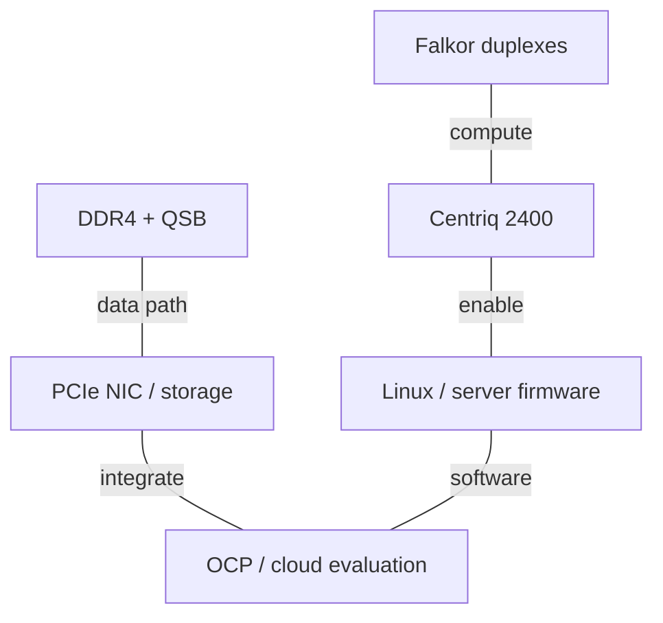
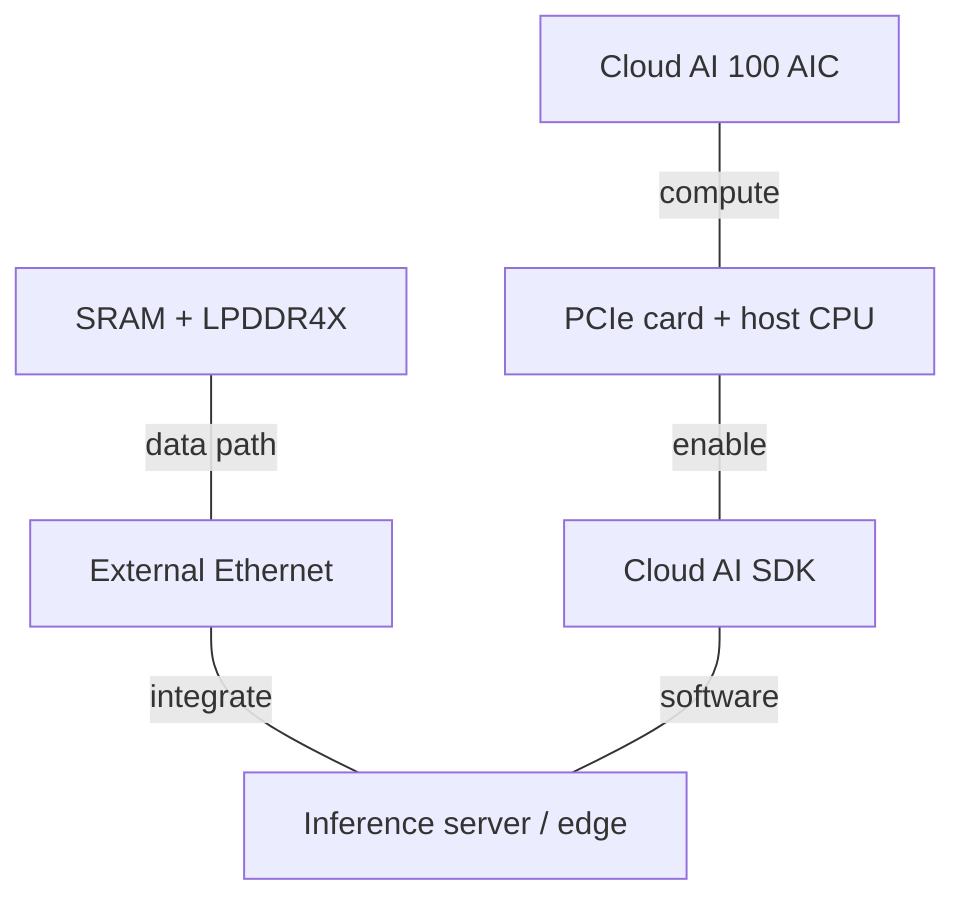
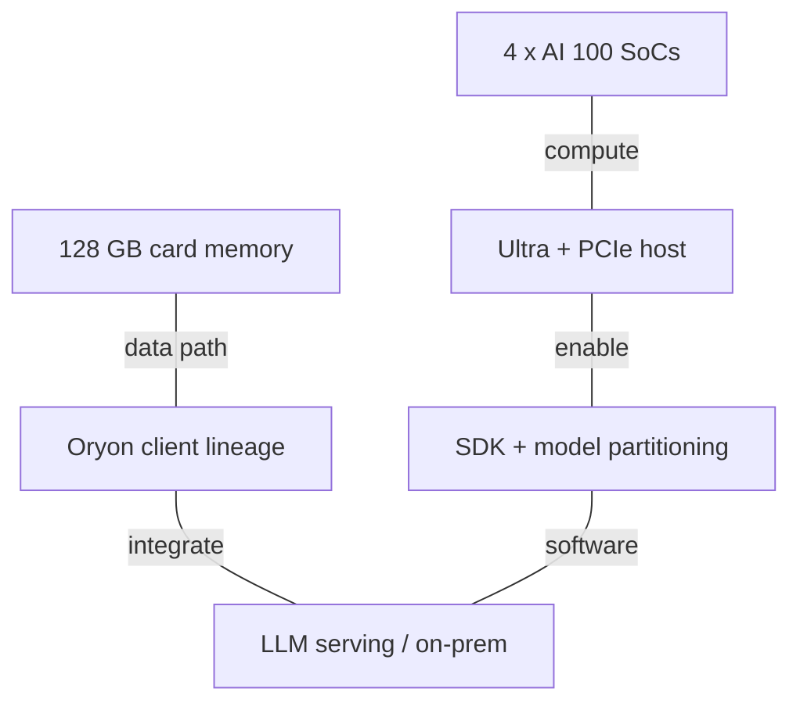
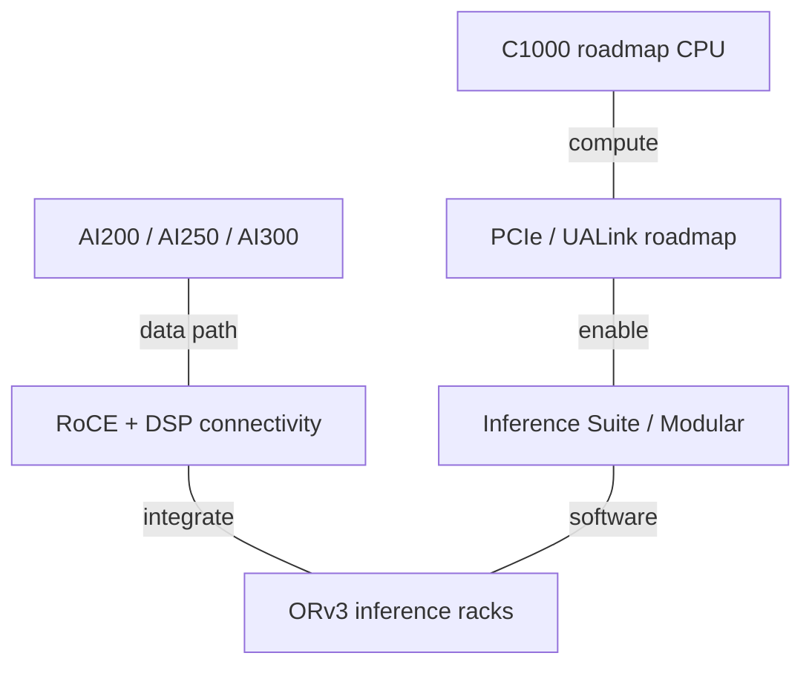

# Qualcomm AI Infrastructure Architecture Evolution

2015-2026 | 2026-09-28

## 01 Scope and executive synthesis

Families and weights: deep on Centriq/Oryon/Dragonfly CPUs and Cloud AI/Dragonfly accelerators; full on datacenter connectivity; proportional on client, edge and RAN derivatives.
Start: 2015, including the first server effort and the mobile technology baseline.
Cutoff: 28 September 2026; current disclosures include Investor Day and AI Infra Summit 2026.
Focus: CPU lineage, inference dataflow, memory capacity/bandwidth, fabric and rack integration.
Exclusions: exhaustive handset/modem SKUs; no merchant datacenter training GPU or separately specified Qualcomm AI NIC is established by the reviewed portfolio.

Qualcomm’s infrastructure history is not a continuous server-CPU succession. Centriq was a real commercial Arm server processor, but the next major CPU story comes through Nuvia-derived Oryon client products and the future Dragonfly C1000. In parallel, Cloud AI 100 establishes a dedicated inference architecture, Ultra expands model capacity through a multi-SoC card, and AI200/AI250/AI300 move the product boundary to the rack. Connectivity assets from Alphawave and software from Modular complete parts of that broader platform.

The dominant architectural bet is inference efficiency rather than reproducing a general-purpose training GPU. Large local capacity can reduce model partitioning, and near-memory execution can reduce the cost of moving weights during decode. These benefits are conditional on dataflow, model placement and software. AI250’s effective HBC bandwidth must therefore remain separate from conventional external-memory bandwidth. The platform’s long-term CPU and accelerator roadmap extends beyond the cutoff: C1000 production is planned for the second half of 2028, not a shipping 2026 server.

## 02 Units, product boundaries and roadmap status

A die, card, server and rack are different accounting scopes. Cloud AI 100 Ultra contains four SoCs; its 128 GB memory and 576 MB SRAM are card totals. AI200’s 43 TB is a rounded rack capacity, whereas 768 GB is per card. Rack power is not card TBP. Bandwidth is decimal GB/s or TB/s, and link direction is stated explicitly. PCIe headline bandwidth is a raw interface budget before protocol overhead. Ethernet Gb/s must be divided by eight before comparison with memory GB/s.

The standard accelerator table preserves dense BF16, FP8, FP6/FP4 and FP64 columns. Where the reviewed evidence supplies FP16 or INT8 instead, those values are reported separately rather than relabelled. n/d means not established; n/a means not applicable. A product announcement, customer sampling, a demonstration and general availability are different milestones. In particular, AI200’s 2025 launch forecast of 2026 availability is followed by a 2026 investor roadmap labelled sampling FY26; the reviewed September demo does not alone establish broad GA.

## 03 CPU generation atlas

### CPU and related client references

| Generation / reference SKU | Codename | GA | Status | Core µarch | Cores / threads | Process per die | Dies / packaging | L2 per core | L3 / domain | Memory: channels; rate; GB/s | Sockets / links | PCIe / CXL | TDP | Vector / matrix ISA |
| --- | --- | --- | --- | --- | --- | --- | --- | --- | --- | --- | --- | --- | --- | --- |
| Centriq 2460 | Falkor | 2017-11 | Historical shipping | Custom Armv8 | 48 / 48 | Samsung 10 nm | Monolithic; 398 mm2; 18B transistors | Shared by 2-core duplex; capacity n/d | 60 MB | DDR4; 6; 2667 MT/s; ~128 GB/s | 1S; QSB internal | 32 PCIe 3; CXL n/a | 120 W | NEON; AArch64 |
| Snapdragon X Elite | Oryon | 2024 | Historical shipping | Oryon 1 | 12 / 12 | 4 nm | Client SoC; 3 CPU clusters | 12 MB / 4-core cluster | System-cache accounting differs | LPDDR5X; 135 GB/s | Client SoC; n/a | PCIe; CXL n/a | OEM configurable; n/d | Arm64; NEON |
| Snapdragon X2 Elite Extreme | X2E-96-100 | 2026 systems | Shipping / available | Oryon 3 | 18 / 18 | 3 nm | Client SoC; Prime + Performance | n/d | 53 MB total CPU cache; not all L3 | LPDDR5X; 192-bit; 228 GB/s | Client SoC; n/a | PCIe; CXL n/a | OEM configurable; n/d | Arm64; details n/d |
| Dragonfly C1000 | n/d | 2028 H2 target | Roadmap | Oryon server | 250+ / n/d | n/d | Chiplet architecture | n/d | n/d | LPDDR; channel count/rate n/d | n/d | PCIe 7; CXL; lanes n/d | n/d | Server ISA details n/d |

Client entries explain the core-development lineage; their memory, power and I/O are not server specifications. C1000 is not a socketed Snapdragon X2 Elite. Nor does the acquisition of Ventana make C1000 a RISC-V processor: Qualcomm explicitly identifies Oryon server cores for C1000, while Ventana adds a separate RISC-V capability. No second commercial Centriq generation is established here.

## 04 Centriq and Falkor: the first server architecture

Centriq 2400 began sampling in 2016 and commercially shipped in November 2017. Falkor is a custom, single-threaded, AArch64-only core. Hot Chips describes an issue path accepting three instructions plus a direct branch and dispatch of up to eight internal operations. A two-core duplex shares L2 and a QSB interface. The segmented bidirectional coherent ring uses shortest-path routing; its reported aggregate bandwidth above 250 GB/s is an internal-fabric figure, not six-channel DDR payload bandwidth.

The duplex L2 uses 128-byte cache lines, ECC and an inclusive relationship to L1 data caches. The disclosed minimum L2 hit latency is fifteen cycles. Distributed L3 includes allocation controls for quality of service, an important feature when many independent tenants share a socket. Six DDR4 channels and 32 PCIe 3 lanes define a balanced scale-out server of its time, but offer a much smaller external accelerator budget than later AI hosts. At 48 cores, approximately 128 GB/s of channel bandwidth means about 2.67 GB/s per core before contention and protocol effects.

The launch disclosure identifies Samsung 10 nm, 18 billion transistors and a 398 mm2 monolithic die. This is implementation evidence even though a matching full Centriq ISSCC paper was not established in the reviewed sources. OCP 2017 supplies the system connection: Qualcomm and Microsoft demonstrated a Centriq-based Open Compute motherboard. That collaboration is evidence of platform development, not proof of Azure public-instance GA. The later break in the server roadmap means that commercial continuity cannot be inferred from the technical quality of Falkor.

## 05 Oryon: client silicon rebuilds the CPU lineage

The 2021 Nuvia acquisition leads to the Oryon CPU introduced in Snapdragon X Elite and commercial PCs in 2024. Hot Chips 2024 and its IEEE Micro follow-up provide the architectural anchor. Three four-core clusters combine substantial near-core cache with a wide out-of-order machine. The design emphasizes instruction supply, branch recovery and outstanding memory operations rather than width alone. The core’s client implementation demonstrates engineering capability; it does not demonstrate server RAS, multi-socket coherence or datacenter memory capacity.

Qualcomm’s Hot Chips 2024 slides give the first Oryon core a 192 KB instruction cache, a 96 KB data cache, eight-instruction decode and eight-micro-op retirement. Six integer and four 128-bit vector execution pipes feed a wide out-of-order machine. The load/store system supports up to four operations per cycle, with a 192-entry load queue and 56-entry store queue. Four cores share a 12 MB L2 at CPU frequency; three clusters connect through a fabric with 6 MB system-level cache to a 135 GB/s LPDDR5X interface. These layers explain why the advertised 42 MB cache total is neither a per-core cache nor a unified last-level cache.

Oryon then crosses into mobile and the third-generation core returns to Snapdragon X2 Elite. The X2E-96-100 reference combines twelve Prime cores with six Performance cores, 53 MB total CPU cache and 228 GB/s LPDDR5X bandwidth. Its 80 TOPS Hexagon NPU is a separate engine, not CPU vector throughput. The mixed core organization and OEM power envelope are client choices. For the server report, the important continuity is custom core design, cache and power-management expertise, and a common software ISA; memory channels and host links must be re-established for C1000.

ISSCC/JSSC-related circuit work explains another part of Qualcomm’s efficiency heritage. Keith Bowman’s adaptive-clock research senses supply droop and adjusts clock behavior to avoid paying a permanent worst-case timing margin. The documented Snapdragon 820 connection makes that a legitimate example of research reaching a product. It does not establish that Centriq, Oryon or C1000 uses an identical circuit. The ISSCC 2025 edge-generative-AI tutorial is useful system context, not a transistor-level disclosure of a Dragonfly accelerator.

## 06 Dragonfly C1000 and the RISC-V branch

Investor Day 2026 announces a chiplet-based C1000 with more than 250 custom Oryon server cores, a core-frequency target above 5 GHz, PCIe 7/CXL connectivity and an LPDDR memory subsystem. Optional HBC attachment is part of the disclosed direction. The architectural shift from Centriq is substantial: a larger package-level design and a CPU positioned around agent orchestration, general cloud services and accelerator head-node work. The Meta agreement places first-generation production in the second half of 2028 and anticipates subsequent generations.

The headline I/O claim of more than 2 TB/s is not normalized here to a lane count or one-way payload figure, because the disclosed direction and aggregation basis are insufficient. Cache sizes, memory-channel count, process partitioning, socket coherence and SKU TDP remain material disclosure gaps. LPDDR can reduce memory energy, but capacity, serviceability, packaging and board topology must be evaluated together. An announced frequency and a core-count ceiling are not evidence that every core sustains that clock at the eventual package power limit.

Qualcomm acquired Ventana in December 2025, adding RISC-V CPU expertise alongside Oryon. Ventana’s earlier Veyron compute-chiplet work is relevant as an acquired design capability, but the reviewed Qualcomm disclosure does not define a shipping successor SKU or transfer its specifications to C1000. The two instruction-set paths should therefore remain separate in a portfolio map. Their potential common ground is physical design, chiplet integration, verification and server software engineering, rather than binary compatibility.

## 07 Accelerator generation atlas

### Inference accelerators in the common comparison schema

| Product | Architecture | GA / milestone | Status | Process | Dies / packaging | Compute units | Dense BF16 | Dense FP8 | Dense FP6 / FP4 | FP64 vector / matrix | Memory: type; stacks; GB; TB/s | LLC / SRAM | Scale-up: links; GB/s per direction; domain | Host link | Power / cooling | Form factor |
| --- | --- | --- | --- | --- | --- | --- | --- | --- | --- | --- | --- | --- | --- | --- | --- | --- |
| Cloud AI 100 Standard | AIC | 2021 systems | Historical shipping | 7 nm | 1 SoC per card | SKU-enabled count n/d | n/d | n/d | n/d | n/a | LPDDR4X; n/a; 16; 0.137 | 126 MB SRAM | PCIe; no dedicated scale-up link | PCIe 4 x8 | 75 W | HHHL PCIe |
| Cloud AI 100 Pro | AIC | 2021 systems | Historical shipping | 7 nm | 1 SoC per card | 16 AIC nominal | n/d | n/d | n/d | n/a | LPDDR4X; n/a; 32; 0.137 | 144 MB SRAM | PCIe; topology-dependent | PCIe 4 x8 | 75 W | HHHL PCIe |
| Cloud AI 100 Ultra | 4 x AIC SoC | 2023-2024 | Shipping / available | 7 nm | 4 SoCs + PCIe switch | 4 x 16 AIC nominal | n/d | n/d | n/d | n/a | LPDDR4X; n/a; 128; 0.548 | 576 MB SRAM | On-card PCIe switching | PCIe 4 x16 | 150 W | FH 3/4 length PCIe |
| Dragonfly AI200 | Inference ASIC | GA n/d | Sampling / demonstrated | n/d | n/d | n/d | n/d | n/d | n/d | n/d | LPDDR5X; n/a; 768/card; ~7.39 derived | n/d | PCIe 6; link count/BW n/d | PCIe; details n/d | Card n/d; rack 140 kW | Card / ORv3 rack |
| Dragonfly AI250 | HBC Gen 1 | 2027 target | Roadmap | n/d | Near-memory architecture; die count n/d | n/d | n/d | n/d | n/d | n/d | HBC; n/a; 768/card; 133 effective | n/d | PCIe 6; link count/BW n/d | n/d | Card n/d; air/DLC rack | Card / ORv3 rack |
| Dragonfly AI300 | HBC Gen 2 | FY28 roadmap | Roadmap | n/d | n/d | n/d | n/d | n/d | n/d | n/d | HBC; capacity n/d; 54x AI200 effective BW target | n/d | UALink / ESUN roadmap; all-to-all | n/d | n/d; liquid-cooled rack | Rack platform |

### Published legacy-card compute figures

| Card | FP16 TFLOP/s | INT8 TOPS | Rated power | Source basis |
| --- | --- | --- | --- | --- |
| Standard | 110 | 325 | 75 W | SDK 1.12 SKU table |
| Pro | 125 | 375 | 75 W | SDK 1.12 SKU table |
| Ultra | 288 product / 290 SDK | 870 | 150 W | Small document revision/rounding difference retained |

## 08 Cloud AI 100: programmable inference dataflow

The 2019 announcement is followed by selected-customer shipments in 2020 and commercial system activity in 2021. Hot Chips 2021 presents the inference architecture. Each AI core separates tensor, vector and scalar work. Tensor units handle the dense linear algebra; vector units process elementwise and other non-matrix operations; a multithreaded VLIW scalar processor coordinates execution. This is not a GPU warp machine. The compiler must expose parallelism, schedule movement and keep specialized engines occupied across a model graph.

The SDK describes 8 MB vector tightly coupled memory and 1 MB shared L2 within each nominal AI core, producing 144 MB of on-chip storage across sixteen cores. Separate compute, memory and configuration networks serve different traffic classes. External LPDDR4X provides capacity; local SRAM provides reuse and predictable scheduling. DMA and tiling are therefore first-class architectural mechanisms. A model that reuses weights or activations locally can amortize external traffic, while a large decode workload repeatedly reading weights can become memory-bound despite substantial tensor capacity.

Standard, Pro and the early DM.2 variants address different power and deployment envelopes. The SoC’s architectural peak, an initial launch target and a shipping card’s rated clock point are not interchangeable. For this reason the report uses the explicit Standard/Pro SKU table for card-level comparisons. Host PCIe 4 x8 provides about 15.75 GB/s per direction before protocol overhead, far below the card’s 137 GB/s memory figure. Keeping model state resident on the card is consequently much more attractive than repeatedly streaming it across the host link.

## 09 Cloud AI 100 Ultra: capacity by replication

Ultra combines four Cloud AI 100 SoCs and a PCIe switch on a 150 W card. Each SoC has its own local memory; the card totals 128 GB LPDDR4X, 576 MB SRAM and 548 GB/s of summed memory bandwidth. The host interface expands to PCIe 4 x16, while each SoC attaches to the switch over x8. Four chips on one board do not create one uniform-latency shared SRAM or one unconstrained 548 GB/s path for every operation. Model partitioning and communication scheduling remain necessary.

The 2023 product is explicitly positioned around generative inference. Its capacity allows some large quantized models to remain on one card, reducing the number of boards and host/network crossings. That is a model-placement advantage, not evidence of higher training throughput. Weight precision, KV-cache size, context length and batch size determine whether a model fits. Independent 2025 NRP measurements confirm that the platform can be used for real LLM serving, but their energy ratios depend on the selected models, comparison configurations and utilization; they are not portable chip-level efficiency constants.

## 10 AI200: the inference rack becomes the product

AI200 moves from a low-power PCIe-card story to a rack-scale inference platform. The published configuration contains 56 cards, 768 GB LPDDR per card, approximately 43 TB per rack and 0.414 PB/s aggregate memory bandwidth. It specifies PCIe 6 scale-up and Ethernet/RoCE scale-out in an ORv3 rack, with a 140 kW liquid-cooled configuration. Dividing rack memory bandwidth by 56 gives approximately 7.39 TB/s per card as an arithmetic average. It does not disclose a single die’s memory interface or prove equal bandwidth for every placement.

A September 2026 demonstration places Kimi-K2.5 on a single AI200 card. That is relevant evidence for model-capacity and software progress, but the demo does not establish sustained throughput, response-time distribution, model precision or broad customer availability. Architecturally, the large capacity can reduce weight sharding, while PCIe scale-up and RoCE still have to move activations, expert-routing traffic and collectives. Model residency and communication efficiency solve different constraints.

## 11 AI250 and AI300: near-memory execution

AI250 introduces High Bandwidth Compute Gen 1, with a published 133 TB/s effective memory bandwidth per card and 7.4 PB/s per rack. Qualcomm describes this as eighteen times AI200’s effective bandwidth. The key mechanism is moving computation closer to memory, so a useful computation need not pay the same external data movement as a conventional processor reading every operand over a memory bus. Effective bandwidth is a workload/architecture equivalence metric; treating it as an ordinary HBM pin-rate specification would produce a misleading roofline comparison.

The natural target is memory-sensitive decode and long-context serving. Prefill may remain more compute-intensive, so disaggregating the phases can improve resource matching but adds transfer and scheduling costs. HBC’s practical value depends on which operators execute near memory, the precision they support, locality across memory partitions, and how intermediate results reach the rest of the machine. The public investor material outlines the approach but does not disclose enough circuit, stack or inter-die detail to reconstruct a complete implementation.

AI300 extends the roadmap to HBC Gen 2, with UALink/ESUN scale-up, copper and optical scale-out, and a single-hop all-to-all rack objective. The investor roadmap quotes a fifty-four-times AI200 effective-bandwidth target. This is a future architecture claim, not measured shipping throughput. C1000 is shown as the future CPU partner. Per-card link rates, radix, packet semantics, memory capacity and complete power limits remain undisclosed in the reviewed material, so the report does not manufacture a rack bisection figure.

## 12 Connectivity: from Alphawave assets to Dragonfly DSPs

The Alphawave transaction closed on 18 December 2025, earlier than the original 2026 expectation. It adds high-speed wired connectivity and custom-silicon capabilities, which matter because a rack platform needs more than compute engines. The 2026 portfolio spans electrical SerDes, die-to-die interfaces, optical DSPs, active electrical cable retimers and custom silicon. A protocol controller, a PHY, a retimer, an optical module and a complete NIC occupy different layers; they must not be collapsed into a single AI-networking product count.

Dragonfly O100/O200 are PAM4 optical DSP families; CO400 is a coherent-lite 16QAM optical DSP. CU100/CU200 address PAM4 active electrical cables. CU100 is described as a 4 nm retimer. The 100G/200G/400G labels identify signaling/product classes, not a fully specified NIC port count. Investor Day distinguishes volume-production 800G connectivity, 1.6T scaling in the 2026-2027 period and later 3.2T development. A 448G SerDes roadmap is likewise a technology direction, not evidence of a shipping 448G-per-lane rack.

### Network and connectivity product classes

| Product | GA / milestone | Status | Class | Ports × speed | SerDes | Host interface | Programmable engine | Embedded CPU | On-card memory | Transport / RDMA | Congestion control | Key offloads | Power |
| --- | --- | --- | --- | --- | --- | --- | --- | --- | --- | --- | --- | --- | --- |
| Dragonfly O100 | 2026 portfolio | Announced; GA n/d | Optical DSP | n/a | 100G PAM4 class | n/a | Signal processing; packet pipeline n/a | n/a | n/a | n/a | n/a | Optical link DSP | n/d |
| Dragonfly O200 | 2026 portfolio | Announced; GA n/d | Optical DSP | n/a | 200G PAM4 class | n/a | DSP | n/a | n/a | n/a | n/a | Optical link DSP | n/d |
| Dragonfly CO400 | 2026 portfolio | Announced; GA n/d | Coherent-lite DSP | n/a | 400G 16QAM | n/a | DSP | n/a | n/a | n/a | n/a | Longer-reach optics | n/d |
| Dragonfly CU100 | 2026 portfolio | Announced; GA n/d | AEC DSP; 4 nm | n/a | 100G PAM4 | n/a | DSP | n/a | n/a | n/a | n/a | Electrical retiming | n/d |
| Dragonfly CU200 | 2026 portfolio | Announced; GA n/d | AEC DSP | n/a | 200G PAM4 | n/a | DSP | n/a | n/a | n/a | n/a | Electrical retiming | n/d |
| Dragonwing X100 | 2021 disclosure | Shipping / available | 5G RAN inline accelerator | n/d | n/d | PCIe | 5G L1 software | n/d | n/d | O-RAN fronthaul; AI RDMA n/a | n/a | Baseband L1 processing | n/d |

## 13 Interconnect and system topology

### Normalized interconnect boundaries

| Interconnect | Year / generation | Lane rate | Lanes / link | GB/s per link per direction | Links / device | Topology | Domain limit | Coherence / semantics |
| --- | --- | --- | --- | --- | --- | --- | --- | --- |
| QSB | 2017 | n/a | n/a | n/d; >250 GB/s aggregate internal | n/a | Segmented coherent ring | 48 cores | CPU/cache/I/O coherence |
| Cloud AI 100 host | 2021 | 16 GT/s | 8 | ~15.75 | 1 | PCIe | 1 card | DMA / host I/O |
| Ultra host / local | 2023 | 16 GT/s | 16 host; 8/SoC | ~31.5 host; ~15.75/SoC | 4 SoC links | On-card PCIe switch | 4 SoCs | Partitioned local memory; PCIe movement |
| AI200 / AI250 scale-up | 2026-2027 | 64 GT/s | n/d | n/d | n/d | PCIe 6 | Rack solution; topology n/d | Coherence not established |
| AI300 UALink / ESUN | FY28 | n/d | n/d | n/d | n/d | Single-hop all-to-all target | n/d | Protocol details n/d |

### System reference envelopes

| Platform | Year / milestone | CPU / accelerator count | Scale-up domain | Scale-out per accelerator | Rack power | Cooling |
| --- | --- | --- | --- | --- | --- | --- |
| Centriq OCP motherboard | 2017 | Centriq 2400 | 1 socket | n/a | n/d | Server-dependent |
| Ultra inference server | 2023-2025 | Host CPU + PCIe cards | 4 SoCs per card; system-dependent | n/d | n/d | Air, platform-dependent |
| AI200 ORv3 | 2026 | 56 cards | PCIe 6 rack integration | RoCE; per-card rate n/d | 140 kW | DLC reference; air option disclosed |
| AI250 ORv3 | 2027 target | 43 TB rack; card count n/d here | PCIe 6 | RoCE; rate n/d | n/d | Air / DLC |
| AI300 + C1000 | 2028 roadmap | Future CPU + HBC accelerators | All-to-all target | n/d | n/d | Liquid |

The rack references include NICs and switches, but the reviewed product pages do not specify a complete Qualcomm-branded AI NIC with transport, congestion-control and offload details. It is therefore more accurate to show RoCE as the system transport and the DSPs as connectivity components. Retiming a signal does not implement RDMA, congestion control or collective acceleration. Similarly, UALink participation and controller IP do not by themselves establish a merchant scale-up switch SKU.

## 14 Adreno, Hexagon, Dragonwing and RAN

Qualcomm’s GPU line is Adreno, integrated into Snapdragon and related SoCs. Its role includes graphics and flexible local compute; it is not the architecture identity of Cloud AI 100. Hexagon combines DSP/vector/tensor capabilities for edge AI, with newer products emphasizing dedicated NPU execution. Snapdragon X and mobile Oryon products show CPU, GPU and NPU sharing a constrained memory and thermal envelope. Peak values across these engines cannot simply be added as one usable model throughput because operators, formats and data movement differ.

Dragonwing is the industrial/embedded and infrastructure brand; Dragonfly is the datacenter portfolio. The Cloud AI 100 Ultra can also serve on-premises inference appliances, connecting the edge and datacenter stories without turning every embedded product into a server accelerator. X100 is especially easy to misread: Dragonwing X100 is a 5G RAN inline accelerator for Layer 1 baseband processing, whereas Cloud AI 100 is an AI inference family. MWC disclosures belong to telecom infrastructure, not evidence of an AI training fabric.

## 15 Software and academic evidence

Cloud AI SDK separates model compilation from runtime execution and exposes hardware-aware model preparation. The future Dragonfly stack adds the AI Inference Suite, infrastructure management, AIC ahead-of-time compilation, QCCL, NPU-direct and orchestration integration. Modular’s acquisition completed in July 2026, adding a software platform whose existing cross-hardware capability is distinct from future Dragonfly optimization. An acquisition announcement or a stack diagram does not establish that every operator and numerical format is production-ready on every accelerator generation.

ASPLOS 2025’s Fast On-device LLM Inference with NPUs is a useful implementation-facing study: it partitions variable-length prompts, handles quantization outliers across engines and schedules blocks according to CPU/GPU/NPU affinity. It studies how to use available hardware, not an undisclosed Dragonfly microarchitecture. ISCA 2023 shared-microexponent work and the OCP microscaling paper explain low-precision representation choices, but neither alone proves native support in Cloud AI 100 silicon. Academic sponsorship, a program-committee affiliation or a paper using a Snapdragon phone is not a product disclosure.

### Software timeline and enablement boundary

| Release / component | Date | Hardware enabled | Key features |
| --- | --- | --- | --- |
| Cloud AI SDK | 2021-2026 | Cloud AI 100 / Ultra | Compile, deploy, profile; model support is release-specific |
| AI Engine Direct / QNN | 2022-2026 | Snapdragon / Hexagon / Adreno | On-device heterogeneous execution |
| AI Inference Suite / AIMS | 2026 disclosure | Dragonfly | Serving, fleet management, QCCL and NPU-direct roadmap |
| Modular acquisition | 2026-07 | Cross-hardware AI software | Completed acquisition; future hardware enablement separate |

## 16 Quantitative balance and deployment trade-offs

### Derived ratios with explicit scope

| Configuration | Derived quantity | Value | Interpretation |
| --- | --- | --- | --- |
| Centriq 48C | DRAM/core; LLC/core | ~2.67 GB/s; 1.25 MB | Theoretical equal share |
| AI 100 Pro | Memory BW / FP16 peak | 0.001096 byte/FLOP | 137 GB/s / 125 TFLOP/s; not BF16 |
| AI 100 Ultra | Memory BW / FP16 peak | 0.001903 byte/FLOP | 548 GB/s / 288 TFLOP/s product figure |
| AI 100 Pro | Host / local memory bandwidth | ~0.115 | 15.75 / 137; one direction; raw host link |
| AI 100 Ultra | Host / summed local memory BW | ~0.0575 | 31.5 / 548; four memory domains |
| AI200 | Memory/card; BW/card average | 768 GB; ~7.39 TB/s | 414 TB/s / 56 cards; no card-power inference |
| AI 100 Pro | FP16 peak / rated TDP | 1.67 TFLOP/s/W | 125 / 75; not measured tokens/W |
| AI 100 Ultra | FP16 peak / rated TDP | 1.92 TFLOP/s/W | 288 / 150; not whole-system energy |

These ratios expose the portfolio’s trade-offs. Ultra quadruples card memory capacity relative to Pro while doubling rated card power, but only doubles the host-link width; residency becomes more important. AI200 increases the unit of integration and cooling burden. AI250 attacks decode movement with a different memory-compute organization. Dense BF16/FP8 bytes-per-FLOP, HBM ratios, scale-out bandwidth per card and measured rack tokens/W remain n/d where the required normalized inputs are absent. Substituting marketing multipliers would hide the architectural question rather than answer it.

## 17 Conference-to-product index

### Verified disclosure anchors

| Venue | Year | Paper / talk / disclosure | Presenter / authors | Product | Evidence type | Source |
| --- | --- | --- | --- | --- | --- | --- |
| Hot Chips | 2017 | Qualcomm Centriq 2400 Processor / Falkor | Qualcomm | Centriq | Architecture | C01 E01 |
| Hot Chips | 2021 | Cloud AI 100: Scalable, High Performance and Low Latency Deep Learning Inference Accelerator | Qualcomm | Cloud AI 100 | Architecture | C06 P01 |
| Hot Chips / IEEE Micro | 2024 / 2025 | Snapdragon X Elite Qualcomm Oryon CPU: Design & Architecture Overview | Gerard Williams / Qualcomm | Oryon | Architecture | C07 C08 C02 |
| ISSCC / JSSC lineage | 2015 / 2016 | Auto-calibrating adaptive clock distribution | Keith Bowman et al. | Circuit research; Snapdragon 820 link | Circuit research | C04 |
| ISSCC | 2025 | Generative AI on Edge Devices: Models, Hardware and Systems | Paul Whatmough | Edge AI context | Tutorial | C03 |
| ASPLOS | 2025 | Fast On-device LLM Inference with NPUs | Daliang Xu et al. | Snapdragon-class NPU use | System research | R04 |
| ISCA | 2023 | With Shared Microexponents, A Little Shifting Goes a Long Way | B. Rouhani et al. | Numerical-format background | Related research | R02 |
| OCP Summit | 2017 | Centriq Open Compute motherboard with Microsoft | Qualcomm / Microsoft | Centriq | System demonstration | E12 |
| MWC-era announcement | 2021 | 5G DU X100 accelerator | Qualcomm | X100 RAN | Product / system | E11 |
| Snapdragon Summit | 2023 / 2025 | X Elite / X2 Elite | Qualcomm | Oryon client lineage | Product launch | E17 P12 |
| Investor Day | 2026 | Dragonfly CPU, HBC, accelerators and connectivity | Tony Pialis | C1000 / AI200-300 / DSPs | Roadmap / system | P08 E09 E10 |
| AI Infra Summit | 2026 | Dragonfly inference demonstrations | Qualcomm | AI200 | Demonstration | E07 |

MICRO and HPCA were checked as architecture-research venues, but the reviewed record does not establish a primary Centriq, Cloud AI or Dragonfly product-architecture paper there. DAC and VLSI can illuminate implementation methods; OFC and Hot Interconnects are relevant to the acquired connectivity stack; Computex and company events establish product milestones. AWS re:Invent, Microsoft Ignite, Google Cloud Next and GTC require a specific partner deployment to count as evidence. The report does not turn generic ecosystem participation into a product presentation or claim exhaustive conference attendance.

## 18 Codename and product crosswalk

### Disambiguation map

| Name | Product identity | Boundary |
| --- | --- | --- |
| Falkor | Custom CPU core in Centriq 2400 | Not Neoverse; not Oryon |
| Oryon | Custom CPU family; client and future server | Client SoC != C1000 |
| Cloud AI 100 / Ultra | Inference ASIC and PCIe cards | Not Adreno GPU; not X100 RAN |
| Dragonfly | Datacenter CPU, accelerator and connectivity brand | C1000 / AI200 / AI250 / AI300 / DSPs |
| Dragonwing X100 | 5G baseband inline accelerator | Telecom L1 offload |
| HBC | High Bandwidth Compute | Near-memory compute; not HBM synonym |

## 19 Integrated stack across four eras

Connections show architectural composition. A roadmap block remains a roadmap in the system view; placing two future products in one figure does not establish a shipping platform.

### 2015-2018: the scale-out server attempt

Conceptual composition, with statuses defined in the product chapters; external NIC ownership is not inferred.

### 2019-2022: inference cards

Conceptual composition, with statuses defined in the product chapters; external NIC ownership is not inferred.

### 2023-2025: model capacity and new CPU cores

Conceptual composition, with statuses defined in the product chapters; external NIC ownership is not inferred.

### 2026 disclosures: the future rack portfolio

Conceptual composition, with statuses defined in the product chapters; external NIC ownership is not inferred.

### Bandwidth hierarchy by era

| Era / reference | On-die / die-to-die | Local memory | CPU / scale-up | Scale-out |
| --- | --- | --- | --- | --- |
| 2017 Centriq | QSB >250 GB/s aggregate | ~128 GB/s DDR4 | PCIe 3; ~15.75 GB/s per x16 direction | External NIC; n/d |
| 2021 AI 100 Pro | 3 NoCs; aggregate scope not normalized | 137 GB/s | PCIe 4 x8 ~15.75 GB/s/direction | External NIC; n/d |
| 2023 Ultra | 4 discrete SoCs; PCIe switch | 548 GB/s summed | PCIe 4 x16 ~31.5 GB/s/direction | External NIC; n/d |
| 2026 Dragonfly disclosure | HBC implementation details n/d | AI200 ~7.39 TB/s/card; AI250 133 effective | PCIe 6 / future UALink; n/d | RoCE; per-card bandwidth n/d |

## 20 Engineering conclusions

Qualcomm’s strongest continuity is in energy-conscious programmable compute and data movement, not an uninterrupted server product cadence. Centriq contributes a real server baseline; Oryon rebuilds custom CPU capability; Cloud AI 100 provides a distinct inference engine; Ultra demonstrates capacity scaling through board-level replication. Dragonfly’s next step is harder: coordinating CPU, near-memory acceleration, high-speed connectivity, software and cooling at rack scale. Its success should be assessed with model fit, latency-constrained token throughput, communication overhead and measured system power, while keeping future production targets separate from present capabilities.

## Source map

01 Scope and executive synthesis — C01, E02, E05, E07, E08, E10, E14, P01, P05, P08

02 Units, product boundaries and roadmap status — E06, E07, P01, P04, P08

03 CPU generation atlas — C01, C02, C07, C08, E01, E02, E10, E13, E16, P07, P08, P12

04 Centriq and Falkor: the first server architecture — C01, E01, E02, E12

05 Oryon: client silicon rebuilds the CPU lineage — C02, C03, C04, C05, C08, E15, P12

06 Dragonfly C1000 and the RISC-V branch — E10, E13, P07, P08

07 Accelerator generation atlas — E04, E05, E06, E07, P01, P02, P03, P04, P05, P06, P08

08 Cloud AI 100: programmable inference dataflow — C06, E03, E04, P01, P02

09 Cloud AI 100 Ultra: capacity by replication — E05, P01, P03, R01

10 AI200: the inference rack becomes the product — E07, P04

11 AI250 and AI300: near-memory execution — P05, P06, P08

12 Connectivity: from Alphawave assets to Dragonfly DSPs — E08, E11, P08, P09, P10, P11

13 Interconnect and system topology — C01, E10, E12, P01, P04, P05, P06, P08, P09, R01

14 Adreno, Hexagon, Dragonwing and RAN — E11, P03, P11, P12, P14, R04

15 Software and academic evidence — E14, P01, P08, P13, P14, R02, R03, R04

16 Quantitative balance and deployment trade-offs — C01, E02, P01, P03, P04, P05

17 Conference-to-product index — C01, C02, C03, C04, C06, C07, C08, E01, E07, E09, E10, E11, E12, E17, P01, P08, P12, R02, R04

18 Codename and product crosswalk — C01, C07, P01, P07, P08, P09, P11

19 Integrated stack across four eras — C01, E10, P01, P04, P05, P06, P08

20 Engineering conclusions — C01, E10, E14, P01, P08

## References

### Product and technical documentation

[P01] Cloud AI 100 architecture, SDK 1.12. [https://quic.github.io/cloud-ai-sdk-pages/1.12/Getting-Started/Architecture/](https://quic.github.io/cloud-ai-sdk-pages/1.12/Getting-Started/Architecture/). Primary source; accessed by 2026-09-28

[P02] Cloud AI 100 announcement and silicon specifications. [https://www.qualcomm.com/media/documents/files/qualcomm-cloud-ai-100-announcement.pdf](https://www.qualcomm.com/media/documents/files/qualcomm-cloud-ai-100-announcement.pdf). Primary source; accessed by 2026-09-28

[P03] Cloud AI 100 Ultra specifications. [https://www.qualcomm.com/data-center/products/cloud-ai-100-ultra](https://www.qualcomm.com/data-center/products/cloud-ai-100-ultra). Primary source; accessed by 2026-09-28

[P04] Dragonfly AI200 specifications. [https://www.qualcomm.com/data-center/products/qualcomm-dragonfly-ai200](https://www.qualcomm.com/data-center/products/qualcomm-dragonfly-ai200). Primary source; accessed by 2026-09-28

[P05] Dragonfly AI250 specifications. [https://www.qualcomm.com/data-center/products/qualcomm-dragonfly-ai250](https://www.qualcomm.com/data-center/products/qualcomm-dragonfly-ai250). Primary source; accessed by 2026-09-28

[P06] Dragonfly AI300 specifications. [https://www.qualcomm.com/data-center/products/qualcomm-dragonfly-ai300](https://www.qualcomm.com/data-center/products/qualcomm-dragonfly-ai300). Primary source; accessed by 2026-09-28

[P07] Dragonfly C1000 specifications. [https://www.qualcomm.com/data-center/products/qualcomm-dragonfly-c1000](https://www.qualcomm.com/data-center/products/qualcomm-dragonfly-c1000). Primary source; accessed by 2026-09-28

[P08] Investor Day 2026 Data Center presentation. [https://www.qualcomm.com/content/dam/qcomm-martech/dm-assets/documents/Investor-Day-2026_TPialis_Data-Center.pdf](https://www.qualcomm.com/content/dam/qcomm-martech/dm-assets/documents/Investor-Day-2026_TPialis_Data-Center.pdf). Primary source; accessed by 2026-09-28

[P09] Dragonfly connectivity portfolio. [https://www.qualcomm.com/data-center/expertise/connectivity](https://www.qualcomm.com/data-center/expertise/connectivity). Primary source; accessed by 2026-09-28

[P10] Dragonfly CU100 AEC DSP. [https://www.qualcomm.com/data-center/products/qualcomm-dragonfly-cu100](https://www.qualcomm.com/data-center/products/qualcomm-dragonfly-cu100). Primary source; accessed by 2026-09-28

[P11] Dragonwing X100 RAN accelerator. [https://www.qualcomm.com/cellular-infrastructure/products/qualcomm-x100-5g-ran-accelerator-card](https://www.qualcomm.com/cellular-infrastructure/products/qualcomm-x100-5g-ran-accelerator-card). Primary source; accessed by 2026-09-28

[P12] Snapdragon X2 Elite product brief. [https://www.qualcomm.com/content/dam/qcomm-martech/dm-assets/documents/Snapdragon-X2-Elite-Product-Brief.pdf](https://www.qualcomm.com/content/dam/qcomm-martech/dm-assets/documents/Snapdragon-X2-Elite-Product-Brief.pdf). Primary source; accessed by 2026-09-28

[P13] Cloud AI SDK model architecture support. [https://quic.github.io/cloud-ai-sdk-pages/latest/Getting-Started/Model-Architecture-Support/](https://quic.github.io/cloud-ai-sdk-pages/latest/Getting-Started/Model-Architecture-Support/). Primary source; accessed by 2026-09-28

[P14] Qualcomm AI Engine Direct SDK documentation. [https://docs.qualcomm.com/bundle/publicresource/topics/80-63442-50/introduction.html](https://docs.qualcomm.com/bundle/publicresource/topics/80-63442-50/introduction.html). Primary source; accessed by 2026-09-28

### Conference records and implementation disclosures

[C01] Qualcomm Centriq 2400 Processor, Hot Chips 2017. [https://www.qualcomm.com/content/dam/qcomm-martech/dm-assets/documents/qualcomm_centriq_2400_hotchips_final_0.pdf](https://www.qualcomm.com/content/dam/qcomm-martech/dm-assets/documents/qualcomm_centriq_2400_hotchips_final_0.pdf). Primary source; accessed by 2026-09-28

[C02] Qualcomm Oryon CPU in Snapdragon X Elite: Micro-Architecture and Design, IEEE Micro 2025. [https://ieeexplore.ieee.org/abstract/document/11002606](https://ieeexplore.ieee.org/abstract/document/11002606). Official indexed record or related announcement; full document download unavailable.

[C03] ISSCC 2025 advance program: Generative AI on Edge Devices tutorial. [https://www.isscc.org/s/ISSCC2025AdvanceProgram.pdf](https://www.isscc.org/s/ISSCC2025AdvanceProgram.pdf). Official conference press kit; not the full paper.

[C04] Adaptive and Resilient Circuits for Processors: Keith Bowman lecture. [https://www.ece.uw.edu/colloquia/adaptive-and-resilient-circuits-for-processors/](https://www.ece.uw.edu/colloquia/adaptive-and-resilient-circuits-for-processors/). Primary source; accessed by 2026-09-28

[C05] Hot Chips 2024 conference program: Oryon. [https://hc2024.hotchips.org/](https://hc2024.hotchips.org/). Official indexed record or related announcement; full document download unavailable.

[C06] Hot Chips 2021 conference program: Cloud AI 100. [https://hc33.hotchips.org/](https://hc33.hotchips.org/). Official indexed record or related announcement; full document download unavailable.

[C07] Snapdragon X Elite product brief and Oryon configuration. [https://www.qualcomm.com/content/dam/qcomm-martech/dm-assets/images/company/news-media/media-center/press-kits/snapdragon-summit-2023/documents/SnapdragonXEliteProductBrief.pdf](https://www.qualcomm.com/content/dam/qcomm-martech/dm-assets/images/company/news-media/media-center/press-kits/snapdragon-summit-2023/documents/SnapdragonXEliteProductBrief.pdf). Primary source; accessed by 2026-09-28

[C08] Qualcomm-authored Hot Chips 2024 Oryon architecture slides, reproduced by ServeTheHome. [https://www.servethehome.com/snapdragon-x-elite-qualcomm-oryon-cpu-design-and-architecture-hot-chips-2024-arm/](https://www.servethehome.com/snapdragon-x-elite-qualcomm-oryon-cpu-design-and-architecture-hot-chips-2024-arm/). Primary source; accessed by 2026-09-28

### Research papers and publication registries

[R01] Serving LLMs in HPC Clusters: A Comparative Study of Qualcomm Cloud AI 100 Ultra and NVIDIA Data Center GPUs. [https://arxiv.org/abs/2507.00418](https://arxiv.org/abs/2507.00418). Primary source; accessed by 2026-09-28

[R02] With Shared Microexponents, A Little Shifting Goes a Long Way. [https://arxiv.org/abs/2302.08007](https://arxiv.org/abs/2302.08007). Primary source; accessed by 2026-09-28

[R03] Microscaling Data Formats for Deep Learning. [https://arxiv.org/abs/2310.10537](https://arxiv.org/abs/2310.10537). Primary source; accessed by 2026-09-28

[R04] Fast On-device LLM Inference with NPUs, ASPLOS 2025. [https://xumengwei.github.io/files/ASPLOS25-NPU.pdf](https://xumengwei.github.io/files/ASPLOS25-NPU.pdf). Primary source; accessed by 2026-09-28

### Launches, ecosystem and deployment

[E01] Introducing Falkor, Hot Chips 2017. [https://www.qualcomm.com/news/onq/2017/08/introducing-qualcomm-falkor-cpu-core-purpose-built-cloud-workloads](https://www.qualcomm.com/news/onq/2017/08/introducing-qualcomm-falkor-cpu-core-purpose-built-cloud-workloads). Primary source; accessed by 2026-09-28

[E02] Centriq 2400 commercial shipment, 2017. [https://www.qualcomm.com/news/releases/2017/11/qualcomm-datacenter-technologies-announces-commercial-shipment-qualcomm](https://www.qualcomm.com/news/releases/2017/11/qualcomm-datacenter-technologies-announces-commercial-shipment-qualcomm). Primary source; accessed by 2026-09-28

[E03] Cloud AI 100 launch, 2019. [https://www.qualcomm.com/news/releases/2019/04/qualcomm-brings-power-efficient-artificial-intelligence-inference](https://www.qualcomm.com/news/releases/2019/04/qualcomm-brings-power-efficient-artificial-intelligence-inference). Primary source; accessed by 2026-09-28

[E04] Cloud AI 100 first customer shipments, 2020. [https://www.qualcomm.com/news/releases/2020/09/qualcomm-announces-first-shipments-qualcomm-cloud-ai-100-accelerator-and](https://www.qualcomm.com/news/releases/2020/09/qualcomm-announces-first-shipments-qualcomm-cloud-ai-100-accelerator-and). Primary source; accessed by 2026-09-28

[E05] Cloud AI 100 Ultra launch, 2023. [https://www.qualcomm.com/news/onq/2023/11/introducing-qualcomm-cloud-ai-100-ultra](https://www.qualcomm.com/news/onq/2023/11/introducing-qualcomm-cloud-ai-100-ultra). Primary source; accessed by 2026-09-28

[E06] AI200 and AI250 announcement, October 2025. [https://www.qualcomm.com/news/releases/2025/10/qualcomm-unveils-ai200-and-ai250-redefining-rack-scale-data-cent](https://www.qualcomm.com/news/releases/2025/10/qualcomm-unveils-ai200-and-ai250-redefining-rack-scale-data-cent). Primary source; accessed by 2026-09-28

[E07] Dragonfly at AI Infra Summit 2026. [https://www.qualcomm.com/news/onq/2026/09/qualcomm-dragonfly-ai-infra-summit-2026](https://www.qualcomm.com/news/onq/2026/09/qualcomm-dragonfly-ai-infra-summit-2026). Primary source; accessed by 2026-09-28

[E08] Alphawave acquisition completion, SEC note. [https://www.sec.gov/Archives/edgar/data/804328/000080432826000061/R14.htm](https://www.sec.gov/Archives/edgar/data/804328/000080432826000061/R14.htm). Primary source; accessed by 2026-09-28

[E09] Qualcomm Dragonfly roadmap announcement, June 2026 (company release). [https://www.nasdaq.com/press-release/qualcomm-unveils-comprehensive-data-center-roadmap-agentic-ai-era-new-qualcomm](https://www.nasdaq.com/press-release/qualcomm-unveils-comprehensive-data-center-roadmap-agentic-ai-era-new-qualcomm). Primary source; accessed by 2026-09-28

[E10] Qualcomm and Meta C1000 agreement (company release). [https://www.nasdaq.com/press-release/qualcomm-and-meta-announce-strategic-multi-generation-agreement-data-center-cpus-2026](https://www.nasdaq.com/press-release/qualcomm-and-meta-announce-strategic-multi-generation-agreement-data-center-cpus-2026). Primary source; accessed by 2026-09-28

[E11] X100 5G DU accelerator introduction, MWC 2021. [https://www.qualcomm.com/news/releases/2021/06/qualcomm-introduces-new-5g-distributed-unit-accelerator-card-drive-global](https://www.qualcomm.com/news/releases/2021/06/qualcomm-introduces-new-5g-distributed-unit-accelerator-card-drive-global). Primary source; accessed by 2026-09-28

[E12] Qualcomm Centriq Open Compute motherboard with Microsoft, 2017. [https://investor.qualcomm.com/news-events/press-releases/news-details/2017/Qualcomm-Collaborates-with-Microsoft-to-Accelerate-Cloud-Services-on-10nm-Qualcomm-Centriq-2400-Platform-03-08-2017/default.aspx](https://investor.qualcomm.com/news-events/press-releases/news-details/2017/Qualcomm-Collaborates-with-Microsoft-to-Accelerate-Cloud-Services-on-10nm-Qualcomm-Centriq-2400-Platform-03-08-2017/default.aspx). Official indexed record or related announcement; full document download unavailable.

[E13] Qualcomm acquisition of Ventana, December 2025. [https://www.qualcomm.com/news/releases/2025/12/qualcomm-acquires-ventana-micro-systems--deepening-risc-v-cpu-ex](https://www.qualcomm.com/news/releases/2025/12/qualcomm-acquires-ventana-micro-systems--deepening-risc-v-cpu-ex). Primary source; accessed by 2026-09-28

[E14] Qualcomm completes Modular acquisition, July 2026. [https://www.qualcomm.com/news/releases/2026/07/qualcomm-completes-acquisition-of-modular](https://www.qualcomm.com/news/releases/2026/07/qualcomm-completes-acquisition-of-modular). Primary source; accessed by 2026-09-28

[E15] Qualcomm completes NUVIA acquisition, March 2021. [https://s204.q4cdn.com/645488518/files/doc_news/2021/03/2021-03-16_Qualcomm_Completes_Acquisition_of_1304.pdf](https://s204.q4cdn.com/645488518/files/doc_news/2021/03/2021-03-16_Qualcomm_Completes_Acquisition_of_1304.pdf). Primary source; accessed by 2026-09-28

[E16] Snapdragon X2 commercial PC lineup, April 2026. [https://www.qualcomm.com/snapdragon/news/explore-the-lineup-of-new-next-gen-pcs-powered-by-snapdragon-x2-](https://www.qualcomm.com/snapdragon/news/explore-the-lineup-of-new-next-gen-pcs-powered-by-snapdragon-x2-). Primary source; accessed by 2026-09-28

[E17] Snapdragon X Elite introduction, Summit 2023. [https://www.qualcomm.com/news/releases/2023/10/qualcomm-unleashes-snapdragon-x-elite--the-ai-super-charged-plat](https://www.qualcomm.com/news/releases/2023/10/qualcomm-unleashes-snapdragon-x-elite--the-ai-super-charged-plat). Primary source; accessed by 2026-09-28
