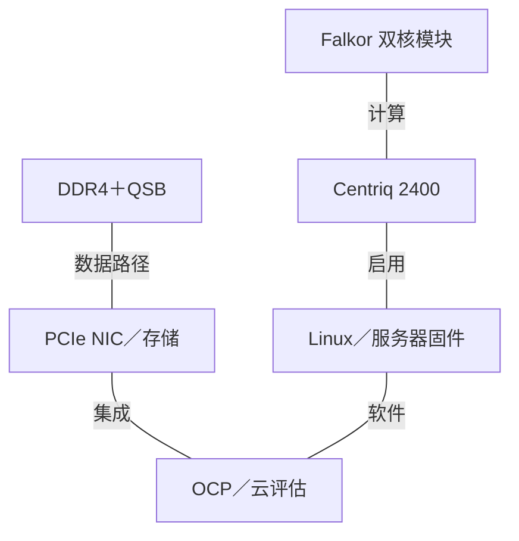
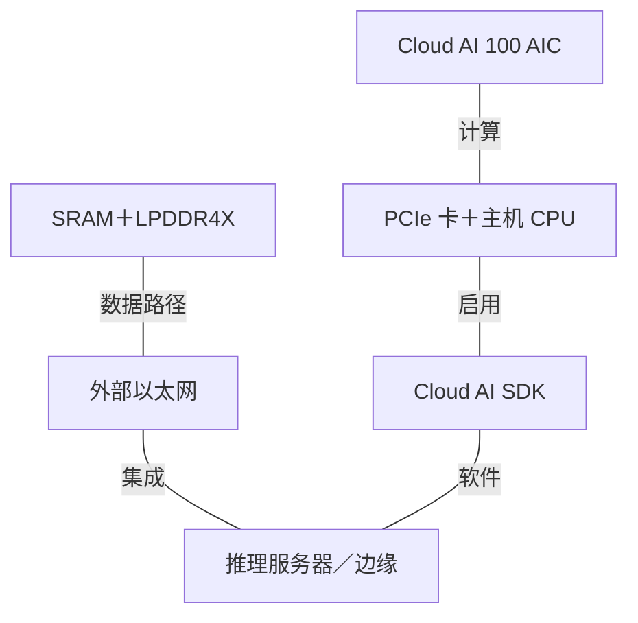
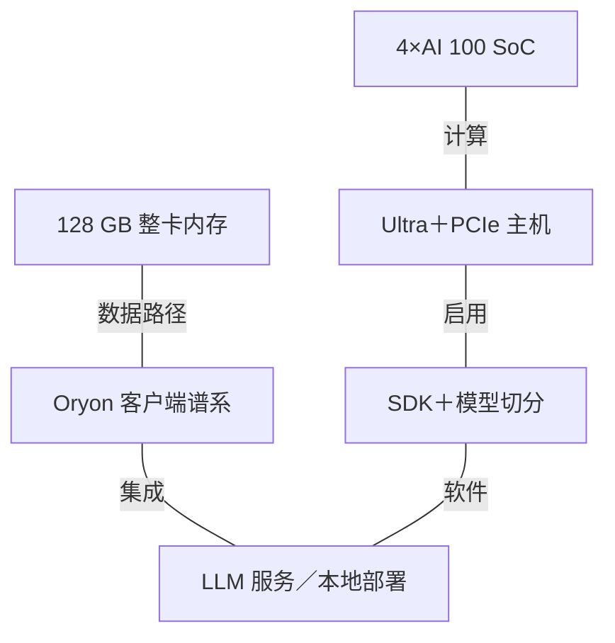
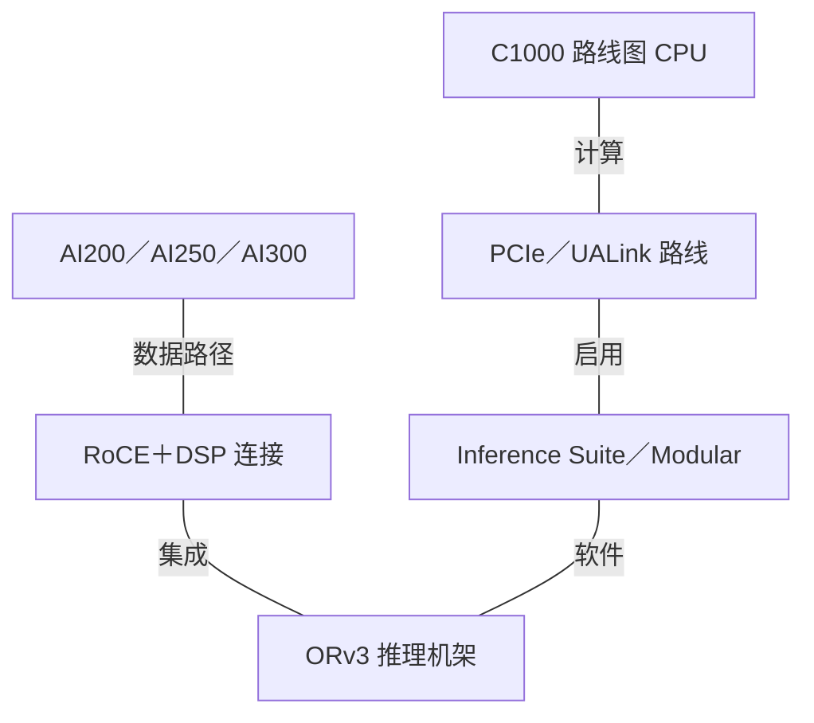

# Qualcomm AI 基础设施架构演进

2015-2026 | 2026-09-28

## 01 研究范围与执行摘要

产品权重：深入研究 Centriq／Oryon／Dragonfly CPU 和 Cloud AI／Dragonfly 加速器；完整覆盖数据中心高速连接；适度覆盖客户端、边缘和 RAN 衍生产品。
起点：2015 年，涵盖首轮服务器尝试与移动技术基线。
截止：2026 年 9 月 28 日，最新披露包括 Investor Day 和 AI Infra Summit 2026。
重点：CPU 谱系、推理数据流、内存容量与带宽、互联及机架集成。
不含：所有手机／调制解调器 SKU 的穷尽清单；已审阅产品版图未确立商用数据中心训练 GPU，或具有独立完整规格的 Qualcomm AI NIC。

Qualcomm 的基础设施史不是连续的服务器 CPU 换代。Centriq 是真正商用的 Arm 服务器处理器，但下一段重要 CPU 路线来自 Nuvia 衍生的 Oryon 客户端产品和未来的 Dragonfly C1000。与此同时，Cloud AI 100 建立专用推理架构，Ultra 通过多 SoC 卡提高模型容量，AI200／AI250／AI300 则将产品边界扩展到机架。来自 Alphawave 的连接技术和 Modular 的软件补齐了这一更广泛平台的部分能力。

其主要架构选择是提高推理效率，而不是复制通用训练 GPU。较大的本地容量可以减少模型切分，近内存执行可以降低解码时搬运权重的成本。但收益取决于数据流、模型放置与软件，因此 AI250 的 HBC 有效带宽必须与常规外部内存带宽区分。平台的长期 CPU 与加速器路线延伸至研究截止日期之后：C1000 计划于 2028 年下半年投产，并非 2026 年已商用服务器。

## 02 数值口径、产品边界与路线图状态

裸片、板卡、服务器和机架属于不同统计范围。Cloud AI 100 Ultra 包含四颗 SoC，其 128 GB 内存和 576 MB SRAM 均为整卡总量。AI200 的 43 TB 是四舍五入后的机架容量，768 GB 则属于每卡。机架功耗不等于板卡 TBP。带宽采用十进制 GB/s 或 TB/s，并明确链路方向；PCIe 标称带宽是未扣除协议开销的接口预算；以太网 Gb/s 与内存 GB/s 比较前必须先除以八。

统一加速器表保留稠密 BF16、FP8、FP6／FP4 和 FP64 字段。如果资料提供的是 FP16 或 INT8，则单独列示，不能换标签填入。n/d 表示未确定，n/a 表示不适用。产品发布、客户送样、演示和正式商用属于不同里程碑。特别是，AI200 在 2025 年发布时预测于 2026 年商用，而 2026 年投资者路线图标为 FY26 送样；已审阅的 9 月演示本身不能证明广泛 GA。

## 03 CPU 代际总览

### CPU 与相关客户端参考产品

| 代际／参考 SKU | 代号 | 正式商用 | 状态 | 核心微架构 | 核心／线程 | 各裸片工艺 | 裸片／封装 | 每核 L2 | L3／共享域 | 内存：通道；速率；GB/s | 插槽／互联 | PCIe／CXL | TDP | 向量／矩阵 ISA |
| --- | --- | --- | --- | --- | --- | --- | --- | --- | --- | --- | --- | --- | --- | --- |
| Centriq 2460 | Falkor | 2017-11 | 历史已商用 | Custom Armv8 | 48 / 48 | Samsung 10 nm | 单裸片；398 mm2；180 亿晶体管 | 双核心 duplex 共享；容量 n/d | 60 MB | DDR4；6 通道；2667 MT/s；约 128 GB/s | 1S; QSB internal | 32 PCIe 3; CXL n/a | 120 W | NEON; AArch64 |
| Snapdragon X Elite | Oryon | 2024 | 历史已商用 | Oryon 1 | 12 / 12 | 4 nm | 客户端 SoC；3 个 CPU 簇 | 12 MB／4 核簇 | 系统缓存口径不同 | LPDDR5X; 135 GB/s | 客户端 SoC；n/a | PCIe; CXL n/a | OEM 配置；n/d | Arm64; NEON |
| Snapdragon X2 Elite Extreme | X2E-96-100 | 2026 年系统 | 已商用／可获取 | Oryon 3 | 18 / 18 | 3 nm | 客户端 SoC；Prime＋Performance | n/d | CPU 总缓存 53 MB；并非全为 L3 | LPDDR5X; 192-bit; 228 GB/s | 客户端 SoC；n/a | PCIe; CXL n/a | OEM 配置；n/d | Arm64; 细节 n/d |
| Dragonfly C1000 | n/d | 目标 2028 年下半年 | 路线图 | Oryon server | 250+ / n/d | n/d | 芯粒架构 | n/d | n/d | LPDDR；通道数／速率 n/d | n/d | PCIe 7; CXL; lanes n/d | n/d | 服务器 ISA 细节 n/d |

客户端条目用于解释核心开发谱系，其内存、功耗和 I/O 不是服务器规格。C1000 不是插槽版 Snapdragon X2 Elite。收购 Ventana 也不意味着 C1000 是 RISC-V 处理器：Qualcomm 明确将 C1000 与 Oryon 服务器核心关联，而 Ventana 补充另一条 RISC-V 能力。本报告没有确认第二代商用 Centriq。

## 04 Centriq 与 Falkor：首轮服务器架构

Centriq 2400 于 2016 年开始送样，2017 年 11 月商业出货。Falkor 是自定义、单线程、仅支持 AArch64 的核心。Hot Chips 描述的发射路径可接受三条指令加一条直接分支，内部最多分派八个操作。双核 duplex 共享 L2 和 QSB 接口。分段双向一致性环采用最短路径路由；所报超过 250 GB/s 的聚合带宽属于内部互联，不能当作六通道 DDR 有效带宽。

duplex 的 L2 使用 128 字节缓存行和 ECC，并对 L1 数据缓存保持包含关系，披露的最小 L2 命中延迟为十五周期。分布式 L3 带有服务质量分配控制，适合许多独立租户共享插槽。六通道 DDR4 和 32 条 PCIe 3 通道构成当时较均衡的横向扩展服务器，但外部加速器连接预算明显小于后来的 AI 主机。48 核均分约 128 GB/s 通道带宽，在尚未计入竞争和协议影响前，每核约 2.67 GB/s。

发布资料明确三星 10 nm、180 亿晶体管和 398 mm2 单裸片。尽管已审阅资料未确认对应的完整 Centriq ISSCC 论文，这仍构成实现证据。OCP 2017 补充系统层联系：Qualcomm 与 Microsoft 展示了基于 Centriq 的 Open Compute 主板。这证明平台开发合作，不能证明 Azure 公共实例已正式商用。后续服务器路线中断，也说明不能从 Falkor 的技术质量推断商业连续性。

## 05 Oryon：通过客户端芯片重建 CPU 谱系

2021 年收购 Nuvia 后，Oryon CPU 出现在 Snapdragon X Elite 中，并于 2024 年进入商业 PC。Hot Chips 2024 及后续 IEEE Micro 文章构成架构依据。三个四核簇将较大的近核缓存与宽乱序执行结合；重点不仅是执行宽度，还包括指令供给、分支恢复和未完成访存操作。客户端实现证明了核心工程能力，但不代表已证明服务器 RAS、多插槽一致性或数据中心内存容量。

Qualcomm 的 Hot Chips 2024 幻灯片给出第一代 Oryon 的具体组织：192 KB 指令缓存、96 KB 数据缓存、每周期解码八条指令及提交八个微操作。六条整数与四条 128 位向量执行流水线支撑宽乱序机器。访存系统每周期最多处理四个操作，配有 192 项加载队列和 56 项存储队列。四核共享以 CPU 频率运行的 12 MB L2；三个簇通过互联连接 6 MB 系统级缓存及 135 GB/s LPDDR5X 接口。因此，宣传中的 42 MB 总缓存既不是每核缓存，也不是统一的末级缓存。

Oryon 随后进入移动产品，第三代核心又用于 Snapdragon X2 Elite。X2E-96-100 参考型号组合十二个 Prime 核心与六个 Performance 核心，具有 53 MB CPU 总缓存和 228 GB/s LPDDR5X 带宽。其 80 TOPS Hexagon NPU 是独立引擎，不是 CPU 向量吞吐。混合核心组织和 OEM 功耗范围属于客户端选择。对于服务器研究，重要的连续性是定制核心设计、缓存和电源管理经验，以及共同软件 ISA；C1000 的内存通道与主机接口仍须独立核验。

与 ISSCC／JSSC 相关的电路研究解释了 Qualcomm 能效积累的另一部分。Keith Bowman 的自适应时钟研究感知电源压降并调整时钟行为，避免持续付出最坏情况时序裕量。资料明确将其与 Snapdragon 820 联系，因而是研究进入产品的有效例子，但不能据此确认 Centriq、Oryon 或 C1000 使用完全相同电路。ISSCC 2025 的边缘生成式 AI 教程提供系统背景，并不是 Dragonfly 加速器的晶体管级披露。

## 06 Dragonfly C1000 与 RISC-V 分支

Investor Day 2026 公布基于芯粒的 C1000：超过 250 个自定义 Oryon 服务器核心，核心频率目标超过 5 GHz，支持 PCIe 7／CXL，并采用 LPDDR 内存子系统。可选 HBC 连接也属于已披露方向。与 Centriq 相比，变化十分显著：更大的封装级设计，以及面向智能体编排、通用云服务和加速器主节点的 CPU 定位。Meta 合作将首代投产时间设在 2028 年下半年，并计划后续代际。

超过 2 TB/s 的 I/O 宣传值在此不换算为通道数或单向有效载荷带宽，因为披露的方向与聚合口径不足。缓存大小、内存通道数、工艺分工、插槽一致性和 SKU TDP 仍是实质性披露缺口。LPDDR 可以降低内存能耗，但必须结合容量、可维护性、封装和板级拓扑评价。公布的频率和核心上限，并不能证明最终封装功耗约束下所有核心都能持续运行在该频率。

Qualcomm 于 2025 年 12 月收购 Ventana，在 Oryon 之外增加 RISC-V CPU 专长。Ventana 此前的 Veyron 计算芯粒工作作为被收购设计能力具有相关性，但已审阅 Qualcomm 公告没有定义已商用后继 SKU，也不能将其规格转移给 C1000。因此，产品版图应将两条指令集路线分开。可能共享的是物理设计、芯粒集成、验证和服务器软件工程，而不是二进制兼容性。

## 07 加速器代际总览

### 统一比较字段中的推理加速器

| 产品 | 架构 | 商用／里程碑 | 状态 | 工艺 | 裸片／封装 | 计算单元 | 稠密 BF16 | 稠密 FP8 | 稠密 FP6／FP4 | FP64 向量／矩阵 | 内存：类型；堆栈；GB；TB/s | 末级缓存／SRAM | 纵向扩展：链路；单向 GB/s；域 | 主机连接 | 功耗／散热 | 形态 |
| --- | --- | --- | --- | --- | --- | --- | --- | --- | --- | --- | --- | --- | --- | --- | --- | --- |
| Cloud AI 100 Standard | AIC | 2021 年系统 | 历史已商用 | 7 nm | 每卡 1 SoC | SKU 启用单元数 n/d | n/d | n/d | n/d | n/a | LPDDR4X；n/a；16；0.137 | 126 MB SRAM | PCIe；无独立纵向链路 | PCIe 4 x8 | 75 W | 半高半长 PCIe |
| Cloud AI 100 Pro | AIC | 2021 年系统 | 历史已商用 | 7 nm | 每卡 1 SoC | 16 AIC 标称 | n/d | n/d | n/d | n/a | LPDDR4X; n/a; 32; 0.137 | 144 MB SRAM | PCIe；依拓扑 | PCIe 4 x8 | 75 W | 半高半长 PCIe |
| Cloud AI 100 Ultra | 4 x AIC SoC | 2023-2024 | 已商用／可获取 | 7 nm | 4 SoC＋PCIe 交换机 | 标称 4×16 AIC | n/d | n/d | n/d | n/a | LPDDR4X; n/a; 128; 0.548 | 576 MB SRAM | 板载 PCIe 交换 | PCIe 4 x16 | 150 W | 全高、3/4 长 PCIe |
| Dragonfly AI200 | Inference ASIC | GA n/d | 送样／已演示 | n/d | n/d | n/d | n/d | n/d | n/d | n/d | LPDDR5X；n/a；每卡 768；推导约 7.39 | n/d | PCIe 6；链路数／带宽 n/d | PCIe; 细节 n/d | 整卡 n/d；机架 140 kW | 板卡／ORv3 机架 |
| Dragonfly AI250 | HBC Gen 1 | 2027 target | 路线图 | n/d | 近内存架构；裸片数 n/d | n/d | n/d | n/d | n/d | n/d | HBC；n/a；每卡 768；有效带宽 133 | n/d | PCIe 6；链路数／带宽 n/d | n/d | 整卡 n/d；风冷／DLC 机架 | 板卡／ORv3 机架 |
| Dragonfly AI300 | HBC Gen 2 | FY28 路线图 | 路线图 | n/d | n/d | n/d | n/d | n/d | n/d | n/d | HBC；容量 n/d；有效带宽目标为 AI200 的 54 倍 | n/d | UALink／ESUN 路线图；全互连 | n/d | n/d；液冷机架 | 机架平台 |

### 传统板卡公开算力口径

| 板卡 | FP16 TFLOP/s | INT8 TOPS | 额定功耗 | 来源口径 |
| --- | --- | --- | --- | --- |
| Standard | 110 | 325 | 75 W | SDK 1.12 SKU 表 |
| Pro | 125 | 375 | 75 W | SDK 1.12 SKU 表 |
| Ultra | 288 product / 290 SDK | 870 | 150 W | 保留文档修订／舍入小差异 |

## 08 Cloud AI 100：可编程推理数据流

2019 年发布之后，产品于 2020 年向特定客户出货，并在 2021 年进入商业系统活动。Hot Chips 2021 展示其推理架构。每个 AI 核心将张量、向量和标量工作分开：张量单元处理稠密线性代数，向量单元处理逐元素及其他非矩阵操作，多线程 VLIW 标量处理器协调执行。它不是 GPU 的 warp 执行机器；编译器需要显露并行性、调度数据移动，并在模型图中保持专用引擎忙碌。

SDK 描述每个标称 AI 核心具有 8 MB 向量紧耦合内存和 1 MB 共享 L2，十六个核心合计 144 MB 片上存储。计算、内存和配置网络分别服务不同流量类型。外部 LPDDR4X 提供容量，本地 SRAM 提供复用和可预测调度，因此 DMA 与分块是核心架构机制。能够在本地复用权重或激活的模型可以摊薄外部流量，而反复读取权重的大模型解码即使拥有可观张量算力，也可能受内存限制。

Standard、Pro 与早期 DM.2 变体面向不同功耗和部署范围。SoC 架构峰值、首发目标与商用板卡的额定时钟工作点不能互换，因此本报告用明确的 Standard／Pro SKU 表进行整卡比较。主机 PCIe 4 x8 在未扣除协议开销前单方向约为 15.75 GB/s，明显低于整卡 137 GB/s 内存带宽。因此，让模型状态驻留在卡上，比反复通过主机链路传输更有利。

## 09 Cloud AI 100 Ultra：通过复制增加容量

Ultra 在一张 150 W 板卡上组合四颗 Cloud AI 100 SoC 和一个 PCIe 交换机。每颗 SoC 具有本地内存，整卡合计 128 GB LPDDR4X、576 MB SRAM 和 548 GB/s 内存带宽总和。主机接口扩展为 PCIe 4 x16，每颗 SoC 通过 x8 连接交换机。将四颗芯片放在一块板上，并不会形成统一延迟的共享 SRAM，也不会让每个操作都能无约束地使用 548 GB/s；仍需要模型切分和通信调度。

2023 年产品明确面向生成式推理。其容量使部分大型量化模型可以驻留单卡，减少板卡数量以及跨主机／网络传输。这是模型放置优势，不是更高训练吞吐的证据。权重精度、KV 缓存、上下文长度和批量决定模型能否容纳。2025 年 NRP 的独立测量确认平台可用于实际 LLM 服务，但其能效比取决于模型、对照配置和利用率，不能作为通用芯片级效率常数。

## 10 AI200：推理机架成为产品

AI200 从低功耗 PCIe 卡扩展为机架级推理平台。公开配置包含 56 张卡、每卡 768 GB LPDDR、每机架约 43 TB，以及 0.414 PB/s 聚合内存带宽。ORv3 机架采用 PCIe 6 纵向扩展和以太网／RoCE 横向扩展，液冷配置功耗为 140 kW。将机架内存带宽除以 56，可得每卡算术平均约 7.39 TB/s，但这没有披露单裸片内存接口，也不保证每种数据放置都能获得相等带宽。

2026 年 9 月的演示将 Kimi-K2.5 放在单张 AI200 卡上，体现模型容量和软件进展，但不能据此确定持续吞吐、响应时间分布、模型精度或广泛客户可用性。较大容量可以减少权重分片，但 PCIe 纵向连接和 RoCE 仍需搬运激活、专家路由流量及集合通信数据。模型驻留和通信效率解决的是不同约束。

## 11 AI250 与 AI300：近内存执行

AI250 引入第一代 High Bandwidth Compute（HBC），公布每卡 133 TB/s、每机架 7.4 PB/s 的有效内存带宽，Qualcomm 将其描述为 AI200 有效带宽的十八倍。关键机制是将计算靠近内存，使有效运算不必像常规处理器那样，经外部内存总线读取每个操作数。有效带宽是一种工作负载／架构等效指标，若把它当作普通 HBM 引脚速率，就会得到误导性的 Roofline 比较。

自然目标是对内存敏感的解码和长上下文服务。预填充可能仍偏计算密集，因此分离两阶段可以改善资源匹配，但也增加传输与调度成本。HBC 的实际价值取决于哪些算子能在近内存执行、支持何种精度、跨内存分区的局部性，以及中间结果如何到达其他执行单元。公开投资者资料说明了方向，但电路、堆叠和裸片间细节不足以还原完整实现。

AI300 将路线扩展至第二代 HBC，计划使用 UALink／ESUN 纵向扩展、铜缆和光横向扩展，并以单跳全互连机架为目标。投资者路线图给出的有效带宽目标为 AI200 的五十四倍。这是未来架构目标，不是商用测量吞吐；C1000 被列为未来配套 CPU。已审阅资料尚未披露每卡链路速率、交换基数、报文语义、内存容量和完整功耗，因此本报告不虚构机架二分带宽。

## 12 高速连接：从 Alphawave 到 Dragonfly DSP

Alphawave 交易于 2025 年 12 月 18 日完成，早于最初预期的 2026 年。收购增加高速有线连接和定制芯片能力，对需要完整系统的机架平台十分重要。2026 年版图涵盖电 SerDes、裸片间接口、光 DSP、有源电缆重定时器和定制芯片。协议控制器、PHY、重定时器、光模块和完整 NIC 位于不同层次，不能合并为同一种 AI 网络产品。

Dragonfly O100／O200 属于 PAM4 光 DSP 家族，CO400 是 coherent-lite 16QAM 光 DSP，CU100／CU200 面向 PAM4 有源电缆。CU100 被描述为 4 nm 重定时器。100G／200G／400G 标签表示信号或产品等级，并不是完整 NIC 端口数规格。Investor Day 区分已量产的 800G 连接、2026-2027 年扩展的 1.6T，以及后续开发中的 3.2T。448G SerDes 路线同样是技术方向，不能证明已有每通道 448G 的商用机架。

### 网络与连接产品类别

| 产品 | 商用／里程碑 | 状态 | 类别 | 端口×速率 | SerDes | 主机接口 | 可编程引擎 | 嵌入式 CPU | 板载内存 | 传输／RDMA | 拥塞控制 | 主要卸载 | 功耗 |
| --- | --- | --- | --- | --- | --- | --- | --- | --- | --- | --- | --- | --- | --- |
| Dragonfly O100 | 2026 年产品组合 | 已公布；GA n/d | 光 DSP | n/a | 100G PAM4 级 | n/a | 信号处理；报文流水线 n/a | n/a | n/a | n/a | n/a | 光链路 DSP | n/d |
| Dragonfly O200 | 2026 年产品组合 | 已公布；GA n/d | 光 DSP | n/a | 200G PAM4 级 | n/a | DSP | n/a | n/a | n/a | n/a | 光链路 DSP | n/d |
| Dragonfly CO400 | 2026 年产品组合 | 已公布；GA n/d | 轻相干 DSP | n/a | 400G 16QAM | n/a | DSP | n/a | n/a | n/a | n/a | 更长距离光连接 | n/d |
| Dragonfly CU100 | 2026 年产品组合 | 已公布；GA n/d | AEC DSP；4 nm | n/a | 100G PAM4 | n/a | DSP | n/a | n/a | n/a | n/a | 电信号重定时 | n/d |
| Dragonfly CU200 | 2026 年产品组合 | 已公布；GA n/d | AEC DSP | n/a | 200G PAM4 | n/a | DSP | n/a | n/a | n/a | n/a | 电信号重定时 | n/d |
| Dragonwing X100 | 2021 disclosure | 已商用／可获取 | 5G RAN 内联加速器 | n/d | n/d | PCIe | 5G L1 软件 | n/d | n/d | O-RAN 前传；AI RDMA n/a | n/a | 基带 L1 处理 | n/d |

## 13 互联与系统拓扑

### 归一化互联边界

| 互联 | 年份／代际 | 通道速率 | 每链路通道 | 每链路单向 GB/s | 每设备链路 | 拓扑 | 域规模 | 一致性／语义 |
| --- | --- | --- | --- | --- | --- | --- | --- | --- |
| QSB | 2017 | n/a | n/a | n/d；内部聚合 >250 GB/s | n/a | 分段一致性环 | 48 cores | CPU／缓存／I/O 一致性 |
| Cloud AI 100 host | 2021 | 16 GT/s | 8 | ~15.75 | 1 | PCIe | 1 card | DMA／主机 I/O |
| Ultra host / local | 2023 | 16 GT/s | 16 host; 8/SoC | ~31.5 host; ~15.75/SoC | 4 SoC links | 板载 PCIe 交换机 | 4 SoCs | 分区本地内存；PCIe 搬移 |
| AI200 / AI250 scale-up | 2026-2027 | 64 GT/s | n/d | n/d | n/d | PCIe 6 | 机架方案；拓扑 n/d | 未确认缓存一致性 |
| AI300 UALink / ESUN | FY28 | n/d | n/d | n/d | n/d | 单跳全互连目标 | n/d | 协议细节 n/d |

### 系统参考范围

| 平台 | 年份／里程碑 | CPU／加速器数量 | 纵向扩展域 | 每加速器横向带宽 | 机架功耗 | 散热 |
| --- | --- | --- | --- | --- | --- | --- |
| Centriq OCP 主板 | 2017 | Centriq 2400 | 1 socket | n/a | n/d | 依服务器 |
| Ultra 推理服务器 | 2023-2025 | 主机 CPU＋PCIe 卡 | 每卡 4 SoC；依系统 | n/d | n/d | 风冷；依平台 |
| AI200 ORv3 | 2026 | 56 cards | PCIe 6 机架集成 | RoCE；每卡速率 n/d | 140 kW | DLC 参考；另披露风冷选项 |
| AI250 ORv3 | 2027 target | 43 TB 机架；此处卡数 n/d | PCIe 6 | RoCE；速率 n/d | n/d | 风冷／DLC |
| AI300 + C1000 | 2028 roadmap | 未来 CPU＋HBC 加速器 | 全互连目标 | n/d | n/d | 液冷 |

机架参考方案包含 NIC 与交换机，但已审阅产品页没有定义具有完整传输、拥塞控制和卸载细节的 Qualcomm 品牌 AI NIC。因此，应将 RoCE 标为系统传输，将 DSP 标为连接组件。信号重定时并不实现 RDMA、拥塞控制或集合通信加速；同样，参与 UALink 或拥有控制器 IP，也不能单独证明存在商用纵向扩展交换机 SKU。

## 14 Adreno、Hexagon、Dragonwing 与 RAN

Qualcomm 的 GPU 产品线是集成在 Snapdragon 等 SoC 中的 Adreno，承担图形和灵活的本地计算；它不是 Cloud AI 100 的架构名称。Hexagon 将 DSP、向量和张量能力用于边缘 AI，新产品更强调专用 NPU 执行。Snapdragon X 和移动 Oryon 产品体现 CPU、GPU、NPU 共享受限内存与散热范围。由于算子、格式和数据移动不同，不能简单将不同引擎峰值相加为模型可用吞吐。

Dragonwing 是工业／嵌入式和相关基础设施品牌，Dragonfly 是数据中心产品组合。Cloud AI 100 Ultra 也可用于本地推理设备，将边缘与数据中心路线连接起来，但不意味着所有嵌入式产品都是服务器加速器。X100 尤其容易混淆：Dragonwing X100 是处理 Layer 1 基带的 5G RAN 内联加速器，Cloud AI 100 才是 AI 推理家族。MWC 披露属于电信基础设施，不能作为 AI 训练互联的证据。

## 15 软件与学术证据

Cloud AI SDK 将模型编译与运行时执行分开，提供面向硬件的模型准备流程。未来 Dragonfly 软件栈增加 AI Inference Suite、基础设施管理、AIC 提前编译、QCCL、NPU-direct 和编排集成。Modular 收购于 2026 年 7 月完成；其已有跨硬件软件能力与未来 Dragonfly 优化应分别理解。收购公告或软件栈图不能证明每个算子和数值格式都已在每代加速器上生产就绪。

ASPLOS 2025 的 Fast On-device LLM Inference with NPUs 是有价值的实现导向研究：它划分变长提示，将量化异常值分配给不同引擎，并按 CPU／GPU／NPU 适配性调度模型块。它研究如何使用现有硬件，而不是披露未公开的 Dragonfly 微架构。ISCA 2023 的共享微指数研究和 OCP 微缩放论文解释低精度表示选择，但二者本身都不能证明 Cloud AI 100 芯片原生支持相关格式。研究资助、程序委员会任职，或使用 Snapdragon 手机的论文，都不等于产品披露。

### 软件时间线与启用边界

| 版本／组件 | 日期 | 启用硬件 | 主要功能 |
| --- | --- | --- | --- |
| Cloud AI SDK | 2021-2026 | Cloud AI 100 / Ultra | 编译、部署、性能分析；模型支持依版本 |
| AI Engine Direct / QNN | 2022-2026 | Snapdragon / Hexagon / Adreno | 端侧异构执行 |
| AI Inference Suite / AIMS | 2026 disclosure | Dragonfly | 服务、集群管理、QCCL 与 NPU-direct 路线 |
| Modular acquisition | 2026-07 | Cross-hardware AI software | 已完成收购；未来硬件启用单独核验 |

## 16 定量配比与部署取舍

### 明确统计范围的推导比例

| 配置 | 推导量 | 数值 | 解释 |
| --- | --- | --- | --- |
| Centriq 48C | DRAM／核；LLC／核 | ~2.67 GB/s; 1.25 MB | 理论均分 |
| AI 100 Pro | 内存带宽／FP16 峰值 | 0.001096 byte/FLOP | 137 GB/s ÷ 125 TFLOP/s；非 BF16 |
| AI 100 Ultra | 内存带宽／FP16 峰值 | 0.001903 byte/FLOP | 548 GB/s ÷ 产品规格 288 TFLOP/s |
| AI 100 Pro | 主机／本地内存带宽 | ~0.115 | 15.75 ÷ 137；单方向；主机原始链路 |
| AI 100 Ultra | 主机／本地内存带宽总和 | ~0.0575 | 31.5 ÷ 548；四个内存域 |
| AI200 | 每卡内存；每卡平均带宽 | 768 GB; ~7.39 TB/s | 414 TB/s ÷ 56 卡；不推断整卡功耗 |
| AI 100 Pro | FP16 峰值／额定 TDP | 1.67 TFLOP/s/W | 125 ÷ 75；非实测 tokens/W |
| AI 100 Ultra | FP16 峰值／额定 TDP | 1.92 TFLOP/s/W | 288 ÷ 150；非整机能耗 |

这些比例揭示产品取舍：相对 Pro，Ultra 将整卡内存容量增至四倍，额定功耗翻倍，但主机链路宽度仅翻倍，因此数据驻留更加重要。AI200 扩大集成单位和散热负担；AI250 则用不同内存计算组织解决解码数据搬移。缺少归一化输入时，稠密 BF16／FP8 的字节／FLOP、HBM 比例、每卡横向带宽与实测机架 tokens/W 均保留 n/d。用宣传倍数替代这些指标，只会掩盖架构问题。

## 17 会议与产品对应索引

### 已核验披露依据

| 会议／活动 | 年份 | 论文／演讲／披露 | 报告人／作者 | 产品 | 证据类型 | 来源 |
| --- | --- | --- | --- | --- | --- | --- |
| Hot Chips | 2017 | Qualcomm Centriq 2400 Processor / Falkor | Qualcomm | Centriq | 架构 | C01 E01 |
| Hot Chips | 2021 | Cloud AI 100: Scalable, High Performance and Low Latency Deep Learning Inference Accelerator | Qualcomm | Cloud AI 100 | 架构 | C06 P01 |
| Hot Chips / IEEE Micro | 2024 / 2025 | Snapdragon X Elite Qualcomm Oryon CPU: Design & Architecture Overview | Gerard Williams / Qualcomm | Oryon | 架构 | C07 C08 C02 |
| ISSCC / JSSC lineage | 2015 / 2016 | Auto-calibrating adaptive clock distribution | Keith Bowman et al. | 电路研究；与 Snapdragon 820 关联 | 电路研究 | C04 |
| ISSCC | 2025 | Generative AI on Edge Devices: Models, Hardware and Systems | Paul Whatmough | 边缘 AI 背景 | 教程 | C03 |
| ASPLOS | 2025 | Fast On-device LLM Inference with NPUs | Daliang Xu et al. | Snapdragon 类 NPU 应用 | 系统研究 | R04 |
| ISCA | 2023 | With Shared Microexponents, A Little Shifting Goes a Long Way | B. Rouhani et al. | 数值格式背景 | 相关研究 | R02 |
| OCP Summit | 2017 | Centriq Open Compute motherboard with Microsoft | Qualcomm / Microsoft | Centriq | 系统演示 | E12 |
| MWC-era announcement | 2021 | 5G DU X100 accelerator | Qualcomm | X100 RAN | 产品／系统 | E11 |
| Snapdragon Summit | 2023 / 2025 | X Elite / X2 Elite | Qualcomm | Oryon 客户端谱系 | 产品发布 | E17 P12 |
| Investor Day | 2026 | Dragonfly CPU, HBC, accelerators and connectivity | Tony Pialis | C1000 / AI200-300 / DSPs | 路线图／系统 | P08 E09 E10 |
| AI Infra Summit | 2026 | Dragonfly inference demonstrations | Qualcomm | AI200 | 演示 | E07 |

研究检查了 MICRO 和 HPCA，但已审阅记录没有确认这些会议上直接披露 Centriq、Cloud AI 或 Dragonfly 产品架构的一手论文。DAC 和 VLSI 可补充实现方法；OFC 与 Hot Interconnects 适合研究被收购的连接技术；Computex 和公司活动用于确定产品里程碑。AWS re:Invent、Microsoft Ignite、Google Cloud Next 和 GTC 必须有具体合作部署，才能作为证据。本报告不将一般生态参与写成产品演讲，也不宣称穷尽会议出席记录。

## 18 代号与产品对照

### 名称辨析

| 名称 | 产品身份 | 边界 |
| --- | --- | --- |
| Falkor | Centriq 2400 的定制 CPU 核心 | 不是 Neoverse，也不是 Oryon |
| Oryon | 定制 CPU 家族；客户端与未来服务器 | 客户端 SoC 不等于 C1000 |
| Cloud AI 100 / Ultra | 推理 ASIC 与 PCIe 卡 | 不是 Adreno GPU，也不是 X100 RAN |
| Dragonfly | 数据中心 CPU、加速器与连接品牌 | C1000／AI200／AI250／AI300／DSP |
| Dragonwing X100 | 5G 基带内联加速器 | 电信 L1 卸载 |
| HBC | 高带宽计算 | 近内存计算；不是 HBM 同义词 |

## 19 四个时代的整体产品栈

连线表示架构组成。路线图产品在系统图中仍是路线图，将两个未来产品画在一起并不表示已有商用平台。

### 2015-2018：横向扩展服务器尝试

概念性组成图，状态以产品章节为准；不推断外部 NIC 的设计归属。

### 2019-2022：推理加速卡

概念性组成图，状态以产品章节为准；不推断外部 NIC 的设计归属。

### 2023-2025：模型容量与新 CPU 核心

概念性组成图，状态以产品章节为准；不推断外部 NIC 的设计归属。

### 2026 年披露：未来机架产品组合

概念性组成图，状态以产品章节为准；不推断外部 NIC 的设计归属。

### 各时代带宽层次

| 时代／参考 | 片上／裸片间 | 本地内存 | CPU／纵向扩展 | 横向扩展 |
| --- | --- | --- | --- | --- |
| 2017 Centriq | QSB 聚合 >250 GB/s | ~128 GB/s DDR4 | PCIe 3; ~15.75 GB/s per x16 direction | 外部 NIC；n/d |
| 2021 AI 100 Pro | 3 类 NoC；聚合口径不归一化 | 137 GB/s | PCIe 4 x8 ~15.75 GB/s/direction | 外部 NIC；n/d |
| 2023 Ultra | 4 颗独立 SoC；PCIe 交换机 | 548 GB/s summed | PCIe 4 x16 ~31.5 GB/s/direction | 外部 NIC；n/d |
| 2026 Dragonfly disclosure | HBC 实现细节 n/d | AI200 每卡约 7.39 TB/s；AI250 有效带宽 133 | PCIe 6 / future UALink; n/d | RoCE；每卡带宽 n/d |

## 20 工程结论

Qualcomm 最强的连续性在于注重能耗的可编程计算和数据移动，而不是从未中断的服务器产品节奏。Centriq 提供真实服务器基线，Oryon 重建定制 CPU 能力，Cloud AI 100 提供独立推理引擎，Ultra 展示通过板级复制扩展容量。Dragonfly 的下一步更难：在机架级协调 CPU、近内存加速、高速连接、软件和散热。应以模型容纳能力、受延迟约束的 token 吞吐、通信开销和实测系统功耗评价，并将未来投产目标与当前能力分开。

## 来源映射

01 研究范围与执行摘要 — C01, E02, E05, E07, E08, E10, E14, P01, P05, P08

02 数值口径、产品边界与路线图状态 — E06, E07, P01, P04, P08

03 CPU 代际总览 — C01, C02, C07, C08, E01, E02, E10, E13, E16, P07, P08, P12

04 Centriq 与 Falkor：首轮服务器架构 — C01, E01, E02, E12

05 Oryon：通过客户端芯片重建 CPU 谱系 — C02, C03, C04, C05, C08, E15, P12

06 Dragonfly C1000 与 RISC-V 分支 — E10, E13, P07, P08

07 加速器代际总览 — E04, E05, E06, E07, P01, P02, P03, P04, P05, P06, P08

08 Cloud AI 100：可编程推理数据流 — C06, E03, E04, P01, P02

09 Cloud AI 100 Ultra：通过复制增加容量 — E05, P01, P03, R01

10 AI200：推理机架成为产品 — E07, P04

11 AI250 与 AI300：近内存执行 — P05, P06, P08

12 高速连接：从 Alphawave 到 Dragonfly DSP — E08, E11, P08, P09, P10, P11

13 互联与系统拓扑 — C01, E10, E12, P01, P04, P05, P06, P08, P09, R01

14 Adreno、Hexagon、Dragonwing 与 RAN — E11, P03, P11, P12, P14, R04

15 软件与学术证据 — E14, P01, P08, P13, P14, R02, R03, R04

16 定量配比与部署取舍 — C01, E02, P01, P03, P04, P05

17 会议与产品对应索引 — C01, C02, C03, C04, C06, C07, C08, E01, E07, E09, E10, E11, E12, E17, P01, P08, P12, R02, R04

18 代号与产品对照 — C01, C07, P01, P07, P08, P09, P11

19 四个时代的整体产品栈 — C01, E10, P01, P04, P05, P06, P08

20 工程结论 — C01, E10, E14, P01, P08

## 参考资料

### 产品与技术文档

[P01] Cloud AI 100 architecture, SDK 1.12. [https://quic.github.io/cloud-ai-sdk-pages/1.12/Getting-Started/Architecture/](https://quic.github.io/cloud-ai-sdk-pages/1.12/Getting-Started/Architecture/). 一手资料；访问截止 2026-09-28

[P02] Cloud AI 100 announcement and silicon specifications. [https://www.qualcomm.com/media/documents/files/qualcomm-cloud-ai-100-announcement.pdf](https://www.qualcomm.com/media/documents/files/qualcomm-cloud-ai-100-announcement.pdf). 一手资料；访问截止 2026-09-28

[P03] Cloud AI 100 Ultra specifications. [https://www.qualcomm.com/data-center/products/cloud-ai-100-ultra](https://www.qualcomm.com/data-center/products/cloud-ai-100-ultra). 一手资料；访问截止 2026-09-28

[P04] Dragonfly AI200 specifications. [https://www.qualcomm.com/data-center/products/qualcomm-dragonfly-ai200](https://www.qualcomm.com/data-center/products/qualcomm-dragonfly-ai200). 一手资料；访问截止 2026-09-28

[P05] Dragonfly AI250 specifications. [https://www.qualcomm.com/data-center/products/qualcomm-dragonfly-ai250](https://www.qualcomm.com/data-center/products/qualcomm-dragonfly-ai250). 一手资料；访问截止 2026-09-28

[P06] Dragonfly AI300 specifications. [https://www.qualcomm.com/data-center/products/qualcomm-dragonfly-ai300](https://www.qualcomm.com/data-center/products/qualcomm-dragonfly-ai300). 一手资料；访问截止 2026-09-28

[P07] Dragonfly C1000 specifications. [https://www.qualcomm.com/data-center/products/qualcomm-dragonfly-c1000](https://www.qualcomm.com/data-center/products/qualcomm-dragonfly-c1000). 一手资料；访问截止 2026-09-28

[P08] Investor Day 2026 Data Center presentation. [https://www.qualcomm.com/content/dam/qcomm-martech/dm-assets/documents/Investor-Day-2026_TPialis_Data-Center.pdf](https://www.qualcomm.com/content/dam/qcomm-martech/dm-assets/documents/Investor-Day-2026_TPialis_Data-Center.pdf). 一手资料；访问截止 2026-09-28

[P09] Dragonfly connectivity portfolio. [https://www.qualcomm.com/data-center/expertise/connectivity](https://www.qualcomm.com/data-center/expertise/connectivity). 一手资料；访问截止 2026-09-28

[P10] Dragonfly CU100 AEC DSP. [https://www.qualcomm.com/data-center/products/qualcomm-dragonfly-cu100](https://www.qualcomm.com/data-center/products/qualcomm-dragonfly-cu100). 一手资料；访问截止 2026-09-28

[P11] Dragonwing X100 RAN accelerator. [https://www.qualcomm.com/cellular-infrastructure/products/qualcomm-x100-5g-ran-accelerator-card](https://www.qualcomm.com/cellular-infrastructure/products/qualcomm-x100-5g-ran-accelerator-card). 一手资料；访问截止 2026-09-28

[P12] Snapdragon X2 Elite product brief. [https://www.qualcomm.com/content/dam/qcomm-martech/dm-assets/documents/Snapdragon-X2-Elite-Product-Brief.pdf](https://www.qualcomm.com/content/dam/qcomm-martech/dm-assets/documents/Snapdragon-X2-Elite-Product-Brief.pdf). 一手资料；访问截止 2026-09-28

[P13] Cloud AI SDK model architecture support. [https://quic.github.io/cloud-ai-sdk-pages/latest/Getting-Started/Model-Architecture-Support/](https://quic.github.io/cloud-ai-sdk-pages/latest/Getting-Started/Model-Architecture-Support/). 一手资料；访问截止 2026-09-28

[P14] Qualcomm AI Engine Direct SDK documentation. [https://docs.qualcomm.com/bundle/publicresource/topics/80-63442-50/introduction.html](https://docs.qualcomm.com/bundle/publicresource/topics/80-63442-50/introduction.html). 一手资料；访问截止 2026-09-28

### 会议记录与实现披露

[C01] Qualcomm Centriq 2400 Processor, Hot Chips 2017. [https://www.qualcomm.com/content/dam/qcomm-martech/dm-assets/documents/qualcomm_centriq_2400_hotchips_final_0.pdf](https://www.qualcomm.com/content/dam/qcomm-martech/dm-assets/documents/qualcomm_centriq_2400_hotchips_final_0.pdf). 一手资料；访问截止 2026-09-28

[C02] Qualcomm Oryon CPU in Snapdragon X Elite: Micro-Architecture and Design, IEEE Micro 2025. [https://ieeexplore.ieee.org/abstract/document/11002606](https://ieeexplore.ieee.org/abstract/document/11002606). 官方索引或相关发布资料；完整文档未能下载。

[C03] ISSCC 2025 advance program: Generative AI on Edge Devices tutorial. [https://www.isscc.org/s/ISSCC2025AdvanceProgram.pdf](https://www.isscc.org/s/ISSCC2025AdvanceProgram.pdf). 官方会议新闻资料；不是论文全文。

[C04] Adaptive and Resilient Circuits for Processors: Keith Bowman lecture. [https://www.ece.uw.edu/colloquia/adaptive-and-resilient-circuits-for-processors/](https://www.ece.uw.edu/colloquia/adaptive-and-resilient-circuits-for-processors/). 一手资料；访问截止 2026-09-28

[C05] Hot Chips 2024 conference program: Oryon. [https://hc2024.hotchips.org/](https://hc2024.hotchips.org/). 官方索引或相关发布资料；完整文档未能下载。

[C06] Hot Chips 2021 conference program: Cloud AI 100. [https://hc33.hotchips.org/](https://hc33.hotchips.org/). 官方索引或相关发布资料；完整文档未能下载。

[C07] Snapdragon X Elite product brief and Oryon configuration. [https://www.qualcomm.com/content/dam/qcomm-martech/dm-assets/images/company/news-media/media-center/press-kits/snapdragon-summit-2023/documents/SnapdragonXEliteProductBrief.pdf](https://www.qualcomm.com/content/dam/qcomm-martech/dm-assets/images/company/news-media/media-center/press-kits/snapdragon-summit-2023/documents/SnapdragonXEliteProductBrief.pdf). 一手资料；访问截止 2026-09-28

[C08] Qualcomm-authored Hot Chips 2024 Oryon architecture slides, reproduced by ServeTheHome. [https://www.servethehome.com/snapdragon-x-elite-qualcomm-oryon-cpu-design-and-architecture-hot-chips-2024-arm/](https://www.servethehome.com/snapdragon-x-elite-qualcomm-oryon-cpu-design-and-architecture-hot-chips-2024-arm/). 一手资料；访问截止 2026-09-28

### 研究论文与出版目录

[R01] Serving LLMs in HPC Clusters: A Comparative Study of Qualcomm Cloud AI 100 Ultra and NVIDIA Data Center GPUs. [https://arxiv.org/abs/2507.00418](https://arxiv.org/abs/2507.00418). 一手资料；访问截止 2026-09-28

[R02] With Shared Microexponents, A Little Shifting Goes a Long Way. [https://arxiv.org/abs/2302.08007](https://arxiv.org/abs/2302.08007). 一手资料；访问截止 2026-09-28

[R03] Microscaling Data Formats for Deep Learning. [https://arxiv.org/abs/2310.10537](https://arxiv.org/abs/2310.10537). 一手资料；访问截止 2026-09-28

[R04] Fast On-device LLM Inference with NPUs, ASPLOS 2025. [https://xumengwei.github.io/files/ASPLOS25-NPU.pdf](https://xumengwei.github.io/files/ASPLOS25-NPU.pdf). 一手资料；访问截止 2026-09-28

### 发布、生态与部署

[E01] Introducing Falkor, Hot Chips 2017. [https://www.qualcomm.com/news/onq/2017/08/introducing-qualcomm-falkor-cpu-core-purpose-built-cloud-workloads](https://www.qualcomm.com/news/onq/2017/08/introducing-qualcomm-falkor-cpu-core-purpose-built-cloud-workloads). 一手资料；访问截止 2026-09-28

[E02] Centriq 2400 commercial shipment, 2017. [https://www.qualcomm.com/news/releases/2017/11/qualcomm-datacenter-technologies-announces-commercial-shipment-qualcomm](https://www.qualcomm.com/news/releases/2017/11/qualcomm-datacenter-technologies-announces-commercial-shipment-qualcomm). 一手资料；访问截止 2026-09-28

[E03] Cloud AI 100 launch, 2019. [https://www.qualcomm.com/news/releases/2019/04/qualcomm-brings-power-efficient-artificial-intelligence-inference](https://www.qualcomm.com/news/releases/2019/04/qualcomm-brings-power-efficient-artificial-intelligence-inference). 一手资料；访问截止 2026-09-28

[E04] Cloud AI 100 first customer shipments, 2020. [https://www.qualcomm.com/news/releases/2020/09/qualcomm-announces-first-shipments-qualcomm-cloud-ai-100-accelerator-and](https://www.qualcomm.com/news/releases/2020/09/qualcomm-announces-first-shipments-qualcomm-cloud-ai-100-accelerator-and). 一手资料；访问截止 2026-09-28

[E05] Cloud AI 100 Ultra launch, 2023. [https://www.qualcomm.com/news/onq/2023/11/introducing-qualcomm-cloud-ai-100-ultra](https://www.qualcomm.com/news/onq/2023/11/introducing-qualcomm-cloud-ai-100-ultra). 一手资料；访问截止 2026-09-28

[E06] AI200 and AI250 announcement, October 2025. [https://www.qualcomm.com/news/releases/2025/10/qualcomm-unveils-ai200-and-ai250-redefining-rack-scale-data-cent](https://www.qualcomm.com/news/releases/2025/10/qualcomm-unveils-ai200-and-ai250-redefining-rack-scale-data-cent). 一手资料；访问截止 2026-09-28

[E07] Dragonfly at AI Infra Summit 2026. [https://www.qualcomm.com/news/onq/2026/09/qualcomm-dragonfly-ai-infra-summit-2026](https://www.qualcomm.com/news/onq/2026/09/qualcomm-dragonfly-ai-infra-summit-2026). 一手资料；访问截止 2026-09-28

[E08] Alphawave acquisition completion, SEC note. [https://www.sec.gov/Archives/edgar/data/804328/000080432826000061/R14.htm](https://www.sec.gov/Archives/edgar/data/804328/000080432826000061/R14.htm). 一手资料；访问截止 2026-09-28

[E09] Qualcomm Dragonfly roadmap announcement, June 2026 (company release). [https://www.nasdaq.com/press-release/qualcomm-unveils-comprehensive-data-center-roadmap-agentic-ai-era-new-qualcomm](https://www.nasdaq.com/press-release/qualcomm-unveils-comprehensive-data-center-roadmap-agentic-ai-era-new-qualcomm). 一手资料；访问截止 2026-09-28

[E10] Qualcomm and Meta C1000 agreement (company release). [https://www.nasdaq.com/press-release/qualcomm-and-meta-announce-strategic-multi-generation-agreement-data-center-cpus-2026](https://www.nasdaq.com/press-release/qualcomm-and-meta-announce-strategic-multi-generation-agreement-data-center-cpus-2026). 一手资料；访问截止 2026-09-28

[E11] X100 5G DU accelerator introduction, MWC 2021. [https://www.qualcomm.com/news/releases/2021/06/qualcomm-introduces-new-5g-distributed-unit-accelerator-card-drive-global](https://www.qualcomm.com/news/releases/2021/06/qualcomm-introduces-new-5g-distributed-unit-accelerator-card-drive-global). 一手资料；访问截止 2026-09-28

[E12] Qualcomm Centriq Open Compute motherboard with Microsoft, 2017. [https://investor.qualcomm.com/news-events/press-releases/news-details/2017/Qualcomm-Collaborates-with-Microsoft-to-Accelerate-Cloud-Services-on-10nm-Qualcomm-Centriq-2400-Platform-03-08-2017/default.aspx](https://investor.qualcomm.com/news-events/press-releases/news-details/2017/Qualcomm-Collaborates-with-Microsoft-to-Accelerate-Cloud-Services-on-10nm-Qualcomm-Centriq-2400-Platform-03-08-2017/default.aspx). 官方索引或相关发布资料；完整文档未能下载。

[E13] Qualcomm acquisition of Ventana, December 2025. [https://www.qualcomm.com/news/releases/2025/12/qualcomm-acquires-ventana-micro-systems--deepening-risc-v-cpu-ex](https://www.qualcomm.com/news/releases/2025/12/qualcomm-acquires-ventana-micro-systems--deepening-risc-v-cpu-ex). 一手资料；访问截止 2026-09-28

[E14] Qualcomm completes Modular acquisition, July 2026. [https://www.qualcomm.com/news/releases/2026/07/qualcomm-completes-acquisition-of-modular](https://www.qualcomm.com/news/releases/2026/07/qualcomm-completes-acquisition-of-modular). 一手资料；访问截止 2026-09-28

[E15] Qualcomm completes NUVIA acquisition, March 2021. [https://s204.q4cdn.com/645488518/files/doc_news/2021/03/2021-03-16_Qualcomm_Completes_Acquisition_of_1304.pdf](https://s204.q4cdn.com/645488518/files/doc_news/2021/03/2021-03-16_Qualcomm_Completes_Acquisition_of_1304.pdf). 一手资料；访问截止 2026-09-28

[E16] Snapdragon X2 commercial PC lineup, April 2026. [https://www.qualcomm.com/snapdragon/news/explore-the-lineup-of-new-next-gen-pcs-powered-by-snapdragon-x2-](https://www.qualcomm.com/snapdragon/news/explore-the-lineup-of-new-next-gen-pcs-powered-by-snapdragon-x2-). 一手资料；访问截止 2026-09-28

[E17] Snapdragon X Elite introduction, Summit 2023. [https://www.qualcomm.com/news/releases/2023/10/qualcomm-unleashes-snapdragon-x-elite--the-ai-super-charged-plat](https://www.qualcomm.com/news/releases/2023/10/qualcomm-unleashes-snapdragon-x-elite--the-ai-super-charged-plat). 一手资料；访问截止 2026-09-28
