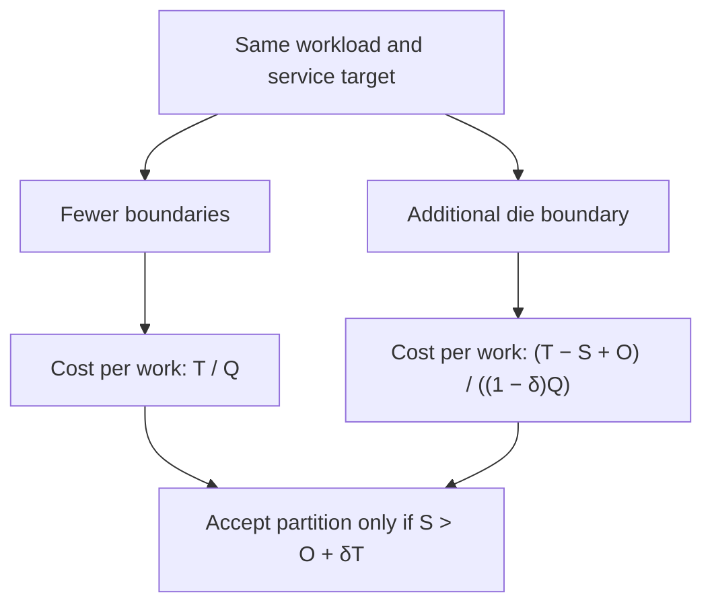

# Chiplets Save Silicon. The Fleet Pays for the Boundary.

An illustrative \$200 purchase-price saving is erased by a 2% useful-throughput loss on a system with \$10,000 of lifetime cost—even before additional operating expenses. Smaller-die yield economics remain valid. Treating their savings as permission to cut another architectural boundary is dead at that crossover.

The stale heuristic minimizes silicon cost first and asks software to recover locality later. It works when communication is cheap enough and manufacturing savings reach the buyer. Neither condition follows from a successful tapeout. A vendor can improve gross margin while the operator pays the same price for a more demanding topology.

Compare two feasible partitions at the same workload mix, service target, and operating horizon. Let the less disaggregated design cost $T$ and deliver $Q$ units of useful work. The additional partition yields net purchase savings $S$, incurs other incremental lifetime costs $O$, and reduces useful work by fraction $\delta$. Include extra energy in $O$, but exclude costs already reflected in $S$ and replacement capacity purchased to recover $\delta$: that loss already appears in the denominator. Then:

$$
\frac{T-S+O}{(1-\delta)Q}<\frac{T}{Q}
\quad\Longleftrightarrow\quad
S>O+\delta T.
$$

The ratio that matters is $\delta T/S$: a small performance penalty can consume a large fraction of a modest component saving. The example describes a boundary condition, not a measured processor comparison. Partitions that increase useful throughput can readily win; a monolith that cannot be manufactured is no alternative at all.

UCIe 3.0 supports 64 GT/s, compared with 32 GT/s for UCIe 2.0. That increases available link capacity; it does not establish transaction latency, contention behavior, or the fleet's $\delta$. Those remain properties of the implementation and workload. [UCIe Consortium specifications](https://www.uciexpress.org/specifications)

The local patch is an expanding contract with the scheduler: pin threads, bind pages, replicate shared data, and keep communicating workers together. These techniques can recover substantial performance. The asymmetry appears when a fixed purchase saving depends on locality surviving every workload revision, consolidation decision, and failover. Replication consumes memory; stricter placement strands capacity; overloaded links amplify latency tails. Recovery can require spare servers precisely when disruption has made them scarce.

Partition policy therefore belongs in joint silicon–fleet planning, with visibility into packaging cost, memory placement, traffic matrices, and deployment economics before the boundary freezes. Price each candidate cut against representative workloads and stressed placements. Preserve tightly coupled state inside the appropriate latency domain; expose unavoidable domains to admission control and scheduling. Negotiate buyer savings against measured productive capacity. A standardized interface enables the partition; it does not select the economically correct one.

The observability contract must include per-link payload and coherence bytes, credit-stall cycles, queue-delay distributions, and sampled memory-service latency tagged by requester and destination domain. Correlate these with package power and SLO-compliant work by workload. Raw link utilization cannot distinguish useful transfers from retries or reveal which service pays for congestion. Without attribution and controlled placement experiments, a topology regression can masquerade as insufficient cores and trigger another fleet purchase.

Does your next die boundary save more than the useful fleet capacity it consumes?
