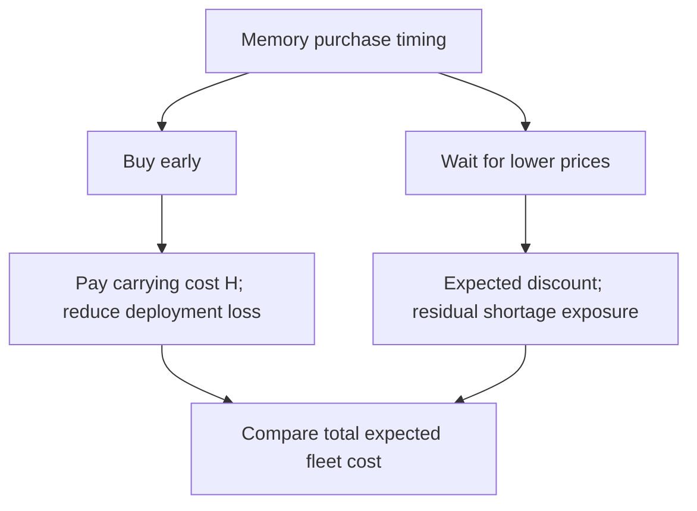

# The Cheapest Memory Can Strand the Most Expensive Compute

A hypothetical \$2 million saving on a \$20 million memory order disappears against \$6 million of expected deployment loss. Commodity price discipline still works; a purchasing policy that ignores the compute blocked behind missing memory no longer does.

The stale heuristic rewards lower dollars per gigabyte and fewer inventory days. It assumes that qualified memory will remain available when deployment requires it. Once that assumption fails, the denominator changes: each missing gigabyte can withhold productive capacity from processors, network equipment, and already provisioned facilities.

The physical coupling is explicit. Micron reported in June 2024 that HBM3E required approximately three times the wafer supply of DDR5 for equal bit output on the same process node. Expanding bandwidth-rich memory therefore competes for manufacturing resources serving ordinary server memory. [Micron Q3 FY2024 presentation](https://micron.gcs-web.com/static-files/a531c7f0-fca2-48f3-8f24-79c945aaa2d2)

Let $M$ be the required quantity, $P_0$ today's unit price, and $E[P_1]$ the expected later price for equivalent qualified supply. Let $H$ include incremental financing, storage, and expected obsolescence costs from buying early. Let $E[L]$ be the expected deployment loss avoided by buying early, after feasible substitutions and rescheduling. Earlier purchasing wins when:

$$
E[L] > M\bigl(P_0-E[P_1]\bigr)+H
$$

With \$0.4 million of carrying cost, the opening example compares \$6 million against \$2.4 million. The loss term must count incremental economic damage consistently; charging both the entire stranded asset value and its foregone output would inflate the case.

The local patch is emergency expediting, broker purchases, and qualification under deadline pressure. Each can rescue a shipment. A procurement process built around these exceptions accumulates asymmetric exposure: a modest price saving on the purchase ledger can create a much larger deployment shortfall elsewhere. Uncoordinated safety stocks create the opposite failure, tying capital to memory that the next platform cannot use.

Move the policy into fleet capacity planning, with architecture, procurement, and finance sharing the same deployment schedule and qualified substitution map. The object being purchased is memory of a specified capability, available at a specified date. Price follows that service requirement.

- Physical commitments and appropriately sized inventory protect delivery, subject to supplier execution.
- Price collars or cash-settled hedges manage financial exposure; their effectiveness depends on contract terms and how closely the reference price tracks the required memory.

A hedge payout cannot install a missing DIMM. In June 2026, Micron reported 16 strategic customer agreements and projected \$22 billion in deposits and related financial commitments. Those commitments demonstrate that customers are assigning capital to supply assurance; they do not establish that every agreement is economical. [Micron Q3 FY2026 prepared remarks](https://s25.q4cdn.com/621799436/files/doc_financials/2026/q3/Q3-FY26-Prepared-Remarks.pdf)

The missing dashboard joins executable prices, qualified availability, delivery confidence, and dependent compute capacity by deployment date. A generic DRAM index cannot expose that dependency. Without it, procurement can report savings while operations silently loses server-months of productive service.

Does your memory procurement scorecard measure the discount captured, or the productive fleet capacity its timing puts at risk?
