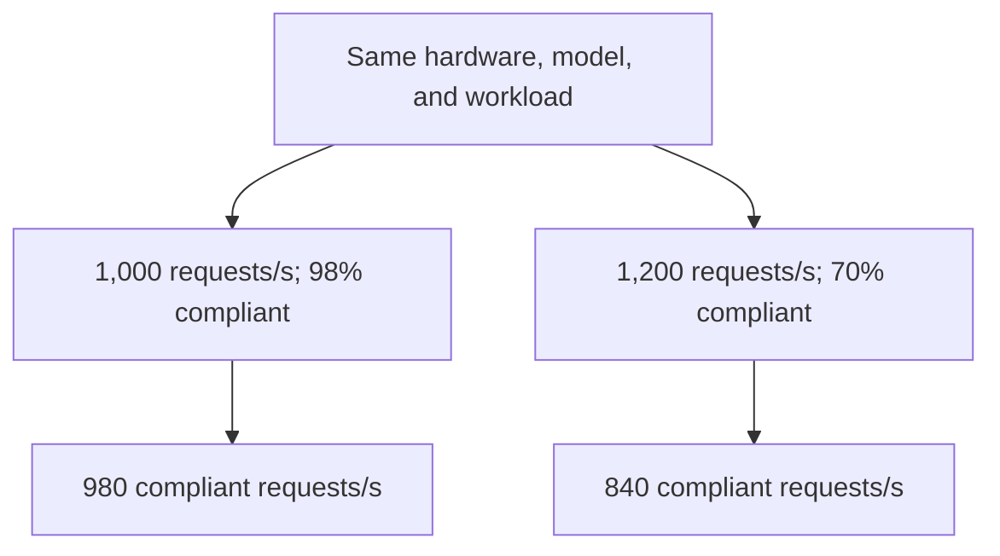

# High MFU Can Hide Expensive Tokens

At an illustrative serving cost of \$1 per second, 980 compliant requests per second cost \$1.02 per thousand; 840 cost \$1.19. The second configuration processes 20% more raw requests on identical hardware, model, precision, and request mix, yet costs 17% more per compliant request. Its kernels remain correct; utilization as a sufficient economic objective has failed.

The inherited heuristic is to increase batch size until expensive accelerators stay busy. Model FLOPs utilization measures achieved model arithmetic against theoretical peak arithmetic; it is neither GPU occupancy nor customer value. Better batching can raise arithmetic efficiency while increasing queueing or delaying active decodes. Holding output quality and workload fixed, that trade becomes destructive when missed deadlines outgrow throughput gains.

Let $R$ be completed requests per second, $s$ the fraction meeting both time-to-first-token and time-per-output-token requirements, and $C$ total serving cost per second. Compliant goodput is $G=Rs$; configuration 2 loses economically when:

$$
\frac{R_2s_2}{C_2}<\frac{R_1s_1}{C_1}
\quad\Longleftrightarrow\quad
\frac{s_2}{s_1}<\frac{R_1}{R_2}\frac{C_2}{C_1}.
$$

Deadline compliance here defines a contracted service unit; it does not claim every late response has zero human value. Requests must also remain comparable in prompt length, output length, and quality. Otherwise a scheduler can appear efficient simply by favoring cheap requests.

The local patch is familiar: cap batches, chunk prefills, prioritize decodes, then add exceptions for long prompts. These mechanisms can work well. Sarathi-Serve demonstrates that chunked prefill and carefully constructed schedules improve serving capacity under latency constraints. The failure begins when isolated heuristics become the governing objective: each component protects its own metric while transferring delay downstream. Decode protection can lengthen prefill queues; aggressive admission can exhaust KV capacity. [Sarathi-Serve, OSDI 2024](https://www.usenix.org/conference/osdi24/presentation/agrawal)

Policy belongs in a scheduler that sees deadlines, phase demand, HBM capacity, network topology, and resource cost together. It should choose admission, batching, placement, and phase separation against compliant goodput per dollar. DistServe demonstrates the value of separating prefill and decode and jointly planning resources and placement around their distinct latency requirements and the available communication bandwidth. [DistServe, OSDI 2024](https://www.usenix.org/conference/osdi24/presentation/zhong-yinmin)

Disaggregation is therefore a conditional choice. Exposed KV transfer, extra replication, and stranded capacity must earn their cost through reduced interference or better resource assignment. A separated deployment that wins tokens per second but loses compliant goodput per dollar has moved the bottleneck without improving the business.

The diagnostic requirement is an end-to-end request trace linking queue residence, prefill execution, KV transfer, decode scheduling gaps, and deadline misses to the resources consumed. Aggregate MFU cannot supply that attribution, and hardware counters alone cannot reconstruct scheduling causality. Measure the joint latency distribution: adding independently reported p99 stage latencies does not produce an end-to-end p99. Without this visibility, a fleet can purchase additional accelerators to compensate for deadlines its own scheduling policy destroys.

Does your admission controller maximize work completed within the service contract, or merely keep the accelerators busy while requests become late?
