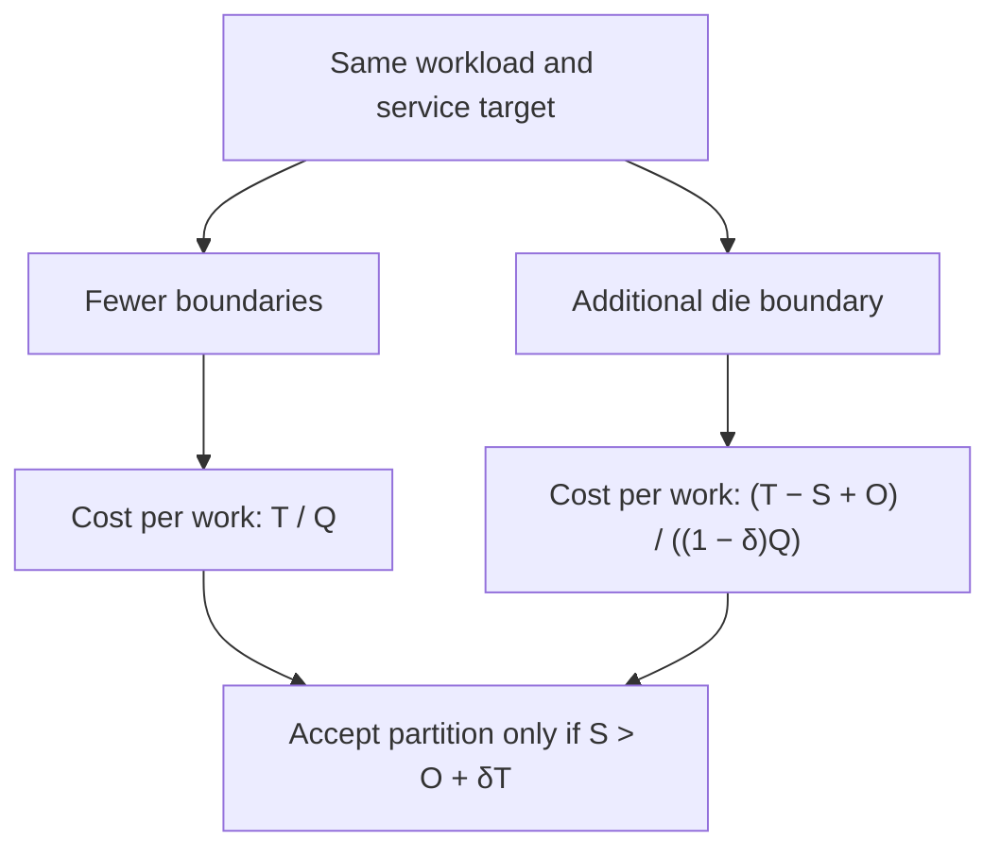
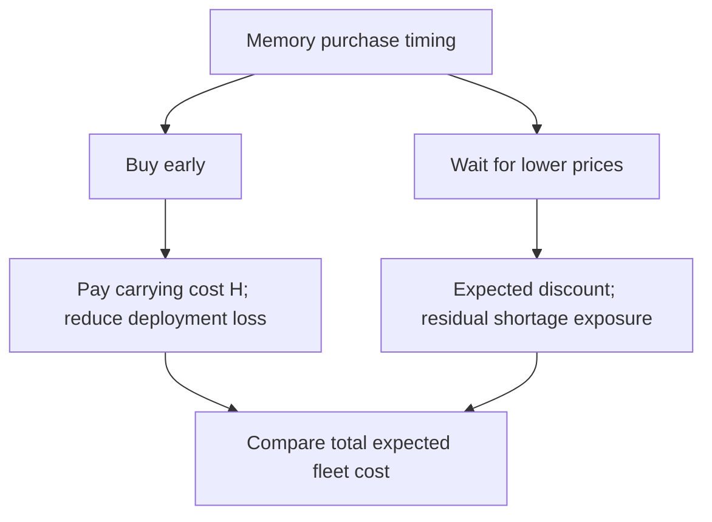
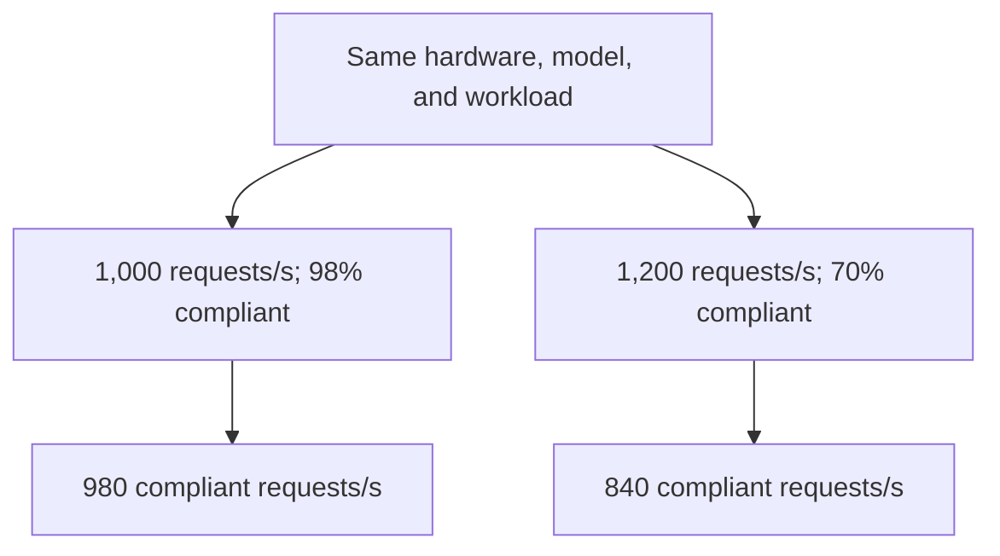

# Chiplets Save Silicon. The Fleet Pays for the Boundary.

An illustrative \$200 purchase-price saving is erased by a 2% useful-throughput loss on a system with \$10,000 of lifetime cost—even before additional operating expenses. Smaller-die yield economics remain valid. Treating their savings as permission to cut another architectural boundary is dead at that crossover.

The stale heuristic minimizes silicon cost first and asks software to recover locality later. It works when communication is cheap enough and manufacturing savings reach the buyer. Neither condition follows from a successful tapeout. A vendor can improve gross margin while the operator pays the same price for a more demanding topology.

Compare two feasible partitions at the same workload mix, service target, and operating horizon. Let the less disaggregated design cost $T$ and deliver $Q$ units of useful work. The additional partition yields net purchase savings $S$, incurs other incremental lifetime costs $O$, and reduces useful work by fraction $\delta$. Include extra energy in $O$, but exclude costs already reflected in $S$ and replacement capacity purchased to recover $\delta$: that loss already appears in the denominator. Then:

$$
\frac{T-S+O}{(1-\delta)Q}<\frac{T}{Q}
\quad\Longleftrightarrow\quad
S>O+\delta T.
$$

The ratio that matters is $\delta T/S$: a small performance penalty can consume a large fraction of a modest component saving. The example describes a boundary condition, not a measured processor comparison. Partitions that increase useful throughput can readily win; a monolith that cannot be manufactured is no alternative at all.

UCIe 3.0 supports 64 GT/s, compared with 32 GT/s for UCIe 2.0. That increases available link capacity; it does not establish transaction latency, contention behavior, or the fleet's $\delta$. Those remain properties of the implementation and workload. [UCIe Consortium specifications](https://www.uciexpress.org/specifications)

The local patch is an expanding contract with the scheduler: pin threads, bind pages, replicate shared data, and keep communicating workers together. These techniques can recover substantial performance. The asymmetry appears when a fixed purchase saving depends on locality surviving every workload revision, consolidation decision, and failover. Replication consumes memory; stricter placement strands capacity; overloaded links amplify latency tails. Recovery can require spare servers precisely when disruption has made them scarce.

Partition policy therefore belongs in joint silicon–fleet planning, with visibility into packaging cost, memory placement, traffic matrices, and deployment economics before the boundary freezes. Price each candidate cut against representative workloads and stressed placements. Preserve tightly coupled state inside the appropriate latency domain; expose unavoidable domains to admission control and scheduling. Negotiate buyer savings against measured productive capacity. A standardized interface enables the partition; it does not select the economically correct one.

The observability contract must include per-link payload and coherence bytes, credit-stall cycles, queue-delay distributions, and sampled memory-service latency tagged by requester and destination domain. Correlate these with package power and SLO-compliant work by workload. Raw link utilization cannot distinguish useful transfers from retries or reveal which service pays for congestion. Without attribution and controlled placement experiments, a topology regression can masquerade as insufficient cores and trigger another fleet purchase.

Does your next die boundary save more than the useful fleet capacity it consumes?

---

# The Cheapest Memory Can Strand the Most Expensive Compute

A hypothetical \$2 million saving on a \$20 million memory order disappears against \$6 million of expected deployment loss. Commodity price discipline still works; a purchasing policy that ignores the compute blocked behind missing memory no longer does.

The stale heuristic rewards lower dollars per gigabyte and fewer inventory days. It assumes that qualified memory will remain available when deployment requires it. Once that assumption fails, the denominator changes: each missing gigabyte can withhold productive capacity from processors, network equipment, and already provisioned facilities.

The physical coupling is explicit. Micron reported in June 2024 that HBM3E required approximately three times the wafer supply of DDR5 for equal bit output on the same process node. Expanding bandwidth-rich memory therefore competes for manufacturing resources serving ordinary server memory. [Micron Q3 FY2024 presentation](https://micron.gcs-web.com/static-files/a531c7f0-fca2-48f3-8f24-79c945aaa2d2)

Let $M$ be the required quantity, $P_0$ today's unit price, and $E[P_1]$ the expected later price for equivalent qualified supply. Let $H$ include incremental financing, storage, and expected obsolescence costs from buying early. Let $E[L]$ be the expected deployment loss avoided by buying early, after feasible substitutions and rescheduling. Earlier purchasing wins when:

$$
E[L] > M\bigl(P_0-E[P_1]\bigr)+H
$$

With \$0.4 million of carrying cost, the opening example compares \$6 million against \$2.4 million. The loss term must count incremental economic damage consistently; charging both the entire stranded asset value and its foregone output would inflate the case.

The local patch is emergency expediting, broker purchases, and qualification under deadline pressure. Each can rescue a shipment. A procurement process built around these exceptions accumulates asymmetric exposure: a modest price saving on the purchase ledger can create a much larger deployment shortfall elsewhere. Uncoordinated safety stocks create the opposite failure, tying capital to memory that the next platform cannot use.

Move the policy into fleet capacity planning, with architecture, procurement, and finance sharing the same deployment schedule and qualified substitution map. The object being purchased is memory of a specified capability, available at a specified date. Price follows that service requirement.

- Physical commitments and appropriately sized inventory protect delivery, subject to supplier execution.
- Price collars or cash-settled hedges manage financial exposure; their effectiveness depends on contract terms and how closely the reference price tracks the required memory.

A hedge payout cannot install a missing DIMM. In June 2026, Micron reported 16 strategic customer agreements and projected \$22 billion in deposits and related financial commitments. Those commitments demonstrate that customers are assigning capital to supply assurance; they do not establish that every agreement is economical. [Micron Q3 FY2026 prepared remarks](https://s25.q4cdn.com/621799436/files/doc_financials/2026/q3/Q3-FY26-Prepared-Remarks.pdf)

The missing dashboard joins executable prices, qualified availability, delivery confidence, and dependent compute capacity by deployment date. A generic DRAM index cannot expose that dependency. Without it, procurement can report savings while operations silently loses server-months of productive service.

Does your memory procurement scorecard measure the discount captured, or the productive fleet capacity its timing puts at risk?

---

# High MFU Can Hide Expensive Tokens

At an illustrative serving cost of \$1 per second, 980 compliant requests per second cost \$1.02 per thousand; 840 cost \$1.19. The second configuration processes 20% more raw requests on identical hardware, model, precision, and request mix, yet costs 17% more per compliant request. Its kernels remain correct; utilization as a sufficient economic objective has failed.

The inherited heuristic is to increase batch size until expensive accelerators stay busy. Model FLOPs utilization measures achieved model arithmetic against theoretical peak arithmetic; it is neither GPU occupancy nor customer value. Better batching can raise arithmetic efficiency while increasing queueing or delaying active decodes. Holding output quality and workload fixed, that trade becomes destructive when missed deadlines outgrow throughput gains.

Let $R$ be completed requests per second, $s$ the fraction meeting both time-to-first-token and time-per-output-token requirements, and $C$ total serving cost per second. Compliant goodput is $G=Rs$; configuration 2 loses economically when:

$$
\frac{R_2s_2}{C_2}<\frac{R_1s_1}{C_1}
\quad\Longleftrightarrow\quad
\frac{s_2}{s_1}<\frac{R_1}{R_2}\frac{C_2}{C_1}.
$$

Deadline compliance here defines a contracted service unit; it does not claim every late response has zero human value. Requests must also remain comparable in prompt length, output length, and quality. Otherwise a scheduler can appear efficient simply by favoring cheap requests.

The local patch is familiar: cap batches, chunk prefills, prioritize decodes, then add exceptions for long prompts. These mechanisms can work well. Sarathi-Serve demonstrates that chunked prefill and carefully constructed schedules improve serving capacity under latency constraints. The failure begins when isolated heuristics become the governing objective: each component protects its own metric while transferring delay downstream. Decode protection can lengthen prefill queues; aggressive admission can exhaust KV capacity. [Sarathi-Serve, OSDI 2024](https://www.usenix.org/conference/osdi24/presentation/agrawal)

Policy belongs in a scheduler that sees deadlines, phase demand, HBM capacity, network topology, and resource cost together. It should choose admission, batching, placement, and phase separation against compliant goodput per dollar. DistServe demonstrates the value of separating prefill and decode and jointly planning resources and placement around their distinct latency requirements and the available communication bandwidth. [DistServe, OSDI 2024](https://www.usenix.org/conference/osdi24/presentation/zhong-yinmin)

Disaggregation is therefore a conditional choice. Exposed KV transfer, extra replication, and stranded capacity must earn their cost through reduced interference or better resource assignment. A separated deployment that wins tokens per second but loses compliant goodput per dollar has moved the bottleneck without improving the business.

The diagnostic requirement is an end-to-end request trace linking queue residence, prefill execution, KV transfer, decode scheduling gaps, and deadline misses to the resources consumed. Aggregate MFU cannot supply that attribution, and hardware counters alone cannot reconstruct scheduling causality. Measure the joint latency distribution: adding independently reported p99 stage latencies does not produce an end-to-end p99. Without this visibility, a fleet can purchase additional accelerators to compensate for deadlines its own scheduling policy destroys.

Does your admission controller maximize work completed within the service contract, or merely keep the accelerators busy while requests become late?
